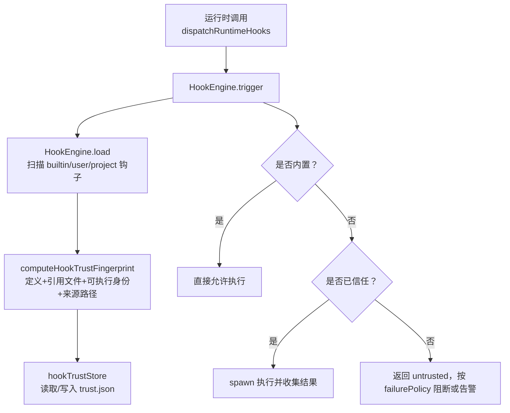
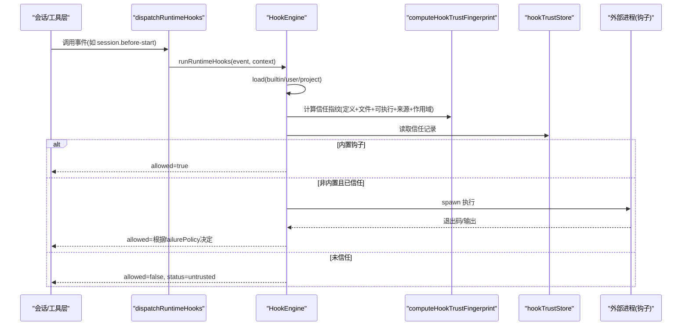
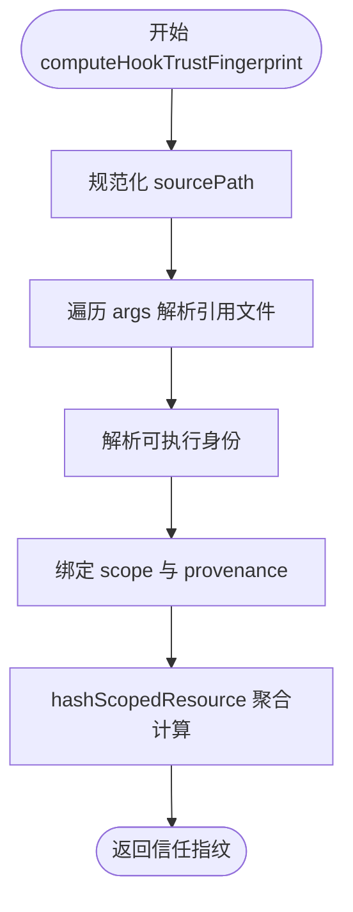
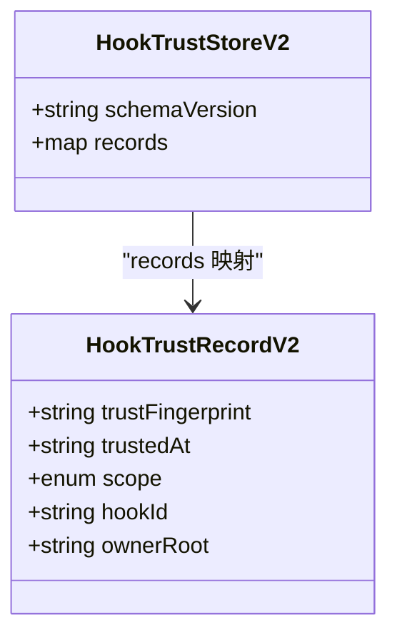
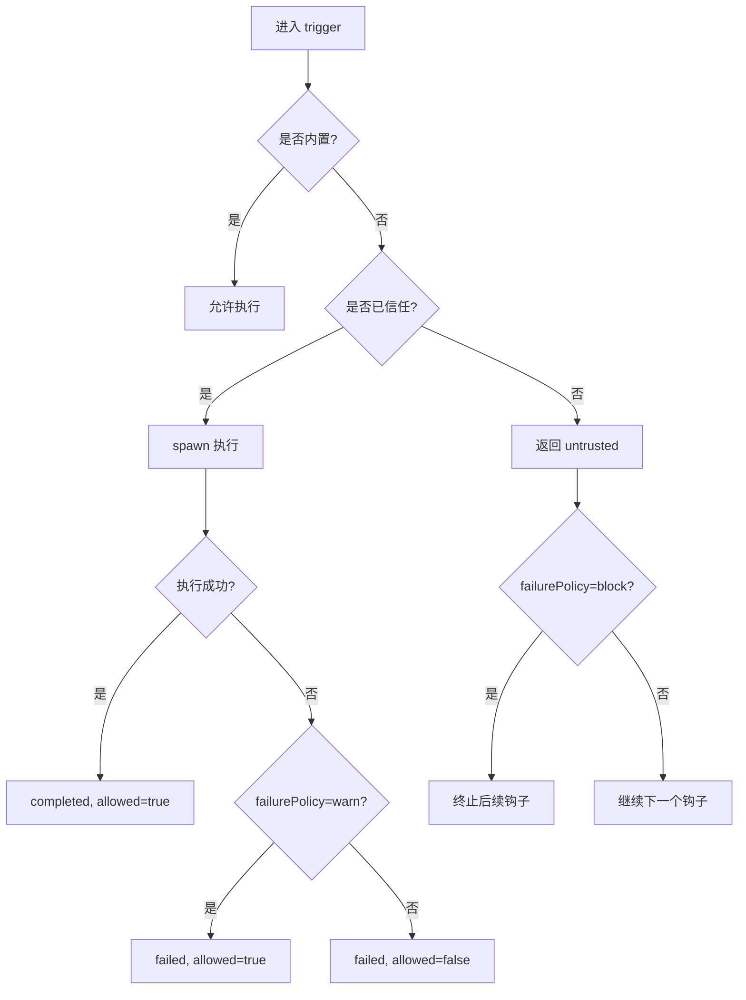
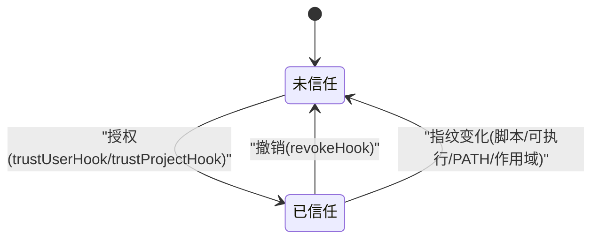
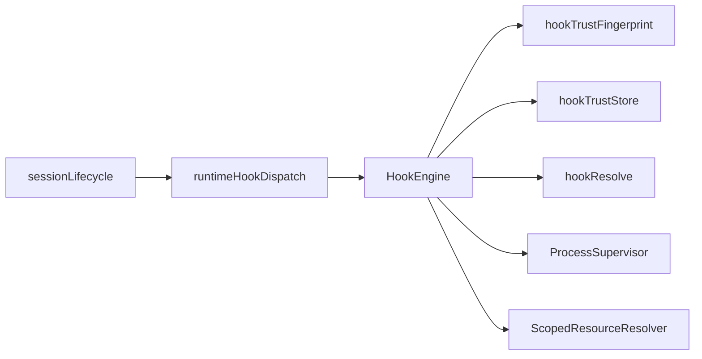

# 钩子信任系统

<cite>
**本文引用的文件**
- [HookEngine.ts](file://src/main/hooks/HookEngine.ts)
- [hookTrustFingerprint.ts](file://src/main/hooks/hookTrustFingerprint.ts)
- [hookTrustStore.ts](file://src/main/hooks/hookTrustStore.ts)
- [hookResolve.ts](file://src/main/hooks/hookResolve.ts)
- [runtimeHookDispatch.ts](file://src/main/hooks/runtimeHookDispatch.ts)
- [sessionLifecycle.ts](file://src/main/hooks/sessionLifecycle.ts)
- [rdxRuntime.ts](file://src/shared/types/rdxRuntime.ts)
- [hookTrustFingerprint.test.ts](file://src/main/hooks/hookTrustFingerprint.test.ts)
- [hookTrustStore.test.ts](file://src/main/hooks/hookTrustStore.test.ts)
- [HookEngine.trustFingerprint.test.ts](file://src/main/hooks/HookEngine.trustFingerprint.test.ts)
</cite>

## 目录
1. [简介](#简介)
2. [项目结构](#项目结构)
3. [核心组件](#核心组件)
4. [架构总览](#架构总览)
5. [详细组件分析](#详细组件分析)
6. [依赖关系分析](#依赖关系分析)
7. [性能考量](#性能考量)
8. [故障排查指南](#故障排查指南)
9. [结论](#结论)
10. [附录](#附录)

## 简介
本文件系统化阐述 RDC-Agent 的“钩子信任系统”，覆盖信任指纹计算、信任存储与迁移、信任决策流程、信任管理方法（授权、撤销、批量）、以及执行期触发与隔离。目标是帮助读者理解：
- 如何为钩子生成稳定且安全的信任指纹；
- 用户钩子与项目钩子的作用域隔离与持久化策略；
- 内置钩子自动信任、用户/项目钩子需显式授权的决策模型；
- 信任状态图与权限矩阵，便于审计与排障。

## 项目结构
钩子信任系统位于主进程 hooks 模块中，围绕 HookEngine 编排加载、信任判定与执行；trust fingerprint 负责安全哈希；trust store 负责持久化与版本迁移；hookResolve 负责命令与参数解析与作用域约束；运行时通过 dispatch 将事件分发到引擎。

图表来源
- [runtimeHookDispatch.ts:5-19](file://src/main/hooks/runtimeHookDispatch.ts#L5-L19)
- [HookEngine.ts:76-129](file://src/main/hooks/HookEngine.ts#L76-L129)
- [HookEngine.ts:214-246](file://src/main/hooks/HookEngine.ts#L214-L246)
- [hookTrustFingerprint.ts:131-149](file://src/main/hooks/hookTrustFingerprint.ts#L131-L149)
- [hookTrustStore.ts:65-100](file://src/main/hooks/hookTrustStore.ts#L65-L100)

章节来源
- [runtimeHookDispatch.ts:5-19](file://src/main/hooks/runtimeHookDispatch.ts#L5-L19)
- [HookEngine.ts:76-129](file://src/main/hooks/HookEngine.ts#L76-L129)
- [hookTrustFingerprint.ts:131-149](file://src/main/hooks/hookTrustFingerprint.ts#L131-L149)
- [hookTrustStore.ts:65-100](file://src/main/hooks/hookTrustStore.ts#L65-L100)

## 核心组件
- HookEngine：钩子生命周期与信任决策中心，负责加载、匹配、执行、授权与撤销。
- hookTrustFingerprint：基于钩子定义、引用文件、可执行身份、来源路径与作用域计算不可伪造的信任指纹。
- hookTrustStore：JSON 格式的信任记录存储，支持 schemaVersion 迁移与向后兼容。
- hookResolve：命令与参数解析，限制内置脚本查找范围，确保相对路径在根内解析。
- runtimeHookDispatch / sessionLifecycle：运行时事件入口，统一调度钩子执行。

章节来源
- [HookEngine.ts:71-377](file://src/main/hooks/HookEngine.ts#L71-L377)
- [hookTrustFingerprint.ts:1-149](file://src/main/hooks/hookTrustFingerprint.ts#L1-L149)
- [hookTrustStore.ts:1-100](file://src/main/hooks/hookTrustStore.ts#L1-L100)
- [hookResolve.ts:1-95](file://src/main/hooks/hookResolve.ts#L1-L95)
- [runtimeHookDispatch.ts:5-19](file://src/main/hooks/runtimeHookDispatch.ts#L5-L19)
- [sessionLifecycle.ts:4-33](file://src/main/hooks/sessionLifecycle.ts#L4-L33)

## 架构总览
下图展示从事件触发到信任判定与执行的完整链路，包括作用域隔离、指纹比对与持久化。

图表来源
- [runtimeHookDispatch.ts:5-19](file://src/main/hooks/runtimeHookDispatch.ts#L5-L19)
- [HookEngine.ts:76-129](file://src/main/hooks/HookEngine.ts#L76-L129)
- [HookEngine.ts:214-246](file://src/main/hooks/HookEngine.ts#L214-L246)
- [hookTrustFingerprint.ts:131-149](file://src/main/hooks/hookTrustFingerprint.ts#L131-L149)
- [hookTrustStore.ts:65-100](file://src/main/hooks/hookTrustStore.ts#L65-L100)

## 详细组件分析

### 信任指纹算法：hookTrustFingerprint
- 输入要素
  - 钩子定义：id、event、command、args、cwd、env、timeoutMs、failurePolicy、matcher。
  - 引用文件集合：对 args 进行作用域感知解析，过滤标志位，仅纳入实际存在的文件，并按 realpath 排序。
  - 可执行身份：resolveExecutableIdentity 会区分 node 命令与 PATH 查找，并对 process.execPath 做缓存与变更检测。
  - 来源与作用域：sourcePath 规范化为 canonicalRealpath，scope 限定 user/project/builtin。
- 关键特性
  - 使用 sha256 对文件字节计算哈希，避免仅依赖 mtime/size。
  - 对 process.execPath 做 token 缓存（realpath + dev/inode/size/mtime），提升稳定性与性能。
  - 对 Windows 平台扩展名（PATHEXT）进行解析，保证跨平台一致性。
  - 最终通过 hashScopedResource 聚合 definition、files、executable、scope、provenance 生成唯一指纹。
- 复杂度与性能
  - 时间复杂度：O(N) 遍历 args 并统计文件哈希；N 为参数数量。
  - 空间复杂度：O(N) 存储文件身份列表。
  - 通过 execPath identity 缓存减少重复 IO。

图表来源
- [hookTrustFingerprint.ts:21-49](file://src/main/hooks/hookTrustFingerprint.ts#L21-L49)
- [hookTrustFingerprint.ts:59-99](file://src/main/hooks/hookTrustFingerprint.ts#L59-L99)
- [hookTrustFingerprint.ts:101-149](file://src/main/hooks/hookTrustFingerprint.ts#L101-L149)

章节来源
- [hookTrustFingerprint.ts:1-149](file://src/main/hooks/hookTrustFingerprint.ts#L1-L149)
- [hookTrustFingerprint.test.ts:30-97](file://src/main/hooks/hookTrustFingerprint.test.ts#L30-L97)

### 信任存储机制：hookTrustStore
- 数据结构
  - 当前 schemaVersion 为 '2'。
  - 记录结构包含：trustFingerprint、trustedAt、scope、hookId、ownerRoot。
  - 键构造：hookTrustKey(scope, ownerRoot, hookId)，ownerRoot 对 project 使用项目根，对用户钩子使用钩子源所在目录。
- 持久化格式
  - JSON 文件，带缩进与换行，便于人类阅读。
  - 读取失败或格式不合法时回退为空存储。
- 版本迁移
  - 若检测到旧版 v1（YAML-only 风格或缺少 trustFingerprint），首次读取时会清空并重写为 v2。
  - 若 schemaVersion 高于当前版本，fail-closed 抛出错误且不改写文件。
- 安全性
  - 严格校验字段类型与必填项，防止脏数据污染。

图表来源
- [hookTrustStore.ts:7-18](file://src/main/hooks/hookTrustStore.ts#L7-L18)
- [hookTrustStore.ts:20-31](file://src/main/hooks/hookTrustStore.ts#L20-L31)
- [hookTrustStore.ts:38-40](file://src/main/hooks/hookTrustStore.ts#L38-L40)

章节来源
- [hookTrustStore.ts:1-100](file://src/main/hooks/hookTrustStore.ts#L1-L100)
- [hookTrustStore.test.ts:19-59](file://src/main/hooks/hookTrustStore.test.ts#L19-L59)

### 命令与参数解析：hookResolve
- 作用域约束
  - 内置钩子：仅允许在官方内置脚本根目录中解析相对名称，防止越权引用。
  - 用户/项目钩子：相对路径从钩子源目录与 cwd 向上最多 8 层搜索，确保可控。
- 命令替换
  - 当 command 为 node/node.exe 时，替换为当前进程可执行路径，并设置 ELECTRON_RUN_AS_NODE 以在 Electron 环境中运行 Node 脚本。
- 工作目录
  - 支持定义中的 cwd，结合 projectRoot 解析绝对路径。

章节来源
- [hookResolve.ts:1-95](file://src/main/hooks/hookResolve.ts#L1-L95)

### 运行时触发与事件分发
- 事件入口
  - runtimeHookDispatch.runRuntimeHooks 加载用户钩子与项目钩子，并调用 HookEngine.trigger。
  - sessionLifecycle 在会话生命周期前后注入事件，如 session.before-start、session.after-end。
- 事件集合
  - 包含 12 个标准事件，覆盖会话、回合、工具、上下文、代理交接与权限拒绝等阶段。

章节来源
- [runtimeHookDispatch.ts:5-19](file://src/main/hooks/runtimeHookDispatch.ts#L5-L19)
- [sessionLifecycle.ts:4-33](file://src/main/hooks/sessionLifecycle.ts#L4-L33)
- [rdxRuntime.ts:103-118](file://src/shared/types/rdxRuntime.ts#L103-L118)

### 信任决策流程与执行
- 决策规则
  - 内置钩子：默认信任，无需存储记录。
  - 用户/项目钩子：需要存在匹配的信任记录且 trustFingerprint 一致才视为已信任。
  - 未信任：返回 untrusted，allowed=false；若 failurePolicy=block 则中断后续钩子执行，warn 则继续。
- 执行细节
  - 通过 ProcessSupervisor 启动子进程，限制输出大小与超时。
  - 捕获异常、超时、spawn 失败等情况，按 failurePolicy 决定是否允许继续。
  - 子进程 stdin 传入上下文，stdout/stderr 截断至最大字节数。

图表来源
- [HookEngine.ts:214-246](file://src/main/hooks/HookEngine.ts#L214-L246)
- [HookEngine.ts:293-368](file://src/main/hooks/HookEngine.ts#L293-L368)

章节来源
- [HookEngine.ts:214-246](file://src/main/hooks/HookEngine.ts#L214-L246)
- [HookEngine.ts:293-368](file://src/main/hooks/HookEngine.ts#L293-L368)

### 信任管理方法
- 授权
  - trustProjectHook(projectRoot, hookId)：对项目作用域的指定钩子授权，写入 trust.json 并更新内存状态。
  - trustUserHook(hookId)：对用户作用域的指定钩子授权。
  - 内部 trustHook 会计算 ownerRoot、写入记录、设置 trustedAt 与 needsRetrust=false。
- 撤销
  - revokeProjectHook(projectRoot, hookId)：撤销某项目的钩子信任。
  - revokeUserHook(hookId)：撤销所有用户作用域的该钩子信任。
  - revokeHook(hookId, projectRoot?)：通用撤销，支持按项目精确删除或批量删除用户作用域记录。
- 批量操作
  - 可通过遍历 loaded 钩子，对每个需要授权的钩子调用 trustUserHook/trustProjectHook；撤销同理。
- 审计日志
  - 信任记录包含 trustedAt 时间戳，可用于审计追踪。
  - 建议在上层服务记录授权/撤销操作的上下文（用户、项目、时间、原因）。

章节来源
- [HookEngine.ts:139-212](file://src/main/hooks/HookEngine.ts#L139-L212)
- [hookTrustStore.ts:38-40](file://src/main/hooks/hookTrustStore.ts#L38-L40)

### 信任状态图

图表来源
- [HookEngine.ts:147-174](file://src/main/hooks/HookEngine.ts#L147-L174)
- [HookEngine.ts:184-212](file://src/main/hooks/HookEngine.ts#L184-L212)
- [hookTrustFingerprint.ts:131-149](file://src/main/hooks/hookTrustFingerprint.ts#L131-L149)

### 权限矩阵（作用域 × 信任模型）
- 内置钩子：自动信任，无需存储记录，不可撤销。
- 用户钩子：需显式授权；撤销时影响所有项目下的同名用户钩子。
- 项目钩子：按项目隔离；同一 hookId 在不同项目中独立信任；撤销需指定项目根。

章节来源
- [HookEngine.ts:97-129](file://src/main/hooks/HookEngine.ts#L97-L129)
- [HookEngine.ts:184-212](file://src/main/hooks/HookEngine.ts#L184-L212)

## 依赖关系分析
- HookEngine 依赖：
  - AppPathService：获取内置/用户/项目钩子路径与应用状态目录。
  - ScopedResourceResolver：解析资源候选并产出 provenance。
  - ProcessSupervisor：安全地启动与监控钩子子进程。
  - hookTrustFingerprint：计算信任指纹。
  - hookTrustStore：读写信任存储。
  - hookResolve：命令与参数解析。
- 运行时依赖：
  - runtimeHookDispatch：统一事件分发。
  - sessionLifecycle：在会话生命周期中触发钩子。

图表来源
- [HookEngine.ts:1-15](file://src/main/hooks/HookEngine.ts#L1-L15)
- [runtimeHookDispatch.ts:1-19](file://src/main/hooks/runtimeHookDispatch.ts#L1-L19)
- [sessionLifecycle.ts:1-33](file://src/main/hooks/sessionLifecycle.ts#L1-L33)

章节来源
- [HookEngine.ts:1-15](file://src/main/hooks/HookEngine.ts#L1-L15)
- [runtimeHookDispatch.ts:1-19](file://src/main/hooks/runtimeHookDispatch.ts#L1-L19)
- [sessionLifecycle.ts:1-33](file://src/main/hooks/sessionLifecycle.ts#L1-L33)

## 性能考量
- 指纹计算
  - 对 process.execPath 的身份进行缓存，避免重复 IO 与哈希。
  - 参数解析时对不存在文件或标志位快速跳过。
- 执行限制
  - 子进程输出限制为固定字节数，防止内存膨胀。
  - 超时控制避免阻塞主流程。
- 存储读写
  - 信任存储采用 JSON 文本，读写开销小；仅在授权/撤销时写入。
- 建议
  - 对高频触发的钩子尽量精简参数与引用文件。
  - 合理设置 timeoutMs 与 failurePolicy，避免长尾任务拖慢整体流程。

[本节提供一般性指导，不直接分析具体文件]

## 故障排查指南
- 常见问题
  - 钩子未信任：检查是否为用户/项目钩子且已授权；确认指纹未因脚本内容、可执行路径或作用域变化而失效。
  - 执行失败：查看 stdout/stderr 与 reason；确认 failurePolicy 是否为 warn 允许继续。
  - 超时：调整 timeoutMs 或优化钩子逻辑。
  - 路径解析失败：确认相对路径是否在钩子源目录或 cwd 可达范围内；内置钩子需在官方根目录。
- 定位步骤
  - 列出 loaded 钩子及其 trust 状态，关注 needsRetrust 与 trustFingerprint。
  - 检查 trust.json 中对应 key 的记录是否存在且匹配。
  - 验证 PATH 与可执行文件是否被替换或链接目标变更。
- 恢复措施
  - 重新授权：trustUserHook/trustProjectHook。
  - 撤销后重建：revokeHook 后再授权。
  - 修复路径或脚本内容后重新授权。

章节来源
- [HookEngine.ts:214-246](file://src/main/hooks/HookEngine.ts#L214-L246)
- [HookEngine.ts:293-368](file://src/main/hooks/HookEngine.ts#L293-L368)
- [hookTrustStore.test.ts:19-59](file://src/main/hooks/hookTrustStore.test.ts#L19-L59)

## 结论
钩子信任系统通过严格的指纹计算、作用域隔离与持久化存储，实现了内置钩子自动信任、用户/项目钩子需显式授权的细粒度安全模型。HookEngine 作为中枢，协调加载、匹配、执行与授权；trust fingerprint 保障变更即失效；trust store 提供可审计的授权历史。配合合理的超时、输出限制与 failurePolicy，可在保证安全的同时维持良好的执行体验。

[本节总结性内容，不直接分析具体文件]

## 附录
- 关键类型
  - HookDefinition：钩子定义，包含 id、event、command、args、cwd、env、timeoutMs、failurePolicy、matcher。
  - HookTrustState：信任状态，包含 trusted、needsRetrust、projectRoot、sourceHash、trustFingerprint、trustedAt。
  - ResourceScope：builtin/user/project 三种作用域。
- 参考测试
  - 指纹变化场景：脚本字节、路径、作用域、可执行身份变化均导致指纹不同。
  - 存储迁移：v1 到 v2 的自动迁移与高版本 fail-closed。
  - 工程隔离：不同项目同名钩子独立信任，撤销互不影响。

章节来源
- [rdxRuntime.ts:120-140](file://src/shared/types/rdxRuntime.ts#L120-L140)
- [hookTrustFingerprint.test.ts:30-97](file://src/main/hooks/hookTrustFingerprint.test.ts#L30-L97)
- [hookTrustStore.test.ts:19-59](file://src/main/hooks/hookTrustStore.test.ts#L19-L59)
- [HookEngine.trustFingerprint.test.ts:109-223](file://src/main/hooks/HookEngine.trustFingerprint.test.ts#L109-L223)