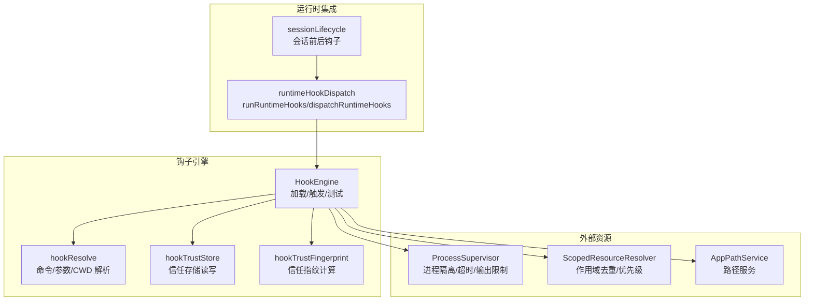
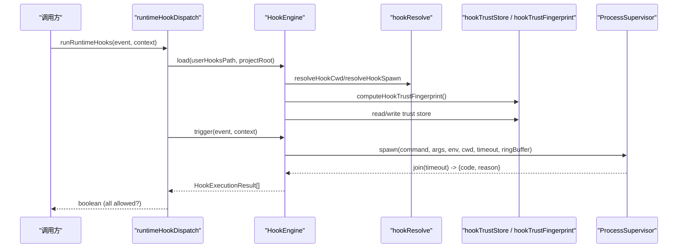
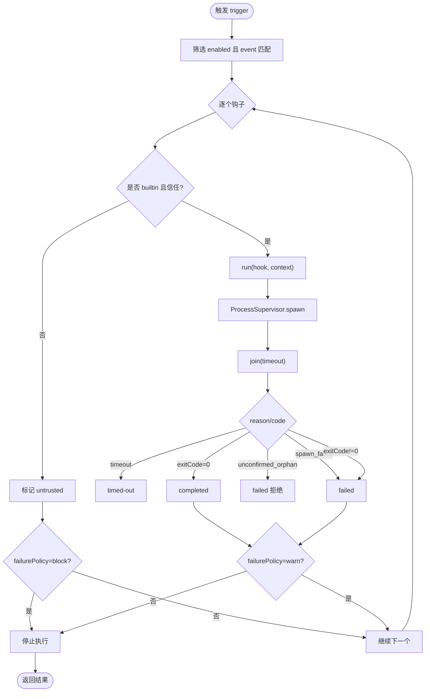
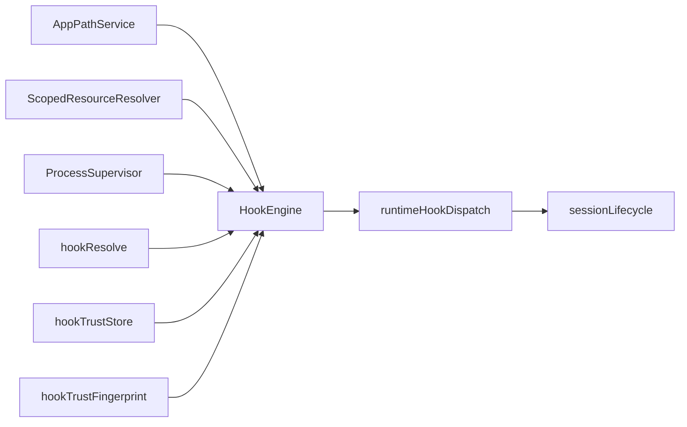
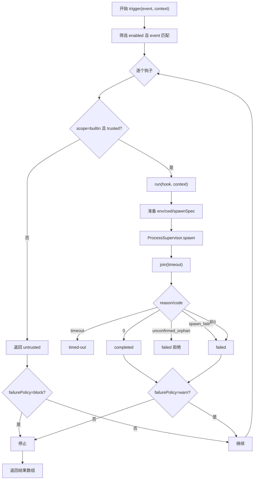
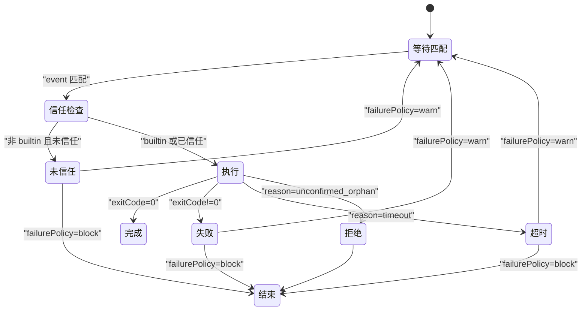

# 钩子引擎核心

<cite>
**本文引用的文件**
- [HookEngine.ts](file://src/main/hooks/HookEngine.ts)
- [hookResolve.ts](file://src/main/hooks/hookResolve.ts)
- [runtimeHookDispatch.ts](file://src/main/hooks/runtimeHookDispatch.ts)
- [sessionLifecycle.ts](file://src/main/hooks/sessionLifecycle.ts)
- [hookTrustStore.ts](file://src/main/hooks/hookTrustStore.ts)
- [hookTrustFingerprint.ts](file://src/main/hooks/hookTrustFingerprint.ts)
- [artifact-integrity.hook.yml](file://resources/agent-runtime/hooks/artifact-integrity.hook.yml)
- [rdx-shell-audit.hook.yml](file://resources/agent-runtime/hooks/rdx-shell-audit.hook.yml)
- [HookEngine.test.ts](file://src/main/hooks/HookEngine.test.ts)
</cite>

## 目录
1. [简介](#简介)
2. [项目结构](#项目结构)
3. [核心组件](#核心组件)
4. [架构总览](#架构总览)
5. [详细组件分析](#详细组件分析)
6. [依赖关系分析](#依赖关系分析)
7. [性能考量](#性能考量)
8. [故障排查指南](#故障排查指南)
9. [结论](#结论)
10. [附录](#附录)

## 简介
本文件聚焦于 RDC-Agent 的“钩子引擎”核心，系统性解析 HookEngine 类及其协作模块。内容覆盖：
- 钩子加载机制：支持 builtin/user/project 三种作用域的扫描、解析与优先级合并
- 生命周期管理：信任存储、指纹计算、撤销与重新信任
- 执行调度：事件匹配、matcher 过滤、进程隔离执行、超时与输出限制
- 测试机制：test() 方法的行为与错误处理策略
- 安全特性：环境变量注入、白名单脚本解析、路径校验、信任指纹、失败策略（block/warn）

## 项目结构
钩子引擎位于 src/main/hooks 目录下，围绕 HookEngine 组织，配合 hookResolve、hookTrustStore、hookTrustFingerprint 等模块实现加载、信任与执行；runtimeHookDispatch 提供运行时入口；sessionLifecycle 在会话生命周期中触发钩子。

图表来源
- [HookEngine.ts:71-129](file://src/main/hooks/HookEngine.ts#L71-L129)
- [hookResolve.ts:49-94](file://src/main/hooks/hookResolve.ts#L49-L94)
- [hookTrustStore.ts:65-100](file://src/main/hooks/hookTrustStore.ts#L65-L100)
- [hookTrustFingerprint.ts:131-149](file://src/main/hooks/hookTrustFingerprint.ts#L131-L149)
- [runtimeHookDispatch.ts:5-19](file://src/main/hooks/runtimeHookDispatch.ts#L5-L19)
- [sessionLifecycle.ts:4-33](file://src/main/hooks/sessionLifecycle.ts#L4-L33)

章节来源
- [HookEngine.ts:71-129](file://src/main/hooks/HookEngine.ts#L71-L129)
- [runtimeHookDispatch.ts:5-19](file://src/main/hooks/runtimeHookDispatch.ts#L5-L19)
- [sessionLifecycle.ts:4-33](file://src/main/hooks/sessionLifecycle.ts#L4-L33)

## 核心组件
- HookEngine：钩子的加载、列表、信任管理、触发与测试的核心类
- hookResolve：命令与参数解析、CWD 确定、内置脚本白名单查找
- hookTrustStore：信任存储的读取/写入与版本兼容
- hookTrustFingerprint：基于定义、作用域、源路径与引用文件的信任指纹计算
- runtimeHookDispatch：对外暴露的运行时钩子调用入口
- sessionLifecycle：在会话创建/结束时触发特定事件

章节来源
- [HookEngine.ts:20-46](file://src/main/hooks/HookEngine.ts#L20-L46)
- [hookResolve.ts:1-94](file://src/main/hooks/hookResolve.ts#L1-L94)
- [hookTrustStore.ts:1-100](file://src/main/hooks/hookTrustStore.ts#L1-L100)
- [hookTrustFingerprint.ts:1-149](file://src/main/hooks/hookTrustFingerprint.ts#L1-L149)
- [runtimeHookDispatch.ts:1-20](file://src/main/hooks/runtimeHookDispatch.ts#L1-L20)
- [sessionLifecycle.ts:1-34](file://src/main/hooks/sessionLifecycle.ts#L1-L34)

## 架构总览
钩子引擎通过“加载-信任-触发”三段式流程工作：
- 加载：扫描 builtin/user/project 三个目录下的 .hook.yml，解析为 HookDefinition，使用 ScopedResourceResolver 进行作用域去重与优先级合并（builtin < user < project），并计算信任指纹
- 信任：根据作用域与 ownerRoot 生成 trustKey，比对信任存储中的指纹决定是否 trusted；用户/项目钩子默认未信任，需显式信任
- 触发：按事件匹配、matcher 过滤后，逐个执行；非信任钩子直接拒绝；执行通过 ProcessSupervisor 隔离，带超时与输出大小限制；根据 failurePolicy 决定阻断或告警

图表来源
- [runtimeHookDispatch.ts:5-19](file://src/main/hooks/runtimeHookDispatch.ts#L5-L19)
- [HookEngine.ts:76-129](file://src/main/hooks/HookEngine.ts#L76-L129)
- [HookEngine.ts:214-246](file://src/main/hooks/HookEngine.ts#L214-L246)
- [HookEngine.ts:293-369](file://src/main/hooks/HookEngine.ts#L293-L369)
- [hookResolve.ts:49-94](file://src/main/hooks/hookResolve.ts#L49-L94)
- [hookTrustFingerprint.ts:131-149](file://src/main/hooks/hookTrustFingerprint.ts#L131-L149)
- [hookTrustStore.ts:65-100](file://src/main/hooks/hookTrustStore.ts#L65-L100)

## 详细组件分析

### HookEngine 类
职责
- 加载钩子：load() 扫描三个作用域目录，解析 YAML，合并优先级，计算信任指纹，构建 LoadedHook
- 信任管理：trustUserHook/trustProjectHook/revokeUserHook/revokeProjectHook 维护信任存储
- 触发执行：trigger() 事件匹配、matcher 过滤、信任校验、进程隔离执行
- 测试能力：test() 针对单个钩子进行测试执行，返回统一结果结构

关键数据结构
- HookContext：事件上下文，包含 agentId/toolName/sessionId/projectRoot/payload
- LoadedHook：已加载钩子，含 definition/scope/sourcePath/sourceHash/trustFingerprint/trust
- HookExecutionResult：执行结果，包含状态、退出码、输出、原因等

加载算法（load）
- 遍历 builtin/user/project 目录，收集所有 .hook.yml 为候选
- 解析 YAML 为 HookDefinition，校验必填字段与 failurePolicy
- 使用 ScopedResourceResolver 合并同 id 的钩子，优先级 builtin < user < project
- 计算信任指纹，结合信任存储判定是否 trusted；project 钩子需要 projectRoot 参与 key 生成
- 将结果缓存到 loaded，供后续触发与测试使用

触发流程（trigger）
- 过滤 enabled=true 且 event 匹配的钩子
- 对每个钩子：若 scope 非 builtin 且未信任，则返回 untrusted；若 failurePolicy=block 则中断
- 否则进入 run()：准备环境变量、CWD、spawnSpec，通过 ProcessSupervisor 隔离执行
- 根据子进程退出码与 reason 映射为 completed/failed/timed-out/untrusted/skipped
- 若 failurePolicy=warn，允许继续；否则遇到失败即停止

测试机制（test）
- 根据 hookId 定位已加载钩子
- 若非 builtin 且未信任，直接返回 untrusted
- 以钩子自身事件构造上下文执行 run()，捕获异常并转换为 failed 结果

信任与撤销
- trustHook：写入信任存储记录，更新内存中的 trust 状态
- revokeHook：删除对应 trustKey 的记录，并刷新内存状态

匹配逻辑（matches）
- matcher.agents/tools 为空表示不限制；存在时要求 context.agentId/toolName 必须命中

执行细节（run）
- 环境变量：复制 process.env，并按定义 env 映射目标名到源值
- CWD：优先使用定义中的 cwd，否则 projectRoot 或当前进程目录
- 命令与参数：通过 hookResolve 解析，内置作用域下仅允许官方脚本根目录下的脚本
- 进程隔离：使用 ProcessSupervisor.spawn，stdin 传入 JSON 化的 HookContext
- 超时控制：使用定义 timeoutMs；join 超时返回 timed-out
- 输出限制：stdout/stderr 最多保留 MAX_OUTPUT_BYTES
- 终止确认：unconfirmed_orphan 视为失败并拒绝

图表来源
- [HookEngine.ts:214-246](file://src/main/hooks/HookEngine.ts#L214-L246)
- [HookEngine.ts:293-369](file://src/main/hooks/HookEngine.ts#L293-L369)

章节来源
- [HookEngine.ts:71-378](file://src/main/hooks/HookEngine.ts#L71-L378)

### hookResolve 模块
职责
- 解析命令：将 node(.exe) 替换为实际可执行路径，并设置 ELECTRON_RUN_AS_NODE
- 解析参数：内置作用域下仅允许官方脚本根目录查找；用户/项目作用域相对路径向上回溯查找
- 解析 CWD：优先使用定义中的 cwd，否则 projectRoot 或进程当前目录
- 组装 spawnSpec：返回 command/args/electronAsNode 或 unresolvedArg

安全要点
- 内置脚本白名单：officialBuiltinScriptRoots 限定搜索范围，防止路径穿越
- isInsideRoot 校验：确保解析后的路径仍在合法根内
- 相对路径回溯：最多向上回溯若干层级，避免任意路径执行

章节来源
- [hookResolve.ts:1-94](file://src/main/hooks/hookResolve.ts#L1-L94)

### 信任存储与指纹
- 信任存储（hookTrustStore）
  - 版本化存储 schemaVersion，兼容旧格式
  - 键空间：user::ownerRoot::id 与 project::ownerRoot::id
  - 读写原子性：写前创建目录，读失败降级为空存储
- 信任指纹（hookTrustFingerprint）
  - 基于 HookDefinition、作用域、源路径、引用文件与可执行文件身份计算
  - 引用文件：解析 args 中的文件路径，计算 realpath+sha256
  - 可执行文件：解析 PATH 或绝对路径，计算 identity
  - 用于检测钩子变更，触发 re-trust

章节来源
- [hookTrustStore.ts:1-100](file://src/main/hooks/hookTrustStore.ts#L1-L100)
- [hookTrustFingerprint.ts:1-149](file://src/main/hooks/hookTrustFingerprint.ts#L1-L149)

### 运行时集成与会话生命周期
- runtimeHookDispatch
  - runRuntimeHooks：先 load 用户钩子，再 trigger 指定事件
  - dispatchRuntimeHooks：聚合结果，全部 allowed 才放行
- sessionLifecycle
  - createSessionWithHooks：在创建会话前触发 session.before-start，拒绝则抛错
  - removeSessionWithHooks：在删除会话后触发 session.after-end

章节来源
- [runtimeHookDispatch.ts:1-20](file://src/main/hooks/runtimeHookDispatch.ts#L1-L20)
- [sessionLifecycle.ts:1-34](file://src/main/hooks/sessionLifecycle.ts#L1-L34)

### 钩子定义示例
- artifact-integrity.hook.yml：拦截 investigation_write 工具调用，检查工件完整性
- rdx-shell-audit.hook.yml：审计 shell 工具调用，记录危险命令

章节来源
- [artifact-integrity.hook.yml:1-12](file://resources/agent-runtime/hooks/artifact-integrity.hook.yml#L1-L12)
- [rdx-shell-audit.hook.yml:1-12](file://resources/agent-runtime/hooks/rdx-shell-audit.hook.yml#L1-L12)

## 依赖关系分析
- HookEngine 依赖
  - AppPathService：获取 builtin/user/project 钩子目录
  - ScopedResourceResolver：作用域去重与优先级合并
  - ProcessSupervisor：进程隔离、超时、输出限制
  - hookResolve：命令/参数/CWD 解析
  - hookTrustStore/hookTrustFingerprint：信任管理与指纹计算
- 被依赖
  - runtimeHookDispatch：对外暴露运行期入口
  - sessionLifecycle：在关键生命周期点触发钩子

图表来源
- [HookEngine.ts:1-15](file://src/main/hooks/HookEngine.ts#L1-L15)
- [runtimeHookDispatch.ts:1-20](file://src/main/hooks/runtimeHookDispatch.ts#L1-L20)
- [sessionLifecycle.ts:1-34](file://src/main/hooks/sessionLifecycle.ts#L1-L34)

章节来源
- [HookEngine.ts:1-15](file://src/main/hooks/HookEngine.ts#L1-L15)
- [runtimeHookDispatch.ts:1-20](file://src/main/hooks/runtimeHookDispatch.ts#L1-L20)
- [sessionLifecycle.ts:1-34](file://src/main/hooks/sessionLifecycle.ts#L1-L34)

## 性能考量
- 加载阶段
  - 文件系统扫描：仅扫描 .hook.yml，排序保证确定性
  - 哈希计算：引用文件与可执行文件采用 sha256，注意大文件或慢盘场景
  - 信任存储读写：JSON 序列化/反序列化开销较小
- 执行阶段
  - 进程隔离：每次触发可能启动子进程，建议批量事件合并或节流
  - 超时控制：合理设置 timeoutMs，避免阻塞主流程
  - 输出限制：MAX_OUTPUT_BYTES 防止 OOM 或控制台刷屏
- 优化建议
  - 复用 HookEngine 实例，避免重复加载
  - 对高频事件（如 tool.before-call）谨慎配置过多钩子
  - 使用 matcher 精确限定 agent/tool，减少不必要匹配

[本节为通用指导，无需具体文件来源]

## 故障排查指南
常见问题与定位
- 钩子未信任
  - 现象：status=untrusted，allowed=false
  - 处理：调用 trustUserHook/trustProjectHook 显式信任；修改钩子后需重新信任
- 内置脚本缺失
  - 现象：resolved 失败，返回 failed，reason 提示未找到官方脚本
  - 处理：确保官方 hooks 目录存在对应脚本；不要试图用同名文件劫持
- 超时
  - 现象：status=timed-out，allowed 取决于 failurePolicy
  - 处理：调整 timeoutMs 或优化钩子逻辑
- 进程启动失败
  - 现象：status=failed，reason 包含 spawn 错误信息
  - 处理：检查命令是否存在、权限是否正确、PATH 是否包含所需可执行文件
- 会话创建被拒绝
  - 现象：抛出 HOOK_DENIED: session.before-start
  - 处理：检查前置钩子是否允许；必要时临时禁用或修复钩子

相关实现参考
- 信任判断与拒绝：[HookEngine.ts:214-246](file://src/main/hooks/HookEngine.ts#L214-L246)
- 超时与输出限制：[HookEngine.ts:293-369](file://src/main/hooks/HookEngine.ts#L293-L369)
- 内置脚本白名单：[hookResolve.ts:13-29](file://src/main/hooks/hookResolve.ts#L13-L29)
- 信任存储读写：[hookTrustStore.ts:65-100](file://src/main/hooks/hookTrustStore.ts#L65-L100)

章节来源
- [HookEngine.ts:214-369](file://src/main/hooks/HookEngine.ts#L214-L369)
- [hookResolve.ts:13-29](file://src/main/hooks/hookResolve.ts#L13-L29)
- [hookTrustStore.ts:65-100](file://src/main/hooks/hookTrustStore.ts#L65-L100)

## 结论
HookEngine 提供了安全、可控、可扩展的钩子系统：
- 通过作用域与优先级机制，实现内置、用户、项目三层扩展
- 以信任指纹与存储保障钩子完整性与可追溯性
- 借助进程隔离、超时与输出限制，确保执行环境安全
- 提供 test() 与 matcher 机制，便于开发与调试
- 与运行时深度集成，在关键生命周期点进行安全拦截与审计

[本节为总结性内容，无需具体文件来源]

## 附录

### 钩子执行流程图（代码级）

图表来源
- [HookEngine.ts:214-246](file://src/main/hooks/HookEngine.ts#L214-L246)
- [HookEngine.ts:293-369](file://src/main/hooks/HookEngine.ts#L293-L369)

### 错误处理状态机图（代码级）

图表来源
- [HookEngine.ts:214-246](file://src/main/hooks/HookEngine.ts#L214-L246)
- [HookEngine.ts:293-369](file://src/main/hooks/HookEngine.ts#L293-L369)

### 测试用例参考
- 内置钩子模板验证与行为断言：[HookEngine.test.ts:112-228](file://src/main/hooks/HookEngine.test.ts#L112-L228)
- 作用域优先级与信任流转：[HookEngine.test.ts:44-85](file://src/main/hooks/HookEngine.test.ts#L44-L85)
- 撤销与保留用户信任：[HookEngine.test.ts:87-110](file://src/main/hooks/HookEngine.test.ts#L87-L110)
- 内置脚本缺失防护：[HookEngine.test.ts:230-290](file://src/main/hooks/HookEngine.test.ts#L230-L290)
- 超时策略验证：[HookEngine.test.ts:323-335](file://src/main/hooks/HookEngine.test.ts#L323-L335)

章节来源
- [HookEngine.test.ts:22-335](file://src/main/hooks/HookEngine.test.ts#L22-L335)