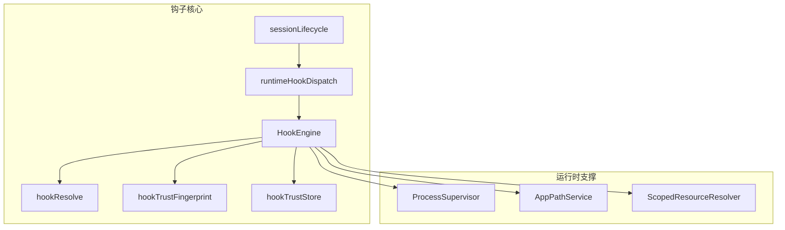
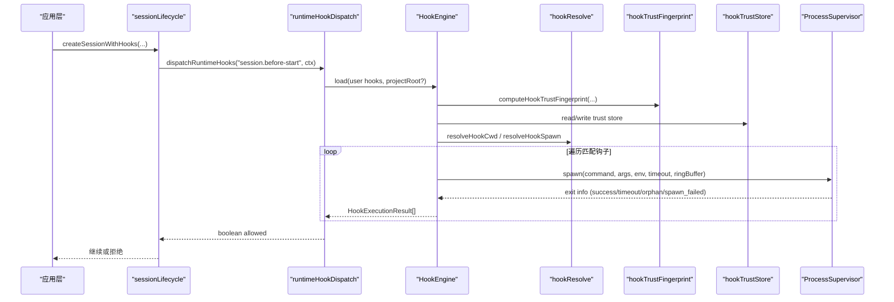
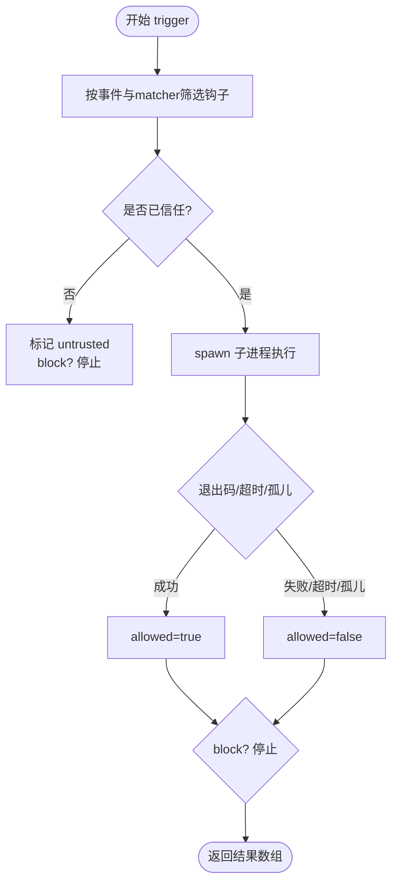
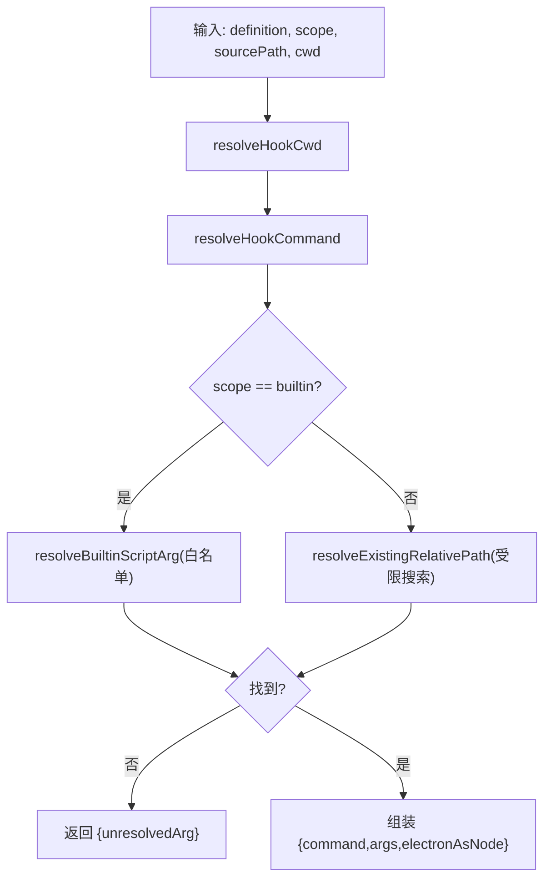
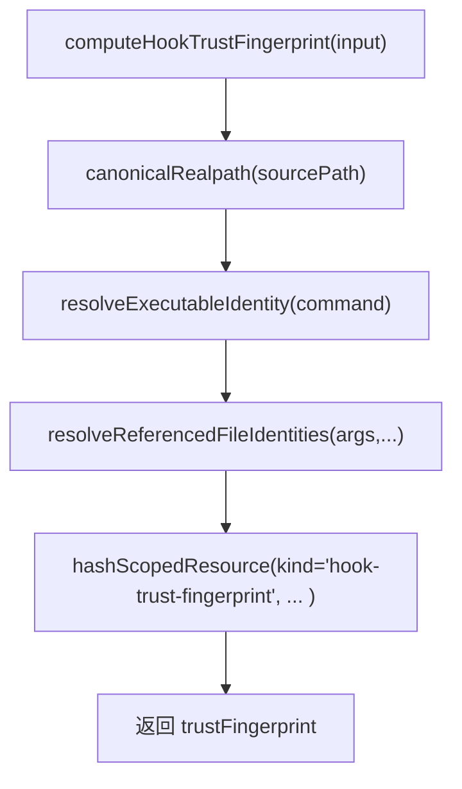
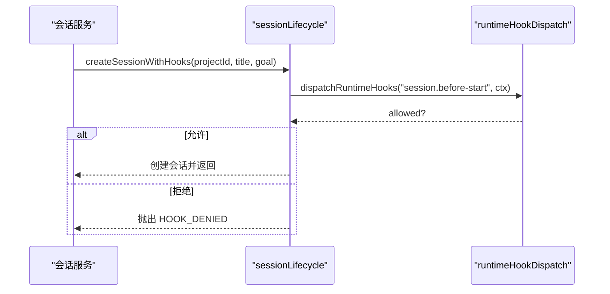
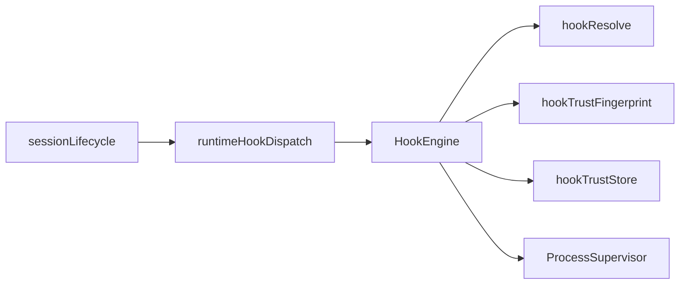
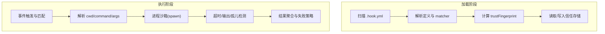

# 钩子系统设计

<cite>
**本文引用的文件**
- [HookEngine.ts](file://src/main/hooks/HookEngine.ts)
- [hookResolve.ts](file://src/main/hooks/hookResolve.ts)
- [hookTrustFingerprint.ts](file://src/main/hooks/hookTrustFingerprint.ts)
- [sessionLifecycle.ts](file://src/main/hooks/sessionLifecycle.ts)
- [runtimeHookDispatch.ts](file://src/main/hooks/runtimeHookDispatch.ts)
- [hookTrustStore.ts](file://src/main/hooks/hookTrustStore.ts)
- [ProcessSupervisor.ts](file://src/main/runtime/ProcessSupervisor.ts)
</cite>

## 目录
1. [简介](#简介)
2. [项目结构](#项目结构)
3. [核心组件](#核心组件)
4. [架构总览](#架构总览)
5. [详细组件分析](#详细组件分析)
6. [依赖关系分析](#依赖关系分析)
7. [性能考虑](#性能考虑)
8. [故障排查指南](#故障排查指南)
9. [结论](#结论)
10. [附录](#附录)

## 简介
本文件系统性地梳理并文档化 RDC-Agent 的钩子系统，重点围绕 HookEngine 的执行引擎与生命周期管理、hookResolve 的解析算法、hookTrustFingerprint 的信任指纹验证、以及 sessionLifecycle 与会话生命周期的集成。同时说明钩子的注册机制、执行顺序控制、错误隔离策略，并阐述安全沙箱、权限验证、性能监控的实现方式。最后提供调试、日志记录与回滚机制的实践建议，并以流程图与安全架构图展示从钩子加载到执行的完整安全链路。

## 项目结构
钩子系统位于 src/main/hooks 下，核心由以下模块组成：
- HookEngine：钩子加载、信任校验、触发执行、结果聚合与失败策略控制。
- hookResolve：工作目录、命令与参数解析，内置脚本白名单查找。
- hookTrustFingerprint：基于定义、作用域、源路径、可执行文件及引用文件的综合哈希，生成信任指纹。
- hookTrustStore：信任存储读写与版本兼容处理。
- runtimeHookDispatch：运行时统一派发钩子事件。
- sessionLifecycle：会话创建/结束前后接入钩子。
- ProcessSupervisor：进程级沙箱（超时、输出环形缓冲、进程树终止、孤儿检测）。

图表来源
- [HookEngine.ts:71-129](file://src/main/hooks/HookEngine.ts#L71-L129)
- [hookResolve.ts:49-94](file://src/main/hooks/hookResolve.ts#L49-L94)
- [hookTrustFingerprint.ts:131-149](file://src/main/hooks/hookTrustFingerprint.ts#L131-L149)
- [hookTrustStore.ts:65-100](file://src/main/hooks/hookTrustStore.ts#L65-L100)
- [runtimeHookDispatch.ts:5-19](file://src/main/hooks/runtimeHookDispatch.ts#L5-L19)
- [sessionLifecycle.ts:4-33](file://src/main/hooks/sessionLifecycle.ts#L4-L33)
- [ProcessSupervisor.ts:167-200](file://src/main/runtime/ProcessSupervisor.ts#L167-L200)

章节来源
- [HookEngine.ts:71-129](file://src/main/hooks/HookEngine.ts#L71-L129)
- [hookResolve.ts:49-94](file://src/main/hooks/hookResolve.ts#L49-L94)
- [hookTrustFingerprint.ts:131-149](file://src/main/hooks/hookTrustFingerprint.ts#L131-L149)
- [hookTrustStore.ts:65-100](file://src/main/hooks/hookTrustStore.ts#L65-L100)
- [runtimeHookDispatch.ts:5-19](file://src/main/hooks/runtimeHookDispatch.ts#L5-L19)
- [sessionLifecycle.ts:4-33](file://src/main/hooks/sessionLifecycle.ts#L4-L33)
- [ProcessSupervisor.ts:167-200](file://src/main/runtime/ProcessSupervisor.ts#L167-L200)

## 核心组件
- HookEngine：负责扫描 builtin/user/project 三类钩子，计算信任指纹，维护信任状态，按事件过滤并顺序执行，支持 block/warn 失败策略与超时控制。
- hookResolve：将 YAML 中的 command/args/cwd 解析为安全的进程启动规格；对内置脚本进行白名单定位，对用户/项目钩子限制相对路径解析范围。
- hookTrustFingerprint：通过定义、作用域、源路径、可执行文件与所有被引用脚本的 SHA-256 计算稳定指纹，用于信任持久化与变更检测。
- hookTrustStore：以 schemaVersion 保护信任存储，兼容旧格式并自动清理不合规数据。
- runtimeHookDispatch：在运行时统一加载用户钩子并触发事件，返回是否全部允许。
- sessionLifecycle：在会话创建前与结束后注入钩子，实现“前置审批”和“后置清理”。
- ProcessSupervisor：为每个钩子子进程提供超时、输出上限、进程组隔离、孤儿检测与强制终止能力。

章节来源
- [HookEngine.ts:20-46](file://src/main/hooks/HookEngine.ts#L20-L46)
- [HookEngine.ts:71-129](file://src/main/hooks/HookEngine.ts#L71-L129)
- [HookEngine.ts:214-246](file://src/main/hooks/HookEngine.ts#L214-L246)
- [hookResolve.ts:49-94](file://src/main/hooks/hookResolve.ts#L49-L94)
- [hookTrustFingerprint.ts:131-149](file://src/main/hooks/hookTrustFingerprint.ts#L131-L149)
- [hookTrustStore.ts:65-100](file://src/main/hooks/hookTrustStore.ts#L65-L100)
- [runtimeHookDispatch.ts:5-19](file://src/main/hooks/runtimeHookDispatch.ts#L5-L19)
- [sessionLifecycle.ts:4-33](file://src/main/hooks/sessionLifecycle.ts#L4-L33)
- [ProcessSupervisor.ts:167-200](file://src/main/runtime/ProcessSupervisor.ts#L167-L200)

## 架构总览
下图展示了从会话生命周期触发到钩子加载、信任校验、进程执行与结果聚合的端到端流程。

图表来源
- [sessionLifecycle.ts:4-33](file://src/main/hooks/sessionLifecycle.ts#L4-L33)
- [runtimeHookDispatch.ts:5-19](file://src/main/hooks/runtimeHookDispatch.ts#L5-L19)
- [HookEngine.ts:71-129](file://src/main/hooks/HookEngine.ts#L71-L129)
- [HookEngine.ts:214-246](file://src/main/hooks/HookEngine.ts#L214-L246)
- [hookResolve.ts:49-94](file://src/main/hooks/hookResolve.ts#L49-L94)
- [hookTrustFingerprint.ts:131-149](file://src/main/hooks/hookTrustFingerprint.ts#L131-L149)
- [hookTrustStore.ts:65-100](file://src/main/hooks/hookTrustStore.ts#L65-L100)
- [ProcessSupervisor.ts:167-200](file://src/main/runtime/ProcessSupervisor.ts#L167-L200)

## 详细组件分析

### HookEngine：执行引擎与生命周期管理
- 钩子加载与作用域优先级：builtin → user → project，使用 ScopedResourceResolver 合并去重，后者优先覆盖前者。
- 信任判定：builtin 默认可信；user/project 需与信任存储中记录的 trustFingerprint 一致才可信。
- 触发执行：按事件与 matcher（agentId/toolName）过滤，依次执行；未信任直接标记 untrusted，block 策略中断后续执行。
- 失败策略：failurePolicy=block 时，任何不允许的结果都会中止后续钩子；warn 则继续收集结果。
- 进程隔离：通过 ProcessSupervisor 启动子进程，限制 stdout/stderr 大小，设置超时，检测孤儿进程。
- 测试与调试：test(hookId, context) 可单独运行指定钩子，便于问题定位。

图表来源
- [HookEngine.ts:214-246](file://src/main/hooks/HookEngine.ts#L214-L246)
- [HookEngine.ts:293-369](file://src/main/hooks/HookEngine.ts#L293-L369)

章节来源
- [HookEngine.ts:71-129](file://src/main/hooks/HookEngine.ts#L71-L129)
- [HookEngine.ts:214-246](file://src/main/hooks/HookEngine.ts#L214-L246)
- [HookEngine.ts:293-369](file://src/main/hooks/HookEngine.ts#L293-L369)

### hookResolve：钩子解析算法
- 工作目录：优先使用定义中的 cwd，否则使用 projectRoot 或当前工作目录。
- 命令解析：若 command 为 node，则替换为 process.execPath，并在非 Node 环境下设置 ELECTRON_RUN_AS_NODE。
- 参数解析：
  - 内置作用域：仅允许在官方内置脚本根目录内解析相对路径，防止越权访问。
  - 用户/项目作用域：仅在源目录与 cwd 向上最多 8 层范围内解析相对路径，避免任意路径注入。
- 返回值：若无法解析内置脚本，返回 unresolvedArg，调用方据此拒绝执行。

图表来源
- [hookResolve.ts:49-94](file://src/main/hooks/hookResolve.ts#L49-L94)

章节来源
- [hookResolve.ts:49-94](file://src/main/hooks/hookResolve.ts#L49-L94)

### hookTrustFingerprint：信任指纹验证
- 输入包含：HookDefinition、作用域、源路径、projectRoot。
- 可执行身份：解析 command 对应的可执行文件真实路径与 SHA-256；若不可用则记录 unresolved。
- 引用文件身份：对 args 中非标志位参数进行解析，收集存在且为文件的真实路径与 SHA-256。
- 指纹计算：结合定义、作用域、源路径、可执行身份与引用文件集合，生成稳定指纹，用于信任持久化与变更检测。
- 变更检测：任一引用文件或可执行内容变化都会导致指纹变化，从而要求重新授权。

图表来源
- [hookTrustFingerprint.ts:131-149](file://src/main/hooks/hookTrustFingerprint.ts#L131-L149)
- [hookTrustFingerprint.ts:81-99](file://src/main/hooks/hookTrustFingerprint.ts#L81-L99)
- [hookTrustFingerprint.ts:101-129](file://src/main/hooks/hookTrustFingerprint.ts#L101-L129)

章节来源
- [hookTrustFingerprint.ts:81-99](file://src/main/hooks/hookTrustFingerprint.ts#L81-L99)
- [hookTrustFingerprint.ts:101-129](file://src/main/hooks/hookTrustFingerprint.ts#L101-L129)
- [hookTrustFingerprint.ts:131-149](file://src/main/hooks/hookTrustFingerprint.ts#L131-L149)

### sessionLifecycle：会话生命周期集成
- 会话创建前：调用 dispatchRuntimeHooks('session.before-start')，若任一钩子拒绝则抛出错误阻止创建。
- 会话结束后：先删除会话记录，再调用 'session.after-end' 进行清理审计等后置操作。
- 上下文传递：包含 sessionId、projectRoot、payload 等，供钩子判断与决策。

图表来源
- [sessionLifecycle.ts:4-33](file://src/main/hooks/sessionLifecycle.ts#L4-L33)
- [runtimeHookDispatch.ts:5-19](file://src/main/hooks/runtimeHookDispatch.ts#L5-L19)

章节来源
- [sessionLifecycle.ts:4-33](file://src/main/hooks/sessionLifecycle.ts#L4-L33)
- [runtimeHookDispatch.ts:5-19](file://src/main/hooks/runtimeHookDispatch.ts#L5-L19)

### 钩子注册机制与执行顺序控制
- 注册来源：builtin（应用内置）、user（用户目录）、project（项目目录），通过 HookEngine.load 扫描 .hook.yml。
- 覆盖规则：相同 id 的钩子，project > user > builtin，后者被前者覆盖。
- 执行顺序：按加载顺序依次执行，遇到 failurePolicy=block 且结果不允许时立即停止。
- 匹配条件：event 必须匹配，可选 matcher.agents/matcher.tools 进一步限定。

章节来源
- [HookEngine.ts:76-129](file://src/main/hooks/HookEngine.ts#L76-L129)
- [HookEngine.ts:214-246](file://src/main/hooks/HookEngine.ts#L214-L246)

### 错误隔离策略
- 进程级隔离：每个钩子独立子进程，通过 ProcessSupervisor 管理生命周期。
- 超时与输出限制：默认超时与最大输出字节数，防止资源耗尽。
- 孤儿检测：子进程退出未确认视为异常，拒绝执行。
- 异常捕获：单个钩子抛错不影响其他钩子执行，结果独立记录。

章节来源
- [HookEngine.ts:293-369](file://src/main/hooks/HookEngine.ts#L293-L369)
- [ProcessSupervisor.ts:167-200](file://src/main/runtime/ProcessSupervisor.ts#L167-L200)

### 安全沙箱、权限验证与性能监控
- 安全沙箱：
  - 作用域限制：内置脚本仅限官方目录解析；用户/项目脚本相对路径受限搜索。
  - 环境变量隔离：仅复制必要的环境变量，避免泄露敏感信息。
  - 进程树终止：跨平台安全终止子进程及其子树。
- 权限验证：
  - 信任存储：user/project 钩子需显式信任，指纹变化即失效。
  - 撤销机制：revokeUserHook/revokeProjectHook 可撤销信任。
- 性能监控：
  - 输出环形缓冲：限制内存占用，避免大输出拖垮主进程。
  - 超时控制：防止长时间阻塞。
  - 孤儿检测：及时回收异常进程。

章节来源
- [hookResolve.ts:49-94](file://src/main/hooks/hookResolve.ts#L49-L94)
- [hookTrustStore.ts:65-100](file://src/main/hooks/hookTrustStore.ts#L65-L100)
- [ProcessSupervisor.ts:167-200](file://src/main/runtime/ProcessSupervisor.ts#L167-L200)

### 调试、日志记录与回滚机制
- 调试：
  - test(hookId, context) 单独运行指定钩子，便于快速验证。
  - 通过 stdout/stderr 获取执行输出，便于问题定位。
- 日志记录：
  - 子进程输出被 RingBuffer 缓存，可在失败时作为诊断依据。
  - 信任存储写入时间戳，便于审计。
- 回滚机制：
  - 钩子本身无内置回滚；建议在钩子逻辑中实现幂等与补偿。
  - 可通过撤销信任与禁用钩子快速阻断风险。

章节来源
- [HookEngine.ts:248-273](file://src/main/hooks/HookEngine.ts#L248-L273)
- [HookEngine.ts:293-369](file://src/main/hooks/HookEngine.ts#L293-L369)
- [hookTrustStore.ts:65-100](file://src/main/hooks/hookTrustStore.ts#L65-L100)

## 依赖关系分析

图表来源
- [HookEngine.ts:71-129](file://src/main/hooks/HookEngine.ts#L71-L129)
- [runtimeHookDispatch.ts:5-19](file://src/main/hooks/runtimeHookDispatch.ts#L5-L19)
- [sessionLifecycle.ts:4-33](file://src/main/hooks/sessionLifecycle.ts#L4-L33)

章节来源
- [HookEngine.ts:71-129](file://src/main/hooks/HookEngine.ts#L71-L129)
- [runtimeHookDispatch.ts:5-19](file://src/main/hooks/runtimeHookDispatch.ts#L5-L19)
- [sessionLifecycle.ts:4-33](file://src/main/hooks/sessionLifecycle.ts#L4-L33)

## 性能考虑
- 减少不必要的钩子：通过 matcher 精确匹配 agentId 与 toolName，降低执行面。
- 合理设置超时：根据钩子复杂度配置 timeoutMs，避免阻塞关键路径。
- 控制输出大小：ringBufferBytes 限制输出内存占用，避免 OOM。
- 复用信任：指纹稳定后可长期有效，减少重复授权开销。

[本节为通用指导，不直接分析具体文件]

## 故障排查指南
- 常见错误类型：
  - untrusted：未信任的 user/project 钩子被拒绝执行。
  - timed-out：钩子执行超时。
  - failed：子进程启动失败或非零退出码。
  - unconfirmed_orphan：子进程退出未确认，视为异常。
- 排查步骤：
  - 使用 test(hookId, context) 单独运行钩子，观察 stdout/stderr。
  - 检查信任存储是否过期或被撤销。
  - 核对 command/args 解析是否正确，尤其是内置脚本与相对路径。
  - 查看 ProcessSupervisor 的退出原因与输出。
- 恢复措施：
  - 重新信任：trustUserHook/trustProjectHook。
  - 撤销信任：revokeUserHook/revokeProjectHook。
  - 调整超时与失败策略。

章节来源
- [HookEngine.ts:214-246](file://src/main/hooks/HookEngine.ts#L214-L246)
- [HookEngine.ts:293-369](file://src/main/hooks/HookEngine.ts#L293-L369)
- [hookTrustStore.ts:65-100](file://src/main/hooks/hookTrustStore.ts#L65-L100)

## 结论
本钩子系统通过严格的解析、信任指纹与进程沙箱，实现了可扩展、可审计、可回退的安全扩展点。HookEngine 提供统一的加载、匹配与执行框架；hookResolve 确保命令与参数安全；hookTrustFingerprint 保障代码完整性；ProcessSupervisor 提供健壮的资源管理与隔离。配合 sessionLifecycle 的集成，可在关键业务节点实施前置审批与后置审计，形成完整的“加载—验证—执行—审计”闭环。

[本节为总结性内容，不直接分析具体文件]

## 附录

### 安全架构图（从钩子加载到执行的完整安全链路）

图表来源
- [HookEngine.ts:71-129](file://src/main/hooks/HookEngine.ts#L71-L129)
- [HookEngine.ts:214-246](file://src/main/hooks/HookEngine.ts#L214-L246)
- [hookResolve.ts:49-94](file://src/main/hooks/hookResolve.ts#L49-L94)
- [hookTrustFingerprint.ts:131-149](file://src/main/hooks/hookTrustFingerprint.ts#L131-L149)
- [hookTrustStore.ts:65-100](file://src/main/hooks/hookTrustStore.ts#L65-L100)
- [ProcessSupervisor.ts:167-200](file://src/main/runtime/ProcessSupervisor.ts#L167-L200)