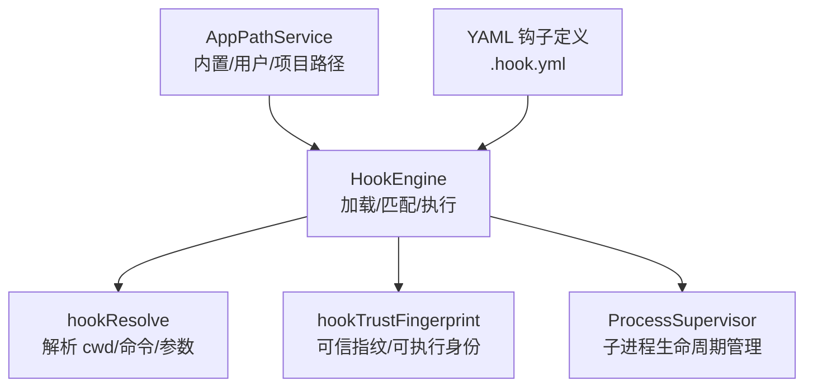
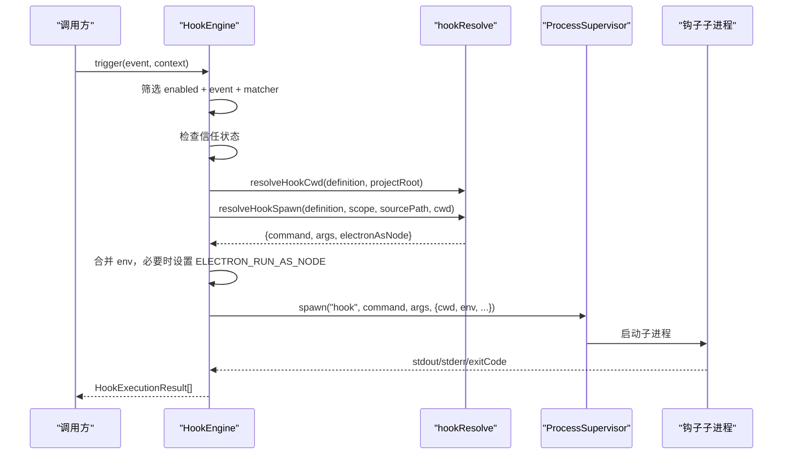
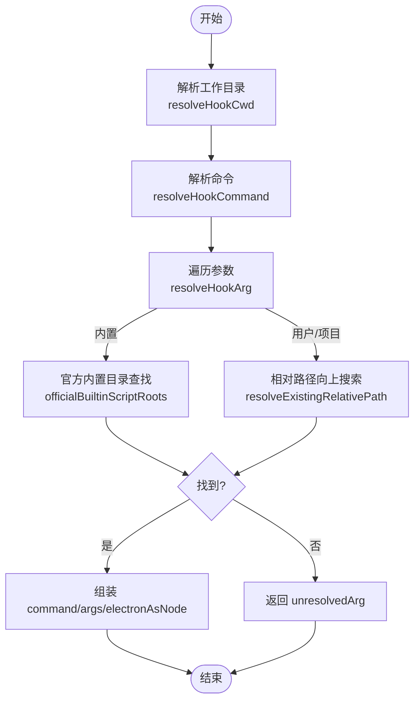
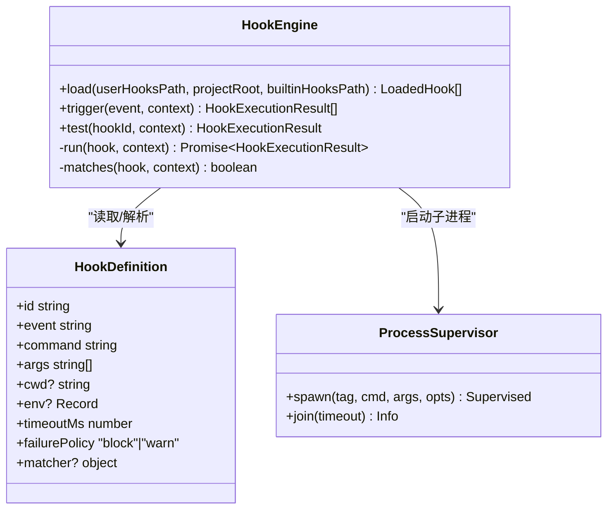
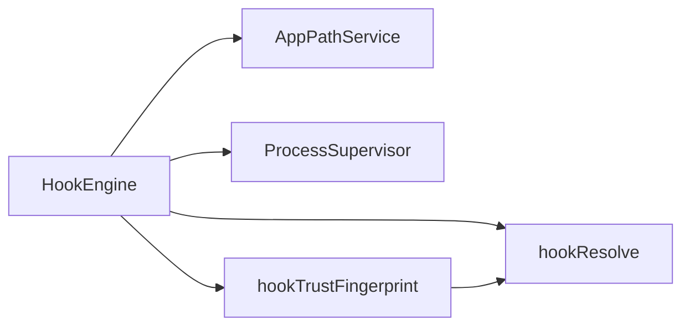
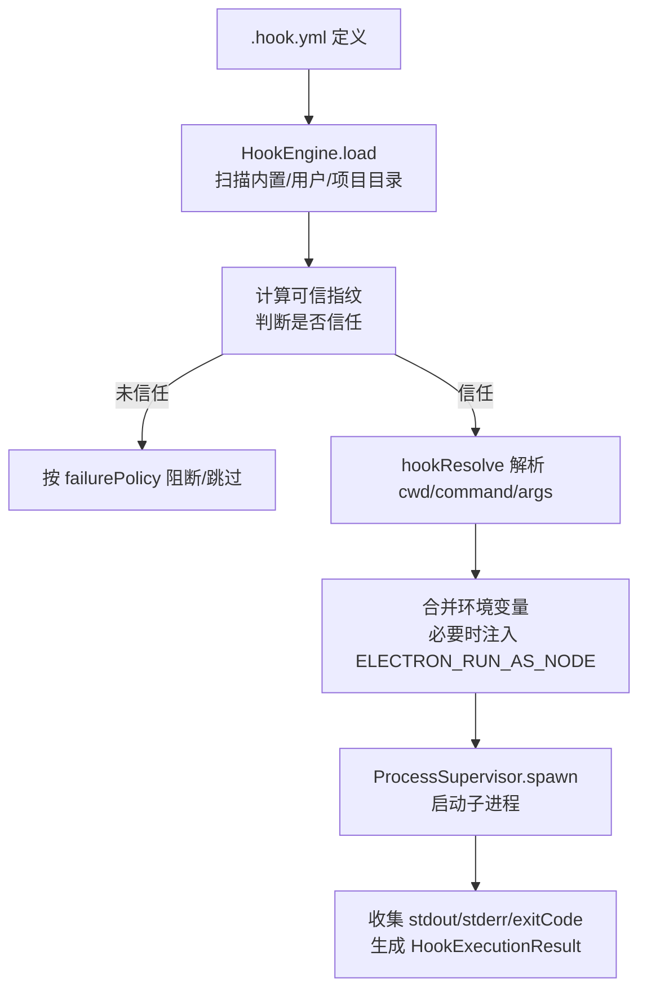

# 钩子解析机制

<cite>
**本文引用的文件**
- [hookResolve.ts](file://src/main/hooks/hookResolve.ts)
- [HookEngine.ts](file://src/main/hooks/HookEngine.ts)
- [runtimeHookDispatch.ts](file://src/main/hooks/runtimeHookDispatch.ts)
- [AppPathService.ts](file://src/main/runtime/AppPathService.ts)
- [hookTrustFingerprint.ts](file://src/main/hooks/hookTrustFingerprint.ts)
- [artifact-integrity.hook.yml](file://resources/agent-runtime/hooks/artifact-integrity.hook.yml)
- [report-contract.hook.yml](file://resources/agent-runtime/hooks/report-contract.hook.yml)
</cite>

## 目录
1. [简介](#简介)
2. [项目结构](#项目结构)
3. [核心组件](#核心组件)
4. [架构总览](#架构总览)
5. [详细组件分析](#详细组件分析)
6. [依赖关系分析](#依赖关系分析)
7. [性能考虑](#性能考虑)
8. [故障排查指南](#故障排查指南)
9. [结论](#结论)
10. [附录](#附录)

## 简介
本文件系统性梳理 RDC-Agent 的“钩子解析机制”，聚焦 hookResolve 模块的钩子路径解析算法、工作目录解析与进程启动参数生成，覆盖内置钩子与用户/项目钩子的不同解析策略、环境变量注入、Electron Node.js 模式支持、命令验证与安全沙箱配置。文档提供从钩子定义到可执行进程的完整流程图与路径映射表，帮助读者理解钩子如何被定位、校验并安全地以独立子进程运行。

## 项目结构
钩子系统位于 main 进程，围绕 HookEngine 编排加载、信任校验与执行；hookResolve 负责将声明式 YAML 中的 command/args/cwd/env 转换为安全的进程启动参数；AppPathService 提供内置/用户/项目资源根路径；hookTrustFingerprint 计算可信指纹并参与信任决策。

图表来源
- [HookEngine.ts:76-129](file://src/main/hooks/HookEngine.ts#L76-L129)
- [hookResolve.ts:49-94](file://src/main/hooks/hookResolve.ts#L49-L94)
- [AppPathService.ts:101-159](file://src/main/runtime/AppPathService.ts#L101-L159)

章节来源
- [HookEngine.ts:76-129](file://src/main/hooks/HookEngine.ts#L76-L129)
- [AppPathService.ts:101-159](file://src/main/runtime/AppPathService.ts#L101-L159)

## 核心组件
- hookResolve：解析工作目录、命令、参数，处理内置脚本查找优先级、相对路径规范化、Electron 作为 Node 运行时切换。
- HookEngine：扫描并加载 .hook.yml，计算可信指纹，按事件触发钩子，构造环境并调用 ProcessSupervisor 启动子进程。
- AppPathService：提供内置钩子目录、用户钩子目录、项目钩子目录等路径。
- hookTrustFingerprint：基于可执行文件和引用文件的真实路径与哈希计算可信指纹，辅助信任存储。

章节来源
- [hookResolve.ts:1-94](file://src/main/hooks/hookResolve.ts#L1-L94)
- [HookEngine.ts:48-129](file://src/main/hooks/HookEngine.ts#L48-L129)
- [AppPathService.ts:101-159](file://src/main/runtime/AppPathService.ts#L101-L159)
- [hookTrustFingerprint.ts:81-149](file://src/main/hooks/hookTrustFingerprint.ts#L81-L149)

## 架构总览
钩子执行的关键流程如下：
- 加载阶段：HookEngine 扫描内置/用户/项目目录下的 .hook.yml，解析为 HookDefinition，计算可信指纹并记录信任状态。
- 触发阶段：根据事件类型与 matcher 过滤匹配的钩子，若未信任则跳过或阻断（取决于 failurePolicy）。
- 解析阶段：hookResolve 解析 cwd、command、args，处理内置脚本优先查找、相对路径向上搜索、Electron 作为 Node 运行时的替换。
- 执行阶段：HookEngine 合并环境变量，设置 ELECTRON_RUN_AS_NODE（当 Electron 作为 Node 运行时），通过 ProcessSupervisor 启动子进程，限制输出大小与超时，收集结果。

图表来源
- [HookEngine.ts:214-369](file://src/main/hooks/HookEngine.ts#L214-L369)
- [hookResolve.ts:49-94](file://src/main/hooks/hookResolve.ts#L49-L94)

## 详细组件分析

### hookResolve：钩子路径与参数解析
- 工作目录解析 resolveHookCwd()
  - 若定义中指定 cwd，则以 projectRoot 为基准进行绝对化解析；否则使用 process.cwd()。
  - 该逻辑确保钩子在期望的项目上下文中运行。
- 命令解析 resolveHookCommand()
  - 若 command 为 node/node.exe，则将实际执行器替换为当前进程的可执行路径（process.execPath），并标记 electronAsNode。
  - 当 Electron 作为 Node 运行时，后续会注入 ELECTRON_RUN_AS_NODE=1，使脚本在 Node 模式下执行。
- 参数解析 resolveHookArg()
  - 内置作用域（builtin）：优先在官方内置钩子目录中查找脚本名（支持仅文件名与 basename 两种形式），若找不到返回 unresolved。
  - 用户/项目作用域（user/project）：对非标志类参数进行相对路径解析，先在钩子源文件所在目录，再在当前工作目录下逐级向上最多 8 层查找，找到即返回绝对路径。
- 进程启动参数生成 resolveHookSpawn()
  - 组合命令与所有已解析的参数，返回最终用于 spawn 的 {command, args, electronAsNode}。
  - 任一参数无法解析时，整体返回 unresolved，由上层决定失败策略。

图表来源
- [hookResolve.ts:13-29](file://src/main/hooks/hookResolve.ts#L13-L29)
- [hookResolve.ts:31-47](file://src/main/hooks/hookResolve.ts#L31-L47)
- [hookResolve.ts:49-94](file://src/main/hooks/hookResolve.ts#L49-L94)

章节来源
- [hookResolve.ts:1-94](file://src/main/hooks/hookResolve.ts#L1-L94)

### HookEngine：加载、信任与执行
- 加载与范围
  - 依次扫描内置、用户、项目三个钩子目录，解析 .hook.yml 为 HookDefinition。
  - 使用 scopedResourceResolver 去重并按来源范围（scope）组织。
- 信任与指纹
  - 计算可信指纹，包含定义、作用域、源路径、projectRoot、引用文件与可执行文件身份。
  - 内置钩子默认信任；用户/项目钩子需存在于信任存储且指纹匹配。
- 执行与沙箱
  - 合并环境变量，并将 env 映射为目标名称（例如将某个系统变量映射到钩子可见的环境键）。
  - 当 electronAsNode 为真时，注入 ELECTRON_RUN_AS_NODE=1。
  - 通过 ProcessSupervisor 启动子进程，限制 stdio 管道、隐藏窗口、输出大小上限与超时。
  - 捕获超时、spawn 失败、孤儿进程等异常，按 failurePolicy 决定是否阻断后续钩子。

图表来源
- [HookEngine.ts:48-129](file://src/main/hooks/HookEngine.ts#L48-L129)
- [HookEngine.ts:293-369](file://src/main/hooks/HookEngine.ts#L293-L369)

章节来源
- [HookEngine.ts:48-129](file://src/main/hooks/HookEngine.ts#L48-L129)
- [HookEngine.ts:214-369](file://src/main/hooks/HookEngine.ts#L214-L369)

### AppPathService：路径与范围
- 内置钩子目录：来自打包资源的 agent-runtime/hooks。
- 用户钩子目录：用户 RDX 根下的 hooks。
- 项目钩子目录：项目 .rdx/hooks。
- 这些路径在 HookEngine.load 中被依次扫描，形成候选列表。

章节来源
- [AppPathService.ts:101-159](file://src/main/runtime/AppPathService.ts#L101-L159)

### 信任与指纹：hookTrustFingerprint
- 可执行身份：解析 command 为绝对路径或在 PATH 中查找，若为 node 则使用当前进程可执行路径。
- 引用文件身份：对 args 中的文件参数进行解析与存在性检查，计算真实路径与 SHA-256。
- 可信指纹：综合定义、作用域、源路径、projectRoot、引用文件与可执行文件身份，生成稳定指纹，用于信任存储比对。

章节来源
- [hookTrustFingerprint.ts:81-149](file://src/main/hooks/hookTrustFingerprint.ts#L81-L149)

## 依赖关系分析
- HookEngine 依赖 hookResolve 完成 cwd/command/args 的安全解析。
- HookEngine 依赖 AppPathService 获取各范围的钩子目录。
- HookEngine 依赖 ProcessSupervisor 实现子进程生命周期管理与资源隔离。
- hookTrustFingerprint 依赖 hookResolve 提供的解析能力，确保指纹计算与实际执行一致。

图表来源
- [HookEngine.ts:1-16](file://src/main/hooks/HookEngine.ts#L1-L16)
- [hookResolve.ts:1-94](file://src/main/hooks/hookResolve.ts#L1-L94)
- [hookTrustFingerprint.ts:1-149](file://src/main/hooks/hookTrustFingerprint.ts#L1-L149)

章节来源
- [HookEngine.ts:1-16](file://src/main/hooks/HookEngine.ts#L1-L16)

## 性能考虑
- 参数解析采用有限深度（最多 8 层）的相对路径搜索，避免无限递归与过多文件系统访问。
- 子进程输出限制为固定字节上限，防止内存膨胀。
- 超时控制避免长时间阻塞主线程。
- 内置脚本查找仅在少量已知目录中进行，减少 I/O。

[本节为通用指导，不直接分析具体文件]

## 故障排查指南
- 内置脚本未找到
  - 现象：resolveHookArg 返回 unresolvedArg。
  - 原因：在官方内置钩子目录中未找到对应脚本名。
  - 处理：确认脚本位于内置钩子目录或使用绝对路径/相对路径指向可用文件。
- 钩子未信任
  - 现象：执行结果为 untrusted。
  - 原因：用户/项目钩子未在信任存储中记录或指纹不匹配。
  - 处理：重新信任该钩子（trustUserHook/trustProjectHook）。
- 子进程启动失败
  - 现象：spawn_failed。
  - 原因：命令不可执行、权限不足或路径错误。
  - 处理：检查 command 与 args 是否可解析为有效可执行文件。
- 超时
  - 现象：timed-out。
  - 原因：钩子执行超过 timeoutMs。
  - 处理：优化钩子逻辑或调整超时。
- 孤儿进程
  - 现象：unconfirmed_orphan。
  - 原因：子进程终止未被确认。
  - 处理：检查进程组隔离与清理逻辑。

章节来源
- [HookEngine.ts:214-369](file://src/main/hooks/HookEngine.ts#L214-L369)

## 结论
hookResolve 提供了健壮的路径解析与参数生成机制，结合 HookEngine 的信任模型与 ProcessSupervisor 的沙箱执行，实现了从声明式钩子到安全子进程的端到端转换。内置钩子享有更高优先级与默认信任，用户/项目钩子则需要显式信任与严格的路径解析。通过环境变量注入与 Electron Node.js 模式支持，钩子可在受限环境中可靠运行。

[本节为总结，不直接分析具体文件]

## 附录

### 钩子解析流程图（从定义到进程）

图表来源
- [HookEngine.ts:76-129](file://src/main/hooks/HookEngine.ts#L76-L129)
- [HookEngine.ts:214-369](file://src/main/hooks/HookEngine.ts#L214-L369)
- [hookResolve.ts:49-94](file://src/main/hooks/hookResolve.ts#L49-L94)

### 路径映射表（内置 vs 用户/项目）
- 内置作用域（builtin）
  - 查找顺序：钩子源文件所在目录 → 应用内置钩子目录 → 打包资源中的 agent-runtime/hooks。
  - 规则：仅文件名或 basename 均可匹配；必须位于目标根目录内且存在。
- 用户/项目作用域（user/project）
  - 查找顺序：钩子源文件所在目录 → 当前工作目录 → 向上最多 8 层父目录。
  - 规则：忽略空参数与以“-”开头的标志；返回绝对路径或原样返回未解析参数。

章节来源
- [hookResolve.ts:13-29](file://src/main/hooks/hookResolve.ts#L13-L29)
- [hookResolve.ts:31-47](file://src/main/hooks/hookResolve.ts#L31-L47)

### 示例钩子定义
- artifact-integrity.hook.yml：使用内置脚本 artifact-integrity.mjs，在工具调用前拦截。
- report-contract.hook.yml：使用内置脚本 report-contract.mjs，校验报告契约。

章节来源
- [artifact-integrity.hook.yml:1-12](file://resources/agent-runtime/hooks/artifact-integrity.hook.yml#L1-L12)
- [report-contract.hook.yml:1-12](file://resources/agent-runtime/hooks/report-contract.hook.yml#L1-L12)

### 环境变量处理与 Electron Node.js 模式
- 环境变量映射：将定义中的 env 映射到目标键，便于钩子读取所需信息。
- Electron Node.js 模式：当命令为 node 且当前进程为 Electron 时，替换为 process.execPath 并注入 ELECTRON_RUN_AS_NODE=1，使脚本以 Node 方式运行。

章节来源
- [HookEngine.ts:293-318](file://src/main/hooks/HookEngine.ts#L293-L318)
- [hookResolve.ts:54-60](file://src/main/hooks/hookResolve.ts#L54-L60)