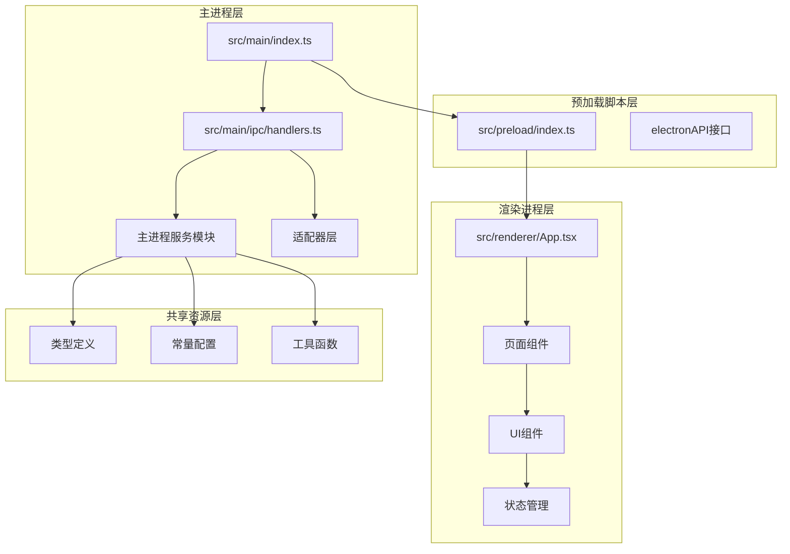
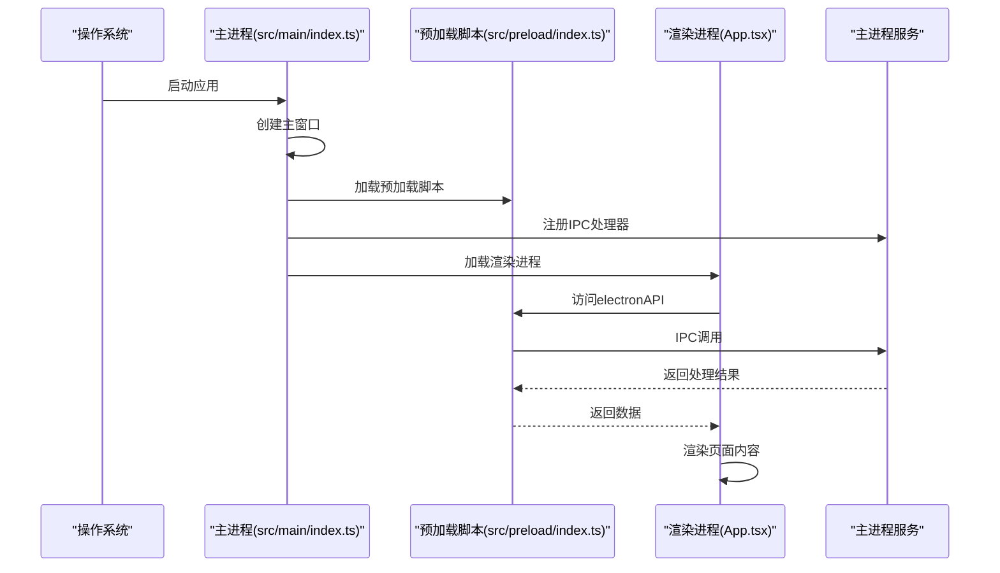
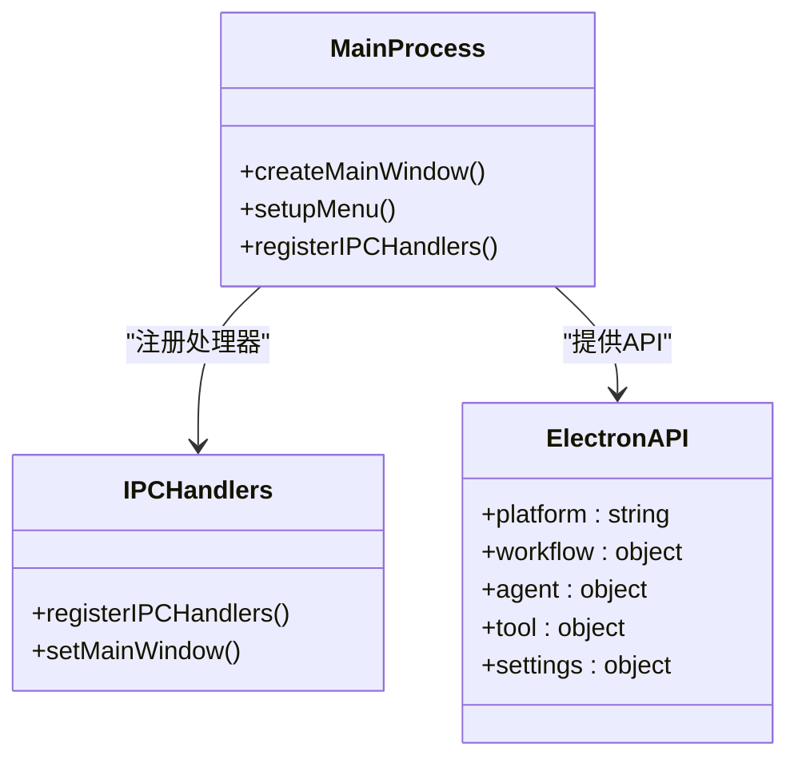
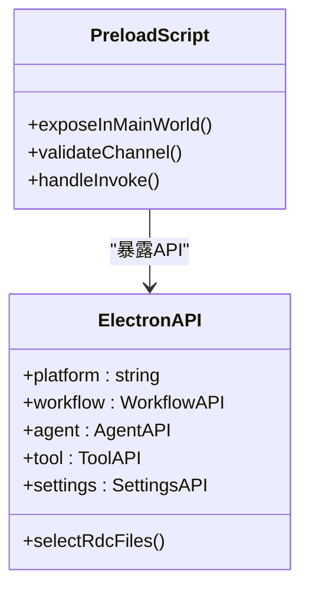
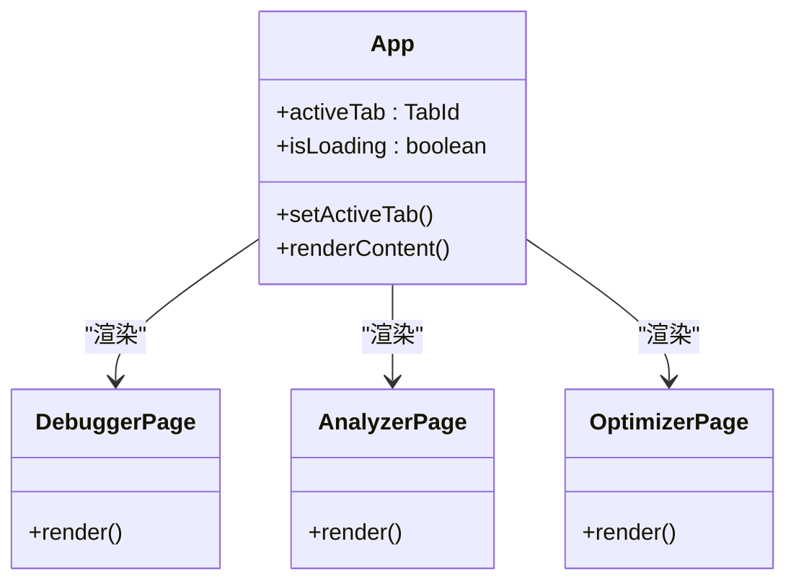
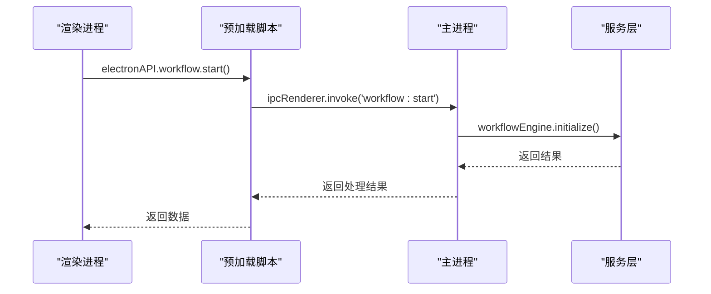
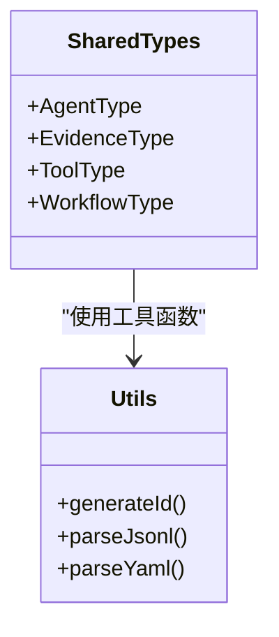
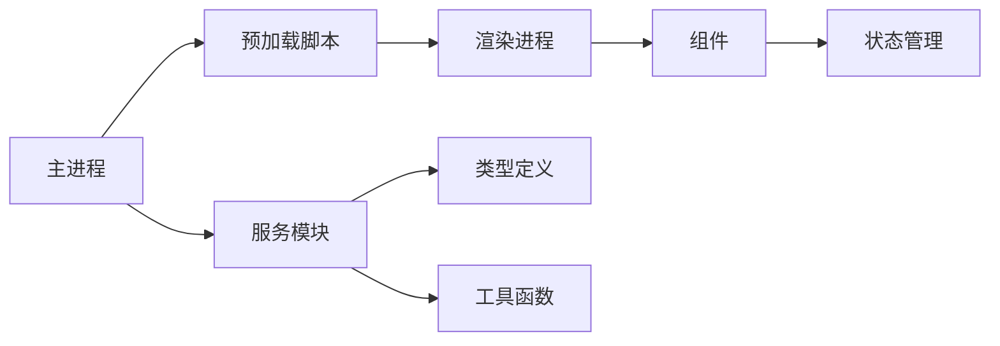

# 模块化架构

<cite>
**本文引用的文件**
- [src/main/index.ts](file://src/main/index.ts)
- [src/preload/index.ts](file://src/preload/index.ts)
- [src/renderer/App.tsx](file://src/renderer/App.tsx)
- [src/main/ipc/handlers.ts](file://src/main/ipc/handlers.ts)
- [src/types/electron.d.ts](file://src/types/electron.d.ts)
- [src/shared/constants/agents.ts](file://src/shared/constants/agents.ts)
- [src/shared/constants/blockers.ts](file://src/shared/constants/blockers.ts)
- [src/shared/constants/stages.ts](file://src/shared/constants/stages.ts)
- [src/shared/types/agent.ts](file://src/shared/types/agent.ts)
- [src/shared/types/evidence.ts](file://src/shared/types/evidence.ts)
- [src/shared/types/tool.ts](file://src/shared/types/tool.ts)
- [src/shared/utils/id.ts](file://src/shared/utils/id.ts)
- [src/shared/utils/jsonl.ts](file://src/shared/utils/jsonl.ts)
- [src/shared/utils/yaml.ts](file://src/shared/utils/yaml.ts)
- [electron.vite.config.ts](file://electron.vite.config.ts)
- [package.json](file://package.json)
</cite>

## 更新摘要
**所做更改**
- 完全重写架构概述，从Angular模块系统迁移至Electron模块化设计
- 新增主进程服务架构分析，包括IPC处理器和核心服务模块
- 新增渲染进程组件架构分析，包括页面组件和状态管理
- 新增共享类型定义和工具模块分析
- 更新模块间通信方式，从Angular依赖注入改为Electron IPC通信
- 更新模块职责划分，明确主进程、预加载脚本和渲染进程的职责边界

## 目录
1. [引言](#引言)
2. [项目结构](#项目结构)
3. [核心组件](#核心组件)
4. [架构总览](#架构总览)
5. [详细组件分析](#详细组件分析)
6. [依赖分析](#依赖分析)
7. [性能考虑](#性能考虑)
8. [故障排查指南](#故障排查指南)
9. [结论](#结论)
10. [附录](#附录)

## 引言
本文件系统性阐述基于Electron的模块化架构设计，重点围绕主进程服务、渲染进程组件、共享类型定义和工具模块的职责划分与协作机制。该架构完全摒弃了Angular模块系统，采用Electron原生的主-渲染进程分离模式：主进程负责核心业务逻辑和系统级操作，渲染进程负责用户界面交互，预加载脚本提供安全的IPC桥接。文档同时解析模块的懒加载策略、IPC通信机制、模块间的通信方式，并总结Electron模块系统的最佳实践，最后给出模块扩展与自定义模块的创建指南。

## 项目结构
该项目采用Electron原生的三层架构组织方式：
- 主进程层：负责应用生命周期管理、系统级操作和核心业务逻辑
- 预加载脚本层：提供安全的IPC桥接，暴露受限API给渲染进程
- 渲染进程层：负责用户界面渲染、状态管理和用户交互
- 共享资源层：包含类型定义、常量配置和工具函数

**图表来源**
- [src/main/index.ts:1-209](file://src/main/index.ts#L1-L209)
- [src/preload/index.ts:1-131](file://src/preload/index.ts#L1-L131)
- [src/renderer/App.tsx:1-112](file://src/renderer/App.tsx#L1-L112)
- [src/main/ipc/handlers.ts:1-267](file://src/main/ipc/handlers.ts#L1-L267)

**章节来源**
- [src/main/index.ts:1-209](file://src/main/index.ts#L1-L209)
- [src/preload/index.ts:1-131](file://src/preload/index.ts#L1-L131)
- [src/renderer/App.tsx:1-112](file://src/renderer/App.tsx#L1-L112)
- [src/main/ipc/handlers.ts:1-267](file://src/main/ipc/handlers.ts#L1-L267)

## 核心组件
本节聚焦Electron架构中各层的核心职责与实现要点：

### 主进程服务层
- **设计定位**：承载应用的核心业务逻辑和系统级操作，确保在整个应用生命周期内提供稳定的服务支持
- **当前实现**：通过主进程入口文件集中管理应用生命周期、窗口管理和IPC处理器注册
- **服务示例**：工作流引擎、代理编排器、工具桥接器、存储适配器等核心服务
- **依赖注入**：通过模块导入和函数调用实现服务依赖管理

### 预加载脚本层
- **设计定位**：提供安全的IPC桥接，暴露受限API给渲染进程，确保渲染进程无法直接访问Node.js API
- **当前实现**：通过contextBridge将预定义的API暴露给渲染进程，提供严格的参数验证和错误处理
- **API分类**：文件操作、工作流控制、代理管理、工具执行、证据链操作、LLM配置、设置管理等

### 渲染进程层
- **设计定位**：负责用户界面渲染、状态管理和用户交互，采用React组件架构
- **当前实现**：通过App组件管理标签页导航和页面内容渲染，支持调试器、分析器和优化器页面
- **状态管理**：使用React Hooks进行状态管理，支持异步数据加载和错误处理

**章节来源**
- [src/main/index.ts:1-209](file://src/main/index.ts#L1-L209)
- [src/preload/index.ts:1-131](file://src/preload/index.ts#L1-L131)
- [src/renderer/App.tsx:1-112](file://src/renderer/App.tsx#L1-L112)

## 架构总览
下图展示Electron应用启动到页面渲染的关键流程，以及各层在其中的角色分工：

**图表来源**
- [src/main/index.ts:177-186](file://src/main/index.ts#L177-L186)
- [src/preload/index.ts:126-127](file://src/preload/index.ts#L126-L127)
- [src/renderer/App.tsx:13-32](file://src/renderer/App.tsx#L13-L32)

## 详细组件分析

### 主进程架构分析
- **设计原则**
  - 单一职责：主进程专注于系统级操作和核心业务逻辑
  - 安全隔离：通过预加载脚本提供安全的API访问
  - 错误处理：完善的异常捕获和错误恢复机制
- **实现要点**
  - 应用生命周期管理：窗口创建、菜单配置、系统事件处理
  - IPC处理器注册：集中管理所有IPC通信通道
  - 服务初始化：工作流引擎、代理编排器等核心服务的启动
- **依赖关系**
  - Electron框架提供底层系统API
  - 各服务模块提供具体业务功能

**图表来源**
- [src/main/index.ts:23-73](file://src/main/index.ts#L23-L73)
- [src/main/ipc/handlers.ts:18-258](file://src/main/ipc/handlers.ts#L18-L258)
- [src/preload/index.ts:8-127](file://src/preload/index.ts#L8-L127)

**章节来源**
- [src/main/index.ts:1-209](file://src/main/index.ts#L1-L209)
- [src/main/ipc/handlers.ts:1-267](file://src/main/ipc/handlers.ts#L1-L267)

### 预加载脚本架构分析
- **设计原则**
  - 最小权限：只暴露必要的API给渲染进程
  - 类型安全：通过TypeScript定义API接口
  - 错误隔离：预加载脚本中的错误不影响渲染进程
- **实现要点**
  - API暴露：通过contextBridge将对象暴露给渲染进程
  - 参数验证：对IPC调用参数进行严格验证
  - 事件监听：支持渲染进程订阅特定事件
- **API分类**
  - 文件操作：选择RDC文件、选择目录
  - 工作流控制：获取状态、启动工作流、推进阶段
  - 代理管理：发送消息、获取状态、配置代理
  - 工具执行：获取工具目录、执行工具
  - 设置管理：获取设置、设置设置

**图表来源**
- [src/preload/index.ts:1-131](file://src/preload/index.ts#L1-L131)

**章节来源**
- [src/preload/index.ts:1-131](file://src/preload/index.ts#L1-L131)

### 渲染进程架构分析
- **设计原则**
  - 组件化：采用React组件架构，支持复用和组合
  - 状态管理：使用React Hooks进行状态管理
  - 错误处理：完善的错误边界和降级处理
- **实现要点**
  - 标签页导航：支持调试器、分析器、优化器页面切换
  - 异步初始化：应用启动时异步加载配置和状态
  - 用户交互：响应按钮点击、表单输入等用户操作
- **页面组件**
  - DebuggerPage：主要的调试功能页面
  - AnalyzerPage：数据分析功能页面（待实现）
  - OptimizerPage：性能优化功能页面（待实现）

**图表来源**
- [src/renderer/App.tsx:1-112](file://src/renderer/App.tsx#L1-L112)

**章节来源**
- [src/renderer/App.tsx:1-112](file://src/renderer/App.tsx#L1-L112)

### IPC通信机制分析
- **通信模式**
  - 请求-响应：渲染进程发起请求，主进程返回响应
  - 事件驱动：主进程向渲染进程推送状态变更
  - 错误传播：统一的错误处理和错误信息传递
- **通道管理**
  - 严格白名单：只允许预定义的IPC通道
  - 参数验证：对IPC调用参数进行类型检查
  - 异常处理：捕获并处理IPC过程中的异常
- **性能优化**
  - 异步处理：所有IPC操作都是异步的
  - 错误快速返回：及时返回错误信息避免阻塞

**图表来源**
- [src/preload/index.ts:29-31](file://src/preload/index.ts#L29-L31)
- [src/main/ipc/handlers.ts:45-106](file://src/main/ipc/handlers.ts#L45-L106)

**章节来源**
- [src/preload/index.ts:1-131](file://src/preload/index.ts#L1-L131)
- [src/main/ipc/handlers.ts:1-267](file://src/main/ipc/handlers.ts#L1-L267)

### 共享类型定义分析
- **设计原则**
  - 类型安全：通过TypeScript提供完整的类型定义
  - 接口统一：标准化的数据结构和接口定义
  - 版本兼容：支持类型定义的向前兼容
- **实现要点**
  - 代理类型：定义代理的基本属性和行为
  - 证据链类型：定义证据链的数据结构和操作
  - 工具类型：定义工具的目录结构和执行参数
  - 常量定义：定义系统级别的常量值
- **工具函数**
  - ID生成：提供唯一的标识符生成
  - JSONL处理：支持JSON Lines格式的数据处理
  - YAML处理：支持YAML格式的配置文件处理

**图表来源**
- [src/shared/types/agent.ts:1-50](file://src/shared/types/agent.ts#L1-L50)
- [src/shared/types/evidence.ts:1-50](file://src/shared/types/evidence.ts#L1-L50)
- [src/shared/types/tool.ts:1-50](file://src/shared/types/tool.ts#L1-L50)
- [src/shared/utils/id.ts:1-50](file://src/shared/utils/id.ts#L1-L50)

**章节来源**
- [src/shared/types/agent.ts:1-50](file://src/shared/types/agent.ts#L1-L50)
- [src/shared/types/evidence.ts:1-50](file://src/shared/types/evidence.ts#L1-L50)
- [src/shared/types/tool.ts:1-50](file://src/shared/types/tool.ts#L1-L50)
- [src/shared/utils/id.ts:1-50](file://src/shared/utils/id.ts#L1-L50)

## 依赖分析
- **模块耦合与内聚**
  - 主进程服务层低耦合，每个服务模块职责单一
  - 预加载脚本层作为API网关，集中管理所有外部访问
  - 渲染进程层通过预加载脚本间接访问主进程服务
- **外部依赖**
  - Electron框架提供底层系统API
  - React生态系统提供UI组件和状态管理
  - TypeScript提供类型安全保障
- **循环依赖规避**
  - 通过预加载脚本作为中介层避免直接循环依赖
  - 服务模块之间通过IPC通信避免直接引用

**图表来源**
- [src/main/index.ts:1-209](file://src/main/index.ts#L1-L209)
- [src/preload/index.ts:1-131](file://src/preload/index.ts#L1-L131)
- [src/renderer/App.tsx:1-112](file://src/renderer/App.tsx#L1-L112)

**章节来源**
- [src/main/index.ts:1-209](file://src/main/index.ts#L1-L209)
- [src/preload/index.ts:1-131](file://src/preload/index.ts#L1-L131)
- [src/renderer/App.tsx:1-112](file://src/renderer/App.tsx#L1-L112)

## 性能考虑
- **模块懒加载**
  - 渲染进程页面组件按需加载，减少初始包体积
  - 预加载脚本API按需调用，避免不必要的IPC通信
- **IPC优化**
  - 批量处理：合并多个相关的IPC调用
  - 缓存策略：对频繁访问的数据进行缓存
  - 异步处理：所有IPC操作都是异步的，避免阻塞主线程
- **内存管理**
  - 及时清理事件监听器和定时器
  - 合理使用React组件的生命周期钩子
  - 避免内存泄漏和循环引用

## 故障排查指南
- **主进程启动失败**
  - 检查Electron主进程入口文件的语法和依赖
  - 确认所有IPC处理器都正确注册
  - 验证应用菜单配置和窗口设置
- **预加载脚本API不可用**
  - 检查contextBridge的API暴露配置
  - 确认IPC通道名称和参数验证规则
  - 验证渲染进程中的API访问语法
- **IPC通信超时**
  - 检查主进程服务的响应时间
  - 确认预加载脚本的参数验证逻辑
  - 验证渲染进程的错误处理机制
- **渲染进程页面空白**
  - 检查React组件的渲染逻辑
  - 确认状态管理和副作用处理
  - 验证CSS样式和资源加载

**章节来源**
- [src/main/index.ts:177-186](file://src/main/index.ts#L177-L186)
- [src/preload/index.ts:126-127](file://src/preload/index.ts#L126-L127)
- [src/renderer/App.tsx:13-32](file://src/renderer/App.tsx#L13-L32)

## 结论
该应用采用清晰的Electron三层架构：主进程负责核心业务逻辑和系统级操作，预加载脚本提供安全的API桥接，渲染进程负责用户界面交互。通过严格的模块职责划分和IPC通信机制，实现了良好的安全性、可维护性和性能表现。遵循本文的最佳实践，可进一步提升模块的可扩展性、可测试性和用户体验。

## 附录

### Electron模块系统最佳实践
- **模块职责划分**
  - 主进程：应用生命周期管理、系统级操作、核心业务逻辑
  - 预加载脚本：安全API暴露、参数验证、错误处理
  - 渲染进程：用户界面、状态管理、用户交互
- **IPC通信规范**
  - 严格定义IPC通道名称和参数格式
  - 实现统一的错误处理和异常传播
  - 使用TypeScript定义IPC接口类型
- **安全性设计**
  - 通过contextBridge限制API暴露范围
  - 实施严格的参数验证和输入过滤
  - 避免在渲染进程直接访问Node.js API
- **性能优化策略**
  - 实现模块懒加载和按需初始化
  - 优化IPC通信频率和数据传输量
  - 合理使用缓存和内存管理策略

### 自定义模块创建步骤
- **步骤一：确定模块类型**
  - 判断是主进程服务模块、预加载脚本模块还是渲染进程组件
- **步骤二：编写模块实现**
  - 实现具体的业务逻辑和API接口
  - 添加必要的类型定义和接口声明
- **步骤三：注册模块**
  - 在主进程入口文件中注册服务
  - 在预加载脚本中暴露相应的API
  - 在渲染进程中导入和使用模块
- **步骤四：测试和部署**
  - 编写单元测试和集成测试
  - 进行端到端的功能测试
  - 部署到开发和生产环境

**章节来源**
- [src/main/index.ts:1-209](file://src/main/index.ts#L1-L209)
- [src/preload/index.ts:1-131](file://src/preload/index.ts#L1-L131)
- [src/renderer/App.tsx:1-112](file://src/renderer/App.tsx#L1-L112)