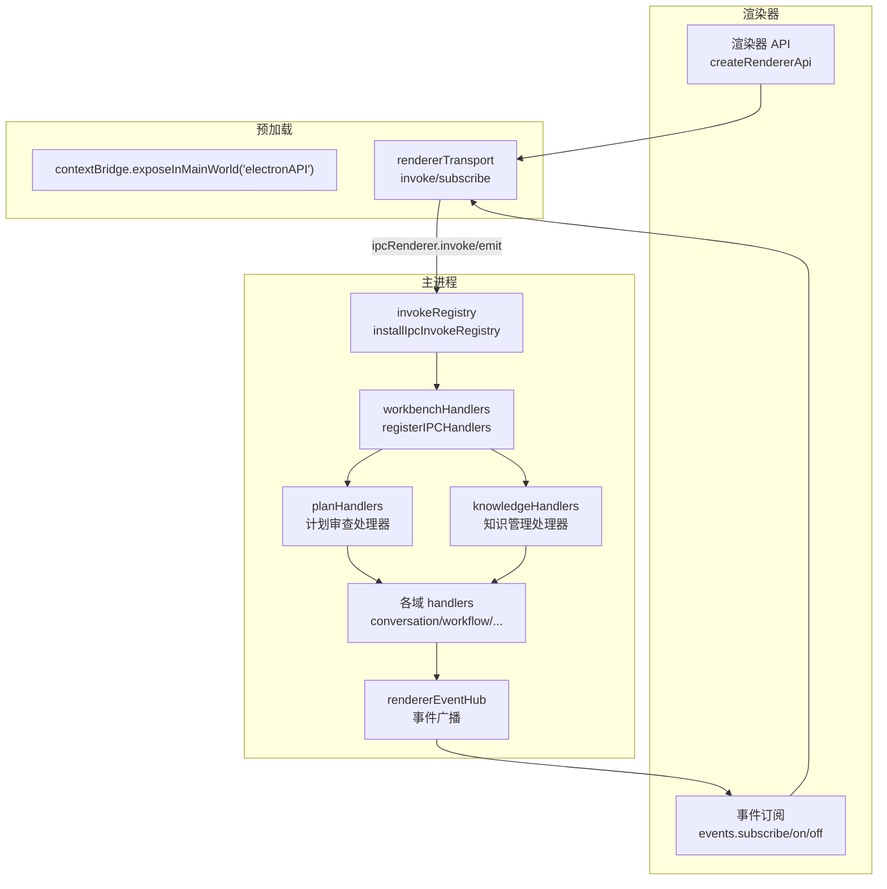
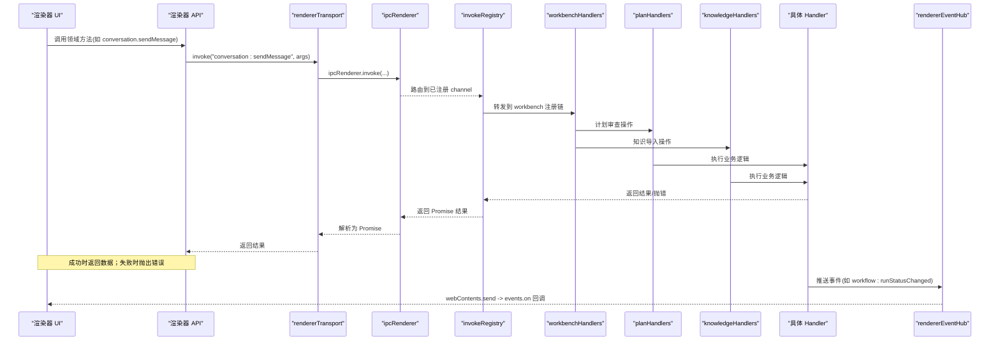
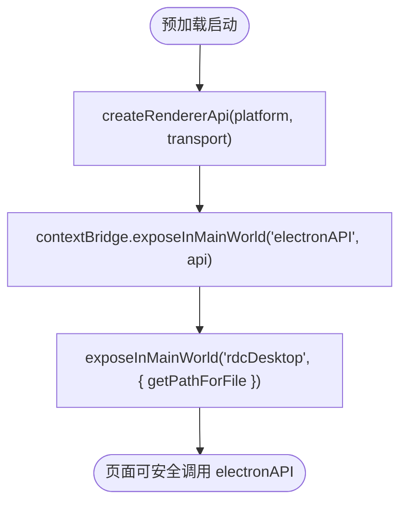
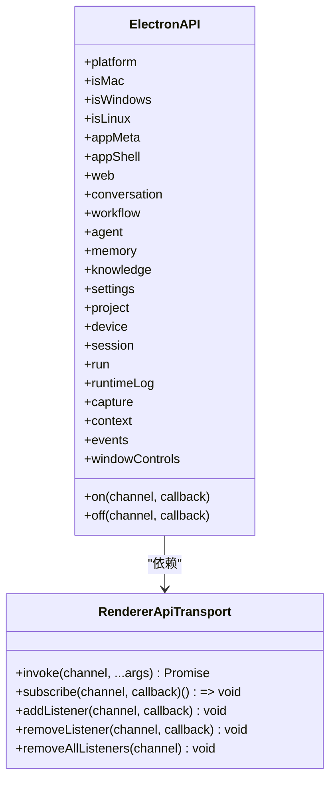
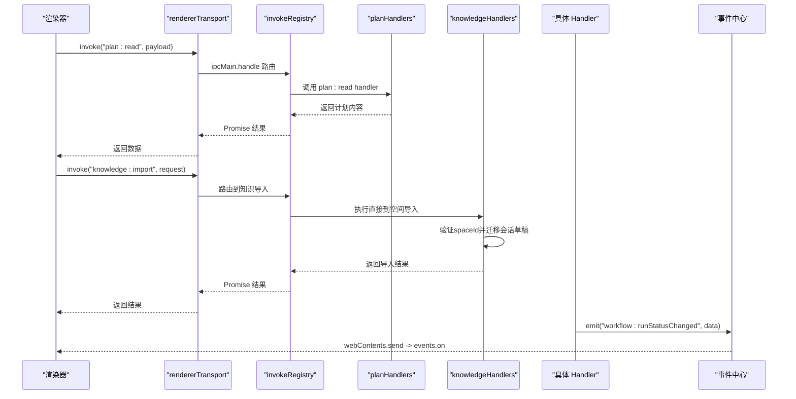
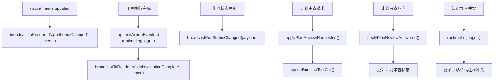
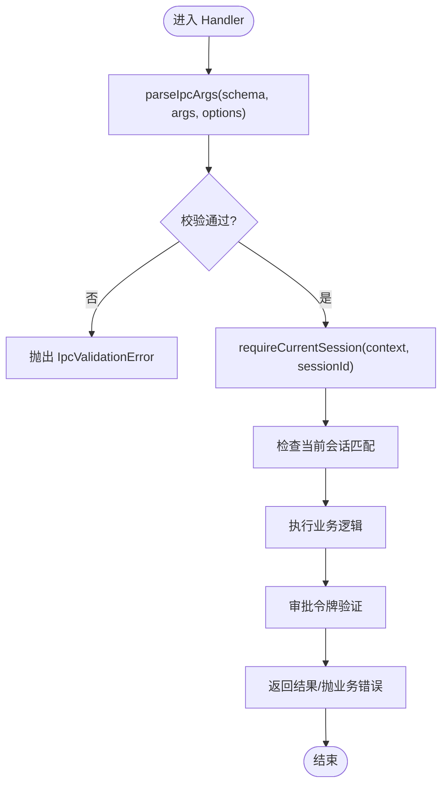
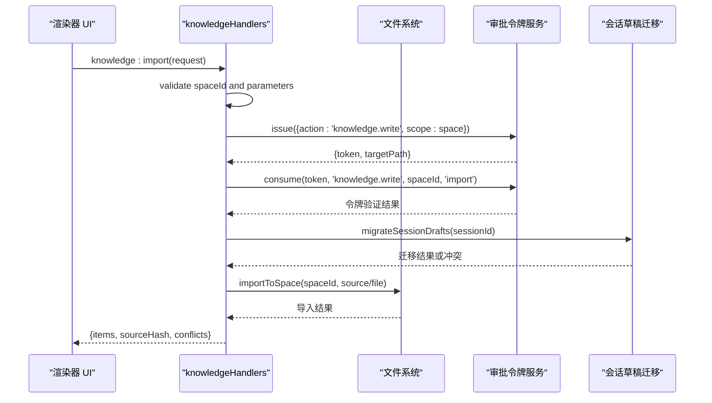
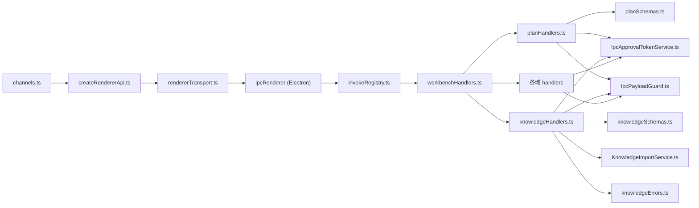

# IPC 通信

<cite>
**本文引用的文件**
- [src/preload/index.ts](file://src/preload/index.ts)
- [src/preload/rendererTransport.ts](file://src/preload/rendererTransport.ts)
- [src/shared/renderer-api/channels.ts](file://src/shared/renderer-api/channels.ts)
- [src/shared/renderer-api/createRendererApi.ts](file://src/shared/renderer-api/createRendererApi.ts)
- [src/shared/renderer-api/transport.ts](file://src/shared/renderer-api/transport.ts)
- [src/main/ipc/invokeRegistry.ts](file://src/main/ipc/invokeRegistry.ts)
- [src/main/ipc/workbenchHandlers.ts](file://src/main/ipc/workbenchHandlers.ts)
- [src/main/ipc/validation/IpcPayloadGuard.ts](file://src/main/ipc/validation/IpcPayloadGuard.ts)
- [src/main/ipc/validation/IpcApprovalTokenService.ts](file://src/main/ipc/validation/IpcApprovalTokenService.ts)
- [src/main/ipc/planHandlers.ts](file://src/main/ipc/planHandlers.ts)
- [src/main/ipc/knowledgeHandlers.ts](file://src/main/ipc/knowledgeHandlers.ts)
- [src/main/ipc/validation/knowledgeSchemas.ts](file://src/main/ipc/validation/knowledgeSchemas.ts)
- [src/main/conversation/ConversationPlanReviewEvents.ts](file://src/main/conversation/ConversationPlanReviewEvents.ts)
- [src/shared/types/planReview.ts](file://src/shared/types/planReview.ts)
- [src/shared/types/knowledge.ts](file://src/shared/types/knowledge.ts)
- [src/main/knowledge/KnowledgeImportService.ts](file://src/main/knowledge/KnowledgeImportService.ts)
- [src/main/knowledge/knowledgeErrors.ts](file://src/main/knowledge/knowledgeErrors.ts)
</cite>

## 更新摘要
**变更内容**
- 重构知识导入 IPC 层以支持新的直接到空间导入流程
- `knowledge:import` 处理器现在要求显式的 spaceId 而不是可选的会话上下文
- 包含适当的审批令牌绑定和会话草稿迁移机制
- 增强了知识导入的安全性和错误处理策略

## 目录
1. [简介](#简介)
2. [项目结构](#项目结构)
3. [核心组件](#核心组件)
4. [架构总览](#架构总览)
5. [详细组件分析](#详细组件分析)
6. [依赖关系分析](#依赖关系分析)
7. [性能考量](#性能考量)
8. [故障排查指南](#故障排查指南)
9. [结论](#结论)
10. [附录](#附录)

## 简介
本文件系统性梳理 RDC-Agent 的 IPC 通信机制，聚焦预加载脚本的安全 API 暴露、渲染器侧 API 封装、主进程与渲染器之间的消息协议、事件桥接、错误处理策略，以及异步请求响应模式与流式数据传输。同时给出安全考虑、权限控制与 API 版本兼容性建议，并配套流程图与错误处理示例，帮助读者快速理解与扩展该 IPC 体系。

**更新** 新增了计划审查相关的 IPC 功能，包括计划文件的读取、保存、导出以及用户审批流程，通过一次性审批令牌确保操作安全性。同时重构了知识导入流程，支持更安全的直接到空间导入模式。

## 项目结构
IPC 相关代码按"渲染器侧封装 → 预加载桥接 → 主进程注册与分发"分层组织：
- 共享通道定义：集中声明所有 invoke 与 event channel 名称及类型约束，保证两端一致。
- 渲染器 API：在 shared 层通过 transport 抽象出统一调用与订阅接口，屏蔽底层 ipcRenderer。
- 预加载脚本：仅使用 contextBridge + ipcRenderer，将受限能力暴露给页面。
- 主进程：安装 invoke 注册表，集中注册各域 handler，并通过事件中心广播到渲染器。

**图表来源**
- [src/shared/renderer-api/createRendererApi.ts:33-76](file://src/shared/renderer-api/createRendererApi.ts#L33-L76)
- [src/preload/rendererTransport.ts:9-44](file://src/preload/rendererTransport.ts#L9-L44)
- [src/main/ipc/invokeRegistry.ts:9-39](file://src/main/ipc/invokeRegistry.ts#L9-L39)
- [src/main/ipc/workbenchHandlers.ts:260-283](file://src/main/ipc/workbenchHandlers.ts#L260-L283)
- [src/main/ipc/planHandlers.ts:66-122](file://src/main/ipc/planHandlers.ts#L66-L122)
- [src/main/ipc/knowledgeHandlers.ts:185-425](file://src/main/ipc/knowledgeHandlers.ts#L185-L425)

章节来源
- [src/shared/renderer-api/channels.ts:1-261](file://src/shared/renderer-api/channels.ts#L1-L261)
- [src/preload/index.ts:8-25](file://src/preload/index.ts#L8-L25)
- [src/main/ipc/workbenchHandlers.ts:52-87](file://src/main/ipc/workbenchHandlers.ts#L52-L87)

## 核心组件
- 通道契约（channels）：集中管理所有 invoke 与 event channel 的名称集合与类型断言，确保渲染器与主进程通道一致性。
- 渲染器传输（transport）：抽象 invoke/subscribe/listener 等能力，便于在不同宿主环境替换底层实现。
- 渲染器 API（createRendererApi）：基于 transport 组合出领域 API（对话、工作流、设置、设备等），并提供 on/off 事件订阅入口。
- 预加载桥接（preload + rendererTransport）：通过 contextBridge 暴露最小化 API，内部用 ipcRenderer 完成实际通信。
- 主进程注册表（invokeRegistry）：拦截 ipcMain.handle，维护 channel→handler 映射，提供运行时校验与断言。
- 工作区处理器（workbenchHandlers）：初始化状态、注册各域 handler、主题与工具执行事件桥接、全局广播。
- 计划处理器（planHandlers）：处理计划文件的读取、保存、导出操作，集成一次性审批令牌机制。
- 知识处理器（knowledgeHandlers）：处理知识卡片的管理操作，包括导入、查询、编译、写入等，支持直接到空间导入。
- 安全与校验（IpcPayloadGuard / IpcApprovalTokenService）：对入参进行 Zod 校验与大小限制；对敏感写操作实施一次性审批令牌。

**更新** 新增了知识处理器组件的重构，专门处理知识卡片的直接到空间导入，包括会话草稿迁移和增强的安全验证机制。

章节来源
- [src/shared/renderer-api/channels.ts:1-261](file://src/shared/renderer-api/channels.ts#L1-L261)
- [src/shared/renderer-api/transport.ts:1-12](file://src/shared/renderer-api/transport.ts#L1-L12)
- [src/shared/renderer-api/createRendererApi.ts:33-76](file://src/shared/renderer-api/createRendererApi.ts#L33-L76)
- [src/preload/rendererTransport.ts:9-44](file://src/preload/rendererTransport.ts#L9-L44)
- [src/main/ipc/invokeRegistry.ts:9-51](file://src/main/ipc/invokeRegistry.ts#L9-L51)
- [src/main/ipc/workbenchHandlers.ts:52-87,260-283:52-87](file://src/main/ipc/workbenchHandlers.ts#L52-L87)
- [src/main/ipc/planHandlers.ts:66-122](file://src/main/ipc/planHandlers.ts#L66-L122)
- [src/main/ipc/knowledgeHandlers.ts:185-425](file://src/main/ipc/knowledgeHandlers.ts#L185-L425)
- [src/main/ipc/validation/IpcPayloadGuard.ts:1-88](file://src/main/ipc/validation/IpcPayloadGuard.ts#L1-L88)
- [src/main/ipc/validation/IpcApprovalTokenService.ts:1-80](file://src/main/ipc/validation/IpcApprovalTokenService.ts#L1-L80)

## 架构总览
IPC 采用"请求-响应 + 事件推送"的双通道模型：
- 请求-响应：渲染器通过 transport.invoke(channel, ...args) 调用主进程对应 handler，返回 Promise 结果或抛出错误。
- 事件推送：主进程通过 BrowserWindow.webContents.send 或事件中心向渲染器推送事件，渲染器通过 events.subscribe/on/off 订阅。

**更新** 新增了计划审查和知识管理的请求-响应流程，支持计划文件的安全读写、知识卡片的直接到空间导入以及用户审批流程。

**图表来源**
- [src/shared/renderer-api/createRendererApi.ts:33-76](file://src/shared/renderer-api/createRendererApi.ts#L33-L76)
- [src/preload/rendererTransport.ts:29-44](file://src/preload/rendererTransport.ts#L29-L44)
- [src/main/ipc/invokeRegistry.ts:14-39](file://src/main/ipc/invokeRegistry.ts#L14-L39)
- [src/main/ipc/workbenchHandlers.ts:79-87](file://src/main/ipc/workbenchHandlers.ts#L79-L87)
- [src/main/ipc/planHandlers.ts:67-121](file://src/main/ipc/planHandlers.ts#L67-L121)
- [src/main/ipc/knowledgeHandlers.ts:295-330](file://src/main/ipc/knowledgeHandlers.ts#L295-L330)

## 详细组件分析

### 预加载脚本的安全 API 暴露机制
- 仅暴露最小必要能力：通过 contextBridge 暴露 electronAPI 与 rdcDesktop，避免直接暴露 Node 模块。
- 平台信息与安全路径：platform 信息用于渲染器分支逻辑；rdcDesktop.getPathForFile 通过 webUtils 安全获取文件路径，异常时返回 null。
- 传输抽象：createIpcRendererTransport 封装 invoke/subscribe/listener，屏蔽 ipcRenderer 细节，便于测试与替换。

**图表来源**
- [src/preload/index.ts:8-25](file://src/preload/index.ts#L8-L25)
- [src/shared/renderer-api/createRendererApi.ts:33-76](file://src/shared/renderer-api/createRendererApi.ts#L33-L76)
- [src/preload/rendererTransport.ts:9-44](file://src/preload/rendererTransport.ts#L9-L44)

章节来源
- [src/preload/index.ts:8-25](file://src/preload/index.ts#L8-L25)
- [src/preload/rendererTransport.ts:9-44](file://src/preload/rendererTransport.ts#L9-L44)

### Renderer API 的创建与封装
- createRendererApi 聚合各域 API（对话、工作流、设备、设置等），统一基于 transport 调用。
- 事件订阅：on/off 仅允许使用白名单中的 event channel，防止非法事件名注入。
- 平台特性：isMac/isWindows/isLinux 由 platform 决定，便于跨平台差异处理。

**图表来源**
- [src/shared/renderer-api/transport.ts:1-12](file://src/shared/renderer-api/transport.ts#L1-L12)
- [src/shared/renderer-api/createRendererApi.ts:33-76](file://src/shared/renderer-api/createRendererApi.ts#L33-L76)

章节来源
- [src/shared/renderer-api/createRendererApi.ts:33-76](file://src/shared/renderer-api/createRendererApi.ts#L33-L76)
- [src/shared/renderer-api/channels.ts:178-261](file://src/shared/renderer-api/channels.ts#L178-L261)

### 主进程与渲染器的消息传递协议
- 通道命名规范：所有 invoke/event channel 集中在 channels.ts 中声明，并提供 isRendererInvokeChannel/isRendererEventChannel 类型守卫。
- 请求-响应：渲染器通过 invoke 发送请求，主进程通过 invokeRegistry 查找并执行对应 handler，返回 Promise。
- 事件推送：主进程通过 BrowserWindow.webContents.send 或事件中心广播事件，渲染器通过 subscribe/on/off 订阅。

**更新** 新增了计划审查和知识管理相关的通道：`plan:read`、`plan:issueApprovalToken`、`plan:saveToProject`、`plan:export`、`knowledge:import`、`knowledge:candidates` 等，用于计划文件的安全操作和知识卡片的直接到空间导入。

**图表来源**
- [src/shared/renderer-api/channels.ts:1-261](file://src/shared/renderer-api/channels.ts#L1-L261)
- [src/main/ipc/invokeRegistry.ts:14-39](file://src/main/ipc/invokeRegistry.ts#L14-L39)
- [src/main/ipc/workbenchHandlers.ts:79-87](file://src/main/ipc/workbenchHandlers.ts#L79-L87)
- [src/main/ipc/planHandlers.ts:67-121](file://src/main/ipc/planHandlers.ts#L67-L121)
- [src/main/ipc/knowledgeHandlers.ts:295-330](file://src/main/ipc/knowledgeHandlers.ts#L295-L330)

章节来源
- [src/shared/renderer-api/channels.ts:1-261](file://src/shared/renderer-api/channels.ts#L1-L261)
- [src/main/ipc/invokeRegistry.ts:9-51](file://src/main/ipc/invokeRegistry.ts#L9-L51)
- [src/main/ipc/workbenchHandlers.ts:79-87](file://src/main/ipc/workbenchHandlers.ts#L79-L87)

### 事件桥接机制
- 主题变化：nativeTheme.updated 事件被桥接到渲染器 app:themeChanged。
- 工具执行追踪：工具调用完成后，触发 tool:executionComplete，并写入 action event 与运行日志。
- 运行状态变更：工作流状态变化通过 workflow:runStatusChanged 广播。

**更新** 计划审查事件通过 ConversationPlanReviewEvents 处理，支持计划审查请求和响应的状态更新。知识导入过程中的冲突和错误也会通过运行时日志记录。

**图表来源**
- [src/main/ipc/workbenchHandlers.ts:190-237](file://src/main/ipc/workbenchHandlers.ts#L190-L237)
- [src/main/ipc/workbenchHandlers.ts:248-257](file://src/main/ipc/workbenchHandlers.ts#L248-L257)
- [src/main/ipc/workbenchHandlers.ts:89-96](file://src/main/ipc/workbenchHandlers.ts#L89-L96)
- [src/main/conversation/ConversationPlanReviewEvents.ts:11-73](file://src/main/conversation/ConversationPlanReviewEvents.ts#L11-L73)
- [src/main/ipc/knowledgeHandlers.ts:264-272](file://src/main/ipc/knowledgeHandlers.ts#L264-L272)

章节来源
- [src/main/ipc/workbenchHandlers.ts:190-237](file://src/main/ipc/workbenchHandlers.ts#L190-L237)
- [src/main/ipc/workbenchHandlers.ts:248-257](file://src/main/ipc/workbenchHandlers.ts#L248-L257)
- [src/main/ipc/workbenchHandlers.ts:89-96](file://src/main/ipc/workbenchHandlers.ts#L89-L96)

### 错误处理策略
- 参数校验：所有 IPC 入参必须通过 parseIpcArgs 进行 Zod 校验与字节长度限制，失败抛出 IpcValidationError。
- 未注册通道：invokeRegisteredIpcChannel 在未找到 handler 时抛出错误；assertRendererIpcParity 在启动时检查渲染器端声明的通道是否全部在主进程注册。
- 事件订阅清理：rendererTransport 维护 listenerMap，支持 removeListener/removeAllListeners，避免内存泄漏。

**更新** 计划审查和知识导入操作包含额外的会话验证和审批令牌验证，确保操作安全性和上下文正确性。知识导入现在支持更细粒度的错误处理，包括会话草稿迁移冲突的处理。

**图表来源**
- [src/main/ipc/validation/IpcPayloadGuard.ts:26-57](file://src/main/ipc/validation/IpcPayloadGuard.ts#L26-L57)
- [src/main/ipc/invokeRegistry.ts:32-49](file://src/main/ipc/invokeRegistry.ts#L32-L49)
- [src/preload/rendererTransport.ts:12-42](file://src/preload/rendererTransport.ts#L12-L42)
- [src/main/ipc/planHandlers.ts:48-52](file://src/main/ipc/planHandlers.ts#L48-L52)
- [src/main/ipc/knowledgeHandlers.ts:295-330](file://src/main/ipc/knowledgeHandlers.ts#L295-L330)

章节来源
- [src/main/ipc/validation/IpcPayloadGuard.ts:1-88](file://src/main/ipc/validation/IpcPayloadGuard.ts#L1-L88)
- [src/main/ipc/invokeRegistry.ts:9-51](file://src/main/ipc/invokeRegistry.ts#L9-L51)
- [src/preload/rendererTransport.ts:9-44](file://src/preload/rendererTransport.ts#L9-L44)

### 异步通信模式、请求-响应与流式传输
- 请求-响应：渲染器通过 invoke 发起调用，主进程 handler 返回 Promise；适用于配置读取、命令执行、会话管理等。
- 事件推送：主进程通过事件中心广播状态变更、工具执行结果、运行状态等；渲染器通过 subscribe/on/off 订阅。
- 流式数据：对于长耗时或增量输出场景，建议使用事件推送（如 llm:stream、workflow:stateChanged）分片传输，避免单次大负载阻塞。

**更新** 计划审查和知识导入流程采用多步骤请求-响应模式：读取计划 → 申请审批令牌 → 执行保存/导出操作，每个步骤都有独立的错误处理和状态反馈。知识导入现在支持直接到空间模式，提供更灵活的导入选项。

章节来源
- [src/shared/renderer-api/channels.ts:178-261](file://src/shared/renderer-api/channels.ts#L178-L261)
- [src/main/ipc/workbenchHandlers.ts:79-87](file://src/main/ipc/workbenchHandlers.ts#L79-L87)

### 安全考虑、权限控制与 API 版本兼容性
- 安全边界：预加载脚本不引入 Node 模块，仅通过 contextBridge 暴露最小能力；文件路径获取使用 webUtils 并捕获异常。
- 权限控制：对敏感写操作（如 memory.write/knowledge.write/promote）采用一次性审批令牌（IpcApprovalTokenService），渲染器需先申请令牌再消费，防止越权。
- 版本兼容：所有通道集中声明于 channels.ts，新增通道需同步 preload、shared types 与浏览器 fallback；assertRendererIpcParity 在启动时校验缺失通道，保障两端一致性。

**更新** 计划审查和知识导入操作增强了安全机制：
- 会话验证：确保操作针对当前活动会话
- 审批令牌：使用一次性令牌保护计划文件修改操作和知识导入
- 对话框确认：在测试模式外需要用户确认计划文件写入
- 路径验证：使用 assertPlanWritePath 确保目标路径安全
- 直接到空间导入：知识导入现在要求显式的 spaceId，提供更好的上下文隔离

章节来源
- [src/preload/index.ts:8-25](file://src/preload/index.ts#L8-L25)
- [src/main/ipc/validation/IpcApprovalTokenService.ts:1-80](file://src/main/ipc/validation/IpcApprovalTokenService.ts#L1-L80)
- [src/shared/renderer-api/channels.ts:226-261](file://src/shared/renderer-api/channels.ts#L226-L261)
- [src/main/ipc/invokeRegistry.ts:45-51](file://src/main/ipc/invokeRegistry.ts#L45-L51)
- [src/main/ipc/planHandlers.ts:15-58](file://src/main/ipc/planHandlers.ts#L15-L58)
- [src/main/ipc/knowledgeHandlers.ts:295-330](file://src/main/ipc/knowledgeHandlers.ts#L295-L330)

### 知识导入 IPC 处理器详解

**更新** 知识导入处理器经过重构，现在支持新的直接到空间导入流程，提供了更安全、更灵活的知识卡片导入机制。

#### 直接到空间导入 (`knowledge:import`)
- 验证显式的 spaceId 参数，确保导入目标明确
- 生成并立即消费一次性审批令牌，确保用户意图明确
- 尝试迁移遗留的会话草稿，处理可能的冲突情况
- 支持从文件或源字符串导入知识内容
- 返回详细的导入结果，包括冲突信息和状态

#### 会话草稿迁移
- 在导入前自动检查并迁移遗留的会话草稿
- 处理重复卡片 ID 冲突，记录冲突信息
- 对于无法迁移的草稿，记录警告日志并继续导入流程
- 支持部分成功的情况，即使某些草稿迁移失败也不影响整体导入

#### 审批令牌绑定
- 为知识导入操作生成绑定的审批令牌
- 令牌包含空间 ID、操作类型和目标路径等信息
- 立即消费令牌以确保操作的原子性和安全性
- 支持测试模式和浏览器 QA 模式的特殊处理

**图表来源**
- [src/main/ipc/knowledgeHandlers.ts:295-330](file://src/main/ipc/knowledgeHandlers.ts#L295-L330)
- [src/main/ipc/validation/knowledgeSchemas.ts:63-73](file://src/main/ipc/validation/knowledgeSchemas.ts#L63-L73)
- [src/main/knowledge/KnowledgeImportService.ts:167-186](file://src/main/knowledge/KnowledgeImportService.ts#L167-L186)

章节来源
- [src/main/ipc/knowledgeHandlers.ts:295-330](file://src/main/ipc/knowledgeHandlers.ts#L295-L330)
- [src/main/ipc/validation/knowledgeSchemas.ts:63-73](file://src/main/ipc/validation/knowledgeSchemas.ts#L63-L73)
- [src/shared/types/knowledge.ts:275-295](file://src/shared/types/knowledge.ts#L275-L295)

## 依赖关系分析
- 渲染器 API 依赖 transport 抽象，transport 在预加载中由 ipcRenderer 实现。
- 主进程 invokeRegistry 拦截 ipcMain.handle，统一管理 channel→handler 映射。
- workbenchHandlers 作为组合根，注册各域 handler，并负责事件桥接与状态恢复。
- 校验与授权模块被各 handler 复用，确保入参与权限安全。

**更新** 新增了知识处理器和计划处理器的依赖关系，包括知识导入服务、会话草稿迁移、审批令牌服务和错误处理的依赖。

**图表来源**
- [src/shared/renderer-api/channels.ts:1-261](file://src/shared/renderer-api/channels.ts#L1-L261)
- [src/shared/renderer-api/createRendererApi.ts:33-76](file://src/shared/renderer-api/createRendererApi.ts#L33-L76)
- [src/preload/rendererTransport.ts:9-44](file://src/preload/rendererTransport.ts#L9-L44)
- [src/main/ipc/invokeRegistry.ts:9-51](file://src/main/ipc/invokeRegistry.ts#L9-L51)
- [src/main/ipc/workbenchHandlers.ts:260-283](file://src/main/ipc/workbenchHandlers.ts#L260-L283)
- [src/main/ipc/planHandlers.ts:1-122](file://src/main/ipc/planHandlers.ts#L1-L122)
- [src/main/ipc/knowledgeHandlers.ts:1-425](file://src/main/ipc/knowledgeHandlers.ts#L1-L425)

章节来源
- [src/shared/renderer-api/channels.ts:1-261](file://src/shared/renderer-api/channels.ts#L1-L261)
- [src/main/ipc/workbenchHandlers.ts:260-283](file://src/main/ipc/workbenchHandlers.ts#L260-L283)
- [src/main/ipc/invokeRegistry.ts:9-51](file://src/main/ipc/invokeRegistry.ts#L9-L51)

## 性能考量
- 载荷大小限制：通过 assertIpcPayloadBytes 限制 JSON 序列化后的字节数，默认 256 KiB，避免大对象阻塞事件循环。
- 事件去重与批量：工作区广播函数集中管理，减少重复 send；工具执行事件合并写入 action event 与日志，降低 IO 频率。
- 资源清理：rendererTransport 维护 listenerMap，支持移除监听器与清空，防止内存泄漏。
- 流式优先：长耗时任务建议以事件形式分片推送，避免单次大响应。

**更新** 计划审查和知识导入操作优化了性能：
- 计划读取限制为 8KB 载荷大小
- 审批令牌申请和文件操作使用异步对话框避免阻塞
- 会话验证快速失败，减少不必要的文件操作
- 知识导入支持大文件导入，最大载荷限制为 KNOWLEDGE_IMPORT_MAX_BYTES + 8KB
- 会话草稿迁移异步处理，避免阻塞主导入流程

章节来源
- [src/main/ipc/validation/IpcPayloadGuard.ts:26-37](file://src/main/ipc/validation/IpcPayloadGuard.ts#L26-L37)
- [src/main/ipc/workbenchHandlers.ts:79-87](file://src/main/ipc/workbenchHandlers.ts#L79-L87)
- [src/preload/rendererTransport.ts:12-42](file://src/preload/rendererTransport.ts#L12-L42)
- [src/main/ipc/planHandlers.ts:68-71](file://src/main/ipc/planHandlers.ts#L68-L71)
- [src/main/ipc/knowledgeHandlers.ts:296-299](file://src/main/ipc/knowledgeHandlers.ts#L296-L299)

## 故障排查指南
- 未注册通道错误：当渲染器调用未在主进程注册的 channel 时，会抛出"No IPC handler registered for ..."。可通过 assertRendererIpcParity 在启动时检测缺失通道。
- 参数校验失败：若入参不符合 schema，会抛出"IpcValidationError"，包含字段路径与错误信息，便于定位问题。
- 事件监听未生效：确认 channel 是否在 RENDERER_EVENT_CHANNEL 白名单内；检查是否正确调用 on/off 且传入相同回调引用。
- 审批令牌无效：检查令牌是否过期、action/scope/name/projectRoot 是否与申请时一致；令牌为一次性使用，消费后即失效。

**更新** 计划审查和知识导入相关故障排查：
- 会话不匹配：检查 `requireCurrentSession` 验证是否通过，确保操作针对正确的会话
- 计划文件不存在：检查计划 URI 和哈希值是否正确，确认计划文件是否存在
- 审批令牌错误：检查令牌生成时的绑定信息是否与消费时一致
- 对话框取消：在非测试模式下，用户可能取消文件选择或确认对话框
- 知识导入冲突：检查会话草稿迁移冲突，查看 KnowledgeDraftMigrationConflictError 中的 cardIds
- 直接到空间导入错误：验证 spaceId 是否有效，检查目标空间的访问权限

章节来源
- [src/main/ipc/invokeRegistry.ts:32-49](file://src/main/ipc/invokeRegistry.ts#L32-L49)
- [src/main/ipc/validation/IpcPayloadGuard.ts:26-57](file://src/main/ipc/validation/IpcPayloadGuard.ts#L26-L57)
- [src/shared/renderer-api/channels.ts:178-261](file://src/shared/renderer-api/channels.ts#L178-L261)
- [src/main/ipc/validation/IpcApprovalTokenService.ts:39-63](file://src/main/ipc/validation/IpcApprovalTokenService.ts#L39-L63)
- [src/main/ipc/planHandlers.ts:48-58](file://src/main/ipc/planHandlers.ts#L48-L58)
- [src/main/knowledge/knowledgeErrors.ts:63-72](file://src/main/knowledge/knowledgeErrors.ts#L63-L72)

## 结论
该 IPC 体系通过"通道契约 + 传输抽象 + 预加载安全暴露 + 主进程集中注册"的分层设计，实现了安全、可扩展且易于维护的跨进程通信。结合严格的参数校验、一次性审批令牌与启动期通道一致性断言，有效降低了安全风险与集成成本。建议在新增功能时遵循现有模式：先在 channels 中声明通道，再实现渲染器 API 与主进程 handler，并在必要时补充事件桥接与校验规则。

**更新** 新增的计划审查和知识管理功能进一步完善了 IPC 体系，提供了安全的计划文件管理能力和直接到空间的知识导入机制。这些新功能通过多层验证机制确保操作的安全性，并与现有的对话系统集成良好，支持完整的用户交互和状态管理。

## 附录
- 最佳实践
  - 新增通道：先在 channels.ts 中声明，再实现渲染器 API 与主进程 handler，最后通过 assertRendererIpcParity 验证。
  - 安全写操作：使用 IpcApprovalTokenService 申请并消费一次性令牌，确保用户意图明确。
  - 大负载传输：优先使用事件分片推送，避免单次大响应。
  - 错误处理：统一通过 parseIpcArgs 校验入参，捕获并返回结构化错误。
  - 计划审查：遵循会话验证 → 审批令牌 → 文件操作的三步安全流程。
  - 知识导入：使用直接到空间模式，确保明确的导入目标和适当的会话草稿迁移。

**更新** 计划审查和知识导入最佳实践：
- 始终验证当前会话，确保操作针对正确的上下文
- 使用一次性审批令牌保护所有计划文件修改操作和知识导入
- 在测试模式外显示用户确认对话框
- 验证目标路径安全性，防止路径遍历攻击
- 正确处理用户取消操作和异常情况
- 对于知识导入，优先使用显式的 spaceId 而不是依赖会话上下文
- 处理会话草稿迁移冲突，记录并报告冲突信息

[本节为概念性总结，无需列出具体文件来源]