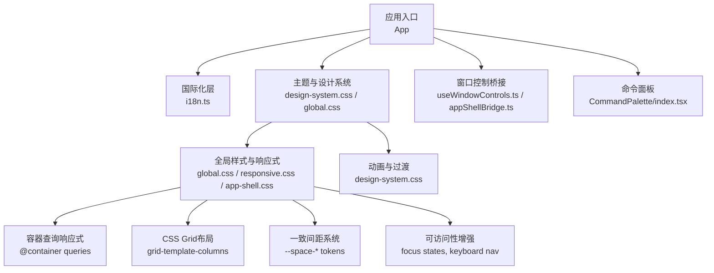
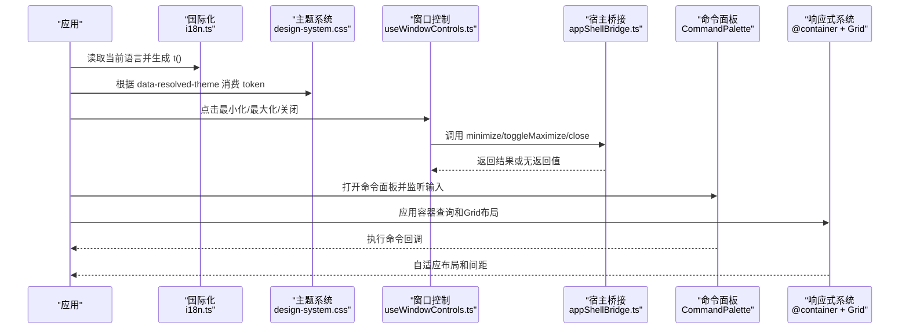
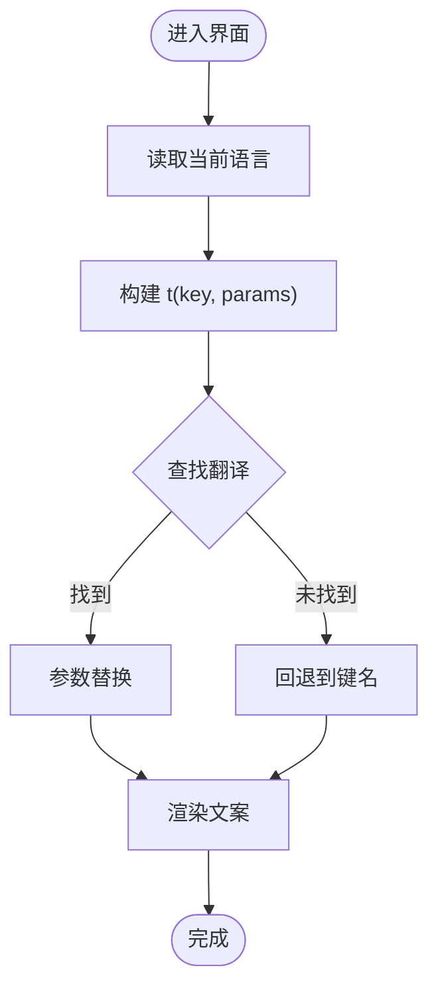
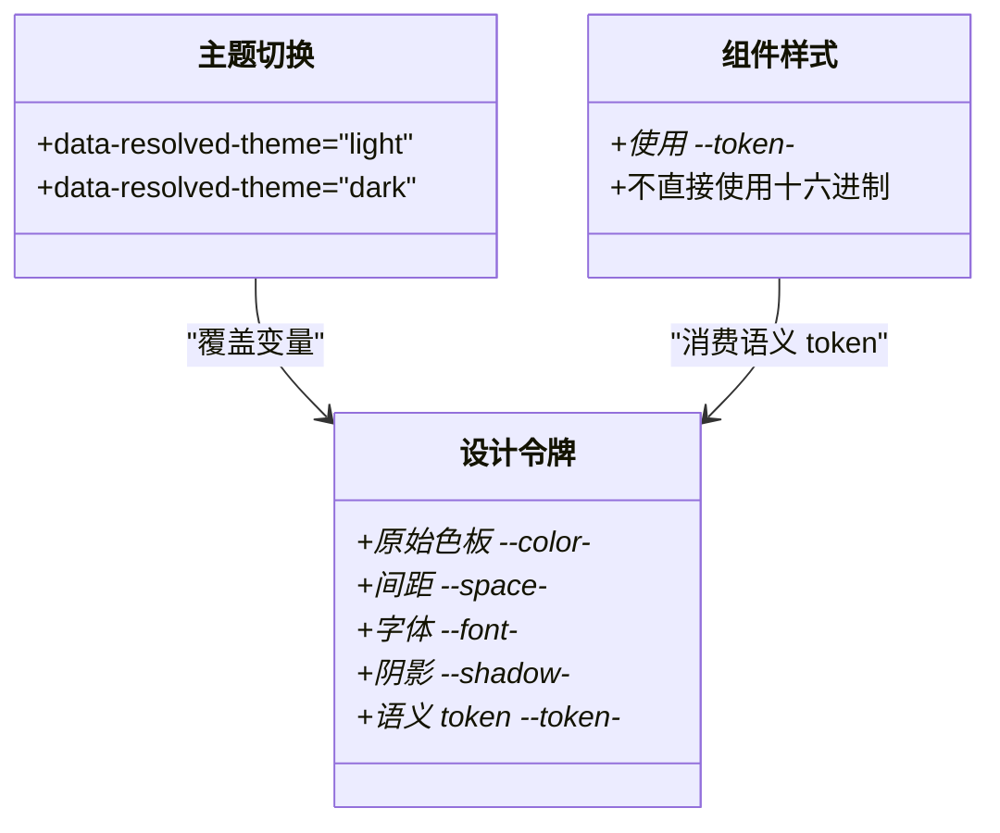
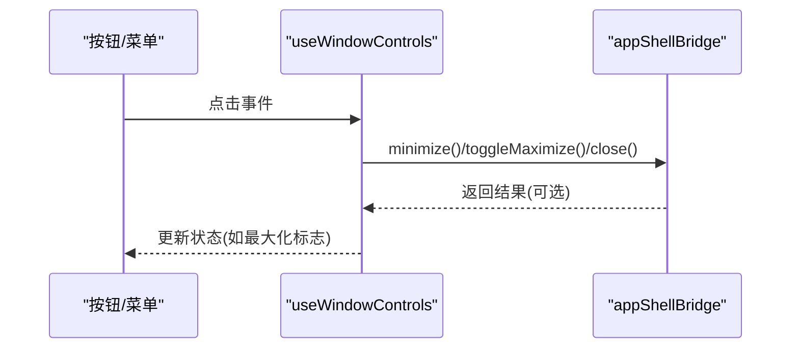
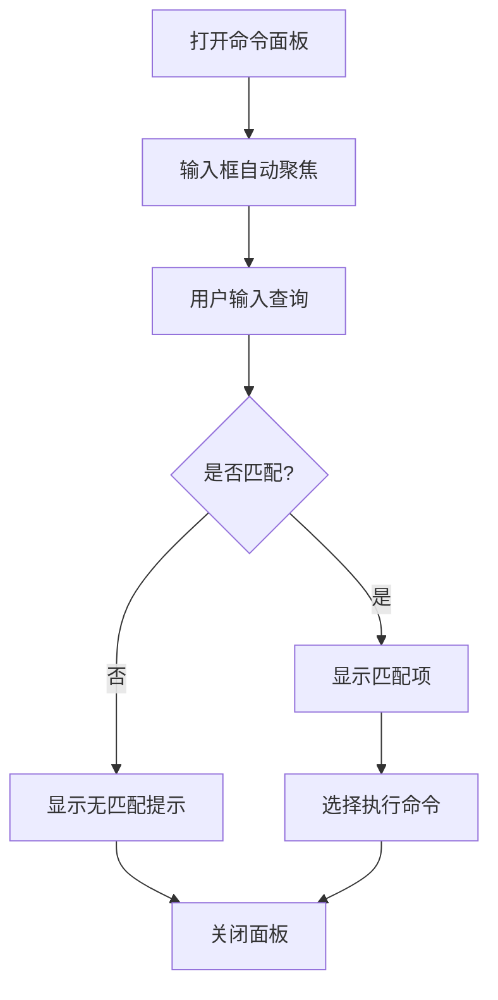
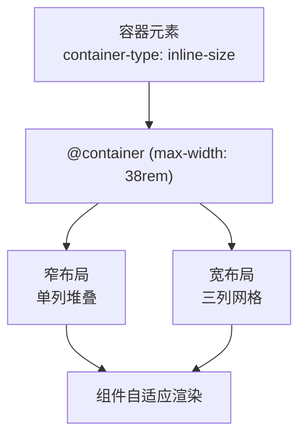
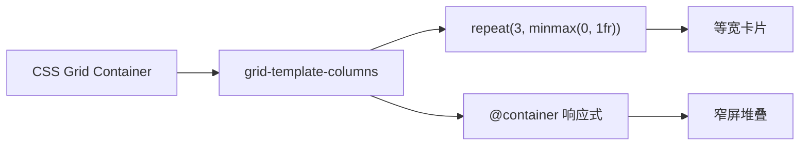
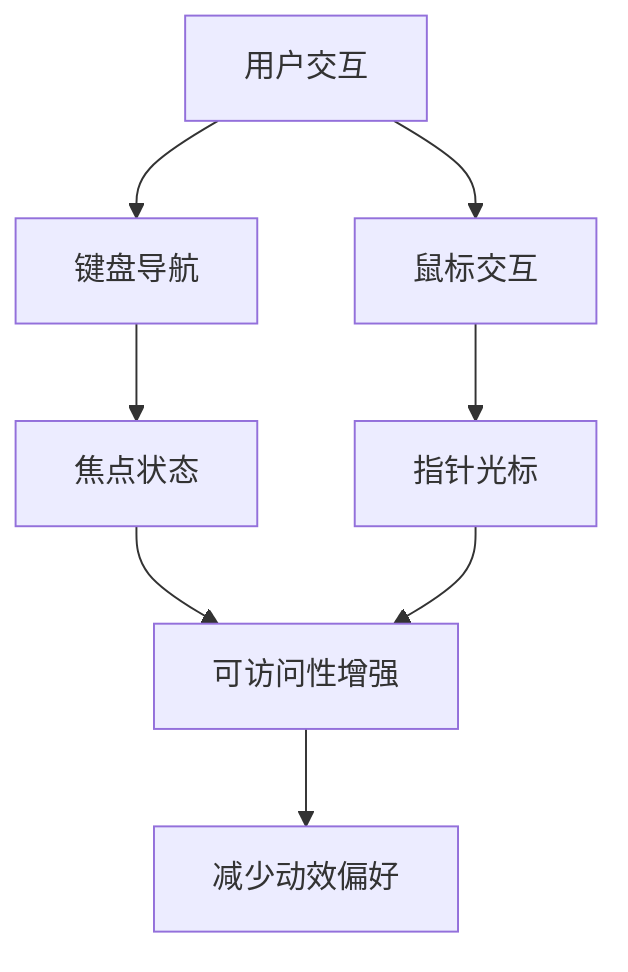
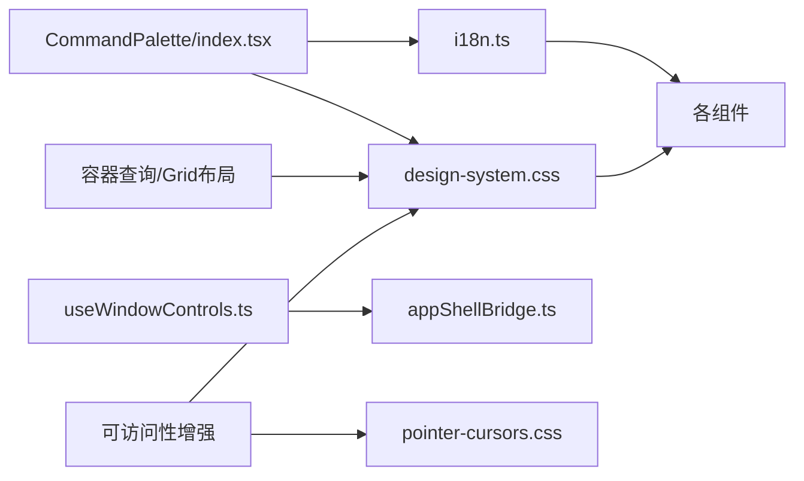

# UI 特性

<cite>
**本文引用的文件**
- [src/renderer/i18n.ts](file://src/renderer/i18n.ts)
- [src/renderer/hooks/useWindowControls.ts](file://src/renderer/hooks/useWindowControls.ts)
- [src/renderer/hooks/appShellBridge.ts](file://src/renderer/hooks/appShellBridge.ts)
- [src/renderer/styles/global.css](file://src/renderer/styles/global.css)
- [src/renderer/styles/design-system.css](file://src/renderer/styles/design-system.css)
- [src/renderer/patterns/CommandPalette/index.tsx](file://src/renderer/patterns/CommandPalette/index.tsx)
- [src/renderer/features/transcript/Debugger-2.css](file://src/renderer/features/transcript/Debugger-2.css)
- [src/shared/theme/composeAccent.test.ts](file://src/shared/theme/composeAccent.test.ts)
- [src/renderer/ui/Switch.css](file://src/renderer/ui/Switch.css)
- [src/renderer/styles/global/app-shell.css](file://src/renderer/styles/global/app-shell.css)
- [src/renderer/styles/global/responsive.css](file://src/renderer/styles/global/responsive.css)
- [src/renderer/styles/global/pointer-cursors.css](file://src/renderer/styles/global/pointer-cursors.css)
- [src/renderer/patterns/ContextBreakdownPopover.css](file://src/renderer/patterns/ContextBreakdownPopover.css)
- [src/renderer/patterns/ContextBreakdownMeter.css](file://src/renderer/patterns/ContextBreakdownMeter.css)
</cite>

## 更新摘要
**变更内容**
- 新增容器查询响应式设计支持，实现组件级别的自适应布局
- 引入CSS Grid布局系统，提供灵活的网格布局能力
- 建立一致的间距系统，使用4px基准的完整间距刻度
- 增强可访问性支持，包括焦点状态、键盘导航和减少动效偏好
- 改进视觉细节，包括优化的颜色方案、边框处理和过渡动画

## 目录
1. [简介](#简介)
2. [项目结构](#项目结构)
3. [核心组件](#核心组件)
4. [架构总览](#架构总览)
5. [详细组件分析](#详细组件分析)
6. [依赖关系分析](#依赖关系分析)
7. [性能考量](#性能考量)
8. [故障排查指南](#故障排查指南)
9. [结论](#结论)
10. [附录](#附录)

## 简介
本文件聚焦 RDC-Agent 的 UI 特性实现，覆盖国际化、主题系统、窗口控制集成、命令面板、响应式设计与动画反馈。目标是帮助开发者与产品人员快速理解多语言切换、文本资源管理、动态语言加载、主题切换与样式隔离、CSS 变量体系、窗口控制桥接、命令面板交互、以及动画与用户反馈机制的设计与落地方式。

**更新** 本次更新重点增强了容器查询响应式设计、CSS Grid布局、一致间距系统和可访问性支持，同时改进了视觉细节和用户体验。

## 项目结构
UI 相关能力主要分布在以下位置：
- 国际化：src/renderer/i18n.ts 及 locales 目录（en、zh-CN）
- 主题与设计系统：src/renderer/styles/design-system.css、global.css、global 子目录
- 窗口控制：src/renderer/hooks/useWindowControls.ts、appShellBridge.ts
- 命令面板：src/renderer/patterns/CommandPalette/index.tsx
- 响应式与布局：src/renderer/styles/global/responsive.css、app-shell.css、pointer-cursors.css
- 容器查询与Grid布局：src/renderer/patterns/ContextBreakdown*.css
- 动画与过渡：design-system.css 中的关键帧与工具类、Switch 等组件样式

图表来源
- [src/renderer/i18n.ts:1-122](file://src/renderer/i18n.ts#L1-L122)
- [src/renderer/styles/global.css:1-12](file://src/renderer/styles/global.css#L1-L12)
- [src/renderer/styles/design-system.css:1-927](file://src/renderer/styles/design-system.css#L1-L927)
- [src/renderer/hooks/useWindowControls.ts:1-20](file://src/renderer/hooks/useWindowControls.ts#L1-L20)
- [src/renderer/hooks/appShellBridge.ts:1-31](file://src/renderer/hooks/appShellBridge.ts#L1-L31)
- [src/renderer/patterns/CommandPalette/index.tsx:1-70](file://src/renderer/patterns/CommandPalette/index.tsx#L1-L70)
- [src/renderer/styles/global/responsive.css:1-105](file://src/renderer/styles/global/responsive.css#L1-L105)
- [src/renderer/patterns/ContextBreakdownPopover.css:1-218](file://src/renderer/patterns/ContextBreakdownPopover.css#L1-L218)
- [src/renderer/patterns/ContextBreakdownMeter.css:1-165](file://src/renderer/patterns/ContextBreakdownMeter.css#L1-L165)

章节来源
- [src/renderer/styles/global.css:1-12](file://src/renderer/styles/global.css#L1-L12)
- [src/renderer/styles/design-system.css:1-927](file://src/renderer/styles/design-system.css#L1-L927)

## 核心组件
- 国际化服务：集中管理翻译键与参数替换，提供 React Hook 以订阅当前语言并生成 t 函数
- 主题系统：基于 CSS 自定义属性的设计令牌，通过 data 属性切换明暗主题，语义化 token 统一消费
- 窗口控制：封装最小化、最大化切换、关闭等原生窗口操作，供 UI 调用
- 命令面板：内置命令列表与过滤逻辑，支持键盘输入与执行回调
- 响应式设计：媒体查询与容器查询结合，CSS Grid布局，保证小屏下的可用性
- 动画与反馈：统一的缓动与时长变量，预置关键帧与工具类，配合可访问性开关
- 间距系统：4px基准的完整间距刻度，确保视觉一致性
- 可访问性：焦点状态、键盘导航、减少动效偏好支持

章节来源
- [src/renderer/i18n.ts:1-122](file://src/renderer/i18n.ts#L1-L122)
- [src/renderer/styles/design-system.css:1-927](file://src/renderer/styles/design-system.css#L1-L927)
- [src/renderer/hooks/useWindowControls.ts:1-20](file://src/renderer/hooks/useWindowControls.ts#L1-L20)
- [src/renderer/patterns/CommandPalette/index.tsx:1-70](file://src/renderer/patterns/CommandPalette/index.tsx#L1-L70)
- [src/renderer/features/transcript/Debugger-2.css:176-235](file://src/renderer/features/transcript/Debugger-2.css#L176-L235)
- [src/renderer/styles/global/responsive.css:1-105](file://src/renderer/styles/global/responsive.css#L1-L105)
- [src/renderer/styles/global/pointer-cursors.css:1-61](file://src/renderer/styles/global/pointer-cursors.css#L1-L61)

## 架构总览
下图展示 UI 特性在渲染进程内的协作关系：应用通过 i18n 获取本地化文案，通过 design-system 消费主题令牌，通过窗口控制桥接与宿主交互，命令面板作为快捷入口触发业务动作，响应式与动画贯穿各组件提升体验。

图表来源
- [src/renderer/i18n.ts:101-121](file://src/renderer/i18n.ts#L101-L121)
- [src/renderer/styles/design-system.css:199-299](file://src/renderer/styles/design-system.css#L199-L299)
- [src/renderer/hooks/useWindowControls.ts:4-18](file://src/renderer/hooks/useWindowControls.ts#L4-L18)
- [src/renderer/hooks/appShellBridge.ts:20-30](file://src/renderer/hooks/appShellBridge.ts#L20-L30)
- [src/renderer/patterns/CommandPalette/index.tsx:19-69](file://src/renderer/patterns/CommandPalette/index.tsx#L19-L69)
- [src/renderer/patterns/ContextBreakdownPopover.css:9-29](file://src/renderer/patterns/ContextBreakdownPopover.css#L9-L29)
- [src/renderer/patterns/ContextBreakdownMeter.css:11-17](file://src/renderer/patterns/ContextBreakdownMeter.css#L11-L17)

## 详细组件分析

### 国际化支持（多语言切换、文本资源管理、动态语言加载）
- 多语言切换
  - 通过 useI18n 钩子从设置中读取当前语言，并以 useMemo 缓存 t 函数，避免重复计算
  - 语言类型来自共享类型定义，确保键名安全
- 文本资源管理
  - 英文为基线资源，中文通过覆盖映射合并，减少重复定义
  - translate 函数支持键值查找与参数替换，未命中时回退到键名
- 动态语言加载
  - 当前实现为静态导入所有语言包；如需按需加载，可在保持相同导出结构的前提下将 import 改为动态 import，并在语言切换时刷新 t 函数

图表来源
- [src/renderer/i18n.ts:93-112](file://src/renderer/i18n.ts#L93-L112)
- [src/renderer/i18n.ts:114-121](file://src/renderer/i18n.ts#L114-L121)

章节来源
- [src/renderer/i18n.ts:1-122](file://src/renderer/i18n.ts#L1-L122)

### 主题系统（主题切换、样式隔离、CSS 变量管理）
- 主题切换
  - 通过根节点 data-resolved-theme 切换明/暗主题，覆盖色板、阴影、表面与对比度
- 样式隔离
  - 采用三层令牌：原始色板 → 语义 token → 组件 token，组件仅消费语义 token，降低耦合
- CSS 变量管理
  - 设计系统集中声明 --color-*、--space-*、--token-* 等变量，并提供动画时长、圆角、阴影等基础值
  - 亮/暗主题分别覆盖关键变量，保证一致的可访问性与视觉层级

图表来源
- [src/renderer/styles/design-system.css:8-197](file://src/renderer/styles/design-system.css#L8-L197)
- [src/renderer/styles/design-system.css:199-299](file://src/renderer/styles/design-system.css#L199-L299)
- [src/renderer/styles/design-system.css:752-927](file://src/renderer/styles/design-system.css#L752-L927)

章节来源
- [src/renderer/styles/design-system.css:1-927](file://src/renderer/styles/design-system.css#L1-L927)

### 窗口控制集成（最小化、最大化、关闭）
- 使用 useWindowControls 暴露 handleWindowMinimize、handleWindowToggleMaximize、handleWindowClose
- 内部通过 appShellBridge 调用宿主 windowControls API，最大化后返回布尔状态用于更新 UI
- 适合嵌入标题栏或菜单项，提供一致的桌面端行为

图表来源
- [src/renderer/hooks/useWindowControls.ts:4-18](file://src/renderer/hooks/useWindowControls.ts#L4-L18)
- [src/renderer/hooks/appShellBridge.ts:20-30](file://src/renderer/hooks/appShellBridge.ts#L20-L30)

章节来源
- [src/renderer/hooks/useWindowControls.ts:1-20](file://src/renderer/hooks/useWindowControls.ts#L1-L20)
- [src/renderer/hooks/appShellBridge.ts:1-31](file://src/renderer/hooks/appShellBridge.ts#L1-L31)

### 命令面板（搜索、过滤、执行）
- 内置命令集合，支持按名称与描述模糊匹配
- 输入框自动聚焦，回车或点击执行回调并关闭面板
- 空结果提示友好，便于扩展更多命令

图表来源
- [src/renderer/patterns/CommandPalette/index.tsx:19-69](file://src/renderer/patterns/CommandPalette/index.tsx#L19-L69)

章节来源
- [src/renderer/patterns/CommandPalette/index.tsx:1-70](file://src/renderer/patterns/CommandPalette/index.tsx#L1-L70)

### 容器查询响应式设计（新增功能）
- 容器查询支持
  - 使用 `container-type: inline-size` 实现组件级别的响应式行为
  - 通过 `@container (max-width: ...)` 实现基于容器宽度的条件样式
- 组件级自适应
  - Context Breakdown 组件展示了完整的容器查询实现模式
  - 支持在不同容器宽度下自动调整布局和行为
- 与传统媒体查询互补
  - 容器查询针对组件自身尺寸，媒体查询针对视口尺寸
  - 两者结合提供更精细的响应式控制

图表来源
- [src/renderer/patterns/ContextBreakdownPopover.css:9-29](file://src/renderer/patterns/ContextBreakdownPopover.css#L9-L29)
- [src/renderer/patterns/ContextBreakdownMeter.css:147-164](file://src/renderer/patterns/ContextBreakdownMeter.css#L147-L164)

章节来源
- [src/renderer/patterns/ContextBreakdownPopover.css:1-218](file://src/renderer/patterns/ContextBreakdownPopover.css#L1-L218)
- [src/renderer/patterns/ContextBreakdownMeter.css:1-165](file://src/renderer/patterns/ContextBreakdownMeter.css#L1-L165)

### CSS Grid布局系统（新增功能）
- 灵活的网格布局
  - 使用 `grid-template-columns: repeat(3, minmax(0, 1fr))` 创建等宽网格
  - 支持响应式网格列数变化
- 间距系统整合
  - 使用 `gap: var(--space-3)` 确保一致的间距
  - 与整体间距系统保持一致
- 容器内自适应
  - 在容器查询中动态调整网格布局
  - 窄容器下自动切换为单列布局

图表来源
- [src/renderer/patterns/ContextBreakdownMeter.css:11-17](file://src/renderer/patterns/ContextBreakdownMeter.css#L11-L17)
- [src/renderer/patterns/ContextBreakdownMeter.css:159-164](file://src/renderer/patterns/ContextBreakdownMeter.css#L159-L164)

章节来源
- [src/renderer/patterns/ContextBreakdownMeter.css:1-165](file://src/renderer/patterns/ContextBreakdownMeter.css#L1-L165)

### 一致间距系统（新增功能）
- 4px基准间距刻度
  - 定义了完整的间距变量：--space-0 到 --space-24
  - 包含半单位间距：--space-0-5 (2px)
- 语义化间距使用
  - 组件间使用较大的间距（--space-4, --space-6）
  - 组件内元素使用较小的间距（--space-1, --space-2）
- 视觉一致性保障
  - 所有UI元素遵循相同的间距规则
  - 支持不同字体大小下的间距适配

章节来源
- [src/renderer/styles/design-system.css:82-96](file://src/renderer/styles/design-system.css#L82-L96)

### 可访问性增强（新增功能）
- 焦点状态管理
  - 统一的焦点环样式，使用 --token-border-focus
  - 支持 focus-visible 伪类，仅在键盘导航时显示焦点环
- 键盘导航支持
  - 所有交互元素支持键盘操作
  - 合理的tab顺序和键盘快捷键
- 指针光标偏好
  - 通过 html[data-pointer-cursors] 控制交互元素的指针样式
  - 支持系统默认箭头光标和指针光标的切换
- 减少动效偏好
  - 尊重 prefers-reduced-motion 媒体查询
  - 提供 data-reduce-motion 属性控制

图表来源
- [src/renderer/styles/global/pointer-cursors.css:1-61](file://src/renderer/styles/global/pointer-cursors.css#L1-L61)
- [src/renderer/ui/Switch.css:63-66](file://src/renderer/ui/Switch.css#L63-L66)
- [src/renderer/styles/design-system.css:537-541](file://src/renderer/styles/design-system.css#L537-L541)

章节来源
- [src/renderer/styles/global/pointer-cursors.css:1-61](file://src/renderer/styles/global/pointer-cursors.css#L1-L61)
- [src/renderer/ui/Switch.css:1-91](file://src/renderer/ui/Switch.css#L1-L91)

### 响应式设计适配
- 通过媒体查询在小屏幕下调整布局方向、尺寸与定位策略
- 针对特定区域（如计划面板、审批条、进度指示）进行堆叠与拉伸优化
- 结合全局响应式样式，保证在不同视口下的可用性
- **更新** 现在结合了容器查询，提供更精细的组件级响应式控制

章节来源
- [src/renderer/features/transcript/Debugger-2.css:176-235](file://src/renderer/features/transcript/Debugger-2.css#L176-L235)
- [src/renderer/styles/global/app-shell.css:96-111](file://src/renderer/styles/global/app-shell.css#L96-L111)
- [src/renderer/styles/global/responsive.css:1-105](file://src/renderer/styles/global/responsive.css#L1-L105)

### 动画效果、过渡动画、用户反馈机制
- 统一动画时长与缓动变量，确保一致的节奏感
- 预置 fadeIn、slideInRight、pulse、shimmer、typing 等关键帧，配合工具类快速启用
- 可访问性：尊重 prefers-reduced-motion 与 data-reduce-motion，禁用不必要的动画
- 组件级反馈：开关、按钮、状态点等具备 hover/focus/active 状态与焦点环
- **更新** 改进了视觉细节，包括更精致的边框处理、阴影效果和过渡动画

章节来源
- [src/renderer/styles/design-system.css:152-184](file://src/renderer/styles/design-system.css#L152-L184)
- [src/renderer/styles/design-system.css:325-471](file://src/renderer/styles/design-system.css#L325-L471)
- [src/renderer/ui/Switch.css:1-91](file://src/renderer/ui/Switch.css#L1-L91)

## 依赖关系分析
- 国际化依赖设置存储与语言类型，提供 t 函数给各组件
- 主题系统被全局样式引入，并通过 data 属性驱动
- 窗口控制依赖宿主桥接，屏蔽平台差异
- 命令面板依赖国际化文案与样式系统
- **更新** 容器查询和Grid布局依赖于设计系统的间距和颜色token
- **更新** 可访问性增强依赖于全局指针光标控制和焦点状态管理

图表来源
- [src/renderer/i18n.ts:1-122](file://src/renderer/i18n.ts#L1-L122)
- [src/renderer/styles/design-system.css:1-927](file://src/renderer/styles/design-system.css#L1-L927)
- [src/renderer/hooks/useWindowControls.ts:1-20](file://src/renderer/hooks/useWindowControls.ts#L1-L20)
- [src/renderer/hooks/appShellBridge.ts:1-31](file://src/renderer/hooks/appShellBridge.ts#L1-L31)
- [src/renderer/patterns/CommandPalette/index.tsx:1-70](file://src/renderer/patterns/CommandPalette/index.tsx#L1-L70)
- [src/renderer/styles/global/pointer-cursors.css:1-61](file://src/renderer/styles/global/pointer-cursors.css#L1-L61)

章节来源
- [src/renderer/i18n.ts:1-122](file://src/renderer/i18n.ts#L1-L122)
- [src/renderer/styles/design-system.css:1-927](file://src/renderer/styles/design-system.css#L1-L927)
- [src/renderer/hooks/useWindowControls.ts:1-20](file://src/renderer/hooks/useWindowControls.ts#L1-L20)
- [src/renderer/hooks/appShellBridge.ts:1-31](file://src/renderer/hooks/appShellBridge.ts#L1-L31)
- [src/renderer/patterns/CommandPalette/index.tsx:1-70](file://src/renderer/patterns/CommandPalette/index.tsx#L1-L70)
- [src/renderer/styles/global/pointer-cursors.css:1-61](file://src/renderer/styles/global/pointer-cursors.css#L1-L61)

## 性能考量
- 国际化
  - 使用 useMemo 缓存 t 函数，减少重渲染开销
  - 建议未来按需加载语言包以降低首屏体积
- 主题
  - 通过 CSS 变量切换主题，避免 JS 频繁操作 DOM 样式
  - 语义 token 复用减少样式冗余
- 动画
  - 合理使用 transform/opacity 动画，避免重排
  - 尊重减少动效偏好，提升可访问性与性能
- 命令面板
  - 简单字符串过滤，数据量小时性能良好；若扩展大量命令，可考虑虚拟滚动与更高效的索引
- **更新** 容器查询
  - 容器查询比媒体查询更高效，只在容器尺寸变化时重新计算样式
  - 避免不必要的重绘和重排
- **更新** CSS Grid
  - Grid布局性能优于传统的flexbox嵌套布局
  - 使用minmax()函数提供更好的响应式性能

[本节为通用指导，不直接分析具体文件]

## 故障排查指南
- 国际化
  - 现象：文案显示为键名
  - 排查：检查 translate 是否命中键；确认语言包已正确合并；参数占位符是否正确
  - 参考路径：[src/renderer/i18n.ts:101-112](file://src/renderer/i18n.ts#L101-L112)
- 主题
  - 现象：切换主题无效或颜色异常
  - 排查：确认根节点 data-resolved-theme 是否正确设置；检查是否误用十六进制而非 token
  - 参考路径：[src/renderer/styles/design-system.css:199-299](file://src/renderer/styles/design-system.css#L199-L299)
- 窗口控制
  - 现象：最小化/最大化/关闭无响应
  - 排查：确认宿主环境存在 windowControls API；检查 appShellBridge 调用链
  - 参考路径：[src/renderer/hooks/appShellBridge.ts:20-30](file://src/renderer/hooks/appShellBridge.ts#L20-L30)
- 命令面板
  - 现象：无法执行命令或无匹配项
  - 排查：检查 onExecute 回调是否注册；确认查询过滤逻辑
  - 参考路径：[src/renderer/patterns/CommandPalette/index.tsx:23-69](file://src/renderer/patterns/CommandPalette/index.tsx#L23-L69)
- 容器查询
  - 现象：容器查询样式不生效
  - 排查：确认容器元素设置了 container-type；检查容器宽度是否符合查询条件
  - 参考路径：[src/renderer/patterns/ContextBreakdownPopover.css:9-29](file://src/renderer/patterns/ContextBreakdownPopover.css#L9-L29)
- CSS Grid
  - 现象：网格布局异常或间距不一致
  - 排查：检查 grid-template-columns 设置；确认使用了正确的间距token
  - 参考路径：[src/renderer/patterns/ContextBreakdownMeter.css:11-17](file://src/renderer/patterns/ContextBreakdownMeter.css#L11-L17)
- 可访问性
  - 现象：焦点状态不可见或键盘导航异常
  - 排查：检查 focus-visible 样式；确认 pointer-cursors 设置；验证键盘事件处理
  - 参考路径：[src/renderer/styles/global/pointer-cursors.css:1-61](file://src/renderer/styles/global/pointer-cursors.css#L1-L61)
- 动画与可访问性
  - 现象：动画干扰或不符合预期
  - 排查：检查 prefers-reduced-motion 与 data-reduce-motion；确认是否启用了工具类
  - 参考路径：[src/renderer/styles/design-system.css:455-471](file://src/renderer/styles/design-system.css#L455-L471)

章节来源
- [src/renderer/i18n.ts:101-112](file://src/renderer/i18n.ts#L101-L112)
- [src/renderer/styles/design-system.css:199-299](file://src/renderer/styles/design-system.css#L199-L299)
- [src/renderer/hooks/appShellBridge.ts:20-30](file://src/renderer/hooks/appShellBridge.ts#L20-L30)
- [src/renderer/patterns/CommandPalette/index.tsx:23-69](file://src/renderer/patterns/CommandPalette/index.tsx#L23-L69)
- [src/renderer/patterns/ContextBreakdownPopover.css:9-29](file://src/renderer/patterns/ContextBreakdownPopover.css#L9-L29)
- [src/renderer/patterns/ContextBreakdownMeter.css:11-17](file://src/renderer/patterns/ContextBreakdownMeter.css#L11-L17)
- [src/renderer/styles/global/pointer-cursors.css:1-61](file://src/renderer/styles/global/pointer-cursors.css#L1-L61)
- [src/renderer/styles/design-system.css:455-471](file://src/renderer/styles/design-system.css#L455-L471)

## 结论
本项目在 UI 层面形成了清晰的模块化与标准化体系：国际化提供安全的文案管理与参数替换；主题系统通过 CSS 变量与语义 token 实现高内聚、低耦合的样式治理；窗口控制桥接屏蔽平台差异；命令面板提供高效的操作入口；响应式与动画保障跨设备可用性与流畅体验。

**更新** 本次增强引入了容器查询响应式设计、CSS Grid布局系统、一致的间距系统和全面的可访问性支持，同时改进了视觉细节和用户体验。建议在后续迭代中继续遵循"优先语义 token、避免硬编码颜色"的原则，并逐步完善按需加载与可访问性增强。

[本节为总结，不直接分析具体文件]

## 附录

### 主题配置示例（说明）
- 在根节点设置 data-resolved-theme 为 light 或 dark 以切换主题
- 通过 design-system.css 中的 --token-* 语义变量消费主题值
- 组件样式应引用 --token-*，避免直接使用十六进制

章节来源
- [src/renderer/styles/design-system.css:199-299](file://src/renderer/styles/design-system.css#L199-L299)
- [src/renderer/styles/design-system.css:752-927](file://src/renderer/styles/design-system.css#L752-L927)

### 国际化文件结构（说明）
- 英文为基线语言包，中文通过覆盖映射合并
- 每个模块对应独立的翻译文件，便于维护与扩展
- 使用 translate(language, key, params) 进行文案渲染

章节来源
- [src/renderer/i18n.ts:45-99](file://src/renderer/i18n.ts#L45-L99)
- [src/renderer/i18n.ts:101-121](file://src/renderer/i18n.ts#L101-L121)

### 主题与强调色生成（说明）
- 强调色会根据主题进行亮度调节，保证可读性
- 测试用例验证了强调色的归一化、派生与主题调制逻辑

章节来源
- [src/shared/theme/composeAccent.test.ts:1-42](file://src/shared/theme/composeAccent.test.ts#L1-L42)

### 容器查询最佳实践（新增）
- 在需要响应的容器上设置 container-type: inline-size
- 使用 @container (max-width: ...) 编写条件样式
- 结合传统媒体查询实现完整的响应式解决方案

章节来源
- [src/renderer/patterns/ContextBreakdownPopover.css:9-29](file://src/renderer/patterns/ContextBreakdownPopover.css#L9-L29)
- [src/renderer/patterns/ContextBreakdownMeter.css:147-164](file://src/renderer/patterns/ContextBreakdownMeter.css#L147-L164)

### CSS Grid布局规范（新增）
- 使用 repeat() 函数创建等宽网格
- 结合 minmax() 函数实现弹性布局
- 在容器查询中动态调整网格列数

章节来源
- [src/renderer/patterns/ContextBreakdownMeter.css:11-17](file://src/renderer/patterns/ContextBreakdownMeter.css#L11-L17)
- [src/renderer/patterns/ContextBreakdownMeter.css:159-164](file://src/renderer/patterns/ContextBreakdownMeter.css#L159-L164)

### 间距系统使用指南（新增）
- 使用 --space-* 变量代替硬编码像素值
- 组件间使用较大间距，组件内使用较小间距
- 保持视觉一致性，遵循4px基准间距

章节来源
- [src/renderer/styles/design-system.css:82-96](file://src/renderer/styles/design-system.css#L82-L96)

### 可访问性实施指南（新增）
- 为所有交互元素添加适当的焦点状态
- 支持键盘导航和屏幕阅读器
- 尊重用户的减少动效偏好
- 使用语义化的HTML结构和ARIA属性

章节来源
- [src/renderer/styles/global/pointer-cursors.css:1-61](file://src/renderer/styles/global/pointer-cursors.css#L1-L61)
- [src/renderer/ui/Switch.css:63-66](file://src/renderer/ui/Switch.css#L63-L66)