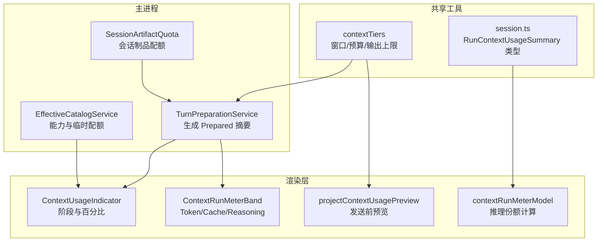
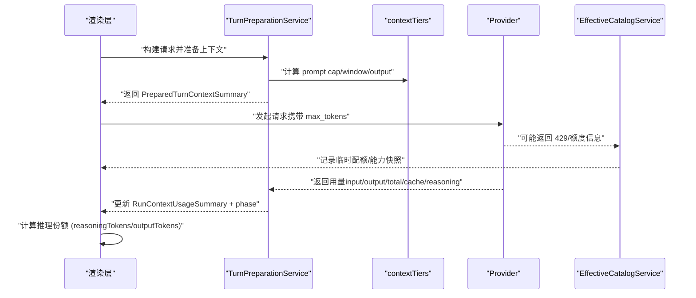
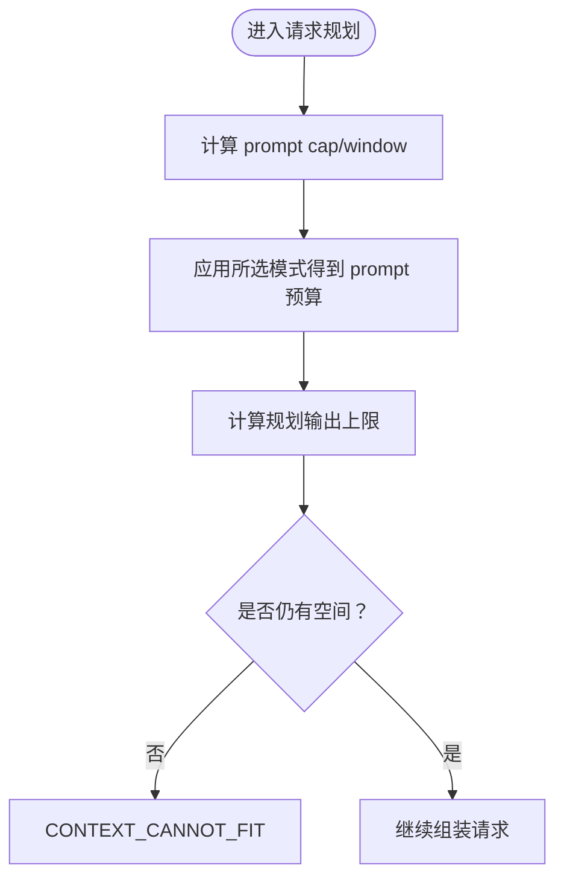
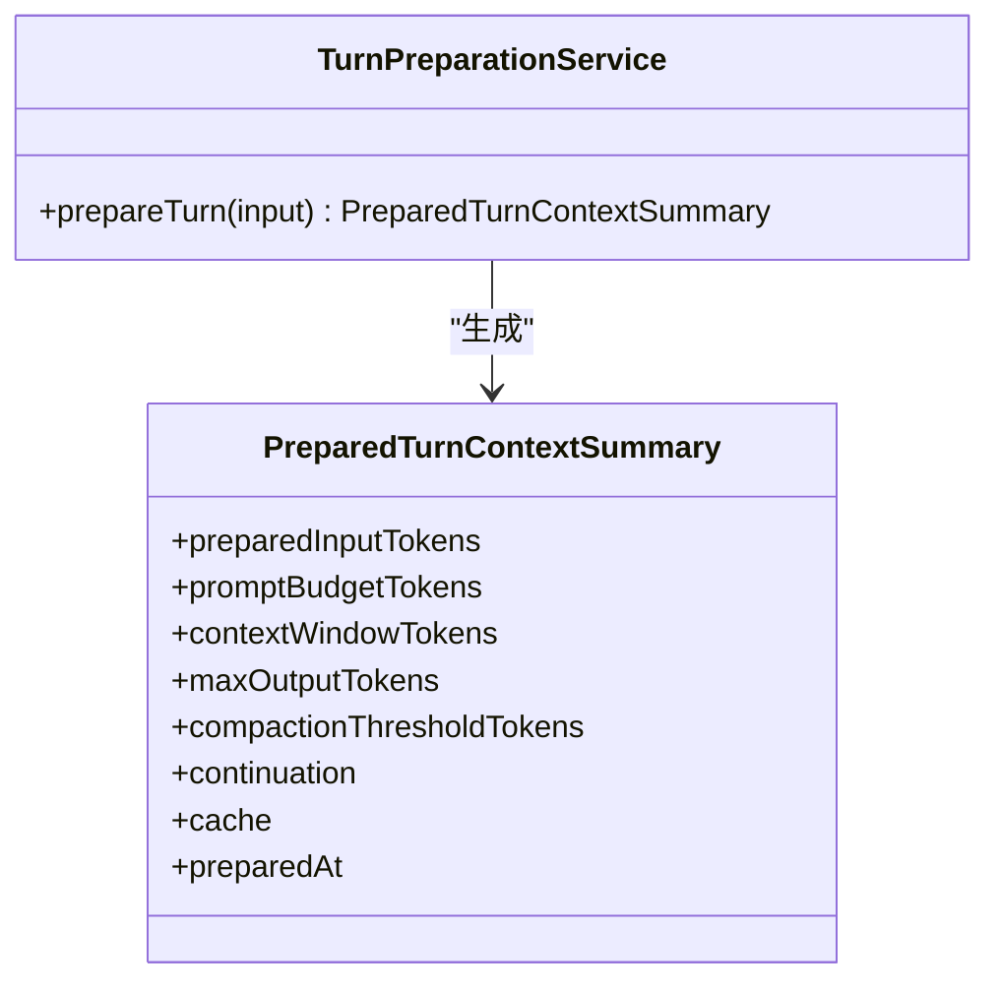
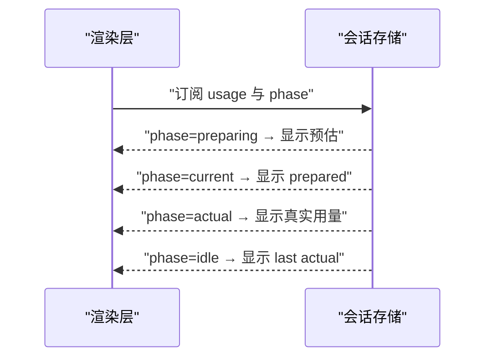
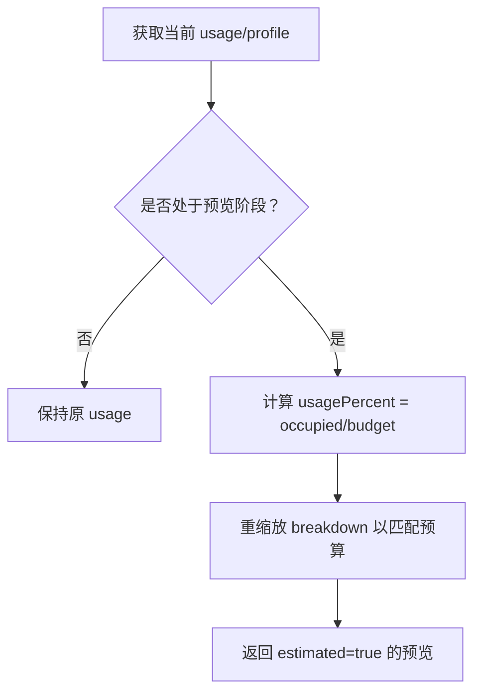
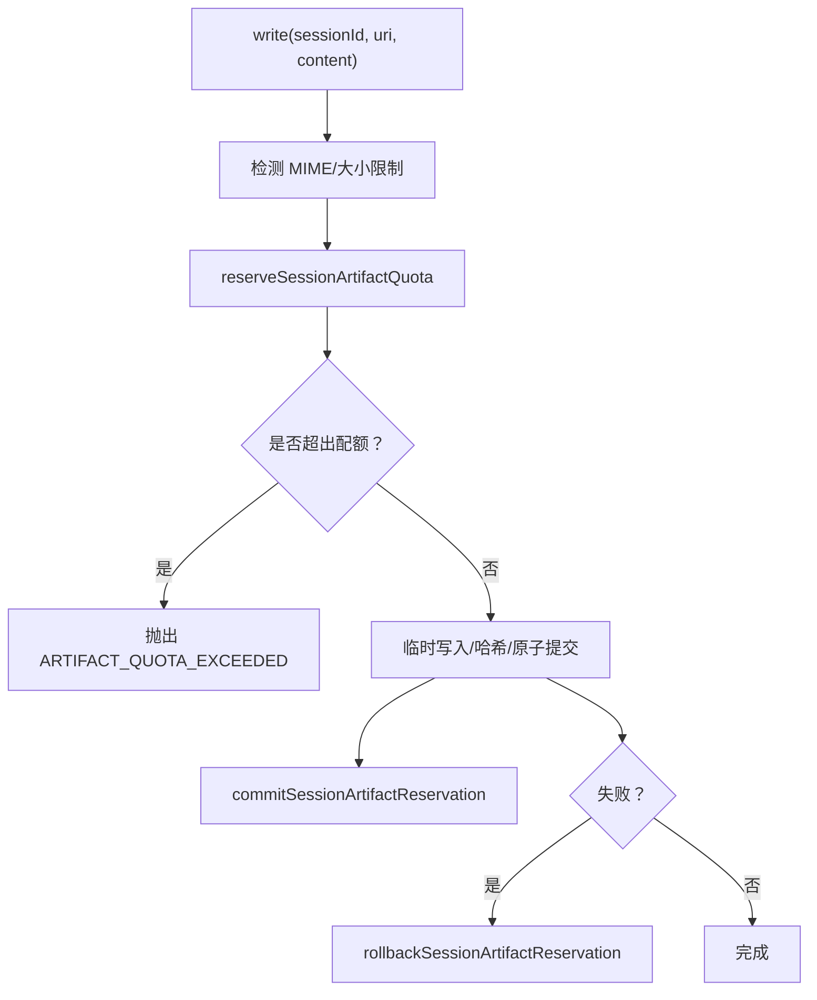
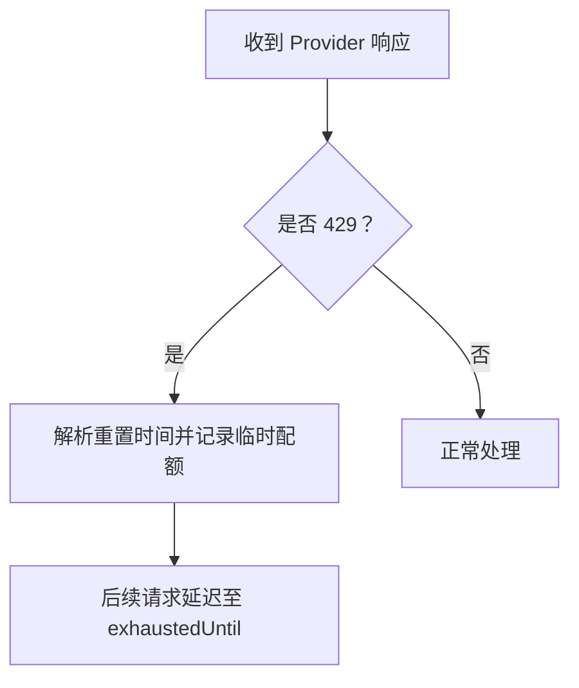
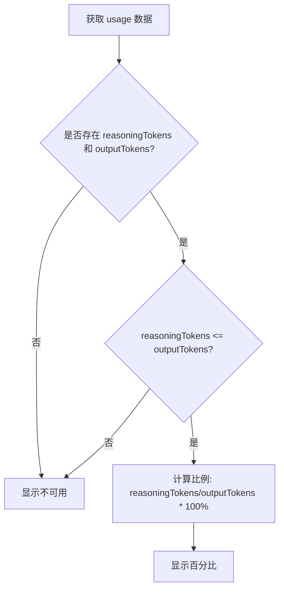
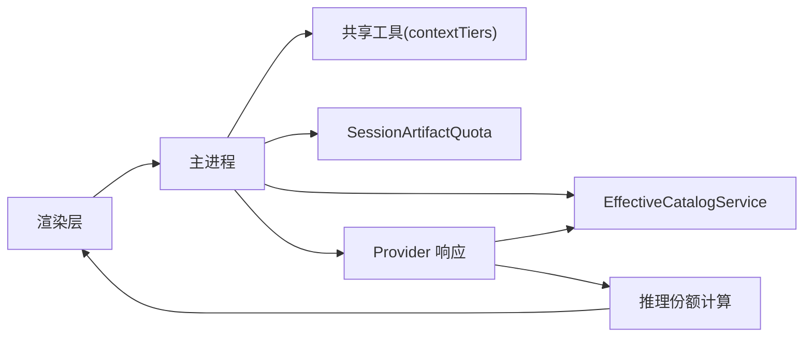

# 上下文运行计量模型

<cite>
**本文引用的文件**
- [DESIGN.md](file://DESIGN.md)
- [runtime-kernel.md](file://docs/contracts/runtime-kernel.md)
- [rdc-runtime.md](file://docs/architecture/rdc-runtime.md)
- [EffectiveCatalogService.ts](file://src/main/settings/EffectiveCatalogService.ts)
- [contextTiers.ts](file://src/shared/utils/contextTiers.ts)
- [contextBudget.test.ts](file://src/shared/utils/contextBudget.test.ts)
- [TurnPreparationService.ts](file://src/main/workflow/debugger/TurnPreparationService.ts)
- [projectContextUsagePreview.ts](file://src/renderer/features/composer/projectContextUsagePreview.ts)
- [ContextUsageIndicator.tsx](file://src/renderer/patterns/ContextUsageIndicator.tsx)
- [ContextRunMeterBand.tsx](file://src/renderer/patterns/ContextRunMeterBand.tsx)
- [contextRunMeterModel.ts](file://src/renderer/patterns/contextRunMeterModel.ts)
- [SessionArtifactQuota.ts](file://src/main/sessions/SessionArtifactQuota.ts)
- [SessionArtifactResolver.ts](file://src/main/sessions/SessionArtifactResolver.ts)
- [ProviderQuota.test.ts](file://src/main/settings/ProviderQuota.test.ts)
- [errorClassifier.test.ts](file://src/main/agent-runtime/providers/internal/errorClassifier.test.ts)
- [ConversationTurnDiagnostic.test.ts](file://src/main/conversation/ConversationTurnDiagnostic.test.ts)
- [session.ts](file://src/shared/types/session.ts)
- [contextBreakdown.ts](file://src/renderer/i18n/locales/zh-CN/contextBreakdown.ts)
- [ContextRunMeterBand.test.ts](file://src/renderer/patterns/ContextRunMeterBand.test.ts)
</cite>

## 更新摘要
**所做更改**
- 新增推理份额（reasoningShare）功能，显示输出 token 中用于推理的比例
- 更新上下文计量模型的展示层，增加推理指标卡片
- 增强计算效率分布洞察，提供推理与直接响应的比例分析

## 目录
1. [简介](#简介)
2. [项目结构](#项目结构)
3. [核心组件](#核心组件)
4. [架构总览](#架构总览)
5. [详细组件分析](#详细组件分析)
6. [依赖关系分析](#依赖关系分析)
7. [性能与配额特性](#性能与配额特性)
8. [故障排查指南](#故障排查指南)
9. [结论](#结论)

## 简介
本文件聚焦 RDC-Agent 的"上下文运行计量模型"，即围绕一次对话回合（turn）在准备、请求与完成阶段的上下文窗口使用、预算分配、压缩阈值、缓存命中、推理 token 以及会话制品配额的全链路度量与约束。该模型贯穿主进程的计划与执行、渲染层的展示与交互，以及与外部 Provider 的能力与配额信号对接，目标是让"当前请求预估"和"实际用量"在同一界面中可观察、可理解、可决策。

**更新** 新增了推理份额（reasoningShare）功能，通过显示输出 token 中用于推理的比例，提供更好的计算效率分布洞察。

## 项目结构
围绕上下文计量涉及的主要代码分布在以下位置：
- 能力与预算计算：共享层 `contextTiers`、测试用例 `contextBudget.test`
- 计划与准备：主进程 `TurnPreparationService` 产出 prepared 摘要
- 运行时用量：主进程 `EffectiveCatalogService` 记录临时配额与能力快照
- 渲染展示：渲染层 `ContextUsageIndicator`、`ContextRunMeterBand`、`contextRunMeterModel`、`projectContextUsagePreview`
- 会话制品配额：主进程 `SessionArtifactQuota`、`SessionArtifactResolver`
- Provider 配额与错误分类：设置层 `ProviderQuota`、错误分类器测试、对话诊断测试

**图表来源**
- [TurnPreparationService.ts:379-408](file://src/main/workflow/debugger/TurnPreparationService.ts#L379-L408)
- [contextTiers.ts:40-69](file://src/shared/utils/contextTiers.ts#L40-L69)
- [EffectiveCatalogService.ts:312-352](file://src/main/settings/EffectiveCatalogService.ts#L312-L352)
- [SessionArtifactQuota.ts:145-211](file://src/main/sessions/SessionArtifactQuota.ts#L145-L211)
- [ContextUsageIndicator.tsx:73-97](file://src/renderer/patterns/ContextUsageIndicator.tsx#L73-L97)
- [ContextRunMeterBand.tsx:46-62](file://src/renderer/patterns/ContextRunMeterBand.tsx#L46-L62)
- [projectContextUsagePreview.ts:38-68](file://src/renderer/features/composer/projectContextUsagePreview.ts#L38-L68)
- [session.ts:234-292](file://src/shared/types/session.ts#L234-L292)

章节来源
- [DESIGN.md:109-111](file://DESIGN.md#L109-L111)
- [runtime-kernel.md:166-168](file://docs/contracts/runtime-kernel.md#L166-L168)

## 核心组件
- 上下文窗口与预算计算：通过 `contextTiers` 提供 prompt cap、完整窗口、输出上限与规划输出上限；配合 `resolvePlanningOutputTokens` 决定每轮最大输出。
- 回合准备与预估：`TurnPreparationService` 在 prepare 阶段计算 prepared input tokens、compaction threshold、continuation 策略、缓存状态等，形成 `PreparedTurnContextSummary`。
- 运行用量与阶段：主进程在 provider 调用后回传 `RunContextUsageSummary`；渲染层根据 phase（preparing/current/actual/last actual）显示不同语义。
- 发送前预览：`projectContextUsagePreview` 将当前 profile 的预算与窗口投影到 usage 上，用于 Composer 发送前的预估展示。
- 会话制品配额：`SessionArtifactQuota` 对 session 内 artifact 写入做 reservation、commit/rollback 与限额校验，防止单会话膨胀。
- Provider 配额与错误：从响应头解析 429 重置时间并记录为临时配额；错误分类器识别 quota_exceeded、rate_limit、timeout 等，驱动重试与诊断。
- **新增** 推理份额计算：`contextRunMeterModel` 计算 reasoningTokens 占 outputTokens 的比例，提供计算效率洞察。

章节来源
- [contextTiers.ts:40-69](file://src/shared/utils/contextTiers.ts#L40-L69)
- [TurnPreparationService.ts:379-408](file://src/main/workflow/debugger/TurnPreparationService.ts#L379-L408)
- [projectContextUsagePreview.ts:38-68](file://src/renderer/features/composer/projectContextUsagePreview.ts#L38-L68)
- [SessionArtifactQuota.ts:145-211](file://src/main/sessions/SessionArtifactQuota.ts#L145-L211)
- [ProviderQuota.test.ts:1-34](file://src/main/settings/ProviderQuota.test.ts#L1-L34)
- [errorClassifier.test.ts:133-196](file://src/main/agent-runtime/providers/internal/errorClassifier.test.ts#L133-L196)
- [contextRunMeterModel.ts:24-28](file://src/renderer/patterns/contextRunMeterModel.ts#L24-L28)

## 架构总览
上下文计量遵循"准备→请求→完成"三阶段模型，并在 UI 中以"Preparing → Current request ~ → Actual / Last actual"呈现。

**图表来源**
- [TurnPreparationService.ts:379-408](file://src/main/workflow/debugger/TurnPreparationService.ts#L379-L408)
- [contextTiers.ts:40-69](file://src/shared/utils/contextTiers.ts#L40-L69)
- [EffectiveCatalogService.ts:312-352](file://src/main/settings/EffectiveCatalogService.ts#L312-L352)
- [ContextUsageIndicator.tsx:73-97](file://src/renderer/patterns/ContextUsageIndicator.tsx#L73-L97)
- [ContextRunMeterBand.tsx:46-62](file://src/renderer/patterns/ContextRunMeterBand.tsx#L46-L62)
- [contextRunMeterModel.ts:24-28](file://src/renderer/patterns/contextRunMeterModel.ts#L24-L28)

章节来源
- [runtime-kernel.md:166-168](file://docs/contracts/runtime-kernel.md#L166-L168)
- [DESIGN.md:109-111](file://DESIGN.md#L109-L111)

## 详细组件分析

### 上下文窗口与预算计算
- 关键函数：
  - `contextTierPromptCap`：取 prompt 上限或 total 作为 prompt cap。
  - `contextTierWindowTokens`：完整上下文窗口（prompt + output reserve）。
  - `contextTierBudgetTokens`：应用所选模式后的 prompt 预算。
  - `resolvePlanningOutputTokens`：规划输出上限（显式或剩余窗口）。
- 行为要点：
  - 输出上限优先于窗口剩余；缺省输出上限视为剩余窗口。
  - 当 prompt 接近压缩线时，输出上限按窗口剩余扣减安全余量。
  - 无法容纳输出时返回 null，触发失败路径。

**图表来源**
- [contextTiers.ts:40-69](file://src/shared/utils/contextTiers.ts#L40-L69)
- [contextBudget.test.ts:34-79](file://src/shared/utils/contextBudget.test.ts#L34-L79)

章节来源
- [contextTiers.ts:40-69](file://src/shared/utils/contextTiers.ts#L40-L69)
- [contextBudget.test.ts:34-79](file://src/shared/utils/contextBudget.test.ts#L34-L79)

### 回合准备与预估（Prepared）
- 准备阶段产出包含：prepared input tokens、prompt budget、context window、max output、compaction threshold、continuation 策略、缓存状态等。
- 这些字段用于渲染层在"current request ~"阶段展示预估用量与进度条。

**图表来源**
- [TurnPreparationService.ts:379-408](file://src/main/workflow/debugger/TurnPreparationService.ts#L379-L408)

章节来源
- [TurnPreparationService.ts:379-408](file://src/main/workflow/debugger/TurnPreparationService.ts#L379-L408)

### 运行用量与阶段展示（Actual/Last Actual）
- 主进程在 provider 完成后回传用量摘要，渲染层依据 phase 切换显示：
  - preparing：无真实用量，显示占位。
  - current：当前请求预估（prepared）。
  - actual：本次请求的真实用量。
  - last actual：上一轮真实用量。
- 指标包括输入/输出/总计 token、缓存命中率、推理 token、累计成本等。

**图表来源**
- [ContextUsageIndicator.tsx:73-97](file://src/renderer/patterns/ContextUsageIndicator.tsx#L73-L97)
- [ContextRunMeterBand.tsx:46-62](file://src/renderer/patterns/ContextRunMeterBand.tsx#L46-L62)
- [contextRunMeterModel.ts:1-43](file://src/renderer/patterns/contextRunMeterModel.ts#L1-L43)

章节来源
- [ContextUsageIndicator.tsx:73-97](file://src/renderer/patterns/ContextUsageIndicator.tsx#L73-L97)
- [ContextRunMeterBand.tsx:46-62](file://src/renderer/patterns/ContextRunMeterBand.tsx#L46-L62)
- [contextRunMeterModel.ts:1-43](file://src/renderer/patterns/contextRunMeterModel.ts#L1-L43)

### 发送前预览（Projected）
- 在用户点击发送前，基于当前 profile 的 context budget 与 window 对 usage 进行重缩放，得到 estimated 预览，帮助用户判断是否会触发压缩或超限。

**图表来源**
- [projectContextUsagePreview.ts:38-68](file://src/renderer/features/composer/projectContextUsagePreview.ts#L38-L68)

章节来源
- [projectContextUsagePreview.ts:38-68](file://src/renderer/features/composer/projectContextUsagePreview.ts#L38-L68)

### 会话制品配额（Artifacts Quota）
- 写入前先 reservation，检查 session 字节上限与 tool-output 文件数上限；成功后 commit，失败则 rollback。
- 单文件限制区分文本与图片；超过限制直接拒绝。

**图表来源**
- [SessionArtifactQuota.ts:145-211](file://src/main/sessions/SessionArtifactQuota.ts#L145-L211)
- [SessionArtifactResolver.ts:471-500](file://src/main/sessions/SessionArtifactResolver.ts#L471-L500)

章节来源
- [SessionArtifactQuota.ts:145-211](file://src/main/sessions/SessionArtifactQuota.ts#L145-L211)
- [SessionArtifactResolver.ts:471-500](file://src/main/sessions/SessionArtifactResolver.ts#L471-L500)

### Provider 配额与错误分类
- 从 HTTP 响应头解析 429 重置时间（Retry-After、epoch、duration），记录为临时配额，不降级能力。
- 错误分类器将消息模式归类为 quota_exceeded、rate_limit、timeout 等，影响重试与诊断文案。

**图表来源**
- [ProviderQuota.test.ts:1-34](file://src/main/settings/ProviderQuota.test.ts#L1-L34)
- [EffectiveCatalogService.ts:312-352](file://src/main/settings/EffectiveCatalogService.ts#L312-L352)
- [errorClassifier.test.ts:133-196](file://src/main/agent-runtime/providers/internal/errorClassifier.test.ts#L133-L196)

章节来源
- [ProviderQuota.test.ts:1-34](file://src/main/settings/ProviderQuota.test.ts#L1-L34)
- [EffectiveCatalogService.ts:312-352](file://src/main/settings/EffectiveCatalogService.ts#L312-L352)
- [errorClassifier.test.ts:133-196](file://src/main/agent-runtime/providers/internal/errorClassifier.test.ts#L133-L196)

### 推理份额计算（新增功能）
- **新增** 推理份额（reasoningShare）功能通过计算 `reasoningTokens` 占 `outputTokens` 的比例，提供计算效率洞察。
- 计算逻辑：当 `reasoningTokens` 和 `outputTokens` 都存在且 `reasoningTokens <= outputTokens` 时，计算百分比；否则显示不可用。
- 在 `ContextRunMeterBand` 中新增第三个卡片专门展示推理指标，包括累计推理 token 数和占输出的比例。

**图表来源**
- [contextRunMeterModel.ts:24-28](file://src/renderer/patterns/contextRunMeterModel.ts#L24-L28)
- [ContextRunMeterBand.tsx:46-47](file://src/renderer/patterns/ContextRunMeterBand.tsx#L46-L47)
- [session.ts:283-284](file://src/shared/types/session.ts#L283-L284)

章节来源
- [contextRunMeterModel.ts:24-28](file://src/renderer/patterns/contextRunMeterModel.ts#L24-L28)
- [ContextRunMeterBand.tsx:46-47](file://src/renderer/patterns/ContextRunMeterBand.tsx#L46-L47)
- [session.ts:283-284](file://src/shared/types/session.ts#L283-L284)
- [contextBreakdown.ts:27-28](file://src/renderer/i18n/locales/zh-CN/contextBreakdown.ts#L27-L28)

## 依赖关系分析
- 渲染层依赖主进程的 prepared/usage 数据，并通过 phase 控制展示语义。
- 主进程依赖共享层 `contextTiers` 计算窗口与预算，依赖 `EffectiveCatalogService` 管理能力与临时配额。
- 会话制品配额独立于 token 计量，但共同保障会话资源健康。
- Provider 配额与错误分类影响请求重试与诊断，间接影响用量统计与用户体验。
- **新增** 推理份额计算依赖于 `RunContextUsageSummary` 中的 `reasoningTokens` 字段，由 Provider 上报。

**图表来源**
- [ContextUsageIndicator.tsx:73-97](file://src/renderer/patterns/ContextUsageIndicator.tsx#L73-L97)
- [TurnPreparationService.ts:379-408](file://src/main/workflow/debugger/TurnPreparationService.ts#L379-L408)
- [contextTiers.ts:40-69](file://src/shared/utils/contextTiers.ts#L40-L69)
- [EffectiveCatalogService.ts:312-352](file://src/main/settings/EffectiveCatalogService.ts#L312-L352)
- [SessionArtifactQuota.ts:145-211](file://src/main/sessions/SessionArtifactQuota.ts#L145-L211)
- [contextRunMeterModel.ts:24-28](file://src/renderer/patterns/contextRunMeterModel.ts#L24-L28)

章节来源
- [runtime-kernel.md:166-168](file://docs/contracts/runtime-kernel.md#L166-L168)
- [DESIGN.md:109-111](file://DESIGN.md#L109-L111)

## 性能与配额特性
- 压缩阈值：由用户阈值与策略合并，结果 clamp 在 50–90%，步长 5；低于阈值或可见回合过短不触发压缩。
- 输出上限：优先使用显式 max_output，否则用窗口剩余减去安全余量；无法容纳时明确失败。
- 会话制品配额：单文件 2 MiB（文本）、图片单项上限 32 MiB；会话合计 96 MiB；tool-outputs 最多 256 文件；artifact_read 返回窗 200 KiB / 2000 行。
- Provider 配额：429 重置时间解析后记录为临时配额，不降级能力；quota_exceeded 不可重试。
- **新增** 推理份额：当 Provider 上报 reasoningTokens 时，计算其占 outputTokens 的比例，提供计算效率洞察。

章节来源
- [DESIGN.md:109-111](file://DESIGN.md#L109-L111)
- [runtime-kernel.md:235-236](file://docs/contracts/runtime-kernel.md#L235-L236)
- [ProviderQuota.test.ts:1-34](file://src/main/settings/ProviderQuota.test.ts#L1-L34)
- [errorClassifier.test.ts:133-196](file://src/main/agent-runtime/providers/internal/errorClassifier.test.ts#L133-L196)
- [contextRunMeterModel.ts:24-28](file://src/renderer/patterns/contextRunMeterModel.ts#L24-L28)

## 故障排查指南
- 若出现"额度不足或触发了限流"：
  - 检查 Provider 响应头中的 429 重置时间，确认是否处于 exhaustedUntil。
  - 查看错误分类是否为 quota_exceeded 或 rate_limit，前者不可重试，后者可重试。
- 若提示"上下文无法容纳"：
  - 检查 prompt 预算与窗口剩余，确认是否已触发压缩；必要时降低输入规模或调整 compaction threshold。
- 若会话制品写入失败：
  - 检查是否达到 session 字节上限或 tool-output 文件数上限；确认 reservation/commit/rollback 流程是否成功。
- 若诊断显示"代理循环停滞/达到最大轮次"：
  - 检查 LoopProgressGuard 是否检测到相同工具轮次无进展；确认 continuation 是否被正确终止。
- **新增** 若推理份额显示不可用：
  - 检查 Provider 是否上报 reasoningTokens；确认 reasoningTokens 是否小于等于 outputTokens。

章节来源
- [ConversationTurnDiagnostic.test.ts:35-63](file://src/main/conversation/ConversationTurnDiagnostic.test.ts#L35-L63)
- [SessionArtifactQuota.ts:145-211](file://src/main/sessions/SessionArtifactQuota.ts#L145-L211)
- [errorClassifier.test.ts:133-196](file://src/main/agent-runtime/providers/internal/errorClassifier.test.ts#L133-L196)
- [contextRunMeterModel.ts:24-28](file://src/renderer/patterns/contextRunMeterModel.ts#L24-L28)

## 结论
RDC-Agent 的上下文运行计量模型以"准备→请求→完成"为主线，结合窗口预算、压缩阈值、缓存命中与推理 token，提供从发送到完成的完整可视化与约束。会话制品配额与 Provider 配额共同保障系统稳定性与可预期性。通过统一的 phase 语义与清晰的错误分类，用户可在同一界面中理解当前请求预估与实际用量，并在必要时做出调整。

**更新** 新增的推理份额功能进一步增强了计算效率洞察，通过显示输出 token 中用于推理的比例，帮助用户更好地理解模型的计算行为和性能特征。这一改进使得上下文计量模型更加完善，为用户提供更全面的运行洞察。