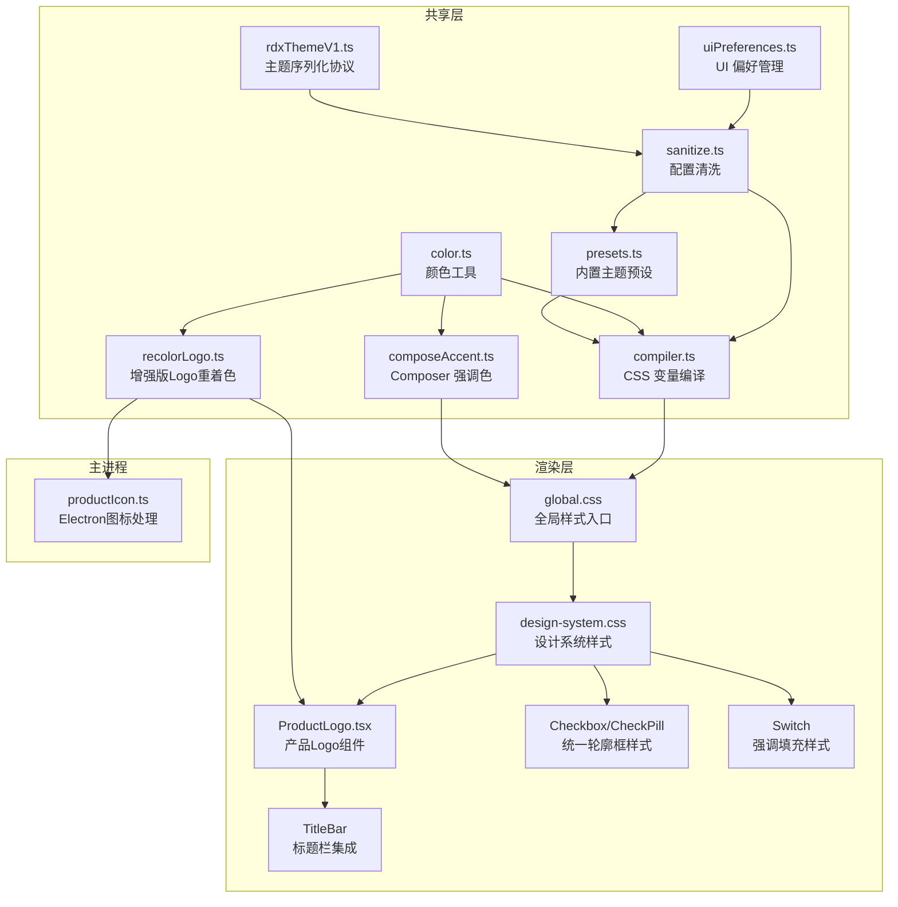
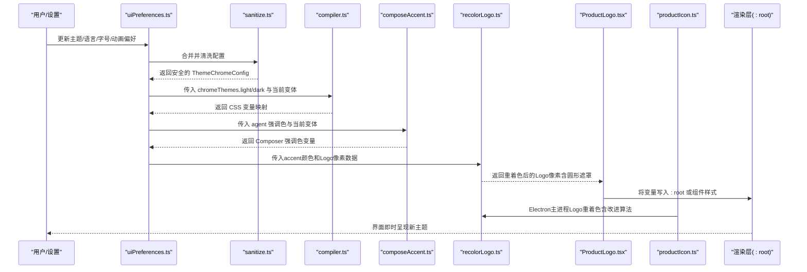
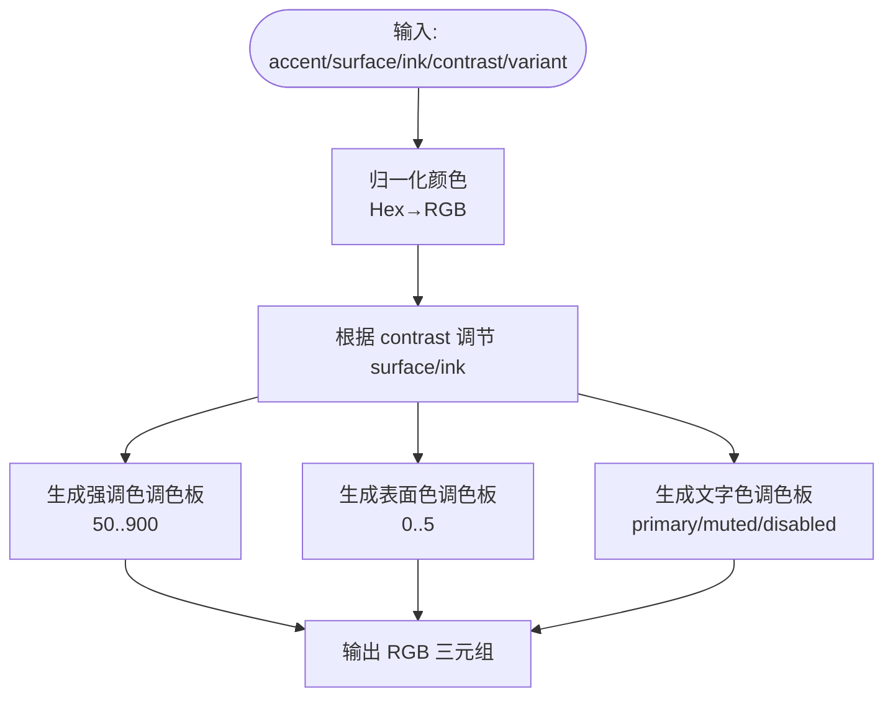
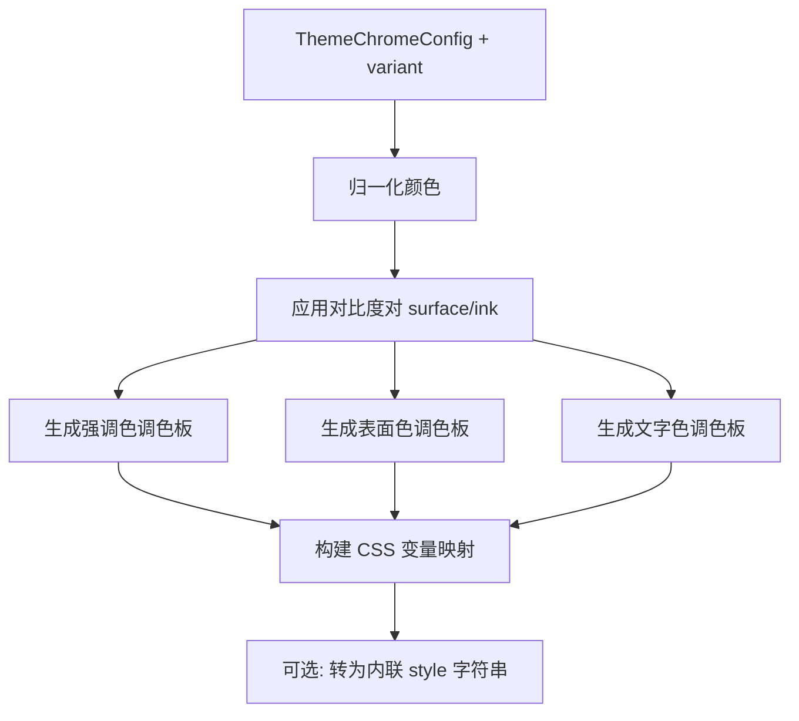
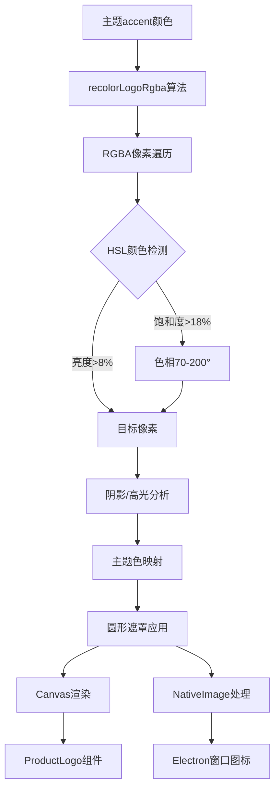
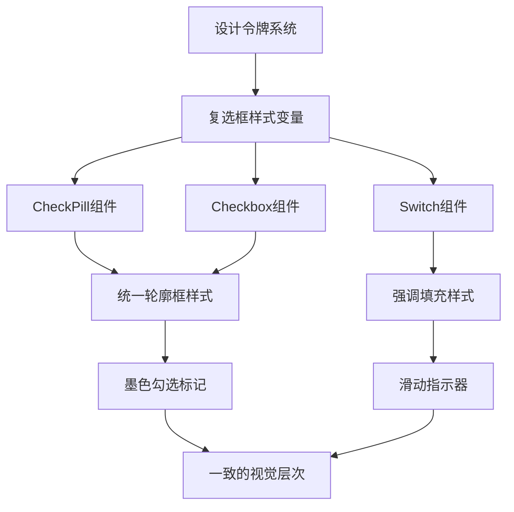
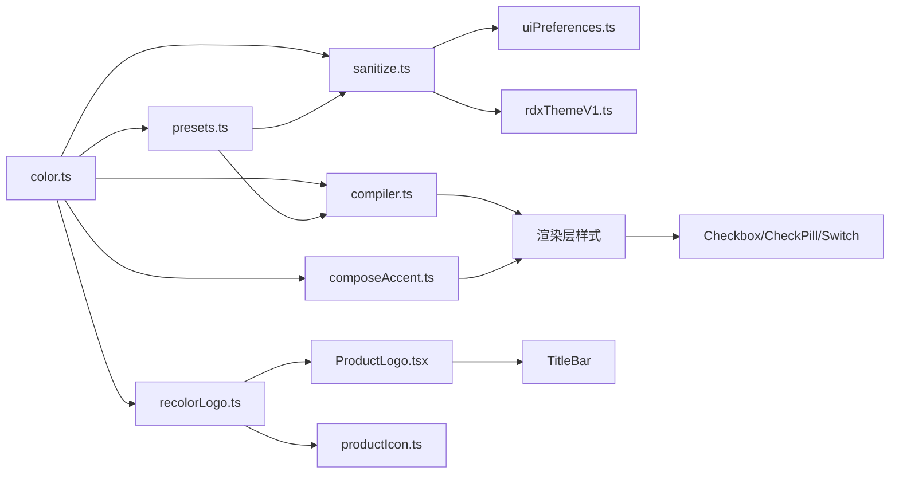

# 主题系统

<cite>
**本文引用的文件**
- [src/shared/theme/index.ts](file://src/shared/theme/index.ts)
- [src/shared/theme/compiler.ts](file://src/shared/theme/compiler.ts)
- [src/shared/theme/presets.ts](file://src/shared/theme/presets.ts)
- [src/shared/theme/color.ts](file://src/shared/theme/color.ts)
- [src/shared/theme/rdxThemeV1.ts](file://src/shared/theme/rdxThemeV1.ts)
- [src/shared/theme/sanitize.ts](file://src/shared/theme/sanitize.ts)
- [src/shared/theme/composeAccent.ts](file://src/shared/theme/composeAccent.ts)
- [src/shared/theme/uiPreferences.ts](file://src/shared/theme/uiPreferences.ts)
- [src/shared/theme/recolorLogo.ts](file://src/shared/theme/recolorLogo.ts)
- [src/renderer/styles/global.css](file://src/renderer/styles/global.css)
- [src/renderer/styles/design-system.css](file://src/renderer/styles/design-system.css)
- [src/renderer/ui/Checkbox.tsx](file://src/renderer/ui/Checkbox.tsx)
- [src/renderer/ui/Checkbox.css](file://src/renderer/ui/Checkbox.css)
- [src/renderer/ui/CheckPill.tsx](file://src/renderer/ui/CheckPill.tsx)
- [src/renderer/ui/CheckPill.css](file://src/renderer/ui/CheckPill.css)
- [src/renderer/ui/Switch.tsx](file://src/renderer/ui/Switch.tsx)
- [src/renderer/ui/Switch.css](file://src/renderer/ui/Switch.css)
- [src/renderer/ui/ProductLogo.tsx](file://src/renderer/ui/ProductLogo.tsx)
- [src/renderer/ui/ProductLogo.css](file://src/renderer/ui/ProductLogo.css)
- [src/main/window/productIcon.ts](file://src/main/window/productIcon.ts)
- [src/renderer/shell/TitleBar/index.tsx](file://src/renderer/shell/TitleBar/index.tsx)
- [docs/ui/design-system.md](file://docs/ui/design-system.md)
</cite>

## 更新摘要
**所做更改**
- 增强了产品品牌系统与动态Logo重着色功能的实现细节
- 更新了recolorLogo.ts模块的技术实现说明，包含改进的颜色匹配算法
- 新增了maskLogoCircleRgba圆形遮罩功能的详细技术说明
- 完善了Electron主进程和渲染进程的Logo集成架构
- 优化了运行时主题应用机制，支持实时Logo颜色变换

## 目录
1. [简介](#简介)
2. [项目结构](#项目结构)
3. [核心组件](#核心组件)
4. [架构总览](#架构总览)
5. [详细组件分析](#详细组件分析)
6. [依赖关系分析](#依赖关系分析)
7. [性能考量](#性能考量)
8. [故障排查指南](#故障排查指南)
9. [结论](#结论)
10. [附录](#附录)

## 简介
本文件系统性阐述 RDC-Agent 的主题系统，覆盖以下方面：
- CSS 变量管理与运行时主题切换机制
- 样式隔离策略与令牌（Design Tokens）体系
- 设计令牌定义与使用（颜色、字体、间距等）
- 主题编译流程（从配置到 CSS 变量的生成与应用）
- 内置主题与自定义主题开发（配置文件结构与扩展点）
- 定制示例与性能优化建议
- **增强版**：产品品牌系统与动态Logo重着色功能，包含改进的颜色匹配算法和圆形遮罩功能

该主题系统以"配置驱动 + 运行时注入"的方式工作：用户或系统通过设置项提供主题配置，共享层负责校验、归一化与编译为 CSS 变量，渲染层在根节点应用这些变量，从而完成主题切换。同时，系统现在支持基于主题的动态Logo重着色，确保品牌标识与当前主题保持一致的视觉风格。

**最新更新**：设计系统令牌已增强，CheckPill和Checkbox组件现在共享轮廓框样式与墨色勾选标记，而Switch保持唯一的强调填充样式，在整个应用中创建了一致的视觉层次结构。增强的产品品牌系统实现了更精确的实时Logo颜色变换，支持亮暗模式下的自适应显示和改进的颜色匹配算法。

## 项目结构
主题相关代码集中在 shared/theme 目录，按职责拆分：
- color.ts：颜色工具函数（Hex/RGB/HSL 转换、对比度调整、调色板缩放）
- presets.ts：内置主题预设（RDC、Dracula、GitHub 等）
- sanitize.ts：配置清洗与默认值回退
- compiler.ts：将主题 Chrome 配置编译为 CSS 变量补丁
- rdxThemeV1.ts：主题序列化/反序列化协议（导入导出）
- composeAccent.ts：派生 Composer 专属强调色与 Effort/Max 视觉变量
- uiPreferences.ts：UI 偏好（主题模式、语言、字号缩放、动画偏好、Chrome 主题）的创建与合并
- recolorLogo.ts：**增强版**：产品Logo动态重着色算法，包含改进的颜色匹配和圆形遮罩功能
- index.ts：统一导出入口

渲染层样式入口位于 renderer/styles，包含全局样式与设计系统样式，用于消费由 shared 层生成的 CSS 变量。产品Logo组件位于 renderer/ui/ProductLogo.tsx，Electron主进程图标处理位于 main/window/productIcon.ts。

**图表来源**
- [src/shared/theme/color.ts:1-246](file://src/shared/theme/color.ts#L1-L246)
- [src/shared/theme/presets.ts:1-110](file://src/shared/theme/presets.ts#L1-L110)
- [src/shared/theme/sanitize.ts:1-103](file://src/shared/theme/sanitize.ts#L1-L103)
- [src/shared/theme/compiler.ts:1-85](file://src/shared/theme/compiler.ts#L1-L85)
- [src/shared/theme/composeAccent.ts:1-102](file://src/shared/theme/composeAccent.ts#L1-L102)
- [src/shared/theme/uiPreferences.ts:1-87](file://src/shared/theme/uiPreferences.ts#L1-L87)
- [src/shared/theme/rdxThemeV1.ts:1-106](file://src/shared/theme/rdxThemeV1.ts#L1-L106)
- [src/shared/theme/recolorLogo.ts:1-33](file://src/shared/theme/recolorLogo.ts#L1-L33)
- [src/renderer/ui/ProductLogo.tsx:1-41](file://src/renderer/ui/ProductLogo.tsx#L1-L41)
- [src/main/window/productIcon.ts:1-62](file://src/main/window/productIcon.ts#L1-L62)

**章节来源**
- [src/shared/theme/index.ts:1-9](file://src/shared/theme/index.ts#L1-L9)
- [src/shared/theme/compiler.ts:1-85](file://src/shared/theme/compiler.ts#L1-L85)
- [src/shared/theme/presets.ts:1-110](file://src/shared/theme/presets.ts#L1-L106)
- [src/shared/theme/color.ts:1-246](file://src/shared/theme/color.ts#L1-L246)
- [src/shared/theme/sanitize.ts:1-103](file://src/shared/theme/sanitize.ts#L1-L103)
- [src/shared/theme/composeAccent.ts:1-102](file://src/shared/theme/composeAccent.ts#L1-L102)
- [src/shared/theme/uiPreferences.ts:1-87](file://src/shared/theme/uiPreferences.ts#L1-L87)
- [src/shared/theme/rdxThemeV1.ts:1-106](file://src/shared/theme/rdxThemeV1.ts#L1-L106)
- [src/shared/theme/recolorLogo.ts:1-33](file://src/shared/theme/recolorLogo.ts#L1-L33)
- [src/renderer/styles/global.css](file://src/renderer/styles/global.css)
- [src/renderer/styles/design-system.css](file://src/renderer/styles/design-system.css)

## 核心组件
- 颜色工具（color.ts）：提供 Hex/RGB/HSL 互转、相对亮度计算、混合、对比度调节、强调色/表面色/文字色调色板缩放。复杂度主要为 O(1) 数学运算与固定规模调色表生成。
- 内置主题预设（presets.ts）：定义多套 light/dark 主题的 accent/surface/ink/contrast/fonts，并提供获取与默认创建能力。
- 配置清洗（sanitize.ts）：对传入的配置进行类型校验、范围约束与回退，确保最终 ThemeChromeConfig 安全可用。
- 主题编译（compiler.ts）：将 ThemeChromeConfig 与主题变体（light/dark）编译为 CSS 变量集合，并支持转为内联 style 字符串。
- Composer 强调色（composeAccent.ts）：基于 agent 强调色派生 Composer 模块的强调色与 Effort/Max 视觉变量，保持明暗模式下可读性与一致性。
- UI 偏好（uiPreferences.ts）：管理 theme/language/fontScale/reduceMotion/chromeThemes 等，提供默认值、合并与清洗。
- 主题序列化（rdxThemeV1.ts）：定义 rdx-theme-v1: 前缀的主题字符串格式，支持序列化与解析，便于导入/导出。
- **增强版**：Logo重着色（recolorLogo.ts）：实现基于RGBA像素操作的动态Logo颜色变换，包含改进的颜色匹配算法和圆形遮罩功能，支持主题驱动的实时Logo重着色。

**最新更新**：复选框样式系统已增强，CheckPill和Checkbox组件现在共享统一的轮廓框样式，而Switch保持独特的强调填充样式，创建了一致的视觉层次。增强的产品品牌系统实现了更精确的实时Logo颜色变换，包含改进的颜色匹配算法和圆形遮罩功能，确保品牌标识与主题保持一致。

**章节来源**
- [src/shared/theme/color.ts:1-246](file://src/shared/theme/color.ts#L1-L246)
- [src/shared/theme/presets.ts:1-110](file://src/shared/theme/presets.ts#L1-L110)
- [src/shared/theme/sanitize.ts:1-103](file://src/shared/theme/sanitize.ts#L1-L103)
- [src/shared/theme/compiler.ts:1-85](file://src/shared/theme/compiler.ts#L1-L85)
- [src/shared/theme/composeAccent.ts:1-102](file://src/shared/theme/composeAccent.ts#L1-L102)
- [src/shared/theme/uiPreferences.ts:1-87](file://src/shared/theme/uiPreferences.ts#L1-L87)
- [src/shared/theme/rdxThemeV1.ts:1-106](file://src/shared/theme/rdxThemeV1.ts#L1-L106)
- [src/shared/theme/recolorLogo.ts:1-33](file://src/shared/theme/recolorLogo.ts#L1-L33)

## 架构总览
主题系统采用"配置 → 清洗 → 编译 → 注入"的分层架构：
- 配置层：来自设置或用户操作，可能包含 chromeThemes.light/dark、theme 模式、reduceMotion 等
- 清洗层：sanitize 保证配置合法，回退到预设默认值
- 编译层：compiler 将配置转换为 CSS 变量；composeAccent 派生模块级变量；recolorLogo 处理Logo重着色
- 注入层：渲染层在 :root 或组件作用域应用变量，实现运行时主题切换；ProductLogo组件实时重绘Logo

**图表来源**
- [src/shared/theme/uiPreferences.ts:20-87](file://src/shared/theme/uiPreferences.ts#L20-L87)
- [src/shared/theme/sanitize.ts:36-87](file://src/shared/theme/sanitize.ts#L36-L87)
- [src/shared/theme/compiler.ts:23-85](file://src/shared/theme/compiler.ts#L23-L85)
- [src/shared/theme/composeAccent.ts:36-86](file://src/shared/theme/composeAccent.ts#L36-L86)
- [src/shared/theme/recolorLogo.ts:4-32](file://src/shared/theme/recolorLogo.ts#L4-L32)
- [src/renderer/ui/ProductLogo.tsx:18-39](file://src/renderer/ui/ProductLogo.tsx#L18-L39)
- [src/main/window/productIcon.ts:27-62](file://src/main/window/productIcon.ts#L27-L62)

## 详细组件分析

### 颜色工具与调色板生成（color.ts）
- 功能要点：
  - 颜色格式转换与归一化（Hex/RGB/HSL）
  - 相对亮度计算，用于对比度调整
  - 对比度滑块（0–100）对 surface/ink 的混合调节
  - 强调色调色板（50–900）、表面色调色板（0–5）、文字色调色板（primary/muted/disabled）
- 复杂度：
  - 调色板生成固定规模，时间复杂度 O(1)，空间复杂度 O(1)
  - 颜色转换均为常数时间操作
- 错误处理：
  - 非法 Hex 自动回退到默认值
  - 对比度参数被钳制到 0–100

**图表来源**
- [src/shared/theme/color.ts:168-246](file://src/shared/theme/color.ts#L168-L246)

**章节来源**
- [src/shared/theme/color.ts:1-246](file://src/shared/theme/color.ts#L1-L246)

### 内置主题预设（presets.ts）
- 功能要点：
  - 预置多套 light/dark 主题（如 RDC、Dracula、GitHub、Catppuccin 等）
  - 提供 presetId 校验、获取指定预设、创建默认主题的能力
- 数据结构：
  - ThemePresetDefinition：id、label、light/dark 的 ThemeChromeConfig
- 使用方式：
  - 作为 sanitize 的回退源
  - 作为编译器输入的基础配置

**章节来源**
- [src/shared/theme/presets.ts:1-110](file://src/shared/theme/presets.ts#L1-L110)

### 配置清洗与回退（sanitize.ts）
- 功能要点：
  - 校验并限制 contrast 范围
  - 校验并归一化 accent/surface/ink 为合法 Hex
  - 校验 fonts.ui/fonts.code，允许 null 表示回退到默认
  - 提供 createDefaultChromeThemes 与 sanitizeChromeThemes
- 错误处理：
  - 非法输入直接回退到预设默认值，避免崩溃
  - 字体字段为空时回退到预设字体

**章节来源**
- [src/shared/theme/sanitize.ts:1-103](file://src/shared/theme/sanitize.ts#L1-L103)

### 主题编译与 CSS 变量注入（compiler.ts）
- 功能要点：
  - compileThemeChrome：将 ThemeChromeConfig 与 variant 编译为 CSS 变量映射
  - 生成语义化变量：--surface-shell/--surface-panel/--surface-elevated 等
  - 生成边框变量：--color-border-subtle/default/strong
  - 生成字体变量：--font-sans/--font-mono
  - compiledChromeToInlineStyle：将变量映射转为内联 style 字符串
- 数据流：
  - 输入：chrome.accent/surface/ink/contrast/fonts + variant
  - 中间：颜色归一化、对比度调节、调色板缩放
  - 输出：CompiledChromeCssVars（键值对）

**图表来源**
- [src/shared/theme/compiler.ts:23-85](file://src/shared/theme/compiler.ts#L23-L85)

**章节来源**
- [src/shared/theme/compiler.ts:1-85](file://src/shared/theme/compiler.ts#L1-L85)

### Composer 强调色与模块级变量（composeAccent.ts）
- 功能要点：
  - deriveComposeAccentVars：基于 agent 强调色派生 Composer 模块的强调色与 Effort/Max 视觉变量
  - modulateAccentForTheme：在 light/dark 下微调强调色明度，保持色调一致
  - normalizeAgentAccent：确保 agent 强调色合法
- 设计原则：
  - 明暗模式仅调节明度，不改变 hue，保持与 agent 品牌的一致性
  - Max 轨道与滑块中性透明，确保像素区域可读性

**章节来源**
- [src/shared/theme/composeAccent.ts:1-102](file://src/shared/theme/composeAccent.ts#L1-L102)

### UI 偏好管理（uiPreferences.ts）
- 功能要点：
  - createDefaultUiPreferences：创建默认 UI 偏好（theme=dark、language=zh-CN、fontScale=medium、reduceMotion=system、chromeThemes=默认）
  - sanitizeUiPreferences：校验 theme/language/fontScale/reduceMotion/chromeThemes
  - mergeUiPreferences：合并部分更新并重新清洗
- 扩展点：
  - 新增枚举值需在 VALID_THEMES/LANGUAGES/FONT_SCALES 中声明
  - chromeThemes 支持分别更新 light/dark 的字体与颜色

**章节来源**
- [src/shared/theme/uiPreferences.ts:1-87](file://src/shared/theme/uiPreferences.ts#L1-L87)

### 主题序列化协议（rdxThemeV1.ts）
- 功能要点：
  - serializeRdxThemeV1：将 ThemeChromeConfig 序列化为 rdx-theme-v1:JSON 字符串
  - parseRdxThemeV1：解析主题字符串，校验 variant/theme 对象，调用 sanitize 生成安全配置
- 兼容性：
  - 拒绝 codex-theme-v1 前缀，强制使用 rdx-theme-v1
  - 支持 presetId 校验，非法则回退到 'rdc'

**章节来源**
- [src/shared/theme/rdxThemeV1.ts:1-106](file://src/shared/theme/rdxThemeV1.ts#L1-L106)

### 增强版产品Logo动态重着色系统
**重大更新**：产品Logo重着色系统得到了显著增强，包含改进的颜色匹配算法和新的圆形遮罩功能。

- **核心算法实现**：
  - `recolorLogoRgba`：基于RGBA像素操作的智能颜色识别和替换算法
    - 使用HSL色彩空间检测青绿色墨水区域（饱和度>18%，亮度>8%，色相70-200°）
    - 智能区分阴影和高光，保持原始图像的立体感
    - 完全匹配主题强调色，同时保留原始阴影和高光信息
  - `maskLogoCircleRgba`：全新的圆形遮罩功能
    - 基于距离计算的平滑边缘处理
    - 支持抗锯齿效果，创建自然的圆形过渡
    - 保持中心区域完整，清除角落像素，应用半透明边缘

- **渲染进程集成**：
  - ProductLogo组件使用Canvas API实时重绘Logo
  - 监听accent属性变化，自动触发Logo重着色
  - 支持128x128尺寸的高清渲染，使用willReadFrequently优化
  - 集成圆形遮罩，创建完美的圆形Logo外观

- **主进程集成**：
  - Electron主进程中的productIcon.ts处理窗口图标
  - 支持打包和非打包环境下的Logo路径解析
  - 缓存机制避免重复计算，提升性能
  - 完整的BGRA↔RGBA格式转换处理

**图表来源**
- [src/shared/theme/recolorLogo.ts:4-32](file://src/shared/theme/recolorLogo.ts#L4-L32)
- [src/renderer/ui/ProductLogo.tsx:18-39](file://src/renderer/ui/ProductLogo.tsx#L18-L39)
- [src/main/window/productIcon.ts:27-62](file://src/main/window/productIcon.ts#L27-L62)

**章节来源**
- [src/shared/theme/recolorLogo.ts:1-33](file://src/shared/theme/recolorLogo.ts#L1-L33)
- [src/renderer/ui/ProductLogo.tsx:1-41](file://src/renderer/ui/ProductLogo.tsx#L1-L41)
- [src/main/window/productIcon.ts:1-62](file://src/main/window/productIcon.ts#L1-L62)
- [src/renderer/ui/ProductLogo.css:1-8](file://src/renderer/ui/ProductLogo.css#L1-L8)
- [src/renderer/shell/TitleBar/index.tsx:1-74](file://src/renderer/shell/TitleBar/index.tsx#L1-L74)

### 复选框样式系统与视觉层次
**最新更新**：设计系统令牌已增强，实现了统一的复选框样式系统。

- **统一轮廓框样式**：
  - CheckPill和Checkbox组件现在共享相同的轮廓框样式
  - 使用 `--checkbox-bg`、`--checkbox-border`、`--checkbox-checked-bg`、`--checkbox-checked-border`、`--checkbox-check-color` 变量
  - 选中状态使用透明背景和加强的边框，配合墨色勾选标记
  - 未选中状态保持简洁的轮廓框设计

- **Switch组件的独特性**：
  - Switch是唯一具有强调填充样式的组件
  - 使用 `--token-accent-primary` 作为激活状态的背景色
  - 提供直观的开关视觉效果，区别于多选控件

- **视觉层次一致性**：
  - 多选控件（CheckPill/Checkbox）：轮廓框 + 墨色勾 ✓
  - 单选控件（Switch）：强调填充 + 滑动指示器
  - 创建清晰的视觉区分，符合用户预期

**图表来源**
- [src/renderer/styles/design-system.css:885-891](file://src/renderer/styles/design-system.css#L885-L891)
- [src/renderer/ui/Checkbox.css:19-43](file://src/renderer/ui/Checkbox.css#L19-L43)
- [src/renderer/ui/CheckPill.css:30-54](file://src/renderer/ui/CheckPill.css#L30-L54)
- [src/renderer/ui/Switch.css:53-61](file://src/renderer/ui/Switch.css#L53-L61)

**章节来源**
- [src/renderer/styles/design-system.css:885-891](file://src/renderer/styles/design-system.css#L885-L891)
- [src/renderer/ui/Checkbox.tsx:1-41](file://src/renderer/ui/Checkbox.tsx#L1-L41)
- [src/renderer/ui/Checkbox.css:1-68](file://src/renderer/ui/Checkbox.css#L1-L68)
- [src/renderer/ui/CheckPill.tsx:1-43](file://src/renderer/ui/CheckPill.tsx#L1-L43)
- [src/renderer/ui/CheckPill.css:1-83](file://src/renderer/ui/CheckPill.css#L1-L83)
- [src/renderer/ui/Switch.tsx:1-40](file://src/renderer/ui/Switch.tsx#L1-L40)
- [src/renderer/ui/Switch.css:1-91](file://src/renderer/ui/Switch.css#L1-L91)
- [docs/ui/design-system.md:169-173](file://docs/ui/design-system.md#L169-L173)

### 样式隔离策略
- 全局变量注入：
  - 通过 :root 注入 --color-*、--surface-*、--font-* 等变量，供全应用消费
- 模块级变量：
  - Composer 模块通过 deriveComposeAccentVars 注入 --composer-* 变量，限定作用域
- 设计系统样式：
  - design-system.css 与 global.css 消费上述变量，实现样式与主题解耦
- 组件级变量：
  - Checkbox/CheckPill/Switch 使用专门的 --checkbox-* 变量，实现组件样式隔离
- **增强版**：产品Logo样式隔离：
  - ProductLogo组件使用独立的CSS类名和产品特定样式
  - Canvas渲染完全独立于DOM样式系统
  - 支持响应式尺寸和圆角裁剪
  - 使用willReadFrequently优化频繁读取操作

**章节来源**
- [src/shared/theme/compiler.ts:23-85](file://src/shared/theme/compiler.ts#L23-L85)
- [src/shared/theme/composeAccent.ts:36-86](file://src/shared/theme/composeAccent.ts#L36-L86)
- [src/renderer/styles/global.css](file://src/renderer/styles/global.css)
- [src/renderer/styles/design-system.css](file://src/renderer/styles/design-system.css)
- [src/renderer/ui/ProductLogo.css:1-8](file://src/renderer/ui/ProductLogo.css#L1-L8)

## 依赖关系分析
- 低耦合高内聚：
  - color.ts 无外部依赖，提供基础能力
  - presets.ts 依赖 color.ts 与类型定义
  - sanitize.ts 依赖 presets.ts 与 color.ts
  - compiler.ts 依赖 color.ts 与类型定义
  - composeAccent.ts 依赖 color.ts 与类型定义
  - uiPreferences.ts 依赖 sanitize.ts 与 presets.ts
  - rdxThemeV1.ts 依赖 sanitize.ts 与 presets.ts
  - **增强版**：recolorLogo.ts 依赖 color.ts 提供颜色转换功能，包含改进的颜色匹配算法
- 潜在循环依赖：
  - 当前分层清晰，未发现循环依赖
- 外部集成点：
  - 渲染层样式文件消费生成的 CSS 变量
  - 设置系统（不在本仓库范围内）提供初始配置
  - **增强版**：Electron主进程与渲染进程通过recolorLogo.ts共享Logo重着色逻辑，包含圆形遮罩功能

**图表来源**
- [src/shared/theme/color.ts:1-246](file://src/shared/theme/color.ts#L1-L246)
- [src/shared/theme/presets.ts:1-110](file://src/shared/theme/presets.ts#L1-L110)
- [src/shared/theme/sanitize.ts:1-103](file://src/shared/theme/sanitize.ts#L1-L103)
- [src/shared/theme/compiler.ts:1-85](file://src/shared/theme/compiler.ts#L1-L85)
- [src/shared/theme/composeAccent.ts:1-102](file://src/shared/theme/composeAccent.ts#L1-L102)
- [src/shared/theme/uiPreferences.ts:1-87](file://src/shared/theme/uiPreferences.ts#L1-L87)
- [src/shared/theme/rdxThemeV1.ts:1-106](file://src/shared/theme/rdxThemeV1.ts#L1-L106)
- [src/shared/theme/recolorLogo.ts:1-33](file://src/shared/theme/recolorLogo.ts#L1-L33)
- [src/renderer/ui/ProductLogo.tsx:1-41](file://src/renderer/ui/ProductLogo.tsx#L1-L41)
- [src/main/window/productIcon.ts:1-62](file://src/main/window/productIcon.ts#L1-L62)

**章节来源**
- [src/shared/theme/index.ts:1-9](file://src/shared/theme/index.ts#L1-L9)

## 性能考量
- 编译开销：
  - 调色板生成与颜色转换均为常数时间，切换主题时开销极低
- 变量数量：
  - 每主题生成约 20–30 个 CSS 变量，内存占用可忽略
- 运行时更新：
  - 通过写入 :root 或组件样式属性触发重绘，建议批量更新以减少重排
- 字体加载：
  - 若 fonts.ui/code 指向外部字体，注意首次加载延迟；建议在关键路径预加载
- 动画偏好：
  - reduceMotion 影响过渡动画，应尊重系统设置以提升可访问性
- 复选框样式优化：
  - 统一的CSS变量减少重复样式计算
  - 组件级样式隔离避免不必要的重绘
- **增强版**：Logo重着色性能优化：
  - 像素级操作使用Uint8Array，内存效率高
  - 条件判断跳过非目标像素，减少计算量
  - 缓存机制避免重复Logo重着色计算
  - Canvas渲染使用willReadFrequently优化频繁读取操作
  - 圆形遮罩算法使用高效的距离计算，支持抗锯齿效果
  - 智能颜色检测减少不必要的像素处理

[本节为通用性能指导，无需特定文件来源]

## 故障排查指南
- 主题字符串无效：
  - 现象：导入主题失败或回退到默认
  - 原因：未以 rdx-theme-v1: 开头、JSON 格式错误、variant 不合法
  - 处理：检查序列化字符串，确保符合协议；参考解析逻辑定位错误
  - 参考：[src/shared/theme/rdxThemeV1.ts:41-106](file://src/shared/theme/rdxThemeV1.ts#L41-L106)
- 颜色异常：
  - 现象：强调色/背景色显示不正确
  - 原因：Hex 格式非法或未归一化
  - 处理：使用 normalizeHexColor 回退到默认；检查输入来源
  - 参考：[src/shared/theme/color.ts:23-43](file://src/shared/theme/color.ts#L23-L43)
- 对比度问题：
  - 现象：文本与背景对比不足
  - 原因：contrast 超出范围或配置错误
  - 处理：clamp 到 0–100；验证 applyContrastPair 输出
  - 参考：[src/shared/theme/color.ts:168-187](file://src/shared/theme/color.ts#L168-L187)
- 字体未生效：
  - 现象：--font-sans/--font-mono 未应用
  - 原因：fonts.ui/code 为空或无效
  - 处理：回退到预设字体；检查 sanitizeFonts 逻辑
  - 参考：[src/shared/theme/sanitize.ts:18-34](file://src/shared/theme/sanitize.ts#L18-L34)
- Composer 强调色异常：
  - 现象：Effort/Max 控件颜色不符合预期
  - 原因：agent 强调色缺失或非法
  - 处理：使用 normalizeAgentAccent 与 modulateAccentForTheme 修正
  - 参考：[src/shared/theme/composeAccent.ts:88-102](file://src/shared/theme/composeAccent.ts#L88-L102)
- **复选框样式问题**：
  - 现象：CheckPill/Checkbox选中状态显示异常
  - 原因：--checkbox-* 变量未正确定义或被覆盖
  - 处理：检查design-system.css中的复选框变量定义；确保Switch使用独立的强调填充样式
  - 参考：[src/renderer/styles/design-system.css:885-891](file://src/renderer/styles/design-system.css#L885-L891)
- **增强版**：Logo重着色问题：
  - 现象：Logo颜色未按主题变化或显示异常
  - 原因：accent颜色格式错误、像素数据处理异常、Canvas上下文不可用、颜色匹配算法失效
  - 处理：检查recolorLogoRgba输入参数；验证像素数组格式；确认Canvas支持；检查HSL颜色检测阈值
  - 参考：[src/shared/theme/recolorLogo.ts:4-19](file://src/shared/theme/recolorLogo.ts#L4-L19)
  - 参考：[src/shared/theme/recolorLogo.ts:22-32](file://src/shared/theme/recolorLogo.ts#L22-L32)
  - 参考：[src/renderer/ui/ProductLogo.tsx:28-35](file://src/renderer/ui/ProductLogo.tsx#L28-L35)
  - 参考：[src/main/window/productIcon.ts:40-56](file://src/main/window/productIcon.ts#L40-L56)

**章节来源**
- [src/shared/theme/rdxThemeV1.ts:41-106](file://src/shared/theme/rdxThemeV1.ts#L41-L106)
- [src/shared/theme/color.ts:23-43](file://src/shared/theme/color.ts#L23-L43)
- [src/shared/theme/color.ts:168-187](file://src/shared/theme/color.ts#L168-L187)
- [src/shared/theme/sanitize.ts:18-34](file://src/shared/theme/sanitize.ts#L18-L34)
- [src/shared/theme/composeAccent.ts:88-102](file://src/shared/theme/composeAccent.ts#L88-L102)
- [src/shared/theme/recolorLogo.ts:4-32](file://src/shared/theme/recolorLogo.ts#L4-L32)
- [src/renderer/ui/ProductLogo.tsx:28-35](file://src/renderer/ui/ProductLogo.tsx#L28-L35)
- [src/main/window/productIcon.ts:40-56](file://src/main/window/productIcon.ts#L40-L56)

## 结论
本主题系统通过清晰的层次划分与严格的配置清洗，实现了稳定、可扩展且高性能的主题能力。其核心优势包括：
- 配置驱动：集中管理主题配置，易于维护与扩展
- 运行时切换：通过 CSS 变量实现即时主题更新
- 模块化：Composer 等模块拥有独立的强调色派生逻辑
- 可移植：序列化协议支持主题导入/导出
- **统一的视觉层次**：CheckPill和Checkbox共享轮廓框样式，Switch保持独特强调填充，创建一致的用户体验
- **增强版**：产品品牌系统：实现了更精确的实时Logo颜色变换，包含改进的颜色匹配算法和圆形遮罩功能，确保品牌标识在所有主题下保持一致的视觉效果

**重大更新**：增强的产品Logo重着色系统提供了更智能的颜色识别和更高质量的渲染效果。改进的颜色匹配算法能够准确识别青绿色墨水区域，智能处理阴影和高光，同时新的圆形遮罩功能创建了完美的圆形Logo外观，支持抗锯齿效果。

建议在实际使用中：
- 优先使用内置预设，必要时基于预设扩展
- 谨慎修改 contrast，确保可访问性
- 关注字体加载与 reduceMotion 设置，提升用户体验
- 遵循复选框样式约定，保持视觉层次一致性
- **增强版**：利用产品Logo重着色功能，确保品牌标识在所有主题下保持一致的视觉效果，充分利用改进的颜色匹配算法和圆形遮罩功能

[本节为总结性内容，无需特定文件来源]

## 附录

### 设计令牌（Design Tokens）定义与使用
- 颜色令牌：
  - 强调色：--color-accent-50..900
  - 背景色：--color-bg-0..5
  - 文字色：--color-text-primary/secondary/tertiary/muted/disabled
  - 边框色：--color-border-subtle/default/strong
  - 叠加层：--color-surface-overlay
- 字体令牌：
  - --font-sans：UI 字体栈
  - --font-mono：代码字体栈
- 语义令牌：
  - --surface-shell/panel/elevated/active
  - --token-surface-sunken/raised（亮模式）
- **复选框令牌**：
  - --checkbox-bg：复选框背景色
  - --checkbox-border：复选框边框色
  - --checkbox-checked-bg：选中状态背景色（透明）
  - --checkbox-checked-border：选中状态边框色
  - --checkbox-check-color：勾选标记颜色（墨色）
- **增强版**：产品Logo令牌：
  - --control-height-md：Logo容器高度
  - --radius-full：Logo圆角半径
- 使用方式：
  - 在样式文件中通过 var(--token-name) 引用
  - 在运行时通过 JS 写入 :root.style.setProperty 动态更新

**章节来源**
- [src/shared/theme/compiler.ts:35-77](file://src/shared/theme/compiler.ts#L35-L77)
- [src/shared/theme/composeAccent.ts:68-85](file://src/shared/theme/composeAccent.ts#L68-L85)
- [src/renderer/styles/design-system.css:885-891](file://src/renderer/styles/design-system.css#L885-L891)
- [src/renderer/ui/ProductLogo.css:1-8](file://src/renderer/ui/ProductLogo.css#L1-L8)

### 主题配置文件结构
- ThemeChromeConfig（light/dark）：
  - presetId：预设标识
  - accent：强调色（Hex）
  - surface：背景基色（Hex）
  - ink：文字基色（Hex）
  - contrast：对比度滑块（0–100）
  - fonts：{ ui: string|null, code: string|null }
- ChromeThemesConfig：
  - light：ThemeChromeConfig
  - dark：ThemeChromeConfig
- UiPreferences：
  - theme：'dark'|'light'|'system'
  - language：'zh-CN'|'en'
  - fontScale：'small'|'medium'|'large'
  - composerMarkdown：boolean
  - usePointerCursors：boolean
  - contextBreakdownExpanded：boolean
  - reduceMotion：'system'|'on'|'off'
  - chromeThemes：ChromeThemesConfig

**章节来源**
- [src/shared/theme/presets.ts:3-23](file://src/shared/theme/presets.ts#L3-L23)
- [src/shared/theme/sanitize.ts:36-87](file://src/shared/theme/sanitize.ts#L36-L87)
- [src/shared/theme/uiPreferences.ts:20-58](file://src/shared/theme/uiPreferences.ts#L20-L58)

### 主题定制示例
- 基于预设定制：
  - 选择内置预设（如 Dracula），调整 accent/surface/ink/contrast
  - 通过 mergeUiPreferences 局部更新 chromeThemes.light/dark
- 自定义主题：
  - 构造 ThemeChromeConfig，调用 compileThemeChrome 生成变量
  - 将变量写入 :root 或组件样式
- 导入/导出：
  - 使用 serializeRdcThemeV1 导出主题字符串
  - 使用 parseRdcThemeV1 导入并校验主题
- **复选框样式定制**：
  - 可通过修改 --checkbox-* 变量自定义复选框外观
  - Switch组件使用独立的强调填充样式，不受复选框变量影响
  - 确保CheckPill和Checkbox保持一致的轮廓框风格
- **增强版**：产品Logo定制：
  - 通过调整accent颜色实现Logo颜色变换
  - 支持自定义Logo资源路径
  - 可在Electron主进程和渲染进程中应用相同的重着色算法
  - 利用改进的颜色匹配算法获得更准确的Logo重着色效果

**章节来源**
- [src/shared/theme/compiler.ts:23-85](file://src/shared/theme/compiler.ts#L23-L85)
- [src/shared/theme/uiPreferences.ts:60-87](file://src/shared/theme/uiPreferences.ts#L60-L87)
- [src/shared/theme/rdxThemeV1.ts:23-106](file://src/shared/theme/rdxThemeV1.ts#L23-L106)
- [src/shared/theme/recolorLogo.ts:4-32](file://src/shared/theme/recolorLogo.ts#L4-L32)
- [src/renderer/ui/ProductLogo.tsx:18-39](file://src/renderer/ui/ProductLogo.tsx#L18-L39)
- [src/main/window/productIcon.ts:27-62](file://src/main/window/productIcon.ts#L27-L62)

### 组件样式变量参考
- **复选框组件变量**：
  - `--checkbox-bg`：背景色（面板背景）
  - `--checkbox-border`：边框色（默认边框）
  - `--checkbox-checked-bg`：选中背景（透明）
  - `--checkbox-checked-border`：选中边框（强边框）
  - `--checkbox-check-color`：勾选颜色（标题文本色）
- **Switch组件变量**：
  - 使用 `--token-accent-primary` 作为激活状态背景
  - 使用 `--token-text-inverse` 作为滑块颜色
  - 独立于复选框样式系统
- **增强版**：产品Logo组件变量：
  - `--control-height-md`：Logo容器尺寸
  - `--radius-full`：Logo圆角半径
  - 支持响应式尺寸适配
  - 使用willReadFrequently优化Canvas渲染性能

**章节来源**
- [src/renderer/styles/design-system.css:885-891](file://src/renderer/styles/design-system.css#L885-L891)
- [src/renderer/ui/Switch.css:53-61](file://src/renderer/ui/Switch.css#L53-L61)
- [src/renderer/ui/ProductLogo.css:1-8](file://src/renderer/ui/ProductLogo.css#L1-L8)
- [docs/ui/design-system.md:169-173](file://docs/ui/design-system.md#L169-L173)

### 增强版产品品牌系统技术规格
**重大更新**：产品品牌系统得到了全面增强，包含改进的颜色匹配算法和新的圆形遮罩功能。

- **增强版Logo重着色算法**：
  - 输入：RGBA像素数组 + 主题强调色（Hex格式）
  - 处理：HSL色彩空间检测，智能识别青绿色墨水区域（饱和度>18%，亮度>8%，色相70-200°）
  - 输出：重着色后的RGBA像素数组，保持原始阴影和高光信息
  - 性能：O(n)时间复杂度，n为像素数量，智能跳过非目标像素
- **全新圆形遮罩算法**：
  - 基于距离计算的平滑边缘处理
  - 支持抗锯齿效果，创建自然的圆形过渡
  - 保持中心区域完整，清除角落像素，应用半透明边缘
  - 半径计算：min(width, height) * 0.49
- **集成点**：
  - 渲染进程：ProductLogo组件，Canvas API渲染，使用willReadFrequently优化
  - 主进程：productIcon.ts，Electron NativeImage处理，完整的BGRA↔RGBA格式转换
  - 共享算法：recolorLogo.ts，确保跨平台一致性
- **测试覆盖**：
  - 多种强调色测试（#cc7d5e, #33d1ff, #8b44bb）
  - 中性色、近黑色、其他色调和透明像素的保留测试
  - 阴影和高光的正确处理测试
  - 圆形遮罩的边缘抗锯齿测试

**章节来源**
- [src/shared/theme/recolorLogo.ts:1-33](file://src/shared/theme/recolorLogo.ts#L1-L33)
- [src/renderer/ui/ProductLogo.tsx:1-41](file://src/renderer/ui/ProductLogo.tsx#L1-L41)
- [src/main/window/productIcon.ts:1-62](file://src/main/window/productIcon.ts#L1-L62)
- [src/shared/theme/recolorLogo.test.ts:1-30](file://src/shared/theme/recolorLogo.test.ts#L1-L30)