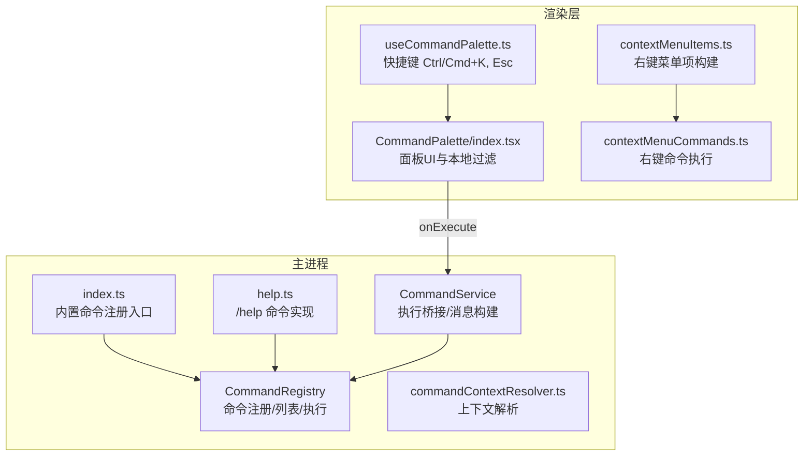
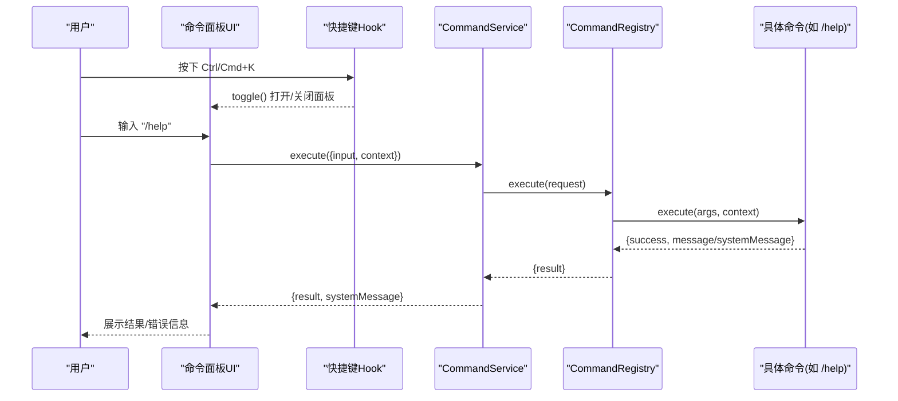
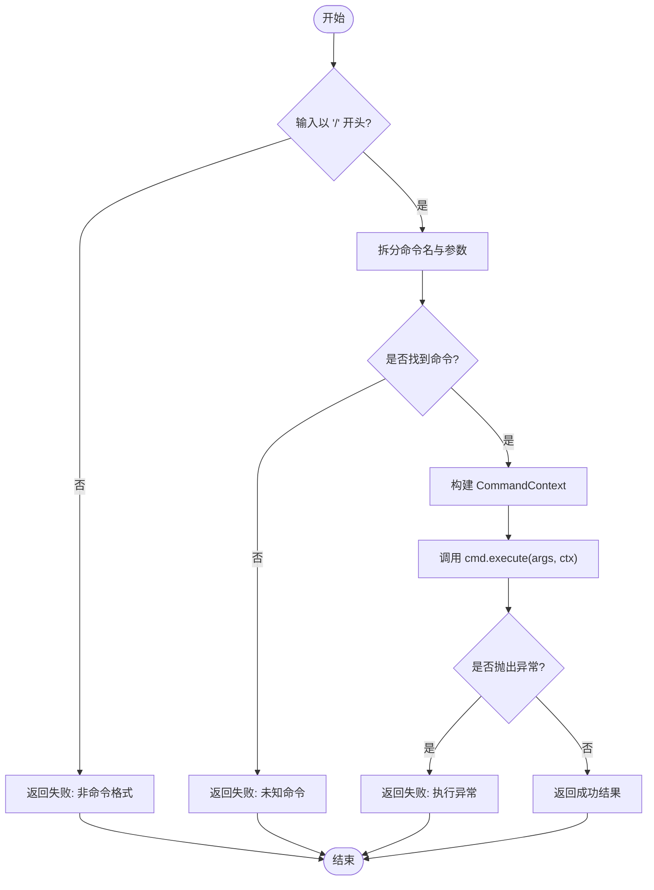
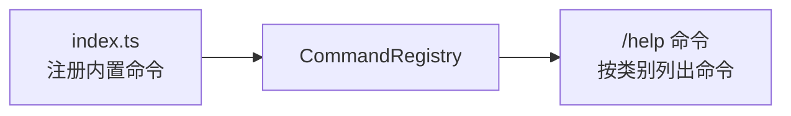
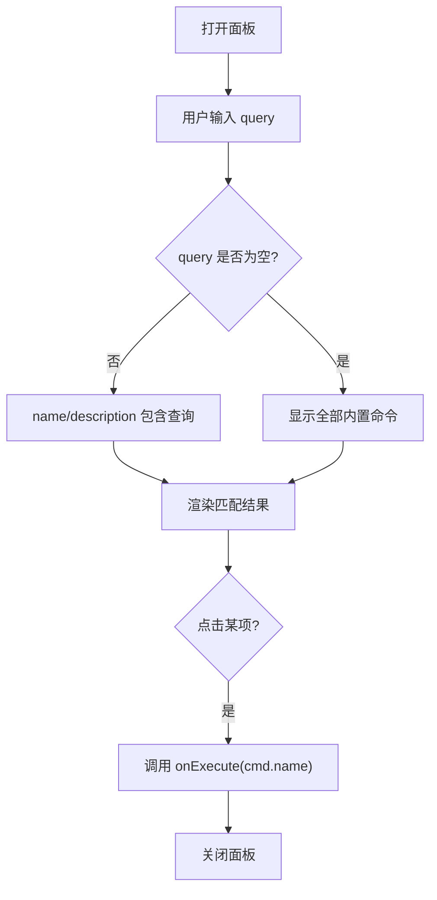
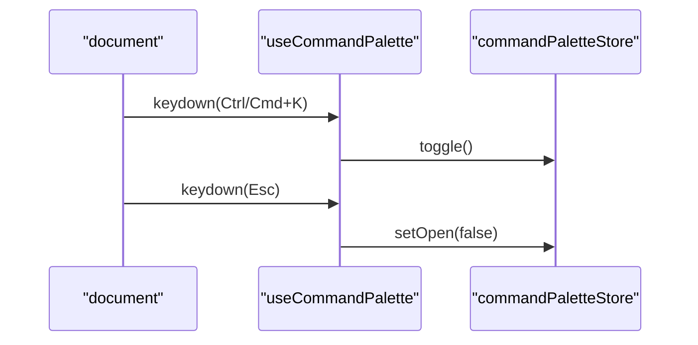
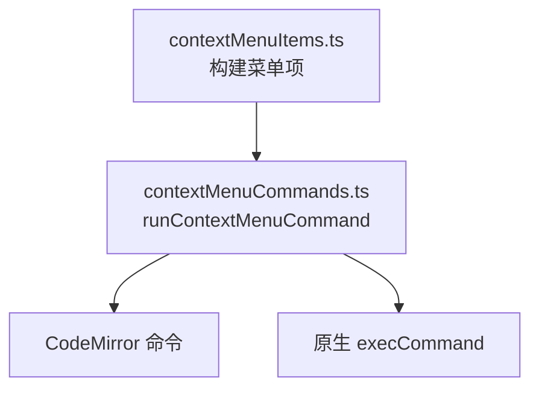
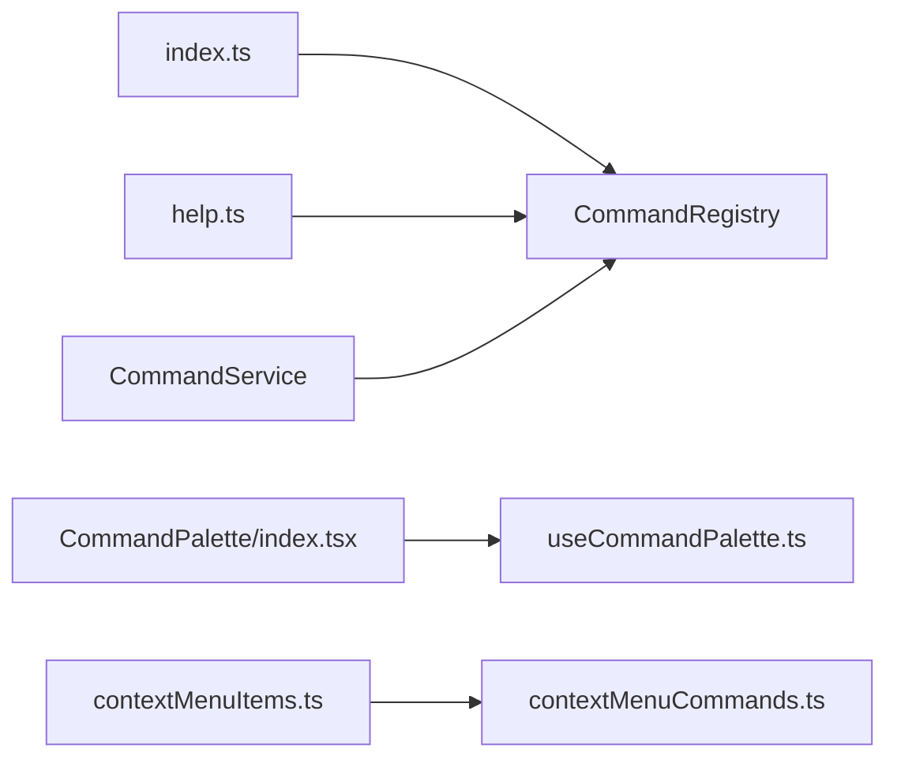

# 命令面板

<cite>
**本文引用的文件**
- [CommandRegistry.ts](file://src/main/commands/CommandRegistry.ts)
- [CommandService.ts](file://src/main/commands/CommandService.ts)
- [index.ts](file://src/main/commands/index.ts)
- [commandContextResolver.ts](file://src/main/commands/commandContextResolver.ts)
- [help.ts](file://src/main/commands/builtins/help.ts)
- [index.tsx](file://src/renderer/patterns/CommandPalette/index.tsx)
- [useCommandPalette.ts](file://src/renderer/patterns/CommandPalette/useCommandPalette.ts)
- [contextMenuCommands.ts](file://src/renderer/lib/contextMenuCommands.ts)
- [contextMenuItems.ts](file://src/renderer/lib/contextMenuItems.ts)
</cite>

## 目录
1. [简介](#简介)
2. [项目结构](#项目结构)
3. [核心组件](#核心组件)
4. [架构总览](#架构总览)
5. [详细组件分析](#详细组件分析)
6. [依赖关系分析](#依赖关系分析)
7. [性能考量](#性能考量)
8. [故障排查指南](#故障排查指南)
9. [结论](#结论)
10. [附录](#附录)

## 简介
本文件面向 RDC-Agent 中的“命令面板”能力，系统性解析命令注册机制、搜索过滤算法、键盘快捷键绑定、命令分类与组织、上下文感知显示与优先级排序、命令执行流程（参数校验、异步处理、错误恢复），以及与右键菜单的统一体验。同时提供自定义命令开发指南与性能优化建议，帮助开发者快速扩展并稳定运行命令系统。

## 项目结构
命令面板由主进程的命令注册与执行层，以及渲染层的命令面板 UI 和快捷键监听组成；同时通过共享类型定义统一前后端契约。



图表来源
- [CommandRegistry.ts:18-115](file://src/main/commands/CommandRegistry.ts#L18-L115)
- [CommandService.ts:17-73](file://src/main/commands/CommandService.ts#L17-L73)
- [index.ts:29-68](file://src/main/commands/index.ts#L29-L68)
- [help.ts:7-48](file://src/main/commands/builtins/help.ts#L7-L48)
- [commandContextResolver.ts:7-25](file://src/main/commands/commandContextResolver.ts#L7-L25)
- [index.tsx:19-69](file://src/renderer/patterns/CommandPalette/index.tsx#L19-L69)
- [useCommandPalette.ts:4-24](file://src/renderer/patterns/CommandPalette/useCommandPalette.ts#L4-L24)
- [contextMenuCommands.ts:153-165](file://src/renderer/lib/contextMenuCommands.ts#L153-L165)
- [contextMenuItems.ts:68-93](file://src/renderer/lib/contextMenuItems.ts#L68-L93)

章节来源
- [CommandRegistry.ts:18-115](file://src/main/commands/CommandRegistry.ts#L18-L115)
- [CommandService.ts:17-73](file://src/main/commands/CommandService.ts#L17-L73)
- [index.ts:29-68](file://src/main/commands/index.ts#L29-L68)
- [help.ts:7-48](file://src/main/commands/builtins/help.ts#L7-L48)
- [index.tsx:19-69](file://src/renderer/patterns/CommandPalette/index.tsx#L19-L69)
- [useCommandPalette.ts:4-24](file://src/renderer/patterns/CommandPalette/useCommandPalette.ts#L4-L24)
- [contextMenuCommands.ts:153-165](file://src/renderer/lib/contextMenuCommands.ts#L153-L165)
- [contextMenuItems.ts:68-93](file://src/renderer/lib/contextMenuItems.ts#L68-L93)

## 核心组件
- 命令注册中心 CommandRegistry：维护命令集合、支持别名、按类别列出命令、解析输入并执行命令，捕获异常并返回统一结果。
- 命令服务 CommandService：封装 Registry.execute，将结果转换为 ConversationMessage 以便在会话中展示，附带工作流追踪块。
- 内置命令注册 index.ts：集中注册所有内置命令，提供全局单例 registry 获取方法。
- 上下文解析 commandContextResolver.ts：将当前会话、项目、工作区、Agent、模式、模型、主题等上下文注入命令执行。
- 命令面板 UI index.tsx：提供输入框、本地过滤、点击执行回调。
- 快捷键 useCommandPalette.ts：监听 Ctrl/Cmd+K 打开/切换面板，Esc 关闭。
- 右键菜单集成 contextMenuItems.ts/contextMenuCommands.ts：构建菜单项并执行剪贴板/编辑器相关命令，为统一体验提供基础。

章节来源
- [CommandRegistry.ts:18-115](file://src/main/commands/CommandRegistry.ts#L18-L115)
- [CommandService.ts:17-73](file://src/main/commands/CommandService.ts#L17-L73)
- [index.ts:29-68](file://src/main/commands/index.ts#L29-L68)
- [commandContextResolver.ts:7-25](file://src/main/commands/commandContextResolver.ts#L7-L25)
- [index.tsx:19-69](file://src/renderer/patterns/CommandPalette/index.tsx#L19-L69)
- [useCommandPalette.ts:4-24](file://src/renderer/patterns/CommandPalette/useCommandPalette.ts#L4-L24)
- [contextMenuItems.ts:68-93](file://src/renderer/lib/contextMenuItems.ts#L68-L93)
- [contextMenuCommands.ts:153-165](file://src/renderer/lib/contextMenuCommands.ts#L153-L165)

## 架构总览
命令面板的端到端调用链如下：用户触发快捷键或点击菜单项 -> 渲染层打开面板并收集输入 -> 调用命令服务执行 -> 主进程注册中心解析并执行具体命令 -> 返回结果并生成系统消息用于展示。



图表来源
- [useCommandPalette.ts:7-19](file://src/renderer/patterns/CommandPalette/useCommandPalette.ts#L7-L19)
- [index.tsx:23-29](file://src/renderer/patterns/CommandPalette/index.tsx#L23-L29)
- [CommandService.ts:20-32](file://src/main/commands/CommandService.ts#L20-L32)
- [CommandRegistry.ts:73-114](file://src/main/commands/CommandRegistry.ts#L73-L114)
- [help.ts:14-47](file://src/main/commands/builtins/help.ts#L14-L47)

## 详细组件分析

### 命令注册与发现（CommandRegistry）
- 注册与别名：register 支持同名覆盖与别名映射；unregister 同步清理别名。
- 查找与列举：resolve 支持别名查找；list 可按 category 过滤并按名称排序，去重基于命令 id。
- 执行流程：execute 校验输入以 "/" 开头，拆分命令名与参数，构造 CommandContext，调用 cmd.execute 并捕获异常，返回统一结果。



图表来源
- [CommandRegistry.ts:73-114](file://src/main/commands/CommandRegistry.ts#L73-L114)

章节来源
- [CommandRegistry.ts:18-115](file://src/main/commands/CommandRegistry.ts#L18-L115)

### 命令服务与消息构建（CommandService）
- 执行桥接：调用 Registry.execute 并包装为统一返回值。
- 系统消息构建：根据 result 与 request.context 生成 ConversationMessage，包含 workTrace 块，便于在会话中可视化命令执行过程。

```mermaid
classDiagram
class CommandService {
+execute(request) Promise~{result, systemMessage?}~
-buildSystemMessage(result, request) ConversationMessage
}
class CommandRegistry {
+execute(request) Promise~CommandResult~
+list(category?) commands
+resolve(name) CommandDefinition|undefined
}
CommandService --> CommandRegistry : "委托执行"
```

图表来源
- [CommandService.ts:17-73](file://src/main/commands/CommandService.ts#L17-L73)
- [CommandRegistry.ts:18-115](file://src/main/commands/CommandRegistry.ts#L18-L115)

章节来源
- [CommandService.ts:17-73](file://src/main/commands/CommandService.ts#L17-L73)

### 内置命令与分类（index.ts 与 help.ts）
- 集中注册：index.ts 将所有内置命令一次性注册到全局 registry，并提供 getRegistry 单例。
- 分类与详情：help 命令通过 registry.list 汇总并按 category 分组输出，支持查看单个命令详情与别名。



图表来源
- [index.ts:29-68](file://src/main/commands/index.ts#L29-L68)
- [help.ts:7-48](file://src/main/commands/builtins/help.ts#L7-L48)

章节来源
- [index.ts:29-68](file://src/main/commands/index.ts#L29-L68)
- [help.ts:7-48](file://src/main/commands/builtins/help.ts#L7-L48)

### 命令面板 UI 与搜索过滤（index.tsx）
- 本地过滤：使用 useMemo 对 BUILTIN_COMMANDS 进行大小写不敏感的 name/description 匹配，提升响应性。
- 交互：输入框自动聚焦，点击选项后调用 onExecute 并关闭面板。



图表来源
- [index.tsx:23-29](file://src/renderer/patterns/CommandPalette/index.tsx#L23-L29)
- [index.tsx:47-65](file://src/renderer/patterns/CommandPalette/index.tsx#L47-L65)

章节来源
- [index.tsx:19-69](file://src/renderer/patterns/CommandPalette/index.tsx#L19-L69)

### 键盘快捷键绑定（useCommandPalette.ts）
- 监听 Ctrl/Cmd+K：打开/切换面板；Esc：关闭面板。
- 事件生命周期：挂载时添加监听，卸载时移除，避免内存泄漏。



图表来源
- [useCommandPalette.ts:7-19](file://src/renderer/patterns/CommandPalette/useCommandPalette.ts#L7-L19)

章节来源
- [useCommandPalette.ts:4-24](file://src/renderer/patterns/CommandPalette/useCommandPalette.ts#L4-L24)

### 与上下文菜单的统一体验（contextMenuItems.ts/contextMenuCommands.ts）
- 菜单项构建：根据目标类型（可编辑/只读/CodeMirror）动态生成 undo/redo/cut/copy/paste/selectAll 等项，并设置禁用状态与平台快捷键。
- 命令执行：区分 CodeMirror 视图与原生 DOM，调用相应 API 完成操作，保证一致的用户体验。



图表来源
- [contextMenuItems.ts:68-93](file://src/renderer/lib/contextMenuItems.ts#L68-L93)
- [contextMenuCommands.ts:153-165](file://src/renderer/lib/contextMenuCommands.ts#L153-L165)

章节来源
- [contextMenuItems.ts:68-93](file://src/renderer/lib/contextMenuItems.ts#L68-L93)
- [contextMenuCommands.ts:153-165](file://src/renderer/lib/contextMenuCommands.ts#L153-L165)

## 依赖关系分析
- 主进程侧：CommandService 依赖 CommandRegistry；index.ts 负责初始化并注册内置命令；help 命令依赖 registry 的 list/resolve。
- 渲染侧：CommandPalette 依赖 useCommandPalette 管理开闭与查询；快捷键监听 document 事件；右键菜单模块独立于命令面板但提供统一的命令执行范式。
- 上下文：commandContextResolver 将运行时上下文注入命令执行，确保命令具备会话、项目、工作区等信息。



图表来源
- [index.ts:29-68](file://src/main/commands/index.ts#L29-L68)
- [help.ts:7-48](file://src/main/commands/builtins/help.ts#L7-L48)
- [CommandService.ts:17-73](file://src/main/commands/CommandService.ts#L17-L73)
- [index.tsx:19-69](file://src/renderer/patterns/CommandPalette/index.tsx#L19-L69)
- [useCommandPalette.ts:4-24](file://src/renderer/patterns/CommandPalette/useCommandPalette.ts#L4-L24)
- [contextMenuItems.ts:68-93](file://src/renderer/lib/contextMenuItems.ts#L68-L93)
- [contextMenuCommands.ts:153-165](file://src/renderer/lib/contextMenuCommands.ts#L153-L165)

章节来源
- [index.ts:29-68](file://src/main/commands/index.ts#L29-L68)
- [help.ts:7-48](file://src/main/commands/builtins/help.ts#L7-L48)
- [CommandService.ts:17-73](file://src/main/commands/CommandService.ts#L17-L73)
- [index.tsx:19-69](file://src/renderer/patterns/CommandPalette/index.tsx#L19-L69)
- [useCommandPalette.ts:4-24](file://src/renderer/patterns/CommandPalette/useCommandPalette.ts#L4-L24)
- [contextMenuItems.ts:68-93](file://src/renderer/lib/contextMenuItems.ts#L68-L93)
- [contextMenuCommands.ts:153-165](file://src/renderer/lib/contextMenuCommands.ts#L153-L165)

## 性能考量
- 前端过滤优化：使用 useMemo 缓存过滤结果，避免每次渲染重复计算；查询为空时直接返回全量列表减少分支判断。
- 命令列表排序：后端 list 已按名称排序，前端无需再次排序，降低开销。
- 事件监听管理：快捷键监听在组件卸载时移除，防止内存泄漏与多余事件处理。
- 执行异常隔离：命令执行包裹 try/catch，避免单次失败影响整体流程。
- 建议：
  - 对大型命令集采用分页或虚拟滚动，减少 DOM 节点数量。
  - 将耗时命令的执行转移到 Web Worker 或主进程后台任务，保持 UI 流畅。
  - 对高频触发的过滤逻辑引入防抖/节流，降低重渲染频率。

[本节为通用性能建议，不直接分析具体文件]

## 故障排查指南
- 输入未以 "/" 开头：CommandRegistry.execute 会返回失败提示，检查传入 input 是否正确。
- 未知命令：当 resolve 找不到命令时返回失败，确认命令名或别名是否正确，或通过 /help 查看可用命令。
- 执行异常：命令内部抛错会被捕获并转为失败结果，检查命令实现中的错误路径与日志。
- 快捷键无效：确认浏览器/桌面环境键位组合未被拦截；检查 useCommandPalette 的事件监听是否挂载成功。
- 右键菜单不可用：确认目标元素类型与 writable 属性；CodeMirror 场景需正确注册 view。

章节来源
- [CommandRegistry.ts:73-114](file://src/main/commands/CommandRegistry.ts#L73-L114)
- [help.ts:14-47](file://src/main/commands/builtins/help.ts#L14-L47)
- [useCommandPalette.ts:7-19](file://src/renderer/patterns/CommandPalette/useCommandPalette.ts#L7-L19)
- [contextMenuCommands.ts:153-165](file://src/renderer/lib/contextMenuCommands.ts#L153-L165)

## 结论
命令面板通过清晰的分层架构实现了命令的注册、发现、执行与展示：主进程负责命令管理与执行，渲染层提供直观的交互与快捷键支持，并通过统一的消息格式将执行结果融入会话上下文。结合右键菜单的标准化命令范式，用户在多种入口下获得一致的操作体验。遵循本文的开发指南与性能建议，可高效扩展命令能力并保持系统稳定性与响应性。

## 附录

### 自定义命令开发指南
- 定义命令：实现 CommandDefinition，包含 id、name、description、aliases、category、execute。
- 注册命令：通过 getRegistry().register(cmd) 将自定义命令加入系统；或在 index.ts 的内置列表中集中注册。
- 上下文使用：在 execute 中读取 CommandContext 的 sessionId、projectId、workspaceRoot、agentId、currentMode、currentModelId、currentTheme，以实现上下文感知的行为。
- 返回值规范：返回 { success, message?, systemMessage?, data? }，其中 systemMessage 将被转换为 ConversationMessage 并在会话中展示。
- 错误处理：在命令内部捕获异常并返回失败结果，避免上层崩溃。
- 测试建议：为命令编写单元测试，覆盖正常路径、参数校验、异常路径与上下文边界情况。

章节来源
- [CommandRegistry.ts:18-115](file://src/main/commands/CommandRegistry.ts#L18-L115)
- [index.ts:29-68](file://src/main/commands/index.ts#L29-L68)
- [commandContextResolver.ts:7-25](file://src/main/commands/commandContextResolver.ts#L7-L25)
- [CommandService.ts:20-73](file://src/main/commands/CommandService.ts#L20-L73)