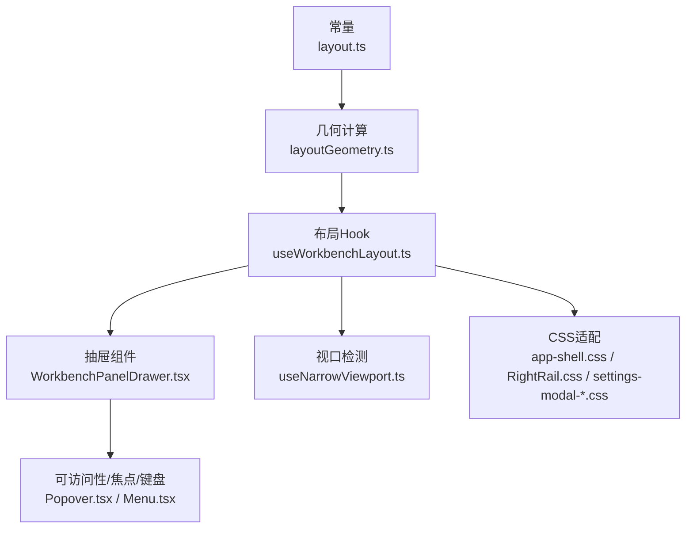
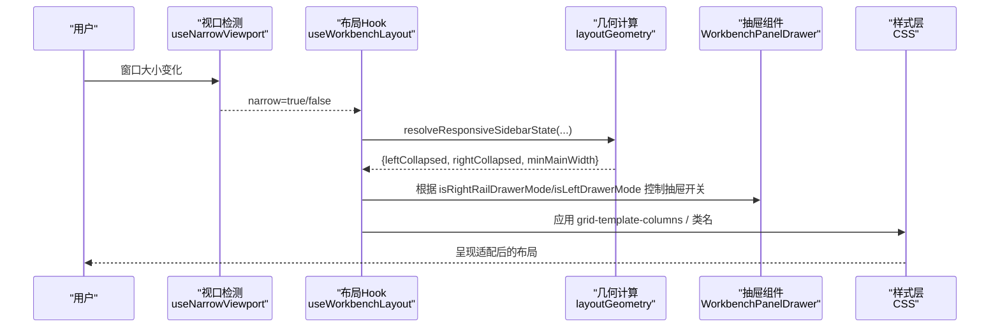
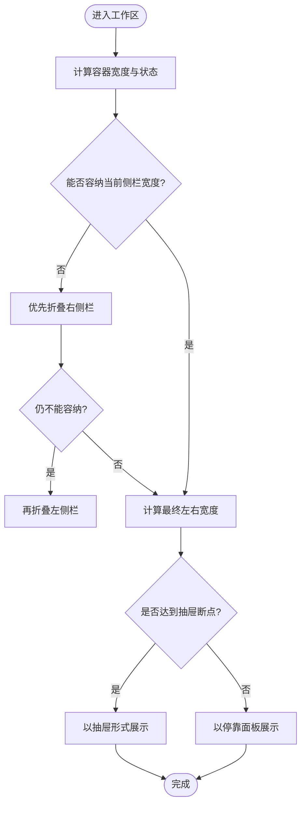
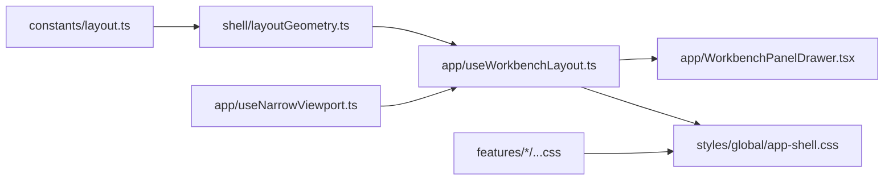

# 响应式设计

<cite>
**本文引用的文件**
- [useNarrowViewport.ts](file://src/renderer/app/useNarrowViewport.ts)
- [WorkbenchPanelDrawer.tsx](file://src/renderer/app/WorkbenchPanelDrawer.tsx)
- [useWorkbenchLayout.ts](file://src/renderer/app/useWorkbenchLayout.ts)
- [layoutGeometry.ts](file://src/renderer/shell/layoutGeometry.ts)
- [layout.ts](file://src/shared/constants/layout.ts)
- [AppShell.tsx](file://src/renderer/shell/AppShell.tsx)
- [app-shell.css](file://src/renderer/styles/global/app-shell.css)
- [RightRail.css](file://src/renderer/features/right-rail/RightRail.css)
- [settings-modal-20.css](file://src/renderer/features/settings/SettingsModal/settings-modal-20.css)
- [settings-modal-19.css](file://src/renderer/features/settings/SettingsModal/settings-modal-19.css)
- [Popover.tsx](file://src/renderer/ui/Popover.tsx)
- [Menu.tsx](file://src/renderer/ui/Menu.tsx)
- [workbench-and-transcript.md](file://docs/ui/workbench-and-transcript.md)
</cite>

## 目录
1. [简介](#简介)
2. [项目结构](#项目结构)
3. [核心组件](#核心组件)
4. [架构总览](#架构总览)
5. [详细组件分析](#详细组件分析)
6. [依赖关系分析](#依赖关系分析)
7. [性能考虑](#性能考虑)
8. [故障排查指南](#故障排查指南)
9. [结论](#结论)
10. [附录](#附录)

## 简介
本文件系统性梳理 RDC-Agent 渲染层的响应式设计实现，覆盖断点管理、视口检测、自适应组件、移动端适配策略（触摸交互优化、屏幕尺寸适配、导航结构调整）、布局系统架构（弹性布局、网格系统、容器查询），以及不同设备上的用户体验与性能优化。文档同时给出最佳实践与测试方法，帮助开发者在桌面端与移动端一致地维护可访问性与视觉一致性。

## 项目结构
响应式能力由“常量 + 几何计算 + Hook + 面板抽屉 + CSS”五层构成：
- 常量层：集中定义侧栏宽度、最小主内容宽度、抽屉断点等。
- 几何计算层：根据容器宽度与用户状态自动决定折叠/展开与宽度分配。
- Hook 层：监听视口变化、计算布局模式（抽屉或停靠）、暴露切换 API。
- 面板抽屉层：提供可聚焦、可键盘操作、支持遮罩关闭的抽屉 UI。
- CSS 层：使用媒体查询与容器查询进行样式级适配，配合 JS 逻辑完成行为级适配。

图表来源
- [layout.ts:1-43](file://src/shared/constants/layout.ts#L1-L43)
- [layoutGeometry.ts:1-152](file://src/renderer/shell/layoutGeometry.ts#L1-L152)
- [useWorkbenchLayout.ts:1-211](file://src/renderer/app/useWorkbenchLayout.ts#L1-L211)
- [WorkbenchPanelDrawer.tsx:1-97](file://src/renderer/app/WorkbenchPanelDrawer.tsx#L1-L97)
- [useNarrowViewport.ts:1-25](file://src/renderer/app/useNarrowViewport.ts#L1-L25)
- [app-shell.css:97-118](file://src/renderer/styles/global/app-shell.css#L97-L118)
- [RightRail.css:713-736](file://src/renderer/features/right-rail/RightRail.css#L713-L736)
- [settings-modal-20.css:1-63](file://src/renderer/features/settings/SettingsModal/settings-modal-20.css#L1-L63)
- [settings-modal-19.css:103-144](file://src/renderer/features/settings/SettingsModal/settings-modal-19.css#L103-L144)
- [Popover.tsx:1-111](file://src/renderer/ui/Popover.tsx#L1-L111)
- [Menu.tsx:64-106](file://src/renderer/ui/Menu.tsx#L64-L106)

章节来源
- [layout.ts:1-43](file://src/shared/constants/layout.ts#L1-L43)
- [layoutGeometry.ts:1-152](file://src/renderer/shell/layoutGeometry.ts#L1-L152)
- [useWorkbenchLayout.ts:1-211](file://src/renderer/app/useWorkbenchLayout.ts#L1-L211)
- [WorkbenchPanelDrawer.tsx:1-97](file://src/renderer/app/WorkbenchPanelDrawer.tsx#L1-L97)
- [useNarrowViewport.ts:1-25](file://src/renderer/app/useNarrowViewport.ts#L1-L25)
- [app-shell.css:97-118](file://src/renderer/styles/global/app-shell.css#L97-L118)
- [RightRail.css:713-736](file://src/renderer/features/right-rail/RightRail.css#L713-L736)
- [settings-modal-20.css:1-63](file://src/renderer/features/settings/SettingsModal/settings-modal-20.css#L1-L63)
- [settings-modal-19.css:103-144](file://src/renderer/features/settings/SettingsModal/settings-modal-19.css#L103-L144)
- [Popover.tsx:1-111](file://src/renderer/ui/Popover.tsx#L1-L111)
- [Menu.tsx:64-106](file://src/renderer/ui/Menu.tsx#L64-L106)

## 核心组件
- 视口检测 Hook：基于 matchMedia 与 resize 事件同步窄屏状态，供上层决定是否进入抽屉模式。
- 工作区布局 Hook：聚合视口、侧栏状态、右侧栏可见性，计算是否进入抽屉模式、左右侧栏是否自动折叠、拖拽调整宽度并持久化。
- 几何计算模块：保证主内容最小宽度，按可用空间优先折叠右侧栏再左侧栏，并在溢出时按比例缩减两侧宽度。
- 面板抽屉：提供遮罩关闭、Escape 关闭、Tab 循环焦点、返回原焦点的可访问性抽屉。
- CSS 适配：通过媒体查询与容器查询对设置页、右侧栏、上下文卡片等进行多断点适配；使用 Flex/Grid 构建弹性与网格布局。

章节来源
- [useNarrowViewport.ts:1-25](file://src/renderer/app/useNarrowViewport.ts#L1-L25)
- [useWorkbenchLayout.ts:1-211](file://src/renderer/app/useWorkbenchLayout.ts#L1-L211)
- [layoutGeometry.ts:1-152](file://src/renderer/shell/layoutGeometry.ts#L1-L152)
- [WorkbenchPanelDrawer.tsx:1-97](file://src/renderer/app/WorkbenchPanelDrawer.tsx#L1-L97)
- [app-shell.css:97-118](file://src/renderer/styles/global/app-shell.css#L97-L118)
- [RightRail.css:713-736](file://src/renderer/features/right-rail/RightRail.css#L713-L736)
- [settings-modal-20.css:1-63](file://src/renderer/features/settings/SettingsModal/settings-modal-20.css#L1-L63)
- [settings-modal-19.css:103-144](file://src/renderer/features/settings/SettingsModal/settings-modal-19.css#L103-L144)

## 架构总览
响应式架构围绕“常量驱动 + 几何决策 + 行为适配 + 样式适配”闭环运行：
- 常量定义断点与尺寸约束。
- 几何计算根据容器宽度与用户偏好动态决定折叠与宽度。
- Hook 将几何结果映射为 UI 行为（抽屉/停靠、折叠/展开）。
- CSS 在样式层面做细粒度适配（媒体查询、容器查询）。

图表来源
- [useNarrowViewport.ts:1-25](file://src/renderer/app/useNarrowViewport.ts#L1-L25)
- [useWorkbenchLayout.ts:1-211](file://src/renderer/app/useWorkbenchLayout.ts#L1-L211)
- [layoutGeometry.ts:1-152](file://src/renderer/shell/layoutGeometry.ts#L1-L152)
- [WorkbenchPanelDrawer.tsx:1-97](file://src/renderer/app/WorkbenchPanelDrawer.tsx#L1-L97)
- [app-shell.css:97-118](file://src/renderer/styles/global/app-shell.css#L97-L118)

## 详细组件分析

### 断点管理与视口检测
- 断点来源：
  - 右侧栏抽屉断点：RIGHT_RAIL_DRAWER_BREAKPOINT = 920px。
  - 设置页媒体查询断点：如 560px、48rem、64rem、960px、1100px 等。
- 视口检测：
  - useNarrowViewport 使用 matchMedia 与 resize 事件同步窄屏状态，避免服务端渲染差异。
  - 布局 Hook 同时使用 ResizeObserver 与 window.resize 同步容器宽度，确保拖拽与响应式计算准确。

章节来源
- [layout.ts:11-15](file://src/shared/constants/layout.ts#L11-L15)
- [useNarrowViewport.ts:1-25](file://src/renderer/app/useNarrowViewport.ts#L1-L25)
- [useWorkbenchLayout.ts:24-40](file://src/renderer/app/useWorkbenchLayout.ts#L24-L40)
- [settings-modal-20.css:1-63](file://src/renderer/features/settings/SettingsModal/settings-modal-20.css#L1-L63)
- [settings-modal-19.css:103-144](file://src/renderer/features/settings/SettingsModal/settings-modal-19.css#L103-L144)

### 自适应组件与导航结构调整
- 右侧栏：
  - 在小于等于 920px 或无法保持最小主内容宽度时，从停靠面板切换为抽屉模式。
  - 抽屉具备遮罩关闭、Escape 关闭、焦点陷阱与焦点返回。
- 左侧栏：
  - 当容器宽度 ≤ 720px 或自动折叠触发时，进入抽屉模式。
- 设置页：
  - 多断点下将双列/多列网格切换为单列，按钮行改为纵向堆叠，弹窗宽度自适应视口。

图表来源
- [layoutGeometry.ts:48-99](file://src/renderer/shell/layoutGeometry.ts#L48-L99)
- [useWorkbenchLayout.ts:49-73](file://src/renderer/app/useWorkbenchLayout.ts#L49-L73)
- [RightRail.css:713-736](file://src/renderer/features/right-rail/RightRail.css#L713-L736)

章节来源
- [useWorkbenchLayout.ts:49-73](file://src/renderer/app/useWorkbenchLayout.ts#L49-L73)
- [layoutGeometry.ts:48-99](file://src/renderer/shell/layoutGeometry.ts#L48-L99)
- [WorkbenchPanelDrawer.tsx:34-74](file://src/renderer/app/WorkbenchPanelDrawer.tsx#L34-L74)
- [settings-modal-20.css:1-63](file://src/renderer/features/settings/SettingsModal/settings-modal-20.css#L1-L63)

### 布局系统：弹性布局、网格系统与容器查询
- 弹性布局：
  - 标题栏、模式切换器、设置项行等广泛使用 flex 对齐与间距变量，保证紧凑与可扩展。
- 网格系统：
  - 三列主体布局通过 grid-template-columns 动态注入 CSS 变量实现左右侧栏宽度与拖拽手柄宽度联动。
  - 设置页在不同断点将多列网格切换为单列，提升小屏可读性。
- 容器查询：
  - 上下文分解卡片与右侧栏捕获区域使用 @container 针对组件自身容器宽度进行适配，避免仅依赖视口断点导致的误判。

章节来源
- [app-shell.css:97-118](file://src/renderer/styles/global/app-shell.css#L97-L118)
- [settings-modal-19.css:103-144](file://src/renderer/features/settings/SettingsModal/settings-modal-19.css#L103-L144)
- [RightRail.css:725-731](file://src/renderer/features/right-rail/RightRail.css#L725-L731)

### 移动端适配策略：触摸交互、屏幕尺寸、导航结构
- 触摸交互优化：
  - 抽屉支持遮罩点击关闭、Escape 关闭、Tab 循环焦点、Shift+Tab 反向跳转，保障键盘与触屏一致体验。
  - Popover/Menu 组件处理 pointerdown、keydown、resize、scroll 事件，确保弹出层在滚动/缩放后重新定位。
- 屏幕尺寸适配：
  - 使用媒体查询与容器查询组合，在小屏下将复杂网格简化为单列，按钮全宽排列，弹窗占满视口留边距。
- 导航结构调整：
  - 右侧栏在窄屏下进入抽屉，左侧栏在极窄或自动折叠时进入抽屉，主内容始终保留最小宽度。

章节来源
- [WorkbenchPanelDrawer.tsx:34-74](file://src/renderer/app/WorkbenchPanelDrawer.tsx#L34-L74)
- [Popover.tsx:87-111](file://src/renderer/ui/Popover.tsx#L87-L111)
- [Menu.tsx:64-106](file://src/renderer/ui/Menu.tsx#L64-L106)
- [settings-modal-20.css:1-63](file://src/renderer/features/settings/SettingsModal/settings-modal-20.css#L1-L63)
- [RightRail.css:713-736](file://src/renderer/features/right-rail/RightRail.css#L713-L736)

### 可访问性与交互细节
- 抽屉：
  - role="dialog"、aria-modal="true"、aria-label 明确语义；打开时自动聚焦首个可聚焦元素；关闭时返回原焦点。
- 菜单/弹出层：
  - 支持方向键导航、Home/End 快速定位、Esc 关闭；点击外部关闭；滚动/缩放后重算位置。

章节来源
- [WorkbenchPanelDrawer.tsx:34-74](file://src/renderer/app/WorkbenchPanelDrawer.tsx#L34-L74)
- [Popover.tsx:87-111](file://src/renderer/ui/Popover.tsx#L87-L111)
- [Menu.tsx:64-106](file://src/renderer/ui/Menu.tsx#L64-L106)

## 依赖关系分析
- 常量 layout.ts 被 geometry 与 Hook 引用，作为唯一尺寸与断点来源，降低耦合。
- geometry.ts 纯函数化，无副作用，便于测试与复用。
- useWorkbenchLayout 依赖 geometry、useNarrowViewport、usePanelDrawer，封装布局决策与交互。
- WorkbenchPanelDrawer 独立于业务，只关注可访问性与基础交互。
- CSS 通过 class 与属性选择器与 JS 状态协同，避免硬编码尺寸。

图表来源
- [layout.ts:1-43](file://src/shared/constants/layout.ts#L1-L43)
- [layoutGeometry.ts:1-152](file://src/renderer/shell/layoutGeometry.ts#L1-L152)
- [useWorkbenchLayout.ts:1-211](file://src/renderer/app/useWorkbenchLayout.ts#L1-L211)
- [useNarrowViewport.ts:1-25](file://src/renderer/app/useNarrowViewport.ts#L1-L25)
- [WorkbenchPanelDrawer.tsx:1-97](file://src/renderer/app/WorkbenchPanelDrawer.tsx#L1-L97)
- [app-shell.css:97-118](file://src/renderer/styles/global/app-shell.css#L97-L118)

章节来源
- [layout.ts:1-43](file://src/shared/constants/layout.ts#L1-L43)
- [layoutGeometry.ts:1-152](file://src/renderer/shell/layoutGeometry.ts#L1-L152)
- [useWorkbenchLayout.ts:1-211](file://src/renderer/app/useWorkbenchLayout.ts#L1-L211)
- [useNarrowViewport.ts:1-25](file://src/renderer/app/useNarrowViewport.ts#L1-L25)
- [WorkbenchPanelDrawer.tsx:1-97](file://src/renderer/app/WorkbenchPanelDrawer.tsx#L1-L97)
- [app-shell.css:97-118](file://src/renderer/styles/global/app-shell.css#L97-L118)

## 性能考虑
- 视口与尺寸监听：
  - 使用 ResizeObserver 监听容器尺寸变化，减少全局 resize 带来的抖动。
  - matchMedia 事件与 window.resize 仅在必要时更新状态，避免频繁重排。
- 布局计算：
  - geometry 模块为纯函数，计算复杂度低；仅在必要参数变化时重算。
- 渲染优化：
  - 抽屉在不可见时可选择性卸载（keepMounted=false），减少 DOM 节点数量。
  - 拖拽过程中禁用过渡动画（is-resizing）避免卡顿。
- 内存管理：
  - 所有事件监听均在清理函数中移除，防止泄漏。
- 可访问性与动效：
  - 遵循 prefers-reduced-motion，禁用不必要的动画。

章节来源
- [useWorkbenchLayout.ts:96-119](file://src/renderer/app/useWorkbenchLayout.ts#L96-L119)
- [useWorkbenchLayout.ts:121-182](file://src/renderer/app/useWorkbenchLayout.ts#L121-L182)
- [WorkbenchPanelDrawer.tsx:34-74](file://src/renderer/app/WorkbenchPanelDrawer.tsx#L34-L74)
- [app-shell.css:116-118](file://src/renderer/styles/global/app-shell.css#L116-L118)
- [RightRail.css:733-736](file://src/renderer/features/right-rail/RightRail.css#L733-L736)

## 故障排查指南
- 抽屉无法关闭：
  - 检查 Escape 与遮罩点击事件是否正确绑定；确认 focus trap 未阻止 Tab 循环。
- 小屏布局错乱：
  - 核对媒体查询断点是否与常量断点一致；检查网格列数是否在断点处切换为单列。
- 右侧栏未进入抽屉：
  - 确认 RIGHT_RAIL_DRAWER_BREAKPOINT 与 useNarrowViewport 阈值一致；检查 canFitLayout 判定逻辑。
- 弹出层错位：
  - 检查 Popover 的 resize/scroll 重定位是否生效；确认父容器 overflow 设置。
- 拖拽卡顿：
  - 确认拖拽期间禁用过渡；检查 pointermove 事件节流或防抖策略。

章节来源
- [WorkbenchPanelDrawer.tsx:34-74](file://src/renderer/app/WorkbenchPanelDrawer.tsx#L34-L74)
- [settings-modal-20.css:1-63](file://src/renderer/features/settings/SettingsModal/settings-modal-20.css#L1-L63)
- [layoutGeometry.ts:48-99](file://src/renderer/shell/layoutGeometry.ts#L48-L99)
- [Popover.tsx:87-111](file://src/renderer/ui/Popover.tsx#L87-L111)
- [useWorkbenchLayout.ts:121-182](file://src/renderer/app/useWorkbenchLayout.ts#L121-L182)

## 结论
RDC-Agent 的响应式设计以常量为中心、几何计算为核心、Hook 为行为桥接、CSS 为样式适配，形成稳定且可扩展的体系。通过抽屉与停靠两种模式无缝切换，结合媒体查询与容器查询，既保证了桌面端的丰富信息密度，也确保了移动端的易用性与可访问性。建议在新增功能时沿用此模式：先定义常量，再用几何计算决策，最后用 Hook 与 CSS 落地行为与样式。

## 附录
- 设计参考与验收清单参见产品文档中的工作区与转录说明，其中明确了右侧栏在窄屏下的抽屉行为与可访问性要求。

章节来源
- [workbench-and-transcript.md:85-86](file://docs/ui/workbench-and-transcript.md#L85-L86)