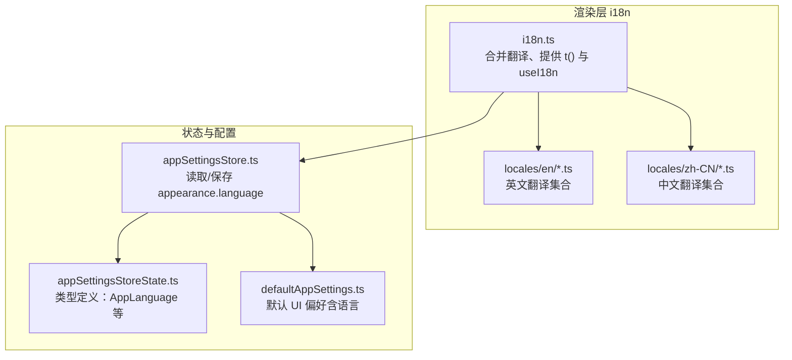
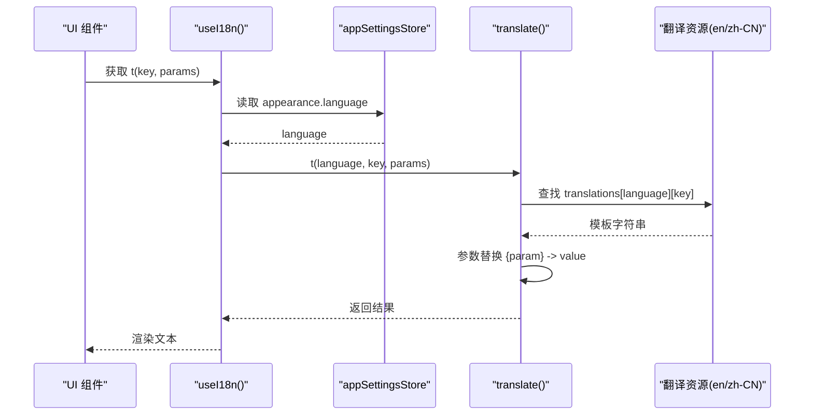
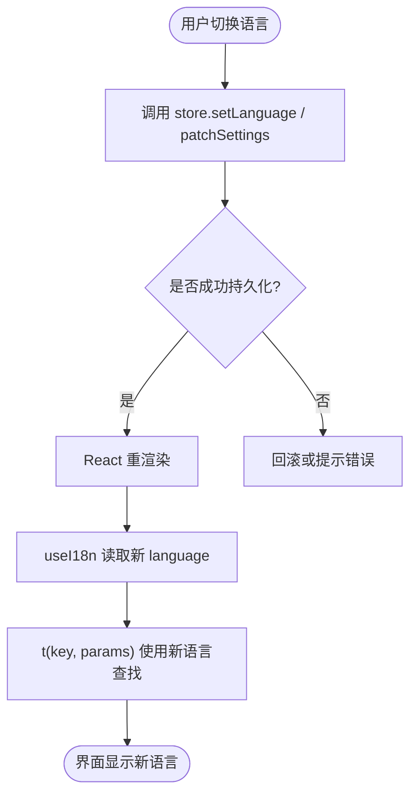
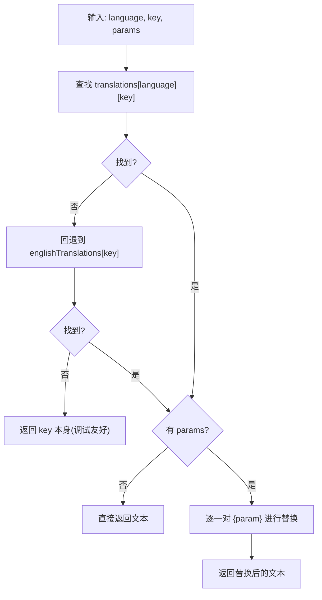
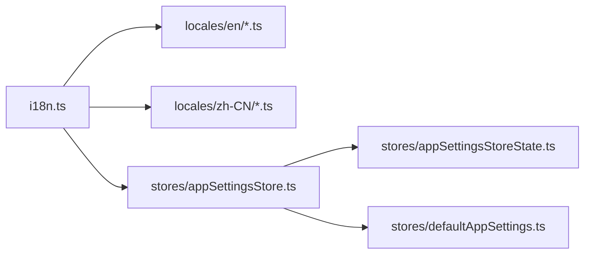

# 国际化支持

<cite>
**本文引用的文件**
- [i18n.ts](file://src/renderer/i18n.ts)
- [appSettingsStore.ts](file://src/renderer/stores/appSettingsStore.ts)
- [appSettingsStoreState.ts](file://src/renderer/stores/appSettingsStoreState.ts)
- [defaultAppSettings.ts](file://src/renderer/stores/defaultAppSettings.ts)
- [en/app.ts](file://src/renderer/i18n/locales/en/app.ts)
- [zh-CN/app.ts](file://src/renderer/i18n/locales/zh-CN/app.ts)
</cite>

## 目录
1. [简介](#简介)
2. [项目结构](#项目结构)
3. [核心组件](#核心组件)
4. [架构总览](#架构总览)
5. [详细组件分析](#详细组件分析)
6. [依赖关系分析](#依赖关系分析)
7. [性能考量](#性能考量)
8. [故障排查指南](#故障排查指南)
9. [结论](#结论)
10. [附录](#附录)

## 简介
本文件面向 RDC-Agent 渲染层的国际化（i18n）实现，系统性说明多语言资源管理、动态语言切换机制、文本键值映射与参数化替换、语言检测与默认语言设置、用户偏好持久化路径，以及新增语言的完整流程与最佳实践。目标是帮助开发者在不侵入业务逻辑的前提下，安全地扩展与维护多语言文案。

## 项目结构
国际化资源按功能模块拆分，每个模块一个翻译文件，便于协作与维护。当前已支持的语言为英文（en）与简体中文（zh-CN），以语言代码作为顶层目录组织。

图表来源
- [i18n.ts:1-122](file://src/renderer/i18n.ts#L1-L122)
- [appSettingsStore.ts:1-188](file://src/renderer/stores/appSettingsStore.ts#L1-L188)
- [appSettingsStoreState.ts:1-52](file://src/renderer/stores/appSettingsStoreState.ts#L1-L52)
- [defaultAppSettings.ts:1-108](file://src/renderer/stores/defaultAppSettings.ts#L1-L108)

章节来源
- [i18n.ts:1-122](file://src/renderer/i18n.ts#L1-L122)
- [appSettingsStore.ts:1-188](file://src/renderer/stores/appSettingsStore.ts#L1-L188)
- [appSettingsStoreState.ts:1-52](file://src/renderer/stores/appSettingsStoreState.ts#L1-L52)
- [defaultAppSettings.ts:1-108](file://src/renderer/stores/defaultAppSettings.ts#L1-L108)

## 核心组件
- 翻译聚合与导出
  - 将各模块的英文翻译合并为统一字典，并基于此推导键类型，确保编译期键名校验。
  - 中文通过“覆盖”方式复用英文键，减少重复维护成本。
- 运行时翻译函数
  - 提供 translate(language, key, params) 进行字符串查找与参数替换。
  - 暴露 React Hook useI18n，自动订阅当前语言并返回 t(key, params)。
- 语言状态与持久化
  - 语言来自应用设置 store 的 appearance.language。
  - 通过 store 的 patchSettings 等方法持久化到后端存储。

章节来源
- [i18n.ts:44-122](file://src/renderer/i18n.ts#L44-L122)
- [appSettingsStore.ts:37-48](file://src/renderer/stores/appSettingsStore.ts#L37-L48)
- [appSettingsStoreState.ts:24-51](file://src/renderer/stores/appSettingsStoreState.ts#L24-L51)

## 架构总览
下图展示了从界面调用到最终显示文本的完整链路，包括语言切换与参数化替换。

图表来源
- [i18n.ts:101-122](file://src/renderer/i18n.ts#L101-L122)
- [appSettingsStore.ts:37-48](file://src/renderer/stores/appSettingsStore.ts#L37-L48)

## 详细组件分析

### 翻译资源组织与命名规范
- 目录结构
  - locales/en：英文翻译，按功能模块拆分为 app.ts、chat.ts、composer.ts、contextBreakdown.ts、contextMenu.ts、control.ts、device.ts、dialog.ts、emptyWorkbench.ts、font.ts、knowledgeCenter.ts、language.ts、memory.ts、mode.ts、projectCapture.ts、settings.ts、sidebar.ts、terminal.ts、theme.ts、userMenu.ts。
  - locales/zh-CN：中文翻译，采用同名文件一一对应。
- 命名约定
  - 文件名即功能域，如 composer.ts 对应编辑器相关文案。
  - 键名使用点号分隔的层级结构，例如 app.connected、app.notice.filesReceived，便于分组检索与避免冲突。
- 键类型推导
  - 以英文翻译对象为基集，推导出 TranslationKey 类型，所有键在编译期受约束。

章节来源
- [i18n.ts:4-43](file://src/renderer/i18n.ts#L4-L43)
- [i18n.ts:45-68](file://src/renderer/i18n.ts#L45-L68)
- [en/app.ts:1-42](file://src/renderer/i18n/locales/en/app.ts#L1-L42)
- [zh-CN/app.ts:1-42](file://src/renderer/i18n/locales/zh-CN/app.ts#L1-L42)

### 动态语言切换机制
- 语言来源
  - 通过 useI18n 内部订阅 store 中的 appearance.language，语言变化时自动重新计算 t。
- 切换入口
  - 通过 store 的 setLanguage 或 patchSettings 更新 appearance.language，触发重渲染。
- 持久化
  - patchSettings 会调用底层 API 保存设置，从而跨会话保持语言选择。

图表来源
- [i18n.ts:114-122](file://src/renderer/i18n.ts#L114-L122)
- [appSettingsStore.ts:44-48](file://src/renderer/stores/appSettingsStore.ts#L44-L48)
- [appSettingsStoreState.ts:37-39](file://src/renderer/stores/appSettingsStoreState.ts#L37-L39)

章节来源
- [i18n.ts:114-122](file://src/renderer/i18n.ts#L114-L122)
- [appSettingsStore.ts:44-48](file://src/renderer/stores/appSettingsStore.ts#L44-L48)
- [appSettingsStoreState.ts:37-39](file://src/renderer/stores/appSettingsStoreState.ts#L37-L39)

### 文本键值映射与参数化
- 键查找策略
  - 优先使用目标语言；若缺失则回退到英文基集；仍缺失则返回键名本身，便于定位遗漏。
- 参数替换
  - 支持 {paramName} 形式的占位符，传入 params 后按名称替换为字符串。
- 示例键
  - app.notice.filesReceived: 'Received {count} files...'
  - app.stageFilesSuccess: 'Staged {count} file(s)...'

图表来源
- [i18n.ts:93-112](file://src/renderer/i18n.ts#L93-L112)

章节来源
- [i18n.ts:93-112](file://src/renderer/i18n.ts#L93-L112)
- [en/app.ts:1-42](file://src/renderer/i18n/locales/en/app.ts#L1-L42)

### 语言检测、默认语言与用户偏好持久化
- 默认语言
  - 默认 UI 偏好由 createDefaultUiPreferences 生成，包含 appearance.language 的初始值。
- 语言检测
  - 当前实现未内置浏览器/系统语言检测；语言来源于已持久化的用户设置。
- 持久化
  - 通过 store.patchSettings 写入 appearance.language，底层通过 Electron API 持久化。

章节来源
- [defaultAppSettings.ts:28-30](file://src/renderer/stores/defaultAppSettings.ts#L28-L30)
- [appSettingsStore.ts:44-48](file://src/renderer/stores/appSettingsStore.ts#L44-L48)

### 新增语言的完整流程（示例：添加 fr-FR）
步骤概览
1. 创建资源目录与文件
   - 新建 locales/fr-FR，复制现有 en 下的模块文件并重命名为法语内容。
2. 注册语言覆盖
   - 在 i18n.ts 中导入 fr-FR 的各模块，构建 zhCnOverrides 风格的 overrides 对象。
   - 在 translations 映射中添加 'fr-FR': { ...englishTranslations, ...frFrOverrides }。
3. 类型与枚举
   - 在 @shared/types/settings 中扩展 AppLanguage 枚举，加入 'fr-FR'。
4. 界面选项
   - 在语言选择器中加入 'fr-FR' 显示项（如语言列表）。
5. 验证
   - 切换语言后确认关键页面文案正确，参数化文案正常替换。
6. 回归
   - 运行测试与视觉回归检查，确保无遗漏键。

注意事项
- 建议始终保留英文基集作为回退，避免缺失键导致空白。
- 参数占位符需与英文保持一致，便于维护。
- 对长文案进行本地化适配，避免截断或布局问题。

章节来源
- [i18n.ts:4-43](file://src/renderer/i18n.ts#L4-L43)
- [i18n.ts:93-99](file://src/renderer/i18n.ts#L93-L99)
- [appSettingsStoreState.ts:1-16](file://src/renderer/stores/appSettingsStoreState.ts#L1-L16)

### 最佳实践
- 键设计
  - 使用语义化点号键，如 feature.area.item。
  - 避免在键中包含可变信息，改用参数化。
- 文案一致性
  - 同一概念在不同模块使用相同键名或合理分层。
- 可维护性
  - 优先维护英文基集，其他语言以覆盖为主。
  - 定期审计缺失键（利用回退行为快速定位）。
- 性能
  - 翻译资源按需加载（当前为静态导入），如需优化可按路由懒加载。

## 依赖关系分析

图表来源
- [i18n.ts:1-122](file://src/renderer/i18n.ts#L1-L122)
- [appSettingsStore.ts:1-188](file://src/renderer/stores/appSettingsStore.ts#L1-L188)
- [appSettingsStoreState.ts:1-52](file://src/renderer/stores/appSettingsStoreState.ts#L1-L52)
- [defaultAppSettings.ts:1-108](file://src/renderer/stores/defaultAppSettings.ts#L1-L108)

章节来源
- [i18n.ts:1-122](file://src/renderer/i18n.ts#L1-L122)
- [appSettingsStore.ts:1-188](file://src/renderer/stores/appSettingsStore.ts#L1-L188)

## 性能考量
- 静态导入
  - 当前所有语言与模块均为静态导入，启动时一次性加载。对于大型项目可考虑按区域懒加载翻译资源以降低首屏体积。
- 参数替换开销
  - 参数替换为简单字符串替换，开销极低；避免在高频渲染路径中进行复杂计算。
- 回退策略
  - 缺失键回退到英文或键名，不会抛出异常，但可能影响体验；建议在 CI 中增加缺失键检测。

## 故障排查指南
常见问题与解决
- 切换语言无效
  - 检查是否正确调用 store.setLanguage 或 patchSettings 更新 appearance.language。
  - 确认持久化成功且应用已重载最新设置。
- 文案不显示或显示键名
  - 检查目标语言是否存在该键；若不存在，将回退到英文或键名。
  - 核对键名拼写与层级是否与源一致。
- 参数未替换
  - 确认传入的 params 键名与模板中的 {param} 完全一致。
- 新增语言后报错
  - 检查是否在 translations 中注册了新语言映射。
  - 检查 AppLanguage 类型是否已扩展。

章节来源
- [i18n.ts:93-112](file://src/renderer/i18n.ts#L93-L112)
- [appSettingsStore.ts:44-48](file://src/renderer/stores/appSettingsStore.ts#L44-L48)

## 结论
本项目采用“英文基集 + 语言覆盖”的轻量级 i18n 方案，结合 React Hook 与全局设置 store，实现了简洁可靠的动态语言切换与参数化文案。通过模块化翻译文件与严格的键类型推导，既保证了可维护性，又降低了出错概率。后续可按需引入懒加载与更完善的语言检测，进一步提升用户体验与性能。

## 附录
- 常用 API
  - useI18n(): 返回 { language, t(key, params) }。
  - translate(language, key, params): 直接获取翻译文本。
- 典型用法
  - 在组件中调用 useI18n().t('app.loading') 或带参数的 t('app.notice.filesReceived', { count })。
- 相关文件参考
  - 翻译资源示例：[en/app.ts](file://src/renderer/i18n/locales/en/app.ts)、[zh-CN/app.ts](file://src/renderer/i18n/locales/zh-CN/app.ts)。
  - 核心逻辑：[i18n.ts](file://src/renderer/i18n.ts)。
  - 设置与持久化：[appSettingsStore.ts](file://src/renderer/stores/appSettingsStore.ts)、[appSettingsStoreState.ts](file://src/renderer/stores/appSettingsStoreState.ts)、[defaultAppSettings.ts](file://src/renderer/stores/defaultAppSettings.ts)。