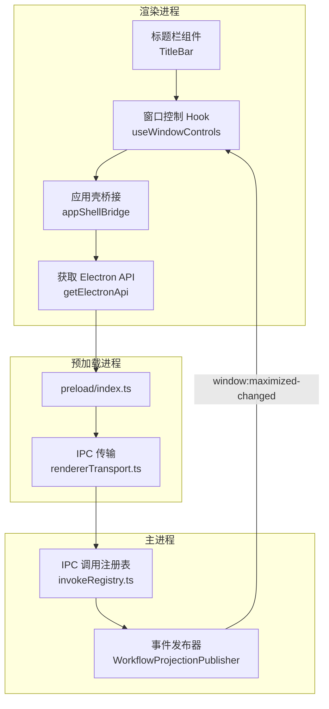
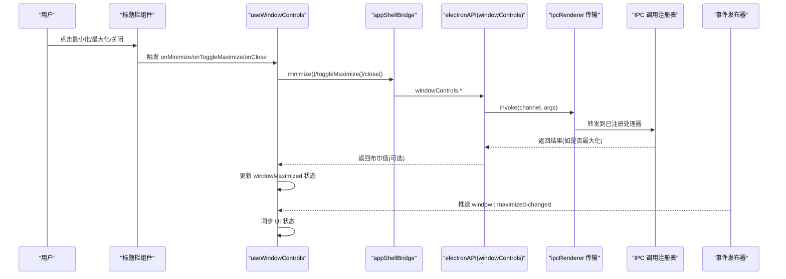
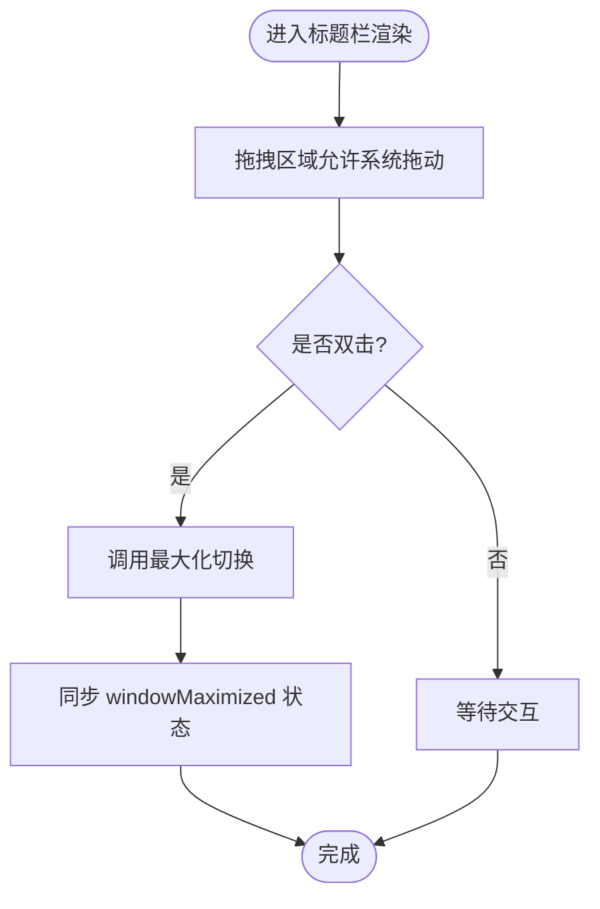
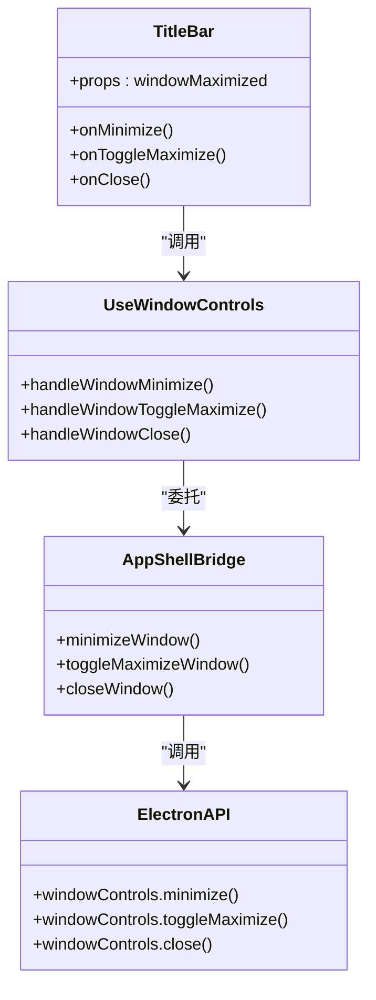
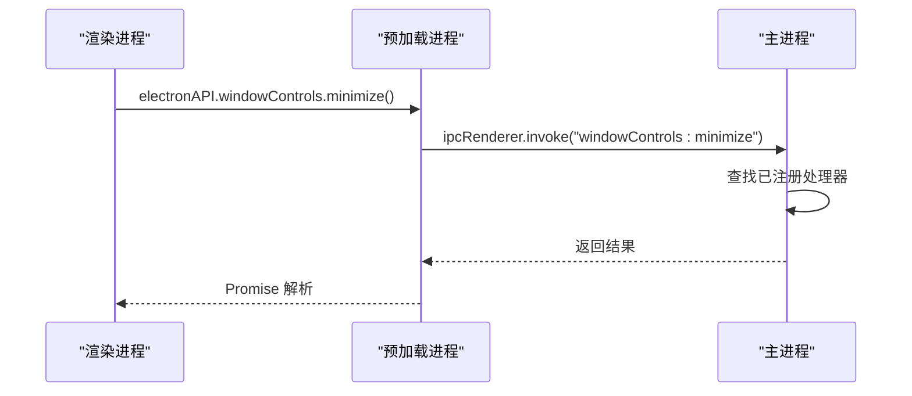
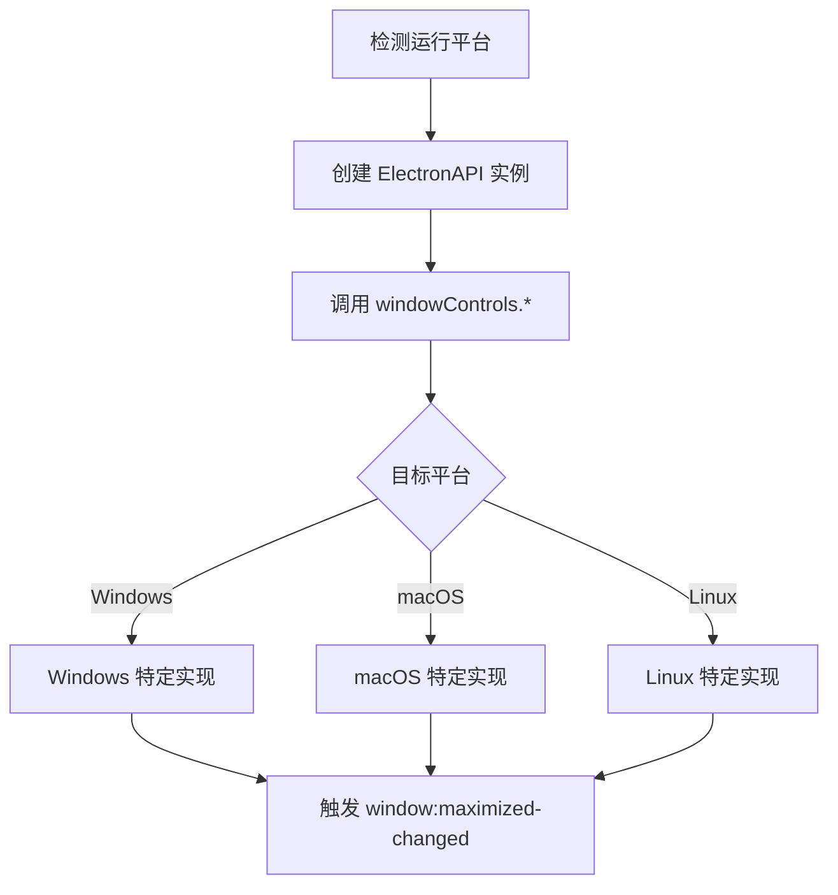

# 窗口控制

<cite>
**本文引用的文件**
- [src/preload/index.ts](file://src/preload/index.ts)
- [src/preload/rendererTransport.ts](file://src/preload/rendererTransport.ts)
- [src/renderer/hooks/useWindowControls.ts](file://src/renderer/hooks/useWindowControls.ts)
- [src/renderer/hooks/appShellBridge.ts](file://src/renderer/hooks/appShellBridge.ts)
- [src/renderer/shell/TitleBar/index.tsx](file://src/renderer/shell/TitleBar/index.tsx)
- [src/renderer/platform/browserAppBridge/BrowserAppBridge.ts](file://src/renderer/platform/browserAppBridge/BrowserAppBridge.ts)
- [src/main/ipc/invokeRegistry.ts](file://src/main/ipc/invokeRegistry.ts)
- [src/renderer/app/bootstrap/useIpcEventBridge.ts](file://src/renderer/app/bootstrap/useIpcEventBridge.ts)
</cite>

## 目录
1. [简介](#简介)
2. [项目结构](#项目结构)
3. [核心组件](#核心组件)
4. [架构总览](#架构总览)
5. [详细组件分析](#详细组件分析)
6. [依赖关系分析](#依赖关系分析)
7. [性能考虑](#性能考虑)
8. [故障排查指南](#故障排查指南)
9. [结论](#结论)
10. [附录](#附录)

## 简介
本文件聚焦于 RDC-Agent 的“窗口控制”能力，覆盖最小化、最大化/还原、关闭按钮的前端交互与主进程通信链路；说明跨平台（Windows、macOS、Linux）行为适配点；解释预加载脚本的安全 API 暴露机制与 IPC 通信协议；并给出标题栏组件的实现要点（拖拽区域、双击行为、状态同步）、自定义配置示例与调试技巧。

## 项目结构
窗口控制涉及渲染层 UI、预加载桥接、IPC 通道与主进程事件分发：
- 渲染层：标题栏组件与 Hook 封装窗口操作；通过 appShellBridge 调用 windowControls 域方法。
- 预加载层：使用 contextBridge 安全暴露 ElectronAPI 到渲染进程，并通过 ipcRenderer 实现传输。
- 主进程侧：统一注册 IPC 调用处理器，支持按频道路由到具体处理逻辑。
- 事件总线：主进程向所有窗口广播窗口状态变更（如最大化变化），渲染层订阅以同步 UI。

图表来源
- [src/renderer/shell/TitleBar/index.tsx:102-130](file://src/renderer/shell/TitleBar/index.tsx#L102-L130)
- [src/renderer/hooks/useWindowControls.ts:4-18](file://src/renderer/hooks/useWindowControls.ts#L4-L18)
- [src/renderer/hooks/appShellBridge.ts:20-30](file://src/renderer/hooks/appShellBridge.ts#L20-L30)
- [src/preload/index.ts:8-15](file://src/preload/index.ts#L8-L15)
- [src/preload/rendererTransport.ts:9-43](file://src/preload/rendererTransport.ts#L9-L43)
- [src/main/ipc/invokeRegistry.ts:9-43](file://src/main/ipc/invokeRegistry.ts#L9-L43)

章节来源
- [src/renderer/shell/TitleBar/index.tsx:1-135](file://src/renderer/shell/TitleBar/index.tsx#L1-L135)
- [src/renderer/hooks/useWindowControls.ts:1-20](file://src/renderer/hooks/useWindowControls.ts#L1-L20)
- [src/renderer/hooks/appShellBridge.ts:1-31](file://src/renderer/hooks/appShellBridge.ts#L1-L31)
- [src/preload/index.ts:1-26](file://src/preload/index.ts#L1-L26)
- [src/preload/rendererTransport.ts:1-45](file://src/preload/rendererTransport.ts#L1-L45)
- [src/main/ipc/invokeRegistry.ts:1-43](file://src/main/ipc/invokeRegistry.ts#L1-L43)

## 核心组件
- 标题栏组件：提供最小化、最大化/还原、关闭按钮，以及左右面板切换入口；通过 props 接收窗口最大化状态与本地化文案。
- 窗口控制 Hook：将最小化、最大化切换、关闭封装为 React 回调，并在最大化切换后更新父级状态。
- 应用壳桥接：统一调用 windowControls.minimize/toggleMaximize/close，屏蔽底层差异。
- 预加载桥接：通过 contextBridge 暴露 electronAPI 与 rdcDesktop；使用 ipcRenderer 作为传输层。
- IPC 调用注册表：集中管理 renderer 调用的主进程处理器安装与分发。
- 事件桥接：渲染进程订阅 window:maximized-changed，用于同步最大化状态。

章节来源
- [src/renderer/shell/TitleBar/index.tsx:4-48](file://src/renderer/shell/TitleBar/index.tsx#L4-L48)
- [src/renderer/hooks/useWindowControls.ts:4-18](file://src/renderer/hooks/useWindowControls.ts#L4-L18)
- [src/renderer/hooks/appShellBridge.ts:20-30](file://src/renderer/hooks/appShellBridge.ts#L20-L30)
- [src/preload/index.ts:8-15](file://src/preload/index.ts#L8-L15)
- [src/preload/rendererTransport.ts:9-43](file://src/preload/rendererTransport.ts#L9-L43)
- [src/main/ipc/invokeRegistry.ts:9-43](file://src/main/ipc/invokeRegistry.ts#L9-L43)
- [src/renderer/app/bootstrap/useIpcEventBridge.ts:448-488](file://src/renderer/app/bootstrap/useIpcEventBridge.ts#L448-L488)

## 架构总览
下图展示从用户点击标题栏按钮到主进程执行窗口操作，再到状态回传的完整流程。

图表来源
- [src/renderer/shell/TitleBar/index.tsx:102-130](file://src/renderer/shell/TitleBar/index.tsx#L102-L130)
- [src/renderer/hooks/useWindowControls.ts:4-18](file://src/renderer/hooks/useWindowControls.ts#L4-L18)
- [src/renderer/hooks/appShellBridge.ts:20-30](file://src/renderer/hooks/appShellBridge.ts#L20-L30)
- [src/preload/rendererTransport.ts:29-43](file://src/preload/rendererTransport.ts#L29-L43)
- [src/main/ipc/invokeRegistry.ts:9-43](file://src/main/ipc/invokeRegistry.ts#L9-L43)
- [src/renderer/app/bootstrap/useIpcEventBridge.ts:448-488](file://src/renderer/app/bootstrap/useIpcEventBridge.ts#L448-L488)

## 详细组件分析

### 标题栏组件（拖拽区域、双击行为、状态同步）
- 拖拽区域：标题栏容器具备系统原生拖拽能力（由宿主框架或 CSS 属性驱动），使整个标题栏可拖动窗口。
- 双击行为：双击标题栏通常触发最大化/还原切换，可由上层监听双击事件并调用 toggleMaximize。
- 状态同步：通过 props.windowMaximized 显示当前状态；同时订阅 window:maximized-changed 事件，确保外部状态变化时 UI 一致。
- 无障碍与本地化：按钮包含 aria-label 与 tooltip，文案通过 props 注入，便于多语言。

图表来源
- [src/renderer/shell/TitleBar/index.tsx:50-132](file://src/renderer/shell/TitleBar/index.tsx#L50-L132)
- [src/renderer/app/bootstrap/useIpcEventBridge.ts:448-488](file://src/renderer/app/bootstrap/useIpcEventBridge.ts#L448-L488)

章节来源
- [src/renderer/shell/TitleBar/index.tsx:1-135](file://src/renderer/shell/TitleBar/index.tsx#L1-L135)
- [src/renderer/app/bootstrap/useIpcEventBridge.ts:448-488](file://src/renderer/app/bootstrap/useIpcEventBridge.ts#L448-L488)

### 窗口控制 Hook 与桥接
- useWindowControls：封装最小化、最大化切换、关闭三个动作；最大化切换时根据返回值更新父级状态。
- appShellBridge：统一调用 windowControls 域方法，屏蔽不同运行环境差异。
- getElectronApi：在 Electron 环境下返回基于 preload 的 API；在非 Electron 环境（浏览器 QA）下返回兼容实现。

图表来源
- [src/renderer/shell/TitleBar/index.tsx:102-130](file://src/renderer/shell/TitleBar/index.tsx#L102-L130)
- [src/renderer/hooks/useWindowControls.ts:4-18](file://src/renderer/hooks/useWindowControls.ts#L4-L18)
- [src/renderer/hooks/appShellBridge.ts:20-30](file://src/renderer/hooks/appShellBridge.ts#L20-L30)

章节来源
- [src/renderer/hooks/useWindowControls.ts:1-20](file://src/renderer/hooks/useWindowControls.ts#L1-L20)
- [src/renderer/hooks/appShellBridge.ts:1-31](file://src/renderer/hooks/appShellBridge.ts#L1-L31)

### 预加载脚本安全 API 暴露与 IPC 协议
- 安全暴露：仅通过 contextBridge.exposeInMainWorld 暴露最小必要接口（electronAPI、rdcDesktop.getPathForFile），避免直接暴露 Node 模块。
- 传输层：rendererTransport 封装 ipcRenderer.invoke/on/removeListener，提供统一的 invoke/subscribe/addListener/removeListener/removeAllListeners 能力。
- 主进程注册：invokeRegistry 拦截并记录 ipcMain.handle 调用，维护频道到处理器的映射，支持动态注册与校验。

图表来源
- [src/preload/index.ts:8-15](file://src/preload/index.ts#L8-L15)
- [src/preload/rendererTransport.ts:29-43](file://src/preload/rendererTransport.ts#L29-L43)
- [src/main/ipc/invokeRegistry.ts:9-43](file://src/main/ipc/invokeRegistry.ts#L9-L43)

章节来源
- [src/preload/index.ts:1-26](file://src/preload/index.ts#L1-L26)
- [src/preload/rendererTransport.ts:1-45](file://src/preload/rendererTransport.ts#L1-L45)
- [src/main/ipc/invokeRegistry.ts:1-43](file://src/main/ipc/invokeRegistry.ts#L1-L43)

### 跨平台窗口行为适配
- 平台检测：BrowserAppBridge 通过 navigator.platform 推断平台（win32/darwin/linux），用于构建一致的 ElectronAPI 实例。
- 行为差异：最小化/最大化/关闭在不同操作系统上的视觉与快捷键存在差异；通过统一 API 抽象，由主进程或平台特定实现负责差异处理。
- 事件同步：无论平台如何，最大化状态变更均通过 window:maximized-changed 事件通知渲染层，保证 UI 一致性。

图表来源
- [src/renderer/platform/browserAppBridge/BrowserAppBridge.ts:17-38](file://src/renderer/platform/browserAppBridge/BrowserAppBridge.ts#L17-L38)
- [src/renderer/app/bootstrap/useIpcEventBridge.ts:448-488](file://src/renderer/app/bootstrap/useIpcEventBridge.ts#L448-L488)

章节来源
- [src/renderer/platform/browserAppBridge/BrowserAppBridge.ts:1-38](file://src/renderer/platform/browserAppBridge/BrowserAppBridge.ts#L1-L38)
- [src/renderer/app/bootstrap/useIpcEventBridge.ts:448-488](file://src/renderer/app/bootstrap/useIpcEventBridge.ts#L448-L488)

## 依赖关系分析
- 渲染层依赖：
  - 标题栏组件依赖 useWindowControls 提供的回调。
  - useWindowControls 依赖 appShellBridge 的 windowControls 方法。
  - appShellBridge 依赖 getElectronApi 返回的 ElectronAPI。
- 预加载层依赖：
  - preload/index.ts 使用 createRendererApi 与 createIpcRendererTransport 构造 ElectronAPI。
  - rendererTransport 依赖 ipcRenderer 进行 invoke/subscribe。
- 主进程依赖：
  - invokeRegistry 统一管理 ipcMain.handle 的注册与分发。
  - 事件发布器向所有窗口广播状态变更。

图表来源
- [src/renderer/shell/TitleBar/index.tsx:102-130](file://src/renderer/shell/TitleBar/index.tsx#L102-L130)
- [src/renderer/hooks/useWindowControls.ts:4-18](file://src/renderer/hooks/useWindowControls.ts#L4-L18)
- [src/renderer/hooks/appShellBridge.ts:20-30](file://src/renderer/hooks/appShellBridge.ts#L20-L30)
- [src/preload/rendererTransport.ts:29-43](file://src/preload/rendererTransport.ts#L29-L43)
- [src/main/ipc/invokeRegistry.ts:9-43](file://src/main/ipc/invokeRegistry.ts#L9-L43)

章节来源
- [src/renderer/shell/TitleBar/index.tsx:1-135](file://src/renderer/shell/TitleBar/index.tsx#L1-L135)
- [src/renderer/hooks/useWindowControls.ts:1-20](file://src/renderer/hooks/useWindowControls.ts#L1-L20)
- [src/renderer/hooks/appShellBridge.ts:1-31](file://src/renderer/hooks/appShellBridge.ts#L1-L31)
- [src/preload/rendererTransport.ts:1-45](file://src/preload/rendererTransport.ts#L1-L45)
- [src/main/ipc/invokeRegistry.ts:1-43](file://src/main/ipc/invokeRegistry.ts#L1-L43)

## 性能考虑
- 事件订阅生命周期：确保在组件卸载时移除监听，避免内存泄漏（rendererTransport 提供 removeListener/removeAllListeners）。
- 最小化调用开销：最小化/最大化属于轻量级系统调用，但应避免高频重复触发（例如节流）。
- 状态同步：最大化状态通过事件广播，渲染层只需响应一次更新，减少不必要的重渲染。

[本节为通用指导，不直接分析具体文件]

## 故障排查指南
- 无法最小化/最大化/关闭：
  - 检查标题栏按钮是否正确绑定 onMinimize/onToggleMaximize/onClose。
  - 确认 appShellBridge 中 windowControls 方法是否被正确调用。
  - 验证 preload 是否成功暴露 electronAPI，且 rendererTransport 的 invoke 能到达主进程。
- 最大化状态不同步：
  - 确认渲染层是否订阅了 window:maximized-changed 事件。
  - 检查主进程是否在窗口状态变更后广播该事件。
- 预加载安全限制：
  - 确保未在 preload 中引入 Node 内置模块（fs/path/child_process），仅使用 contextBridge 暴露的接口。
  - 若需访问文件系统路径，使用 rdcDesktop.getPathForFile 并捕获异常。

章节来源
- [src/renderer/shell/TitleBar/index.tsx:102-130](file://src/renderer/shell/TitleBar/index.tsx#L102-L130)
- [src/renderer/hooks/appShellBridge.ts:20-30](file://src/renderer/hooks/appShellBridge.ts#L20-L30)
- [src/preload/index.ts:8-25](file://src/preload/index.ts#L8-L25)
- [src/preload/rendererTransport.ts:29-43](file://src/preload/rendererTransport.ts#L29-L43)
- [src/renderer/app/bootstrap/useIpcEventBridge.ts:448-488](file://src/renderer/app/bootstrap/useIpcEventBridge.ts#L448-L488)

## 结论
本项目通过“标题栏组件 + Hook + 应用壳桥接 + 预加载安全暴露 + IPC 注册表 + 事件广播”的分层设计，实现了跨平台的窗口控制能力。渲染层专注交互与状态同步，预加载层负责安全隔离与传输，主进程负责权限与平台差异处理。该架构清晰、可扩展，便于后续增加更多窗口相关能力（如全屏、无边框等）。

[本节为总结性内容，不直接分析具体文件]

## 附录

### 自定义配置示例
- 标题栏文案本地化：通过 props 传入 windowMinimizeLabel/windowMaximizeLabel/windowRestoreLabel/windowCloseLabel 等文案，实现多语言。
- 禁用面板切换：leftToggleDisabled/rightToggleDisabled 控制左右面板切换按钮可用性。
- 窗口初始状态：windowMaximized 由父级状态决定，可通过事件同步更新。

章节来源
- [src/renderer/shell/TitleBar/index.tsx:4-48](file://src/renderer/shell/TitleBar/index.tsx#L4-L48)

### 调试技巧
- 打印 IPC 通道：在 rendererTransport 的 invoke/subscribe 处添加日志，观察频道与参数。
- 断点主进程：在 invokeRegistry 的处理器注册处设置断点，确认频道是否已注册。
- 事件流追踪：在渲染层订阅 window:maximized-changed 的位置添加日志，验证状态回传。
- 预加载沙箱：确保未引入 Node 模块，必要时通过 rdcDesktop.getPathForFile 安全获取文件路径。

章节来源
- [src/preload/rendererTransport.ts:29-43](file://src/preload/rendererTransport.ts#L29-L43)
- [src/main/ipc/invokeRegistry.ts:9-43](file://src/main/ipc/invokeRegistry.ts#L9-L43)
- [src/renderer/app/bootstrap/useIpcEventBridge.ts:448-488](file://src/renderer/app/bootstrap/useIpcEventBridge.ts#L448-L488)
- [src/preload/index.ts:16-25](file://src/preload/index.ts#L16-L25)