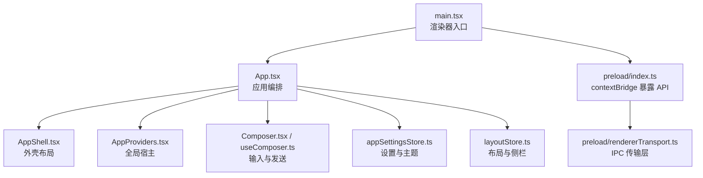
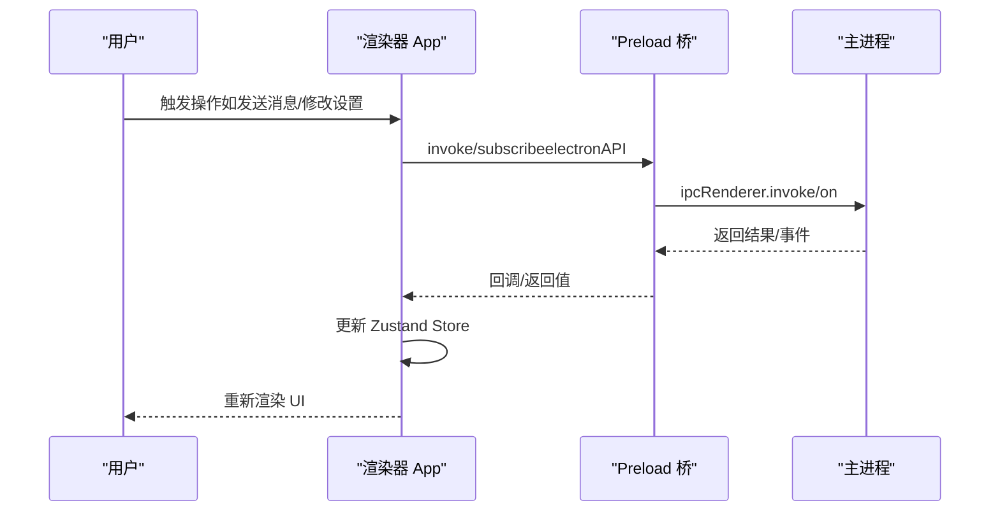
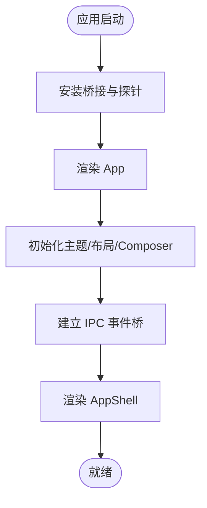
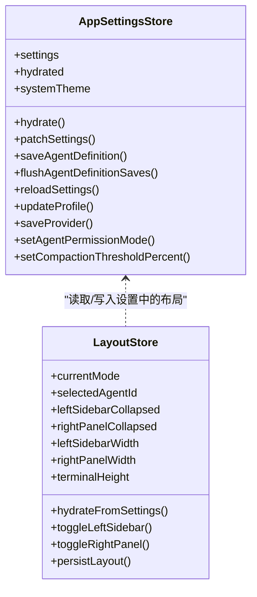
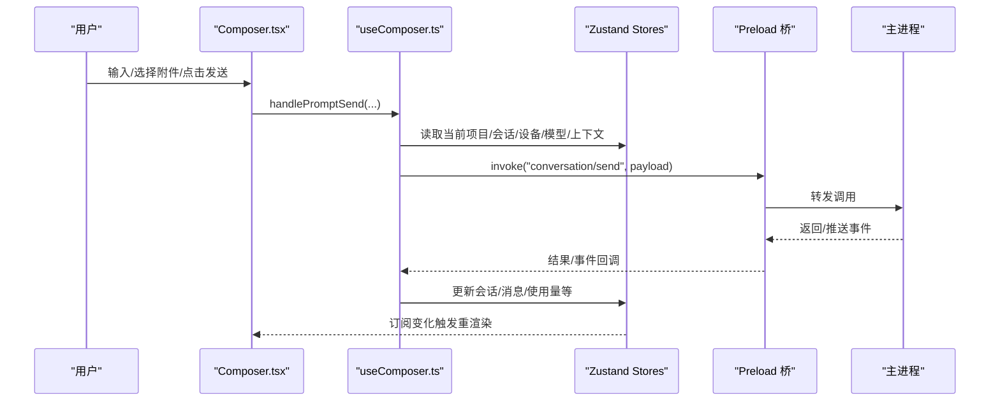
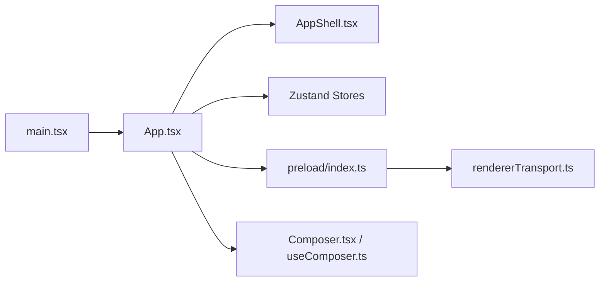

# 渲染器架构

<cite>
**本文引用的文件**
- [src/renderer/main.tsx](file://src/renderer/main.tsx)
- [src/renderer/app/App.tsx](file://src/renderer/app/App.tsx)
- [src/renderer/app/AppProviders.tsx](file://src/renderer/app/AppProviders.tsx)
- [src/renderer/shell/AppShell.tsx](file://src/renderer/shell/AppShell.tsx)
- [src/preload/index.ts](file://src/preload/index.ts)
- [src/preload/rendererTransport.ts](file://src/preload/rendererTransport.ts)
- [src/renderer/stores/appSettingsStore.ts](file://src/renderer/stores/appSettingsStore.ts)
- [src/renderer/stores/layoutStore.ts](file://src/renderer/stores/layoutStore.ts)
- [src/renderer/features/composer/useComposer.ts](file://src/renderer/features/composer/useComposer.ts)
- [src/renderer/features/composer/Composer.tsx](file://src/renderer/features/composer/Composer.tsx)
</cite>

## 目录
1. [简介](#简介)
2. [项目结构](#项目结构)
3. [核心组件](#核心组件)
4. [架构总览](#架构总览)
5. [详细组件分析](#详细组件分析)
6. [依赖关系分析](#依赖关系分析)
7. [性能考量](#性能考量)
8. [故障排查指南](#故障排查指南)
9. [结论](#结论)
10. [附录](#附录)

## 简介
本文件面向渲染器（Renderer）端的 React 前端应用，系统性阐述其架构设计与实现要点，包括：
- 组件层次结构与 UI 更新机制
- 状态管理（Zustand）的使用模式、数据持久化与同步策略
- Composer 输入组件、会话展示、设置面板等核心功能模块
- 与主进程的 IPC 通信封装、API 抽象层与错误处理
- 响应式布局、主题系统与国际化支持
- 组件关系图与状态流转图

## 项目结构
渲染器入口负责初始化全局能力并挂载根组件；App 作为应用编排中心，组合 Shell、工作区、模态框与通知等；IPC 通过 Preload 暴露安全 API；状态由多个 Zustand Store 分别管理。

图表来源
- [src/renderer/main.tsx:1-16](file://src/renderer/main.tsx#L1-L16)
- [src/renderer/app/App.tsx:1-252](file://src/renderer/app/App.tsx#L1-L252)
- [src/renderer/shell/AppShell.tsx:1-21](file://src/renderer/shell/AppShell.tsx#L1-L21)
- [src/renderer/app/AppProviders.tsx:1-13](file://src/renderer/app/AppProviders.tsx#L1-L13)
- [src/preload/index.ts:1-26](file://src/preload/index.ts#L1-L26)
- [src/preload/rendererTransport.ts:1-45](file://src/preload/rendererTransport.ts#L1-L45)

章节来源
- [src/renderer/main.tsx:1-16](file://src/renderer/main.tsx#L1-L16)
- [src/renderer/app/App.tsx:1-252](file://src/renderer/app/App.tsx#L1-L252)
- [src/renderer/shell/AppShell.tsx:1-21](file://src/renderer/shell/AppShell.tsx#L1-L21)
- [src/renderer/app/AppProviders.tsx:1-13](file://src/renderer/app/AppProviders.tsx#L1-L13)
- [src/preload/index.ts:1-26](file://src/preload/index.ts#L1-L26)
- [src/preload/rendererTransport.ts:1-45](file://src/preload/rendererTransport.ts#L1-L45)

## 核心组件
- 渲染器入口 main.tsx：安装浏览器桥接与性能探针，挂载 App。
- App.tsx：装配主题、布局、Composer、Shell、模态框、命令面板、通知等；协调 IPC 事件桥与快照同步。
- AppShell.tsx：纯布局容器，承载标题栏、主体与覆盖层。
- AppProviders.tsx：提供全局宿主（如右键菜单）。
- Preload 层：通过 contextBridge 暴露 electronAPI，封装 ipcRenderer 的 invoke/subscribe。
- 状态存储：
  - appSettingsStore.ts：设置、主题、语言、字体缩放、代理路由与提供者配置等，含乐观更新与回滚。
  - layoutStore.ts：左右侧栏、终端高度、模式切换与持久化。
- Composer：
  - useComposer.ts：聚合项目/会话/设备/模型/上下文等信息，组织发送流程与 UI 呈现。
  - Composer.tsx：输入、附件、工具审批、用户输入请求、斜杠命令、模式切换等交互。

章节来源
- [src/renderer/main.tsx:1-16](file://src/renderer/main.tsx#L1-L16)
- [src/renderer/app/App.tsx:1-252](file://src/renderer/app/App.tsx#L1-L252)
- [src/renderer/shell/AppShell.tsx:1-21](file://src/renderer/shell/AppShell.tsx#L1-L21)
- [src/renderer/app/AppProviders.tsx:1-13](file://src/renderer/app/AppProviders.tsx#L1-L13)
- [src/preload/index.ts:1-26](file://src/preload/index.ts#L1-L26)
- [src/preload/rendererTransport.ts:1-45](file://src/preload/rendererTransport.ts#L1-L45)
- [src/renderer/stores/appSettingsStore.ts:1-188](file://src/renderer/stores/appSettingsStore.ts#L1-L188)
- [src/renderer/stores/layoutStore.ts:1-156](file://src/renderer/stores/layoutStore.ts#L1-L156)
- [src/renderer/features/composer/useComposer.ts:1-193](file://src/renderer/features/composer/useComposer.ts#L1-L193)
- [src/renderer/features/composer/Composer.tsx:1-300](file://src/renderer/features/composer/Composer.tsx#L1-L300)

## 架构总览
渲染器采用“入口 -> 应用编排 -> 外壳布局”的分层结构，配合 Preload 的安全 IPC 通道与 Zustand 多 Store 的状态管理。UI 更新遵循“状态驱动 + 副作用最小化”的原则，关键操作通过乐观更新与回滚保证一致性。

图表来源
- [src/renderer/app/App.tsx:92-107](file://src/renderer/app/App.tsx#L92-L107)
- [src/preload/rendererTransport.ts:9-44](file://src/preload/rendererTransport.ts#L9-L44)
- [src/preload/index.ts:8-15](file://src/preload/index.ts#L8-L15)

章节来源
- [src/renderer/app/App.tsx:92-107](file://src/renderer/app/App.tsx#L92-L107)
- [src/preload/rendererTransport.ts:9-44](file://src/preload/rendererTransport.ts#L9-L44)
- [src/preload/index.ts:8-15](file://src/preload/index.ts#L8-L15)

## 详细组件分析

### 应用壳层与启动流程
- main.tsx 安装平台桥与性能探针后，渲染 App。
- App.tsx 完成主题解析、布局计算、Composer 控制器创建、IPC 事件桥绑定、加载态与通知控制，并将 AppShell 作为布局容器。
- AppShell 仅负责标题栏、主体与覆盖层的组合。

图表来源
- [src/renderer/main.tsx:8-15](file://src/renderer/main.tsx#L8-L15)
- [src/renderer/app/App.tsx:25-147](file://src/renderer/app/App.tsx#L25-L147)
- [src/renderer/shell/AppShell.tsx:5-20](file://src/renderer/shell/AppShell.tsx#L5-L20)

章节来源
- [src/renderer/main.tsx:8-15](file://src/renderer/main.tsx#L8-L15)
- [src/renderer/app/App.tsx:25-147](file://src/renderer/app/App.tsx#L25-L147)
- [src/renderer/shell/AppShell.tsx:5-20](file://src/renderer/shell/AppShell.tsx#L5-L20)

### 状态管理与数据流（Zustand）
- appSettingsStore：集中管理应用设置、主题、语言、字体缩放、Agent 路由与 Provider 定义等。对 Agent 定义与 Provider 保存使用乐观更新、重试与回滚，失败时恢复至上次成功版本。
- layoutStore：管理左右侧栏折叠/展开、宽度、终端高度与模式切换，并在变更时持久化到设置中。
- 其他 Store（如 project/session/conversation 等）在 App 中被组合使用，形成以 Store 为中心的数据流。

图表来源
- [src/renderer/stores/appSettingsStore.ts:1-188](file://src/renderer/stores/appSettingsStore.ts#L1-L188)
- [src/renderer/stores/layoutStore.ts:1-156](file://src/renderer/stores/layoutStore.ts#L1-L156)

章节来源
- [src/renderer/stores/appSettingsStore.ts:1-188](file://src/renderer/stores/appSettingsStore.ts#L1-L188)
- [src/renderer/stores/layoutStore.ts:1-156](file://src/renderer/stores/layoutStore.ts#L1-L156)

### Composer 输入组件与发送流程
useComposer 聚合项目、会话、设备、模型、上下文与对话准备阶段等信息，构建发送所需的全部参数，并暴露 UI 行为（发送、停止、附件、技能、提示词草稿等）。Composer 组件负责渲染输入区、附件托盘、工具审批与用户输入请求面板、斜杠命令、模式切换等。

图表来源
- [src/renderer/features/composer/useComposer.ts:106-127](file://src/renderer/features/composer/useComposer.ts#L106-L127)
- [src/renderer/features/composer/Composer.tsx:274-283](file://src/renderer/features/composer/Composer.tsx#L274-L283)
- [src/preload/rendererTransport.ts:29-36](file://src/preload/rendererTransport.ts#L29-L36)

章节来源
- [src/renderer/features/composer/useComposer.ts:1-193](file://src/renderer/features/composer/useComposer.ts#L1-L193)
- [src/renderer/features/composer/Composer.tsx:1-300](file://src/renderer/features/composer/Composer.tsx#L1-L300)

### 会话展示与工作区
- App 将 DebuggerPage 作为主页面注入 WorkbenchShell，结合布局状态决定左右面板可见性与抽屉模式。
- 会话相关状态（消息、准备阶段、使用量等）来自 conversation/session 等 Store，由 Composer 与调试页消费。

章节来源
- [src/renderer/app/App.tsx:174-197](file://src/renderer/app/App.tsx#L174-L197)

### 设置面板与主题系统
- App 通过 UserMenu 与 SettingsModal 暴露设置入口，支持主题、语言、字体缩放等外观偏好。
- 主题解析基于 settings.appearance.theme 与 systemTheme，App 层统一应用。
- 设置变更通过 appSettingsStore 的 patchSettings/updateProfile/saveProvider 等方法持久化，并触发界面刷新。

章节来源
- [src/renderer/app/App.tsx:48-52](file://src/renderer/app/App.tsx#L48-L52)
- [src/renderer/app/App.tsx:210-229](file://src/renderer/app/App.tsx#L210-L229)
- [src/renderer/stores/appSettingsStore.ts:44-48](file://src/renderer/stores/appSettingsStore.ts#L44-L48)

### IPC 通信封装与 API 抽象层
- preload/index.ts 通过 contextBridge.exposeInMainWorld 暴露 electronAPI，供渲染器安全调用。
- rendererTransport.ts 封装 invoke/subscribe/listener 管理，屏蔽底层 ipcRenderer 细节。
- App 层通过 useIpcEventBridge 订阅主进程事件（如捕获同步、窗口状态、通知等），实现跨进程状态同步。

章节来源
- [src/preload/index.ts:8-15](file://src/preload/index.ts#L8-L15)
- [src/preload/rendererTransport.ts:9-44](file://src/preload/rendererTransport.ts#L9-L44)
- [src/renderer/app/App.tsx:101-107](file://src/renderer/app/App.tsx#L101-L107)

### 错误处理与健壮性
- 设置保存采用乐观更新 + 失败回滚，确保 UI 始终反映最近一次成功状态。
- 布局持久化在浏览器 QA 环境下被有意忽略写操作，保持内存可用。
- 通知与异常通过 showNotice 与 try/catch 捕获，避免崩溃。

章节来源
- [src/renderer/stores/appSettingsStore.ts:49-111](file://src/renderer/stores/appSettingsStore.ts#L49-L111)
- [src/renderer/stores/layoutStore.ts:51-75](file://src/renderer/stores/layoutStore.ts#L51-L75)
- [src/renderer/app/App.tsx:64-72](file://src/renderer/app/App.tsx#L64-L72)

## 依赖关系分析
- 入口依赖：main.tsx 依赖 App、平台桥与性能探针。
- 应用编排：App 依赖 Shell、Composer、各 Store、i18n、IPC 事件桥。
- IPC 链路：渲染器通过 preload 暴露的 electronAPI 与主进程通信，transport 层管理监听与去重。
- 状态耦合：Composer 强依赖 session/project/device/layout 等 Store；设置与主题贯穿全应用。

图表来源
- [src/renderer/main.tsx:1-16](file://src/renderer/main.tsx#L1-L16)
- [src/renderer/app/App.tsx:1-252](file://src/renderer/app/App.tsx#L1-L252)
- [src/preload/index.ts:1-26](file://src/preload/index.ts#L1-L26)
- [src/preload/rendererTransport.ts:1-45](file://src/preload/rendererTransport.ts#L1-L45)

章节来源
- [src/renderer/main.tsx:1-16](file://src/renderer/main.tsx#L1-L16)
- [src/renderer/app/App.tsx:1-252](file://src/renderer/app/App.tsx#L1-L252)
- [src/preload/index.ts:1-26](file://src/preload/index.ts#L1-L26)
- [src/preload/rendererTransport.ts:1-45](file://src/preload/rendererTransport.ts#L1-L45)

## 性能考量
- 渲染粒度：通过 Zustand 的细粒度选择器减少不必要重渲染。
- 乐观更新：设置保存与 Agent/Provider 变更先更新 UI，再异步持久化，失败回滚，提升交互流畅度。
- IPC 节流：transport 层维护监听映射，避免重复注册与内存泄漏。
- 布局持久化：仅在必要时写入设置，降低频繁 IO。

[本节为通用指导，不直接分析具体文件]

## 故障排查指南
- 主题/语言/字体未生效：检查 appSettingsStore 的 patchSettings/updateProfile 是否成功，确认 resolvedTheme 计算逻辑。
- 侧栏/终端尺寸丢失：确认 layoutStore.persistLayout 是否被调用且无异常。
- 发送失败或状态不同步：查看 useComposer 的发送流程与 IPC 事件桥，确认主进程返回与 Store 更新路径。
- 设置保存失败：关注 agent/provider 定义的乐观更新与回滚逻辑，定位 lastSuccessful 与错误信息。

章节来源
- [src/renderer/stores/appSettingsStore.ts:49-111](file://src/renderer/stores/appSettingsStore.ts#L49-L111)
- [src/renderer/stores/layoutStore.ts:51-75](file://src/renderer/stores/layoutStore.ts#L51-L75)
- [src/renderer/features/composer/useComposer.ts:106-127](file://src/renderer/features/composer/useComposer.ts#L106-L127)

## 结论
该渲染器架构以 React 组件分层与 Zustand 状态管理为核心，借助 Preload 的安全 IPC 通道实现与主进程的稳定通信。通过乐观更新与回滚、布局持久化、主题与国际化支持，构建了高可用、可维护的前端体验。Composer 作为核心交互入口，整合了会话、设备、模型与上下文等多维状态，支撑复杂调试场景下的输入与反馈闭环。

## 附录
- 术语
  - Renderer：Electron 渲染进程，运行 React 前端。
  - Preload：桥接渲染器与主进程，暴露受限 API。
  - IPC：进程间通信，使用 ipcRenderer/ipcMain。
  - Zustand：轻量级状态库，用于前端状态管理。
- 最佳实践
  - 优先使用选择器订阅最小状态切片。
  - 对耗时操作采用乐观更新与失败回滚。
  - 通过 transport 层统一管理 IPC 监听生命周期。

[本节为概念性说明，不直接分析具体文件]