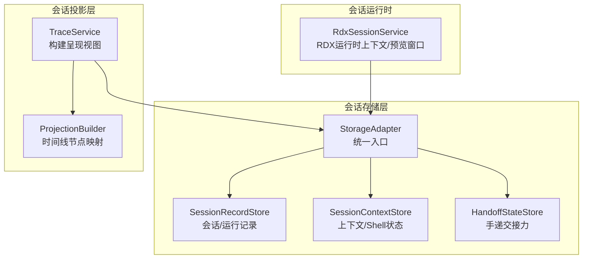
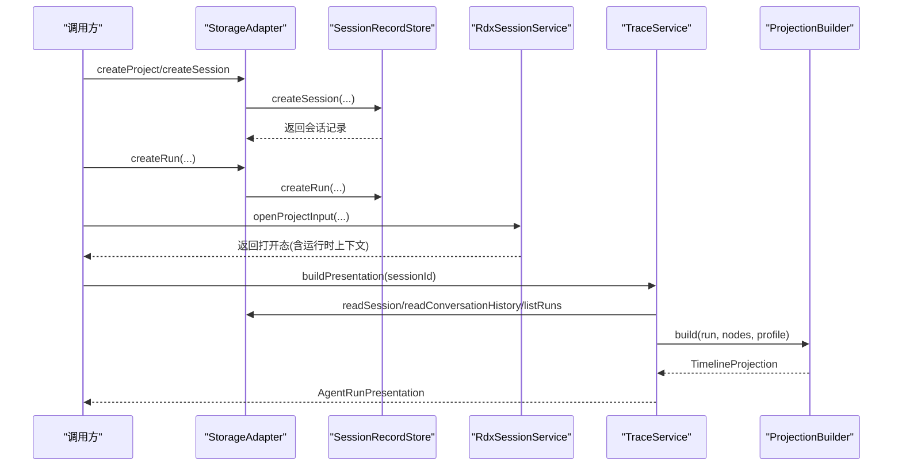
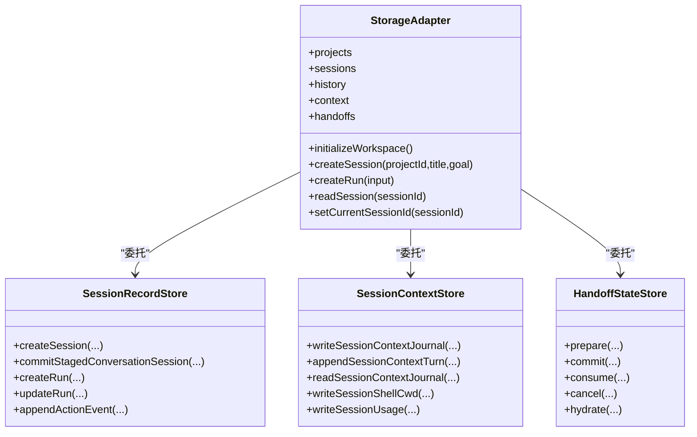
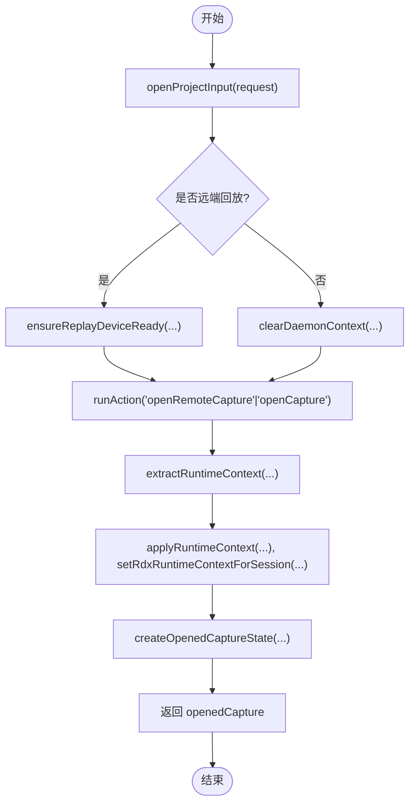
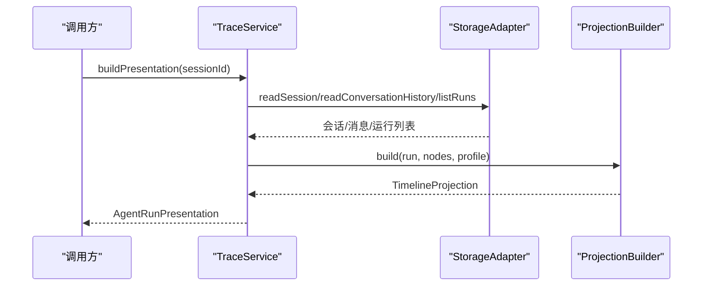
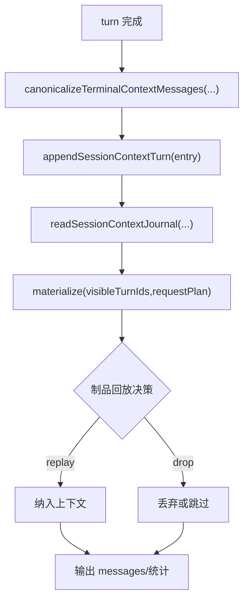
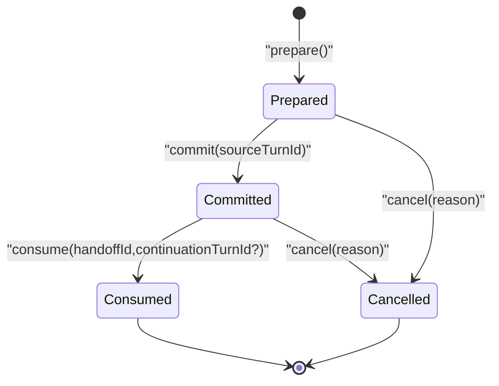
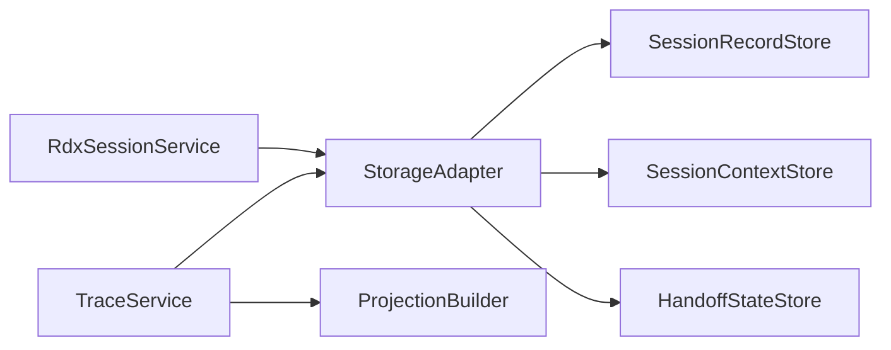

# 会话状态管理

<cite>
**本文引用的文件**
- [RdxSessionService.ts](file://src/main/sessions/RdxSessionService.ts)
- [StorageAdapter.ts](file://src/main/sessions/StorageAdapter.ts)
- [SessionRecordStore.ts](file://src/main/sessions/SessionRecordStore.ts)
- [SessionContextStore.ts](file://src/main/sessions/SessionContextStore.ts)
- [HandoffStateStore.ts](file://src/main/sessions/HandoffStateStore.ts)
- [SessionContextJournal.ts](file://src/main/conversation/SessionContextJournal.ts)
- [TraceService.ts](file://src/main/agent-trace/TraceService.ts)
- [ProjectionBuilder.ts](file://src/main/agent-trace/ProjectionBuilder.ts)
</cite>

## 目录
1. [简介](#简介)
2. [项目结构](#项目结构)
3. [核心组件](#核心组件)
4. [架构总览](#架构总览)
5. [详细组件分析](#详细组件分析)
6. [依赖关系分析](#依赖关系分析)
7. [性能考量](#性能考量)
8. [故障排查指南](#故障排查指南)
9. [结论](#结论)
10. [附录](#附录)

## 简介
本文件围绕“会话状态管理”展开，重点解析 sessionStore（以 StorageAdapter 及其子 Store 为代表）与 sessionProjectionStore（以 TraceService + ProjectionBuilder 为代表的投影层）的职责分工与协作机制。文档覆盖：
- 会话生命周期：创建、切换、销毁等状态变更流程
- 会话投影模型：会话元数据、上下文信息、Agent 配置的组织与更新策略
- 会话与对话状态的关联：上下文日志、分支状态、运行记录
- 跨会话状态同步：当前项目/会话选择、手递交接力（handoff）、运行时上下文租约
- 状态转换图与典型使用场景的代码路径指引

## 项目结构
会话相关代码主要位于 src/main/sessions，配合 conversation 与 agent-trace 模块完成“持久化存储—运行时服务—投影展示”的闭环。

图表来源
- [StorageAdapter.ts:41-66](file://src/main/sessions/StorageAdapter.ts#L41-L66)
- [SessionRecordStore.ts:40-149](file://src/main/sessions/SessionRecordStore.ts#L40-L149)
- [SessionContextStore.ts:14-95](file://src/main/sessions/SessionContextStore.ts#L14-L95)
- [HandoffStateStore.ts:42-242](file://src/main/sessions/HandoffStateStore.ts#L42-L242)
- [RdxSessionService.ts:53-781](file://src/main/sessions/RdxSessionService.ts#L53-L781)
- [TraceService.ts:103-152](file://src/main/agent-trace/TraceService.ts#L103-L152)
- [ProjectionBuilder.ts:93-110](file://src/main/agent-trace/ProjectionBuilder.ts#L93-L110)

章节来源
- [StorageAdapter.ts:41-66](file://src/main/sessions/StorageAdapter.ts#L41-L66)
- [SessionRecordStore.ts:40-149](file://src/main/sessions/SessionRecordStore.ts#L40-L149)
- [SessionContextStore.ts:14-95](file://src/main/sessions/SessionContextStore.ts#L14-L95)
- [HandoffStateStore.ts:42-242](file://src/main/sessions/HandoffStateStore.ts#L42-L242)
- [RdxSessionService.ts:53-781](file://src/main/sessions/RdxSessionService.ts#L53-L781)
- [TraceService.ts:103-152](file://src/main/agent-trace/TraceService.ts#L103-L152)
- [ProjectionBuilder.ts:93-110](file://src/main/agent-trace/ProjectionBuilder.ts#L93-L110)

## 核心组件
- StorageAdapter：项目/会话/运行记录的统一存储入口，协调各子 Store，维护当前项目与会话选择，并在会话打开时触发制品一致性检查。
- SessionRecordStore：会话与运行的 CRUD、分支状态、附件清单、动作链事件、运行文件持久化。
- SessionContextStore：会话上下文日志（按 turn 追加）、Shell 工作目录快照、用量摘要写入。
- HandoffStateStore：手递接力的准备、提交、消费、取消，维护活跃态与历史链，支持进程重启降级。
- RdxSessionService：RDX 运行时上下文与捕获窗口生命周期管理，负责本地/远端回放设备连接、预览窗口开关、运行时租约清理。
- TraceService + ProjectionBuilder：从会话历史、运行记录、动作事件构建可展示的 AgentRun 与时间线投影。

章节来源
- [StorageAdapter.ts:41-66](file://src/main/sessions/StorageAdapter.ts#L41-L66)
- [SessionRecordStore.ts:40-149](file://src/main/sessions/SessionRecordStore.ts#L40-L149)
- [SessionContextStore.ts:14-95](file://src/main/sessions/SessionContextStore.ts#L14-L95)
- [HandoffStateStore.ts:42-242](file://src/main/sessions/HandoffStateStore.ts#L42-L242)
- [RdxSessionService.ts:53-781](file://src/main/sessions/RdxSessionService.ts#L53-L781)
- [TraceService.ts:103-152](file://src/main/agent-trace/TraceService.ts#L103-L152)
- [ProjectionBuilder.ts:93-110](file://src/main/agent-trace/ProjectionBuilder.ts#L93-L110)

## 架构总览
下图展示了“会话创建—运行—投影—展示”的主干流程，以及跨会话同步的关键点。

图表来源
- [StorageAdapter.ts:91-171](file://src/main/sessions/StorageAdapter.ts#L91-L171)
- [SessionRecordStore.ts:111-149](file://src/main/sessions/SessionRecordStore.ts#L111-L149)
- [SessionRecordStore.ts:401-476](file://src/main/sessions/SessionRecordStore.ts#L401-L476)
- [RdxSessionService.ts:69-212](file://src/main/sessions/RdxSessionService.ts#L69-L212)
- [TraceService.ts:128-152](file://src/main/agent-trace/TraceService.ts#L128-L152)
- [ProjectionBuilder.ts:93-110](file://src/main/agent-trace/ProjectionBuilder.ts#L93-L110)

## 详细组件分析

### 会话存储层（sessionStore）
- StorageAdapter
  - 职责：聚合 ProjectWorkspaceStore、SessionRecordStore、ConversationHistoryStore、SessionContextStore、HandoffStateStore；提供统一 API；维护当前项目/会话选择；在会话读取/打开时触发制品一致性检查。
  - 关键行为：初始化工作区、列出/创建/删除项目与会话、创建/提交/回滚暂存会话、读写会话上下文日志、写入会话 Shell 状态与用量、追加动作事件、设置当前会话并通知制品解析器。
- SessionRecordStore
  - 职责：会话与运行记录的持久化；会话删除时的侧通道清理；会话标题归一化与默认命名；运行文件的创建、更新、安全校验；动作链事件追加。
  - 关键行为：createSession、commitStagedConversationSession、createRun、updateRun、readPersistedRun、listRuns、appendActionEvent。
- SessionContextStore
  - 职责：会话上下文日志（按 turn 追加）、Shell 工作目录快照、用量摘要持久化；确保非子代理会话写入。
  - 关键行为：writeSessionContextJournal、appendSessionContextTurn、readSessionContextJournal、writeSessionShellCwd、writeSessionUsage。
- HandoffStateStore
  - 职责：手递接力的准备/提交/消费/取消；维护活跃态与历史链；进程重启后对未在本进程创建的活跃态进行降级取消；限制链深度。
  - 关键行为：prepare、commit、consume、cancel、hydrate、computeNextChain。

图表来源
- [StorageAdapter.ts:41-66](file://src/main/sessions/StorageAdapter.ts#L41-L66)
- [SessionRecordStore.ts:40-149](file://src/main/sessions/SessionRecordStore.ts#L40-L149)
- [SessionContextStore.ts:14-95](file://src/main/sessions/SessionContextStore.ts#L14-L95)
- [HandoffStateStore.ts:42-242](file://src/main/sessions/HandoffStateStore.ts#L42-L242)

章节来源
- [StorageAdapter.ts:41-66](file://src/main/sessions/StorageAdapter.ts#L41-L66)
- [SessionRecordStore.ts:40-149](file://src/main/sessions/SessionRecordStore.ts#L40-L149)
- [SessionContextStore.ts:14-95](file://src/main/sessions/SessionContextStore.ts#L14-L95)
- [HandoffStateStore.ts:42-242](file://src/main/sessions/HandoffStateStore.ts#L42-L242)

### 会话运行时（RdxSessionService）
- 职责：管理 RDX 运行时上下文、捕获窗口、预览窗口、远程回放设备连接、运行时租约与清理。
- 关键流程：
  - 打开捕获：openProjectInput 根据本地/远端执行不同 action，提取运行时上下文，建立 openedCapture 状态，注册到会话租约。
  - 切换捕获：switchActiveCapture 仅切换 activeCaptureId，不改变运行时上下文。
  - 关闭/替换：closeOrReplaceOpenedCapture 先 teardownRuntime（调用 closeRuntime），再 resetRuntimeState，清理租约与预览状态。
  - 预览窗口：openHumanPreviewWindow/closeHumanPreviewWindow 控制预览开启/关闭，并更新 humanPreview 快照。

图表来源
- [RdxSessionService.ts:69-212](file://src/main/sessions/RdxSessionService.ts#L69-L212)
- [RdxSessionService.ts:314-391](file://src/main/sessions/RdxSessionService.ts#L314-L391)
- [RdxSessionService.ts:644-673](file://src/main/sessions/RdxSessionService.ts#L644-L673)

章节来源
- [RdxSessionService.ts:69-212](file://src/main/sessions/RdxSessionService.ts#L69-L212)
- [RdxSessionService.ts:214-229](file://src/main/sessions/RdxSessionService.ts#L214-L229)
- [RdxSessionService.ts:231-300](file://src/main/sessions/RdxSessionService.ts#L231-L300)
- [RdxSessionService.ts:301-312](file://src/main/sessions/RdxSessionService.ts#L301-L312)
- [RdxSessionService.ts:345-391](file://src/main/sessions/RdxSessionService.ts#L345-L391)
- [RdxSessionService.ts:710-779](file://src/main/sessions/RdxSessionService.ts#L710-L779)

### 会话投影层（sessionProjectionStore）
- TraceService
  - 职责：从会话历史、运行记录、动作事件构建 AgentRun 与时间线投影；维护 run 状态映射；生成右侧面板投影。
  - 关键行为：getSession/buildPresentation/buildPresentationFromData，将会话消息、事件、运行汇总转换为可视化节点。
- ProjectionBuilder
  - 职责：将 TraceNode 映射为 TimelineNode，决定渲染器、标题、折叠策略与重要性。

图表来源
- [TraceService.ts:128-152](file://src/main/agent-trace/TraceService.ts#L128-L152)
- [TraceService.ts:154-377](file://src/main/agent-trace/TraceService.ts#L154-L377)
- [ProjectionBuilder.ts:93-110](file://src/main/agent-trace/ProjectionBuilder.ts#L93-L110)

章节来源
- [TraceService.ts:128-152](file://src/main/agent-trace/TraceService.ts#L128-L152)
- [TraceService.ts:154-377](file://src/main/agent-trace/TraceService.ts#L154-L377)
- [ProjectionBuilder.ts:93-110](file://src/main/agent-trace/ProjectionBuilder.ts#L93-L110)

### 会话与对话状态的关联
- 上下文日志（SessionContextJournal）
  - 每个 turn 产出一条上下文条目，包含用户/助手消息、分支 ID、执行身份、控制参数、状态与时间戳。
  - materialize 阶段依据请求计划与保留窗口过滤/回放 continuation 制品，统计回放与丢弃数量。
- 会话上下文持久化（SessionContextStore）
  - 通过 appendSessionContextTurn 追加条目；readSessionContextJournal 读取完整日志；支持清空与路径查询。
- 会话分支状态（ConversationBranchState）
  - 由 ConversationHistoryStore 读写，用于多分支对话导航。

图表来源
- [SessionContextJournal.ts:121-189](file://src/main/conversation/SessionContextJournal.ts#L121-L189)
- [SessionContextStore.ts:69-95](file://src/main/sessions/SessionContextStore.ts#L69-L95)

章节来源
- [SessionContextJournal.ts:14-211](file://src/main/conversation/SessionContextJournal.ts#L14-L211)
- [SessionContextStore.ts:14-95](file://src/main/sessions/SessionContextStore.ts#L14-L95)

### 跨会话状态同步机制
- 当前项目/会话选择
  - StorageAdapter.setCurrentSessionId 会触发制品一致性检查，保证侧边栏与资源可见性一致。
- 运行时上下文租约
  - RdxSessionService.applyRuntimeContext 将运行时上下文绑定到 sessionId；teardown/reset 时释放租约，避免跨会话污染。
- 手递接力（Handoff）
  - HandoffStateStore 维护 prepared/committed/consumed/cancelled 生命周期，支持链式深度限制与进程重启降级。

图表来源
- [HandoffStateStore.ts:129-242](file://src/main/sessions/HandoffStateStore.ts#L129-L242)

章节来源
- [StorageAdapter.ts:437-446](file://src/main/sessions/StorageAdapter.ts#L437-L446)
- [RdxSessionService.ts:376-391](file://src/main/sessions/RdxSessionService.ts#L376-L391)
- [RdxSessionService.ts:710-779](file://src/main/sessions/RdxSessionService.ts#L710-L779)
- [HandoffStateStore.ts:129-242](file://src/main/sessions/HandoffStateStore.ts#L129-L242)

## 依赖关系分析
- StorageAdapter 作为门面，依赖各 Store 实现具体持久化逻辑；同时依赖 AppPathService、StorageIo 等基础设施。
- RdxSessionService 依赖 rdxShellActionService、rdxCliInvokerService、settingsService、runtimeLogService 等外部能力。
- TraceService 依赖 StorageAdapter、TraceEventStore、TraceTreeBuilder、ProjectionBuilder、AgentProfileRegistry 等。

图表来源
- [StorageAdapter.ts:41-66](file://src/main/sessions/StorageAdapter.ts#L41-L66)
- [RdxSessionService.ts:1-35](file://src/main/sessions/RdxSessionService.ts#L1-L35)
- [TraceService.ts:103-152](file://src/main/agent-trace/TraceService.ts#L103-L152)

章节来源
- [StorageAdapter.ts:41-66](file://src/main/sessions/StorageAdapter.ts#L41-L66)
- [RdxSessionService.ts:1-35](file://src/main/sessions/RdxSessionService.ts#L1-L35)
- [TraceService.ts:103-152](file://src/main/agent-trace/TraceService.ts#L103-L152)

## 性能考量
- 原子写入与增量追加：SessionContextStore 使用 JSONL 追加与原子写入，降低并发写入风险。
- 投影构建缓存：TraceService 对已存在的事件节点去重，避免重复构建。
- 保留窗口：SessionContextJournal 对可选制品采用最近 N 个 turn 的回放窗口，减少上下文膨胀。
- 运行时清理：RdxSessionService 在切换/关闭时主动清理 daemon context 与预览状态，防止资源泄漏。

[本节为通用指导，不直接分析具体文件]

## 故障排查指南
- 无法打开捕获或预览失败
  - 检查 RdxSessionService.openProjectInput 的错误分支与 clearDaemonContext 调用；确认远端设备激活成功。
  - 参考路径：[RdxSessionService.ts:69-212](file://src/main/sessions/RdxSessionService.ts#L69-L212)、[RdxSessionService.ts:231-300](file://src/main/sessions/RdxSessionService.ts#L231-L300)
- 运行时关闭失败导致租约残留
  - 检查 teardownRuntime 的 closeRuntime action 结果与错误日志；必要时强制重置状态。
  - 参考路径：[RdxSessionService.ts:710-779](file://src/main/sessions/RdxSessionService.ts#L710-L779)
- 手递接力冲突或链超限
  - 检查 HandoffStateStore.prepare/assertCanPrepare 的约束；确认 depth 未超过限制。
  - 参考路径：[HandoffStateStore.ts:129-154](file://src/main/sessions/HandoffStateStore.ts#L129-L154)
- 上下文日志不完整或版本不兼容
  - 检查 SessionContextJournal.readEntries 的版本校验与必填字段；必要时清空上下文日志继续。
  - 参考路径：[SessionContextJournal.ts:175-189](file://src/main/conversation/SessionContextJournal.ts#L175-L189)
- 投影构建异常或无最终回答
  - 检查 TraceService.buildPresentationFromData 中 finalContentForRun 与事件收集逻辑。
  - 参考路径：[TraceService.ts:154-377](file://src/main/agent-trace/TraceService.ts#L154-L377)

章节来源
- [RdxSessionService.ts:69-212](file://src/main/sessions/RdxSessionService.ts#L69-L212)
- [RdxSessionService.ts:231-300](file://src/main/sessions/RdxSessionService.ts#L231-L300)
- [RdxSessionService.ts:710-779](file://src/main/sessions/RdxSessionService.ts#L710-L779)
- [HandoffStateStore.ts:129-154](file://src/main/sessions/HandoffStateStore.ts#L129-L154)
- [SessionContextJournal.ts:175-189](file://src/main/conversation/SessionContextJournal.ts#L175-L189)
- [TraceService.ts:154-377](file://src/main/agent-trace/TraceService.ts#L154-L377)

## 结论
本系统通过清晰的三层架构实现了稳健的会话状态管理：
- 存储层（StorageAdapter 及子 Store）负责会话、运行、上下文与手递接力的持久化与一致性。
- 运行时层（RdxSessionService）管理 RDX 上下文、捕获与预览窗口生命周期，确保跨会话隔离与资源回收。
- 投影层（TraceService + ProjectionBuilder）将会话历史与运行事件转化为可视化的时间线与右侧面板。
三者协同，支撑了会话创建、切换、销毁的全生命周期管理，以及与对话状态、Agent 配置的紧密耦合。

[本节为总结性内容，不直接分析具体文件]

## 附录
- 典型使用场景与代码路径指引
  - 创建会话并启动运行：[SessionRecordStore.createSession:111-149](file://src/main/sessions/SessionRecordStore.ts#L111-L149)、[SessionRecordStore.createRun:401-476](file://src/main/sessions/SessionRecordStore.ts#L401-L476)
  - 打开捕获并进入运行时：[RdxSessionService.openProjectInput:69-212](file://src/main/sessions/RdxSessionService.ts#L69-L212)
  - 切换活动捕获：[RdxSessionService.switchActiveCapture:301-312](file://src/main/sessions/RdxSessionService.ts#L301-L312)
  - 关闭/替换捕获并清理：[RdxSessionService.closeOrReplaceOpenedCapture:214-229](file://src/main/sessions/RdxSessionService.ts#L214-L229)、[RdxSessionService.teardownRuntime:710-779](file://src/main/sessions/RdxSessionService.ts#L710-L779)
  - 构建会话投影：[TraceService.buildPresentation:141-152](file://src/main/agent-trace/TraceService.ts#L141-L152)、[ProjectionBuilder.build:93-110](file://src/main/agent-trace/ProjectionBuilder.ts#L93-L110)
  - 追加上下文日志：[SessionContextJournal.append:163-173](file://src/main/conversation/SessionContextJournal.ts#L163-L173)、[SessionContextStore.appendSessionContextTurn:91-95](file://src/main/sessions/SessionContextStore.ts#L91-L95)
  - 手递接力准备/提交/消费：[HandoffStateStore.prepare:129-140](file://src/main/sessions/HandoffStateStore.ts#L129-L140)、[HandoffStateStore.commit:177-190](file://src/main/sessions/HandoffStateStore.ts#L177-L190)、[HandoffStateStore.consume:192-207](file://src/main/sessions/HandoffStateStore.ts#L192-L207)

[本节为索引性内容，不直接分析具体文件]