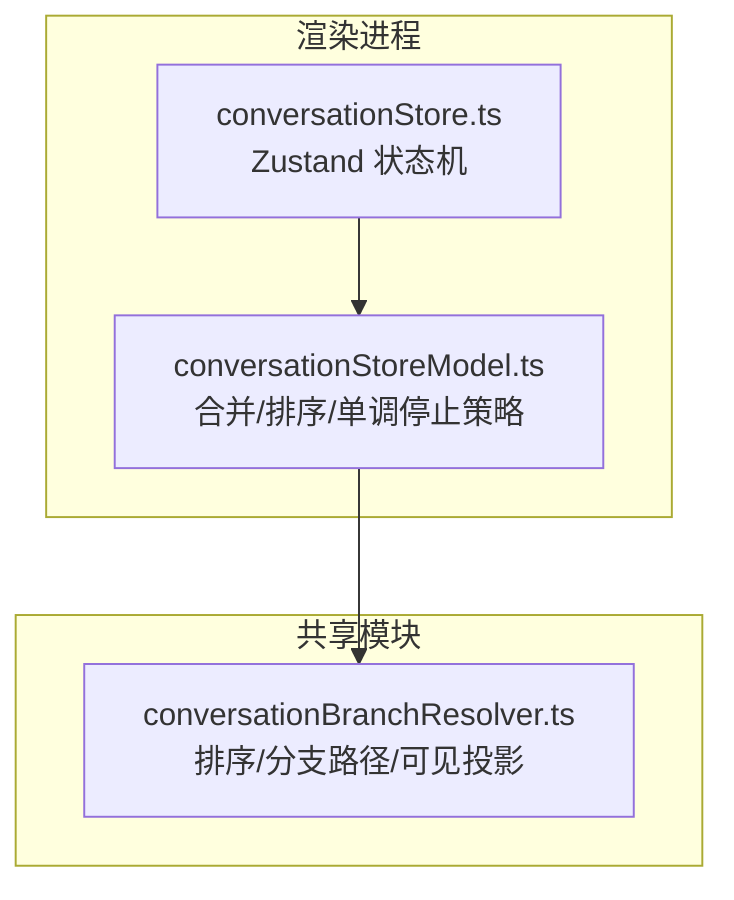
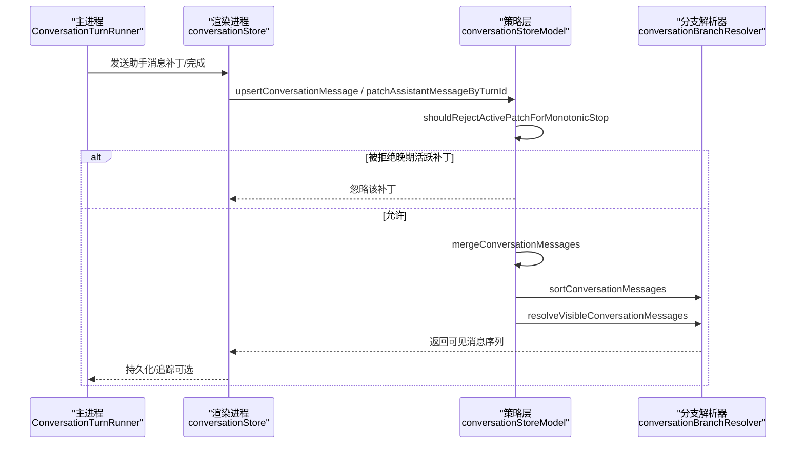
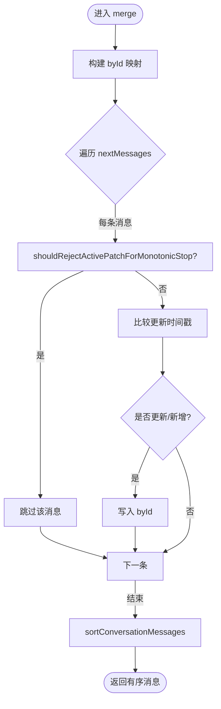
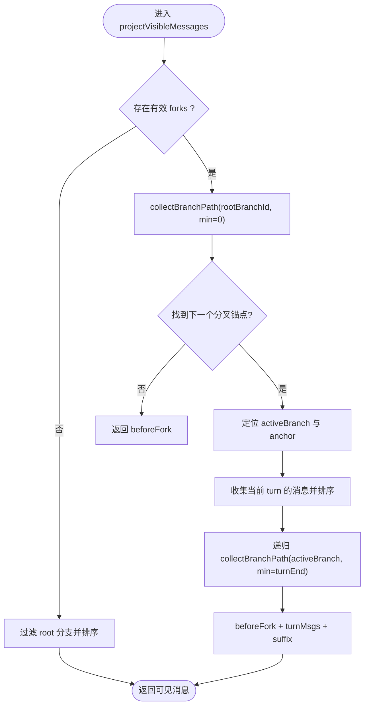
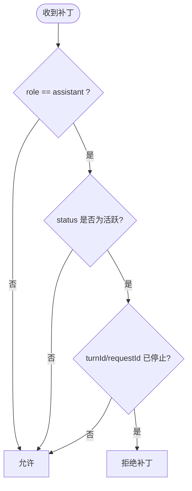
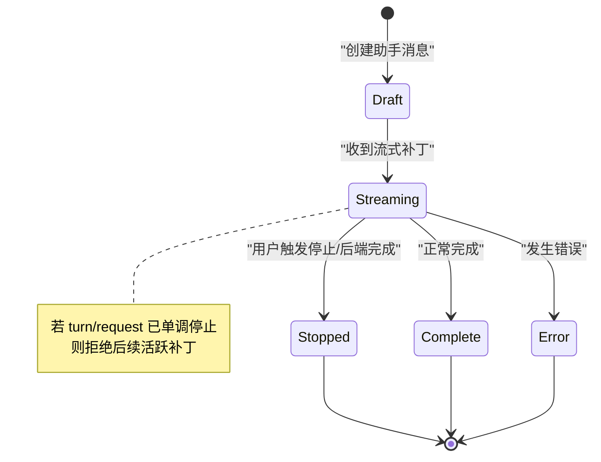

# 对话状态管理

<cite>
**本文引用的文件**
- [conversationStore.ts](file://src/renderer/stores/conversationStore.ts)
- [conversationStoreModel.ts](file://src/renderer/stores/conversationStoreModel.ts)
- [conversationBranchResolver.ts](file://src/shared/conversation/conversationBranchResolver.ts)
- [conversationStore.branch.test.ts](file://src/renderer/features/transcript/conversationStore.branch.test.ts)
- [conversationStore.monotonicStop.test.ts](file://src/renderer/stores/conversationStore.monotonicStop.test.ts)
- [ConversationTurnRunner.ts](file://src/main/conversation/ConversationTurnRunner.ts)
</cite>

## 目录
1. [简介](#简介)
2. [项目结构](#项目结构)
3. [核心组件](#核心组件)
4. [架构总览](#架构总览)
5. [详细组件分析](#详细组件分析)
6. [依赖关系分析](#依赖关系分析)
7. [性能考量](#性能考量)
8. [故障排查指南](#故障排查指南)
9. [结论](#结论)
10. [附录](#附录)

## 简介
本文件聚焦于前端对话状态管理的实现，围绕 conversationStore 的机制进行深入解析。重点覆盖：
- 消息管理与分支可见性投影
- 分支状态控制与原子快照
- 单调停止机制（monotonic stop）对活跃补丁的拦截
- 关键数据结构 ConversationState 的设计与字段关系
- 消息合并、排序与可见性投影算法
- 会话消息增删改查模式与使用场景
- 状态流转图与实际使用示例

## 项目结构
对话状态管理由“存储层”和“共享解析器”两部分组成：
- 存储层（renderer/stores）：基于 zustand 维护会话状态，提供消息与分支状态的读写方法，并封装单调停止策略。
- 共享解析器（shared/conversation）：负责消息排序、分支路径计算与可见消息投影。

图表来源
- [conversationStore.ts:1-139](file://src/renderer/stores/conversationStore.ts#L1-L139)
- [conversationStoreModel.ts:1-96](file://src/renderer/stores/conversationStoreModel.ts#L1-L96)
- [conversationBranchResolver.ts:1-231](file://src/shared/conversation/conversationBranchResolver.ts#L1-L231)

章节来源
- [conversationStore.ts:1-139](file://src/renderer/stores/conversationStore.ts#L1-L139)
- [conversationStoreModel.ts:1-96](file://src/renderer/stores/conversationStoreModel.ts#L1-L96)
- [conversationBranchResolver.ts:1-231](file://src/shared/conversation/conversationBranchResolver.ts#L1-L231)

## 核心组件
- conversationStore（Zustand store）
  - 维护 allConversationMessages（全量）、conversationMessages（可见）、branchState（分支状态）、时间线与推理摘要等。
  - 提供 add/upsert/patch/update 等方法，统一通过 mergeConversationMessages 与 projectVisibleMessages 保证一致性与可见性。
  - 暴露单调停止标记与撤销请求能力，确保流式更新不会“复活”已停止的轮次或请求。
- conversationStoreModel（策略与工具）
  - 定义 ACTIVE/TERMINAL 助手状态集合，实现 shouldRejectActivePatchForMonotonicStop、mergeConversationMessages、sortConversationMessages、projectVisibleMessages。
- conversationBranchResolver（分支与排序）
  - compareConversationMessages 决定消息顺序；resolveVisibleConversationMessages 根据 branchState 计算可见消息序列。

章节来源
- [conversationStore.ts:1-139](file://src/renderer/stores/conversationStore.ts#L1-L139)
- [conversationStoreModel.ts:1-96](file://src/renderer/stores/conversationStoreModel.ts#L1-L96)
- [conversationBranchResolver.ts:1-231](file://src/shared/conversation/conversationBranchResolver.ts#L1-L231)

## 架构总览
下图展示了从主进程流式事件到渲染进程状态更新的调用链，以及单调停止如何阻止晚期补丁影响最终结果。

图表来源
- [ConversationTurnRunner.ts:174-212](file://src/main/conversation/ConversationTurnRunner.ts#L174-L212)
- [conversationStore.ts:51-106](file://src/renderer/stores/conversationStore.ts#L51-L106)
- [conversationStoreModel.ts:27-57](file://src/renderer/stores/conversationStoreModel.ts#L27-L57)
- [conversationBranchResolver.ts:7-16](file://src/shared/conversation/conversationBranchResolver.ts#L7-L16)
- [conversationBranchResolver.ts:91-160](file://src/shared/conversation/conversationBranchResolver.ts#L91-L160)

## 详细组件分析

### ConversationState 数据结构设计
- allConversationMessages：全量消息列表，按时间稳定排序，作为唯一事实源。
- conversationMessages：当前分支下的可见消息投影，随 branchState 变化而重算。
- branchState：描述分叉点、活动分支及根分支，用于计算可见消息。
- monotonicStoppedTurnIds / monotonicStoppedRequestIds：记录已单调停止的 turn 或 requestId，阻止后续活跃补丁重新打开这些轮次或请求。
- revokedRequestIds：记录已被撤销的请求，支持一次性消费。
- timeline / reasoningSummaries：辅助展示与调试信息。

章节来源
- [conversationStoreModel.ts:59-96](file://src/renderer/stores/conversationStoreModel.ts#L59-L96)
- [conversationStore.ts:35-139](file://src/renderer/stores/conversationStore.ts#L35-L139)

### 消息合并算法 mergeConversationMessages
- 以 Map 按 id 去重，优先保留较新的 updatedAt/createdAt。
- 在合并前应用 shouldRejectActivePatchForMonotonicStop，若目标 turn/request 已单调停止且补丁为活跃状态（如 streaming/draft），则直接丢弃，避免“复活”。
- 最后调用 sortConversationMessages 输出有序列表。

图表来源
- [conversationStoreModel.ts:40-57](file://src/renderer/stores/conversationStoreModel.ts#L40-L57)
- [conversationStoreModel.ts:27-38](file://src/renderer/stores/conversationStoreModel.ts#L27-L38)

章节来源
- [conversationStoreModel.ts:40-57](file://src/renderer/stores/conversationStoreModel.ts#L40-L57)

### 排序逻辑 sortConversationMessages
- 基于 compareConversationMessages：先按 createdAt，同 turn 内 user 先于 assistant，再按 updatedAt/createdAt，最后按 id 字典序。
- 保证同一轮次内用户消息先于助手消息，且整体时序稳定可重现。

章节来源
- [conversationStoreModel.ts:18-19](file://src/renderer/stores/conversationStoreModel.ts#L18-L19)
- [conversationBranchResolver.ts:7-16](file://src/shared/conversation/conversationBranchResolver.ts#L7-L16)

### 可见性投影 projectVisibleMessages
- 委托给 resolveVisibleConversationMessages，依据 branchState 计算可见消息序列。
- 若无分支或无分叉，仅保留根分支消息并按规则排序。
- 若有分叉，沿 active fork 递归拼接“分叉前 + 当前轮次 + 后继分支”的完整路径。

图表来源
- [conversationStoreModel.ts:21-24](file://src/renderer/stores/conversationStoreModel.ts#L21-L24)
- [conversationBranchResolver.ts:91-160](file://src/shared/conversation/conversationBranchResolver.ts#L91-L160)

章节来源
- [conversationStoreModel.ts:21-24](file://src/renderer/stores/conversationStoreModel.ts#L21-L24)
- [conversationBranchResolver.ts:91-160](file://src/shared/conversation/conversationBranchResolver.ts#L91-L160)

### 单调停止机制
- 目的：当某 turn 或 requestId 被标记为“单调停止”，任何后续的活跃状态补丁（如 streaming/draft）不得覆盖已终止的最终状态（complete/error/stopped）。
- 判定：shouldRejectActivePatchForMonotonicStop 检查 turnId 或 requestId 是否在停止集合中，且补丁角色为 assistant，且补丁状态属于活跃集合。
- 效果：upsertConversationMessage 与 patchAssistantMessageByTurnId 会拒绝此类补丁，保证最终状态不可逆。

图表来源
- [conversationStoreModel.ts:27-38](file://src/renderer/stores/conversationStoreModel.ts#L27-L38)
- [conversationStoreModel.ts:40-57](file://src/renderer/stores/conversationStoreModel.ts#L40-L57)
- [conversationStore.ts:78-98](file://src/renderer/stores/conversationStore.ts#L78-L98)

章节来源
- [conversationStoreModel.ts:27-38](file://src/renderer/stores/conversationStoreModel.ts#L27-L38)
- [conversationStore.ts:78-98](file://src/renderer/stores/conversationStore.ts#L78-L98)
- [conversationStore.monotonicStop.test.ts:26-96](file://src/renderer/stores/conversationStore.monotonicStop.test.ts#L26-L96)

### 会话消息的增删改查模式
- 新增
  - addConversationMessage：插入单条消息，走合并与投影流程。
  - upsertConversationMessages：批量插入/更新，适合流式增量。
- 更新
  - upsertConversationMessage：按 id 幂等更新，结合单调停止保护。
  - patchAssistantMessageByTurnId：按 turnId 查找助手消息并打补丁，受单调停止保护。
  - updateAssistantMessageByTurnId：按函数更新助手消息，不主动检查单调停止（适用于本地确定性更新）。
- 查询
  - conversationMessages：当前可见消息（已排序）。
  - allConversationMessages：全量消息（已排序）。
  - selectLatestMessageActivityAt：最近一次活动时间戳。
- 分支与快照
  - setBranchState：切换分支，重算可见消息。
  - setConversationSnapshot：原子设置消息与分支状态，避免两者不一致。
- 单调停止与撤销
  - markTurnMonotonicallyStopped / markRequestMonotonicallyStopped：标记停止。
  - migrateMonotonicStoppedTurn：将停止标记迁移到新 turnId（例如 IPC 重写后）。
  - markRequestRevoked / consumeRevokedRequest：标记并一次性消费撤销请求。

章节来源
- [conversationStore.ts:35-139](file://src/renderer/stores/conversationStore.ts#L35-L139)
- [conversationStoreModel.ts:59-96](file://src/renderer/stores/conversationStoreModel.ts#L59-L96)

### 状态流转图（示例）
以下图展示一次典型助手消息从开始流式更新到停止的过程，以及单调停止如何阻断晚期补丁。

图表来源
- [conversationStoreModel.ts:7-16](file://src/renderer/stores/conversationStoreModel.ts#L7-L16)
- [conversationStoreModel.ts:27-38](file://src/renderer/stores/conversationStoreModel.ts#L27-L38)
- [conversationStore.ts:78-116](file://src/renderer/stores/conversationStore.ts#L78-L116)

### 实际使用示例（基于测试用例）
- 分支可见性：设置分支状态后，upsert 新分支消息，可见视图仅显示活动分支消息，allConversationMessages 仍保留全部历史。
- 原子快照：setConversationSnapshot 同时设置消息与分支状态，确保二者一致。
- 单调停止：对已停止的 turn 或 requestId，后续 streaming 补丁将被拒绝；支持将停止标记迁移到新 turnId。

章节来源
- [conversationStore.branch.test.ts:32-136](file://src/renderer/features/transcript/conversationStore.branch.test.ts#L32-L136)
- [conversationStore.monotonicStop.test.ts:26-96](file://src/renderer/stores/conversationStore.monotonicStop.test.ts#L26-L96)

## 依赖关系分析
- conversationStore 依赖 conversationStoreModel 提供的合并、排序与单调停止策略。
- conversationStoreModel 依赖 conversationBranchResolver 的排序与可见投影。
- 主进程的 ConversationTurnRunner 通过持久化与事件回调驱动渲染端状态更新。

图表来源
- [ConversationTurnRunner.ts:174-212](file://src/main/conversation/ConversationTurnRunner.ts#L174-L212)
- [conversationStore.ts:1-139](file://src/renderer/stores/conversationStore.ts#L1-L139)
- [conversationStoreModel.ts:1-96](file://src/renderer/stores/conversationStoreModel.ts#L1-L96)
- [conversationBranchResolver.ts:1-231](file://src/shared/conversation/conversationBranchResolver.ts#L1-L231)

章节来源
- [ConversationTurnRunner.ts:174-212](file://src/main/conversation/ConversationTurnRunner.ts#L174-L212)
- [conversationStore.ts:1-139](file://src/renderer/stores/conversationStore.ts#L1-L139)
- [conversationStoreModel.ts:1-96](file://src/renderer/stores/conversationStoreModel.ts#L1-L96)
- [conversationBranchResolver.ts:1-231](file://src/shared/conversation/conversationBranchResolver.ts#L1-L231)

## 性能考量
- 合并复杂度：mergeConversationMessages 使用 Map 进行 O(n) 去重与更新，整体 O(n+m)。
- 排序复杂度：compareConversationMessages 为常数级比较，排序 O(N log N)，N 为消息数。
- 可见投影：resolveVisibleConversationMessages 按分支递归收集，最坏情况遍历消息集，建议保持分支结构合理与消息规模可控。
- 单调停止：提前拒绝无效补丁，减少不必要的重算与 UI 抖动。
- 批量更新：优先使用 upsertConversationMessages 减少多次状态更新开销。

[本节为通用性能讨论，不直接分析具体文件]

## 故障排查指南
- 问题：助手消息停止后仍出现晚期流式内容
  - 检查是否调用了 markTurnMonotonicallyStopped 或 markRequestMonotonicallyStopped。
  - 确认补丁状态是否为活跃（streaming/draft），若是则会被拒绝。
  - 参考断言：late streaming patches 被拒绝、stopped 状态不被覆盖。
- 问题：IPC 重写后 turnId 变更导致停止失效
  - 使用 migrateMonotonicStoppedTurn 将停止标记迁移到新 turnId。
- 问题：分支切换后看不到预期消息
  - 确认 setBranchState 是否正确设置 activeLeafBranchId 与 forks。
  - 使用 setConversationSnapshot 原子设置消息与分支，避免不一致。
- 问题：撤销请求重复生效
  - 使用 consumeRevokedRequest 一次性消费，避免重复处理。

章节来源
- [conversationStore.monotonicStop.test.ts:26-96](file://src/renderer/stores/conversationStore.monotonicStop.test.ts#L26-L96)
- [conversationStore.branch.test.ts:32-136](file://src/renderer/features/transcript/conversationStore.branch.test.ts#L32-L136)
- [conversationStore.ts:117-134](file://src/renderer/stores/conversationStore.ts#L117-L134)

## 结论
conversationStore 通过“全量+可见”的双层数据模型、稳定的排序与分支投影、以及单调停止机制，实现了高可靠、可追溯、可回放的对话状态管理。其设计将复杂的状态一致性、可见性计算与流式更新冲突解决下沉到纯函数与策略层，使上层业务代码简洁且易于测试与维护。

[本节为总结性内容，不直接分析具体文件]

## 附录
- 关键 API 速览
  - 消息操作：addConversationMessage、upsertConversationMessage、upsertConversationMessages、patchAssistantMessageByTurnId、updateAssistantMessageByTurnId
  - 分支与快照：setBranchState、setConversationSnapshot
  - 单调停止：markTurnMonotonicallyStopped、markRequestMonotonicallyStopped、migrateMonotonicStoppedTurn
  - 撤销请求：markRequestRevoked、consumeRevokedRequest
  - 查询：selectOrderedConversationMessages、selectConversationMessageCount、selectLatestMessageActivityAt

章节来源
- [conversationStore.ts:35-139](file://src/renderer/stores/conversationStore.ts#L35-L139)
- [conversationStoreModel.ts:59-96](file://src/renderer/stores/conversationStoreModel.ts#L59-L96)