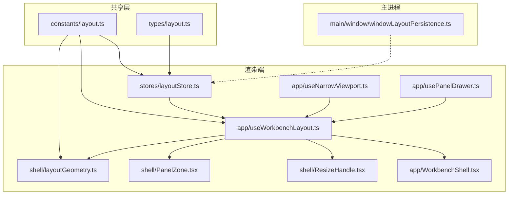
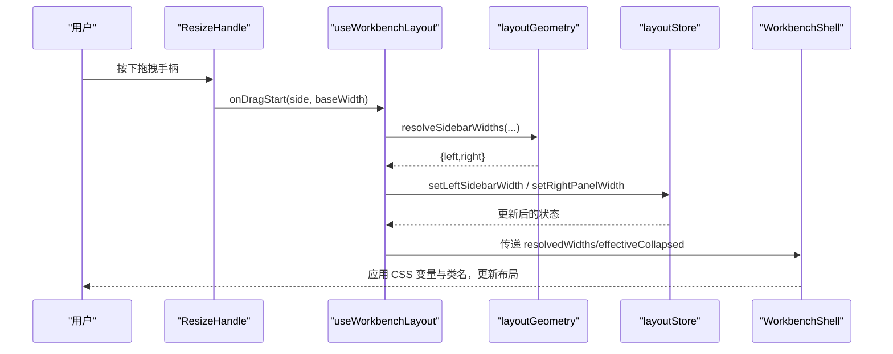
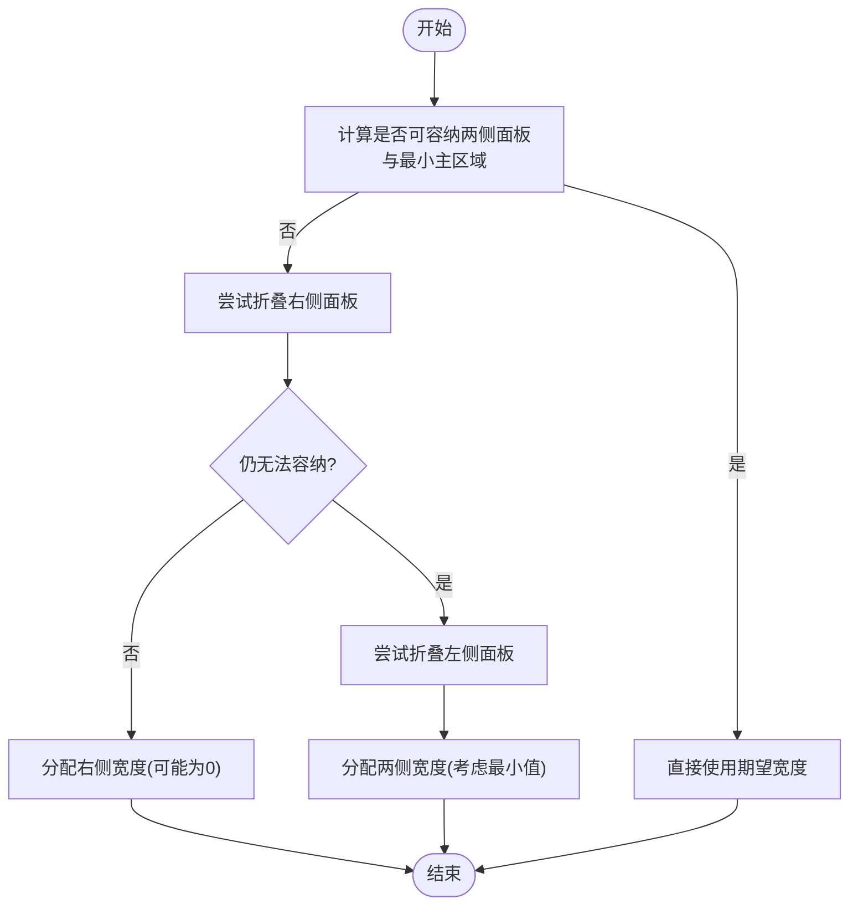
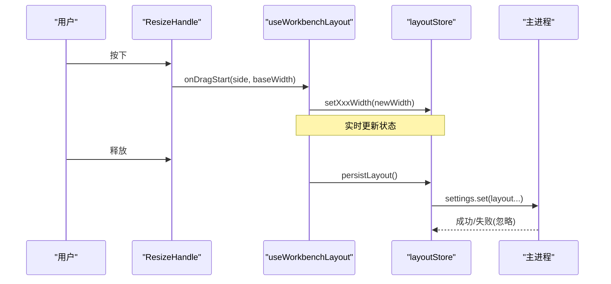
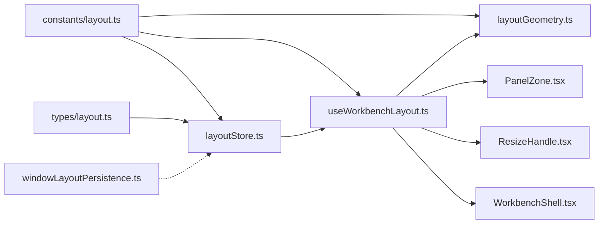

# 布局状态管理

<cite>
**本文引用的文件**
- [layoutStore.ts](file://src/renderer/stores/layoutStore.ts)
- [layoutGeometry.ts](file://src/renderer/shell/layoutGeometry.ts)
- [useWorkbenchLayout.ts](file://src/renderer/app/useWorkbenchLayout.ts)
- [WorkbenchShell.tsx](file://src/renderer/app/WorkbenchShell.tsx)
- [PanelZone.tsx](file://src/renderer/shell/PanelZone.tsx)
- [ResizeHandle.tsx](file://src/renderer/shell/ResizeHandle.tsx)
- [layout.ts（常量）](file://src/shared/constants/layout.ts)
- [layout.ts（类型）](file://src/shared/types/layout.ts)
- [windowLayoutPersistence.ts](file://src/main/window/windowLayoutPersistence.ts)
- [useNarrowViewport.ts](file://src/renderer/app/useNarrowViewport.ts)
- [usePanelDrawer.ts](file://src/renderer/app/usePanelDrawer.ts)
- [workbench-and-transcript.md](file://docs/ui/workbench-and-transcript.md)
</cite>

## 目录
1. [简介](#简介)
2. [项目结构](#项目结构)
3. [核心组件](#核心组件)
4. [架构总览](#架构总览)
5. [详细组件分析](#详细组件分析)
6. [依赖关系分析](#依赖关系分析)
7. [性能考量](#性能考量)
8. [故障排查指南](#故障排查指南)
9. [结论](#结论)
10. [附录：定制与扩展指南](#附录定制与扩展指南)

## 简介
本文件聚焦于 RDC-Agent 渲染端的“布局状态管理”，围绕 layoutStore 的界面布局管理机制展开，涵盖面板布局、窗口尺寸、组件位置等视觉状态的数据结构、变更监听与响应机制（拖拽调整、自动适配、状态持久化）、与用户交互的集成方式，以及多显示器支持的处理方案。同时提供面向开发者的布局定制与扩展指南。

## 项目结构
布局相关代码主要分布在以下层次：
- 共享常量与类型：定义左右侧栏宽度、终端高度、断点、最小主区域宽度等布局常量；定义 AgentMode、PanelState 等类型。
- 渲染端 Store：使用 zustand 维护布局状态，提供切换折叠、设置宽度、持久化等方法。
- 渲染端 Shell：负责计算响应式布局、处理拖拽调整、将布局状态映射为 CSS 变量与 DOM 类名。
- 主进程窗口布局：负责捕获和恢复窗口大小、位置、最大化状态，并做跨显示器边界校验。
- 辅助 Hook：窄屏检测、抽屉开关等。

图表来源
- [layoutStore.ts:1-156](file://src/renderer/stores/layoutStore.ts#L1-L156)
- [layoutGeometry.ts:1-152](file://src/renderer/shell/layoutGeometry.ts#L1-L152)
- [useWorkbenchLayout.ts:1-211](file://src/renderer/app/useWorkbenchLayout.ts#L1-L211)
- [WorkbenchShell.tsx:48-86](file://src/renderer/app/WorkbenchShell.tsx#L48-L86)
- [PanelZone.tsx:1-33](file://src/renderer/shell/PanelZone.tsx#L1-L33)
- [ResizeHandle.tsx:1-28](file://src/renderer/shell/ResizeHandle.tsx#L1-L28)
- [layout.ts（常量）:1-43](file://src/shared/constants/layout.ts#L1-L43)
- [layout.ts（类型）:1-42](file://src/shared/types/layout.ts#L1-L42)
- [windowLayoutPersistence.ts:1-115](file://src/main/window/windowLayoutPersistence.ts#L1-L115)

章节来源
- [layoutStore.ts:1-156](file://src/renderer/stores/layoutStore.ts#L1-L156)
- [layoutGeometry.ts:1-152](file://src/renderer/shell/layoutGeometry.ts#L1-L152)
- [useWorkbenchLayout.ts:1-211](file://src/renderer/app/useWorkbenchLayout.ts#L1-L211)
- [WorkbenchShell.tsx:48-86](file://src/renderer/app/WorkbenchShell.tsx#L48-L86)
- [PanelZone.tsx:1-33](file://src/renderer/shell/PanelZone.tsx#L1-L33)
- [ResizeHandle.tsx:1-28](file://src/renderer/shell/ResizeHandle.tsx#L1-L28)
- [layout.ts（常量）:1-43](file://src/shared/constants/layout.ts#L1-L43)
- [layout.ts（类型）:1-42](file://src/shared/types/layout.ts#L1-L42)
- [windowLayoutPersistence.ts:1-115](file://src/main/window/windowLayoutPersistence.ts#L1-L115)

## 核心组件
- 布局状态存储（layoutStore）：集中管理左右侧栏折叠/展开、宽度、终端高度、当前模式等，并提供持久化能力。
- 响应式几何计算（layoutGeometry）：根据容器宽度、面板可见性、最小主区域宽度，计算是否自动折叠、如何分配宽度。
- 工作台布局 Hook（useWorkbenchLayout）：串联 store、geometry、窄屏检测、抽屉逻辑，处理拖拽调整与最终布局输出。
- 渲染壳（WorkbenchShell）：将布局状态映射为 CSS 变量与类名，驱动实际 UI 呈现。
- 面板区域与拖拽手柄（PanelZone、ResizeHandle）：通用面板容器与可拖拽调整宽度的手柄。
- 主进程窗口布局（windowLayoutPersistence）：保存/恢复窗口尺寸、位置、最大化状态，并进行多显示器边界校验。

章节来源
- [layoutStore.ts:21-156](file://src/renderer/stores/layoutStore.ts#L21-L156)
- [layoutGeometry.ts:13-152](file://src/renderer/shell/layoutGeometry.ts#L13-L152)
- [useWorkbenchLayout.ts:24-211](file://src/renderer/app/useWorkbenchLayout.ts#L24-L211)
- [WorkbenchShell.tsx:48-86](file://src/renderer/app/WorkbenchShell.tsx#L48-L86)
- [PanelZone.tsx:1-33](file://src/renderer/shell/PanelZone.tsx#L1-L33)
- [ResizeHandle.tsx:1-28](file://src/renderer/shell/ResizeHandle.tsx#L1-L28)
- [windowLayoutPersistence.ts:17-115](file://src/main/window/windowLayoutPersistence.ts#L17-L115)

## 架构总览
布局系统采用“状态在 Store、计算在 Geometry、交互在 Hook、呈现在 Shell”的分层设计。Store 仅持有状态与简单变更；Geometry 提供纯函数计算；Hook 组合 Store、Geometry、窄屏检测与抽屉逻辑，并处理指针事件；Shell 消费 Hook 输出，通过 CSS 变量与类名驱动布局。

图表来源
- [ResizeHandle.tsx:9-24](file://src/renderer/shell/ResizeHandle.tsx#L9-L24)
- [useWorkbenchLayout.ts:121-187](file://src/renderer/app/useWorkbenchLayout.ts#L121-L187)
- [layoutGeometry.ts:101-151](file://src/renderer/shell/layoutGeometry.ts#L101-L151)
- [layoutStore.ts:138-150](file://src/renderer/stores/layoutStore.ts#L138-L150)
- [WorkbenchShell.tsx:78-86](file://src/renderer/app/WorkbenchShell.tsx#L78-L86)

## 详细组件分析

### 布局状态数据结构
- 面板定义与区域划分：
  - 左侧边栏：collapsed、width、expandedWidth、min/max/default/collapsed width。
  - 右侧面板：同上，且受右侧轨道可见性与断点影响。
  - 终端：height，带 min/max/default。
- 配置项来源：
  - 常量来自 shared/constants/layout.ts，包括默认值、最小/最大宽度、断点、主区域最小宽度、调整手柄宽度等。
  - 类型来自 shared/types/layout.ts，如 AgentMode、PanelState。
- 初始化与加载：
  - Store 提供 hydrateFromSettings，从设置中读取并 clamp 到合法范围。
  - 主进程 windowLayoutPersistence 负责窗口级尺寸与位置的持久化与恢复，并在多显示器环境下进行边界裁剪。

章节来源
- [layoutStore.ts:21-111](file://src/renderer/stores/layoutStore.ts#L21-L111)
- [layout.ts（常量）:1-43](file://src/shared/constants/layout.ts#L1-L43)
- [layout.ts（类型）:1-42](file://src/shared/types/layout.ts#L1-L42)
- [windowLayoutPersistence.ts:29-75](file://src/main/window/windowLayoutPersistence.ts#L29-L75)

### 响应式适配与自动折叠
- 自动折叠策略：
  - 当容器宽度不足以容纳两侧面板与最小主区域时，优先尝试折叠右侧面板，再折叠左侧面板。
  - 右侧面板在不可见或自动折叠时会进入抽屉模式（基于断点与自动折叠）。
- 宽度分配算法：
  - 先计算可用空间（容器宽度 - 最小主区域 - 手柄占用）。
  - 若超出，则按“左→右→再左→再右”的顺序逐步缩减至各自最小值，确保不溢出。
- 断点与抽屉：
  - RIGHT_RAIL_DRAWER_BREAKPOINT 控制右侧轨道何时进入抽屉。
  - useNarrowViewport 与 usePanelDrawer 配合实现窄屏下的抽屉开关。

图表来源
- [layoutGeometry.ts:48-99](file://src/renderer/shell/layoutGeometry.ts#L48-L99)
- [layoutGeometry.ts:101-151](file://src/renderer/shell/layoutGeometry.ts#L101-L151)
- [useWorkbenchLayout.ts:49-69](file://src/renderer/app/useWorkbenchLayout.ts#L49-L69)

章节来源
- [layoutGeometry.ts:48-151](file://src/renderer/shell/layoutGeometry.ts#L48-L151)
- [useWorkbenchLayout.ts:49-69](file://src/renderer/app/useWorkbenchLayout.ts#L49-L69)
- [useNarrowViewport.ts:1-25](file://src/renderer/app/useNarrowViewport.ts#L1-L25)
- [usePanelDrawer.ts:1-17](file://src/renderer/app/usePanelDrawer.ts#L1-L17)

### 拖拽调整与状态持久化
- 拖拽流程：
  - ResizeHandle 捕获鼠标按下，计算初始面板宽度并通知 Hook。
  - useWorkbenchLayout 监听 pointermove，实时计算新宽度并调用 Store 的 setLeftSidebarWidth/setRightPanelWidth。
  - 释放时清除拖拽状态并触发 persistLayout。
- 持久化：
  - Store 的 persistLayout 将折叠状态、宽度、终端高度写入设置（Electron API），失败时静默降级以保证内存态可用。
  - 主进程在窗口关闭时同步保存窗口布局，移动/缩放时防抖异步保存。

图表来源
- [ResizeHandle.tsx:9-24](file://src/renderer/shell/ResizeHandle.tsx#L9-L24)
- [useWorkbenchLayout.ts:121-187](file://src/renderer/app/useWorkbenchLayout.ts#L121-L187)
- [layoutStore.ts:114-155](file://src/renderer/stores/layoutStore.ts#L114-L155)
- [windowLayoutPersistence.ts:77-115](file://src/main/window/windowLayoutPersistence.ts#L77-L115)

章节来源
- [useWorkbenchLayout.ts:121-187](file://src/renderer/app/useWorkbenchLayout.ts#L121-L187)
- [layoutStore.ts:114-155](file://src/renderer/stores/layoutStore.ts#L114-L155)
- [windowLayoutPersistence.ts:77-115](file://src/main/window/windowLayoutPersistence.ts#L77-L115)

### 与用户交互的集成
- 折叠/展开：
  - Store 提供 toggleLeftSidebar/toggleRightPanel，切换后自动持久化。
- 抽屉模式：
  - 窄屏或自动折叠时，右侧面板以抽屉形式出现，支持遮罩关闭、焦点管理与键盘操作（产品规范约束）。
- 标题栏与工具区：
  - WorkbenchShell 将布局状态映射为 CSS 变量，使主工作区、侧栏、手柄宽度动态变化。

章节来源
- [layoutStore.ts:114-137](file://src/renderer/stores/layoutStore.ts#L114-L137)
- [WorkbenchShell.tsx:78-86](file://src/renderer/app/WorkbenchShell.tsx#L78-L86)
- [workbench-and-transcript.md:1-28](file://docs/ui/workbench-and-transcript.md#L1-L28)
- [workbench-and-transcript.md:85-86](file://docs/ui/workbench-and-transcript.md#L85-L86)

### 多显示器支持
- 主进程在恢复窗口位置时，会获取最近显示器的 workArea，并将窗口坐标限制在该显示器范围内，避免跨屏异常。
- 窗口尺寸会被限制在最小窗口宽高与显示器宽高之间，保证始终可见。

章节来源
- [windowLayoutPersistence.ts:29-75](file://src/main/window/windowLayoutPersistence.ts#L29-L75)

## 依赖关系分析
- 常量与类型被 Store、Geometry、Hook、Shell 共同引用，形成稳定的布局契约。
- Store 依赖 Electron API 进行设置持久化；Geometry 为纯函数，无外部副作用。
- Hook 组合 Store、Geometry、窄屏检测与抽屉逻辑，是交互的核心编排者。
- Shell 仅消费 Hook 输出，保持展示职责单一。

图表来源
- [layoutStore.ts:1-156](file://src/renderer/stores/layoutStore.ts#L1-L156)
- [layoutGeometry.ts:1-152](file://src/renderer/shell/layoutGeometry.ts#L1-L152)
- [useWorkbenchLayout.ts:1-211](file://src/renderer/app/useWorkbenchLayout.ts#L1-L211)
- [PanelZone.tsx:1-33](file://src/renderer/shell/PanelZone.tsx#L1-L33)
- [ResizeHandle.tsx:1-28](file://src/renderer/shell/ResizeHandle.tsx#L1-L28)
- [WorkbenchShell.tsx:48-86](file://src/renderer/app/WorkbenchShell.tsx#L48-L86)
- [windowLayoutPersistence.ts:1-115](file://src/main/window/windowLayoutPersistence.ts#L1-L115)

章节来源
- [layoutStore.ts:1-156](file://src/renderer/stores/layoutStore.ts#L1-L156)
- [layoutGeometry.ts:1-152](file://src/renderer/shell/layoutGeometry.ts#L1-L152)
- [useWorkbenchLayout.ts:1-211](file://src/renderer/app/useWorkbenchLayout.ts#L1-L211)
- [WorkbenchShell.tsx:48-86](file://src/renderer/app/WorkbenchShell.tsx#L48-L86)
- [windowLayoutPersistence.ts:1-115](file://src/main/window/windowLayoutPersistence.ts#L1-L115)

## 性能考量
- 响应式计算为纯函数，复杂度低，仅在容器尺寸或面板状态变化时触发。
- 拖拽过程中频繁调用 Store 方法，但每次只更新必要字段；持久化在拖拽结束后执行，避免 IO 抖动。
- 窗口布局保存采用防抖策略，减少磁盘写入频率；关闭时同步保存确保数据一致性。
- 使用 CSS 变量与类名切换布局，避免重排重绘过多节点。

[本节为通用指导，无需特定文件引用]

## 故障排查指南
- 布局无法持久化：
  - 检查浏览器 QA 环境是否允许 settings 写入；Store 已做静默降级，不影响内存态。
  - 确认 electronAPI.settings.set 调用路径正确。
- 拖拽无效：
  - 确认 ResizeHandle 未 disabled，且 effectiveCollapsed 不为 true。
  - 检查 useWorkbenchLayout 的 pointermove/pointerup 监听是否正确挂载与清理。
- 自动折叠不符合预期：
  - 核对 APP_MIN_MAIN_WIDTH、RIGHT_RAIL_DRAWER_BREAKPOINT 等常量是否符合设计。
  - 检查 isRightRailVisible 与 rightPanelCollapsed 的状态来源。
- 窗口位置异常：
  - 确认主进程在恢复窗口位置时使用了正确的显示器 workArea，并对 x/y 做了边界裁剪。

章节来源
- [layoutStore.ts:52-75](file://src/renderer/stores/layoutStore.ts#L52-L75)
- [useWorkbenchLayout.ts:121-187](file://src/renderer/app/useWorkbenchLayout.ts#L121-L187)
- [layoutGeometry.ts:48-99](file://src/renderer/shell/layoutGeometry.ts#L48-L99)
- [windowLayoutPersistence.ts:29-75](file://src/main/window/windowLayoutPersistence.ts#L29-L75)

## 结论
该布局系统通过清晰的分层与纯函数计算，实现了稳定、可预测的界面布局管理。Store 专注状态与持久化，Geometry 负责响应式计算，Hook 编排交互，Shell 负责呈现。结合主进程的窗口布局持久化与多显示器支持，整体满足桌面应用的复杂布局需求。

[本节为总结，无需特定文件引用]

## 附录：定制与扩展指南
- 新增面板或区域：
  - 在 constants/layout.ts 中添加宽度、断点等常量。
  - 在 layoutStore 中增加对应状态与 setter，并纳入 hydrateFromSettings 与 persistLayout。
  - 在 layoutGeometry 中扩展 canFitLayout/resolveSidebarWidths 的计算逻辑。
  - 在 useWorkbenchLayout 中接入新的面板状态与拖拽逻辑。
  - 在 WorkbenchShell 中注入 CSS 变量与类名。
- 修改断点与行为：
  - 调整 RIGHT_RAIL_DRAWER_BREAKPOINT 以改变右侧轨道进入抽屉的阈值。
  - 调整 APP_MIN_MAIN_WIDTH 以改变主工作区的最小宽度。
- 扩展持久化字段：
  - 在 Store 的 persistLayout 中追加需要保存的字段，并确保 hydrateFromSettings 能正确还原。
- 多显示器适配：
  - 如需自定义窗口初始位置策略，可在 windowLayoutPersistence 中调整 display.workArea 的使用方式。

章节来源
- [layout.ts（常量）:1-43](file://src/shared/constants/layout.ts#L1-L43)
- [layoutStore.ts:21-156](file://src/renderer/stores/layoutStore.ts#L21-L156)
- [layoutGeometry.ts:48-151](file://src/renderer/shell/layoutGeometry.ts#L48-L151)
- [useWorkbenchLayout.ts:24-211](file://src/renderer/app/useWorkbenchLayout.ts#L24-L211)
- [WorkbenchShell.tsx:78-86](file://src/renderer/app/WorkbenchShell.tsx#L78-L86)
- [windowLayoutPersistence.ts:29-75](file://src/main/window/windowLayoutPersistence.ts#L29-L75)