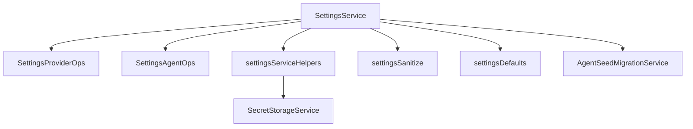
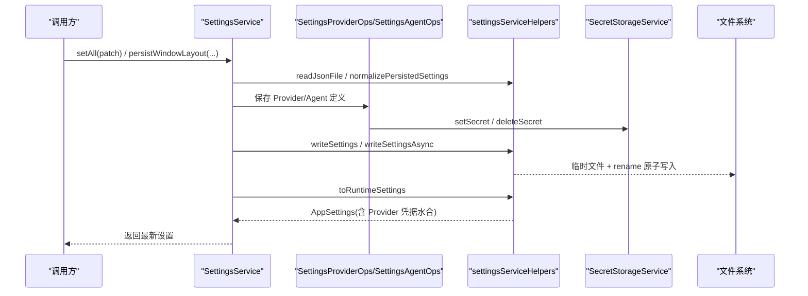
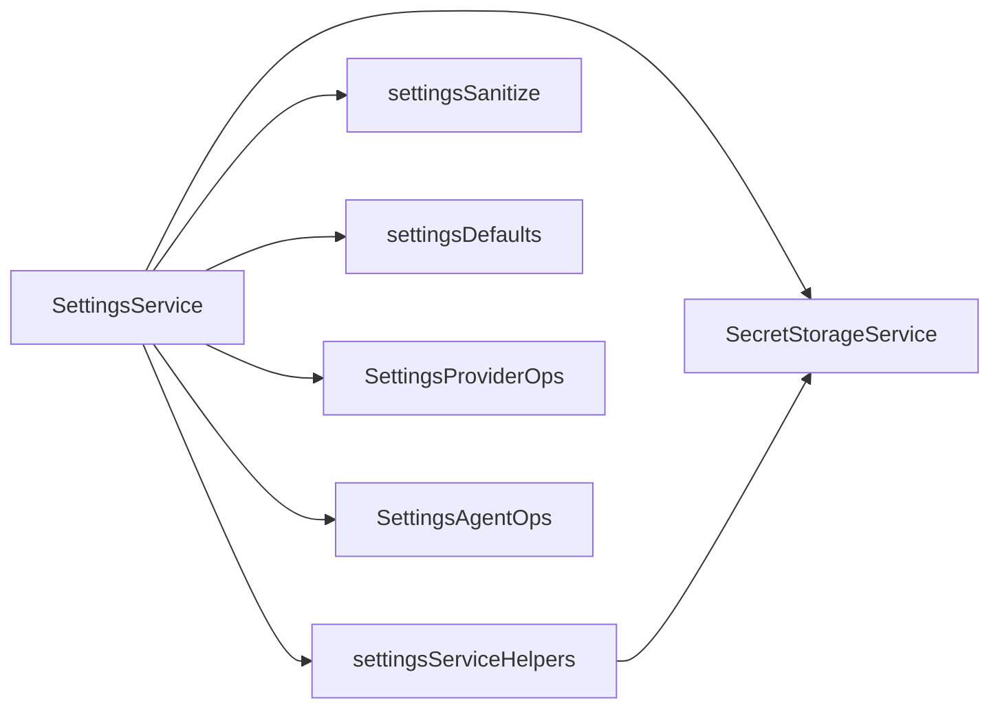

# 应用设置状态管理

<cite>
**本文引用的文件**
- [SettingsService.ts](file://src/main/settings/SettingsService.ts)
- [settingsDefaults.ts](file://src/main/settings/settingsDefaults.ts)
- [settingsSanitize.ts](file://src/main/settings/settingsSanitize.ts)
- [settingsServiceHelpers.ts](file://src/main/settings/settingsServiceHelpers.ts)
- [SettingsAgentOps.ts](file://src/main/settings/SettingsAgentOps.ts)
- [SettingsProviderOps.ts](file://src/main/settings/SettingsProviderOps.ts)
- [SecretStorageService.ts](file://src/main/settings/SecretStorageService.ts)
- [AgentSeedMigrationService.ts](file://src/main/settings/seed-migration/AgentSeedMigrationService.ts)
</cite>

## 目录
1. [简介](#简介)
2. [项目结构](#项目结构)
3. [核心组件](#核心组件)
4. [架构总览](#架构总览)
5. [详细组件分析](#详细组件分析)
6. [依赖关系分析](#依赖关系分析)
7. [性能考量](#性能考量)
8. [故障排查指南](#故障排查指南)
9. [结论](#结论)
10. [附录](#附录)

## 简介
本文件系统性梳理 RDC-Agent 的应用设置状态管理机制，围绕 SettingsService 及其协作模块，覆盖以下主题：
- 设置项定义、校验与默认值
- 持久化策略（原子写入、版本兼容、迁移）
- 运行时配置装配（LLM Provider、Agent 路由、工具链等）
- 热更新与变更传播（窗口布局、Shell 工具、Provider 凭据）
- 冲突处理与并发安全（客户端版本号、写锁）
- 扩展指南与最佳实践

## 项目结构
设置子系统位于 main/settings，配合 shared/types 的类型定义与 theme 的 UI 偏好。关键文件职责如下：
- settingsDefaults.ts：定义持久化负载结构、默认值与常量（如 schemaVersion）
- settingsSanitize.ts：字段级清洗、范围约束与类型归一
- settingsServiceHelpers.ts：读写 JSON、版本断言、构建运行时 AppSettings、Provider 归一化
- SettingsService.ts：设置入口服务，协调 Provider 操作、Agent 操作、窗口布局、全局保存
- SettingsProviderOps.ts：Provider 连接、账号登录、模型选择、断开/旋转凭据
- SettingsAgentOps.ts：Agent 定义的提交、冲突检测、回滚恢复
- SecretStorageService.ts：凭据的安全存储（safeStorage）、掩码预览、隔离清理
- AgentSeedMigrationService.ts：内置种子 Agent 文件的迁移与清理策略

**图表来源**
- [SettingsService.ts:94-114](file://src/main/settings/SettingsService.ts#L94-L114)
- [settingsServiceHelpers.ts:176-289](file://src/main/settings/settingsServiceHelpers.ts#L176-L289)
- [SecretStorageService.ts:72-262](file://src/main/settings/SecretStorageService.ts#L72-L262)

**章节来源**
- [SettingsService.ts:94-114](file://src/main/settings/SettingsService.ts#L94-L114)
- [settingsDefaults.ts:33-193](file://src/main/settings/settingsDefaults.ts#L33-L193)

## 核心组件
- SettingsService：统一入口，负责初始化、读取、合并、持久化与返回运行时 AppSettings；提供窗口布局快速写入、Provider/Agent 操作委托。
- SettingsProviderOps：封装 Provider 连接/账号登录/模型选择/断开/凭据轮换等复杂流程，保证凭据与配置的原子性。
- SettingsAgentOps：对 Agent 定义进行带版本号的提交与冲突处理，支持失败回滚与缓存快照。
- settingsServiceHelpers：JSON 读写、schemaVersion 断言、持久化重建、运行时装配（toRuntimeSettings）。
- settingsSanitize：所有可持久化字段的强类型清洗与边界约束。
- SecretStorageService：凭据加密存储、掩码预览、权限加固与损坏隔离。
- AgentSeedMigrationService：内置种子 Agent 文件的迁移、隔离与清理，保障用户覆盖与官方一致性。

**章节来源**
- [SettingsService.ts:94-518](file://src/main/settings/SettingsService.ts#L94-L518)
- [SettingsProviderOps.ts:43-547](file://src/main/settings/SettingsProviderOps.ts#L43-L547)
- [SettingsAgentOps.ts:15-192](file://src/main/settings/SettingsAgentOps.ts#L15-L192)
- [settingsServiceHelpers.ts:100-408](file://src/main/settings/settingsServiceHelpers.ts#L100-L408)
- [settingsSanitize.ts:42-278](file://src/main/settings/settingsSanitize.ts#L42-L278)
- [SecretStorageService.ts:72-262](file://src/main/settings/SecretStorageService.ts#L72-L262)
- [AgentSeedMigrationService.ts:137-788](file://src/main/settings/seed-migration/AgentSeedMigrationService.ts#L137-L788)

## 架构总览
设置数据流从 UI/IPC 进入 SettingsService，经 sanitize 清洗、Provider/Agent 操作、secret 存储后，通过 helpers 原子写入磁盘，并转换为运行时 AppSettings 供上层消费。

**图表来源**
- [SettingsService.ts:249-383](file://src/main/settings/SettingsService.ts#L249-L383)
- [settingsServiceHelpers.ts:327-349](file://src/main/settings/settingsServiceHelpers.ts#L327-L349)
- [settingsServiceHelpers.ts:357-408](file://src/main/settings/settingsServiceHelpers.ts#L357-L408)
- [SecretStorageService.ts:182-227](file://src/main/settings/SecretStorageService.ts#L182-L227)

## 详细组件分析

### 设置数据结构与默认值
- 持久化负载 PersistedSettingsPayload：包含 appearance、layout、profile、tooling、agentRuntime、llm.providers 等。
- 默认值：DEFAULT_APPEARANCE、DEFAULT_LAYOUT、DEFAULT_PROFILE、DEFAULT_TOOLING、DEFAULT_AGENT_RUNTIME。
- Schema 版本：SETTINGS_SCHEMA_VERSION 用于兼容性检查与迁移。

要点
- 所有字段在写入前均经过 sanitize，确保类型与取值范围正确。
- 窗口布局、侧边栏宽度、终端高度等均有最小/最大限制与折叠宽度。

**章节来源**
- [settingsDefaults.ts:33-193](file://src/main/settings/settingsDefaults.ts#L33-L193)
- [settingsSanitize.ts:218-278](file://src/main/settings/settingsSanitize.ts#L218-L278)

### 设置验证与清洗
- 字符串数组/记录清洗、路径展开与去重、枚举选择、数值钳制。
- 工具链（rdcCli、rdcActions、codeInterpreter、shell）各自有独立 sanitizer。
- Agent 运行时权限模式、可读/可写根目录、命令前缀白/黑名单均受控。

典型规则
- timeoutMs 限制在 1s~600s。
- 窗口尺寸限制在应用最小/最大范围内。
- 侧边栏宽度在 min/max 之间，collapsedWidth 作为折叠态宽度。

**章节来源**
- [settingsSanitize.ts:42-216](file://src/main/settings/settingsSanitize.ts#L42-L216)
- [settingsSanitize.ts:218-278](file://src/main/settings/settingsSanitize.ts#L218-L278)

### 持久化与原子写入
- 使用临时文件 + rename 实现原子写入，避免部分写入导致损坏。
- 异步写入用于高频场景（窗口 move/resize 防抖）。
- 读取失败或不存在时回退到默认值，并记录警告。

**章节来源**
- [settingsServiceHelpers.ts:100-140](file://src/main/settings/settingsServiceHelpers.ts#L100-L140)
- [settingsServiceHelpers.ts:327-349](file://src/main/settings/settingsServiceHelpers.ts#L327-L349)

### 运行时设置装配（AppSettings）
- toRuntimeSettings 将持久化设置归一化，水合 Provider 凭据，组装 agents、resourceCatalog、paths 等。
- getLlmConfig 过滤已启用且验证通过的 Provider，注入协议、baseUrl、accountId 等。

**章节来源**
- [settingsServiceHelpers.ts:357-408](file://src/main/settings/settingsServiceHelpers.ts#L357-L408)
- [SettingsService.ts:458-487](file://src/main/settings/SettingsService.ts#L458-L487)

### 窗口布局热更新
- persistWindowLayout/persistWindowLayoutAsync：仅 patch layout.window，跳过 Provider 归一化与凭据水合，降低开销。
- 内部 assembleWindowLayoutPayload 合并当前布局与补丁，并执行 sanitizeWindow。

**章节来源**
- [SettingsService.ts:208-247](file://src/main/settings/SettingsService.ts#L208-L247)

### 全局设置保存（setAll）
- 合并 appearance、layout、profile、tooling、agentRuntime、llm.providers。
- 对 API Key 等敏感信息，写入 SecretStorageService，并在持久化后删除暂存引用。
- 若 shell.executable 变化，清空 ShellResolver 缓存以生效。

**章节来源**
- [SettingsService.ts:249-383](file://src/main/settings/SettingsService.ts#L249-L383)
- [SettingsService.ts:501-514](file://src/main/settings/SettingsService.ts#L501-L514)

### Provider 连接与凭据管理
- saveProviderConnection：校验 authMode、可用模型、连接字段完整性；按字段 kind=secret 写入凭据；计算 activeAccountId；最终调用 host.setAll 持久化。
- saveProviderAccountConnection：账号登录流程，写入 OAuth 凭据，更新账户摘要。
- rotateProviderAccountCredential：刷新凭据并替换旧凭据。
- disconnectProvider：清除凭据与状态，恢复为未配置或不可用。

并发与冲突
- 基于 clientRevision 的乐观锁：小于等于最新版本则标记 superseded。
- 写锁 withProviderDefinitionWriteLock：串行化同一 providerId 的写入，失败时回滚到 previous。

**章节来源**
- [SettingsProviderOps.ts:152-190](file://src/main/settings/SettingsProviderOps.ts#L152-L190)
- [SettingsProviderOps.ts:192-366](file://src/main/settings/SettingsProviderOps.ts#L192-L366)
- [SettingsProviderOps.ts:368-547](file://src/main/settings/SettingsProviderOps.ts#L368-L547)

### Agent 定义提交与冲突处理
- saveAgentDefinition：校验 agentId、clientRevision；按 laneKey 串行化写；失败时恢复 previous；成功后缓存 commit 快照。
- getAgentDefinitionCommit：读取并缓存最近一次提交快照，命中 commitHash 则直接返回。

**章节来源**
- [SettingsAgentOps.ts:119-192](file://src/main/settings/SettingsAgentOps.ts#L119-L192)

### 凭据安全存储
- 使用 safeStorage 加密存储，文件权限加固（Unix 模式位、Windows ACL）。
- 支持复制、删除、掩码预览；损坏文件自动隔离。
- 提供多种 ref 生成策略：provider api-key、oauth、account、connection field。

**章节来源**
- [SecretStorageService.ts:72-262](file://src/main/settings/SecretStorageService.ts#L72-L262)

### 设置迁移与版本兼容
- assertPersistedSettingsSchemaVersion：拒绝高于当前支持的 schemaVersion。
- rebuildPersistedSettings：清理废弃字段（如 embedding）、重置主题污染、修复重复 Provider、移除 fixture Provider。
- AgentSeedMigrationService：扫描 agents 目录，分类历史保留/覆盖/自定义文件，必要时隔离并清理；记录迁移标记与诊断。

**章节来源**
- [settingsServiceHelpers.ts:112-126](file://src/main/settings/settingsServiceHelpers.ts#L112-L126)
- [settingsServiceHelpers.ts:176-289](file://src/main/settings/settingsServiceHelpers.ts#L176-L289)
- [AgentSeedMigrationService.ts:137-788](file://src/main/settings/seed-migration/AgentSeedMigrationService.ts#L137-L788)

### 变更传播与实时生效
- 窗口布局：立即写入并返回最新 AppSettings，前端订阅后可即时渲染。
- Shell 工具：executable 变更触发 shellResolver.clearCache()，后续命令解析立即生效。
- Provider 凭据：写入 secret 后立即可用于运行时水合；Provider 状态变更后，getLlmConfig 会反映最新配置。

**章节来源**
- [SettingsService.ts:208-247](file://src/main/settings/SettingsService.ts#L208-L247)
- [SettingsService.ts:501-514](file://src/main/settings/SettingsService.ts#L501-L514)
- [settingsServiceHelpers.ts:357-408](file://src/main/settings/settingsServiceHelpers.ts#L357-L408)

### 设置项组织方式（主题、语言、性能、调试）
- 主题与外观：appearance（来自 createDefaultUiPreferences），由 sanitizeUiPreferences 与 DEFAULT_APPEARANCE 控制。
- 语言偏好：由 i18n 层管理，不在持久化设置中体现。
- 性能选项：agentRuntime.context.compactionThresholdPercent 控制上下文压缩阈值。
- 调试开关：无集中“调试”开关；可通过 tooling.shell.executable、agentRuntime.permissions.mode 等影响行为。

**章节来源**
- [settingsDefaults.ts:89-178](file://src/main/settings/settingsDefaults.ts#L89-L178)
- [settingsSanitize.ts:197-216](file://src/main/settings/settingsSanitize.ts#L197-L216)

## 依赖关系分析
- SettingsService 依赖：
  - settingsServiceHelpers：JSON 读写、版本断言、运行时装配
  - settingsSanitize：字段清洗
  - settingsDefaults：默认值与常量
  - SecretStorageService：凭据存取
  - SettingsProviderOps/SettingsAgentOps：领域操作
  - AgentManifestService/ExecutionProfileService：Agent 路由与资源目录
- 外部依赖：
  - Electron safeStorage：凭据加密
  - fs/promises：原子写入
  - path：路径规范化与展开

**图表来源**
- [SettingsService.ts:94-114](file://src/main/settings/SettingsService.ts#L94-L114)
- [settingsServiceHelpers.ts:176-289](file://src/main/settings/settingsServiceHelpers.ts#L176-L289)

**章节来源**
- [SettingsService.ts:94-518](file://src/main/settings/SettingsService.ts#L94-L518)
- [settingsServiceHelpers.ts:100-408](file://src/main/settings/settingsServiceHelpers.ts#L100-L408)

## 性能考量
- 窗口布局写入采用轻量 patch 与异步写入，减少主线程阻塞。
- Provider 凭据仅在需要时水合，避免每次读取都解密大对象。
- 使用 clientRevision 与写锁避免无效重试与竞态。
- 路径与 Shell 解析结果缓存，变更时显式失效。

[本节为通用指导，不直接分析具体文件]

## 故障排查指南
常见问题与定位
- 无法读取设置文件：readJsonFile/readJsonFileAsync 捕获异常并返回 null，随后回退到默认值；检查路径与权限。
- schemaVersion 过高：assertPersistedSettingsSchemaVersion 抛出 StorageSchemaError；需升级应用或降级设置文件。
- 凭据解密失败：SecretStorageService 输出警告并返回空串；检查 safeStorage 可用性。
- Provider 连接不完整：saveProviderConnection 校验 connectionSchema 字段，缺失则报错。
- Agent 定义提交被覆盖：clientRevision 冲突返回 superseded；检查并发提交顺序。

建议步骤
- 查看日志中的 [SettingsService] 警告与错误。
- 检查 secrets/provider-secrets.json 是否损坏并被隔离。
- 确认 schemaVersion 与 SETTINGS_SCHEMA_VERSION 一致。
- 对频繁写入的场景（窗口布局）使用异步接口。

**章节来源**
- [settingsServiceHelpers.ts:100-140](file://src/main/settings/settingsServiceHelpers.ts#L100-L140)
- [settingsServiceHelpers.ts:112-126](file://src/main/settings/settingsServiceHelpers.ts#L112-L126)
- [SecretStorageService.ts:72-105](file://src/main/settings/SecretStorageService.ts#L72-L105)
- [SettingsProviderOps.ts:192-268](file://src/main/settings/SettingsProviderOps.ts#L192-L268)
- [SettingsAgentOps.ts:129-192](file://src/main/settings/SettingsAgentOps.ts#L129-L192)

## 结论
该设置系统通过严格的字段清洗、安全的凭据存储、原子写入与版本兼容机制，提供了稳定可靠的配置管理能力。通过 Provider/Agent 操作的并发控制与冲突处理，保证了多端/多进程下的数据一致性。窗口布局与 Shell 工具的热更新提升了用户体验。建议在扩展新设置项时遵循现有 sanitize 模式，明确默认值与边界，并通过测试覆盖迁移逻辑。

[本节为总结，不直接分析具体文件]

## 附录

### 设置项扩展指南
- 新增字段应：
  - 在 settingsDefaults 中添加默认值
  - 在 settingsSanitize 中增加对应 sanitizer，限定类型与范围
  - 在 rebuildPersistedSettings/normalizePersistedSettings 中纳入归一化流程
  - 如涉及凭据，使用 SecretStorageService 的 ref 策略
  - 在 setAll 中合并并持久化
- 示例参考：
  - 新增 tooling 子项：参照 rdcCli/codeInterpreter/shell 的 sanitizer 与默认值
  - 新增 agentRuntime 选项：参照 permissions/context 的 sanitizer

**章节来源**
- [settingsDefaults.ts:119-178](file://src/main/settings/settingsDefaults.ts#L119-L178)
- [settingsSanitize.ts:73-216](file://src/main/settings/settingsSanitize.ts#L73-L216)
- [settingsServiceHelpers.ts:260-325](file://src/main/settings/settingsServiceHelpers.ts#L260-L325)
- [SettingsService.ts:301-375](file://src/main/settings/SettingsService.ts#L301-L375)

### 最佳实践
- 始终使用 sanitize 函数处理外部输入
- 使用异步写入处理高频更新（窗口布局）
- 凭据只存引用，明文不落地
- 对可能破坏性的迁移，先隔离再清理，并记录诊断
- 对外暴露的 API 保持幂等，使用 clientRevision 防止乱序提交

[本节为通用指导，不直接分析具体文件]