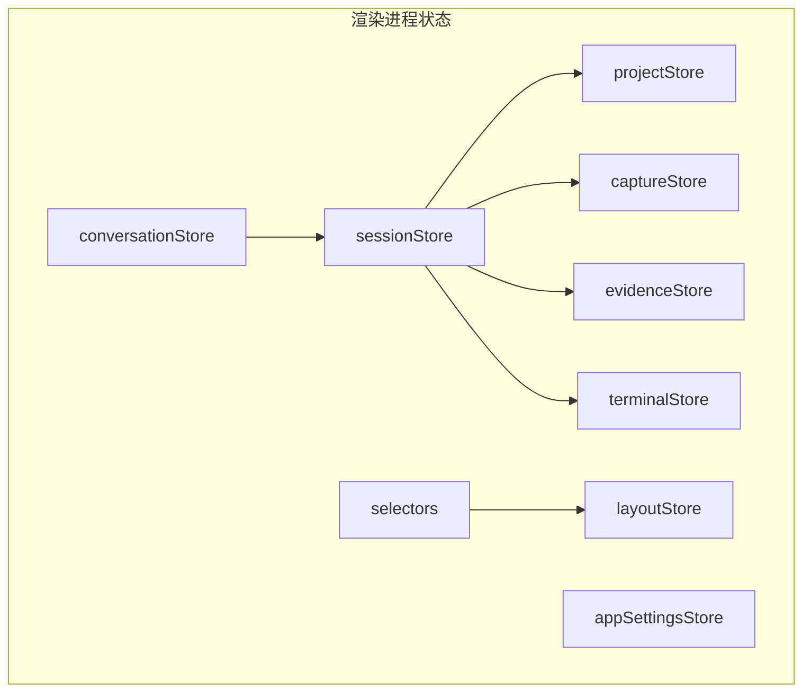
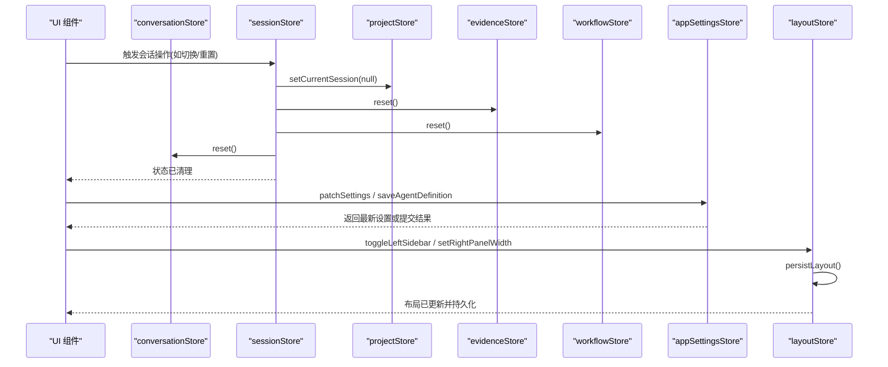
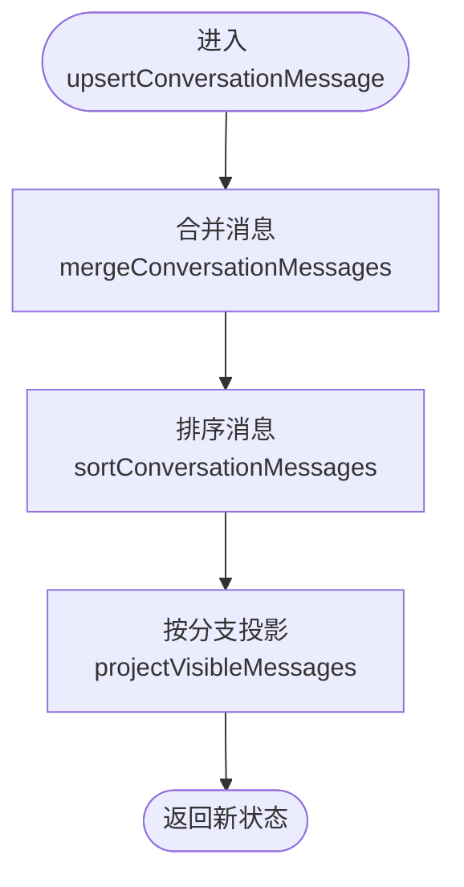
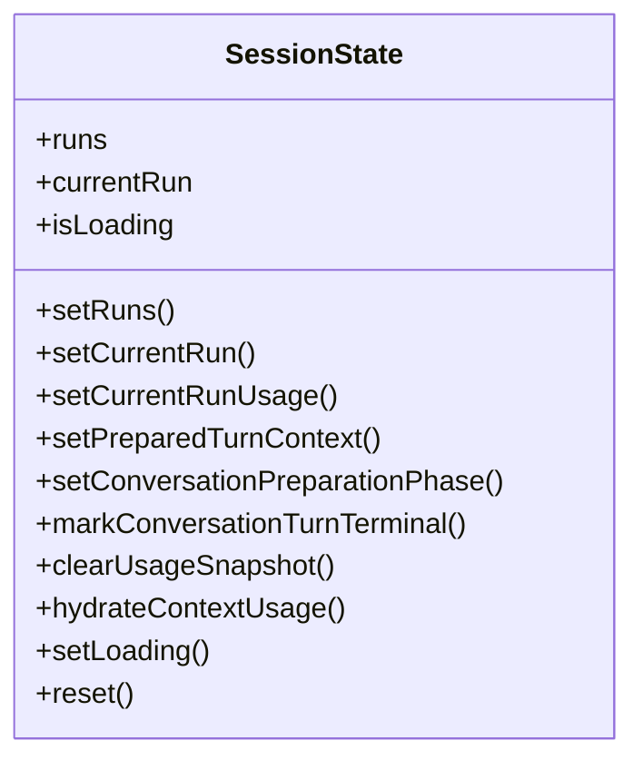
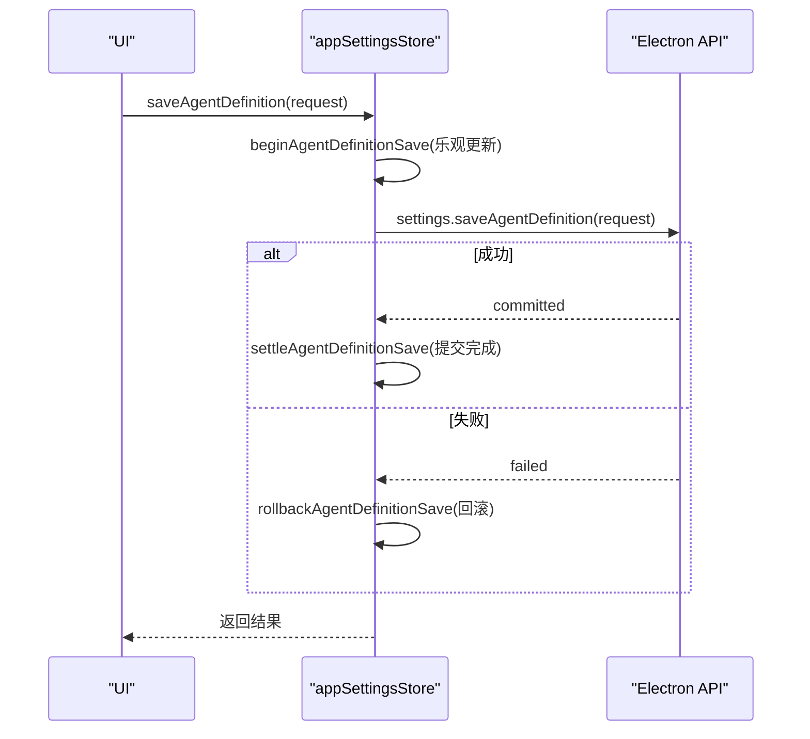
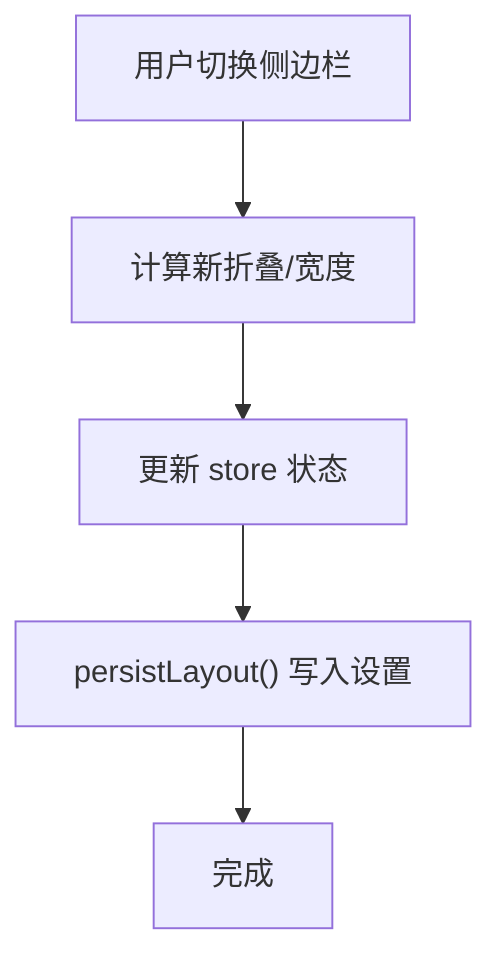
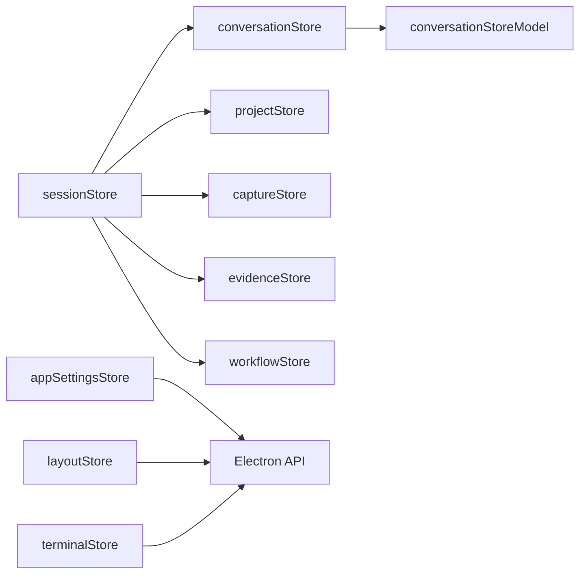
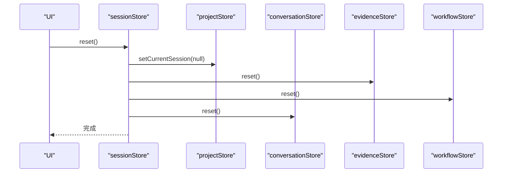
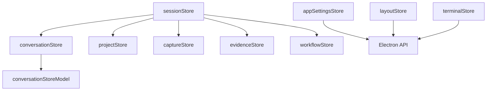

# 状态管理

<cite>
**本文引用的文件**
- [conversationStore.ts](file://src/renderer/stores/conversationStore.ts)
- [conversationStoreModel.ts](file://src/renderer/stores/conversationStoreModel.ts)
- [sessionStore.ts](file://src/renderer/stores/sessionStore.ts)
- [appSettingsStore.ts](file://src/renderer/stores/appSettingsStore.ts)
- [appSettingsStoreState.ts](file://src/renderer/stores/appSettingsStoreState.ts)
- [layoutStore.ts](file://src/renderer/stores/layoutStore.ts)
- [projectStore.ts](file://src/renderer/stores/projectStore.ts)
- [captureStore.ts](file://src/renderer/stores/captureStore.ts)
- [evidenceStore.ts](file://src/renderer/stores/evidenceStore.ts)
- [terminalStore.ts](file://src/renderer/stores/terminalStore.ts)
- [workbenchSelectors.ts](file://src/renderer/stores/selectors/workbenchSelectors.ts)
</cite>

## 目录
1. [简介](#简介)
2. [项目结构](#项目结构)
3. [核心组件](#核心组件)
4. [架构总览](#架构总览)
5. [详细组件分析](#详细组件分析)
6. [依赖关系分析](#依赖关系分析)
7. [性能考虑](#性能考虑)
8. [故障排查指南](#故障排查指南)
9. [结论](#结论)
10. [附录](#附录)

## 简介
本文件聚焦于渲染进程中的 Zustand 状态管理模式，系统梳理各 Store 的职责边界、状态结构设计、更新模式与选择器最佳实践。重点覆盖 conversationStore、sessionStore、appSettingsStore、layoutStore、projectStore 等核心模块，并补充 captureStore、evidenceStore、terminalStore 的协同方式。文档还包含状态持久化机制、跨组件共享方案、调试与性能优化建议，以及状态流转图与 Store 依赖关系图，帮助读者快速理解并高效使用这套状态体系。

## 项目结构
渲染进程的状态集中在 src/renderer/stores 目录下，采用“按领域拆分 Store”的组织方式：
- 会话与对话：conversationStore、sessionStore
- 应用设置与主题：appSettingsStore
- 布局与面板：layoutStore
- 项目与会话上下文：projectStore、captureStore
- 证据与日志：evidenceStore、terminalStore
- 选择器：selectors（如 workbenchSelectors）

图表来源
- [conversationStore.ts:1-139](file://src/renderer/stores/conversationStore.ts#L1-L139)
- [sessionStore.ts:1-69](file://src/renderer/stores/sessionStore.ts#L1-L69)
- [appSettingsStore.ts:1-188](file://src/renderer/stores/appSettingsStore.ts#L1-L188)
- [layoutStore.ts:1-156](file://src/renderer/stores/layoutStore.ts#L1-L156)
- [projectStore.ts:1-98](file://src/renderer/stores/projectStore.ts#L1-L98)
- [captureStore.ts:1-47](file://src/renderer/stores/captureStore.ts#L1-L47)
- [evidenceStore.ts:1-19](file://src/renderer/stores/evidenceStore.ts#L1-L19)
- [terminalStore.ts:1-200](file://src/renderer/stores/terminalStore.ts#L1-L200)
- [workbenchSelectors.ts:1-26](file://src/renderer/stores/selectors/workbenchSelectors.ts#L1-L26)

章节来源
- [conversationStore.ts:1-139](file://src/renderer/stores/conversationStore.ts#L1-L139)
- [sessionStore.ts:1-69](file://src/renderer/stores/sessionStore.ts#L1-L69)
- [appSettingsStore.ts:1-188](file://src/renderer/stores/appSettingsStore.ts#L1-L188)
- [layoutStore.ts:1-156](file://src/renderer/stores/layoutStore.ts#L1-L156)
- [projectStore.ts:1-98](file://src/renderer/stores/projectStore.ts#L1-L98)
- [captureStore.ts:1-47](file://src/renderer/stores/captureStore.ts#L1-L47)
- [evidenceStore.ts:1-19](file://src/renderer/stores/evidenceStore.ts#L1-L19)
- [terminalStore.ts:1-200](file://src/renderer/stores/terminalStore.ts#L1-L200)
- [workbenchSelectors.ts:1-26](file://src/renderer/stores/selectors/workbenchSelectors.ts#L1-L26)

## 核心组件
- conversationStore：维护对话消息集合、分支视图、时间线与推理摘要；提供消息合并、排序、投影与单调停止控制，确保流式更新与终止语义一致。
- sessionStore：聚合会话运行上下文、上下文用量投影与准备阶段；在重置时协调其他 Store 的统一清理。
- appSettingsStore：集中应用设置、主题、语言、字体缩放、Agent 路由与 Provider 定义保存；支持乐观更新、回滚与提交一致性。
- layoutStore：管理左右侧边栏、右侧面板与终端高度；将布局状态持久化到设置中，并提供尺寸约束与展开/收起逻辑。
- projectStore：维护项目、会话列表与当前选中项；对输入变更进行浅比较与增量更新，避免不必要的重渲染。
- captureStore：管理捕获描述符与上下文快照，支持增删改查与打开态切换。
- evidenceStore：记录动作事件序列，用于审计与回放。
- terminalStore：运行时日志查看器，支持多粒度过滤、查询、跟随输出与刷新。
- selectors：从 layoutStore 派生响应式侧边栏状态，供工作区使用。

章节来源
- [conversationStore.ts:1-139](file://src/renderer/stores/conversationStore.ts#L1-L139)
- [conversationStoreModel.ts:1-96](file://src/renderer/stores/conversationStoreModel.ts#L1-L96)
- [sessionStore.ts:1-69](file://src/renderer/stores/sessionStore.ts#L1-L69)
- [appSettingsStore.ts:1-188](file://src/renderer/stores/appSettingsStore.ts#L1-L188)
- [appSettingsStoreState.ts:1-52](file://src/renderer/stores/appSettingsStoreState.ts#L1-L52)
- [layoutStore.ts:1-156](file://src/renderer/stores/layoutStore.ts#L1-L156)
- [projectStore.ts:1-98](file://src/renderer/stores/projectStore.ts#L1-L98)
- [captureStore.ts:1-47](file://src/renderer/stores/captureStore.ts#L1-L47)
- [evidenceStore.ts:1-19](file://src/renderer/stores/evidenceStore.ts#L1-L19)
- [terminalStore.ts:1-200](file://src/renderer/stores/terminalStore.ts#L1-L200)
- [workbenchSelectors.ts:1-26](file://src/renderer/stores/selectors/workbenchSelectors.ts#L1-L26)

## 架构总览
Zustand 在各 Store 中以 create 创建独立状态切片，通过选择器订阅最小数据片段，减少重渲染范围。跨 Store 协作遵循“单一职责 + 显式依赖”原则：sessionStore 作为编排中心，组合 conversationStore、captureStore、evidenceStore、workflowStore 与 projectStore 的能力；appSettingsStore 负责与主进程设置 API 交互；layoutStore 将 UI 布局同步至设置；terminalStore 通过 Electron API 拉取日志。

图表来源
- [sessionStore.ts:35-68](file://src/renderer/stores/sessionStore.ts#L35-L68)
- [appSettingsStore.ts:44-119](file://src/renderer/stores/appSettingsStore.ts#L44-L119)
- [layoutStore.ts:77-155](file://src/renderer/stores/layoutStore.ts#L77-L155)

章节来源
- [sessionStore.ts:35-68](file://src/renderer/stores/sessionStore.ts#L35-L68)
- [appSettingsStore.ts:44-119](file://src/renderer/stores/appSettingsStore.ts#L44-L119)
- [layoutStore.ts:77-155](file://src/renderer/stores/layoutStore.ts#L77-L155)

## 详细组件分析

### conversationStore：对话消息与分支投影
- 状态结构
  - allConversationMessages：全量消息（已排序）
  - conversationMessages：基于 branchState 投影后的可见消息
  - branchState：分支状态，决定显示哪些消息
  - timeline、reasoningSummaries：辅助信息
  - monotonicStoppedTurnIds、monotonicStoppedRequestIds、revokedRequestIds：单调停止与撤销控制
- 更新模式
  - 批量写入：setConversationSnapshot、upsertConversationMessages
  - 增量更新：addConversationMessage、patchAssistantMessageByTurnId、updateAssistantMessageByTurnId
  - 分支切换：setBranchState 会重新投影可见消息
  - 单调停止：markTurnMonotonicallyStopped、markRequestMonotonicallyStopped 阻止后续活跃补丁恢复已停止的 turn/request
- 选择器
  - selectOrderedConversationMessages、selectConversationMessageCount、selectLatestMessageActivityAt
- 关键算法
  - 消息合并与排序：mergeConversationMessages、sortConversationMessages
  - 可见性投影：projectVisibleMessages
  - 单调停止保护：shouldRejectActivePatchForMonotonicStop

图表来源
- [conversationStore.ts:51-68](file://src/renderer/stores/conversationStore.ts#L51-L68)
- [conversationStoreModel.ts:40-57](file://src/renderer/stores/conversationStoreModel.ts#L40-L57)
- [conversationStoreModel.ts:18-24](file://src/renderer/stores/conversationStoreModel.ts#L18-L24)

章节来源
- [conversationStore.ts:1-139](file://src/renderer/stores/conversationStore.ts#L1-L139)
- [conversationStoreModel.ts:1-96](file://src/renderer/stores/conversationStoreModel.ts#L1-L96)

### sessionStore：会话编排与上下文用量
- 状态结构
  - runs、currentRun：运行摘要与当前运行
  - ContextUsageProjectionState：上下文用量投影与准备阶段
  - isLoading：加载态
- 更新模式
  - 设置运行集与当前运行
  - 应用上下文用量：setCurrentRunUsage
  - 标记 Turn 为终态：markConversationTurnTerminal
  - 统一重置：reset 调用多个 Store 的 reset
- 协作
  - 依赖 projectStore、captureStore、evidenceStore、workflowStore

图表来源
- [sessionStore.ts:18-68](file://src/renderer/stores/sessionStore.ts#L18-L68)

章节来源
- [sessionStore.ts:1-69](file://src/renderer/stores/sessionStore.ts#L1-L69)

### appSettingsStore：设置与 Agent/Provider 定义
- 状态结构
  - settings：应用设置树
  - hydrated：是否已水合
  - systemTheme：系统主题
  - agentRouteSyncById：Agent 路由同步状态映射
- 更新模式
  - patchSettings：异步写设置并回填
  - saveAgentDefinition：乐观更新 -> 队列提交 -> 成功提交/失败回滚
  - flushAgentDefinitionSaves：批量刷盘并获取提交快照
  - reloadSettings：重载设置并清空同步状态
  - 外观与行为：setTheme、setLanguage、setFontScale、setReduceMotion、setChromeTheme 等
  - Provider：saveProvider、flushProviderSaves、removeProvider
  - 权限与压缩阈值：setAgentPermissionMode、setCompactionThresholdPercent
- 持久化与一致性
  - 通过 Electron API 读写设置
  - 乐观更新配合回滚策略，保证 UI 即时性与数据一致性

图表来源
- [appSettingsStore.ts:49-114](file://src/renderer/stores/appSettingsStore.ts#L49-L114)

章节来源
- [appSettingsStore.ts:1-188](file://src/renderer/stores/appSettingsStore.ts#L1-L188)
- [appSettingsStoreState.ts:1-52](file://src/renderer/stores/appSettingsStoreState.ts#L1-L52)

### layoutStore：布局与持久化
- 状态结构
  - currentMode、selectedAgentId
  - left/right 侧边栏折叠与宽度、展开宽度
  - terminalHeight
- 更新模式
  - hydrateFromSettings：从设置初始化布局
  - toggleLeftSidebar/toggleRightPanel：切换折叠并持久化
  - setLeftSidebarWidth/setRightPanelWidth/setTerminalHeight：调整尺寸并约束范围
  - persistLayout：将布局写入设置
- 持久化
  - 通过 Electron API 写入 layout 配置，浏览器 QA 环境忽略写入错误以保证可用性

图表来源
- [layoutStore.ts:114-155](file://src/renderer/stores/layoutStore.ts#L114-L155)

章节来源
- [layoutStore.ts:1-156](file://src/renderer/stores/layoutStore.ts#L1-L156)

### projectStore：项目与会话上下文
- 状态结构
  - projects、sessions、currentProject、currentSession
  - rightRailTarget：右侧面板目标
  - projectInputs：当前项目输入列表
- 更新模式
  - setProjects/setSessions/setCurrentProject/setCurrentSession
  - setRightRailTarget：切换右侧面板目标
  - setProjectInputs/updateProjectInputs：增量更新输入列表，使用浅比较避免不必要更新
- 性能优化
  - areProjectInputsEqual：基于关键字段比较，减少重渲染

章节来源
- [projectStore.ts:1-98](file://src/renderer/stores/projectStore.ts#L1-L98)

### captureStore、evidenceStore、terminalStore
- captureStore：管理捕获描述符与上下文快照，支持增删改查与打开态切换。
- evidenceStore：记录动作事件序列，便于审计与回放。
- terminalStore：运行时日志查看器，支持多粒度过滤、查询、跟随输出与刷新；内部根据 scopeFilter 与上下文过滤条目，避免无关日志污染。

章节来源
- [captureStore.ts:1-47](file://src/renderer/stores/captureStore.ts#L1-L47)
- [evidenceStore.ts:1-19](file://src/renderer/stores/evidenceStore.ts#L1-L19)
- [terminalStore.ts:1-200](file://src/renderer/stores/terminalStore.ts#L1-L200)

### 选择器最佳实践：workbenchSelectors
- 从 layoutStore 派生响应式侧边栏状态，仅订阅必要字段，降低重渲染成本。
- 提供 useResponsiveSidebarState 钩子，方便组件消费。

章节来源
- [workbenchSelectors.ts:1-26](file://src/renderer/stores/selectors/workbenchSelectors.ts#L1-L26)

## 依赖关系分析
- conversationStore 依赖 conversationStoreModel 提供的消息合并、排序与可见性投影能力。
- sessionStore 依赖 conversationStore、captureStore、evidenceStore、workflowStore、projectStore，在重置时统一清理。
- appSettingsStore 依赖 Electron API 进行设置读写，并通过 AgentDefinitionMutationCoordinator 与 Provider 定义保存流程协调一致性。
- layoutStore 依赖 Electron API 持久化布局。
- terminalStore 依赖 Electron API 获取运行时日志。

图表来源
- [conversationStore.ts:1-139](file://src/renderer/stores/conversationStore.ts#L1-L139)
- [conversationStoreModel.ts:1-96](file://src/renderer/stores/conversationStoreModel.ts#L1-L96)
- [sessionStore.ts:1-69](file://src/renderer/stores/sessionStore.ts#L1-L69)
- [appSettingsStore.ts:1-188](file://src/renderer/stores/appSettingsStore.ts#L1-L188)
- [layoutStore.ts:1-156](file://src/renderer/stores/layoutStore.ts#L1-L156)
- [terminalStore.ts:1-200](file://src/renderer/stores/terminalStore.ts#L1-L200)

章节来源
- [conversationStore.ts:1-139](file://src/renderer/stores/conversationStore.ts#L1-L139)
- [conversationStoreModel.ts:1-96](file://src/renderer/stores/conversationStoreModel.ts#L1-L96)
- [sessionStore.ts:1-69](file://src/renderer/stores/sessionStore.ts#L1-L69)
- [appSettingsStore.ts:1-188](file://src/renderer/stores/appSettingsStore.ts#L1-L188)
- [layoutStore.ts:1-156](file://src/renderer/stores/layoutStore.ts#L1-L156)
- [terminalStore.ts:1-200](file://src/renderer/stores/terminalStore.ts#L1-L200)

## 性能考虑
- 选择器订阅最小切片：使用 Zustand 的选择器订阅具体字段，避免整棵状态树变化导致的重渲染。例如 workbenchSelectors 仅订阅布局相关字段。
- 消息合并与排序：conversationStore 在写入边界进行排序与投影，减少 UI 层计算负担。
- 浅比较与增量更新：projectStore 对输入列表使用浅比较，仅在必要时更新项目列表与当前项目。
- 单调停止语义：conversationStore 通过单调停止防止活跃补丁恢复已停止的 turn/request，避免无效更新。
- 异步请求去抖与竞态处理：terminalStore 在刷新前记录请求上下文，完成后校验是否为当前请求，避免过时结果覆盖。
- 布局持久化容错：layoutStore 在浏览器 QA 环境中忽略写入错误，保证内存态可用。

[本节为通用指导，不直接分析具体文件]

## 故障排查指南
- 设置保存失败回滚
  - 现象：Agent 定义或 Provider 设置保存失败后 UI 未回滚。
  - 排查：检查 appSettingsStore 的 saveAgentDefinition/saveProvider 是否执行了 rollbackAgentDefinitionSave/rollbackProviderDefinitionSave。
  - 参考路径：[appSettingsStore.ts:65-110](file://src/renderer/stores/appSettingsStore.ts#L65-L110)、[appSettingsStore.ts:125-148](file://src/renderer/stores/appSettingsStore.ts#L125-L148)
- 布局持久化异常
  - 现象：侧边栏/面板尺寸未保存。
  - 排查：确认 persistLayout 是否正确调用 Electron API；浏览器环境下允许忽略错误。
  - 参考路径：[layoutStore.ts:42-75](file://src/renderer/stores/layoutStore.ts#L42-L75)、[layoutStore.ts:151-155](file://src/renderer/stores/layoutStore.ts#L151-L155)
- 日志刷新竞态
  - 现象：切换会话/项目后仍显示旧日志。
  - 排查：检查 refreshEntries 是否校验 requestIsCurrent，避免过时结果覆盖。
  - 参考路径：[terminalStore.ts:150-198](file://src/renderer/stores/terminalStore.ts#L150-L198)
- 对话消息重复或顺序错误
  - 现象：消息列表出现重复或顺序不正确。
  - 排查：确认 mergeConversationMessages 与 sortConversationMessages 的使用位置与参数。
  - 参考路径：[conversationStoreModel.ts:40-57](file://src/renderer/stores/conversationStoreModel.ts#L40-L57)、[conversationStoreModel.ts:18-24](file://src/renderer/stores/conversationStoreModel.ts#L18-L24)

章节来源
- [appSettingsStore.ts:65-110](file://src/renderer/stores/appSettingsStore.ts#L65-L110)
- [appSettingsStore.ts:125-148](file://src/renderer/stores/appSettingsStore.ts#L125-L148)
- [layoutStore.ts:42-75](file://src/renderer/stores/layoutStore.ts#L42-L75)
- [layoutStore.ts:151-155](file://src/renderer/stores/layoutStore.ts#L151-L155)
- [terminalStore.ts:150-198](file://src/renderer/stores/terminalStore.ts#L150-L198)
- [conversationStoreModel.ts:40-57](file://src/renderer/stores/conversationStoreModel.ts#L40-L57)
- [conversationStoreModel.ts:18-24](file://src/renderer/stores/conversationStoreModel.ts#L18-L24)

## 结论
本项目采用 Zustand 构建清晰、可维护的前端状态体系。各 Store 职责明确、更新模式规范，结合选择器实现细粒度订阅与高性能渲染。通过乐观更新与回滚策略保障设置类操作的可靠性；通过单调停止与消息合并保障对话更新的正确性；通过布局持久化提升用户体验。建议在新增功能时遵循现有模式：拆分领域 Store、使用选择器订阅最小切片、在写入边界进行排序与投影、对异步操作进行竞态与回滚处理。

[本节为总结性内容，不直接分析具体文件]

## 附录
- 状态流转图（会话重置）

图表来源
- [sessionStore.ts:54-67](file://src/renderer/stores/sessionStore.ts#L54-L67)

- Store 依赖关系图

图表来源
- [conversationStore.ts:1-139](file://src/renderer/stores/conversationStore.ts#L1-L139)
- [conversationStoreModel.ts:1-96](file://src/renderer/stores/conversationStoreModel.ts#L1-L96)
- [sessionStore.ts:1-69](file://src/renderer/stores/sessionStore.ts#L1-L69)
- [appSettingsStore.ts:1-188](file://src/renderer/stores/appSettingsStore.ts#L1-L188)
- [layoutStore.ts:1-156](file://src/renderer/stores/layoutStore.ts#L1-L156)
- [terminalStore.ts:1-200](file://src/renderer/stores/terminalStore.ts#L1-L200)