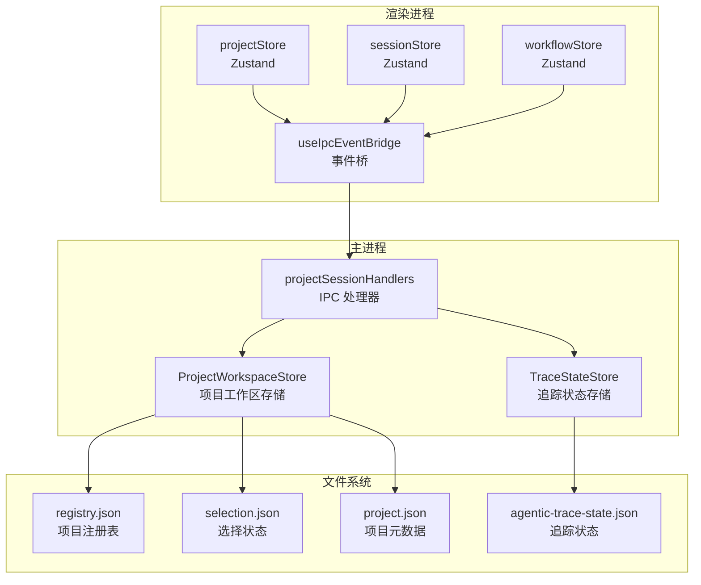
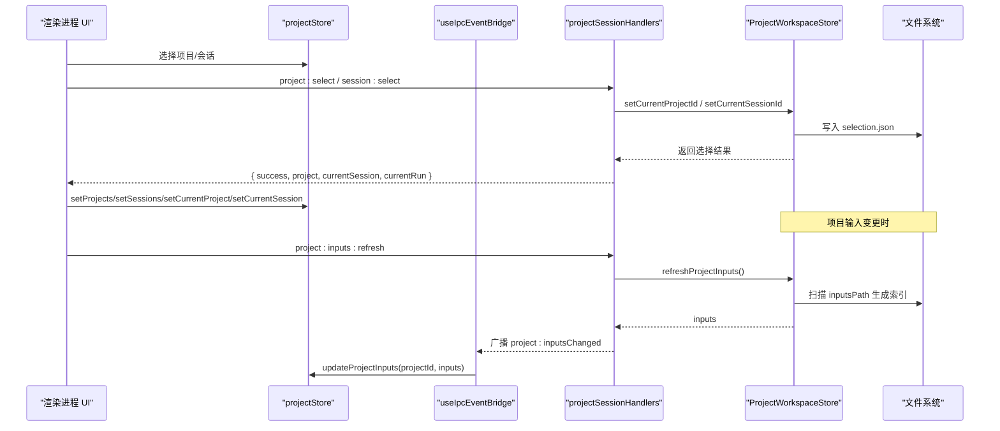
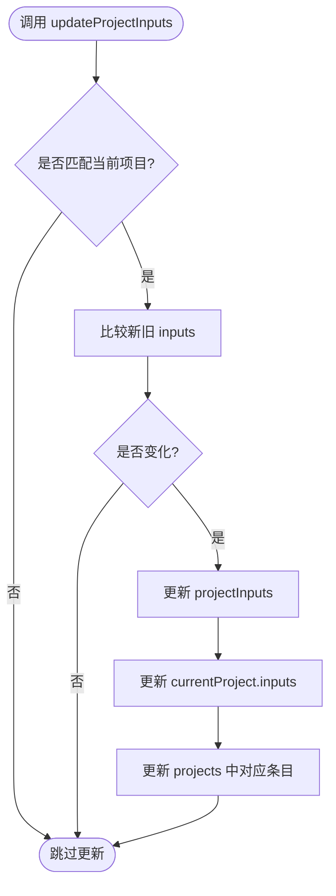
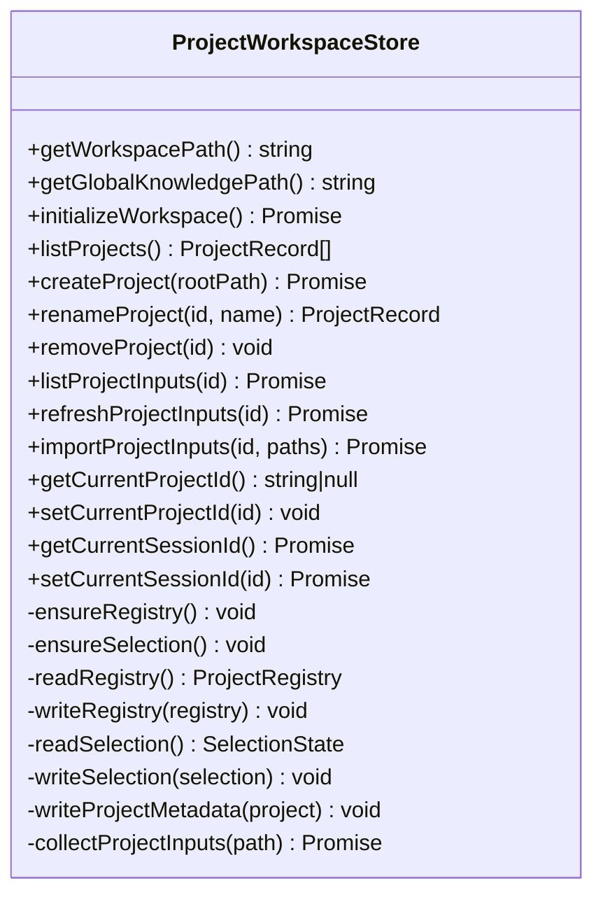
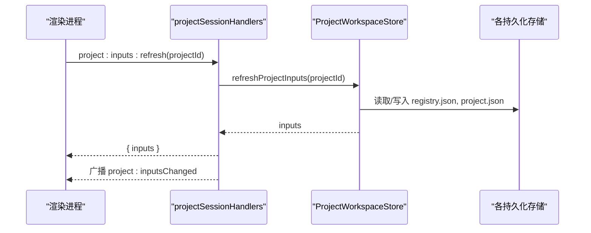
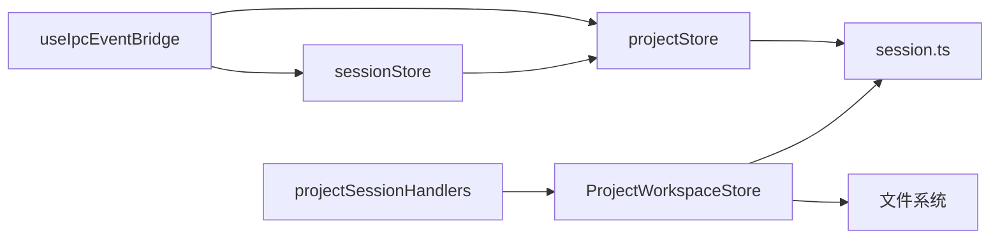

# 项目状态管理

<cite>
**本文引用的文件**
- [projectStore.ts](file://src/renderer/stores/projectStore.ts)
- [ProjectWorkspaceStore.ts](file://src/main/sessions/ProjectWorkspaceStore.ts)
- [projectSessionHandlers.ts](file://src/main/ipc/projectSessionHandlers.ts)
- [session.ts](file://src/shared/types/session.ts)
- [useIpcEventBridge.ts](file://src/renderer/app/bootstrap/useIpcEventBridge.ts)
- [sessionStore.ts](file://src/renderer/stores/sessionStore.ts)
- [TraceStateStore.ts](file://src/main/workflow/debugger/TraceStateStore.ts)
</cite>

## 目录
1. [简介](#简介)
2. [项目结构](#项目结构)
3. [核心组件](#核心组件)
4. [架构总览](#架构总览)
5. [详细组件分析](#详细组件分析)
6. [依赖关系分析](#依赖关系分析)
7. [性能考量](#性能考量)
8. [故障排查指南](#故障排查指南)
9. [结论](#结论)
10. [附录](#附录)

## 简介
本文件聚焦于“项目状态管理”，围绕前端 projectStore 与后端 ProjectWorkspaceStore 的协作，系统阐述项目上下文管理机制：包括项目元数据、文件索引（输入资源）、工作区配置、会话选择与切换流程、异步加载与进度、错误处理、以及文件系统双向同步策略。同时给出大项目扫描的性能优化方案与扩展点示例，帮助开发者在现有架构上安全地扩展项目状态能力。

## 项目结构
项目状态由前后端共同维护：
- 前端使用 Zustand store 维护当前项目、会话、右侧面板目标、项目输入列表等视图态；
- 后端通过 ProjectWorkspaceStore 持久化项目注册表、选择状态、项目元数据与输入索引；
- IPC 层暴露项目与会话操作接口，桥接 UI 与存储；
- 共享类型定义统一了项目、会话、运行、上下文快照等数据结构。

图表来源
- [projectStore.ts:1-98](file://src/renderer/stores/projectStore.ts#L1-L98)
- [ProjectWorkspaceStore.ts:1-510](file://src/main/sessions/ProjectWorkspaceStore.ts#L1-L510)
- [projectSessionHandlers.ts:1-403](file://src/main/ipc/projectSessionHandlers.ts#L1-L403)
- [TraceStateStore.ts:1-93](file://src/main/workflow/debugger/TraceStateStore.ts#L1-L93)
- [useIpcEventBridge.ts:95-125](file://src/renderer/app/bootstrap/useIpcEventBridge.ts#L95-L125)

章节来源
- [projectStore.ts:1-98](file://src/renderer/stores/projectStore.ts#L1-L98)
- [ProjectWorkspaceStore.ts:1-510](file://src/main/sessions/ProjectWorkspaceStore.ts#L1-L510)
- [projectSessionHandlers.ts:1-403](file://src/main/ipc/projectSessionHandlers.ts#L1-L403)
- [TraceStateStore.ts:1-93](file://src/main/workflow/debugger/TraceStateStore.ts#L1-L93)
- [useIpcEventBridge.ts:95-125](file://src/renderer/app/bootstrap/useIpcEventBridge.ts#L95-L125)

## 核心组件
- 前端项目状态 store（projectStore）
  - 职责：维护 projects、sessions、currentProject、currentSession、rightRailTarget、projectInputs；提供增量更新 inputs 的能力，避免不必要的重渲染。
  - 关键设计：基于 id/path/mtime/size 的浅比较函数，仅在内容变化时更新 currentProject 与全局 projectInputs。
- 后端项目工作区存储（ProjectWorkspaceStore）
  - 职责：初始化工作区、创建/重命名/删除项目、列出项目、刷新/导入项目输入、读写选择状态、写入项目元数据、收集 .rdc 输入索引。
  - 关键设计：原子写 JSON、目录级锁保护注册表、规范化路径、预算限制与 yield 防止卡顿。
- IPC 处理器（projectSessionHandlers）
  - 职责：暴露 project:* 与 session:* 等 RPC，封装错误返回，协调选择变更、会话生命周期、输入刷新广播。
- 共享类型（session.ts）
  - 职责：统一定义 ProjectRecord、ProjectInputRecord、SessionRecord、RunSummary、ContextSnapshot 等，确保前后端契约一致。
- 事件桥（useIpcEventBridge）
  - 职责：订阅主进程事件，按会话范围投影到对应 store，触发捕获快照同步、trace 展示更新等。
- 会话 store（sessionStore）
  - 职责：维护 runs、currentRun、上下文用量投影；reset 时联动 projectStore 清理当前会话与右侧面板目标。
- 追踪状态存储（TraceStateStore）
  - 职责：按会话维度持久化计划、分支、用户请求等追踪状态，供调试器与右侧面板消费。

章节来源
- [projectStore.ts:1-98](file://src/renderer/stores/projectStore.ts#L1-L98)
- [ProjectWorkspaceStore.ts:1-510](file://src/main/sessions/ProjectWorkspaceStore.ts#L1-L510)
- [projectSessionHandlers.ts:1-403](file://src/main/ipc/projectSessionHandlers.ts#L1-L403)
- [session.ts:1-444](file://src/shared/types/session.ts#L1-L444)
- [useIpcEventBridge.ts:95-125](file://src/renderer/app/bootstrap/useIpcEventBridge.ts#L95-L125)
- [sessionStore.ts:1-68](file://src/renderer/stores/sessionStore.ts#L1-L68)
- [TraceStateStore.ts:1-93](file://src/main/workflow/debugger/TraceStateStore.ts#L1-L93)

## 架构总览
项目状态的生命周期从 UI 发起 IPC 开始，经主进程处理器路由到存储层，完成持久化与索引后，再广播事件回渲染进程，驱动 store 更新与界面刷新。

图表来源
- [projectSessionHandlers.ts:69-181](file://src/main/ipc/projectSessionHandlers.ts#L69-L181)
- [ProjectWorkspaceStore.ts:127-171](file://src/main/sessions/ProjectWorkspaceStore.ts#L127-L171)
- [useIpcEventBridge.ts:112-125](file://src/renderer/app/bootstrap/useIpcEventBridge.ts#L112-L125)
- [projectStore.ts:56-96](file://src/renderer/stores/projectStore.ts#L56-L96)

## 详细组件分析

### 前端项目状态 store（projectStore）
- 数据模型
  - projects: 项目列表
  - sessions: 会话列表
  - currentProject/currentSession: 当前选中项
  - rightRailTarget: 右侧面板目标（project 或 session）
  - projectInputs: 当前项目的输入资源索引
- 更新策略
  - setProjectInputs：仅当当前项目匹配且内容发生变化时更新；同时更新 currentProject 与 projects 中的 inputs 与 inputsUpdatedAt。
  - 使用 areProjectInputsEqual 进行轻量比较，减少不必要重渲染。
- 扩展点
  - 可在此处增加对输入分组、过滤、排序的本地缓存；
  - 可在 updateProjectInputs 中接入自定义统计或审计日志。

图表来源
- [projectStore.ts:10-23](file://src/renderer/stores/projectStore.ts#L10-L23)
- [projectStore.ts:56-96](file://src/renderer/stores/projectStore.ts#L56-L96)

章节来源
- [projectStore.ts:1-98](file://src/renderer/stores/projectStore.ts#L1-L98)

### 后端项目工作区存储（ProjectWorkspaceStore）
- 工作区初始化
  - 确保应用状态根、项目根、全局知识目录存在；恢复对话轮次提交。
- 项目注册表与选择状态
  - registry.json：项目清单，带 schemaVersion、projects 数组；
  - selection.json：当前选择的 projectId 与 sessionId；
  - 所有写操作使用原子写入，读/写注册表使用目录级锁保护。
- 项目生命周期
  - createProject：校验根目录、建立资源布局、收集输入、写入注册表与元数据、设置当前项目；
  - renameProject/removeProject：更新元数据与选择状态；
  - touchProject：更新时间戳与 lastSessionId。
- 项目输入索引
  - collectProjectInputs：深度优先遍历 inputsPath，仅收录 .rdc 文件；
  - 预算控制：最大深度 8、最大条目数 2000、每 64 项让出一次事件循环；
  - 导入输入：复制 .rdc 文件并刷新索引；
  - 规范化路径：解析真实路径，补齐 resource/knowledge/inputs 路径。
- 元数据持久化
  - writeProjectMetadata：写入 project.json 与项目级 metadata.yaml。

图表来源
- [ProjectWorkspaceStore.ts:12-510](file://src/main/sessions/ProjectWorkspaceStore.ts#L12-L510)

章节来源
- [ProjectWorkspaceStore.ts:1-510](file://src/main/sessions/ProjectWorkspaceStore.ts#L1-L510)

### IPC 处理器（projectSessionHandlers）
- 项目相关
  - project:list：返回项目列表；
  - project:add：创建项目并自动选择；
  - project:select：选择项目，返回项目、当前会话与最新运行；
  - project:rename/remove：重命名或删除项目；
  - project:inputs:list/refresh/import/importPaths：列举/刷新/导入输入，成功后广播 project:inputsChanged。
- 会话相关
  - session:list/create/rename/remove/select：会话 CRUD 与选择；
  - session:setModelOverride/setAgentId：设置模型覆盖与代理；
  - run:list：列出运行记录。
- 错误处理
  - 所有处理器统一 try/catch，返回 { success, error? } 格式，便于前端提示。

图表来源
- [projectSessionHandlers.ts:146-199](file://src/main/ipc/projectSessionHandlers.ts#L146-L199)
- [ProjectWorkspaceStore.ts:133-171](file://src/main/sessions/ProjectWorkspaceStore.ts#L133-L171)

章节来源
- [projectSessionHandlers.ts:1-403](file://src/main/ipc/projectSessionHandlers.ts#L1-L403)

### 共享类型（session.ts）
- 项目与输入
  - ProjectRecord：包含 projectId、name、rootPath、slug、resourcePath、knowledgePath、inputsPath、inputs、时间戳、lastSessionId；
  - ProjectInputRecord：inputId、fileName、filePath、source、discoveredAt、lastModifiedAt、size。
- 会话与运行
  - SessionRecord：sessionId、projectId、title、goal、sessionPath、时间戳、lastRunId、modelOverride、agentId；
  - RunSummary/RunRecordBase：runId、status、captures、startedAt、finishedAt 等。
- 上下文与捕获
  - ContextSnapshot、OpenedCaptureState、OpenProjectInputRequest 等用于运行时上下文与捕获预览。

章节来源
- [session.ts:1-444](file://src/shared/types/session.ts#L1-L444)

### 事件桥与状态同步（useIpcEventBridge、sessionStore）
- useIpcEventBridge
  - 订阅上下文变更、追踪投影变更等事件，按会话范围投影到 captureStore、workflowStore 等；
  - 将项目级上下文快照同步到捕获预览。
- sessionStore.reset
  - 重置时会清空 projectStore 的 currentSession 与 rightRailTarget，并重置其他相关 store，保证状态一致性。

章节来源
- [useIpcEventBridge.ts:95-125](file://src/renderer/app/bootstrap/useIpcEventBridge.ts#L95-L125)
- [sessionStore.ts:35-68](file://src/renderer/stores/sessionStore.ts#L35-L68)

### 追踪状态存储（TraceStateStore）
- 按会话维度持久化 agentic-trace 状态，包含 activeBranchId、userRequests、branches、plans 等；
- read/write 支持默认状态合并与异常降级，保障崩溃恢复。

章节来源
- [TraceStateStore.ts:1-93](file://src/main/workflow/debugger/TraceStateStore.ts#L1-L93)

## 依赖关系分析
- 前端依赖
  - projectStore 依赖 shared types 定义的数据结构；
  - useIpcEventBridge 依赖 electronAPI 事件与多个 store；
  - sessionStore 依赖 contextUsageProjectionModel 与 projectStore。
- 后端依赖
  - projectSessionHandlers 依赖 storageAdapter、conversationService、settingsService 等；
  - ProjectWorkspaceStore 依赖 appPathService、storageHost、directoryFileLock、shared utils。
- 外部耦合
  - 文件系统：registry.json、selection.json、project.json、agentic-trace-state.json；
  - Electron IPC：主/渲染进程通信通道。

图表来源
- [projectStore.ts:1-98](file://src/renderer/stores/projectStore.ts#L1-L98)
- [useIpcEventBridge.ts:95-125](file://src/renderer/app/bootstrap/useIpcEventBridge.ts#L95-L125)
- [sessionStore.ts:1-68](file://src/renderer/stores/sessionStore.ts#L1-L68)
- [projectSessionHandlers.ts:1-403](file://src/main/ipc/projectSessionHandlers.ts#L1-L403)
- [ProjectWorkspaceStore.ts:1-510](file://src/main/sessions/ProjectWorkspaceStore.ts#L1-L510)
- [session.ts:1-444](file://src/shared/types/session.ts#L1-L444)

章节来源
- [projectStore.ts:1-98](file://src/renderer/stores/projectStore.ts#L1-L98)
- [useIpcEventBridge.ts:95-125](file://src/renderer/app/bootstrap/useIpcEventBridge.ts#L95-L125)
- [sessionStore.ts:1-68](file://src/renderer/stores/sessionStore.ts#L1-L68)
- [projectSessionHandlers.ts:1-403](file://src/main/ipc/projectSessionHandlers.ts#L1-L403)
- [ProjectWorkspaceStore.ts:1-510](file://src/main/sessions/ProjectWorkspaceStore.ts#L1-L510)
- [session.ts:1-444](file://src/shared/types/session.ts#L1-L444)

## 性能考量
- 大项目输入扫描优化
  - 预算限制：最大深度 8、最大条目数 2000，超出即抛出明确错误，避免无限递归与内存暴涨；
  - 分片让出：每处理 64 个条目调用 setImmediate 让出事件循环，保持 UI 响应；
  - 增量刷新：仅对 inputsPath 下 .rdc 文件进行 stat 与索引，避免全量扫描无关文件。
- 并发与一致性
  - 注册表读写使用目录级锁，避免多进程/多线程竞争导致损坏；
  - 所有 JSON 写操作采用原子写入，降低部分写入风险。
- 前端渲染优化
  - 使用浅比较函数判断 inputs 是否变化，减少不必要的 re-render；
  - 仅在 currentProject 匹配时更新 projectInputs，避免跨项目污染。

[本节为通用性能建议，不直接分析具体文件]

## 故障排查指南
- 常见错误定位
  - 项目不存在：project:select/project:rename/project:remove 等接口返回 success:false 与错误信息；
  - 输入导入失败：project:inputs:importPaths 返回错误消息；
  - 会话删除失败：检查会话是否存在、是否有活跃运行被中止；
  - 选择状态不一致：检查 selection.json 与 registry.json 是否被正确写入。
- 诊断步骤
  - 查看 IPC 返回值中的 error 字段；
  - 检查工作区目录是否存在 registry.json、selection.json、project.json；
  - 确认 ProjectWorkspaceStore 的预算限制是否触发（PROJECT_INPUTS_BUDGET_EXCEEDED）；
  - 若出现卡死，检查 collectProjectInputs 是否因目录过深或文件过多导致长时间占用事件循环。
- 恢复策略
  - 重新初始化工作区：确保目录存在并重建选择状态；
  - 清理损坏的 JSON：删除后重启应用以重建；
  - 中断异常运行：在会话删除时主动停止运行并标记为 cancelled/interrupted。

章节来源
- [projectSessionHandlers.ts:74-144](file://src/main/ipc/projectSessionHandlers.ts#L74-L144)
- [ProjectWorkspaceStore.ts:44-82](file://src/main/sessions/ProjectWorkspaceStore.ts#L44-L82)
- [ProjectWorkspaceStore.ts:444-490](file://src/main/sessions/ProjectWorkspaceStore.ts#L444-L490)

## 结论
本项目状态管理通过清晰的前后端分层与 IPC 协议，实现了项目与工作区的稳定管理。前端 store 负责视图态与增量更新，后端存储负责持久化、索引与一致性保障。通过预算限制、原子写入与目录锁，系统在大型项目场景下具备较好的鲁棒性与性能。未来可扩展输入分组、缓存策略、审计日志与更多自定义处理钩子。

[本节为总结性内容，不直接分析具体文件]

## 附录

### 项目状态数据模型概览
- ProjectRecord：项目元数据与路径、输入索引、时间戳；
- ProjectInputRecord：单个输入资源的标识、路径、大小与时间；
- SessionRecord：会话标识、归属项目、标题、目标、模型覆盖与代理；
- RunSummary：运行摘要，包含状态、捕获、时间等；
- ContextSnapshot：运行时上下文快照，含设备、捕获描述、预览等。

章节来源
- [session.ts:12-57](file://src/shared/types/session.ts#L12-L57)
- [session.ts:151-194](file://src/shared/types/session.ts#L151-L194)
- [session.ts:363-376](file://src/shared/types/session.ts#L363-L376)

### 项目加载与切换流程（含异步、进度、错误）
- 加载项目列表：project:list -> storageAdapter.listProjects -> 返回 projects；
- 选择项目：project:select -> setCurrentProjectId -> 写入 selection.json -> 返回项目与会话；
- 选择会话：session:select -> setCurrentSessionId -> 恢复最近运行 -> 返回会话与运行；
- 错误处理：所有 IPC 处理器统一捕获异常并返回结构化错误；
- 进度反馈：前端可通过 isLoading/busy 状态与右侧进度列表展示任务状态。

章节来源
- [projectSessionHandlers.ts:69-109](file://src/main/ipc/projectSessionHandlers.ts#L69-L109)
- [projectSessionHandlers.ts:309-333](file://src/main/ipc/projectSessionHandlers.ts#L309-L333)
- [ProjectWorkspaceStore.ts:177-205](file://src/main/sessions/ProjectWorkspaceStore.ts#L177-L205)

### 文件系统双向同步策略
- 写路径：UI 操作 -> IPC -> ProjectWorkspaceStore -> 原子写入 JSON/YAML -> 刷新索引；
- 读路径：ProjectWorkspaceStore 读取 registry/selection -> 规范化路径 -> 返回给 IPC -> 前端 store 更新；
- 事件驱动：输入变更通过 project:inputsChanged 广播，前端根据 projectId 精准更新。

章节来源
- [ProjectWorkspaceStore.ts:216-331](file://src/main/sessions/ProjectWorkspaceStore.ts#L216-L331)
- [projectSessionHandlers.ts:146-199](file://src/main/ipc/projectSessionHandlers.ts#L146-L199)
- [useIpcEventBridge.ts:112-125](file://src/renderer/app/bootstrap/useIpcEventBridge.ts#L112-L125)

### 扩展与自定义处理示例
- 扩展项目输入索引
  - 在 collectProjectInputs 中增加新的文件类型过滤与元数据提取；
  - 在 updateProjectInputs 中增加自定义统计或缓存键生成。
- 扩展项目元数据
  - 在 writeProjectMetadata 中追加自定义字段到 project.json 或 metadata.yaml；
  - 在 normalizeProjectRecord 中兼容历史字段迁移。
- 扩展 IPC 接口
  - 新增 project:customAction 处理器，封装业务逻辑并广播事件；
  - 在 projectSessionHandlers 中统一错误返回与参数校验。

章节来源
- [ProjectWorkspaceStore.ts:444-490](file://src/main/sessions/ProjectWorkspaceStore.ts#L444-L490)
- [ProjectWorkspaceStore.ts:322-331](file://src/main/sessions/ProjectWorkspaceStore.ts#L322-L331)
- [projectSessionHandlers.ts:1-403](file://src/main/ipc/projectSessionHandlers.ts#L1-L403)