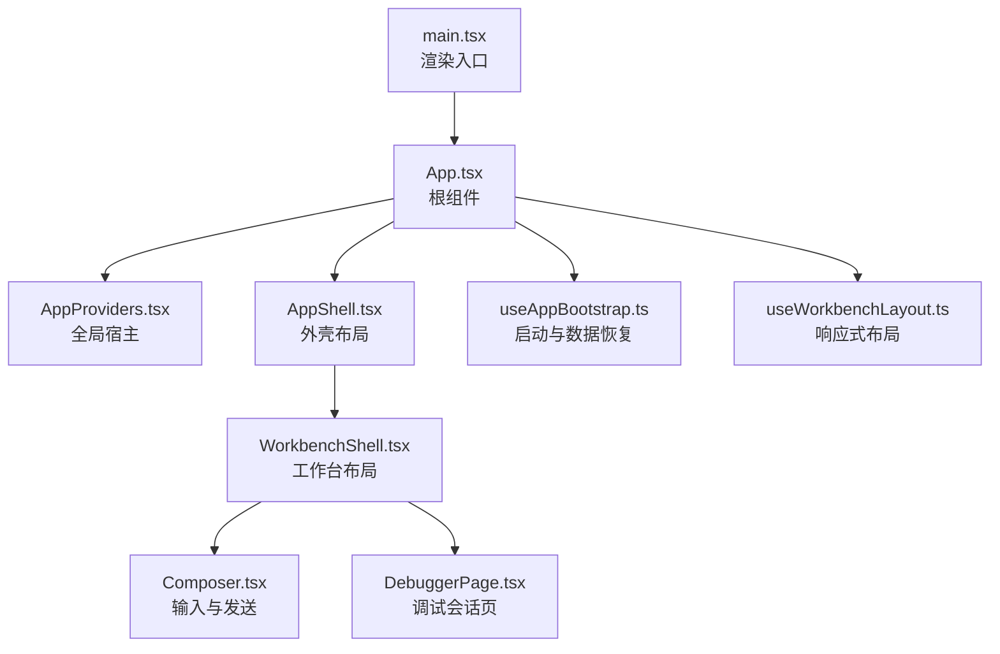
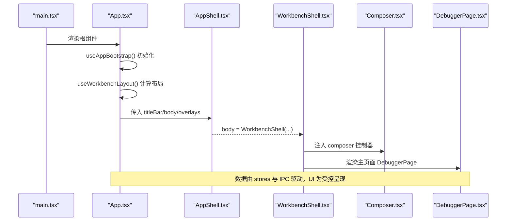
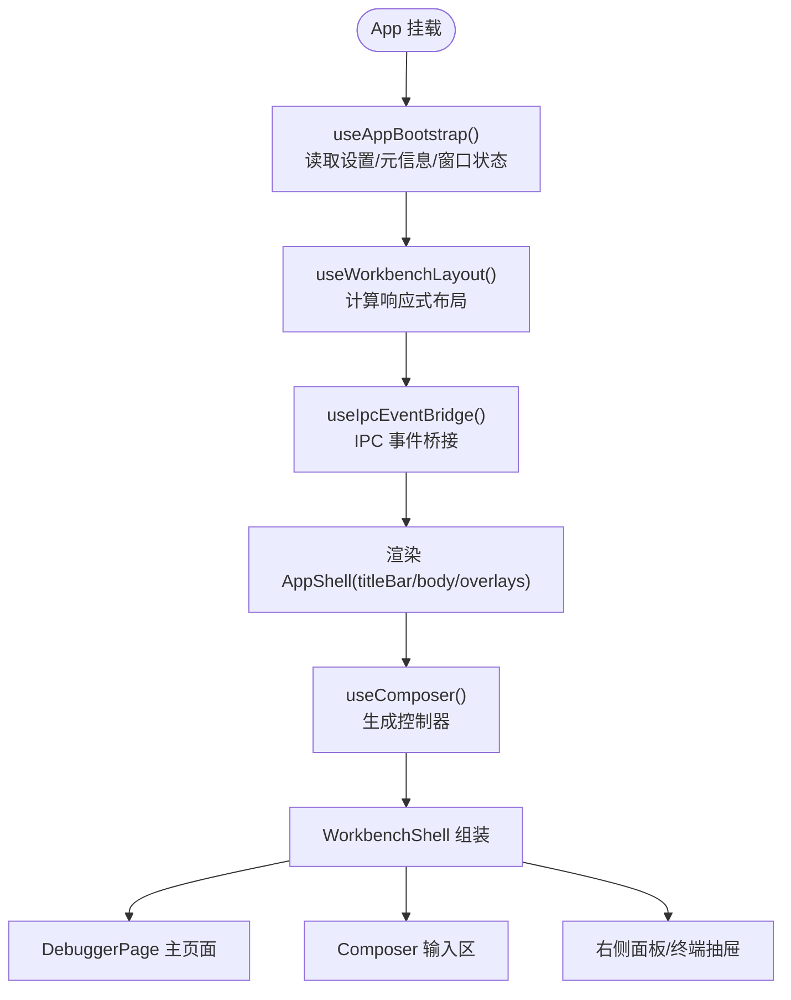
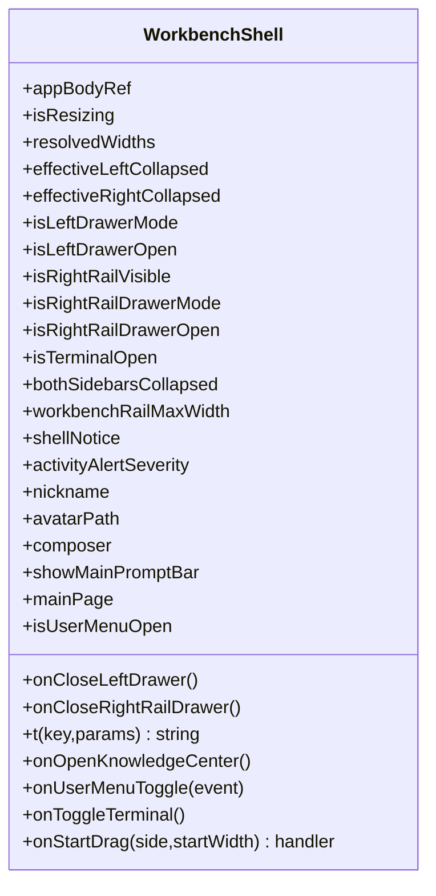
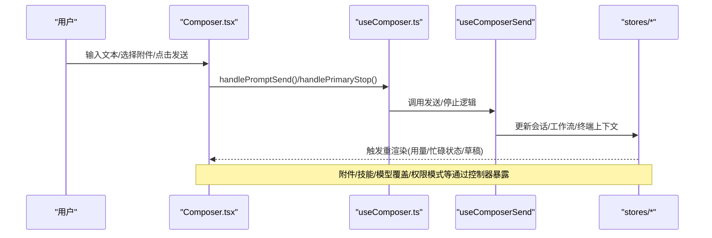
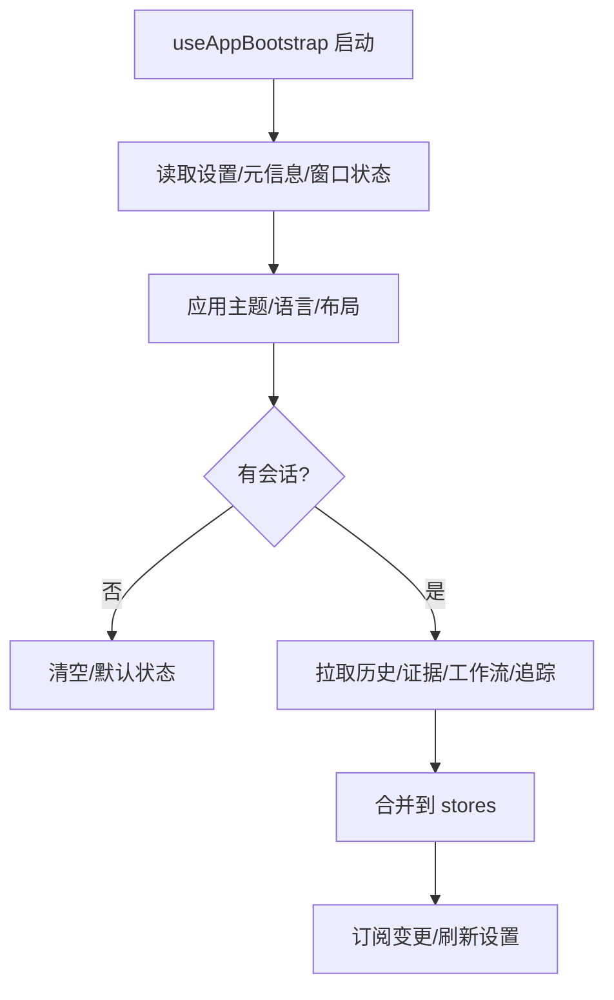
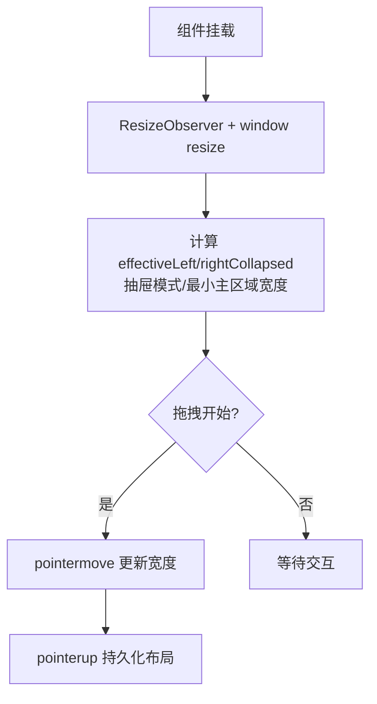
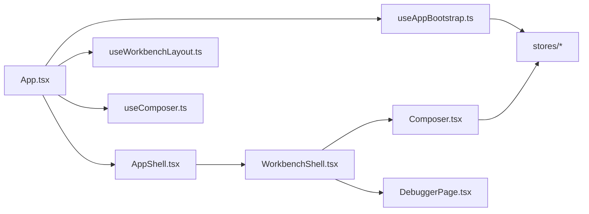
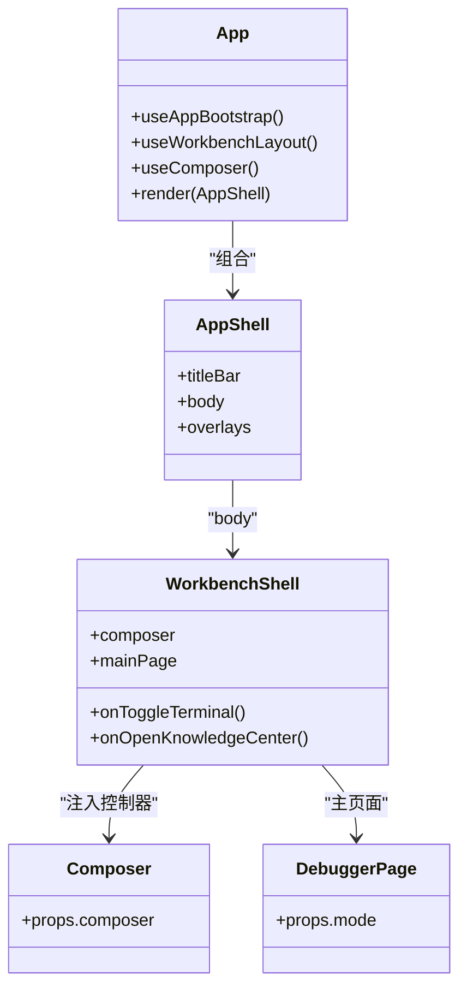

# 组件架构

<cite>
**本文引用的文件**
- [main.tsx](file://src/renderer/main.tsx)
- [App.tsx](file://src/renderer/app/App.tsx)
- [AppProviders.tsx](file://src/renderer/app/AppProviders.tsx)
- [AppShell.tsx](file://src/renderer/shell/AppShell.tsx)
- [WorkbenchShell.tsx](file://src/renderer/app/WorkbenchShell.tsx)
- [useWorkbenchLayout.ts](file://src/renderer/app/useWorkbenchLayout.ts)
- [Composer.tsx](file://src/renderer/features/composer/Composer.tsx)
- [useComposer.ts](file://src/renderer/features/composer/useComposer.ts)
- [DebuggerPage.tsx](file://src/renderer/features/transcript/DebuggerPage.tsx)
- [useAppBootstrap.ts](file://src/renderer/app/bootstrap/useAppBootstrap.ts)
</cite>

## 目录
1. [简介](#简介)
2. [项目结构](#项目结构)
3. [核心组件](#核心组件)
4. [架构总览](#架构总览)
5. [详细组件分析](#详细组件分析)
6. [依赖关系分析](#依赖关系分析)
7. [性能考量](#性能考量)
8. [故障排查指南](#故障排查指南)
9. [结论](#结论)
10. [附录](#附录)

## 简介
本文件聚焦于渲染端 React 组件架构，系统性解析根组件 App、外壳组件 AppShell、工作台组件 WorkbenchShell 的职责与层次关系；并深入说明 Composer、DebuggerPage、SettingsModal 等关键功能模块的组件树结构与数据流向。文档同时覆盖组件间通信模式、Props 传递机制、事件处理流程、生命周期管理、状态提升策略与性能优化技巧，并提供多类可视化图表帮助理解。

## 项目结构
渲染入口位于 main.tsx，负责安装平台桥接与性能探针，并挂载根组件 App。App 作为应用根，负责初始化、主题、布局、IPC 事件桥接以及全局模态与通知。AppShell 是纯布局外壳，仅负责标题栏、主体与覆盖层的组合。WorkbenchShell 组织左右侧边栏、主工作区、右侧面板与终端抽屉，并将 Composer 与主页面（DebuggerPage）装配到工作区中。

图示来源
- [main.tsx:1-16](file://src/renderer/main.tsx#L1-L16)
- [App.tsx:1-252](file://src/renderer/app/App.tsx#L1-L252)
- [AppShell.tsx:1-21](file://src/renderer/shell/AppShell.tsx#L1-L21)
- [WorkbenchShell.tsx:1-239](file://src/renderer/app/WorkbenchShell.tsx#L1-L239)
- [useAppBootstrap.ts:1-281](file://src/renderer/app/bootstrap/useAppBootstrap.ts#L1-L281)
- [useWorkbenchLayout.ts:1-211](file://src/renderer/app/useWorkbenchLayout.ts#L1-L211)

章节来源
- [main.tsx:1-16](file://src/renderer/main.tsx#L1-L16)
- [App.tsx:1-252](file://src/renderer/app/App.tsx#L1-L252)
- [AppShell.tsx:1-21](file://src/renderer/shell/AppShell.tsx#L1-L21)
- [WorkbenchShell.tsx:1-239](file://src/renderer/app/WorkbenchShell.tsx#L1-L239)

## 核心组件
- App：应用根，负责启动引导、主题与语言、窗口控制、布局计算、IPC 事件桥接、全局模态（设置、知识中心、命令面板）、通知与用户菜单。通过 useComposer 生成控制器对象，向下传递给 WorkbenchShell 中的 Composer。
- AppShell：无状态外壳，接收 titleBar、body、overlays 三个插槽进行布局拼装。
- WorkbenchShell：工作台容器，组织左侧导航、主内容区、右侧面板与终端抽屉，提供拖拽调整宽度、抽屉模式切换、提示条与活动告警展示。
- Composer：输入与发送的核心 UI，聚合附件、技能、模型覆盖、权限模式、上下文用量指示、斜杠命令等能力，并通过 useComposer 暴露统一控制器接口。
- DebuggerPage：根据当前 Agent 模式渲染 AgentChat 会话界面。
- useAppBootstrap：应用启动时从 Electron API 拉取设置、元信息、窗口状态，恢复会话、对话历史、证据链、工作流与追踪投影，并订阅有效目录变更以刷新设置。
- useWorkbenchLayout：响应式布局计算，维护左右侧边栏与右侧面板的折叠/展开、抽屉模式、拖拽调整宽度与持久化。

章节来源
- [App.tsx:1-252](file://src/renderer/app/App.tsx#L1-L252)
- [AppShell.tsx:1-21](file://src/renderer/shell/AppShell.tsx#L1-L21)
- [WorkbenchShell.tsx:1-239](file://src/renderer/app/WorkbenchShell.tsx#L1-L239)
- [Composer.tsx:1-300](file://src/renderer/features/composer/Composer.tsx#L1-L300)
- [useComposer.ts:1-193](file://src/renderer/features/composer/useComposer.ts#L1-L193)
- [DebuggerPage.tsx:1-12](file://src/renderer/features/transcript/DebuggerPage.tsx#L1-L12)
- [useAppBootstrap.ts:1-281](file://src/renderer/app/bootstrap/useAppBootstrap.ts#L1-L281)
- [useWorkbenchLayout.ts:1-211](file://src/renderer/app/useWorkbenchLayout.ts#L1-L211)

## 架构总览
整体采用“根组件 + 外壳 + 工作台”的分层结构：
- 根组件 App 负责跨域关注点（启动、主题、IPC、全局模态），将业务无关的 UI 壳交给 AppShell。
- AppShell 仅做布局组合，不持有业务状态。
- WorkbenchShell 组织具体功能区（侧边栏、主工作区、右侧面板、终端），并通过 useWorkbenchLayout 提供响应式布局能力。
- Composer 通过 useComposer 聚合多个子 Hook 的能力，形成统一的控制器对象，被 WorkbenchShell 注入到输入区域。
- DebuggerPage 作为主页面，承载会话与调试视图。

图示来源
- [main.tsx:1-16](file://src/renderer/main.tsx#L1-L16)
- [App.tsx:1-252](file://src/renderer/app/App.tsx#L1-L252)
- [AppShell.tsx:1-21](file://src/renderer/shell/AppShell.tsx#L1-L21)
- [WorkbenchShell.tsx:1-239](file://src/renderer/app/WorkbenchShell.tsx#L1-L239)
- [Composer.tsx:1-300](file://src/renderer/features/composer/Composer.tsx#L1-L300)
- [DebuggerPage.tsx:1-12](file://src/renderer/features/transcript/DebuggerPage.tsx#L1-L12)

## 详细组件分析

### 根组件 App：职责与数据流
- 启动与初始化：调用 useAppBootstrap 完成主题、语言、窗口状态、连接状态设置，并在加载完成后切换到主界面。
- 布局与交互：使用 useWorkbenchLayout 计算响应式布局、抽屉模式、拖拽行为，并向 WorkbenchShell 传递布局相关 Props。
- 全局状态与事件：通过 useIpcEventBridge 同步捕获快照、打开设置、窗口最大化等；集中管理通知、用户菜单锚点、模态开关。
- 组件装配：向 AppShell 传入 TitleBar、WorkbenchShell 与 overlays（UserMenu、SettingsModal、KnowledgeCenterModal、CommandPalette、NotificationToast）。
- 状态提升：将 settings、currentProject、currentRun、currentMode 等状态提升到 App，再按需下钻至子组件。

图示来源
- [App.tsx:1-252](file://src/renderer/app/App.tsx#L1-L252)
- [useAppBootstrap.ts:1-281](file://src/renderer/app/bootstrap/useAppBootstrap.ts#L1-L281)
- [useWorkbenchLayout.ts:1-211](file://src/renderer/app/useWorkbenchLayout.ts#L1-L211)

章节来源
- [App.tsx:1-252](file://src/renderer/app/App.tsx#L1-L252)

### 外壳 AppShell：纯布局组合
- 接收 titleBar、body、overlays 三个插槽，按顺序渲染，保持布局解耦。
- 样式与布局逻辑集中在 CSS，组件本身无状态。

章节来源
- [AppShell.tsx:1-21](file://src/renderer/shell/AppShell.tsx#L1-L21)

### 工作台 WorkbenchShell：布局与功能区装配
- 左侧导航：Sidebar 与底部操作（知识中心、用户设置）。
- 主内容区：消息提示、设备选择器、终端按钮、主页面占位。
- 右侧面板：ControlPanel，支持停靠或抽屉模式。
- 终端抽屉：TerminalDrawer 可独立开关。
- 拖拽与尺寸：通过 useWorkbenchLayout 提供的 resolvedWidths、effectiveLeftCollapsed/effectiveRightCollapsed 等属性控制两侧宽度与折叠状态。
- 输入区：在 showMainPromptBar 为真时显示 Composer。

图示来源
- [WorkbenchShell.tsx:17-46](file://src/renderer/app/WorkbenchShell.tsx#L17-L46)

章节来源
- [WorkbenchShell.tsx:1-239](file://src/renderer/app/WorkbenchShell.tsx#L1-L239)

### Composer 与 useComposer：输入、发送与控制器
- useComposer 聚合以下能力：
  - 会话与项目上下文：currentProject/currentSession/currentRun、conversationMessages、preparedTurnContext。
  - 设备与代理：selectedDeviceEntry、userInvocableAgents、selectedAgentId。
  - 草稿与附件：useScopedPromptDraft、useComposerAttachments、useComposerPendingSkills。
  - 发送流程：useComposerSend 封装 handlePromptSend/handlePrimaryStop 等。
  - 展示与状态：buildComposerPresentation、contextUsagePreview、isComposerBusy、primaryButtonDisabled。
  - DOM 效果：useComposerDomEffects 用于自动聚焦、键盘快捷键等。
- Composer 组件消费 useComposer 返回的控制器，渲染输入框、附件托盘、工具栏、斜杠命令、用量指示、发送/停止按钮等。当存在待审批工具或用户输入请求时，优先渲染对应面板。

图示来源
- [Composer.tsx:1-300](file://src/renderer/features/composer/Composer.tsx#L1-L300)
- [useComposer.ts:1-193](file://src/renderer/features/composer/useComposer.ts#L1-L193)

章节来源
- [Composer.tsx:1-300](file://src/renderer/features/composer/Composer.tsx#L1-L300)
- [useComposer.ts:1-193](file://src/renderer/features/composer/useComposer.ts#L1-L193)

### DebuggerPage：会话页面
- 根据当前 Agent 模式渲染 AgentChat，作为主工作区的核心内容。
- 与 Composer 通过上层 App 的状态（currentMode）协同，确保输入与输出在同一上下文中。

章节来源
- [DebuggerPage.tsx:1-12](file://src/renderer/features/transcript/DebuggerPage.tsx#L1-L12)

### 启动与数据恢复：useAppBootstrap
- 首次启动：读取设置、应用主题与语言、恢复窗口最大化状态、设置连接状态。
- 会话恢复：根据 currentSession 拉取对话历史、证据链、工作流状态与追踪投影，并合并到各 store。
- 运行期监听：订阅有效目录变更，延迟刷新设置；监听项目/会话变化，更新终端上下文与条目。

图示来源
- [useAppBootstrap.ts:1-281](file://src/renderer/app/bootstrap/useAppBootstrap.ts#L1-L281)

章节来源
- [useAppBootstrap.ts:1-281](file://src/renderer/app/bootstrap/useAppBootstrap.ts#L1-L281)

### 响应式布局：useWorkbenchLayout
- 计算左右侧边栏与右侧面板的可见性、折叠状态与抽屉模式。
- 监听容器尺寸变化与指针拖拽，动态调整宽度并持久化。
- 提供 isLeftDrawerMode/isRightRailDrawerMode、startDragging、resolvedWidths 等给 WorkbenchShell。

图示来源
- [useWorkbenchLayout.ts:1-211](file://src/renderer/app/useWorkbenchLayout.ts#L1-L211)

章节来源
- [useWorkbenchLayout.ts:1-211](file://src/renderer/app/useWorkbenchLayout.ts#L1-L211)

## 依赖关系分析
- 组件耦合：
  - App 强依赖 useAppBootstrap、useWorkbenchLayout、useComposer，并通过 AppShell 将布局与业务解耦。
  - WorkbenchShell 依赖 useWorkbenchLayout 提供的布局能力，并组合 Sidebar、ControlPanel、TerminalDrawer、Composer、DebuggerPage。
  - Composer 依赖 useComposer 聚合的多项子 Hook，避免在组件内直接访问 store。
- 外部集成：
  - 通过 Electron API（window.electronAPI）进行设置、会话、证据、工作流、追踪等读写。
  - 通过 stores（layout/project/session/conversation/evidence/workflow/terminal/appSettings/device）共享状态。
- 潜在循环依赖：
  - 组件层无明显循环导入；Hook 与 store 之间通过单向订阅降低耦合。

图示来源
- [App.tsx:1-252](file://src/renderer/app/App.tsx#L1-L252)
- [useAppBootstrap.ts:1-281](file://src/renderer/app/bootstrap/useAppBootstrap.ts#L1-L281)
- [useWorkbenchLayout.ts:1-211](file://src/renderer/app/useWorkbenchLayout.ts#L1-L211)
- [useComposer.ts:1-193](file://src/renderer/features/composer/useComposer.ts#L1-L193)
- [WorkbenchShell.tsx:1-239](file://src/renderer/app/WorkbenchShell.tsx#L1-L239)
- [Composer.tsx:1-300](file://src/renderer/features/composer/Composer.tsx#L1-L300)
- [DebuggerPage.tsx:1-12](file://src/renderer/features/transcript/DebuggerPage.tsx#L1-L12)

## 性能考量
- 状态提升与局部化：
  - 将主题、布局、会话、项目等状态提升至 App 与相应 store，减少重复计算与深层 props 传递。
- 响应式布局优化：
  - 使用 ResizeObserver 与节流/防抖策略（如 debounceTimer）减少频繁重排。
  - 仅在必要时开启抽屉模式，避免在小屏下渲染过多面板。
- 渲染优化：
  - Composer 内部对 busy 状态、Markdown 模式切换进行条件渲染，避免不必要的子树更新。
  - 使用 useMemo/useCallback 缓存派生值与回调（如 composeAccentVars、startDragging）。
- 资源加载：
  - 启动阶段并行拉取设置、元信息、窗口状态，缩短首屏时间。
  - 会话恢复时分批拉取历史、证据、工作流与追踪投影，避免阻塞。

[本节为通用指导，无需特定文件引用]

## 故障排查指南
- 启动失败或离线：
  - 检查 useAppBootstrap 的连接状态分支，确认 Electron API 是否可用；若不可用，进入降级模式。
- 会话未恢复：
  - 确认 currentSession 是否存在；若不存在，会清空对话快照；若存在，检查证据链与工作流获取是否成功。
- 布局异常：
  - 检查 useWorkbenchLayout 的 effectiveLeft/rightCollapsed 与抽屉模式是否正确计算；确认 ResizeObserver 与 pointer 事件是否正常触发。
- Composer 无法发送：
  - 检查 isComposerBusy 与 primaryButtonDisabled 的条件；确认 promptValue、pendingAttachments、pendingSkillIds 是否为空或错误。
- 终端状态不一致：
  - 检查 useAppBootstrap 中对 terminal 上下文与条目的刷新逻辑；确认项目/会话变化时是否正确更新。

章节来源
- [useAppBootstrap.ts:1-281](file://src/renderer/app/bootstrap/useAppBootstrap.ts#L1-L281)
- [useWorkbenchLayout.ts:1-211](file://src/renderer/app/useWorkbenchLayout.ts#L1-L211)
- [Composer.tsx:1-300](file://src/renderer/features/composer/Composer.tsx#L1-L300)
- [App.tsx:1-252](file://src/renderer/app/App.tsx#L1-L252)

## 结论
该渲染端采用清晰的分层架构：根组件负责启动与全局协调，外壳组件专注布局组合，工作台组件组织功能区与交互。Composer 通过 useComposer 聚合复杂能力并以控制器形式对外暴露，便于复用与测试。响应式布局与启动恢复逻辑保证了在不同屏幕与运行环境下的稳定性。整体设计强调状态提升、单向数据流与低耦合，具备良好的可维护性与扩展性。

## 附录
- 组件关系图（代码级）

图示来源
- [App.tsx:1-252](file://src/renderer/app/App.tsx#L1-L252)
- [AppShell.tsx:1-21](file://src/renderer/shell/AppShell.tsx#L1-L21)
- [WorkbenchShell.tsx:1-239](file://src/renderer/app/WorkbenchShell.tsx#L1-L239)
- [Composer.tsx:1-300](file://src/renderer/features/composer/Composer.tsx#L1-L300)
- [DebuggerPage.tsx:1-12](file://src/renderer/features/transcript/DebuggerPage.tsx#L1-L12)