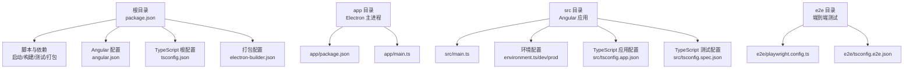

# 目录结构设计

<cite>
**本文档引用的文件**
- [package.json](file://package.json)
- [app/package.json](file://app/package.json)
- [angular.json](file://angular.json)
- [electron-builder.json](file://electron-builder.json)
- [tsconfig.json](file://tsconfig.json)
- [src/tsconfig.app.json](file://src/tsconfig.app.json)
- [src/tsconfig.spec.json](file://src/tsconfig.spec.json)
- [tsconfig.serve.json](file://tsconfig.serve.json)
- [e2e/tsconfig.e2e.json](file://e2e/tsconfig.e2e.json)
- [e2e/playwright.config.ts](file://e2e/playwright.config.ts)
- [src/main.ts](file://src/main.ts)
- [app/main.ts](file://app/main.ts)
- [src/environments/environment.ts](file://src/environments/environment.ts)
- [src/environments/environment.dev.ts](file://src/environments/environment.dev.ts)
- [src/environments/environment.prod.ts](file://src/environments/environment.prod.ts)
</cite>

## 目录结构总览

本项目采用“双包管理 + 分层架构”的组织方式，核心设计目标是将前端应用（Angular）与主进程（Electron）清晰分离，同时通过统一的 TypeScript 配置体系实现跨环境的一致性与可维护性。

- 根目录 package.json：负责顶层脚本、开发依赖与打包发布流程的协调，包含启动、构建、测试、端到端测试与打包等命令。
- app 目录：存放 Electron 主进程代码与应用元数据，独立的 package.json 用于运行时依赖与版本管理。
- src 目录：Angular 应用源码，包含页面组件、共享模块、核心服务与国际化资源。
- e2e 目录：端到端测试配置与用例，使用 Playwright 进行跨平台 UI 自动化测试。

图表来源
- [package.json:1-108](file://package.json#L1-L108)
- [angular.json:1-188](file://angular.json#L1-L188)
- [tsconfig.json:1-34](file://tsconfig.json#L1-L34)
- [electron-builder.json:1-61](file://electron-builder.json#L1-L61)
- [app/main.ts:1-94](file://app/main.ts#L1-L94)
- [src/main.ts:1-57](file://src/main.ts#L1-L57)
- [src/environments/environment.ts:1-5](file://src/environments/environment.ts#L1-L5)
- [src/environments/environment.dev.ts:1-5](file://src/environments/environment.dev.ts#L1-L5)
- [src/environments/environment.prod.ts:1-5](file://src/environments/environment.prod.ts#L1-L5)
- [src/tsconfig.app.json:1-25](file://src/tsconfig.app.json#L1-L25)
- [src/tsconfig.spec.json:1-21](file://src/tsconfig.spec.json#L1-L21)
- [e2e/playwright.config.ts:1-21](file://e2e/playwright.config.ts#L1-L21)
- [e2e/tsconfig.e2e.json:1-14](file://e2e/tsconfig.e2e.json#L1-L14)

章节来源
- [package.json:1-108](file://package.json#L1-L108)
- [angular.json:1-188](file://angular.json#L1-L188)
- [tsconfig.json:1-34](file://tsconfig.json#L1-L34)
- [electron-builder.json:1-61](file://electron-builder.json#L1-L61)

## 根目录配置文件与双包管理结构

### 根目录 package.json 的职责分工

- 启动与开发流程
  - 同时启动 Angular 开发服务器与 Electron 主进程，实现热重载与实时调试体验。
  - 提供本地打包预览与生产构建命令，确保渲染进程产物与主进程协同工作。
- 构建与打包
  - 调用 Angular CLI 构建 Web 资产，随后通过 electron-builder 打包多平台安装包。
  - 在版本升级后自动同步 app/package.json 的版本号，保证发布一致性。
- 依赖与工具链
  - 管理 Angular 生态与 Electron 相关的开发依赖，提供 ESLint、TypeScript、Vitest、Playwright 等工具集成。

章节来源
- [package.json:27-47](file://package.json#L27-L47)

### app/package.json 的职责与定位

- 运行时元信息
  - 定义 Electron 应用的名称、版本、入口文件与私有属性，作为最终可执行程序的元数据载体。
- 依赖隔离
  - 主进程依赖独立管理，避免与 Angular 渲染进程依赖产生冲突，提升安全性与可维护性。
- 版本同步机制
  - 通过根目录脚本在版本变更时同步更新，确保打包阶段使用的版本一致。

章节来源
- [app/package.json:1-13](file://app/package.json#L1-L13)

### 双包管理的优势

- 明确边界：渲染进程（Angular）与主进程（Electron）职责分离，降低耦合度。
- 独立演进：各自依赖树独立升级，减少版本冲突风险。
- 安全与性能：主进程最小依赖，减少攻击面；开发与生产环境分别优化。
- 发布一致性：版本号统一管理，避免打包阶段出现版本不匹配问题。

## TypeScript 配置体系

### 根配置 tsconfig.json 的作用

- 编译选项
  - 启用严格模式与装饰器支持，适配 Angular 与 Electron 的运行时特性。
  - 使用 bundler 模块解析，便于现代打包器处理依赖。
- Angular 编译器选项
  - 启用模板严格检查与注入参数严格校验，提升类型安全与可维护性。
- 全局类型与目标
  - 设置 ES2022 目标与 DOM 类型，满足现代浏览器与 Electron 环境需求。

章节来源
- [tsconfig.json:1-34](file://tsconfig.json#L1-L34)

### 应用配置 src/tsconfig.app.json

- 继承根配置，扩展应用特定编译行为
  - 引入 Node 类型，使主进程与渲染进程交互时具备类型提示。
  - 排除测试文件，避免测试代码进入生产构建。
- 文件范围
  - 以 src/main.ts 为入口，包含所有应用层 TypeScript 与声明文件。

章节来源
- [src/tsconfig.app.json:1-25](file://src/tsconfig.app.json#L1-L25)

### 测试配置 src/tsconfig.spec.json

- Vitest 集成
  - 引入 vitest/globals 类型，配合 Angular 单元测试与覆盖率报告。
- 排除范围
  - 排除 dist、release、node_modules 等目录，聚焦源码测试。

章节来源
- [src/tsconfig.spec.json:1-21](file://src/tsconfig.spec.json#L1-L21)

### 开发服务配置 tsconfig.serve.json

- 主进程开发专用
  - CommonJS 模块与 ES2015 目标，适配 Electron 开发期的模块加载与调试。
  - 引入 Node 类型与 DOM 库，满足主进程与窗口 API 的类型支持。

章节来源
- [tsconfig.serve.json:1-28](file://tsconfig.serve.json#L1-L28)

### 端到端测试配置 e2e/tsconfig.e2e.json

- 继承根配置，面向 e2e 测试场景
  - CommonJS 模块与 Node 类型，适配 Playwright 测试运行时。
- 包含范围
  - 仅包含 e2e spec 文件，避免污染应用构建产物。

章节来源
- [e2e/tsconfig.e2e.json:1-14](file://e2e/tsconfig.e2e.json#L1-L14)

## 构建与打包配置

### Angular 构建配置 angular.json

- 工程与项目
  - 定义 Angular 应用与 e2e 项目的构建目标与任务。
- 构建选项
  - 输出目录、索引页、polyfill、样式与脚本等资源管理。
  - TypeScript 配置文件与浏览器入口指定。
- 环境配置
  - dev/production/testing 三套配置，分别控制优化级别、SourceMap、AOT 与替换环境文件。
- 测试与 Lint
  - 使用 Vitest 作为单元测试运行器，HTML 与 LCOV 报告输出。
  - ESLint 集成，覆盖 src 与 e2e 下的 TypeScript 与 HTML 文件。

章节来源
- [angular.json:1-188](file://angular.json#L1-L188)

### Electron 打包配置 electron-builder.json

- 打包策略
  - 启用 asar 压缩，提升加载性能与安全性。
  - files 列表排除 TypeScript 源码与映射文件，仅打包构建产物与必要资源。
- 输出与目录
  - 输出目录 release/，从 dist 复制浏览器构建产物。
- 平台目标
  - Windows：便携版（portable）与图标配置。
  - macOS：DMG 安装包与图标配置。
  - Linux：AppImage、Flatpak 与运行时依赖配置。
- Flatpak 特定
  - 指定基础运行时、SDK 与权限参数，确保沙箱环境下的功能完整性。

章节来源
- [electron-builder.json:1-61](file://electron-builder.json#L1-L61)

## 目录结构设计意图与最佳实践

### 分层组织原则

- 根目录：统一脚本、依赖与打包配置，形成“控制中枢”。
- app 目录：主进程代码与运行时元数据，强调安全与最小依赖。
- src 目录：渲染进程应用源码，遵循 Angular 模块化与组件化规范。
- e2e 目录：端到端测试独立配置，保障 UI 行为与跨平台兼容性。

### 环境与配置管理

- 环境文件按环境区分，通过 Angular 构建配置进行文件替换，实现开发、生产与测试环境的差异化。
- TypeScript 配置按场景拆分，避免相互干扰，提升编译效率与类型检查准确性。

### 路径映射与类型检查

- 通过 tsconfig.extends 实现配置复用，减少重复声明。
- 在应用配置中引入 Node 类型，在测试配置中引入 Vitest 类型，确保各层具备完整的类型支持。

### 自定义与扩展建议

- Angular 构建：可在 angular.json 中新增自定义配置或任务，结合环境变量实现多分支构建。
- Electron 打包：根据目标平台调整 target 与权限参数，必要时添加额外资源过滤规则。
- TypeScript：在根配置中统一编译选项，按需在子配置中覆盖，保持一致性与灵活性。