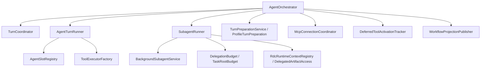
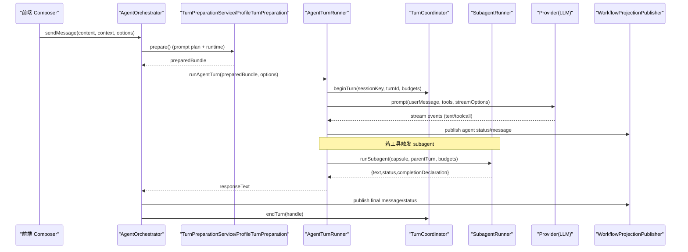
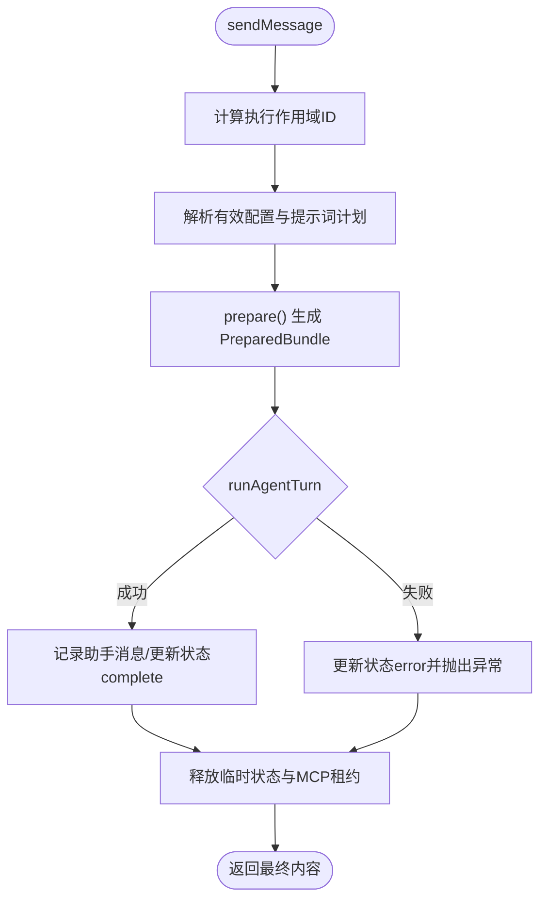
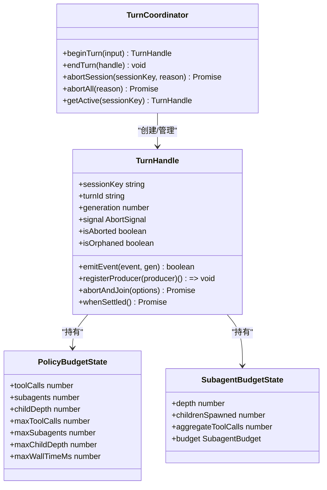
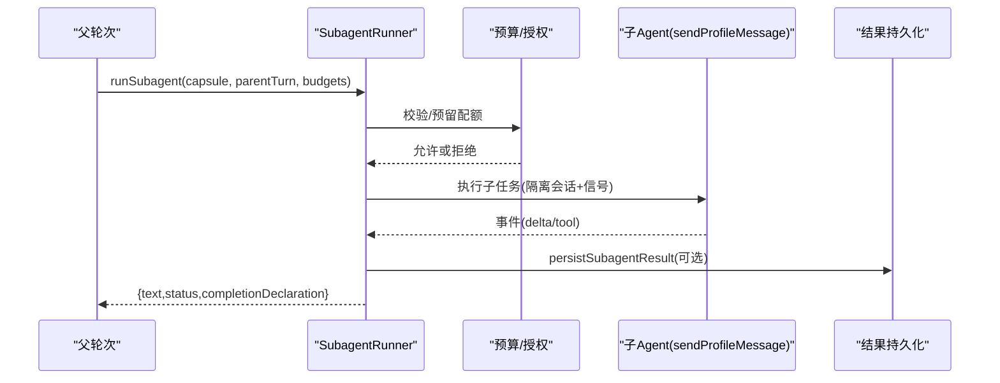
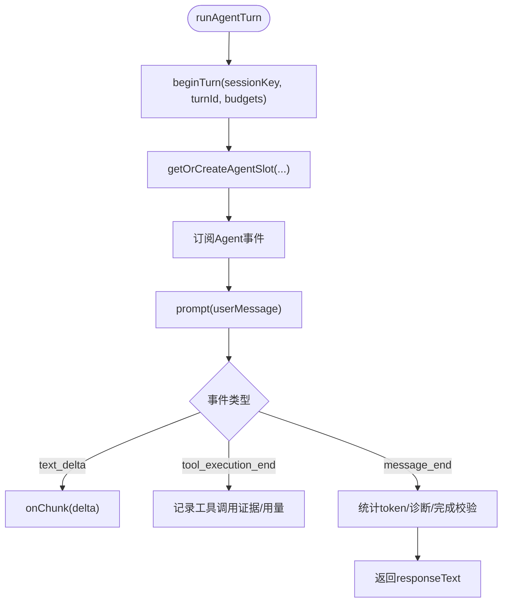
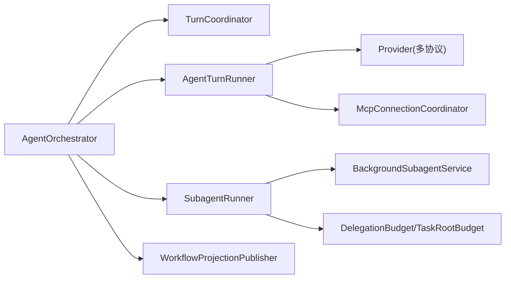

# Agent 编排系统

<cite>
**本文引用的文件**
- [AgentOrchestrator.ts](file://src/main/workflow/debugger/AgentOrchestrator.ts)
- [TurnCoordinator.ts](file://src/main/workflow/debugger/TurnCoordinator.ts)
- [SubagentRunner.ts](file://src/main/workflow/debugger/SubagentRunner.ts)
- [AgentTurnRunner.ts](file://src/main/workflow/debugger/AgentTurnRunner.ts)
- [BackgroundSubagentService.ts](file://src/main/workflow/debugger/BackgroundSubagentService.ts)
- [DelegationBudget.ts](file://src/main/workflow/debugger/DelegationBudget.ts)
- [TaskRootBudget.ts](file://src/main/workflow/debugger/TaskRootBudget.ts)
- [SubagentResultEnvelope.ts](file://src/main/workflow/debugger/SubagentResultEnvelope.ts)
- [RdcRuntimeContextRegistry.ts](file://src/main/sessions/RdcRuntimeContextRegistry.ts)
- [DelegatedArtifactAccess.ts](file://src/main/sessions/DelegatedArtifactAccess.ts)
- [RdcDelegation.ts](file://src/main/sessions/RdcDelegation.ts)
- [ConversationBackgroundContinuation.ts](file://src/main/conversation/ConversationBackgroundContinuation.ts)
- [WorkflowProjectionPublisher.ts](file://src/main/workflow/debugger/WorkflowProjectionPublisher.ts)
- [AgentToolApprovalRequestService.ts](file://src/main/agent-runtime/permissions/AgentToolApprovalRequestService.ts)
- [TurnPreparationComputation.ts](file://src/main/workers/TurnPreparationComputation.ts)
- [TurnPreparationWorkerPool.ts](file://src/main/workers/TurnPreparationWorkerPool.ts)
- [turnPreparationWorker.ts](file://src/main/workers/turnPreparationWorker.ts)
- [EffectiveRuntimePlan.ts](file://src/main/agent-runtime/EffectiveRuntimePlan.ts)
- [PromptPlanForTurn.ts](file://src/main/workflow/debugger/PromptPlanForTurn.ts)
- [ProfileTurnPreparation.ts](file://src/main/workflow/debugger/ProfileTurnPreparation.ts)
- [McpConnectionCoordinator.ts](file://src/main/workflow/debugger/McpConnectionCoordinator.ts)
- [DeferredToolActivationTracker.ts](file://src/main/workflow/debugger/DeferredToolActivationTracker.ts)
- [AgentSlotRegistry.ts](file://src/main/workflow/debugger/AgentSlotRegistry.ts)
- [DirectTaskTurnLifecycle.ts](file://src/main/workflow/debugger/DirectTaskTurnLifecycle.ts)
- [OrchestratorMemoryUi.ts](file://src/main/workflow/debugger/OrchestratorMemoryUi.ts)
- [executionScope.ts](file://src/main/workflow/debugger/executionScope.ts)
- [subagentModelArg.ts](file://src/main/workflow/debugger/subagentModelArg.ts)
- [conversationSendFlow.ts](file://src/renderer/features/composer/composerSendFlow.ts)
- [agentic-trace-protocol.md](file://docs/architecture/agentic-trace-protocol.md)
</cite>

## 目录
1. [简介](#简介)
2. [项目结构](#项目结构)
3. [核心组件](#核心组件)
4. [架构总览](#架构总览)
5. [详细组件分析](#详细组件分析)
6. [依赖关系分析](#依赖关系分析)
7. [性能考量](#性能考量)
8. [故障排查指南](#故障排查指南)
9. [结论](#结论)
10. [附录：API、配置与示例](#附录api配置与示例)

## 简介
本文件面向 RDC-Agent 的 Agent 编排子系统，聚焦以下目标：
- 解释 AgentOrchestrator 的核心职责：消息发送、会话管理、子 Agent 协调、资源与凭据生命周期。
- 说明 TurnCoordinator 的轮次管理机制：会话级活跃轮次、中止与回收、预算与策略控制。
- 解析 SubagentRunner 的子任务执行流程：委派胶囊、隔离上下文、预算继承与聚合、结果持久化。
- 阐述 AgentTurnRunner 的具体实现：槽位复用、工具装配、事件桥接、错误恢复与完成校验。
- 提供 API 接口说明、配置选项、使用示例与错误处理策略。
- 覆盖 Agent 生命周期管理、状态同步机制与资源清理策略。

## 项目结构
编排相关代码集中在 main/workflow/debugger 目录，围绕“准备-运行-协调”的主线组织：
- 编排门面：AgentOrchestrator 暴露统一入口（sendMessage/sendProfileMessage/runSubagent/abortAndJoin）。
- 轮次协调：TurnCoordinator 维护每会话的 TurnHandle，负责中止、回收、预算与事件路由。
- 子任务执行：SubagentRunner 封装委派调用、隔离会话、预算与结果持久化。
- 轮次运行：AgentTurnRunner 创建/复用 Agent 槽位、装配工具、驱动 Provider 流式调用并统计用量。
- 前置准备：TurnPreparationService/ProfileTurnPreparation/PromptPlanForTurn 负责提示词计划、模型规划与运行时准备。
- 后台子 Agent：BackgroundSubagentService 支持后台模式的任务执行与追踪。
- 资源与权限：MCP 连接、延迟工具激活、工具审批、任务范围与租约等。

图表来源
- [AgentOrchestrator.ts:75-145](file://src/main/workflow/debugger/AgentOrchestrator.ts#L75-L145)
- [TurnCoordinator.ts:493-605](file://src/main/workflow/debugger/TurnCoordinator.ts#L493-L605)
- [AgentTurnRunner.ts:119-315](file://src/main/workflow/debugger/AgentTurnRunner.ts#L119-L315)
- [SubagentRunner.ts:71-103](file://src/main/workflow/debugger/SubagentRunner.ts#L71-L103)

章节来源
- [AgentOrchestrator.ts:75-145](file://src/main/workflow/debugger/AgentOrchestrator.ts#L75-L145)
- [TurnCoordinator.ts:493-605](file://src/main/workflow/debugger/TurnCoordinator.ts#L493-L605)
- [AgentTurnRunner.ts:119-315](file://src/main/workflow/debugger/AgentTurnRunner.ts#L119-L315)
- [SubagentRunner.ts:71-103](file://src/main/workflow/debugger/SubagentRunner.ts#L71-L103)

## 核心组件
- AgentOrchestrator：编排门面，负责消息发送、配置应用、凭据刷新、提示词计划、轮次运行、子 Agent 调度、状态更新与消息广播。
- TurnCoordinator：会话级轮次管理器，维护 TurnHandle，提供 beginTurn/endTurn/abortSession/abortAll，内置预算与超时控制。
- AgentTurnRunner：轮次执行器，创建/复用 Agent 槽位，装配工具，订阅事件，记录用量，完成校验。
- SubagentRunner：子 Agent 执行器，解析委派胶囊，建立隔离会话，继承/派生预算，持久化结果，透传事件。
- BackgroundSubagentService：后台子 Agent 服务，将子任务以任务执行记录形式启动与跟踪。
- 前置准备：TurnPreparationService/ProfileTurnPreparation/PromptPlanForTurn 组合生成请求计划、提示词片段与运行时环境。

章节来源
- [AgentOrchestrator.ts:195-366](file://src/main/workflow/debugger/AgentOrchestrator.ts#L195-L366)
- [TurnCoordinator.ts:205-491](file://src/main/workflow/debugger/TurnCoordinator.ts#L205-L491)
- [AgentTurnRunner.ts:317-800](file://src/main/workflow/debugger/AgentTurnRunner.ts#L317-L800)
- [SubagentRunner.ts:80-429](file://src/main/workflow/debugger/SubagentRunner.ts#L80-L429)
- [PromptPlanForTurn.ts](file://src/main/workflow/debugger/PromptPlanForTurn.ts)
- [ProfileTurnPreparation.ts](file://src/main/workflow/debugger/ProfileTurnPreparation.ts)

## 架构总览
下图展示一次用户消息从前端到后端编排、再到 Provider 调用的完整链路，以及子 Agent 的并发与隔离。

图表来源
- [AgentOrchestrator.ts:195-366](file://src/main/workflow/debugger/AgentOrchestrator.ts#L195-L366)
- [AgentTurnRunner.ts:317-800](file://src/main/workflow/debugger/AgentTurnRunner.ts#L317-L800)
- [TurnCoordinator.ts:507-555](file://src/main/workflow/debugger/TurnCoordinator.ts#L507-L555)
- [SubagentRunner.ts:80-429](file://src/main/workflow/debugger/SubagentRunner.ts#L80-L429)
- [WorkflowProjectionPublisher.ts:42-63](file://src/main/workflow/debugger/WorkflowProjectionPublisher.ts#L42-L63)

## 详细组件分析

### AgentOrchestrator：编排门面
- 消息发送 sendMessage：
  - 计算执行作用域 ID，更新状态为 thinking。
  - 刷新凭据并解析有效配置（provider/model/systemPrompt/temperature）。
  - 构建 PromptPlan 与 PreparedBundle（含 toolAllowlist、requestPlan、contextWindow 等）。
  - 调用 AgentTurnRunner.runAgentTurn 执行一轮对话。
  - 最终记录助手消息、更新状态为 complete/error，释放临时状态与 MCP 租约。
- 配置文件 sendProfileMessage：
  - 支持传入已准备的 Turn、冻结委派胶囊、额外提示段、可见轮次、终端上下文回调等。
  - 同样进行模型规划、提示词组装与运行。
- 子 Agent 协调：
  - 通过 SubagentRunner 与 BackgroundSubagentService 提供子任务能力。
  - 工具层暴露 subagent 工具，支持 wait/background 两种模式。
- 会话与状态：
  - 通过 slots 管理 Agent 状态；通过 workflowProjectionPublisher 发布状态与消息。
  - 支持 abortAndJoin 优雅中止并等待生产者结束。

图表来源
- [AgentOrchestrator.ts:195-366](file://src/main/workflow/debugger/AgentOrchestrator.ts#L195-L366)
- [AgentOrchestrator.ts:384-634](file://src/main/workflow/debugger/AgentOrchestrator.ts#L384-L634)

章节来源
- [AgentOrchestrator.ts:75-145](file://src/main/workflow/debugger/AgentOrchestrator.ts#L75-L145)
- [AgentOrchestrator.ts:195-366](file://src/main/workflow/debugger/AgentOrchestrator.ts#L195-L366)
- [AgentOrchestrator.ts:384-634](file://src/main/workflow/debugger/AgentOrchestrator.ts#L384-L634)
- [AgentOrchestrator.ts:636-653](file://src/main/workflow/debugger/AgentOrchestrator.ts#L636-L653)

### TurnCoordinator：轮次管理与预算
- 会话级活跃轮次：
  - beginTurn 为每个 sessionKey 创建 TurnHandle，替换旧轮次并中止旧轮次。
  - endTurn 关闭并清理 handle；abortSession/abortAll 批量中止。
- TurnHandle：
  - 持有 generation 令牌，用于丢弃过期事件。
  - 维护 producers（如 Agent、子任务），支持 abortAndJoin 优雅退出。
  - 内置 wallTimer 基于 maxWallTimeMs 超时中止。
- 预算体系：
  - PolicyBudgetState：限制工具调用、子 Agent 数量、最大深度、墙钟时间。
  - SubagentBudgetState：限制子 Agent 深度、子节点数、聚合工具调用、聚合墙钟时间。
  - reserveDispatchBudget/consumeReservedSubagentSlot：原子预留与消费，避免超额。

图表来源
- [TurnCoordinator.ts:205-491](file://src/main/workflow/debugger/TurnCoordinator.ts#L205-L491)
- [TurnCoordinator.ts:493-605](file://src/main/workflow/debugger/TurnCoordinator.ts#L493-L605)

章节来源
- [TurnCoordinator.ts:205-491](file://src/main/workflow/debugger/TurnCoordinator.ts#L205-L491)
- [TurnCoordinator.ts:493-605](file://src/main/workflow/debugger/TurnCoordinator.ts#L493-L605)
- [TurnCoordinator.test.ts:25-160](file://src/main/workflow/debugger/TurnCoordinator.test.ts#L25-L160)
- [TurnCoordinator.test.ts:162-231](file://src/main/workflow/debugger/TurnCoordinator.test.ts#L162-L231)

### SubagentRunner：子任务执行流程
- 输入与授权：
  - 解析 DelegationCapsule，校验目标 profile 可用性，解析模型覆盖。
  - 校验父预算与策略预算，必要时预留子 Agent 配额。
- 隔离与会话：
  - 为子 Agent 分配独立 sessionId（包含 ::subagent:: 标记）或临时作用域。
  - 授予委派制品访问与可选 RDC 租约，注册任务作用域。
- 执行与事件：
  - 设置超时定时器与父信号传播，注册 producer 以便中止时加入。
  - 调用 sendProfileMessage 执行子 Agent，透传 onEvent 事件（delta、tool.started/completed/denied）。
  - 聚合工具调用计数，回写父预算。
- 结果与清理：
  - 捕获取消/失败状态，持久化结果包，规范化输出。
  - 清理租约、制品访问、任务作用域与 producer 注册。

图表来源
- [SubagentRunner.ts:80-429](file://src/main/workflow/debugger/SubagentRunner.ts#L80-L429)
- [SubagentRunner.ts:431-678](file://src/main/workflow/debugger/SubagentRunner.ts#L431-L678)
- [DelegationBudget.ts](file://src/main/workflow/debugger/DelegationBudget.ts)
- [TaskRootBudget.ts](file://src/main/workflow/debugger/TaskRootBudget.ts)
- [SubagentResultEnvelope.ts](file://src/main/workflow/debugger/SubagentResultEnvelope.ts)

章节来源
- [SubagentRunner.ts:80-429](file://src/main/workflow/debugger/SubagentRunner.ts#L80-L429)
- [SubagentRunner.ts:431-678](file://src/main/workflow/debugger/SubagentRunner.ts#L431-L678)
- [RdcRuntimeContextRegistry.ts](file://src/main/sessions/RdcRuntimeContextRegistry.ts)
- [DelegatedArtifactAccess.ts](file://src/main/sessions/DelegatedArtifactAccess.ts)
- [RdcDelegation.ts](file://src/main/sessions/RdcDelegation.ts)

### AgentTurnRunner：轮次运行器
- 槽位管理：
  - getOrCreateAgentSlot 根据 provider/model/systemPrompt/tools 签名复用槽位，避免重复初始化。
  - 注入上下文压缩、错误恢复、工具定义与缓存。
- 轮次执行：
  - beginTurn 创建 TurnHandle，绑定 eventSink、policyBudget、subagentBudget。
  - 订阅 Agent 事件，转发为共享事件，记录结构化工具调用证据与用量。
  - 在 message_end 时统计各部分 token 消耗（system_prompt、skills、tools、conversation 等）。
- 完成校验：
  - enforceTaskReturnBinding 与 validateCompletion 确保任务契约满足。
  - 处理直接任务执行结算与挂起交接。

图表来源
- [AgentTurnRunner.ts:119-315](file://src/main/workflow/debugger/AgentTurnRunner.ts#L119-L315)
- [AgentTurnRunner.ts:317-800](file://src/main/workflow/debugger/AgentTurnRunner.ts#L317-L800)

章节来源
- [AgentTurnRunner.ts:119-315](file://src/main/workflow/debugger/AgentTurnRunner.ts#L119-L315)
- [AgentTurnRunner.ts:317-800](file://src/main/workflow/debugger/AgentTurnRunner.ts#L317-L800)
- [DirectTaskTurnLifecycle.ts](file://src/main/workflow/debugger/DirectTaskTurnLifecycle.ts)

### 后台子 Agent 与背景续跑
- BackgroundSubagentService：
  - 将子任务以任务执行记录形式启动，支持 join/查询/终止。
  - 与 SubagentRunner 协作，传递 policyBudget/subagentBudget 与事件。
- ConversationBackgroundContinuation：
  - 维护待处理的背景续跑事件，按序列号去重与抑制，支持策略预算。

章节来源
- [BackgroundSubagentService.ts](file://src/main/workflow/debugger/BackgroundSubagentService.ts)
- [ConversationBackgroundContinuation.ts:1-13](file://src/main/conversation/ConversationBackgroundContinuation.ts#L1-L13)

### 前置准备与提示词计划
- TurnPreparationService/ProfileTurnPreparation：
  - 准备工具签名、运行时工具、MCP 租约、凭证句柄、上下文窗口与压缩阈值。
- PromptPlanForTurn：
  - 根据 agentId/provider/model 与上下文窗口生成提示词片段与指标。
- EffectiveRuntimePlan：
  - 合并策略、工具白名单、委托代理、排除项等，形成可执行的运行时计划。

章节来源
- [TurnPreparationComputation.ts](file://src/main/workers/TurnPreparationComputation.ts)
- [TurnPreparationWorkerPool.ts](file://src/main/workers/TurnPreparationWorkerPool.ts)
- [turnPreparationWorker.ts](file://src/main/workers/turnPreparationWorker.ts)
- [PromptPlanForTurn.ts](file://src/main/workflow/debugger/PromptPlanForTurn.ts)
- [ProfileTurnPreparation.ts](file://src/main/workflow/debugger/ProfileTurnPreparation.ts)
- [EffectiveRuntimePlan.ts](file://src/main/agent-runtime/EffectiveRuntimePlan.ts)

## 依赖关系分析
- 松耦合设计：
  - AgentOrchestrator 通过依赖注入组合 TurnCoordinator、AgentTurnRunner、SubagentRunner、MCP 协调器等。
  - 工具装配与执行解耦：RuntimeToolAssembly/ToolExecutorFactory 分离定义与执行。
- 关键依赖链：
  - 消息发送 → 提示词计划 → 轮次运行 → Provider 流式响应 → 事件桥接 → 投影发布。
  - 子 Agent 执行 → 预算继承/派生 → 隔离会话 → 结果持久化 → 父预算聚合。
- 外部集成点：
  - Provider 协议适配（OpenAI/Gemini/Anthropic 等）由运行时提供者抽象。
  - MCP 服务器连接与状态摘要。
  - 存储适配器（会话/任务/制品）与日志/遥测服务。

图表来源
- [AgentOrchestrator.ts:75-145](file://src/main/workflow/debugger/AgentOrchestrator.ts#L75-L145)
- [AgentTurnRunner.ts:119-315](file://src/main/workflow/debugger/AgentTurnRunner.ts#L119-L315)
- [SubagentRunner.ts:71-103](file://src/main/workflow/debugger/SubagentRunner.ts#L71-L103)

章节来源
- [AgentOrchestrator.ts:75-145](file://src/main/workflow/debugger/AgentOrchestrator.ts#L75-L145)
- [AgentTurnRunner.ts:119-315](file://src/main/workflow/debugger/AgentTurnRunner.ts#L119-L315)
- [SubagentRunner.ts:71-103](file://src/main/workflow/debugger/SubagentRunner.ts#L71-L103)

## 性能考量
- 槽位复用：
  - 相同 provider/model/systemPrompt/tools 签名复用 Agent 槽位，减少初始化开销。
- 上下文压缩：
  - 动态计算 requestTokenLimit，结合 tokenizer 与服务端能力进行压缩，避免超限。
- 工具延迟激活：
  - 仅在实际使用时激活 MCP/扩展工具，降低初始 schema 体积与成本。
- 预算控制：
  - 策略预算与子 Agent 预算双重约束，防止无限递归与资源耗尽。
- 流式处理：
  - 事件流式转发与增量统计，提升交互体验与资源利用率。

[本节为通用性能讨论，不直接分析具体文件]

## 故障排查指南
- 常见错误与定位：
  - 轮次孤儿：TURN_ORPHANED 表示上一轮未完全结算，需等待 orphand settle 后再开始新轮次。
  - 预算超限：POLICY_LIMIT_EXCEEDED/SUBAGENT_BUDGET 检查 maxToolCalls/maxSubagents/maxChildDepth/maxWallTimeMs。
  - 凭据问题：MODEL_UNAVAILABLE/AGENT_PROFILE_UNAVAILABLE 检查 provider/model 配置与生效。
  - 工具调用失败：结构化工具调用不被支持时记录诊断事件，建议降级或调整模型。
- 调试手段：
  - 使用 WorkflowProjectionPublisher 发布的 agent:message/agent:statusChanged 事件观察状态变化。
  - 查看 trace 投影与右侧进度栏，确认任务与子 Agent 执行情况。
  - 启用测试模式（RDC_AGENT_TEST_MODE=1）快速验证流程。

章节来源
- [TurnCoordinator.ts:507-555](file://src/main/workflow/debugger/TurnCoordinator.ts#L507-L555)
- [SubagentRunner.ts:117-152](file://src/main/workflow/debugger/SubagentRunner.ts#L117-L152)
- [AgentTurnRunner.ts:499-534](file://src/main/workflow/debugger/AgentTurnRunner.ts#L499-L534)
- [WorkflowProjectionPublisher.ts:42-63](file://src/main/workflow/debugger/WorkflowProjectionPublisher.ts#L42-L63)
- [agentic-trace-protocol.md:1-49](file://docs/architecture/agentic-trace-protocol.md#L1-L49)

## 结论
本编排系统通过 AgentOrchestrator 统一入口，结合 TurnCoordinator 的轮次治理、AgentTurnRunner 的高效执行与 SubagentRunner 的隔离委派，实现了高内聚、低耦合的 Agent 工作流。预算体系与资源清理策略保障了系统的稳定性与可扩展性。配合前置准备与事件投影，提供了完整的可观测性与调试能力。

[本节为总结，不直接分析具体文件]

## 附录：API、配置与示例

### 主要 API 概览
- AgentOrchestrator
  - sendMessage(agentId, content, context?, options?): Promise<string>
  - sendProfileMessage(agentId, content, options?): Promise<string>
  - runSubagent(input): Promise<{text,status,subagentId,...}>
  - createSubagentTools(parentAgentId, sessionId?, turnHandle?): AgentTool[]
  - abortAndJoin(sessionId?, options?): Promise<void>
  - configureAgent(agentId, config): void
  - getAgentState(sessionOrScopeId, agentId): AgentState | null
  - prepareTurnContext(input): Promise<PreparedAgentTurnContext>
- TurnCoordinator
  - beginTurn({sessionKey, turnId, runId?, parentSignal?, eventSink?, subagentBudget?, policyBudget?}): Promise<TurnHandle>
  - endTurn(handle): void
  - abortSession(sessionKey, reason?): Promise<void>
  - abortAll(reason?): Promise<void>
  - getActive(sessionKey): TurnHandle | null
- SubagentRunner
  - runSubagent({parentAgentId,parentToolCallId,targetProfile,capsule,parentSessionId?,...}): Promise<...>
  - createSubagentTools(parentAgentId, sessionId?, turnHandle?): AgentTool[]

章节来源
- [AgentOrchestrator.ts:195-366](file://src/main/workflow/debugger/AgentOrchestrator.ts#L195-L366)
- [AgentOrchestrator.ts:384-634](file://src/main/workflow/debugger/AgentOrchestrator.ts#L384-L634)
- [AgentOrchestrator.ts:636-653](file://src/main/workflow/debugger/AgentOrchestrator.ts#L636-L653)
- [TurnCoordinator.ts:507-555](file://src/main/workflow/debugger/TurnCoordinator.ts#L507-L555)
- [SubagentRunner.ts:80-429](file://src/main/workflow/debugger/SubagentRunner.ts#L80-L429)
- [SubagentRunner.ts:431-678](file://src/main/workflow/debugger/SubagentRunner.ts#L431-L678)

### 配置选项要点
- 模型与提供商：
  - providerId/modelId 由 effective profile 或 modelOverride 决定。
  - temperature、reasoningLevel、fastMode、maxContextMode 由 requestPlan 与 controls 控制。
- 预算与策略：
  - maxToolCalls、maxSubagents、maxChildDepth、maxWallTimeMs 来自 CompiledPolicy。
  - 子 Agent 默认预算：maxDepth=3、maxChildren=5、maxAggregateToolCalls=40、maxAggregateWallMs=300_000。
- 上下文与压缩：
  - contextWindowTokens、compactionThresholdPercent 影响提示词与历史压缩。
- 工具与权限：
  - toolAllowlist 由 profile.tools 解析；MCP 工具默认延迟激活；RDC 能力需租约。

章节来源
- [TurnCoordinator.ts:65-106](file://src/main/workflow/debugger/TurnCoordinator.ts#L65-L106)
- [TurnCoordinator.ts:136-191](file://src/main/workflow/debugger/TurnCoordinator.ts#L136-L191)
- [AgentOrchestrator.ts:249-286](file://src/main/workflow/debugger/AgentOrchestrator.ts#L249-L286)
- [AgentOrchestrator.ts:467-517](file://src/main/workflow/debugger/AgentOrchestrator.ts#L467-L517)

### 使用示例（路径指引）
- 前端发送对话轮次：
  - 参考 [composerSendFlow.ts:30-251](file://src/renderer/features/composer/composerSendFlow.ts#L30-L251)
- 主进程编排消息发送：
  - 参考 [AgentOrchestrator.ts:195-366](file://src/main/workflow/debugger/AgentOrchestrator.ts#L195-L366)
- 子 Agent 委派与后台执行：
  - 参考 [SubagentRunner.ts:80-429](file://src/main/workflow/debugger/SubagentRunner.ts#L80-L429)
  - 参考 [BackgroundSubagentService.ts](file://src/main/workflow/debugger/BackgroundSubagentService.ts)

### 错误处理策略
- 轮次中止与回收：
  - 使用 TurnHandle.abortAndJoin 优雅中止，支持 graceMs/forceAfterMs，处理孤儿轮次。
- 预算超限：
  - 提前 reserveDispatchBudget，失败则拒绝后续派发；子 Agent 执行前校验策略预算。
- 凭据与模型不可用：
  - 刷新凭据并重新解析有效配置；不可用时抛出明确错误码。
- 工具调用不支持：
  - 记录诊断事件，尝试降级或提示用户调整模型/路由。

章节来源
- [TurnCoordinator.ts:374-483](file://src/main/workflow/debugger/TurnCoordinator.ts#L374-L483)
- [SubagentRunner.ts:134-152](file://src/main/workflow/debugger/SubagentRunner.ts#L134-L152)
- [AgentOrchestrator.ts:214-223](file://src/main/workflow/debugger/AgentOrchestrator.ts#L214-L223)
- [AgentTurnRunner.ts:499-534](file://src/main/workflow/debugger/AgentTurnRunner.ts#L499-L534)