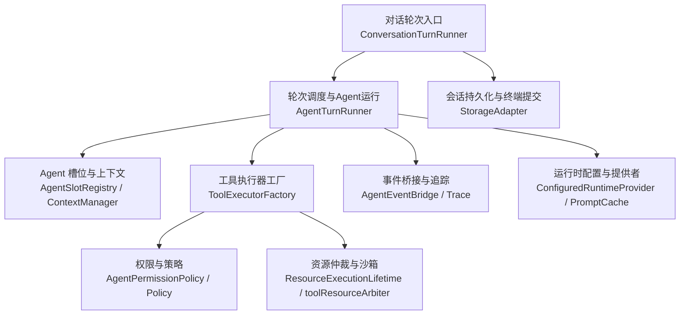
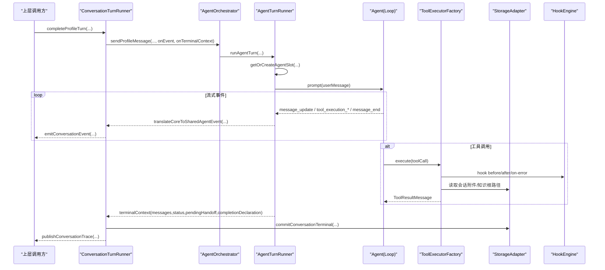
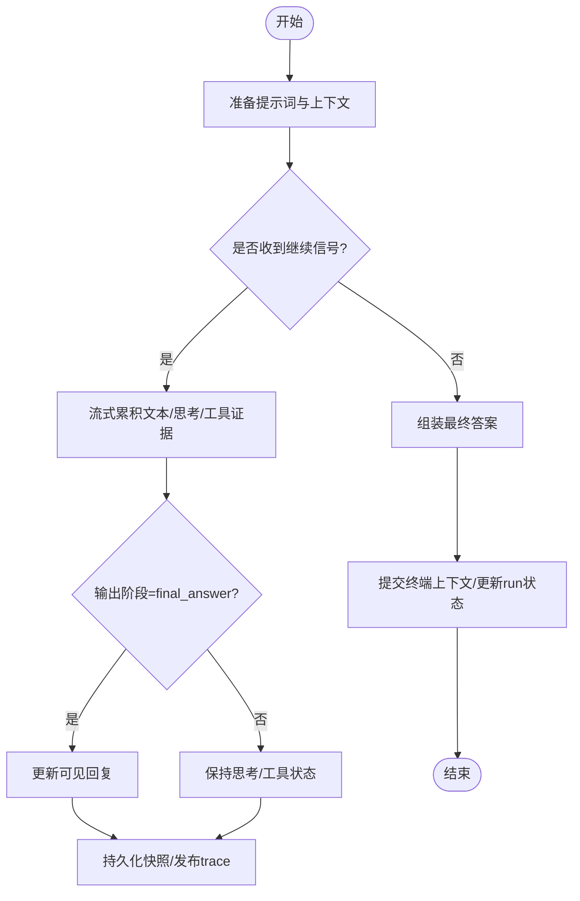
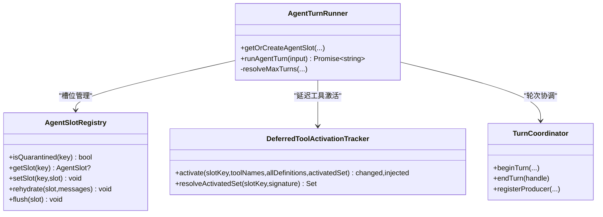
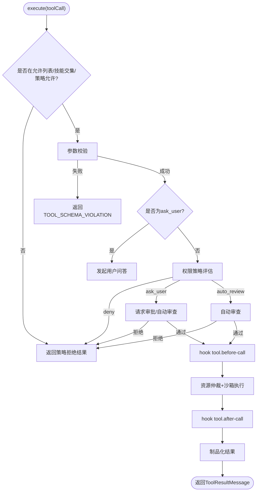
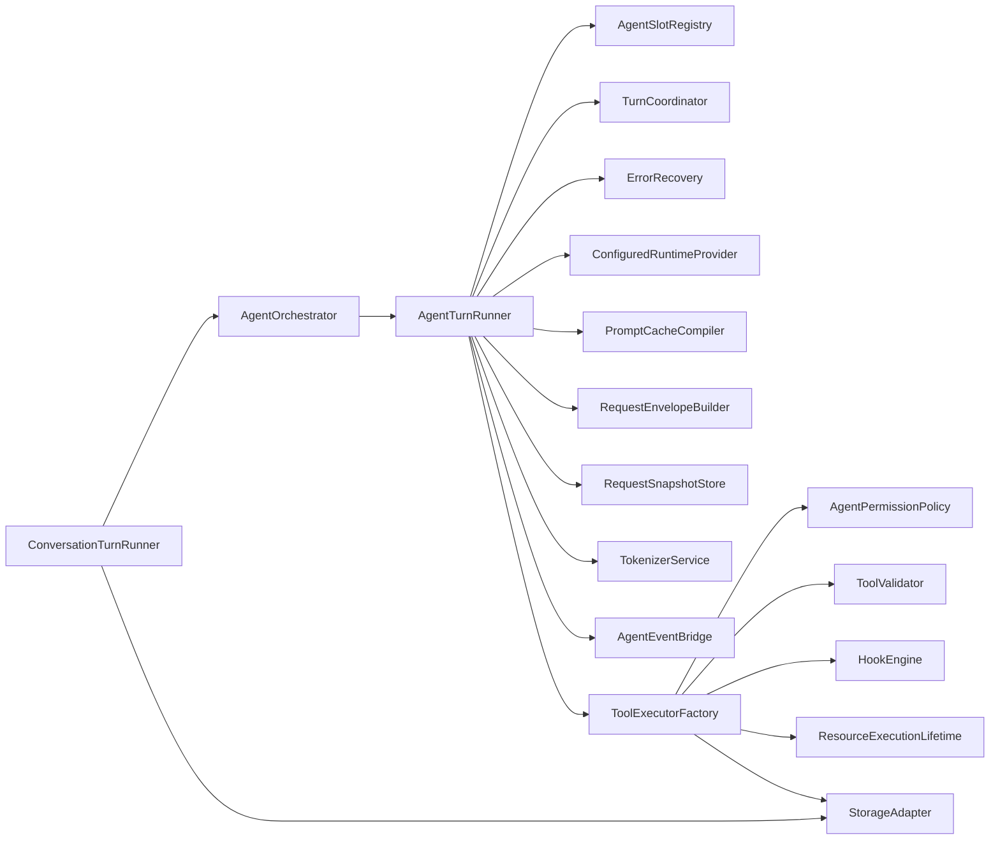

# Agent 轮次执行器

<cite>
**本文引用的文件**
- [ConversationTurnRunner.ts](file://src/main/conversation/ConversationTurnRunner.ts)
- [AgentTurnRunner.ts](file://src/main/workflow/debugger/AgentTurnRunner.ts)
- [ToolExecutorFactory.ts](file://src/main/workflow/debugger/ToolExecutorFactory.ts)
- [TurnCoordinator.ts](file://src/main/workflow/debugger/TurnCoordinator.ts)
- [AgentOrchestrator.ts](file://src/main/workflow/debugger/AgentOrchestrator.ts)
- [AgentSlotRegistry.ts](file://src/main/workflow/debugger/AgentSlotRegistry.ts)
- [DeferredToolActivationTracker.ts](file://src/main/workflow/debugger/DeferredToolActivationTracker.ts)
- [DirectTaskTurnLifecycle.ts](file://src/main/workflow/debugger/DirectTaskTurnLifecycle.ts)
- [RdxRuntimeService.ts](file://src/main/runtime/RdxRuntimeService.ts)
- [StorageAdapter.ts](file://src/main/sessions/StorageAdapter.ts)
- [HookEngine.ts](file://src/main/hooks/HookEngine.ts)
- [AgentEventBridge.ts](file://src/main/agent-runtime/AgentEventBridge.ts)
- [AgentLoop.ts](file://src/main/agent-runtime/agent/AgentLoop.ts)
- [TokenizerService.ts](file://src/main/agent-runtime/core/TokenizerService.ts)
- [ErrorRecovery.ts](file://src/main/agent-runtime/agent/ErrorRecovery.ts)
- [ConfiguredRuntimeProvider.ts](file://src/main/agent-runtime/providers/ConfiguredRuntimeProvider.ts)
- [PromptCacheCompiler.ts](file://src/main/agent-runtime/prompt/PromptCacheCompiler.ts)
- [RequestEnvelopeBuilder.ts](file://src/main/agent-runtime/prompt/requestEnvelopeBuilder.ts)
- [RequestSnapshotStore.ts](file://src/main/agent-runtime/prompt/requestSnapshotStore.ts)
- [ToolValidator.ts](file://src/main/agent-runtime/core/ToolValidator.ts)
- [AgentPermissionPolicy.ts](file://src/main/agent-runtime/permissions/AgentPermissionPolicy.ts)
- [AgentToolApprovalRequestService.ts](file://src/main/agent-runtime/permissions/AgentToolApprovalRequestService.ts)
- [AgentUserInputRequestService.ts](file://src/main/agent-runtime/interactions/AgentUserInputRequestService.ts)
- [ResourceExecutionLifetime.ts](file://src/main/runtime/ResourceExecutionLifetime.ts)
- [RdxTurnBindings.ts](file://src/main/tools/RdxTurnBindings.ts)
</cite>

## 目录
1. [简介](#简介)
2. [项目结构](#项目结构)
3. [核心组件](#核心组件)
4. [架构总览](#架构总览)
5. [详细组件分析](#详细组件分析)
6. [依赖关系分析](#依赖关系分析)
7. [性能与可靠性](#性能与可靠性)
8. [故障排查指南](#故障排查指南)
9. [结论](#结论)
10. [附录：API 参考与扩展示例](#附录api-参考与扩展示例)

## 简介
本文件面向“Agent 轮次执行器”的完整实现，聚焦以下目标：
- 解释 ConversationTurnRunner 如何编排一次对话轮次，包括 LLM 调用、工具执行、流式响应处理、最终结果提交与追踪。
- 解释 AgentTurnRunner 的轮次调度、Agent 槽位复用、上下文窗口压缩、错误恢复、事件桥接与资源清理。
- 解释 ToolExecutorFactory 的工具装配机制：动态加载、延迟激活、权限策略、沙箱隔离、版本兼容与预算控制。
- 说明权限检查、资源限制、安全沙箱等保护机制。
- 总结错误处理策略、重试机制、超时控制等可靠性保障。
- 提供 API 参考与扩展建议，帮助开发者自定义工具执行逻辑。

## 项目结构
围绕 Agent 轮次执行的关键代码集中在 main 进程的工作流与对话层：
- 对话层：ConversationTurnRunner 负责用户消息到助手回复的端到端编排，包含流式补丁调度、持久化、工作追踪、手递手（handoff）结算。
- 工作流调试层：AgentTurnRunner 负责创建/复用 Agent 槽位、构建请求、订阅事件、统计用量、协调 Turn 生命周期。
- 工具执行层：ToolExecutorFactory 负责工具解析、权限校验、参数校验、钩子触发、资源仲裁、异步执行与结果归一化。
- 支撑服务：TurnCoordinator、AgentSlotRegistry、DeferredToolActivationTracker、HookEngine、StorageAdapter、RdxRuntimeService 等。

图表来源
- [ConversationTurnRunner.ts:124-745](file://src/main/conversation/ConversationTurnRunner.ts#L124-L745)
- [AgentTurnRunner.ts:119-899](file://src/main/workflow/debugger/AgentTurnRunner.ts#L119-L899)
- [ToolExecutorFactory.ts:63-531](file://src/main/workflow/debugger/ToolExecutorFactory.ts#L63-L531)

章节来源
- [ConversationTurnRunner.ts:124-745](file://src/main/conversation/ConversationTurnRunner.ts#L124-L745)
- [AgentTurnRunner.ts:119-899](file://src/main/workflow/debugger/AgentTurnRunner.ts#L119-L899)
- [ToolExecutorFactory.ts:63-531](file://src/main/workflow/debugger/ToolExecutorFactory.ts#L63-L531)

## 核心组件
- ConversationTurnRunner：对话级轮次编排者。负责启动 agentOrchestrator.sendProfileMessage，维护流式补丁调度器，管理可见回复、思考轨迹、工作追踪，并在 finally 中完成终端提交、运行状态收尾、MCP 租约释放与凭据回收。
- AgentTurnRunner：轮次级执行者。负责 getOrCreateAgentSlot（槽位复用/重建）、构造 StreamOptions、注册事件订阅、记录用量、处理结构化/文本工具调用证据、异常分类与恢复、Turn 生命周期协调与清理。
- ToolExecutorFactory：工具执行中枢。负责 resolveRuntimeTools、权限评估、ask_user 交互、参数校验、钩子触发、资源仲裁、延迟工具激活、结果归一化与制品化。

章节来源
- [ConversationTurnRunner.ts:124-745](file://src/main/conversation/ConversationTurnRunner.ts#L124-L745)
- [AgentTurnRunner.ts:119-899](file://src/main/workflow/debugger/AgentTurnRunner.ts#L119-L899)
- [ToolExecutorFactory.ts:63-531](file://src/main/workflow/debugger/ToolExecutorFactory.ts#L63-L531)

## 架构总览
下图展示从对话入口到工具执行的完整调用链，以及关键数据与事件流向。

图表来源
- [ConversationTurnRunner.ts:464-745](file://src/main/conversation/ConversationTurnRunner.ts#L464-L745)
- [AgentTurnRunner.ts:317-899](file://src/main/workflow/debugger/AgentTurnRunner.ts#L317-L899)
- [ToolExecutorFactory.ts:141-374](file://src/main/workflow/debugger/ToolExecutorFactory.ts#L141-L374)
- [HookEngine.ts](file://src/main/hooks/HookEngine.ts)
- [StorageAdapter.ts](file://src/main/sessions/StorageAdapter.ts)

## 详细组件分析

### ConversationTurnRunner：对话轮次编排
- 流式补丁与可见回复：通过 ConversationStreamPatchScheduler 将 text_delta、thinking trace、tool evidence 等合并为最小化的 UI 更新；仅在 final_answer 且无 thinking/tool/ask 时写入可见气泡。
- 工作追踪与证据：使用 upsertWorkBlock/attachToolExecutionEvidence 记录 assistant-output、llm-request-failed、工具执行证据等，并定期发布 trace。
- 终止与提交：在 finally 中完成终端提交、run 状态更新、MCP 租约释放、凭据回收、handoff 结算。
- 错误与诊断：捕获模型不可用、路由缺失、流协议违规、任务完成合同不满足等场景，生成诊断并回写到消息与工作追踪。

图表来源
- [ConversationTurnRunner.ts:174-236](file://src/main/conversation/ConversationTurnRunner.ts#L174-L236)
- [ConversationTurnRunner.ts:306-383](file://src/main/conversation/ConversationTurnRunner.ts#L306-L383)
- [ConversationTurnRunner.ts:599-745](file://src/main/conversation/ConversationTurnRunner.ts#L599-L745)

章节来源
- [ConversationTurnRunner.ts:124-745](file://src/main/conversation/ConversationTurnRunner.ts#L124-L745)

### AgentTurnRunner：轮次调度与 Agent 运行
- 槽位复用：基于 executionScopeId + agentId 的 slotKey，结合 systemPrompt、tools signature、turnSignature、contextTokenLimit 判断是否复用；复用时会从磁盘权威 history rehydrate 并同步 tools（COW）。
- 上下文窗口压缩：transformContext 回调中根据 requestPlan 与当前工具定义长度动态设置 token 上限，调用 contextManager.compress 进行压缩。
- 错误恢复：ErrorRecovery 提供 retry/reactive_compact/continue/abort 策略；对 provider 返回空响应或文本工具调用未执行等情况发出诊断。
- 事件桥接：将 core AgentEvent 转换为 shared AgentEvent，并通过 turnHandle.eventSink 上抛；同时记录结构化/文本工具调用证据。
- 生命周期：beginTurn/endTurn、注册 producer/abort、清理 MCP 租约、flush slot、quarantine orphaned slot、dispatch hooks。

图表来源
- [AgentTurnRunner.ts:119-315](file://src/main/workflow/debugger/AgentTurnRunner.ts#L119-L315)
- [AgentTurnRunner.ts:317-899](file://src/main/workflow/debugger/AgentTurnRunner.ts#L317-L899)
- [AgentSlotRegistry.ts](file://src/main/workflow/debugger/AgentSlotRegistry.ts)
- [DeferredToolActivationTracker.ts](file://src/main/workflow/debugger/DeferredToolActivationTracker.ts)
- [TurnCoordinator.ts](file://src/main/workflow/debugger/TurnCoordinator.ts)

章节来源
- [AgentTurnRunner.ts:119-899](file://src/main/workflow/debugger/AgentTurnRunner.ts#L119-L899)

### ToolExecutorFactory：工具装配与执行
- 动态工具加载：resolveRuntimeTools 根据 agentId、toolAllowlist、sessionId、projectId、projectRootPath、mcpPoolKey 等解析工具映射；支持 excludeRdxLeaseTools。
- 权限与策略：先按 skillIntersection 收窄，再按 compiledPolicy 拒绝 deniedTools；随后由 AgentPermissionPolicy 评估 action（allow/deny/ask_user/auto_review）。
- 参数校验：使用 ToolValidator 对 arguments 进行 schema 校验，失败返回 TOOL_SCHEMA_VIOLATION。
- 沙箱与资源仲裁：withProcessExecutionOwner + withTemporaryPathAccess 限定临时路径访问；toolResourceArbiter 根据工具并发安全性选择共享或独占执行。
- 延迟工具激活：仅 tool_search 成功时可激活 deferred 工具；直接调用未激活 deferred 工具会返回 TOOL_NOT_ACTIVATED。
- 钩子与审计：tool.before-call、tool.after-call、tool.on-error、permission.denied 等钩子可拦截/观察执行；结果经 artifactizeToolResult 制品化。

图表来源
- [ToolExecutorFactory.ts:88-374](file://src/main/workflow/debugger/ToolExecutorFactory.ts#L88-L374)
- [ToolExecutorFactory.ts:377-414](file://src/main/workflow/debugger/ToolExecutorFactory.ts#L377-L414)
- [ToolExecutorFactory.ts:416-531](file://src/main/workflow/debugger/ToolExecutorFactory.ts#L416-L531)

章节来源
- [ToolExecutorFactory.ts:63-531](file://src/main/workflow/debugger/ToolExecutorFactory.ts#L63-L531)

### 权限检查、资源限制与安全沙箱
- 权限检查：
  - 白名单与技能交集：effectiveToolAllowlist ∩ skillIntersection。
  - 编译策略：deniedTools 强制拒绝。
  - 运行时策略：AgentPermissionPolicy 综合工具、参数、项目根、会话附件根、知识读取根等上下文做出 allow/deny/ask_user/auto_review 决策。
- 资源限制：
  - 调度预算：reserveDispatchBudget 限制 toolCalls 与 subagent 数量。
  - 并发控制：toolResourceArbiter 根据 isConcurrencySafe 选择共享或独占执行。
- 安全沙箱：
  - withProcessExecutionOwner 绑定进程执行所有者。
  - withTemporaryPathAccess 限制临时路径访问范围。
  - 知识读取工具注入知识根路径，避免越权读取。

章节来源
- [ToolExecutorFactory.ts:141-374](file://src/main/workflow/debugger/ToolExecutorFactory.ts#L141-L374)
- [ResourceExecutionLifetime.ts](file://src/main/runtime/ResourceExecutionLifetime.ts)
- [RdxTurnBindings.ts](file://src/main/tools/RdxTurnBindings.ts)

### 错误处理、重试与超时控制
- 错误分类与恢复：ErrorRecovery 提供重试、压缩、继续、中止策略；对 provider 明确拒绝结构化工具调用的情况记录能力证据。
- 超时与取消：
  - AbortController：ConversationTurnRunner 与 AgentTurnRunner 均支持 signal.abort 中断。
  - Turn 级别取消：TurnCoordinator 支持 abortAndJoin，确保子任务与生产者正确退出。
- 幂等与健壮性：
  - 终端提交前断言所有权，失败则回退并上报错误。
  - 槽位 quarantined 防止孤儿轮次占用。
  - 钩子失败不影响主流程，仅记录诊断。

章节来源
- [AgentTurnRunner.ts:767-899](file://src/main/workflow/debugger/AgentTurnRunner.ts#L767-L899)
- [ConversationTurnRunner.ts:532-745](file://src/main/conversation/ConversationTurnRunner.ts#L532-L745)

## 依赖关系分析
- 高层耦合：
  - ConversationTurnRunner 依赖 AgentOrchestrator 发送消息，依赖 StorageAdapter 做终端提交，依赖 HookEngine 做审计。
  - AgentTurnRunner 依赖 AgentSlotRegistry、TurnCoordinator、ErrorRecovery、TokenizerService、ConfiguredRuntimeProvider、PromptCacheCompiler、RequestEnvelopeBuilder、RequestSnapshotStore。
  - ToolExecutorFactory 依赖 AgentPermissionPolicy、ToolValidator、HookEngine、ResourceExecutionLifetime、StorageAdapter。
- 外部集成点：
  - 提供者：ConfiguredRuntimeProvider 负责实际 LLM 调用。
  - 存储：StorageAdapter 负责会话、附件、终端提交。
  - 钩子系统：HookEngine 提供生命周期钩子。
  - 运行时：RdxRuntimeService 提供运行时能力（如 MCP 连接、凭据等）。

图表来源
- [ConversationTurnRunner.ts:124-745](file://src/main/conversation/ConversationTurnRunner.ts#L124-L745)
- [AgentTurnRunner.ts:119-899](file://src/main/workflow/debugger/AgentTurnRunner.ts#L119-L899)
- [ToolExecutorFactory.ts:63-531](file://src/main/workflow/debugger/ToolExecutorFactory.ts#L63-L531)

章节来源
- [ConversationTurnRunner.ts:124-745](file://src/main/conversation/ConversationTurnRunner.ts#L124-L745)
- [AgentTurnRunner.ts:119-899](file://src/main/workflow/debugger/AgentTurnRunner.ts#L119-L899)
- [ToolExecutorFactory.ts:63-531](file://src/main/workflow/debugger/ToolExecutorFactory.ts#L63-L531)

## 性能与可靠性
- 性能优化
  - 槽位复用：相同 agent/systemPrompt/tools/signature/contextTokenLimit 下复用 Agent，减少重复初始化与历史重建成本。
  - 上下文压缩：根据 promptPlan 与工具定义长度动态计算可用 token，按需压缩历史，降低请求大小。
  - 流式补丁：ConversationStreamPatchScheduler 合并多次更新，减少 UI 重绘与持久化压力。
  - 工具延迟激活：默认只注入必要工具 schema，按需激活，降低系统提示开销。
- 可靠性保障
  - 错误恢复：ErrorRecovery 提供多策略恢复；对 provider 能力差异进行观测与降级。
  - 取消与超时：AbortController 贯穿对话与轮次；TurnCoordinator 保证子任务与生产者退出。
  - 幂等提交：终端提交前断言所有权，失败回滚并上报；孤立槽位 quarantine。
  - 钩子容错：钩子失败不阻断主流程，仅记录诊断。

[本节为通用指导，无需特定文件引用]

## 故障排查指南
- 常见问题定位
  - 模型不可用/路由缺失：检查 routeCapability 与 effectiveModelResolver；查看诊断码 CONVERSATION_LLM_ROUTE_MISSING。
  - 工具被拒绝：确认 toolAllowlist、skillIntersection、compiledPolicy deniedTools；查看 permission.denied 钩子输出。
  - ask_user 未生效：确认 eventContext 与 turnId 存在；检查 AgentUserInputRequestService 是否被调用。
  - 空响应警告：当 provider 返回空 assistant 且无结构化工具调用时，会发出 textual_tool_call_not_executed 诊断。
  - 终端提交失败：检查 StorageAdapter.commitConversationTerminal 与 assertTerminalContextOwnership 返回值。
- 日志与追踪
  - 使用 runtimeLogService 记录模型路由能力、工具能力证据、钩子执行结果。
  - 通过 publishConversationTrace 获取完整工作追踪，辅助定位问题。

章节来源
- [AgentTurnRunner.ts:570-731](file://src/main/workflow/debugger/AgentTurnRunner.ts#L570-L731)
- [ToolExecutorFactory.ts:141-374](file://src/main/workflow/debugger/ToolExecutorFactory.ts#L141-L374)
- [ConversationTurnRunner.ts:532-745](file://src/main/conversation/ConversationTurnRunner.ts#L532-L745)

## 结论
Agent 轮次执行器以 ConversationTurnRunner 为对话入口，AgentTurnRunner 为轮次调度核心，ToolExecutorFactory 为工具执行中枢，配合 TurnCoordinator、AgentSlotRegistry、HookEngine、StorageAdapter 等服务，实现了高内聚、低耦合、可扩展的执行框架。其设计强调：
- 流式体验与可观测性：细粒度事件与追踪。
- 安全与可控：权限策略、沙箱隔离、预算与并发控制。
- 弹性与可靠：错误恢复、取消与超时、幂等提交。
- 可扩展性：延迟工具激活、钩子系统、槽位复用与上下文压缩。

[本节为总结，无需特定文件引用]

## 附录：API 参考与扩展示例

### 关键 API 概览
- ConversationTurnRunner.completeProfileTurn
  - 作用：编排一次对话轮次，包含 LLM 调用、工具执行、流式响应、终端提交。
  - 输入：会话上下文、用户消息、计划、提示词、Agent 轮次上下文、策略预算等。
  - 输出：通过 host 回调持续推送事件，最终提交终端上下文并发布追踪。
  - 参考路径：[ConversationTurnRunner.ts:124-745](file://src/main/conversation/ConversationTurnRunner.ts#L124-L745)

- AgentTurnRunner.getOrCreateAgentSlot
  - 作用：创建或复用 Agent 槽位，管理上下文窗口与工具签名。
  - 关键点：systemPrompt、tools signature、turnSignature、contextTokenLimit 决定复用；rehydrate 历史并同步 tools。
  - 参考路径：[AgentTurnRunner.ts:135-315](file://src/main/workflow/debugger/AgentTurnRunner.ts#L135-L315)

- AgentTurnRunner.runAgentTurn
  - 作用：执行一轮 Agent 推理，订阅事件，记录用量，处理错误与恢复，协调 Turn 生命周期。
  - 关键点：beginTurn/endTurn、注册 producer/abort、事件桥接、结构化/文本工具证据、清理资源。
  - 参考路径：[AgentTurnRunner.ts:317-899](file://src/main/workflow/debugger/AgentTurnRunner.ts#L317-L899)

- ToolExecutorFactory.createToolExecutor
  - 作用：创建工具执行器，封装权限、策略、参数校验、钩子、资源仲裁与结果归一化。
  - 关键点：resolveRuntimeTools、skillIntersection、compiledPolicy、AgentPermissionPolicy、toolResourceArbiter、artifactizeToolResult。
  - 参考路径：[ToolExecutorFactory.ts:88-374](file://src/main/workflow/debugger/ToolExecutorFactory.ts#L88-L374)

- ToolExecutorFactory.executeAskUserTool
  - 作用：处理 ask_user 工具，发起用户问答并返回结果。
  - 关键点：需要 eventContext 与 turnId；失败返回错误结果。
  - 参考路径：[ToolExecutorFactory.ts:416-462](file://src/main/workflow/debugger/ToolExecutorFactory.ts#L416-L462)

### 扩展与自定义建议
- 自定义工具执行逻辑
  - 在 ToolExecutorFactory.execute 中插入自定义逻辑（例如增加审计、限流、缓存），注意遵循权限与沙箱约束。
  - 使用 toolResourceArbiter 控制并发与资源隔离，避免竞争条件。
  - 通过 hookEngine 注册 tool.before-call、tool.after-call、tool.on-error、permission.denied 钩子，实现横切关注点。
  - 参考路径：[ToolExecutorFactory.ts:286-374](file://src/main/workflow/debugger/ToolExecutorFactory.ts#L286-L374)

- 扩展权限策略
  - 调整 compiledPolicy 与 skillIntersection，精细化 allowed/denied 工具集。
  - 使用 AgentPermissionPolicy 评估更丰富的上下文（项目根、会话附件根、知识读取根）。
  - 参考路径：[ToolExecutorFactory.ts:169-245](file://src/main/workflow/debugger/ToolExecutorFactory.ts#L169-L245)

- 扩展流式与追踪
  - 在 ConversationTurnRunner 中扩展 visibleResponse 与 workTrace，提供更丰富的 UI 反馈与审计信息。
  - 使用 attachToolExecutionEvidence 增强工具执行证据。
  - 参考路径：[ConversationTurnRunner.ts:306-383](file://src/main/conversation/ConversationTurnRunner.ts#L306-L383)

- 扩展错误恢复与重试
  - 在 ErrorRecovery 中定制重试策略与压缩策略，适配不同 provider 行为。
  - 参考路径：[AgentTurnRunner.ts:215-235](file://src/main/workflow/debugger/AgentTurnRunner.ts#L215-L235)

[本节为参考与示例，具体实现细节请结合上述文件路径查阅]