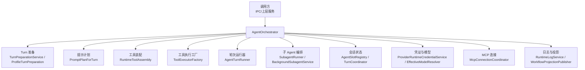
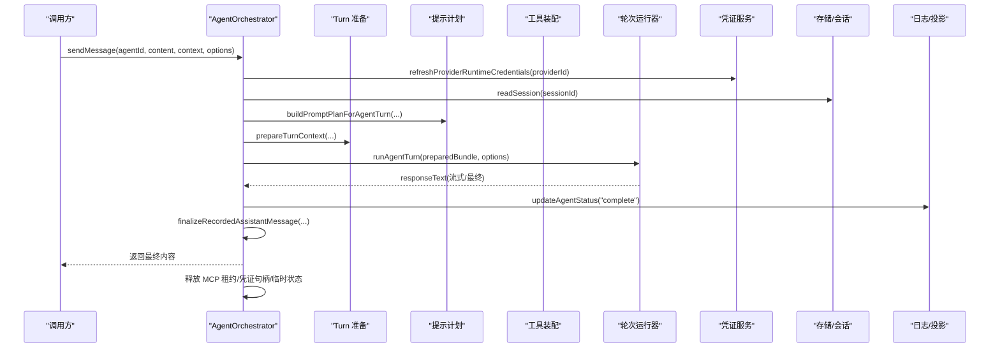
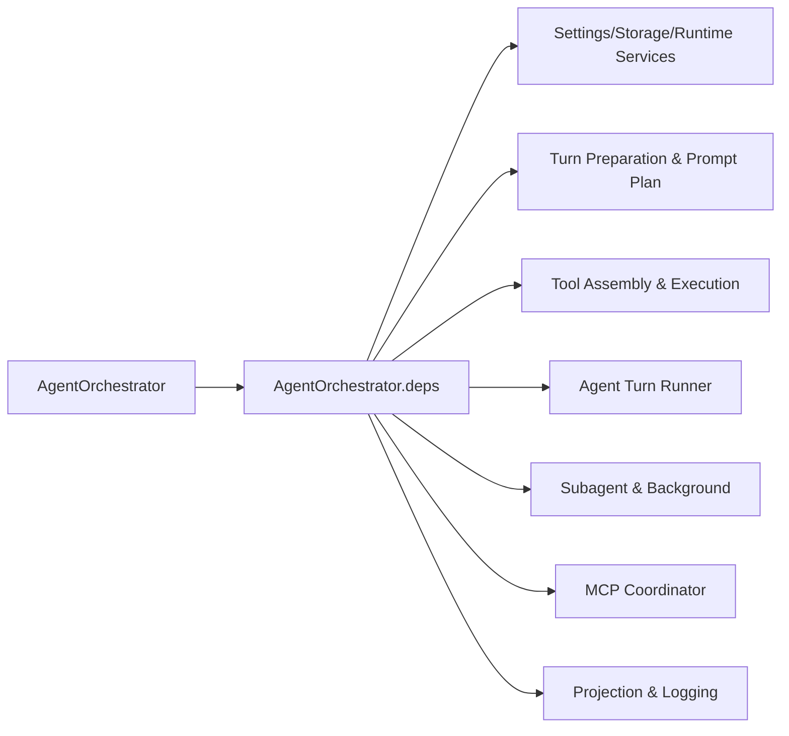

# AgentOrchestrator 核心协调器

<cite>
**本文引用的文件**
- [AgentOrchestrator.ts](file://src/main/workflow/debugger/AgentOrchestrator.ts)
- [AgentOrchestrator.deps.ts](file://src/main/workflow/debugger/AgentOrchestrator.deps.ts)
- [AgentSlotRegistry.ts](file://src/main/workflow/debugger/AgentSlotRegistry.ts)
- [agentHandlers.ts](file://src/main/ipc/agentHandlers.ts)
- [conversationHandlers.ts](file://src/main/ipc/conversationHandlers.ts)
- [TurnPreparationService.ts](file://src/main/workflow/debugger/TurnPreparationService.ts)
- [RuntimeToolAssembly.ts](file://src/main/workflow/debugger/RuntimeToolAssembly.ts)
- [ToolExecutorFactory.ts](file://src/main/workflow/debugger/ToolExecutorFactory.ts)
- [DebuggerRuntimePolicy.ts](file://src/main/workflow/debugger/DebuggerRuntimePolicy.ts)
- [ProviderRuntimeCredentialService.ts](file://src/main/settings/ProviderRuntimeCredentialService.ts)
- [ProviderRuntimeCredentialLease.ts](file://src/main/settings/ProviderRuntimeCredentialLease.ts)
- [EffectiveModelResolver.ts](file://src/main/settings/EffectiveModelResolver.ts)
- [ExecutionProfileService.ts](file://src/main/settings/ExecutionProfileService.ts)
- [SettingsService.ts](file://src/main/settings/SettingsService.ts)
- [StorageAdapter.ts](file://src/main/sessions/StorageAdapter.ts)
- [AppPathService.ts](file://src/main/runtime/AppPathService.ts)
- [RuntimeLogService.ts](file://src/main/runtime/RuntimeLogService.ts)
- [WorkflowProjectionPublisher.ts](file://src/main/workflow/debugger/WorkflowProjectionPublisher.ts)
- [SubagentRunner.ts](file://src/main/workflow/debugger/SubagentRunner.ts)
- [BackgroundSubagentService.ts](file://src/main/workflow/debugger/BackgroundSubagentService.ts)
- [McpConnectionCoordinator.ts](file://src/main/workflow/debugger/McpConnectionCoordinator.ts)
- [PromptPlanForTurn.ts](file://src/main/workflow/debugger/PromptPlanForTurn.ts)
- [AgentTurnRunner.ts](file://src/main/workflow/debugger/AgentTurnRunner.ts)
- [OrchestratorTestStubs.ts](file://src/main/workflow/debugger/OrchestratorTestStubs.ts)
- [AgentOrchestrator.preparedTurn.test.ts](file://src/main/workflow/debugger/AgentOrchestrator.preparedTurn.test.ts)
</cite>

## 目录
1. [简介](#简介)
2. [项目结构](#项目结构)
3. [核心组件](#核心组件)
4. [架构总览](#架构总览)
5. [详细组件分析](#详细组件分析)
6. [依赖关系分析](#依赖关系分析)
7. [性能考量](#性能考量)
8. [故障排查指南](#故障排查指南)
9. [结论](#结论)
10. [附录：API 与使用示例](#附录api-与使用示例)

## 简介
AgentOrchestrator 是编排系统的主入口，负责将“用户输入”转化为“可执行的 Agent Turn”，并协调会话、子 Agent、工具执行、凭证管理、提示词计划、状态投影等关键能力。它对外暴露简洁的 API（sendMessage、sendProfileMessage、prepareTurnContext、getAgentState、configureAgent 等），内部通过组合 Turn 准备、工具装配、运行器、子 Agent 与权限策略，完成端到端的消息处理与结果回传。

## 项目结构
AgentOrchestrator 位于主进程工作流调试层，作为 Facade 聚合多个子系统：
- 会话与状态：AgentSlotRegistry、TurnCoordinator、StorageAdapter
- 提示与计划：PromptPlanForTurn、TurnPreparationService、ProfileTurnPreparation
- 工具与执行：RuntimeToolAssembly、ToolExecutorFactory、AgentTurnRunner
- 子 Agent：SubagentRunner、BackgroundSubagentService
- 凭证与模型路由：ProviderRuntimeCredentialService/Lease、EffectiveModelResolver、ExecutionProfileService、SettingsService
- 外部集成：McpConnectionCoordinator、WorkflowProjectionPublisher、RuntimeLogService

图表来源
- [AgentOrchestrator.ts:75-145](file://src/main/workflow/debugger/AgentOrchestrator.ts#L75-L145)
- [AgentOrchestrator.deps.ts:1-64](file://src/main/workflow/debugger/AgentOrchestrator.deps.ts#L1-L64)

章节来源
- [AgentOrchestrator.ts:75-145](file://src/main/workflow/debugger/AgentOrchestrator.ts#L75-L145)
- [AgentOrchestrator.deps.ts:1-64](file://src/main/workflow/debugger/AgentOrchestrator.deps.ts#L1-L64)

## 核心组件
- AgentOrchestrator：编排门面，统一入口，管理生命周期、资源清理、状态更新与事件发布。
- AgentSlotRegistry：维护 Agent 配置、状态与执行槽位缓存，支持按会话/作用域隔离。
- TurnPreparationService / ProfileTurnPreparation：准备 Turn 上下文、工具白名单、初始消息、压缩阈值等。
- RuntimeToolAssembly / ToolExecutorFactory：组装运行时工具、校验允许列表、创建执行器。
- AgentTurnRunner：驱动一次 Agent Turn 的执行，包含流式输出、工具调用、终止条件等。
- SubagentRunner / BackgroundSubagentService：子 Agent 与后台任务编排。
- ProviderRuntimeCredentialService / Lease：冻结并复用凭证句柄，避免重复刷新。
- EffectiveModelResolver / ExecutionProfileService / SettingsService：解析有效模型、执行配置与全局设置。
- McpConnectionCoordinator：MCP 服务器连接与状态摘要。
- WorkflowProjectionPublisher / RuntimeLogService：状态投影与结构化日志。

章节来源
- [AgentOrchestrator.ts:75-145](file://src/main/workflow/debugger/AgentOrchestrator.ts#L75-L145)
- [AgentSlotRegistry.ts:51-152](file://src/main/workflow/debugger/AgentSlotRegistry.ts#L51-L152)
- [AgentOrchestrator.deps.ts:10-64](file://src/main/workflow/debugger/AgentOrchestrator.deps.ts#L10-L64)

## 架构总览
AgentOrchestrator 在发送消息时遵循以下主线：
- 计算执行作用域键（会话或临时作用域）
- 获取/合并 Agent 配置与有效 Profile
- 刷新 Provider 凭证并锁定句柄
- 构建 Prompt Plan 与请求计划（含推理级别、上下文模式、温度等）
- 准备 Turn 上下文（工具白名单、初始消息、压缩阈值、运行时环境）
- 运行 Agent Turn（流式响应、工具调用、终止条件）
- 记录助手消息、更新状态、释放资源（MCP 租约、凭证句柄、临时状态）

图表来源
- [AgentOrchestrator.ts:195-366](file://src/main/workflow/debugger/AgentOrchestrator.ts#L195-L366)
- [AgentOrchestrator.deps.ts:10-64](file://src/main/workflow/debugger/AgentOrchestrator.deps.ts#L10-L64)

## 详细组件分析

### 消息发送流程：sendMessage
- 职责：接收用户消息，完成凭证刷新、模型路由、提示计划、Turn 准备与执行，最终记录并返回结果。
- 关键步骤：
  - 计算执行作用域键（会话或临时作用域）
  - 获取或创建 Agent 配置，合并有效 Profile 指令与模型信息
  - 刷新 Provider 凭证并持有句柄，必要时重新解析有效 Profile
  - 构建请求计划（推理级别、上下文模式、温度、压缩阈值）
  - 构建提示计划（系统提示、工具白名单、技能预加载）
  - 准备 Turn 上下文（初始消息、运行时环境、MCP 租约）
  - 运行 Agent Turn（携带工具白名单、请求计划、上下文窗口、压缩阈值）
  - 记录助手消息、更新状态为 complete，释放资源
- 错误处理：
  - 若未找到有效 Profile，抛出 AGENT_PROFILE_UNAVAILABLE
  - 若模型不可用，抛出 MODEL_UNAVAILABLE
  - 若提示计划不可用，抛出 PROMPT_PLAN_UNAVAILABLE
  - 捕获异常后更新状态为 error，并在 finally 中释放资源
- 资源清理：
  - 释放 MCP 租约（preparedLeaseRelease）
  - 释放凭证句柄
  - 清理临时作用域的 Agent 状态

章节来源
- [AgentOrchestrator.ts:195-366](file://src/main/workflow/debugger/AgentOrchestrator.ts#L195-L366)
- [AgentOrchestrator.ts:725-741](file://src/main/workflow/debugger/AgentOrchestrator.ts#L725-L741)
- [AgentOrchestrator.ts:743-776](file://src/main/workflow/debugger/AgentOrchestrator.ts#L743-L776)

### 配置文件消息：sendProfileMessage
- 职责：用于 Profile Turn（如子 Agent、后台任务、手递手场景），支持传入已准备的 Turn 上下文、冻结的请求计划、额外提示片段等。
- 关键特性：
  - 支持 routeAgentId 与 modelOverride，灵活选择路由与模型
  - 支持 excludeRdcLeaseTools 过滤特定工具
  - 支持 frozenDelegationCapsule.reasoningLevel 约束推理级别
  - 支持 onTerminalContext 回调，提供终端上下文统计与完成声明
  - 自动记录日志并更新状态
- 错误处理：
  - 缺少凭证句柄时抛出 CREDENTIAL_HANDLE_REQUIRED
  - 未找到有效 Profile 抛出 AGENT_PROFILE_UNAVAILABLE
  - 模型不可用抛出 MODEL_UNAVAILABLE
  - 提示计划不可用抛出 PROMPT_PLAN_UNAVAILABLE
  - reasoning level 不兼容时抛出 DELEGATION_REASONING_UNSUPPORTED
- 资源清理：
  - 释放 MCP 租约与凭证句柄，清理临时状态

章节来源
- [AgentOrchestrator.ts:384-634](file://src/main/workflow/debugger/AgentOrchestrator.ts#L384-L634)

### 上下文准备：prepareTurnContext
- 职责：将输入参数转换为 PreparedAgentTurnContext，供后续 runAgentTurn 使用。
- 关键点：
  - 委托给 TurnPreparationService.prepareTurnContext
  - 返回包含 summary、effectiveModel、toolAllowlist、initialMessages、contextDiagnostic、runtime 等信息的结构化上下文
- 典型用途：
  - 测试与预览：在不实际执行的情况下评估 Token 预算、上下文窗口、缓存策略
  - 子 Agent 与后台任务：复用已准备的上下文以保持一致性

章节来源
- [AgentOrchestrator.ts:380-382](file://src/main/workflow/debugger/AgentOrchestrator.ts#L380-L382)
- [AgentOrchestrator.preparedTurn.test.ts:182-200](file://src/main/workflow/debugger/AgentOrchestrator.preparedTurn.test.ts#L182-L200)

### 子 Agent 协调
- 职责：通过 SubagentRunner 与 BackgroundSubagentService 启动与管理子 Agent，支持后台执行与工具注入。
- 关键点：
  - createSubagentTools：为父 Agent 生成可调用子 Agent 的工具
  - runSubagent：执行子 Agent 并返回结果
  - backgroundSubagents.start：启动后台任务，要求父会话存在
- 权限与安全：
  - 后台执行需具备会话上下文与任务树范围校验
  - 工具权限由运行时策略控制

章节来源
- [AgentOrchestrator.ts:96-103](file://src/main/workflow/debugger/AgentOrchestrator.ts#L96-L103)
- [AgentOrchestrator.ts:636-637](file://src/main/workflow/debugger/AgentOrchestrator.ts#L636-L637)
- [BackgroundSubagentService.ts:370-385](file://src/main/workflow/debugger/BackgroundSubagentService.ts#L370-L385)

### 状态管理与会话同步
- AgentSlotRegistry：
  - 维护 Agent 配置、状态、执行槽位与隔离作用域
  - 支持 rehydrate/flush 以对齐磁盘与内存历史
  - 支持 purgeAgentStatesForScope 清理临时作用域状态
- 会话同步：
  - syncSessionSlots：同步会话并清理延迟激活工具的状态
- 状态投影：
  - updateAgentStatus 同时写入 RuntimeLogService 与 WorkflowProjectionPublisher

章节来源
- [AgentSlotRegistry.ts:51-152](file://src/main/workflow/debugger/AgentSlotRegistry.ts#L51-L152)
- [AgentOrchestrator.ts:177-185](file://src/main/workflow/debugger/AgentOrchestrator.ts#L177-L185)
- [AgentOrchestrator.ts:725-741](file://src/main/workflow/debugger/AgentOrchestrator.ts#L725-L741)

### Provider 凭证管理
- 冻结与复用：
  - freezeProviderRuntimeCredentials：冻结 Provider 凭证并返回句柄
  - refreshProviderRuntimeCredentials：刷新凭证并应用 LLM 配置变更
  - releaseProviderRuntimeCredentials：释放句柄
- 与模型路由联动：
  - EffectiveModelResolver：根据设置与路由解析有效模型
  - ExecutionProfileService：解析 Agent 运行时 Profile
- 安全与审计：
  - 凭证句柄在 finally 中确保释放
  - 日志记录 providerId/modelId 等元数据

章节来源
- [AgentOrchestrator.ts:368-378](file://src/main/workflow/debugger/AgentOrchestrator.ts#L368-L378)
- [ProviderRuntimeCredentialService.ts:1-93](file://src/main/settings/ProviderRuntimeCredentialService.ts#L1-L93)
- [ProviderRuntimeCredentialLease.ts:1-200](file://src/main/settings/ProviderRuntimeCredentialLease.ts#L1-L200)
- [EffectiveModelResolver.ts:1-200](file://src/main/settings/EffectiveModelResolver.ts#L1-L200)
- [ExecutionProfileService.ts:1-200](file://src/main/settings/ExecutionProfileService.ts#L1-L200)

### 工具权限控制
- 白名单与策略：
  - resolveAgentToolAllowlistFromDefinition：从 Profile 定义解析工具白名单
  - isToolAllowedForAgent：校验工具是否对 Agent 可用
  - DebuggerRuntimePolicy：运行时策略（归一化工具名、权限判定）
- 延迟激活：
  - DeferredToolActivationTracker：延迟激活 MCP 与扩展内置工具
- 工具装配与执行：
  - RuntimeToolAssembly：组装运行时工具集
  - ToolExecutorFactory：创建工具执行器，支持并发与预算预留

章节来源
- [AgentOrchestrator.ts:251-252](file://src/main/workflow/debugger/AgentOrchestrator.ts#L251-L252)
- [AgentOrchestrator.ts:169-175](file://src/main/workflow/debugger/AgentOrchestrator.ts#L169-L175)
- [DebuggerRuntimePolicy.ts:1-200](file://src/main/workflow/debugger/DebuggerRuntimePolicy.ts#L1-L200)
- [RuntimeToolAssembly.ts:1-200](file://src/main/workflow/debugger/RuntimeToolAssembly.ts#L1-L200)
- [ToolExecutorFactory.ts:1-200](file://src/main/workflow/debugger/ToolExecutorFactory.ts#L1-L200)

## 依赖关系分析
AgentOrchestrator 通过 deps 模块集中导入协作对象，降低耦合度并保持单一职责：
- 类型与常量：@shared/types、@shared/constants
- 运行时服务：SettingsService、StorageAdapter、AppPathService、RuntimeLogService
- 凭证与模型：ProviderRuntimeCredentialService、EffectiveModelResolver、ExecutionProfileService
- 工作流组件：TurnPreparationService、PromptPlanForTurn、RuntimeToolAssembly、ToolExecutorFactory、AgentTurnRunner、SubagentRunner、BackgroundSubagentService、McpConnectionCoordinator、WorkflowProjectionPublisher

图表来源
- [AgentOrchestrator.deps.ts:1-64](file://src/main/workflow/debugger/AgentOrchestrator.deps.ts#L1-L64)

章节来源
- [AgentOrchestrator.deps.ts:1-64](file://src/main/workflow/debugger/AgentOrchestrator.deps.ts#L1-L64)

## 性能考量
- 上下文窗口与压缩：
  - 通过 planEffectiveModelRequest 计算 contextWindowTokens 与 compactionThresholdTokens
  - 避免不必要的上下文膨胀，提升吞吐与稳定性
- 凭证冻结与复用：
  - 减少频繁刷新导致的开销与不一致
- 工具延迟激活：
  - 按需激活 MCP 与扩展工具，降低启动成本
- 流式输出：
  - 使用 AgentTurnRunner 的流式能力，提升交互体验
- 作用域隔离：
  - 临时作用域状态及时清理，避免内存泄漏

[本节为通用指导，无需具体文件引用]

## 故障排查指南
- 常见问题与定位：
  - AGENT_PROFILE_UNAVAILABLE：检查 Agent 是否启用且有效
  - MODEL_UNAVAILABLE：检查模型路由与设置是否匹配
  - PROMPT_PLAN_UNAVAILABLE：检查提示计划构建是否成功
  - CREDENTIAL_HANDLE_REQUIRED：确保在 profile turn 准备前已刷新并持有凭证句柄
  - DELEGATION_REASONING_UNSUPPORTED：检查冻结委派胶囊的推理级别是否与所选路由兼容
- 日志与投影：
  - RuntimeLogService：记录状态变化与关键元数据
  - WorkflowProjectionPublisher：发布 Agent 状态与消息，便于 UI 与追踪
- 资源泄漏排查：
  - 确认 finally 块中释放 MCP 租约与凭证句柄
  - 检查临时作用域状态是否被清理

章节来源
- [AgentOrchestrator.ts:356-365](file://src/main/workflow/debugger/AgentOrchestrator.ts#L356-L365)
- [AgentOrchestrator.ts:624-633](file://src/main/workflow/debugger/AgentOrchestrator.ts#L624-L633)
- [AgentOrchestrator.ts:725-741](file://src/main/workflow/debugger/AgentOrchestrator.ts#L725-L741)

## 结论
AgentOrchestrator 作为编排系统的主入口，提供了清晰、稳定、可扩展的消息处理能力。它通过组合 Turn 准备、工具装配、运行器、子 Agent 与权限策略，实现了完整的 Agent 生命周期管理。其设计强调资源安全（凭证句柄与 MCP 租约）、上下文优化（窗口与压缩）、以及可观测性（日志与投影）。在实际使用中，建议严格遵循 API 约定，合理配置模型与工具权限，并利用 prepareTurnContext 进行预演与诊断。

[本节为总结性内容，无需具体文件引用]

## 附录：API 与使用示例

### IPC 集成示例
- agent:sendMessage
  - 入参：agentId、content
  - 行为：构造 runContext（caseId/runId/sessionId/projectInfo），调用 agentOrchestrator.sendMessage，并绑定 AbortSignal
  - 返回：{ response } 或 { response: undefined, error }
- agent:getState / agent:getAllStates / agent:configure
  - 查询与配置 Agent 状态与运行时设置

章节来源
- [agentHandlers.ts:17-88](file://src/main/ipc/agentHandlers.ts#L17-L88)

### ConversationService 集成
- conversation:sendMessage
  - 通过 ConversationService.sendMessage 进入对话循环，内部可能调用 AgentOrchestrator 的 sendProfileMessage 或 sendMessage
  - 适用于多轮对话、分支与附件处理

章节来源
- [conversationHandlers.ts:43-51](file://src/main/ipc/conversationHandlers.ts#L43-L51)

### 使用 AgentOrchestrator 的典型流程
- 初始化：创建 AgentOrchestrator 实例（或通过单例 agentOrchestrator）
- 配置：configureAgent(agentId, config) 设置系统提示、模型与温度
- 发送消息：sendMessage(agentId, content, context, options)
- 准备上下文：prepareTurnContext(input) 用于预演与诊断
- 子 Agent：runSubagent(input) 与 createSubagentTools(...)
- 资源清理：abortAndJoin(sessionId, options) 中止并等待结束

章节来源
- [AgentOrchestrator.ts:155-167](file://src/main/workflow/debugger/AgentOrchestrator.ts#L155-L167)
- [AgentOrchestrator.ts:195-366](file://src/main/workflow/debugger/AgentOrchestrator.ts#L195-L366)
- [AgentOrchestrator.ts:380-382](file://src/main/workflow/debugger/AgentOrchestrator.ts#L380-L382)
- [AgentOrchestrator.ts:636-653](file://src/main/workflow/debugger/AgentOrchestrator.ts#L636-L653)

### 关键方法说明
- sendMessage(agentId, content, context?, options?)
  - 功能：发送用户消息并完成一轮 Agent 执行
  - 参数：
    - agentId：目标 Agent 角色
    - content：用户输入文本
    - context：可选上下文（sessionId、projectId、projectRootPath、turnId、runId）
    - options：可选选项（signal、reasoning、turnControls、preloadSkillIds 等）
  - 返回：最终响应文本
- sendProfileMessage(agentId, content, options?)
  - 功能：执行 Profile Turn（子 Agent、后台任务、手递手）
  - 参数：
    - agentId：目标 Agent 角色
    - content：输入文本
    - options：preparedTurn、requestPlan、modelOverride、excludeRdcLeaseTools、frozenDelegationCapsule、onTerminalContext 等
  - 返回：最终响应文本
- prepareTurnContext(input)
  - 功能：准备 Turn 上下文，返回 PreparedAgentTurnContext
  - 参数：TurnPreparationService 的输入结构
  - 返回：包含 summary、effectiveModel、toolAllowlist、initialMessages、contextDiagnostic、runtime 的结构化上下文

章节来源
- [AgentOrchestrator.ts:195-366](file://src/main/workflow/debugger/AgentOrchestrator.ts#L195-L366)
- [AgentOrchestrator.ts:384-634](file://src/main/workflow/debugger/AgentOrchestrator.ts#L384-L634)
- [AgentOrchestrator.ts:380-382](file://src/main/workflow/debugger/AgentOrchestrator.ts#L380-L382)

### 错误处理策略
- 统一在 try/catch 中捕获异常，更新状态为 error，并在 finally 中释放资源
- 明确错误码与用户友好消息（AGENT_PROFILE_UNAVAILABLE、MODEL_UNAVAILABLE、PROMPT_PLAN_UNAVAILABLE、CREDENTIAL_HANDLE_REQUIRED、DELEGATION_REASONING_UNSUPPORTED）
- 通过 RuntimeLogService 与 WorkflowProjectionPublisher 记录错误与状态

章节来源
- [AgentOrchestrator.ts:356-365](file://src/main/workflow/debugger/AgentOrchestrator.ts#L356-L365)
- [AgentOrchestrator.ts:624-633](file://src/main/workflow/debugger/AgentOrchestrator.ts#L624-L633)
- [AgentOrchestrator.ts:725-741](file://src/main/workflow/debugger/AgentOrchestrator.ts#L725-L741)

### 资源清理机制
- MCP 租约：preparedLeaseRelease 在 finally 中释放
- 凭证句柄：providerRuntimeCredentialService.release 在 finally 中释放
- 临时作用域状态：releaseTransientAgentState 清理临时 Agent 状态
- 会话同步：syncSessionSlots 清理延迟激活工具状态

章节来源
- [AgentOrchestrator.ts:311-313](file://src/main/workflow/debugger/AgentOrchestrator.ts#L311-L313)
- [AgentOrchestrator.ts:359-365](file://src/main/workflow/debugger/AgentOrchestrator.ts#L359-L365)
- [AgentOrchestrator.ts:182-185](file://src/main/workflow/debugger/AgentOrchestrator.ts#L182-L185)
- [AgentOrchestrator.ts:177-180](file://src/main/workflow/debugger/AgentOrchestrator.ts#L177-L180)