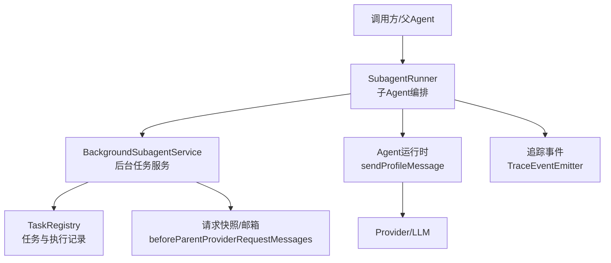
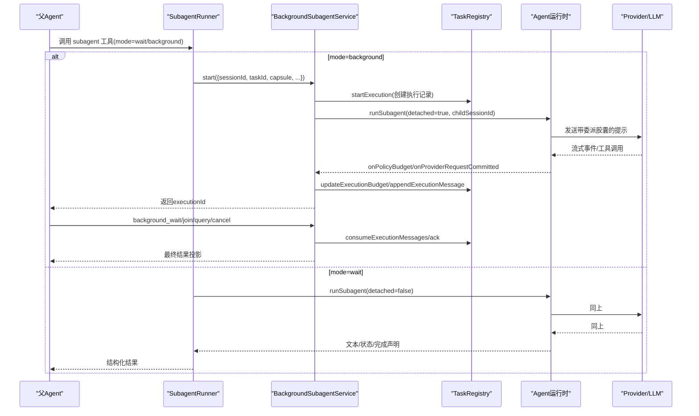
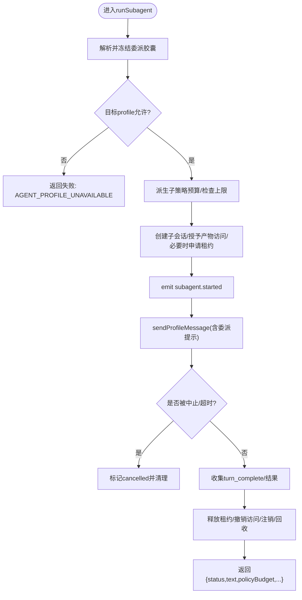
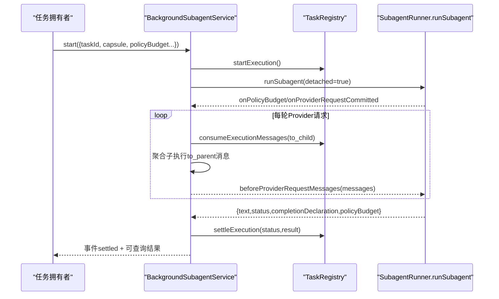

# 子 Agent 执行器

<cite>
**本文引用的文件**
- [SubagentRunner.ts](file://src/main/workflow/debugger/SubagentRunner.ts)
- [BackgroundSubagentService.ts](file://src/main/workflow/debugger/BackgroundSubagentService.ts)
- [TaskContracts.ts](file://src/main/agent-runtime/tasks/TaskContracts.ts)
- [taskProjection.ts](file://src/main/agent-runtime/tasks/taskProjection.ts)
- [DelegationCapsuleCompiler.ts](file://src/main/agent-runtime/prompt/DelegationCapsuleCompiler.ts)
- [delegationCapsule.ts](file://src/shared/types/delegationCapsule.ts)
- [TraceEventEmitter.ts](file://src/main/agent-trace/TraceEventEmitter.ts)
- [TurnCoordinator.ts](file://src/main/workflow/debugger/TurnCoordinator.ts)
- [DelegationBudget.test.ts](file://src/main/workflow/debugger/DelegationBudget.test.ts)
- [BackgroundApprovalAcceptance.test.ts](file://src/main/workflow/debugger/BackgroundApprovalAcceptance.test.ts)
- [BackgroundSubagentAcceptance.test.ts](file://src/main/workflow/debugger/BackgroundSubagentAcceptance.test.ts)
</cite>

## 目录
1. [简介](#简介)
2. [项目结构](#项目结构)
3. [核心组件](#核心组件)
4. [架构总览](#架构总览)
5. [详细组件分析](#详细组件分析)
6. [依赖关系分析](#依赖关系分析)
7. [性能与资源管理](#性能与资源管理)
8. [故障排查指南](#故障排查指南)
9. [结论](#结论)
10. [附录：示例工作流](#附录示例工作流)

## 简介
本文件聚焦于“子 Agent 执行器”的完整生命周期与后台任务能力，围绕以下目标展开：
- 解释 SubagentRunner 的子任务创建、启动、监控与销毁流程。
- 说明 BackgroundSubagentService 的异步执行、结果聚合、错误传播机制。
- 阐述父子 Agent 之间的通信协议、数据共享与权限继承。
- 覆盖资源隔离、内存管理与性能优化等高级主题。
- 提供可操作的复杂子 Agent 工作流示例（以代码片段路径引用为主）。

## 项目结构
与子 Agent 执行器直接相关的模块主要位于主进程的工作流调试层与任务运行时之间：
- 子 Agent 编排与工具暴露：SubagentRunner
- 后台任务服务与持久化：BackgroundSubagentService
- 任务与执行记录模型：TaskRegistry（通过 TaskContracts 定义）
- 委派胶囊与提示编译：DelegationCapsuleCompiler / delegationCapsule
- 追踪事件发射：TraceEventEmitter
- 预算与策略控制：TurnCoordinator 与 DelegationBudget



图表来源
- [SubagentRunner.ts:80-429](file://src/main/workflow/debugger/SubagentRunner.ts#L80-L429)
- [BackgroundSubagentService.ts:65-281](file://src/main/workflow/debugger/BackgroundSubagentService.ts#L65-L281)
- [TaskContracts.ts:45-100](file://src/main/agent-runtime/tasks/TaskContracts.ts#L45-L100)
- [TraceEventEmitter.ts:127-175](file://src/main/agent-trace/TraceEventEmitter.ts#L127-L175)

章节来源
- [SubagentRunner.ts:1-680](file://src/main/workflow/debugger/SubagentRunner.ts#L1-L680)
- [BackgroundSubagentService.ts:1-427](file://src/main/workflow/debugger/BackgroundSubagentService.ts#L1-L427)
- [TaskContracts.ts:45-100](file://src/main/agent-runtime/tasks/TaskContracts.ts#L45-L100)

## 核心组件
- SubagentRunner：负责解析委派胶囊、校验代理权限、构建子会话、注入预算与信号、转发事件、清理资源，并暴露 subagent 工具。
- BackgroundSubagentService：将子 Agent 的执行转为可恢复的后台任务，维护执行状态、消息邮箱、预算同步、结果持久化与查询/等待/取消工具。
- TaskRegistry（契约）：持久化任务树与执行记录，承载消息投递、状态机推进、预算更新与结算。
- DelegationCapsule：严格校验的委派参数，包含目标、范围、输入产物引用、输出要求、预算与技能等。
- TraceEventEmitter：将子 Agent 生命周期事件写入追踪系统，便于 UI 与审计。

章节来源
- [SubagentRunner.ts:71-429](file://src/main/workflow/debugger/SubagentRunner.ts#L71-L429)
- [BackgroundSubagentService.ts:37-281](file://src/main/workflow/debugger/BackgroundSubagentService.ts#L37-L281)
- [TaskContracts.ts:45-100](file://src/main/agent-runtime/tasks/TaskContracts.ts#L45-L100)
- [delegationCapsule.ts:1-44](file://src/shared/types/delegationCapsule.ts#L1-L44)
- [TraceEventEmitter.ts:127-175](file://src/main/agent-trace/TraceEventEmitter.ts#L127-L175)

## 架构总览
子 Agent 执行分为两条路径：
- 同步 wait：在当前回复中阻塞等待子 Agent 完成，适合短小且需立即返回的任务。
- 异步 background：立即返回 executionId，后台独立运行，支持中断恢复、消息邮箱、结果持久化与查询。



图表来源
- [SubagentRunner.ts:80-429](file://src/main/workflow/debugger/SubagentRunner.ts#L80-L429)
- [BackgroundSubagentService.ts:65-281](file://src/main/workflow/debugger/BackgroundSubagentService.ts#L65-L281)
- [TaskContracts.ts:45-100](file://src/main/agent-runtime/tasks/TaskContracts.ts#L45-L100)

## 详细组件分析

### SubagentRunner：子任务生命周期
- 创建与授权
  - 解析并冻结委派胶囊，校验目标 profile 可用性与代理委派白名单。
  - 计算子策略预算，限制最大深度、子 Agent 数量与墙钟时间。
- 会话与资源隔离
  - 为子 Agent 生成独立 sessionId（或临时作用域），避免污染父线程持久化。
  - 基于委派胶囊授予受限的产物读取权限；如需 RDC 能力则申请租约。
- 启动与监控
  - 向父级 emit subagent.started；在 turn_complete 时收集完成声明。
  - 将子 Agent 的工具调用事件转换为 subagent.delta 上报，统计唯一 toolCallId 以避免重复计数。
  - 使用 AbortController 与超时定时器实现强制中止。
- 销毁与清理
  - 加入进程执行集合，释放租约、撤销产物访问、注销生产者、移除监听。
  - 将子预算用量回写至父预算，确保聚合统计正确。



图表来源
- [SubagentRunner.ts:80-429](file://src/main/workflow/debugger/SubagentRunner.ts#L80-L429)

章节来源
- [SubagentRunner.ts:80-429](file://src/main/workflow/debugger/SubagentRunner.ts#L80-L429)

### BackgroundSubagentService：后台任务能力
- 启动与注册
  - 根据 taskId 向上追溯根任务，计算子树 ID 集合并绑定根预算。
  - 创建执行记录，保存 live 控制器与 promise，注册取消所有者。
  - 发出 started 事件，开始 execute。
- 执行与消息邮箱
  - 追加 to_parent 进度消息；构造增强型 outputRequirements。
  - beforeProviderRequestMessages：每次请求前消费 to_child 消息与子执行 to_parent 消息，进行有界聚合与确认提交。
  - 订阅策略预算变化，周期性 checkpoint 到执行记录。
- 结果聚合与持久化
  - 将文本与完成声明持久化为受保护的产物 URI+hash，必要时授予父会话读取。
  - 规范化结果为 envelope，映射到 TaskRegistry 的最终状态（completed/partial/blocked/failed/cancelled）。
  - 追加 result 消息并触发 settled 事件。
- 查询与协作工具
  - background_query：一次性读取执行投影。
  - background_wait：事件驱动 join，支持外部 abort。
  - background_result：读取结构化结果与消息游标。
  - background_message：向执行邮箱追加有界数据。
  - background_cancel/background_join：安全终止或仅等待。



图表来源
- [BackgroundSubagentService.ts:65-281](file://src/main/workflow/debugger/BackgroundSubagentService.ts#L65-L281)
- [TaskContracts.ts:45-100](file://src/main/agent-runtime/tasks/TaskContracts.ts#L45-L100)

章节来源
- [BackgroundSubagentService.ts:65-281](file://src/main/workflow/debugger/BackgroundSubagentService.ts#L65-L281)
- [BackgroundSubagentService.ts:370-405](file://src/main/workflow/debugger/BackgroundSubagentService.ts#L370-L405)

### 父子通信协议与数据共享
- 事件通道
  - subagent.started/delta/completed 由 SubagentRunner 上报，供追踪与 UI 展示。
  - approval.requested/answered 透传，支持子 Agent 中的高权限操作审批。
- 消息邮箱
  - to_child：父向子投递指令/上下文（有界长度与条数限制）。
  - to_parent：子向父汇报进展/决策/结果（有界长度与条数限制）。
  - 通过 ack 序列号保证幂等与断点续传。
- 数据共享
  - 委派胶囊 inputArtifactRefs/challengeRefs/acceptedFacts.sourceRefs 作为只读产物引用，按会话粒度授权。
  - 后台结果以 session://tool-outputs/* 形式持久化，并通过 grantDelegatedOutput 授予父会话精确读取。
- 权限继承
  - 子会话继承父会话的委派任务范围与产物访问白名单；若需要 RDC 能力，必须显式申请租约并在完成后释放。

章节来源
- [SubagentRunner.ts:179-382](file://src/main/workflow/debugger/SubagentRunner.ts#L179-L382)
- [BackgroundSubagentService.ts:159-212](file://src/main/workflow/debugger/BackgroundSubagentService.ts#L159-L212)
- [delegationCapsule.ts:11-22](file://src/shared/types/delegationCapsule.ts#L11-L22)
- [TraceEventEmitter.ts:127-175](file://src/main/agent-trace/TraceEventEmitter.ts#L127-L175)

### 预算与策略控制
- 子预算派生
  - deriveChildPolicyBudget 从父策略预算派生子预算，保留祖先已用时间与上限，防止刷新截止时间。
  - 子预算对工具调用、子 Agent 数量、深度进行更严格的限制，但不缩小父预算。
- 预分配与原子性
  - reserveDispatchBudget/consumeReservedSubagentSlot 保证跨兄弟与嵌套子任务的原子扣减，避免重复计费。
- 持久化同步
  - 后台执行通过 registerPolicyBudgetObserver 将子预算快照回写到 TaskRegistry，支持重启后恢复。

章节来源
- [DelegationBudget.test.ts:1-37](file://src/main/workflow/debugger/DelegationBudget.test.ts#L1-L37)
- [BackgroundSubagentService.ts:141-158](file://src/main/workflow/debugger/BackgroundSubagentService.ts#L141-L158)
- [SubagentRunner.ts:134-153](file://src/main/workflow/debugger/SubagentRunner.ts#L134-L153)

## 依赖关系分析
- SubagentRunner 依赖：
  - TurnCoordinator（预算、TurnHandle）、DelegationBudget（预算派生/观察）、RdcRuntimeContextRegistry（租约）、TaskRegistry（任务/执行）、DelegationCapsuleCompiler（提示编译）、ProcessSupervisor（进程协调）。
- BackgroundSubagentService 依赖：
  - TaskRegistry（任务/执行/消息）、requestSnapshotStore（请求快照/邮箱交付）、DelegationBudget（预算链/观察）、SubagentResultEnvelope（结果归一化/持久化）、TaskRootBudget（根预算绑定）。
- 耦合与内聚
  - 两者通过明确的接口解耦：SubagentRunner 暴露 runSubagent，BackgroundSubagentService 通过 createBackgroundSubagentService 注入该函数。
  - 任务与执行记录集中在 TaskRegistry，降低状态分散风险。

```mermaid
classDiagram
class SubagentRunner {
+runSubagent(input) Promise
+createSubagentTools(...)
+setBackgroundStarter(fn)
}
class BackgroundSubagentService {
+start(input) Promise
+query(sessionId, executionId)
+messages(sessionId, executionId, cursor)
+postMessage(sessionId, executionId, generation, body)
+beforeParentProviderRequestMessages(sessionId)
+join(executionId)
+cancel(sessionId, executionId)
+createTools(...)
}
class TaskRegistry {
+startExecution(taskId, options)
+updateExecutionBudget(...)
+settleExecution(...)
+consumeExecutionMessages(...)
+appendExecutionMessage(...)
}
SubagentRunner --> BackgroundSubagentService : "可选 : 通过starter集成"
BackgroundSubagentService --> TaskRegistry : "读写执行/消息/预算"
SubagentRunner --> TaskRegistry : "任务范围/执行绑定"
```

图表来源
- [SubagentRunner.ts:71-679](file://src/main/workflow/debugger/SubagentRunner.ts#L71-L679)
- [BackgroundSubagentService.ts:37-405](file://src/main/workflow/debugger/BackgroundSubagentService.ts#L37-L405)
- [TaskContracts.ts:45-100](file://src/main/agent-runtime/tasks/TaskContracts.ts#L45-L100)

章节来源
- [SubagentRunner.ts:71-679](file://src/main/workflow/debugger/SubagentRunner.ts#L71-L679)
- [BackgroundSubagentService.ts:37-405](file://src/main/workflow/debugger/BackgroundSubagentService.ts#L37-L405)

## 性能与资源管理
- 资源隔离
  - 子会话隔离：子 Agent 使用独立 sessionId，避免污染父线程持久化与消息。
  - 产物访问最小化：仅授予委派胶囊中明确列出的 session:// 引用，禁止越权读取。
- 内存与体积控制
  - 委派胶囊大小限制与冻结，防止超大 payload 与意外修改。
  - 消息邮箱分页与字节限制（单次最多 32 条、约 16KB），避免大消息阻塞。
  - 后台消息体限制（单次 8000 字符），防止滥用。
- 并发与限流
  - 策略预算限制 maxToolCalls/maxSubagents/maxChildDepth/maxWallTimeMs，防止资源耗尽。
  - 子 Agent 工具调用去重计数，避免重复统计导致提前耗尽。
- 可恢复性
  - 执行记录与消息邮箱持久化，重启后可恢复未确认的消息与状态。
  - 根预算绑定与预算观察者，确保跨重启的预算一致性。

章节来源
- [delegationCapsule.ts:6-31](file://src/shared/types/delegationCapsule.ts#L6-L31)
- [BackgroundSubagentService.ts:159-212](file://src/main/workflow/debugger/BackgroundSubagentService.ts#L159-L212)
- [BackgroundSubagentService.ts:293-297](file://src/main/workflow/debugger/BackgroundSubagentService.ts#L293-L297)
- [SubagentRunner.ts:294-303](file://src/main/workflow/debugger/SubagentRunner.ts#L294-L303)

## 故障排查指南
- 常见错误与定位
  - AGENT_PROFILE_UNAVAILABLE：目标 profile 不可用或未启用，检查有效配置与路由。
  - POLICY_LIMIT_EXCEEDED：超出工具调用/子 Agent/深度/时间上限，调整预算或拆分任务。
  - ARTIFACT_SESSION_DENIED：子 Agent 尝试访问无授权的产物，检查 inputArtifactRefs 与委派范围。
  - BACKGROUND_SHUTTING_DOWN：服务关闭期间拒绝新执行，等待服务就绪或重试。
  - TASK_SCOPE_DENIED：嵌套委派的目标不在当前委派任务子树内，修正 taskId 或 rootTaskId。
- 诊断步骤
  - 使用 background_query 查看执行状态与结果投影。
  - 使用 messages 拉取未消费的消息游标，结合 beforeParentProviderRequestMessages 查看聚合内容。
  - 通过 approval.requested/answered 事件定位高权限操作卡点。
  - 检查 TaskRegistry 的执行记录与预算字段，确认是否因预算耗尽而失败。

章节来源
- [BackgroundSubagentService.ts:65-133](file://src/main/workflow/debugger/BackgroundSubagentService.ts#L65-L133)
- [BackgroundSubagentService.ts:298-342](file://src/main/workflow/debugger/BackgroundSubagentService.ts#L298-L342)
- [BackgroundApprovalAcceptance.test.ts:19-50](file://src/main/workflow/debugger/BackgroundApprovalAcceptance.test.ts#L19-L50)

## 结论
子 Agent 执行器通过 SubagentRunner 与 BackgroundSubagentService 的协同，实现了：
- 安全的子任务生命周期管理（创建、启动、监控、销毁）。
- 可靠的后台任务能力（异步执行、消息邮箱、结果持久化、查询/等待/取消）。
- 清晰的父子通信协议（事件、消息、产物引用）与权限继承（任务范围、产物白名单、租约）。
- 完善的预算与资源控制（策略预算、消息有界、会话隔离、可恢复性）。
这些特性共同支撑了复杂的多 Agent 工作流的稳定与可控执行。

## 附录：示例工作流
以下示例以代码片段路径引用方式呈现，便于在实际仓库中定位实现与测试用例：

- 创建并启动后台子任务
  - 参考：[BackgroundSubagentService.start:65-133](file://src/main/workflow/debugger/BackgroundSubagentService.ts#L65-L133)
  - 参考：[SubagentRunner.createSubagentTools 工具执行:431-679](file://src/main/workflow/debugger/SubagentRunner.ts#L431-L679)
- 等待与查询后台任务
  - 参考：[BackgroundSubagentService.background_wait/join/query:386-404](file://src/main/workflow/debugger/BackgroundSubagentService.ts#L386-L404)
  - 参考：[BackgroundSubagentService.messages/postMessage:284-297](file://src/main/workflow/debugger/BackgroundSubagentService.ts#L284-L297)
- 处理审批与决策
  - 参考：[BackgroundApprovalAcceptance 测试用例:19-50](file://src/main/workflow/debugger/BackgroundApprovalAcceptance.test.ts#L19-L50)
- 嵌套委派与任务范围约束
  - 参考：[BackgroundApprovalAcceptance 嵌套委派测试:52-69](file://src/main/workflow/debugger/BackgroundApprovalAcceptance.test.ts#L52-L69)
- 预算继承与恢复
  - 参考：[BackgroundSubagentAcceptance 预算恢复测试:84-95](file://src/main/workflow/debugger/BackgroundSubagentAcceptance.test.ts#L84-L95)
- 追踪子 Agent 事件
  - 参考：[TraceEventEmitter.emitSubAgent:127-175](file://src/main/agent-trace/TraceEventEmitter.ts#L127-L175)