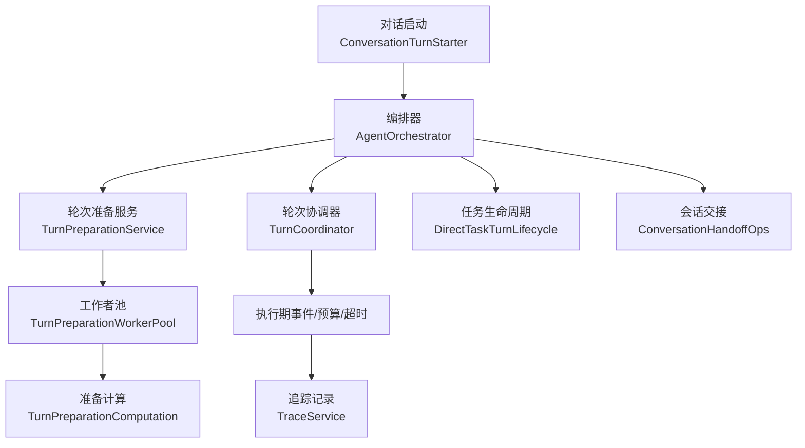
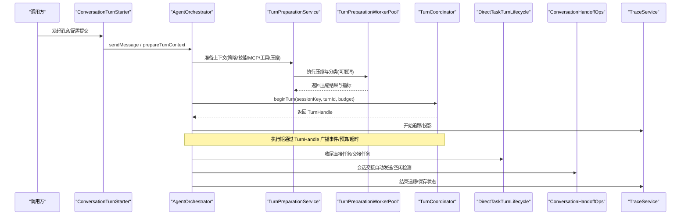
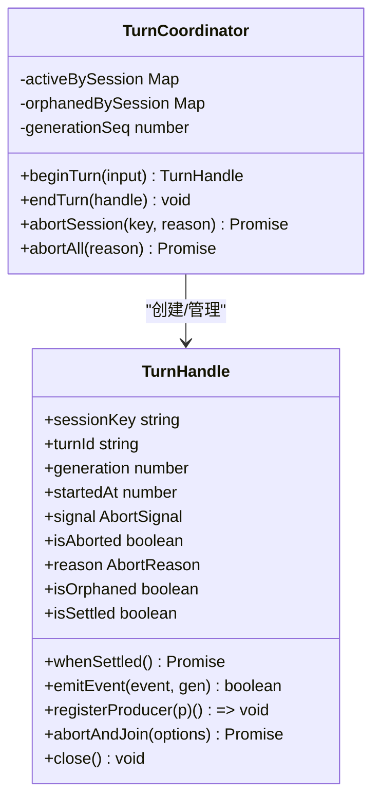
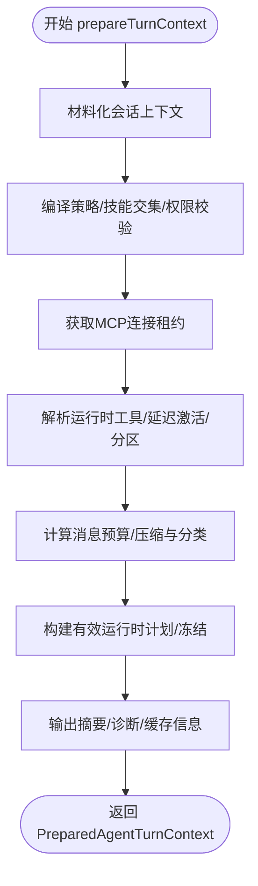
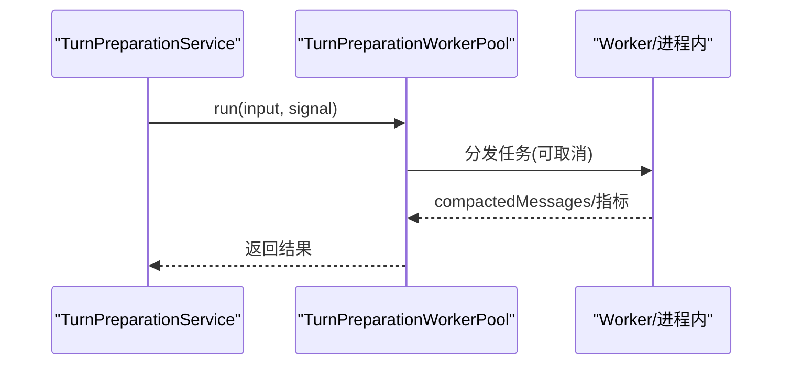
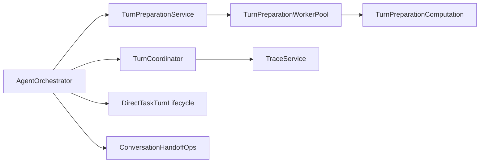

# 轮次协调管理器

<cite>
**本文引用的文件**
- [TurnCoordinator.ts](file://src/main/workflow/debugger/TurnCoordinator.ts)
- [TurnPreparationService.ts](file://src/main/workflow/debugger/TurnPreparationService.ts)
- [TurnPreparationComputation.ts](file://src/main/workers/TurnPreparationComputation.ts)
- [TurnPreparationWorkerPool.ts](file://src/main/workers/TurnPreparationWorkerPool.ts)
- [ProfileTurnPreparation.ts](file://src/main/workflow/debugger/ProfileTurnPreparation.ts)
- [AgentOrchestrator.ts](file://src/main/workflow/debugger/AgentOrchestrator.ts)
- [ConversationTurnStarter.ts](file://src/main/conversation/ConversationTurnStarter.ts)
- [DirectTaskTurnLifecycle.ts](file://src/main/workflow/debugger/DirectTaskTurnLifecycle.ts)
- [ConversationHandoffOps.ts](file://src/main/conversation/ConversationHandoffOps.ts)
- [TraceService.ts](file://src/main/agent-trace/TraceService.ts)
</cite>

## 目录
1. [简介](#简介)
2. [项目结构](#项目结构)
3. [核心组件](#核心组件)
4. [架构总览](#架构总览)
5. [详细组件分析](#详细组件分析)
6. [依赖关系分析](#依赖关系分析)
7. [性能考量](#性能考量)
8. [故障排查指南](#故障排查指南)
9. [结论](#结论)
10. [附录：使用示例与最佳实践](#附录使用示例与最佳实践)

## 简介
本文件围绕“轮次协调管理器”展开，系统性说明 TurnCoordinator 的轮次管理机制（活跃轮次跟踪、并发控制、生命周期管理），以及 TurnPreparationService 的上下文准备流程（上下文压缩、工具装配、权限校验等）。同时覆盖轮次间状态同步、资源管理、错误恢复、调度算法、超时处理与取消机制，并提供可操作的调用路径与最佳实践。

## 项目结构
围绕轮次协调的关键代码分布在以下模块：
- 轮次协调与句柄：TurnCoordinator.ts
- 轮次准备服务：TurnPreparationService.ts、ProfileTurnPreparation.ts
- 准备计算与工作者池：TurnPreparationComputation.ts、TurnPreparationWorkerPool.ts
- 编排入口与协作：AgentOrchestrator.ts、ConversationTurnStarter.ts
- 任务生命周期与交接：DirectTaskTurnLifecycle.ts、ConversationHandoffOps.ts
- 追踪与可视化：TraceService.ts

图表来源
- [ConversationTurnStarter.ts:68-200](file://src/main/conversation/ConversationTurnStarter.ts#L68-L200)
- [AgentOrchestrator.ts:75-145](file://src/main/workflow/debugger/AgentOrchestrator.ts#L75-L145)
- [TurnPreparationService.ts:113-432](file://src/main/workflow/debugger/TurnPreparationService.ts#L113-L432)
- [TurnPreparationWorkerPool.ts:24-122](file://src/main/workers/TurnPreparationWorkerPool.ts#L24-L122)
- [TurnPreparationComputation.ts:28-49](file://src/main/workers/TurnPreparationComputation.ts#L28-L49)
- [TurnCoordinator.ts:493-605](file://src/main/workflow/debugger/TurnCoordinator.ts#L493-L605)
- [DirectTaskTurnLifecycle.ts:35-123](file://src/main/workflow/debugger/DirectTaskTurnLifecycle.ts#L35-L123)
- [ConversationHandoffOps.ts:129-227](file://src/main/conversation/ConversationHandoffOps.ts#L129-L227)
- [TraceService.ts:279-310](file://src/main/agent-trace/TraceService.ts#L279-L310)

章节来源
- [ConversationTurnStarter.ts:68-200](file://src/main/conversation/ConversationTurnStarter.ts#L68-L200)
- [AgentOrchestrator.ts:75-145](file://src/main/workflow/debugger/AgentOrchestrator.ts#L75-L145)

## 核心组件
- 轮次协调器 TurnCoordinator：维护每个会话的活跃轮次句柄 TurnHandle，负责轮次生命周期、并发控制、超时与取消、生产者注册与回收、孤儿句柄保留与清理。
- 轮次准备服务 TurnPreparationService：在运行前完成上下文材料化、策略编译、技能交集、MCP 连接获取、工具装配与延迟激活、消息压缩与预算检查、有效运行时计划冻结。
- 准备计算与工作者池：将消息压缩与分类等 CPU 密集工作放入工作者池，支持取消信号与失败重试。
- 编排器 AgentOrchestrator：组合上述能力，提供对外 API（发送消息、准备上下文、子代理等），并协调会话槽位、工具执行器、追踪发布。
- 会话与任务生命周期：DirectTaskTurnLifecycle 与 ConversationHandoffOps 负责任务执行收尾、交接消费、自动发送与空闲检测。
- 追踪 TraceService：将历史轮次与运行状态持久化与投影，便于 UI 展示与审计。

章节来源
- [TurnCoordinator.ts:1-605](file://src/main/workflow/debugger/TurnCoordinator.ts#L1-L605)
- [TurnPreparationService.ts:1-434](file://src/main/workflow/debugger/TurnPreparationService.ts#L1-L434)
- [TurnPreparationWorkerPool.ts:1-122](file://src/main/workers/TurnPreparationWorkerPool.ts#L1-L122)
- [TurnPreparationComputation.ts:1-50](file://src/main/workers/TurnPreparationComputation.ts#L1-L50)
- [AgentOrchestrator.ts:1-200](file://src/main/workflow/debugger/AgentOrchestrator.ts#L1-L200)
- [DirectTaskTurnLifecycle.ts:35-123](file://src/main/workflow/debugger/DirectTaskTurnLifecycle.ts#L35-L123)
- [ConversationHandoffOps.ts:129-227](file://src/main/conversation/ConversationHandoffOps.ts#L129-L227)
- [TraceService.ts:279-310](file://src/main/agent-trace/TraceService.ts#L279-L310)

## 架构总览
轮次从对话层进入编排器，先进行请求预检与凭证刷新，再进入准备阶段；准备完成后创建或复用轮次句柄，进入执行期；执行期间通过 TurnCoordinator 统一管控并发、超时与取消；任务与交接在会话结束时进行收尾；最终由追踪服务输出可视化的时间线与状态。

图表来源
- [ConversationTurnStarter.ts:68-200](file://src/main/conversation/ConversationTurnStarter.ts#L68-L200)
- [AgentOrchestrator.ts:75-145](file://src/main/workflow/debugger/AgentOrchestrator.ts#L75-L145)
- [TurnPreparationService.ts:113-432](file://src/main/workflow/debugger/TurnPreparationService.ts#L113-L432)
- [TurnPreparationWorkerPool.ts:24-122](file://src/main/workers/TurnPreparationWorkerPool.ts#L24-L122)
- [TurnCoordinator.ts:493-605](file://src/main/workflow/debugger/TurnCoordinator.ts#L493-L605)
- [DirectTaskTurnLifecycle.ts:35-123](file://src/main/workflow/debugger/DirectTaskTurnLifecycle.ts#L35-L123)
- [ConversationHandoffOps.ts:129-227](file://src/main/conversation/ConversationHandoffOps.ts#L129-L227)
- [TraceService.ts:279-310](file://src/main/agent-trace/TraceService.ts#L279-L310)

## 详细组件分析

### 轮次协调器 TurnCoordinator
- 活跃轮次跟踪：以 sessionKey 为键维护 activeBySession，并在 beginTurn 时中止上一个活跃轮次；endTurn 仅对当前 generation 生效。
- 并发控制：TurnHandle 内部维护 producers 集合，registerProducer 注册后统一 abort/join；abortAndJoin 采用优雅宽限期 + 强制等待 + 孤儿保留策略，确保所有生产者退出。
- 生命周期管理：构造时根据策略设置 wall timer 触发 timeout；支持 parentSignal 传播取消；whenSettled 等待孤儿句柄完全清理。
- 事件与生成号保护：emitEvent 仅在 isLive(expectedGeneration) 时转发，避免过期写入。
- 预算与子代理限制：PolicyBudgetState/SubagentBudgetState 提供工具调用、子代理数量、深度与聚合时间的上限检查与预留槽位机制。

图表来源
- [TurnCoordinator.ts:205-605](file://src/main/workflow/debugger/TurnCoordinator.ts#L205-L605)

章节来源
- [TurnCoordinator.ts:1-605](file://src/main/workflow/debugger/TurnCoordinator.ts#L1-L605)

### 轮次准备服务 TurnPreparationService
- 上下文材料化：基于会话可见消息与分支信息构建 messages，注入用户消息。
- 策略与权限：编译有效策略，计算技能交集，校验交接技能兼容性，过滤被拒绝工具。
- MCP 与工具装配：获取 MCP 连接租约，解析运行时工具，按策略与技能激活延迟工具，划分系统/MCP/子代理工具定义。
- 预算与压缩：计算消息预算，调用工作者池执行压缩与分类，保证当前用户消息不被丢弃。
- 有效计划冻结：构建 EffectiveRuntimePlan，绑定 RDX 工具与知识根，输出摘要与诊断信息。

图表来源
- [TurnPreparationService.ts:113-432](file://src/main/workflow/debugger/TurnPreparationService.ts#L113-L432)

章节来源
- [TurnPreparationService.ts:1-434](file://src/main/workflow/debugger/TurnPreparationService.ts#L1-L434)

### 准备计算与工作者池
- 工作者池：封装 Worker 线程池，支持任务排队、取消、失败重试与槽位回收；测试环境回退到进程内计算。
- 计算逻辑：使用 ContextManager 估算与转换消息，统计分类与 token 用量，不访问模型或安装窗口，保证纯 CPU 计算。

图表来源
- [TurnPreparationWorkerPool.ts:24-122](file://src/main/workers/TurnPreparationWorkerPool.ts#L24-L122)
- [TurnPreparationComputation.ts:28-49](file://src/main/workers/TurnPreparationComputation.ts#L28-L49)

章节来源
- [TurnPreparationWorkerPool.ts:1-122](file://src/main/workers/TurnPreparationWorkerPool.ts#L1-L122)
- [TurnPreparationComputation.ts:1-50](file://src/main/workers/TurnPreparationComputation.ts#L1-L50)

### 编排器与对话启动
- AgentOrchestrator：组装 MCP、工具装配、工具执行器、轮次准备、轮次运行、子代理与后台子代理、内存 UI；提供对外方法如 sendMessage、prepareTurnContext。
- ConversationTurnStarter：负责消息前置校验、凭证刷新、路由能力解析、模型选择、会话快照与追踪初始化，并调用编排器执行。

章节来源
- [AgentOrchestrator.ts:1-200](file://src/main/workflow/debugger/AgentOrchestrator.ts#L1-L200)
- [ConversationTurnStarter.ts:68-200](file://src/main/conversation/ConversationTurnStarter.ts#L68-L200)

### 任务生命周期与会话交接
- DirectTaskTurnLifecycle：在父轮次结束时结算未完成的直接任务与未返回的交接任务，必要时加入执行进程并标记 cancelled/blocked。
- ConversationHandoffOps：实现交接的自动发送、空闲观察计数、占用槽位等待与取消未完成交接，保障跨轮次状态一致性。

章节来源
- [DirectTaskTurnLifecycle.ts:35-123](file://src/main/workflow/debugger/DirectTaskTurnLifecycle.ts#L35-L123)
- [ConversationHandoffOps.ts:129-227](file://src/main/conversation/ConversationHandoffOps.ts#L129-L227)

### 追踪与可视化
- TraceService：将历史轮次与运行状态持久化，构建时间线用于 UI 展示；根据助手消息状态映射运行/成功/失败/取消等状态。

章节来源
- [TraceService.ts:279-310](file://src/main/agent-trace/TraceService.ts#L279-L310)

## 依赖关系分析
- 低耦合高内聚：TurnCoordinator 专注轮次生命周期；TurnPreparationService 专注准备；工作者池隔离 CPU 密集计算；编排器作为门面组合各子系统。
- 外部依赖：MCP 连接、策略编译、令牌服务、存储适配器、进程监督器等通过依赖注入或全局服务访问。
- 潜在循环：通过接口与依赖注入避免循环引用；例如 TurnPreparationService 通过 deps 传入 resolveRuntimeTools/createToolSignature。

图表来源
- [AgentOrchestrator.ts:75-145](file://src/main/workflow/debugger/AgentOrchestrator.ts#L75-L145)
- [TurnPreparationService.ts:113-432](file://src/main/workflow/debugger/TurnPreparationService.ts#L113-L432)
- [TurnPreparationWorkerPool.ts:24-122](file://src/main/workers/TurnPreparationWorkerPool.ts#L24-L122)
- [TurnPreparationComputation.ts:28-49](file://src/main/workers/TurnPreparationComputation.ts#L28-L49)
- [DirectTaskTurnLifecycle.ts:35-123](file://src/main/workflow/debugger/DirectTaskTurnLifecycle.ts#L35-L123)
- [ConversationHandoffOps.ts:129-227](file://src/main/conversation/ConversationHandoffOps.ts#L129-L227)
- [TraceService.ts:279-310](file://src/main/agent-trace/TraceService.ts#L279-L310)

章节来源
- [AgentOrchestrator.ts:75-145](file://src/main/workflow/debugger/AgentOrchestrator.ts#L75-L145)
- [TurnPreparationService.ts:113-432](file://src/main/workflow/debugger/TurnPreparationService.ts#L113-L432)

## 性能考量
- 工作者池隔离 CPU 密集计算：消息压缩与分类在独立线程中执行，避免阻塞主线程。
- 预算与阈值控制：策略与上下文预算在准备阶段严格校验，防止超窗口的无效请求。
- 超时与取消：TurnHandle 内置 wall timer 与 parentSignal 传播，配合优雅宽限期与强制等待，降低资源泄漏风险。
- 延迟工具激活：按需激活工具，减少初始开销与工具定义体积。
- 交接与空闲检测：会话交接自动发送与空闲观察计数，避免长时间占用会话槽位。

[本节为通用指导，无需特定文件来源]

## 故障排查指南
- 轮次孤儿与未关闭：若 beginTurn 抛出 TURN_ORPHANED，说明上一轮次仍有生产者未退出；检查生产者注册与 abort/join 路径。
- 工具审批取消：当轮次取消时，工具审批请求会被批量取消；确认 cancelTurn 是否被正确调用。
- 准备阶段取消：工作者池收到取消信号会立即终止任务并返回 REQUEST_CANCELLED；检查上游 AbortController 是否正确传递。
- 交接任务未返回：父轮次结束时若存在未返回的交接任务，将被标记为 blocked/cancelled；检查交接消费与任务登记。
- 追踪状态异常：若历史轮次状态不正确，检查 TraceService 的状态映射与消息完整性。

章节来源
- [TurnCoordinator.ts:493-605](file://src/main/workflow/debugger/TurnCoordinator.ts#L493-L605)
- [TurnPreparationWorkerPool.ts:93-122](file://src/main/workers/TurnPreparationWorkerPool.ts#L93-L122)
- [DirectTaskTurnLifecycle.ts:35-123](file://src/main/workflow/debugger/DirectTaskTurnLifecycle.ts#L35-L123)
- [ConversationHandoffOps.ts:129-227](file://src/main/conversation/ConversationHandoffOps.ts#L129-L227)
- [TraceService.ts:279-310](file://src/main/agent-trace/TraceService.ts#L279-L310)

## 结论
TurnCoordinator 提供了健壮的轮次生命周期管理与并发控制，TurnPreparationService 则在运行前完成严格的上下文准备与权限校验。二者结合 AgentOrchestrator 的编排能力，实现了可扩展、可观测、可恢复的轮次协调体系。通过工作者池、预算控制、超时与取消机制，系统在复杂场景下仍保持高效与稳定。

[本节为总结性内容，无需特定文件来源]

## 附录：使用示例与最佳实践
- 发送消息并准备上下文
  - 调用路径：ConversationTurnStarter → AgentOrchestrator → TurnPreparationService → TurnPreparationWorkerPool
  - 关键点：确保传递有效的 sessionId、visibleTurnIds、requestPlan 与 signal；注意图片 token 调整与上下文预算。
  - 参考路径
    - [ConversationTurnStarter.ts:68-200](file://src/main/conversation/ConversationTurnStarter.ts#L68-L200)
    - [AgentOrchestrator.ts:75-145](file://src/main/workflow/debugger/AgentOrchestrator.ts#L75-L145)
    - [TurnPreparationService.ts:113-432](file://src/main/workflow/debugger/TurnPreparationService.ts#L113-L432)
    - [TurnPreparationWorkerPool.ts:24-122](file://src/main/workers/TurnPreparationWorkerPool.ts#L24-L122)

- 创建与管理轮次
  - 调用路径：AgentOrchestrator → TurnCoordinator.beginTurn
  - 关键点：传入 sessionKey、turnId、parentSignal、policyBudget；使用 TurnHandle.abortAndJoin 进行优雅关闭；关注 isOrphaned 与 whenSettled。
  - 参考路径
    - [TurnCoordinator.ts:493-605](file://src/main/workflow/debugger/TurnCoordinator.ts#L493-L605)

- 子代理与后台子代理
  - 调用路径：AgentOrchestrator → SubagentRunner/BackgroundSubagentService
  - 关键点：子代理预算与深度限制；聚合工具调用与墙时限制；通过 TurnHandle 共享事件与取消。
  - 参考路径
    - [AgentOrchestrator.ts:75-145](file://src/main/workflow/debugger/AgentOrchestrator.ts#L75-L145)
    - [TurnCoordinator.ts:136-191](file://src/main/workflow/debugger/TurnCoordinator.ts#L136-L191)

- 会话交接与自动发送
  - 调用路径：ConversationHandoffOps.startHandoffAutoSend / notifySessionTurnIdle
  - 关键点：空闲观察计数超过阈值则取消未完成交接；确保 consumed 与 send 状态一致。
  - 参考路径
    - [ConversationHandoffOps.ts:129-227](file://src/main/conversation/ConversationHandoffOps.ts#L129-L227)

- 任务收尾与资源释放
  - 调用路径：DirectTaskTurnLifecycle.settleJoinedTurnTaskExecutions / settleUnfinishedDirectTasks
  - 关键点：父轮次结束时结算直接任务与交接任务；必要时加入执行进程并标记状态。
  - 参考路径
    - [DirectTaskTurnLifecycle.ts:35-123](file://src/main/workflow/debugger/DirectTaskTurnLifecycle.ts#L35-L123)

- 追踪与可视化
  - 调用路径：TraceService.groupHistoryTurns / build timeline
  - 关键点：根据助手消息状态映射运行/成功/失败/取消；确保消息完整与时间戳准确。
  - 参考路径
    - [TraceService.ts:279-310](file://src/main/agent-trace/TraceService.ts#L279-L310)

最佳实践
- 始终传递 AbortSignal，并在上层取消时及时中断准备与执行。
- 合理设置 policyBudget 与 subagentBudget，避免过度消耗。
- 在 endTurn 之前确保所有生产者已注册并可被 abort/join。
- 使用 whenSettled 等待孤儿句柄完全清理，避免资源泄漏。
- 在交接场景中，确保 consumed 与 send 状态一致，避免重复发送或丢失。

[本节为操作指导，无需特定文件来源]