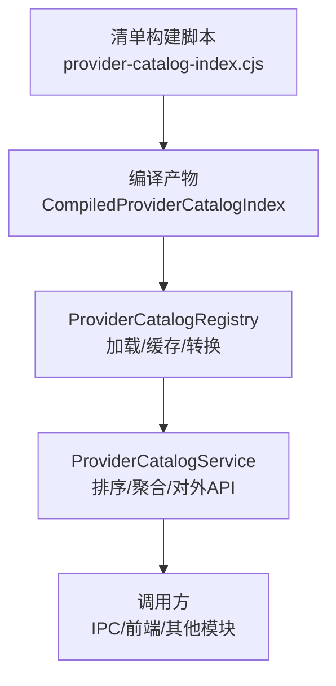
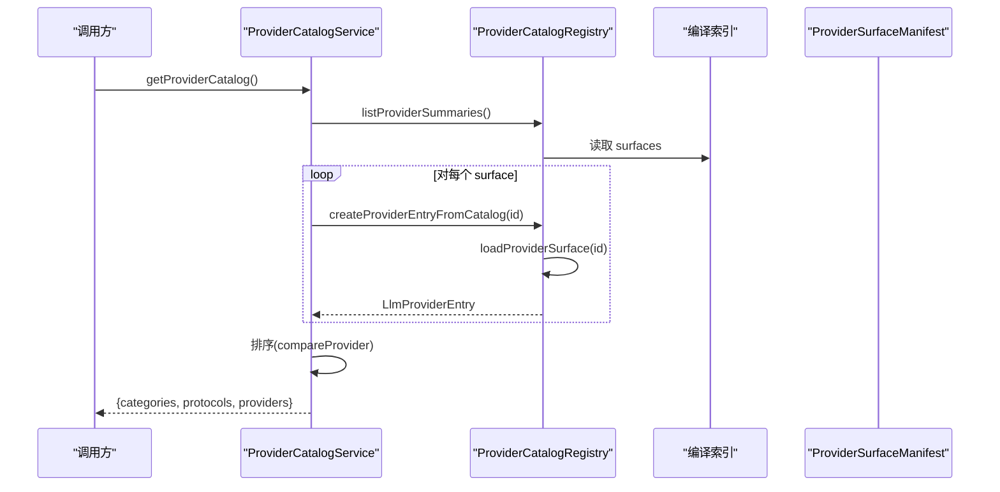
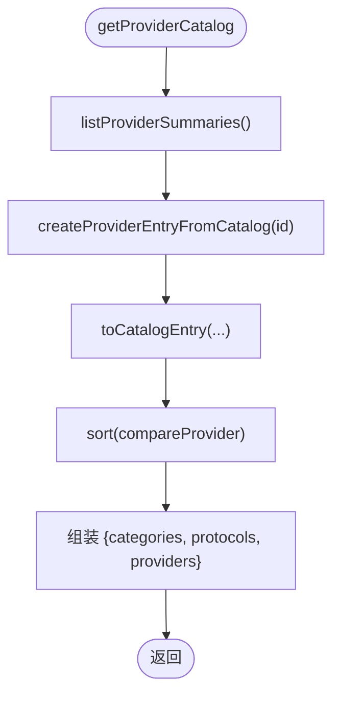
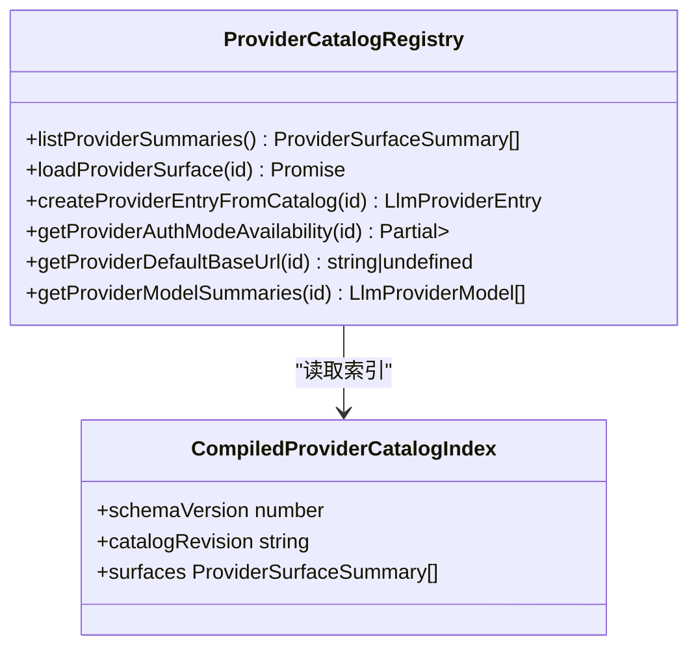
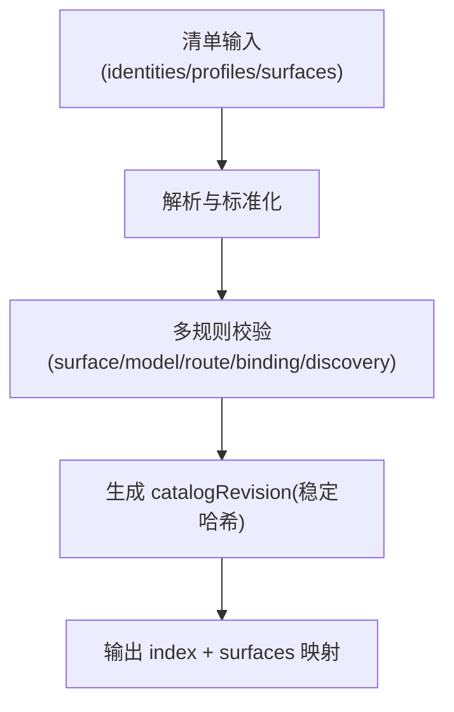
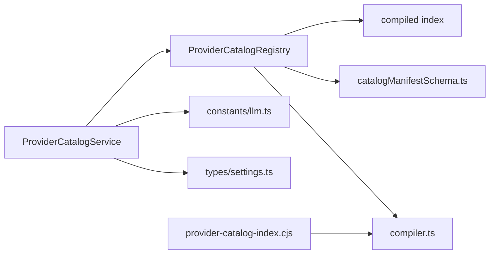
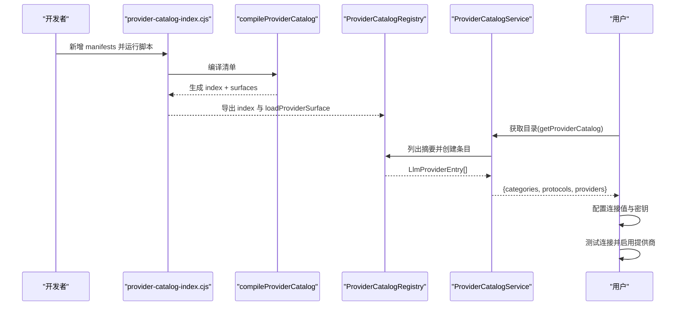

# Provider 目录管理

<cite>
**本文引用的文件**
- [ProviderCatalogService.ts](file://src/main/settings/ProviderCatalogService.ts)
- [ProviderCatalogRegistry.ts](file://src/main/provider-catalog/ProviderCatalogRegistry.ts)
- [compiler.ts](file://src/shared/provider-catalog/compiler.ts)
- [catalogManifestSchema.ts](file://src/shared/provider-catalog/catalogManifestSchema.ts)
- [llm.ts](file://src/shared/constants/llm.ts)
- [settings.ts](file://src/shared/types/settings.ts)
- [provider-catalog-index.cjs](file://scripts/provider-catalog-index.cjs)
- [deepseek.json](file://src/shared/provider-catalog/manifests/surfaces/deepseek.json)
- [chatgpt-account.json](file://src/shared/provider-catalog/manifests/surfaces/chatgpt-account.json)
- [LiveProviderCatalogParsers.ts](file://src/main/settings/LiveProviderCatalogParsers.ts)
</cite>

## 更新摘要
**所做更改**
- 更新了 DeepSeek 提供商清单，反映模型重命名和移除操作
- 新增了 ChatGPT Account 提供商的 GPT-6 Astra 模型支持
- 增强了 LiveProviderCatalogParsers 中的准入过滤机制
- 更新了相关测试用例以反映新的模型标识符

## 目录
1. [简介](#简介)
2. [项目结构](#项目结构)
3. [核心组件](#核心组件)
4. [架构总览](#架构总览)
5. [详细组件分析](#详细组件分析)
6. [依赖关系分析](#依赖关系分析)
7. [性能考量](#性能考量)
8. [故障排查指南](#故障排查指南)
9. [结论](#结论)
10. [附录：新增提供商注册流程示例](#附录：新增提供商注册流程示例)

## 简介
本文件系统性阐述 Provider 目录管理系统，重点解释 ProviderCatalogService 如何管理与组织所有可用的 LLM 提供商。内容涵盖：
- 提供商发现机制与编译期索引
- 分类系统与协议定义
- 元数据管理与来源追溯
- 目录加载、排序算法、类别与协议规范
- 提供商摘要生成、连接模式配置、认证方式支持与可用性状态管理
- 完整的提供商注册流程示例（从清单到运行时可用）

## 项目结构
Provider 目录由"编译期清单 + 运行期注册表 + 服务层"三层构成：
- 编译期清单：通过脚本将 manifests 编译为紧凑的 index 与 surface 集合，供运行时加载
- 运行期注册表：提供查询、缓存、转换能力，将清单项映射为统一的 ProviderEntry
- 服务层：对外暴露稳定的 API，负责排序、聚合分类与协议定义



**图表来源**
- [provider-catalog-index.cjs:1-19](file://scripts/provider-catalog-index.cjs#L1-L19)
- [ProviderCatalogRegistry.ts:1-140](file://src/main/provider-catalog/ProviderCatalogRegistry.ts#L1-L140)
- [ProviderCatalogService.ts:57-70](file://src/main/settings/ProviderCatalogService.ts#L57-L70)

**章节来源**
- [provider-catalog-index.cjs:1-19](file://scripts/provider-catalog-index.cjs#L1-L19)
- [ProviderCatalogRegistry.ts:1-140](file://src/main/provider-catalog/ProviderCatalogRegistry.ts#L1-L140)
- [ProviderCatalogService.ts:57-70](file://src/main/settings/ProviderCatalogService.ts#L57-L70)

## 核心组件
- ProviderCatalogService：对外提供 getProviderCatalog()，聚合分类、协议与提供商列表，并按分类优先级与标签排序
- ProviderCatalogRegistry：维护已加载的 surface 缓存、懒加载、摘要生成、模型摘要、默认 baseUrl、认证模式可用性合并等
- compiler：编译清单输入，校验并生成稳定哈希的 catalogRevision，输出 index 与 surfaces 映射
- catalogManifestSchema：强类型约束 surface、route、connectionSchema、discovery、models 等
- constants/llm：分类定义与协议定义常量，用于 UI 展示与排序
- types/settings：统一的数据契约（如 LlmProviderEntry、LlmProviderCatalogResponse 等）

**章节来源**
- [ProviderCatalogService.ts:1-73](file://src/main/settings/ProviderCatalogService.ts#L1-L73)
- [ProviderCatalogRegistry.ts:1-284](file://src/main/provider-catalog/ProviderCatalogRegistry.ts#L1-L284)
- [compiler.ts:622-716](file://src/shared/provider-catalog/compiler.ts#L622-L716)
- [catalogManifestSchema.ts:148-235](file://src/shared/provider-catalog/catalogManifestSchema.ts#L148-L235)
- [llm.ts:10-118](file://src/shared/constants/llm.ts#L10-L118)
- [settings.ts:420-541](file://src/shared/types/settings.ts#L420-L541)

## 架构总览
Provider 目录在构建时由清单编译为不可变索引；运行时通过虚拟模块加载该索引，按需解析具体 surface 并转换为统一条目；服务层再按分类与协议进行聚合与排序，最终返回给上层消费。



**图表来源**
- [ProviderCatalogService.ts:57-70](file://src/main/settings/ProviderCatalogService.ts#L57-L70)
- [ProviderCatalogRegistry.ts:110-143](file://src/main/provider-catalog/ProviderCatalogRegistry.ts#L110-L143)
- [ProviderCatalogRegistry.ts:210-266](file://src/main/provider-catalog/ProviderCatalogRegistry.ts#L210-L266)

## 详细组件分析

### ProviderCatalogService：目录聚合与排序
- 职责
  - 获取所有提供商摘要并转换为目录条目
  - 注入分类与协议定义
  - 按分类优先级与标签排序
- 关键逻辑
  - 使用 LLM_PROVIDER_CATEGORY_DEFINITIONS 建立分类优先级 Map
  - compareProvider 先按分类排名，再按 label 本地化比较
  - 返回包含 categories、protocols、providers 的统一响应



**图表来源**
- [ProviderCatalogService.ts:11-69](file://src/main/settings/ProviderCatalogService.ts#L11-L69)

**章节来源**
- [ProviderCatalogService.ts:11-69](file://src/main/settings/ProviderCatalogService.ts#L11-L69)
- [llm.ts:10-118](file://src/shared/constants/llm.ts#L10-L118)

### ProviderCatalogRegistry：发现、加载与转换
- 职责
  - 加载编译后的目录索引（虚拟模块）
  - 懒加载并缓存单个 surface，避免重复 IO
  - 将 surface 摘要与 manifest 转换为统一的 LlmProviderEntry
  - 计算认证模式可用性、默认 baseUrl、模型摘要等
- 关键机制
  - 索引校验：schemaVersion、catalogRevision、surfaces 数组等
  - 表面解析：parseCompiledSurface 校验 schema 版本一致性
  - 认证模式映射：oauth/device -> account；environment/local -> 对应模式；其余 -> api-key
  - 可用性合并：combineAvailability 将 provider 级与 mode 级可用性合并
  - 模型摘要：过滤 internal 可见性，处理 presencePolicy 与 availability
  - 缓存策略：loadedSurfaces 与 surfaceLoads 保证并发安全与去重



**图表来源**
- [ProviderCatalogRegistry.ts:21-143](file://src/main/provider-catalog/ProviderCatalogRegistry.ts#L21-L143)
- [ProviderCatalogRegistry.ts:149-266](file://src/main/provider-catalog/ProviderCatalogRegistry.ts#L149-L266)

**章节来源**
- [ProviderCatalogRegistry.ts:21-143](file://src/main/provider-catalog/ProviderCatalogRegistry.ts#L21-L143)
- [ProviderCatalogRegistry.ts:149-266](file://src/main/provider-catalog/ProviderCatalogRegistry.ts#L149-L266)

### 清单编译与校验：compiler
- 职责
  - 解析 identities、profiles、surfaces，应用 profile 的 routeMechanics 与 contracts
  - 严格校验 surface、model、route、binding、discovery 等
  - 生成稳定哈希的 catalogRevision 与精简的 summaries
- 关键点
  - 合并合约：mergeProviderContracts 基于 profile 与 route 覆盖
  - 绑定冲突检测：executionBindings 的 selector 与 actions 一致性检查
  - 公开补丁校验：禁止在清单中嵌入敏感字段
  - 路由适配器校验：adapterId 必须支持对应 protocol
  - 发现策略校验：strategy 与 discoveryPolicyId 一致



**图表来源**
- [compiler.ts:108-165](file://src/shared/provider-catalog/compiler.ts#L108-L165)
- [compiler.ts:221-304](file://src/shared/provider-catalog/compiler.ts#L221-L304)
- [compiler.ts:454-620](file://src/shared/provider-catalog/compiler.ts#L454-L620)
- [compiler.ts:622-716](file://src/shared/provider-catalog/compiler.ts#L622-L716)

**章节来源**
- [compiler.ts:622-716](file://src/shared/provider-catalog/compiler.ts#L622-L716)

### 清单 Schema：catalogManifestSchema
- 定义
  - ProviderSurfaceManifest：surface 的核心结构，包括 routes、discovery、connectionSchema、authModes、capabilities 等
  - ConnectionSchema：连接字段、主密钥字段、凭证备选方案、头部映射、端点模板
  - DiscoveryStrategy：json-catalog 或 custom-parser，含 admission 与 routeRules
  - ModelManifest：模型元数据、上下文窗口、执行绑定、能力声明等
- 作用
  - 确保清单数据的完整性与一致性
  - 为编译期校验与运行期转换提供强类型基础

**章节来源**
- [catalogManifestSchema.ts:23-111](file://src/shared/provider-catalog/catalogManifestSchema.ts#L23-L111)
- [catalogManifestSchema.ts:137-235](file://src/shared/provider-catalog/catalogManifestSchema.ts#L137-L235)

### 分类与协议定义：constants/llm
- 分类定义：login-authorization、official-direct、cloud-platform、coding-token-plan、compatible-access、local
- 协议定义：OpenAICompatibleChatCompletions、AnthropicMessages、GoogleGemini、AzureOpenAIChatCompletions 等
- 用途
  - 为 UI 展示与排序提供权威来源
  - 限制协议白名单，防止非法协议接入

**章节来源**
- [llm.ts:10-118](file://src/shared/constants/llm.ts#L10-L118)

### 数据契约：types/settings
- LlmProviderEntry：运行时可配置的提供商条目，包含协议、认证模式、连接值、模型列表、能力等
- LlmProviderCatalogEntry/LlmProviderCatalogResponse：目录查询响应结构
- LlmProviderConnectionSchema：连接字段与头部映射
- LlmProviderCapability：能力开关（chat、tool-calling、structured-output 等）

**章节来源**
- [settings.ts:420-541](file://src/shared/types/settings.ts#L420-L541)
- [settings.ts:116-144](file://src/shared/types/settings.ts#L116-L144)

### 最新变更：DeepSeek 提供商重构

**更新** DeepSeek 提供商清单进行了重大重构，移除了 `deepseek-v4-pro` 模型并将 `deepseek-v4-flash` 重命名为 `deepseek-flash`。

#### DeepSeek 模型变更详情
- **移除的模型**：`deepseek-v4-pro` 已从目录中完全移除
- **重命名的模型**：`deepseek-v4-flash` → `deepseek-flash`
- **保留的功能**：推理模式、工具调用、视觉输入等核心功能保持不变
- **适配的协议**：OpenAIResponses、OpenAICompatibleChatCompletions、AnthropicMessages

#### 准入过滤机制
DeepSeek 提供商现在使用严格的准入过滤机制，只允许 `deepseek-flash` 模型通过：

```json
{
  "admission": {
    "allowPatterns": ["deepseek-flash"]
  }
}
```

**章节来源**
- [deepseek.json:212-228](file://src/shared/provider-catalog/manifests/surfaces/deepseek.json#L212-L228)
- [deepseek.json:229-369](file://src/shared/provider-catalog/manifests/surfaces/deepseek.json#L229-L369)

### 最新变更：ChatGPT Account 提供商增强

**更新** ChatGPT Account 提供商新增了 GPT-6 Astra 模型，支持双上下文层级配置。

#### GPT-6 Astra 模型特性
- **默认上下文层级**：272,000 tokens（Codex 服务限制）
- **最大上下文层级**：872,000 tokens（Max 模式，需要额外授权）
- **推理级别**：low、medium、high、xhigh、max
- **快速模式**：可选，启用后设置 `service_tier: priority`
- **工具调用**：支持
- **视觉输入**：支持
- **结构化输出**：支持

#### 双上下文层级实现
系统通过 `contextTiers` 数组实现双层级配置：

```json
"contextTiers": [
  {
    "id": "default",
    "label": "Codex service limit",
    "maxPromptTokens": 272000,
    "activation": {"kind": "implicit"},
    "entitlement": "granted"
  },
  {
    "id": "max", 
    "label": "Max mode",
    "maxPromptTokens": 872000,
    "activation": {"kind": "implicit"},
    "entitlement": "unknown"
  }
]
```

**章节来源**
- [chatgpt-account.json:127-250](file://src/shared/provider-catalog/manifests/surfaces/chatgpt-account.json#L127-L250)

### 最新变更：LiveProviderCatalogParsers 改进

**更新** LiveProviderCatalogParsers.ts 增强了准入过滤机制，改进了模型发现和验证逻辑。

#### 改进的过滤机制
- **更严格的身份验证**：`liveIdentity()` 函数现在使用 `isAdmittedDiscoveredModel()` 进行更严格的模型身份验证
- **增强的错误处理**：改进了无效模型条目的处理和日志记录
- **更好的兼容性**：支持更多格式的模型目录响应

#### 支持的模型格式
- OpenAI 兼容格式：`{ id, name, model }`
- Anthropic 格式：标准模型列表
- 自定义格式：支持多种供应商特定的模型目录格式

**章节来源**
- [LiveProviderCatalogParsers.ts:77-86](file://src/main/settings/LiveProviderCatalogParsers.ts#L77-L86)
- [LiveProviderCatalogParsers.ts:302-313](file://src/main/settings/LiveProviderCatalogParsers.ts#L302-L313)

### 清单编译与校验：compiler
- 职责
  - 解析 identities、profiles、surfaces，应用 profile 的 routeMechanics 与 contracts
  - 严格校验 surface、model、route、binding、discovery 等
  - 生成稳定哈希的 catalogRevision 与精简的 summaries
- 关键点
  - 合并合约：mergeProviderContracts 基于 profile 与 route 覆盖
  - 绑定冲突检测：executionBindings 的 selector 与 actions 一致性检查
  - 公开补丁校验：禁止在清单中嵌入敏感字段
  - 路由适配器校验：adapterId 必须支持对应 protocol
  - 发现策略校验：strategy 与 discoveryPolicyId 一致


**图表来源**
- [compiler.ts:108-165](file://src/shared/provider-catalog/compiler.ts#L108-L165)
- [compiler.ts:221-304](file://src/shared/provider-catalog/compiler.ts#L221-L304)
- [compiler.ts:454-620](file://src/shared/provider-catalog/compiler.ts#L454-L620)
- [compiler.ts:622-716](file://src/shared/provider-catalog/compiler.ts#L622-L716)

**章节来源**
- [compiler.ts:622-716](file://src/shared/provider-catalog/compiler.ts#L622-L716)

### 清单 Schema：catalogManifestSchema
- 定义
  - ProviderSurfaceManifest：surface 的核心结构，包括 routes、discovery、connectionSchema、authModes、capabilities 等
  - ConnectionSchema：连接字段、主密钥字段、凭证备选方案、头部映射、端点模板
  - DiscoveryStrategy：json-catalog 或 custom-parser，含 admission 与 routeRules
  - ModelManifest：模型元数据、上下文窗口、执行绑定、能力声明等
- 作用
  - 确保清单数据的完整性与一致性
  - 为编译期校验与运行期转换提供强类型基础

**章节来源**
- [catalogManifestSchema.ts:23-111](file://src/shared/provider-catalog/catalogManifestSchema.ts#L23-L111)
- [catalogManifestSchema.ts:137-235](file://src/shared/provider-catalog/catalogManifestSchema.ts#L137-L235)

### 分类与协议定义：constants/llm
- 分类定义：login-authorization、official-direct、cloud-platform、coding-token-plan、compatible-access、local
- 协议定义：OpenAICompatibleChatCompletions、AnthropicMessages、GoogleGemini、AzureOpenAIChatCompletions 等
- 用途
  - 为 UI 展示与排序提供权威来源
  - 限制协议白名单，防止非法协议接入

**章节来源**
- [llm.ts:10-118](file://src/shared/constants/llm.ts#L10-L118)

### 数据契约：types/settings
- LlmProviderEntry：运行时可配置的提供商条目，包含协议、认证模式、连接值、模型列表、能力等
- LlmProviderCatalogEntry/LlmProviderCatalogResponse：目录查询响应结构
- LlmProviderConnectionSchema：连接字段与头部映射
- LlmProviderCapability：能力开关（chat、tool-calling、structured-output 等）

**章节来源**
- [settings.ts:420-541](file://src/shared/types/settings.ts#L420-L541)
- [settings.ts:116-144](file://src/shared/types/settings.ts#L116-L144)

## 依赖关系分析
- ProviderCatalogService 依赖：
  - 分类与协议常量（llm.ts）
  - ProviderCatalogRegistry（清单加载与转换）
  - 类型定义（settings.ts）
- ProviderCatalogRegistry 依赖：
  - 编译索引（virtual:rdc-provider-catalog-index）
  - 清单 Schema（catalogManifestSchema.ts）
  - 编译器输出（compiler.ts 的类型与常量）
- 编译脚本依赖：
  - compiler.ts 与 nodeManifestLoader.ts（清单加载）



**图表来源**
- [ProviderCatalogService.ts:1-73](file://src/main/settings/ProviderCatalogService.ts#L1-L73)
- [ProviderCatalogRegistry.ts:1-143](file://src/main/provider-catalog/ProviderCatalogRegistry.ts#L1-L143)
- [provider-catalog-index.cjs:1-19](file://scripts/provider-catalog-index.cjs#L1-L19)

**章节来源**
- [ProviderCatalogService.ts:1-73](file://src/main/settings/ProviderCatalogService.ts#L1-L73)
- [ProviderCatalogRegistry.ts:1-143](file://src/main/provider-catalog/ProviderCatalogRegistry.ts#L1-L143)
- [provider-catalog-index.cjs:1-19](file://scripts/provider-catalog-index.cjs#L1-L19)

## 性能考量
- 懒加载与缓存
  - 首次访问 surface 时加载并缓存至 loadedSurfaces，后续直接返回副本
  - 并发请求同一 surface 时通过 surfaceLoads 去重，避免重复 IO
- 克隆策略
  - 对外返回 JSON 副本，避免外部修改影响内部状态
- 排序复杂度
  - 分类优先级 O(1) 查找，整体排序 O(n log n)
- 编译期优化
  - 生成精简 summaries，减少运行时内存占用
  - 稳定哈希 catalogRevision 便于缓存与变更检测

## 故障排查指南
- 常见错误
  - 索引无效：Bundled Provider Catalog index is invalid
  - 表面缺失：Bundled Provider surface ${id} is missing
  - 版本不匹配：Compiled Provider surface revision does not match the Catalog index
  - 未知内置提供商：Unknown builtin provider: ${id}
  - 模型准入失败：模型未通过准入过滤检查
- 定位建议
  - 检查编译脚本是否成功生成 index 与 surfaces
  - 确认 surface 的 schemaVersion 与 catalogRevision 一致
  - 查看清单校验错误（compiler 抛出），修复 surface/model/route/binding/discovery 问题
  - 验证 connectionSchema 字段与 headerMappings 引用是否存在
  - 检查模型 ID 是否符合准入模式要求

**章节来源**
- [ProviderCatalogRegistry.ts:28-54](file://src/main/provider-catalog/ProviderCatalogRegistry.ts#L28-L54)
- [ProviderCatalogRegistry.ts:119-138](file://src/main/provider-catalog/ProviderCatalogRegistry.ts#L119-L138)
- [ProviderCatalogRegistry.ts:210-214](file://src/main/provider-catalog/ProviderCatalogRegistry.ts#L210-L214)
- [compiler.ts:652-654](file://src/shared/provider-catalog/compiler.ts#L652-L654)

## 结论
Provider 目录管理系统通过"编译期清单 + 运行期注册表 + 服务层"的分层设计，实现了：
- 强类型的清单校验与稳定的目录版本控制
- 灵活的提供商发现与认证模式支持
- 清晰的分类与协议体系，便于 UI 展示与排序
- 高效的懒加载与缓存机制，保障运行时性能
- 完善的元数据与来源追溯，提升可维护性与可观测性

最近的更新包括 DeepSeek 提供商的重构、ChatGPT Account 提供商的新功能以及 LiveProviderCatalogParsers 的增强，进一步提升了系统的稳定性和功能性。

## 附录：新增提供商注册流程示例
以下流程展示如何将一个新的 LLM 服务提供商添加到系统中，使其在 ProviderCatalogService 中可见并可被配置使用。

步骤概览
1. 准备清单文件
   - 在 manifests 目录下新增 ProviderSurfaceManifest 描述新提供商
   - 定义 routes（协议、适配器、baseUrl）、connectionSchema（字段、主密钥、头部映射）、discovery（策略、准入规则）、models（模型元数据、上下文窗口、执行绑定）等
   - 确保 authModes、capabilities、status 等字段符合业务需求

2. 编译清单
   - 运行 provider-catalog-index.cjs 脚本，调用 compileProviderCatalog 生成 index 与 surfaces 映射
   - 校验通过后，获得稳定的 catalogRevision 与精简 summaries

3. 集成到运行时
   - 构建产物中的 virtual:rdc-provider-catalog-index 将被 ProviderCatalogRegistry 加载
   - 通过 listProviderSummaries 与 createProviderEntryFromCatalog 生成 LlmProviderEntry
   - ProviderCatalogService.getProviderCatalog 将返回包含新提供商的目录

4. 配置与启用
   - 在设置中为新提供商填写连接值（非密钥字段）与密钥（通过密钥存储）
   - 选择认证模式（api-key、account、environment、local 等）
   - 测试连接并刷新模型列表，完成配置



**图表来源**
- [provider-catalog-index.cjs:1-19](file://scripts/provider-catalog-index.cjs#L1-L19)
- [compiler.ts:622-716](file://src/shared/provider-catalog/compiler.ts#L622-L716)
- [ProviderCatalogRegistry.ts:110-143](file://src/main/provider-catalog/ProviderCatalogRegistry.ts#L110-L143)
- [ProviderCatalogService.ts:57-70](file://src/main/settings/ProviderCatalogService.ts#L57-L70)

**章节来源**
- [provider-catalog-index.cjs:1-19](file://scripts/provider-catalog-index.cjs#L1-L19)
- [compiler.ts:622-716](file://src/shared/provider-catalog/compiler.ts#L622-L716)
- [ProviderCatalogRegistry.ts:110-143](file://src/main/provider-catalog/ProviderCatalogRegistry.ts#L110-L143)
- [ProviderCatalogService.ts:57-70](file://src/main/settings/ProviderCatalogService.ts#L57-L70)