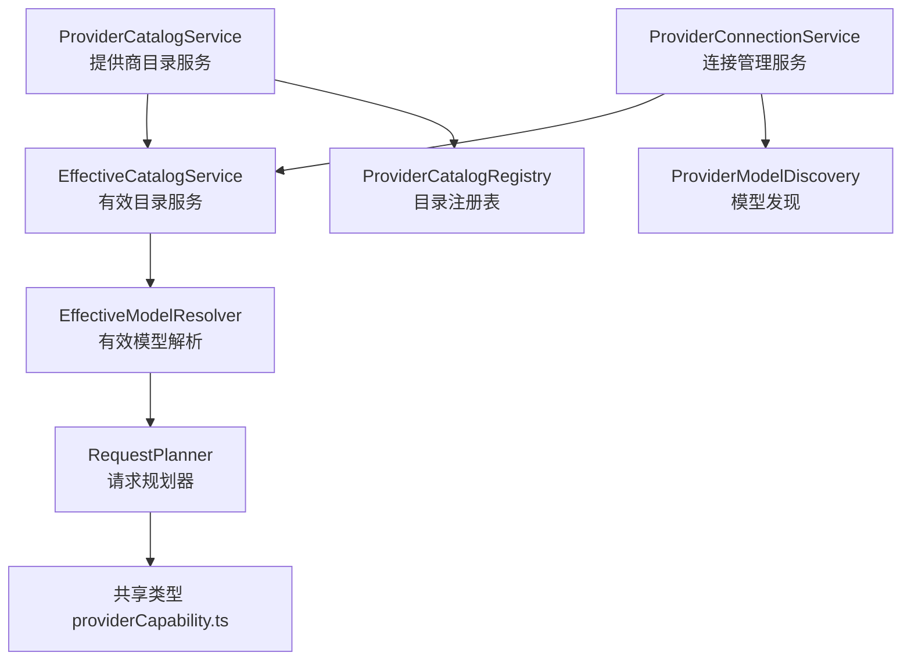
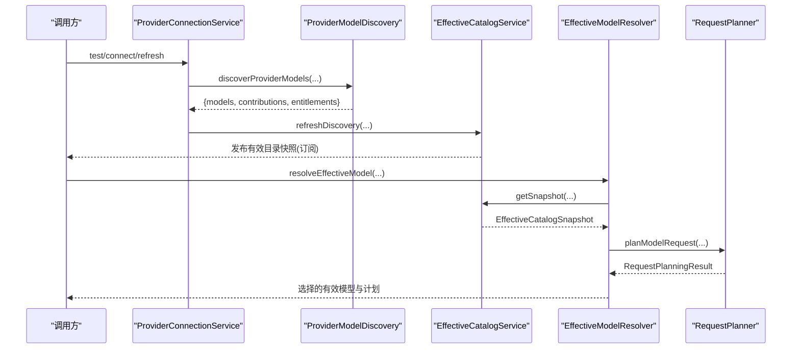
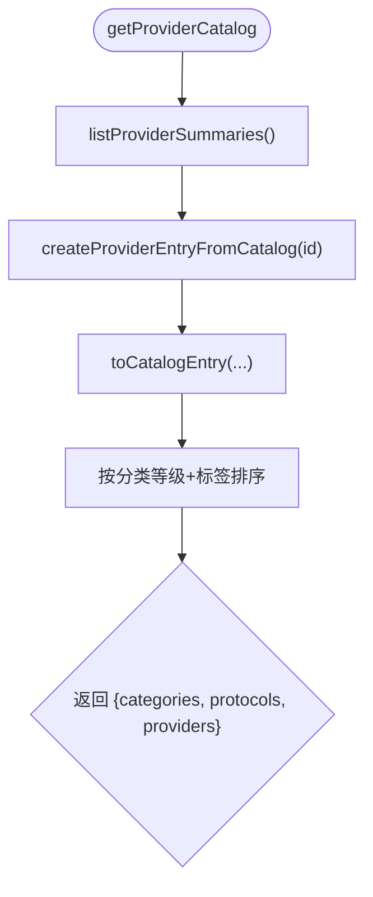
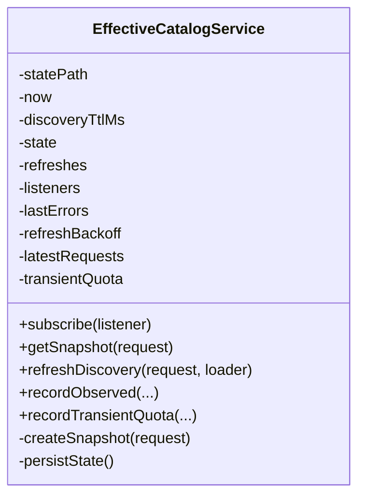
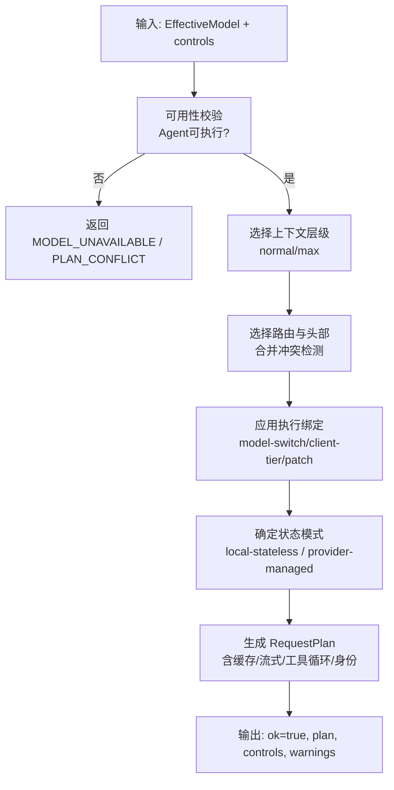
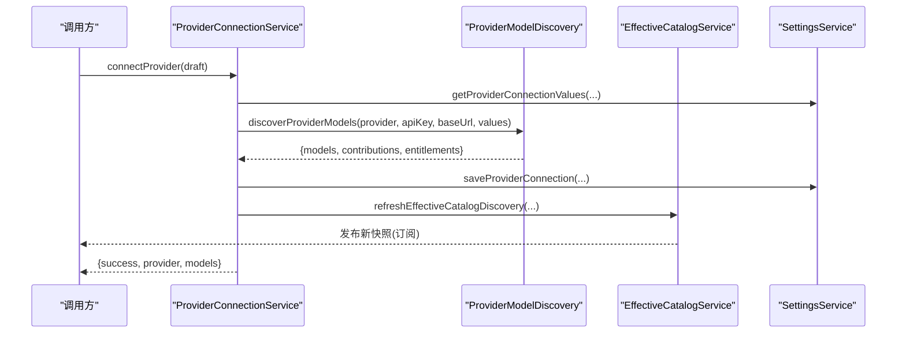
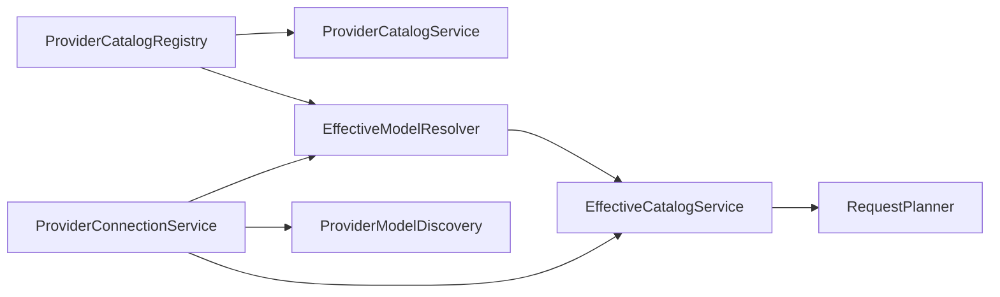

# Provider 系统

<cite>
**本文引用的文件**
- [ProviderCatalogService.ts](file://src/main/settings/ProviderCatalogService.ts)
- [EffectiveCatalogService.ts](file://src/main/settings/EffectiveCatalogService.ts)
- [RequestPlanner.ts](file://src/main/settings/RequestPlanner.ts)
- [ProviderConnectionService.ts](file://src/main/settings/ProviderConnectionService.ts)
- [effectiveCatalogTypes.ts](file://src/main/settings/effectiveCatalogTypes.ts)
- [EffectiveModelResolver.ts](file://src/main/settings/EffectiveModelResolver.ts)
- [ProviderCatalogRegistry.ts](file://src/main/provider-catalog/ProviderCatalogRegistry.ts)
- [ProviderModelDiscovery.ts](file://src/main/settings/ProviderModelDiscovery.ts)
- [providerCapability.ts](file://src/shared/types/providerCapability.ts)
</cite>

## 目录
1. [简介](#简介)
2. [项目结构](#项目结构)
3. [核心组件](#核心组件)
4. [架构总览](#架构总览)
5. [详细组件分析](#详细组件分析)
6. [依赖关系分析](#依赖关系分析)
7. [性能与可靠性](#性能与可靠性)
8. [故障排查指南](#故障排查指南)
9. [配置与集成指南](#配置与集成指南)
10. [结论](#结论)

## 简介
本文件系统化阐述 RDC-Agent 的 Provider 体系，重点覆盖：
- 提供商目录管理（ProviderCatalogService）
- 有效配置计算（EffectiveCatalogService）
- 请求规划算法（RequestPlanner）
- 连接管理与认证（ProviderConnectionService）
并深入解释多提供商支持、认证处理、负载均衡、故障转移、提供商发现机制、配置验证、连接池管理与性能监控等高级能力。最后提供完整配置示例与集成指南，展示如何添加新的 LLM 提供商支持。

## 项目结构
Provider 系统围绕“目录—有效配置—请求规划—连接”四层展开：
- 目录层：从内置 catalog 索引加载提供商元数据与模型清单，对外暴露分类、协议与提供商摘要。
- 有效配置层：将目录、用户配置、运行时发现、权限与观测证据合并为“有效模型集合”，并提供缓存、过期与增量刷新。
- 请求规划层：基于有效模型与上下文预算、控制项、路由契约生成可执行的请求计划（含状态模式、缓存、流式、工具循环等）。
- 连接层：负责提供商连接测试、账号登录流程、刷新模型列表、持久化设置与触发有效目录刷新。

图表来源
- [ProviderCatalogService.ts:57-69](file://src/main/settings/ProviderCatalogService.ts#L57-L69)
- [EffectiveCatalogService.ts:84-163](file://src/main/settings/EffectiveCatalogService.ts#L84-L163)
- [EffectiveModelResolver.ts:421-479](file://src/main/settings/EffectiveModelResolver.ts#L421-L479)
- [RequestPlanner.ts:123-539](file://src/main/settings/RequestPlanner.ts#L123-L539)
- [ProviderConnectionService.ts:53-109](file://src/main/settings/ProviderConnectionService.ts#L53-L109)
- [ProviderModelDiscovery.ts:261-525](file://src/main/settings/ProviderModelDiscovery.ts#L261-L525)
- [ProviderCatalogRegistry.ts:110-269](file://src/main/provider-catalog/ProviderCatalogRegistry.ts#L110-L269)
- [providerCapability.ts:166-321](file://src/shared/types/providerCapability.ts#L166-L321)

章节来源
- [ProviderCatalogService.ts:57-69](file://src/main/settings/ProviderCatalogService.ts#L57-L69)
- [EffectiveCatalogService.ts:84-163](file://src/main/settings/EffectiveCatalogService.ts#L84-L163)
- [EffectiveModelResolver.ts:421-479](file://src/main/settings/EffectiveModelResolver.ts#L421-L479)
- [RequestPlanner.ts:123-539](file://src/main/settings/RequestPlanner.ts#L123-L539)
- [ProviderConnectionService.ts:53-109](file://src/main/settings/ProviderConnectionService.ts#L53-L109)
- [ProviderModelDiscovery.ts:261-525](file://src/main/settings/ProviderModelDiscovery.ts#L261-L525)
- [ProviderCatalogRegistry.ts:110-269](file://src/main/provider-catalog/ProviderCatalogRegistry.ts#L110-L269)
- [providerCapability.ts:166-321](file://src/shared/types/providerCapability.ts#L166-L321)

## 核心组件
- ProviderCatalogService：聚合内置提供商目录，按分类排序返回分类、协议与提供商摘要，供 UI 或上层服务使用。
- EffectiveCatalogService：维护有效目录快照、缓存、TTL、回退重试、订阅通知与持久化；负责合并多层贡献（目录、覆盖、权限、观测、用户）。
- RequestPlanner：将有效模型与上下文预算、控制项、路由契约、状态模式、缓存策略、工具循环阶段等综合成 RequestPlan，用于下游适配器执行。
- ProviderConnectionService：封装连接测试、账号登录、刷新模型、断开连接、保存设置，并驱动有效目录刷新。

章节来源
- [ProviderCatalogService.ts:57-69](file://src/main/settings/ProviderCatalogService.ts#L57-L69)
- [EffectiveCatalogService.ts:84-163](file://src/main/settings/EffectiveCatalogService.ts#L84-L163)
- [RequestPlanner.ts:123-539](file://src/main/settings/RequestPlanner.ts#L123-L539)
- [ProviderConnectionService.ts:53-109](file://src/main/settings/ProviderConnectionService.ts#L53-L109)

## 架构总览
Provider 系统通过“目录—有效配置—请求规划—连接”的分层协作，实现多提供商的统一接入与动态能力治理。

图表来源
- [ProviderConnectionService.ts:111-198](file://src/main/settings/ProviderConnectionService.ts#L111-L198)
- [ProviderModelDiscovery.ts:261-525](file://src/main/settings/ProviderModelDiscovery.ts#L261-L525)
- [EffectiveCatalogService.ts:150-298](file://src/main/settings/EffectiveCatalogService.ts#L150-L298)
- [EffectiveModelResolver.ts:526-640](file://src/main/settings/EffectiveModelResolver.ts#L526-L640)
- [RequestPlanner.ts:123-539](file://src/main/settings/RequestPlanner.ts#L123-L539)

## 详细组件分析

### ProviderCatalogService：提供商目录管理
- 职责：从 ProviderCatalogRegistry 获取所有内置提供商摘要，转换为统一目录响应（包含分类、协议、提供商列表），并按分类优先级与标签排序。
- 关键点：
  - 使用内置分类与协议定义，确保 UI 展示一致性。
  - 对每个提供商导出连接 schema、推荐模型、文档链接、可用性原因等元信息。
  - 排序规则优先按分类等级，其次按标签本地化比较。

图表来源
- [ProviderCatalogService.ts:57-69](file://src/main/settings/ProviderCatalogService.ts#L57-L69)
- [ProviderCatalogRegistry.ts:110-269](file://src/main/provider-catalog/ProviderCatalogRegistry.ts#L110-L269)

章节来源
- [ProviderCatalogService.ts:57-69](file://src/main/settings/ProviderCatalogService.ts#L57-L69)
- [ProviderCatalogRegistry.ts:110-269](file://src/main/provider-catalog/ProviderCatalogRegistry.ts#L110-L269)

### EffectiveCatalogService：有效配置计算
- 职责：维护有效目录快照，合并多层贡献（catalog、overlay、entitlement、observed、user），提供缓存、TTL、失败回退、持久化与监听。
- 关键特性：
  - 缓存键：providerId + accountId + protocol。
  - TTL：默认 24 小时，过期后自动刷新。
  - 失败指数退避：避免频繁重试导致雪崩。
  - 观察记录：记录运行时观测到的能力（如 tool calling 支持与否），影响后续可用性与配额。
  - 临时配额：记录短期配额耗尽，影响模型可见性。
  - 版本化：catalogRevision 冻结可执行语义，便于审计与回滚。
  - 持久化：JSON 文件原子写入，保证状态一致。

图表来源
- [EffectiveCatalogService.ts:84-163](file://src/main/settings/EffectiveCatalogService.ts#L84-L163)
- [EffectiveCatalogService.ts:246-298](file://src/main/settings/EffectiveCatalogService.ts#L246-L298)
- [EffectiveCatalogService.ts:300-340](file://src/main/settings/EffectiveCatalogService.ts#L300-L340)
- [EffectiveCatalogService.ts:423-449](file://src/main/settings/EffectiveCatalogService.ts#L423-L449)

章节来源
- [EffectiveCatalogService.ts:84-163](file://src/main/settings/EffectiveCatalogService.ts#L84-L163)
- [EffectiveCatalogService.ts:246-298](file://src/main/settings/EffectiveCatalogService.ts#L246-L298)
- [EffectiveCatalogService.ts:300-340](file://src/main/settings/EffectiveCatalogService.ts#L300-L340)
- [EffectiveCatalogService.ts:423-449](file://src/main/settings/EffectiveCatalogService.ts#L423-L449)
- [effectiveCatalogTypes.ts:20-139](file://src/main/settings/effectiveCatalogTypes.ts#L20-L139)

### RequestPlanner：请求规划算法
- 职责：根据有效模型、上下文预算、控制项、路由契约、状态模式、缓存策略、工具循环阶段等，生成 RequestPlan。
- 关键逻辑：
  - 可用性校验：模型是否可用、是否允许 Agent 执行。
  - 上下文层级选择：normal/max mode，结合预算与窗口大小。
  - 路由与头部合并：支持首选路由选项、冲突检测、协议契约注入。
  - 执行绑定：model-switch、client-tier、request-patch、headers 等动作。
  - 状态模式：local-stateless 或 provider-managed，决定上下文迁移策略。
  - 缓存与流式：依据契约启用缓存、流式传输、错误上报等。
  - 身份与变体：生成 ExecutionIdentity，包含指纹、兼容性组、合同哈希等。
  - 温度与推理：固定温度、推理级别选择与抑制。

图表来源
- [RequestPlanner.ts:123-539](file://src/main/settings/RequestPlanner.ts#L123-L539)

章节来源
- [RequestPlanner.ts:123-539](file://src/main/settings/RequestPlanner.ts#L123-L539)
- [providerCapability.ts:166-321](file://src/shared/types/providerCapability.ts#L166-L321)

### ProviderConnectionService：连接管理与认证
- 职责：提供商连接测试、账号登录流程、刷新模型、断开连接、保存设置，并驱动有效目录刷新。
- 关键能力：
  - 创建 DiscoveryLoader：根据当前设置与账户，构造发现加载器，供 EffectiveCatalogService 异步刷新。
  - 测试连接：调用 discoverProviderModels，复用结果更新有效目录。
  - 连接保存：持久化 API Key/Base URL/模型偏好/连接值，并刷新有效目录。
  - 刷新模型：区分账号型与 API Key 型提供商，必要时走账号认证流程。
  - 账号登录：启动/完成/查询/登出账号登录流程。
  - 错误处理：统一解析提供商错误，返回结构化错误信息。

图表来源
- [ProviderConnectionService.ts:153-198](file://src/main/settings/ProviderConnectionService.ts#L153-L198)
- [ProviderModelDiscovery.ts:261-525](file://src/main/settings/ProviderModelDiscovery.ts#L261-L525)
- [EffectiveModelResolver.ts:481-524](file://src/main/settings/EffectiveModelResolver.ts#L481-L524)

章节来源
- [ProviderConnectionService.ts:53-109](file://src/main/settings/ProviderConnectionService.ts#L53-L109)
- [ProviderConnectionService.ts:111-198](file://src/main/settings/ProviderConnectionService.ts#L111-L198)
- [ProviderConnectionService.ts:200-260](file://src/main/settings/ProviderConnectionService.ts#L200-L260)
- [ProviderConnectionService.ts:280-314](file://src/main/settings/ProviderConnectionService.ts#L280-L314)

## 依赖关系分析
- ProviderCatalogService 依赖 ProviderCatalogRegistry 获取内置目录与提供商摘要。
- EffectiveCatalogService 依赖 effectiveCatalogMerge、持久化存储、发现加载器与监听器。
- EffectiveModelResolver 构建有效目录请求，组合目录、覆盖、权限、用户与观测层，并驱动刷新。
- RequestPlanner 依赖共享类型与上下文预算工具，产出可执行计划。
- ProviderConnectionService 协调连接测试、账号认证、设置持久化与有效目录刷新。

图表来源
- [ProviderCatalogRegistry.ts:110-269](file://src/main/provider-catalog/ProviderCatalogRegistry.ts#L110-L269)
- [EffectiveModelResolver.ts:421-524](file://src/main/settings/EffectiveModelResolver.ts#L421-L524)
- [EffectiveCatalogService.ts:84-163](file://src/main/settings/EffectiveCatalogService.ts#L84-L163)
- [RequestPlanner.ts:123-539](file://src/main/settings/RequestPlanner.ts#L123-L539)
- [ProviderConnectionService.ts:53-109](file://src/main/settings/ProviderConnectionService.ts#L53-L109)
- [ProviderModelDiscovery.ts:261-525](file://src/main/settings/ProviderModelDiscovery.ts#L261-L525)

章节来源
- [ProviderCatalogRegistry.ts:110-269](file://src/main/provider-catalog/ProviderCatalogRegistry.ts#L110-L269)
- [EffectiveModelResolver.ts:421-524](file://src/main/settings/EffectiveModelResolver.ts#L421-L524)
- [EffectiveCatalogService.ts:84-163](file://src/main/settings/EffectiveCatalogService.ts#L84-L163)
- [RequestPlanner.ts:123-539](file://src/main/settings/RequestPlanner.ts#L123-L539)
- [ProviderConnectionService.ts:53-109](file://src/main/settings/ProviderConnectionService.ts#L53-L109)
- [ProviderModelDiscovery.ts:261-525](file://src/main/settings/ProviderModelDiscovery.ts#L261-L525)

## 性能与可靠性
- 缓存与 TTL：有效目录按 providerId/accountId/protocol 缓存，默认 24 小时，减少重复发现开销。
- 失败回退：刷新失败采用指数退避，避免风暴。
- 并发保护：同一 key 的刷新任务去重，避免重复网络请求。
- 持久化：状态文件原子写入，降低损坏风险。
- 观测与配额：运行时观测能力与配额，快速收敛到稳定态。
- 请求规划优化：上下文预算与压缩阈值计算，避免超限；契约驱动的缓存与流式，提升吞吐。

[本节为通用指导，不直接分析具体文件]

## 故障排查指南
- 常见错误码：
  - MODEL_UNAVAILABLE：模型不可用或未启用。
  - NO_USABLE_CONTEXT_TIER：无可用上下文层级或缺少正预算。
  - PLAN_CONFLICT：路由/头部/补丁冲突。
  - CONSTRAINT_REJECTED：约束被拒绝（如状态模式不支持）。
- 排查步骤：
  - 检查有效目录快照是否 stale/refreshing，确认发现加载器是否可用。
  - 查看 lastRefreshError 与回退窗口，判断是否处于失败保护期。
  - 核对请求规划的控制项与上下文预算，确认 tier 选择与预算合理。
  - 检查连接测试与账号登录状态，确认凭证与 Base URL 正确。
  - 使用 ProviderConnectionService.testProviderDraft 进行最小化连通性验证。

章节来源
- [RequestPlanner.ts:96-151](file://src/main/settings/RequestPlanner.ts#L96-L151)
- [EffectiveCatalogService.ts:246-298](file://src/main/settings/EffectiveCatalogService.ts#L246-L298)
- [ProviderConnectionService.ts:111-198](file://src/main/settings/ProviderConnectionService.ts#L111-L198)

## 配置与集成指南

### 多提供商支持与认证处理
- 支持的认证模式：api-key、account（OAuth/Device）、environment/local、none。
- 认证头构造：不同协议（如 Anthropic、OpenAI 兼容）自动注入必要头与版本。
- 账号提供商：必须通过账号登录流程测试与刷新，禁止直接使用 API Key。
- 自定义连接字段：通过 connectionSchema 定义字段与替代凭据，动态注入请求头。

章节来源
- [ProviderModelDiscovery.ts:104-125](file://src/main/settings/ProviderModelDiscovery.ts#L104-L125)
- [ProviderConnectionService.ts:280-314](file://src/main/settings/ProviderConnectionService.ts#L280-L314)
- [ProviderCatalogRegistry.ts:64-73](file://src/main/provider-catalog/ProviderCatalogRegistry.ts#L64-L73)

### 负载均衡与故障转移
- 路由选项：模型可配置多个 routeOptions，支持首选路由与协议切换。
- 契约驱动：route.contracts 指定协议方言、版本、兼容性组，保障跨端一致性。
- 故障转移：当首选路由不可用时，规划器会尝试其他选项；若全部不可用，返回明确错误与推荐模型。
- 观测学习：运行时观测成功/失败，更新能力与配额，辅助后续选择。

章节来源
- [RequestPlanner.ts:164-258](file://src/main/settings/RequestPlanner.ts#L164-L258)
- [EffectiveModelResolver.ts:57-84](file://src/main/settings/EffectiveModelResolver.ts#L57-L84)
- [EffectiveCatalogService.ts:300-340](file://src/main/settings/EffectiveCatalogService.ts#L300-L340)

### 提供商发现机制
- 发现策略：支持多种 parser（openai-compatible、anthropic-candidate-validation、google-vertex-models、ollama-tags 等）。
- 权威列表：authoritative-list 模式下，未发现的模型标记为 unavailable。
- 声明式目录：json-catalog 支持外部 JSON 目录，动态映射模型与路由。
- 厂商特定：Amazon Bedrock、SAP AI Core、Google Vertex、Cline/OpenRouter 等专用路径。

章节来源
- [ProviderModelDiscovery.ts:80-102](file://src/main/settings/ProviderModelDiscovery.ts#L80-L102)
- [ProviderModelDiscovery.ts:261-525](file://src/main/settings/ProviderModelDiscovery.ts#L261-L525)
- [EffectiveModelResolver.ts:296-317](file://src/main/settings/EffectiveModelResolver.ts#L296-L317)

### 连接池管理与性能监控
- 连接池：当前实现以单次 HTTP 请求为主，未显式连接池；可通过上游 HTTP 客户端优化。
- 超时控制：请求超时限制，防止阻塞。
- 监控指标：
  - 有效目录快照的 stale/refreshing/lastRefreshError。
  - 请求规划的 contextBudgetTokens、maxOutputTokens、compactionThresholdTokens。
  - 观测记录的工具调用支持情况与配额耗尽时间。

章节来源
- [ProviderModelDiscovery.ts:31-38](file://src/main/settings/ProviderModelDiscovery.ts#L31-L38)
- [EffectiveCatalogService.ts:246-298](file://src/main/settings/EffectiveCatalogService.ts#L246-L298)
- [RequestPlanner.ts:346-387](file://src/main/settings/RequestPlanner.ts#L346-L387)

### 添加新的 LLM 提供商支持（步骤）
1. 在内置目录中声明提供商表面（ProviderSurfaceManifest），包括：
   - 协议族、路由、认证模式、连接 schema、发现策略。
2. 实现或复用发现解析器：
   - 若为 OpenAI 兼容，使用 openai-compatible 解析器。
   - 若为 Anthropic，使用 anthropic-candidate-validation 或专用解析器。
   - 若为 Google Vertex/Azure/Bedrock/SAP，使用对应专用路径。
3. 配置 discovery.authority：
   - additive：追加发现模型。
   - authoritative-list：仅保留发现的模型，缺失标记 unavailable。
4. 在 ProviderConnectionService 中注册发现加载器（如需自定义）。
5. 测试连接：
   - 使用 testProviderDraft 验证连通性与模型列表。
   - 使用 connectProvider 保存设置并刷新有效目录。
6. 验证请求规划：
   - 使用 planEffectiveModelRequest 生成计划，检查上下文预算、路由、契约。
7. 运行观测：
   - 记录工具调用支持、配额使用情况，持续优化。

章节来源
- [ProviderModelDiscovery.ts:261-525](file://src/main/settings/ProviderModelDiscovery.ts#L261-L525)
- [EffectiveModelResolver.ts:481-524](file://src/main/settings/EffectiveModelResolver.ts#L481-L524)
- [ProviderConnectionService.ts:111-198](file://src/main/settings/ProviderConnectionService.ts#L111-L198)
- [EffectiveModelResolver.ts:593-640](file://src/main/settings/EffectiveModelResolver.ts#L593-L640)

## 结论
Provider 系统通过分层设计实现了多提供商的统一接入、动态能力治理与高可靠执行。目录层提供标准化元数据，有效配置层融合多方贡献并缓存优化，请求规划层确保上下文与契约一致，连接层简化认证与发现流程。借助观测与配额机制，系统能自适应环境变化，提供稳定的 LLM 服务能力。

[本节为总结，不直接分析具体文件]