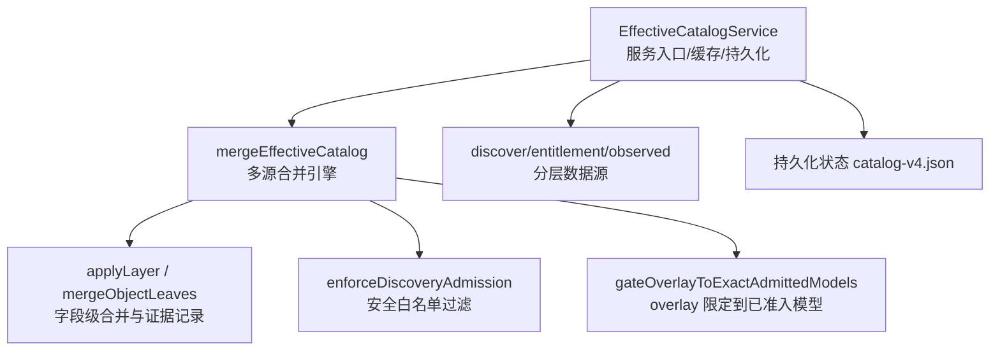
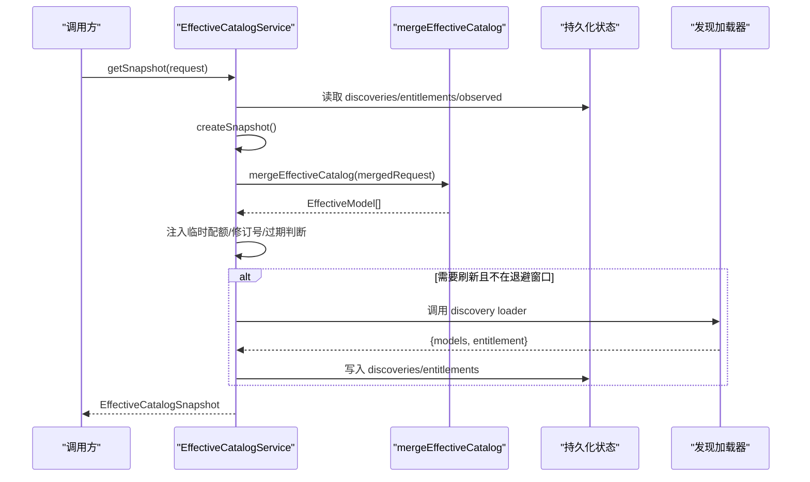
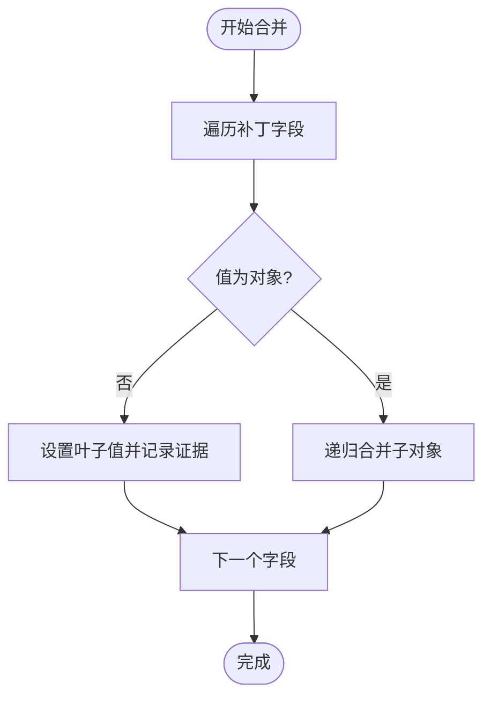
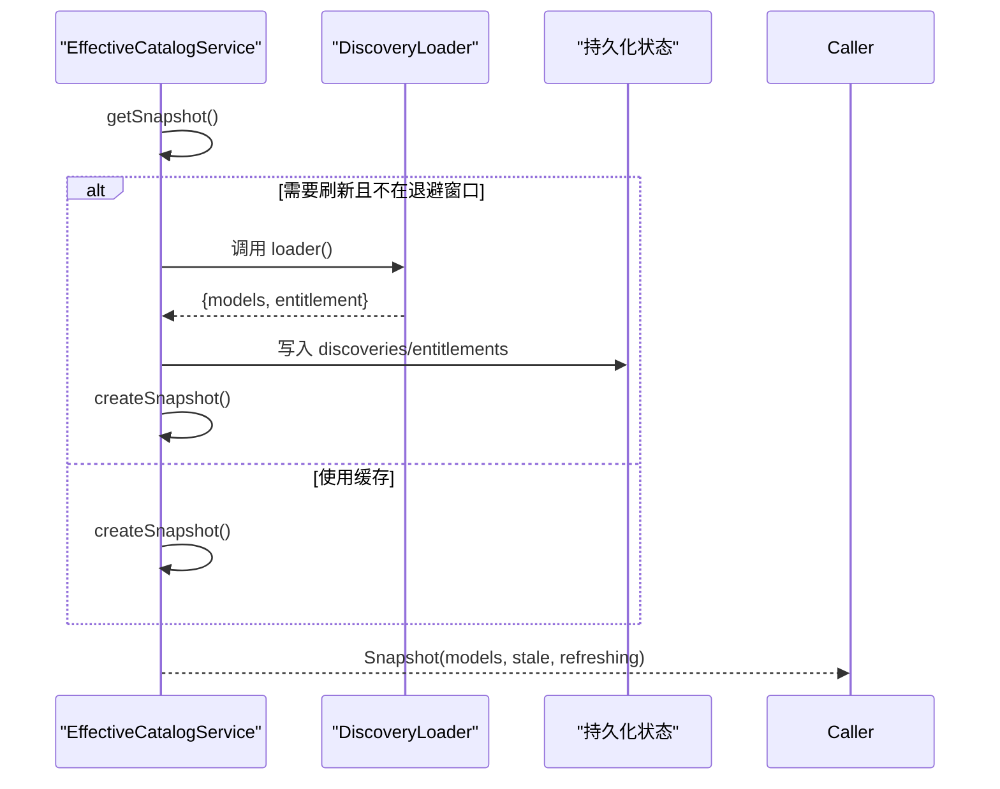
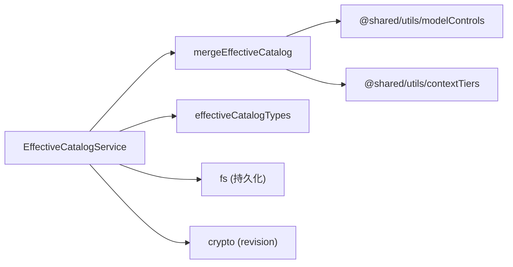

# 有效配置计算

<cite>
**本文引用的文件**
- [EffectiveCatalogService.ts](file://src/main/settings/EffectiveCatalogService.ts)
- [effectiveCatalogMerge.ts](file://src/main/settings/effectiveCatalogMerge.ts)
- [effectiveCatalogTypes.ts](file://src/main/settings/effectiveCatalogTypes.ts)
- [EffectiveCatalogService.test.ts](file://src/main/settings/EffectiveCatalogService.test.ts)
- [settingsDefaults.ts](file://src/main/settings/settingsDefaults.ts)
- [SettingsService.ts](file://src/main/settings/SettingsService.ts)
</cite>

## 目录
1. [简介](#简介)
2. [项目结构](#项目结构)
3. [核心组件](#核心组件)
4. [架构总览](#架构总览)
5. [详细组件分析](#详细组件分析)
6. [依赖关系分析](#依赖关系分析)
7. [性能考量](#性能考量)
8. [故障排查指南](#故障排查指南)
9. [结论](#结论)
10. [附录](#附录)

## 简介
本文件系统性说明“有效配置计算”机制：EffectiveCatalogService 如何合并用户配置、默认设置与运行时参数，生成最终的有效模型清单（Effective Catalog）。文档覆盖以下关键点：
- 配置优先级规则与冲突解决策略
- 验证规则与安全边界
- 动态更新机制（发现、授权、观测证据、配额）
- 配置继承、覆盖逻辑、条件配置与环境特定设置
- 复杂场景与边界情况的实际示例

## 项目结构
有效配置计算的核心位于 settings 模块，围绕 EffectiveCatalogService 与 effectiveCatalogMerge 实现。类型定义集中在 effectiveCatalogTypes，测试用例覆盖大量边界行为。

图表来源
- [EffectiveCatalogService.ts:84-163](file://src/main/settings/EffectiveCatalogService.ts#L84-L163)
- [effectiveCatalogMerge.ts:472-596](file://src/main/settings/effectiveCatalogMerge.ts#L472-L596)
- [effectiveCatalogTypes.ts:88-105](file://src/main/settings/effectiveCatalogTypes.ts#L88-L105)

章节来源
- [EffectiveCatalogService.ts:84-163](file://src/main/settings/EffectiveCatalogService.ts#L84-L163)
- [effectiveCatalogMerge.ts:472-596](file://src/main/settings/effectiveCatalogMerge.ts#L472-L596)
- [effectiveCatalogTypes.ts:88-105](file://src/main/settings/effectiveCatalogTypes.ts#L88-L105)

## 核心组件
- EffectiveCatalogService：负责请求快照、发现刷新、观测证据记录、临时配额注入、状态持久化与监听器广播。
- mergeEffectiveCatalog：将多个“层”按严格顺序合并为最终模型集合，并记录每个字段的获胜来源与冲突信息。
- effectiveCatalogTypes：定义请求、层贡献、持久化状态等关键类型与常量。

章节来源
- [EffectiveCatalogService.ts:84-163](file://src/main/settings/EffectiveCatalogService.ts#L84-L163)
- [effectiveCatalogMerge.ts:472-596](file://src/main/settings/effectiveCatalogMerge.ts#L472-L596)
- [effectiveCatalogTypes.ts:88-105](file://src/main/settings/effectiveCatalogTypes.ts#L88-L105)

## 架构总览
有效配置计算采用“分层叠加 + 字段级合并 + 审计证据”的架构。各层按固定顺序应用，后一层可覆盖前一层同名字段；每个字段的最终值都附带来源、时间戳与冲突历史，便于追踪与调试。

图表来源
- [EffectiveCatalogService.ts:150-163](file://src/main/settings/EffectiveCatalogService.ts#L150-L163)
- [EffectiveCatalogService.ts:246-298](file://src/main/settings/EffectiveCatalogService.ts#L246-L298)
- [effectiveCatalogMerge.ts:472-596](file://src/main/settings/effectiveCatalogMerge.ts#L472-L596)

## 详细组件分析

### 配置优先级与合并顺序
有效配置的合并顺序是固定的，后者优先覆盖前者同名字段：
1. catalog（编译型目录）
2. discovery（运行时发现）
3. overlay（精确覆盖，仅作用于已准入模型）
4. entitlement（授权层）
5. observed（观测证据，数组支持多条）
6. maintainedSurface（维护面）
7. user（用户偏好，受所有权限制）
8. userOverride（用户最高优先级覆盖）

该顺序在合并函数中明确体现，确保系统行为可预测且可审计。

章节来源
- [effectiveCatalogMerge.ts:472-497](file://src/main/settings/effectiveCatalogMerge.ts#L472-L497)

### 字段级合并与冲突记录
- 合并粒度为字段级：对象字段递归合并，区分型联合（如 controls.reasoning）整体替换。
- 每个字段都会记录“获胜层”的证据（source、observedAt、detail 等），并在值变化时记录冲突历史（previous -> current）。
- 支持 fieldFactSources 将字段级来源元数据投影到具体叶子字段。

图表来源
- [effectiveCatalogMerge.ts:173-215](file://src/main/settings/effectiveCatalogMerge.ts#L173-L215)
- [effectiveCatalogMerge.ts:217-247](file://src/main/settings/effectiveCatalogMerge.ts#L217-L247)

章节来源
- [effectiveCatalogMerge.ts:173-247](file://src/main/settings/effectiveCatalogMerge.ts#L173-L247)

### 安全与准入控制
- enforceDiscoveryAdmission：过滤掉未获准入的发现模型，防止恶意或不受信任的模型进入有效目录。
- gateOverlayToExactAdmittedModels：overlay 只能作用于已准入模型（catalog 或 discovery 中的可用模型），避免凭空创建模型。
- 协议匹配：当层指定 protocol 但与请求不一致时，非 observed 层将被忽略，保证环境隔离。

章节来源
- [effectiveCatalogMerge.ts:446-470](file://src/main/settings/effectiveCatalogMerge.ts#L446-L470)
- [effectiveCatalogMerge.ts:315-318](file://src/main/settings/effectiveCatalogMerge.ts#L315-L318)

### 可用性门控与预算约束
- 若模型 availability 为 available 但 defaultBudgetTokens <= 0，则强制标记 unavailable，并记录失败关闭原因。
- 若 providerAvailability 指示不可用，则覆盖模型可用性为 unavailable。
- 保留编译型正预算不被零预算发现覆盖，保障执行能力。

章节来源
- [effectiveCatalogMerge.ts:550-579](file://src/main/settings/effectiveCatalogMerge.ts#L550-L579)
- [effectiveCatalogMerge.ts:406-413](file://src/main/settings/effectiveCatalogMerge.ts#L406-L413)

### 上下文层级与 Max 保护
- 当 maxContext 控制锁定到某 tierId 时，即使授权层提供较低阈值，仍保护目录定义的结构性 Max 层级。
- 上下文层级合并会考虑激活方式与授权状态，确保 UI 与执行一致。

章节来源
- [effectiveCatalogMerge.ts:249-284](file://src/main/settings/effectiveCatalogMerge.ts#L249-L284)

### 动态更新机制
- 发现刷新：getSnapshot 检测到 stale 或无缓存时，触发异步刷新；同一 key 并发请求去重；失败时启用指数退避。
- 观测证据：recordObserved 持久化运行期观测结果（如工具调用能力），带过期时间与协议限定。
- 临时配额：recordTransientQuota 注入短期配额限制，影响当前会话的模型可用性。
- 失效与重算：invalidateDiscovery 清除相关缓存并重新计算最新快照。

图表来源
- [EffectiveCatalogService.ts:150-163](file://src/main/settings/EffectiveCatalogService.ts#L150-L163)
- [EffectiveCatalogService.ts:246-298](file://src/main/settings/EffectiveCatalogService.ts#L246-L298)
- [EffectiveCatalogService.ts:300-340](file://src/main/settings/EffectiveCatalogService.ts#L300-L340)

章节来源
- [EffectiveCatalogService.ts:123-163](file://src/main/settings/EffectiveCatalogService.ts#L123-L163)
- [EffectiveCatalogService.ts:246-298](file://src/main/settings/EffectiveCatalogService.ts#L246-L298)
- [EffectiveCatalogService.ts:300-340](file://src/main/settings/EffectiveCatalogService.ts#L300-L340)

### 用户配置与所有权限制
- 当 catalogOwnership 为 app-managed 时，user 层不能凭空创建模型，只能修改已存在的模型字段；custom 标记的用户自定义模型除外。
- 当 catalogOwnership 为 user-managed 时，允许完整覆盖（包括 route 等敏感字段）。

章节来源
- [effectiveCatalogMerge.ts:286-305](file://src/main/settings/effectiveCatalogMerge.ts#L286-L305)
- [effectiveCatalogMerge.ts:330-335](file://src/main/settings/effectiveCatalogMerge.ts#L330-L335)

### 路由选项与首选路由
- 若存在显式 routeOptions，则基于 preferredRouteOptionId 选择首选路由；若首选不可用，则回退到默认路由。
- 用户可通过 userOverride 指定 preferredRouteOptionId，但不能随意变更 provider 级路由。

章节来源
- [effectiveCatalogMerge.ts:498-539](file://src/main/settings/effectiveCatalogMerge.ts#L498-L539)

### 环境与协议隔离
- 层可携带 protocol 字段，仅在匹配请求协议时生效（observed 层例外，用于跨协议证据）。
- 通过 cacheKey(providerId, accountId, protocol) 隔离不同账户与协议的缓存。

章节来源
- [EffectiveCatalogService.ts:68-74](file://src/main/settings/EffectiveCatalogService.ts#L68-L74)
- [effectiveCatalogMerge.ts:315-318](file://src/main/settings/effectiveCatalogMerge.ts#L315-L318)

### 实际示例与边界情况
- 发现模型无正预算：availability 被置为 unavailable，并记录失败关闭原因。
- 历史媒体输出条目清理：自动移除不受支持的模型标识。
- 标点等价 ID 重键：live 发现的 modelId 与 catalog 的等效 ID 合并，保留别名与证据。
- 应用管理偏好不创造新模型：仅能修改已准入模型。
- 全量用户管理覆盖：允许完全自定义路由与能力。

章节来源
- [EffectiveCatalogService.test.ts:66-96](file://src/main/settings/EffectiveCatalogService.test.ts#L66-L96)
- [EffectiveCatalogService.test.ts:392-436](file://src/main/settings/EffectiveCatalogService.test.ts#L392-L436)
- [EffectiveCatalogService.test.ts:469-498](file://src/main/settings/EffectiveCatalogService.test.ts#L469-L498)
- [EffectiveCatalogService.test.ts:365-390](file://src/main/settings/EffectiveCatalogService.test.ts#L365-L390)
- [EffectiveCatalogService.test.ts:630-641](file://src/main/settings/EffectiveCatalogService.test.ts#L630-L641)

## 依赖关系分析
- EffectiveCatalogService 依赖 effectiveCatalogMerge 进行合并，依赖 effectiveCatalogTypes 的类型与常量。
- SettingsService 与 settingsDefaults 提供应用级默认设置与持久化，但不直接参与有效目录合并流程。
- 外部依赖：文件系统（持久化）、crypto（revision 哈希）、共享类型与工具（模型控制、上下文层级）。

图表来源
- [EffectiveCatalogService.ts:1-26](file://src/main/settings/EffectiveCatalogService.ts#L1-L26)
- [effectiveCatalogMerge.ts:1-18](file://src/main/settings/effectiveCatalogMerge.ts#L1-L18)
- [effectiveCatalogTypes.ts:1-21](file://src/main/settings/effectiveCatalogTypes.ts#L1-L21)

章节来源
- [EffectiveCatalogService.ts:1-26](file://src/main/settings/EffectiveCatalogService.ts#L1-L26)
- [effectiveCatalogMerge.ts:1-18](file://src/main/settings/effectiveCatalogMerge.ts#L1-L18)
- [effectiveCatalogTypes.ts:1-21](file://src/main/settings/effectiveCatalogTypes.ts#L1-L21)

## 性能考量
- 发现刷新去重：同一 key 的并发刷新只执行一次，减少网络开销。
- 指数退避：刷新失败时按指数退避，避免雪崩。
- 快照指纹：避免重复广播相同快照，降低渲染端压力。
- 字段级合并：最小化不必要的全量复制，提升合并效率。
- 离线回退：刷新期间返回 last-known-good，保证可用性。

章节来源
- [EffectiveCatalogService.ts:246-298](file://src/main/settings/EffectiveCatalogService.ts#L246-L298)
- [EffectiveCatalogService.ts:365-388](file://src/main/settings/EffectiveCatalogService.ts#L365-L388)
- [EffectiveCatalogService.ts:390-415](file://src/main/settings/EffectiveCatalogService.ts#L390-L415)

## 故障排查指南
- 刷新失败：检查 lastRefreshError 与退避窗口；确认 discovery loader 是否可达。
- 模型不可用：查看 provenance 中 availability/unavailableReason 的来源与原因。
- 权限不足：确认 catalogOwnership 与 user 层覆盖范围；app-managed 下禁止创建新模型。
- 协议不匹配：检查层 protocol 是否与请求一致；非 observed 层会被忽略。
- 预算为零：若 defaultBudgetTokens <= 0，availability 会被置为 unavailable；需补充正预算。

章节来源
- [EffectiveCatalogService.ts:246-298](file://src/main/settings/EffectiveCatalogService.ts#L246-L298)
- [effectiveCatalogMerge.ts:550-579](file://src/main/settings/effectiveCatalogMerge.ts#L550-L579)
- [EffectiveCatalogService.test.ts:714-726](file://src/main/settings/EffectiveCatalogService.test.ts#L714-L726)

## 结论
EffectiveCatalogService 与 mergeEffectiveCatalog 共同实现了安全、可审计、可扩展的有效配置计算体系。通过严格的优先级顺序、字段级合并、安全准入与动态更新机制，系统能够在复杂环境中稳定地生成最终配置，并提供完整的证据链以支持排错与合规。

## 附录

### 配置优先级与覆盖规则速查
- 顺序：catalog → discovery → overlay → entitlement → observed → maintainedSurface → user → userOverride
- 覆盖：后层覆盖前层同名字段；字段级合并，对象递归，区分型联合整体替换
- 安全：discovery 必须准入；overlay 仅限已准入模型；protocol 隔离
- 可用性：正预算门控；provider 不可用时全局不可用
- 用户限制：app-managed 不允许凭空创建模型；user-managed 允许全量覆盖

章节来源
- [effectiveCatalogMerge.ts:472-497](file://src/main/settings/effectiveCatalogMerge.ts#L472-L497)
- [effectiveCatalogMerge.ts:446-470](file://src/main/settings/effectiveCatalogMerge.ts#L446-L470)
- [effectiveCatalogMerge.ts:550-579](file://src/main/settings/effectiveCatalogMerge.ts#L550-L579)

### 动态更新与持久化
- 发现 TTL：默认 24 小时，过期即视为 stale
- 观测证据：带过期时间，按协议与 evidenceKey 去重
- 临时配额：会话内生效，过期自动移除
- 持久化：catalog-v4.json，包含 discoveries、entitlements、observed

章节来源
- [effectiveCatalogTypes.ts:20-21](file://src/main/settings/effectiveCatalogTypes.ts#L20-L21)
- [EffectiveCatalogService.ts:246-298](file://src/main/settings/EffectiveCatalogService.ts#L246-L298)
- [EffectiveCatalogService.ts:300-340](file://src/main/settings/EffectiveCatalogService.ts#L300-L340)
- [EffectiveCatalogService.ts:423-449](file://src/main/settings/EffectiveCatalogService.ts#L423-L449)