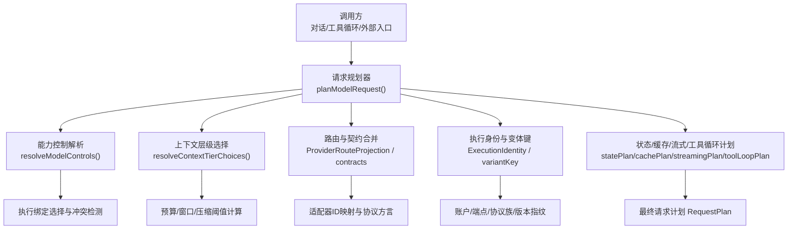
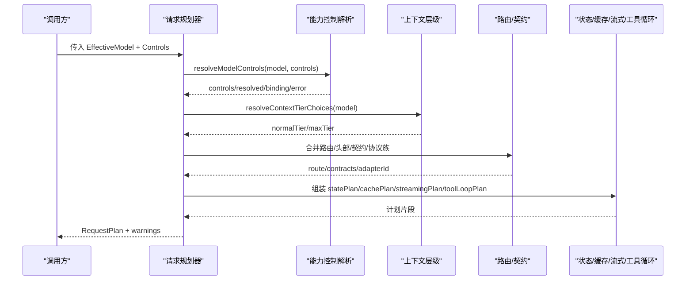
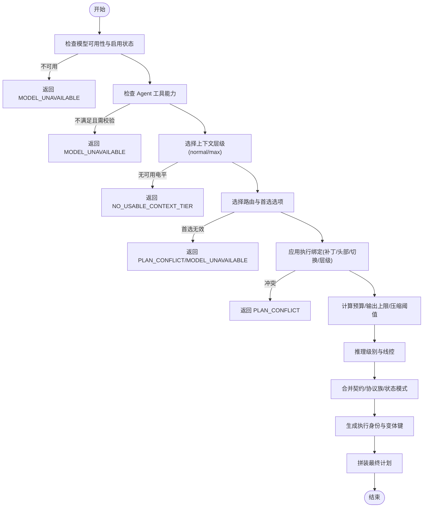
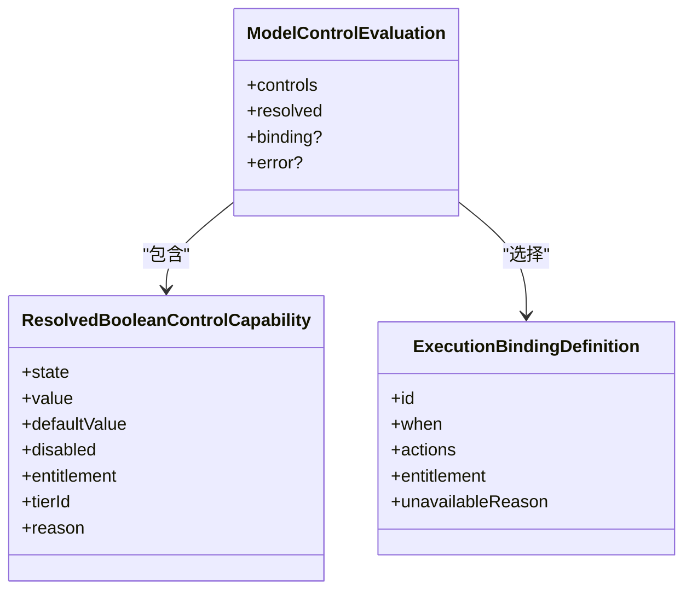
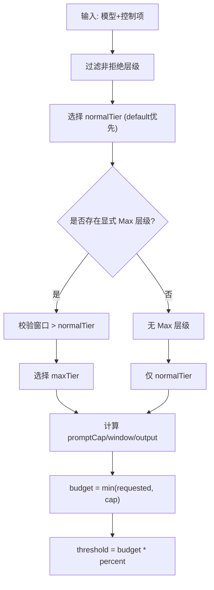
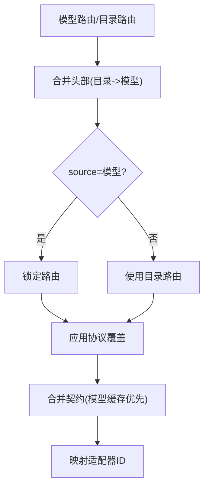
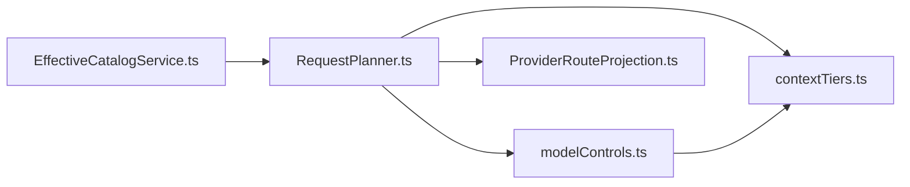

# 请求规划器

<cite>
**本文引用的文件**
- [RequestPlanner.ts](file://src/main/settings/RequestPlanner.ts)
- [RequestPlanner.test.ts](file://src/main/settings/RequestPlanner.test.ts)
- [EffectiveCatalogService.ts](file://src/main/settings/EffectiveCatalogService.ts)
- [ProviderRouteProjection.ts](file://src/main/settings/ProviderRouteProjection.ts)
- [contextTiers.ts](file://src/shared/utils/contextTiers.ts)
- [modelControls.ts](file://src/shared/utils/modelControls.ts)
</cite>

## 目录
1. [简介](#简介)
2. [项目结构](#项目结构)
3. [核心组件](#核心组件)
4. [架构总览](#架构总览)
5. [详细组件分析](#详细组件分析)
6. [依赖关系分析](#依赖关系分析)
7. [性能考虑](#性能考虑)
8. [故障排查指南](#故障排查指南)
9. [结论](#结论)
10. [附录](#附录)

## 简介
本文件围绕“请求规划器”展开，系统性说明 RequestPlanner 如何根据任务需求、模型能力与成本约束，智能选择最优的 LLM 提供商与路由。文档覆盖：
- 路由编译过程与协议契约合并
- 能力匹配算法（Fast/Max/Reasoning）
- 负载均衡策略（基于执行身份指纹与兼容性分组）
- 故障转移机制（失败关闭、约束拒绝、上下文层级降级）
- 请求优先级处理、重试策略、缓存策略与性能优化技术
- 完整流程图与实际使用示例，指导配置与优化请求路由策略

## 项目结构
请求规划器位于设置层，与有效目录服务、能力控制解析、上下文层级工具协同工作，形成“输入模型 + 控制项 -> 输出可执行计划”的稳定管线。

图表来源
- [RequestPlanner.ts:123-539](file://src/main/settings/RequestPlanner.ts#L123-L539)
- [modelControls.ts:244-328](file://src/shared/utils/modelControls.ts#L244-L328)
- [contextTiers.ts:106-143](file://src/shared/utils/contextTiers.ts#L106-L143)
- [ProviderRouteProjection.ts:11-25](file://src/main/settings/ProviderRouteProjection.ts#L11-L25)

章节来源
- [RequestPlanner.ts:123-539](file://src/main/settings/RequestPlanner.ts#L123-L539)
- [EffectiveCatalogService.ts:150-244](file://src/main/settings/EffectiveCatalogService.ts#L150-L244)
- [ProviderRouteProjection.ts:11-25](file://src/main/settings/ProviderRouteProjection.ts#L11-L25)
- [contextTiers.ts:106-143](file://src/shared/utils/contextTiers.ts#L106-L143)
- [modelControls.ts:244-328](file://src/shared/utils/modelControls.ts#L244-L328)

## 核心组件
- 请求规划器 planModelRequest：将 EffectiveModel 与用户/策略控制项转换为可执行的 RequestPlan，包含路由、头部、补丁、预算、推理模式、状态模式、缓存策略等。
- 能力控制解析 resolveModelControls：评估 Fast/Max/Reasoning 控制项，选择最具体的执行绑定并检测冲突。
- 上下文层级 contextTiers：选择正常/最大上下文层级，计算提示预算、输出上限、压缩阈值。
- 路由投影 ProviderRouteProjection：合并目录与模型级路由，决定协议覆盖与锁定。
- 有效目录服务 EffectiveCatalogService：聚合发现、授权、观测数据，生成带修订号的模型快照，支持缓存与退避刷新。

章节来源
- [RequestPlanner.ts:123-539](file://src/main/settings/RequestPlanner.ts#L123-L539)
- [modelControls.ts:244-328](file://src/shared/utils/modelControls.ts#L244-L328)
- [contextTiers.ts:106-143](file://src/shared/utils/contextTiers.ts#L106-L143)
- [ProviderRouteProjection.ts:11-25](file://src/main/settings/ProviderRouteProjection.ts#L11-L25)
- [EffectiveCatalogService.ts:150-244](file://src/main/settings/EffectiveCatalogService.ts#L150-L244)

## 架构总览
请求规划器在“能力控制 -> 上下文层级 -> 路由/契约 -> 执行身份 -> 计划拼装”的流水线中运行，确保每次变更（账户、端点、协议、控制项、绑定）都能产生唯一且稳定的执行指纹，便于缓存、追踪与回滚。

图表来源
- [RequestPlanner.ts:123-539](file://src/main/settings/RequestPlanner.ts#L123-L539)
- [modelControls.ts:244-328](file://src/shared/utils/modelControls.ts#L244-L328)
- [contextTiers.ts:106-143](file://src/shared/utils/contextTiers.ts#L106-L143)
- [ProviderRouteProjection.ts:11-25](file://src/main/settings/ProviderRouteProjection.ts#L11-L25)

## 详细组件分析

### 请求规划器 planModelRequest
- 输入校验与可用性检查：模型不可用或禁用直接返回错误；Agent 工具能力未知/不支持时默认失败关闭（可通过参数关闭）。
- 上下文层级选择：依据 maxContext 控制项与可用层级，确定 normalTier 或 maxTier；若无可用的层级则报错。
- 路由与首选选项：支持 preferredRouteOptionId 与 routeOptions；若首选不存在或不可用，返回冲突或不可用错误。
- 执行绑定应用：按 when 条件选择最具体绑定，应用 request-patch/request-headers/model-switch/client-tier 动作；冲突时返回 PLAN_CONFLICT。
- 头部与正文补丁合并：严格检测冲突，避免重复或不兼容字段。
- 预算与输出上限：结合上下文层级与默认预算，计算 contextBudgetTokens、maxOutputTokens、compactionThresholdTokens。
- 推理模式与线控：根据模型推理能力与控制项选择级别；当 model-switch 标记 suppressReasoningWire 时，关闭推理线控。
- 契约与协议：合并路由契约与模型级缓存契约；校验 stateMode 是否受支持；推导 tool-loop 续传补丁。
- 执行身份与变体键：基于 providerId、账户哈希、端点哈希、协议族/方言/版本、目录修订、路由修订、模型快照、兼容性分组、绑定集合、fast/context/reasoning 组合等生成 fingerprint 与 variantKey，用于缓存与负载均衡。
- 计划拼装：输出 statePlan、cachePlan、toolLoopPlan、streamingPlan、contextTransitionPlan、bodyPatch、headers、temperature 等。

图表来源
- [RequestPlanner.ts:123-539](file://src/main/settings/RequestPlanner.ts#L123-L539)

章节来源
- [RequestPlanner.ts:123-539](file://src/main/settings/RequestPlanner.ts#L123-L539)
- [RequestPlanner.test.ts:57-635](file://src/main/settings/RequestPlanner.test.ts#L57-L635)

### 能力控制解析与执行绑定选择
- 控制项求值：fixed/selectable/provider-managed/unknown/unsupported 五种状态，结合用户请求与默认值得出最终 controls。
- 绑定选择：对 fast/maxContext/reasoning 进行条件匹配，按“更具体”的 when 条件排序；若多个绑定同等具体且动作不同，判定为冲突。
- 执行目标验证：model-switch 的目标模型需在有效目录中存在且可用；目标路由协议必须与当前协议一致；可选指定 routeOptionId 并校验其可用性。
- 结果注入：将 bindingId、effectiveModelId、reason 等信息回填到 resolved 控制项，供上层展示与决策。

图表来源
- [modelControls.ts:13-18](file://src/shared/utils/modelControls.ts#L13-L18)
- [modelControls.ts:58-77](file://src/shared/utils/modelControls.ts#L58-L77)
- [modelControls.ts:79-154](file://src/shared/utils/modelControls.ts#L79-L154)
- [modelControls.ts:244-328](file://src/shared/utils/modelControls.ts#L244-L328)

章节来源
- [modelControls.ts:58-77](file://src/shared/utils/modelControls.ts#L58-L77)
- [modelControls.ts:79-154](file://src/shared/utils/modelControls.ts#L79-L154)
- [modelControls.ts:244-328](file://src/shared/utils/modelControls.ts#L244-L328)

### 上下文层级与预算计算
- 层级选择：normalTier 优先 granted/default，其次 unknown/default；maxTier 需显式或固定指向且窗口大于 normalTier。
- 预算与输出：promptCap 来自 maxPromptTokens 或 maxTotalTokens；outputTokens 优先 tier 声明，否则从窗口推导；budget 取 requestedBudget 与 tierCap 的较小值。
- 压缩阈值：基于 budget 与百分比计算 compactionThresholdTokens，用于提示压缩触发点。

图表来源
- [contextTiers.ts:106-143](file://src/shared/utils/contextTiers.ts#L106-L143)
- [contextTiers.ts:13-69](file://src/shared/utils/contextTiers.ts#L13-L69)

章节来源
- [contextTiers.ts:106-143](file://src/shared/utils/contextTiers.ts#L106-L143)
- [contextTiers.ts:13-69](file://src/shared/utils/contextTiers.ts#L13-L69)

### 路由编译与协议契约
- 路由优先级：模型级路由覆盖目录路由，保留目录 headers 并在模型级叠加；若 source=model 则视为锁定。
- 协议覆盖：根据模型所选协议，应用 ProviderProtocolOverride，产出 CatalogLayerContribution。
- 契约合并：route.contracts 与 effectiveModel.cacheContract 合并，模型级缓存契约优先；未提供时使用 fail-closed 默认契约。
- 适配器映射：根据 protocol 映射 adapterId，统一后续执行路径。

图表来源
- [ProviderRouteProjection.ts:11-25](file://src/main/settings/ProviderRouteProjection.ts#L11-L25)
- [ProviderRouteProjection.ts:27-48](file://src/main/settings/ProviderRouteProjection.ts#L27-L48)
- [RequestPlanner.ts:388-392](file://src/main/settings/RequestPlanner.ts#L388-L392)

章节来源
- [ProviderRouteProjection.ts:11-25](file://src/main/settings/ProviderRouteProjection.ts#L11-L25)
- [ProviderRouteProjection.ts:27-48](file://src/main/settings/ProviderRouteProjection.ts#L27-L48)
- [RequestPlanner.ts:388-392](file://src/main/settings/RequestPlanner.ts#L388-L392)

### 负载均衡策略与故障转移
- 负载均衡：通过 executionIdentity.fingerprint 与 compatibilityGroup 区分不同账户、端点、协议族/版本、控制组合与绑定集合，天然实现多租户与多端点的隔离与均衡。
- 故障转移：
  - 失败关闭：工具能力未知/不支持时默认阻断，除非显式允许探测。
  - 约束拒绝：stateMode 不受支持或绑定冲突时返回 CONSTRAINT_REJECTED/PLAN_CONFLICT。
  - 上下文降级：若无可用层级或窗口缺失，返回 NO_USABLE_CONTEXT_TIER。
  - 路由回退：preferredRouteOptionId 无效时回退至协议匹配的路由选项。
- 重试策略：由上层调用方结合 RequestPlanningResult 的错误码与消息决定重试或降级；规划器本身不内建指数退避，但有效目录服务具备发现刷新退避。

章节来源
- [RequestPlanner.ts:123-539](file://src/main/settings/RequestPlanner.ts#L123-L539)
- [EffectiveCatalogService.ts:246-298](file://src/main/settings/EffectiveCatalogService.ts#L246-L298)

### 请求优先级、重试、缓存与性能优化
- 请求优先级：通过 controls.fastModel/maxContextMode/reasoningLevel 表达优先级；执行绑定选择遵循“更具体”的 when 条件，保证高优场景优先命中。
- 重试策略：建议基于错误码分级重试（如网络/配额/限流），规划器错误多为配置/能力问题，应优先修正而非盲目重试。
- 缓存策略：
  - 目录缓存：EffectiveCatalogService 维护 discovery/entitlement/observed 层，带 TTL 与退避刷新，减少重复发现开销。
  - 请求缓存：RequestPlan 中的 cachePlan 由契约定义（mode/keyCarrier/breakpointCarrier/telemetry/ttl），上层据此实现请求级缓存。
- 性能优化：
  - 稳定 JSON 序列化与哈希：revisionFor/stableJson 保证相同语义输入产生相同指纹，利于缓存命中。
  - 最小化头部/补丁冲突：mergeHeaders/mergePatch 提前检测冲突，避免运行时失败。
  - 上下文预算精确计算：避免过度压缩或溢出，提升吞吐与稳定性。

章节来源
- [RequestPlanner.ts:104-117](file://src/main/settings/RequestPlanner.ts#L104-L117)
- [RequestPlanner.ts:388-482](file://src/main/settings/RequestPlanner.ts#L388-L482)
- [EffectiveCatalogService.ts:150-244](file://src/main/settings/EffectiveCatalogService.ts#L150-L244)
- [EffectiveCatalogService.ts:246-298](file://src/main/settings/EffectiveCatalogService.ts#L246-L298)

## 依赖关系分析

图表来源
- [RequestPlanner.ts:123-539](file://src/main/settings/RequestPlanner.ts#L123-L539)
- [modelControls.ts:244-328](file://src/shared/utils/modelControls.ts#L244-L328)
- [contextTiers.ts:106-143](file://src/shared/utils/contextTiers.ts#L106-L143)
- [ProviderRouteProjection.ts:11-25](file://src/main/settings/ProviderRouteProjection.ts#L11-L25)
- [EffectiveCatalogService.ts:150-244](file://src/main/settings/EffectiveCatalogService.ts#L150-L244)

章节来源
- [RequestPlanner.ts:123-539](file://src/main/settings/RequestPlanner.ts#L123-L539)
- [EffectiveCatalogService.ts:150-244](file://src/main/settings/EffectiveCatalogService.ts#L150-L244)

## 性能考虑
- 目录发现退避：EffectiveCatalogService 使用指数退避限制频繁刷新，降低后端压力。
- 快照去抖：emit 前比较指纹，避免重复广播。
- 预算与压缩：合理设置 compactionThresholdPercent，避免过早压缩影响质量或过晚导致溢出。
- 头部/补丁冲突检测：提前失败，减少网络往返。
- 稳定指纹：确保缓存命中率，减少重复计算。

[本节为通用性能建议，无需特定文件引用]

## 故障排查指南
- 常见错误码与含义：
  - MODEL_UNAVAILABLE：模型不可用/未启用/工具能力不足/目标模型或路由不可用。
  - PLAN_CONFLICT：首选路由不存在、绑定冲突、头部/补丁冲突、协议不兼容。
  - NO_USABLE_CONTEXT_TIER：无可用电平的上下文层级或缺失窗口/预算。
  - CONSTRAINT_REJECTED：stateMode 不受支持或绑定动作不被接受。
- 定位步骤：
  - 检查 controls 与 executionBindings 的 when 条件是否匹配。
  - 确认 preferredRouteOptionId 与 routeOptions 的 availability。
  - 核对 contextTiers 的 entitlement 与数值窗口。
  - 查看 contracts 的 state.supportedModes 与 cache.mode。
  - 关注 warnings 中的“未验证”提示，必要时调整策略或等待能力探测完成。
- 参考用例：测试文件中覆盖了 Fast/Max/Reasoning/路由切换/缓存契约/状态模式等多种场景，可作为对照。

章节来源
- [RequestPlanner.test.ts:57-635](file://src/main/settings/RequestPlanner.test.ts#L57-L635)
- [RequestPlanner.ts:123-539](file://src/main/settings/RequestPlanner.ts#L123-L539)

## 结论
请求规划器以“能力控制 + 上下文层级 + 路由契约 + 执行身份”为核心，将高层意图转化为稳定、可缓存、可追踪的执行计划。通过严格的冲突检测与失败关闭策略，保障系统在复杂配置下的鲁棒性；借助目录服务缓存与退避机制，提升整体性能与可扩展性。实际使用中，应优先明确模型能力与约束，再配置路由与绑定，以获得最佳性价比与稳定性。

[本节为总结性内容，无需特定文件引用]

## 附录
- 配置与优化建议：
  - 明确 Fast/Max/Reasoning 的控制项与绑定，确保 when 条件与业务优先级一致。
  - 为关键模型配置合适的 contextTiers 与 defaultBudgetTokens，避免溢出或浪费。
  - 利用 preferredRouteOptionId 锁定稳定路由，或在协议变化时平滑迁移。
  - 结合 cachePlan 与 contracts 开启请求级缓存，减少重复调用。
  - 监控 warnings 与错误码，及时调整策略或升级模型能力。

[本节为通用指导，无需特定文件引用]