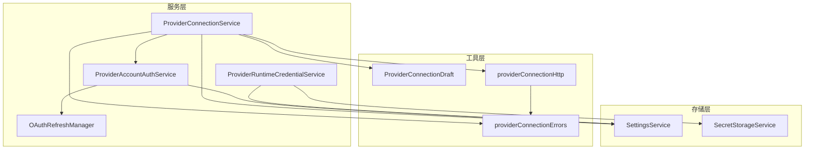
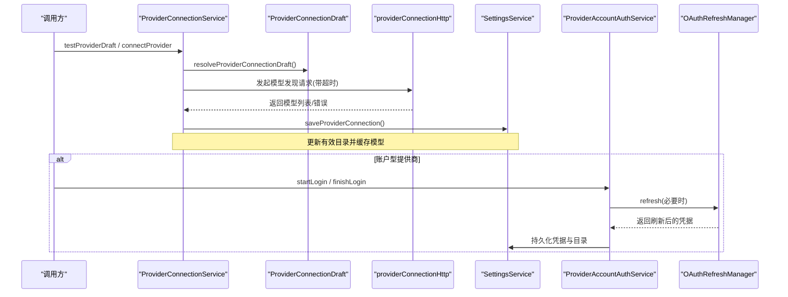
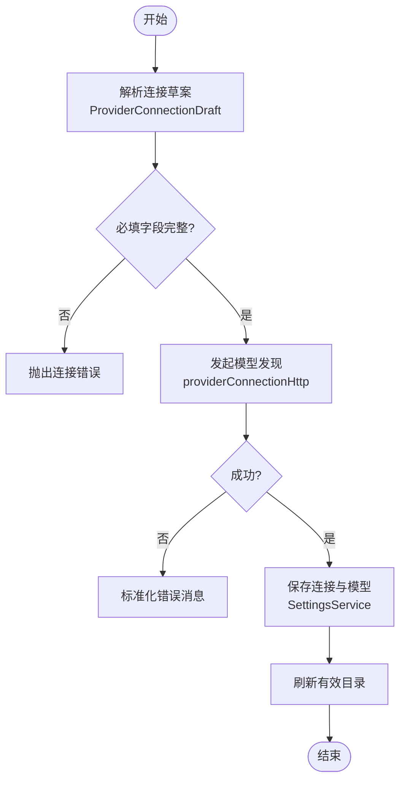
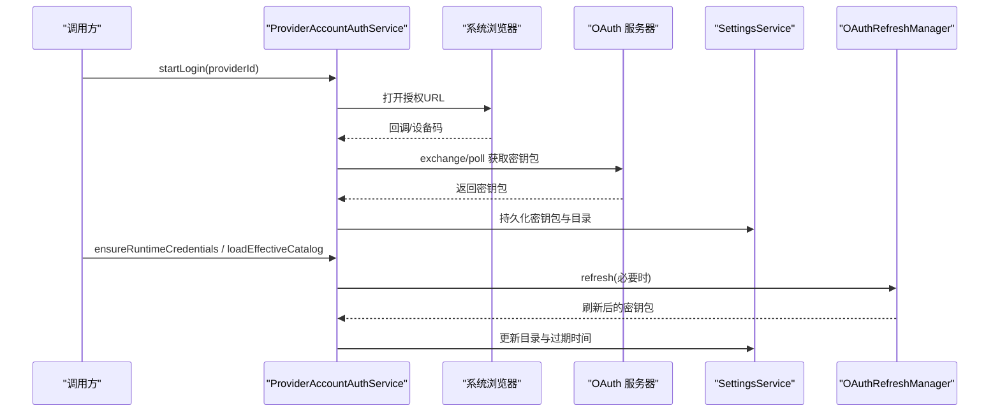
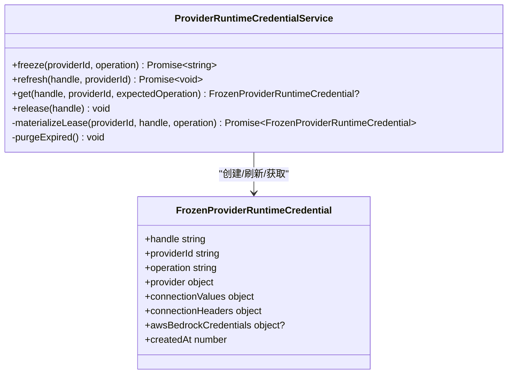
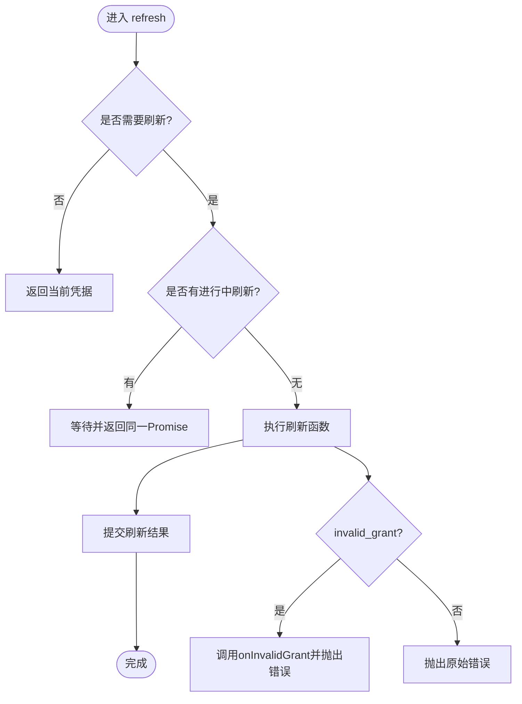
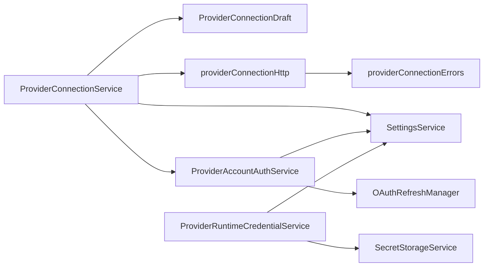

# 连接管理服务

<cite>
**本文引用的文件**
- [ProviderConnectionService.ts](file://src/main/settings/ProviderConnectionService.ts)
- [OAuthRefreshManager.ts](file://src/main/settings/OAuthRefreshManager.ts)
- [ProviderAccountAuthService.ts](file://src/main/settings/ProviderAccountAuthService.ts)
- [ProviderRuntimeCredentialService.ts](file://src/main/settings/ProviderRuntimeCredentialService.ts)
- [ProviderConnectionDraft.ts](file://src/main/settings/ProviderConnectionDraft.ts)
- [providerConnectionErrors.ts](file://src/main/settings/providerConnectionErrors.ts)
- [SecretStorageService.ts](file://src/main/settings/SecretStorageService.ts)
- [SettingsService.ts](file://src/main/settings/SettingsService.ts)
- [providerConnectionHttp.ts](file://src/main/settings/providerConnectionHttp.ts)
</cite>

## 目录
1. [简介](#简介)
2. [项目结构](#项目结构)
3. [核心组件](#核心组件)
4. [架构总览](#架构总览)
5. [详细组件分析](#详细组件分析)
6. [依赖关系分析](#依赖关系分析)
7. [性能与并发](#性能与并发)
8. [故障排除指南](#故障排除指南)
9. [结论](#结论)
10. [附录：配置示例](#附录：配置示例)

## 简介
本文件面向连接管理服务，系统性阐述 ProviderConnectionService 如何管理 LLM 提供商的连接生命周期，覆盖连接建立、认证处理（含 OAuth）、令牌刷新、连接池与会话保持、健康检查、超时与错误恢复、并发控制与资源清理策略。文档同时提供配置示例与故障排除建议，帮助读者理解并优化连接性能。

## 项目结构
连接管理相关代码集中在 settings 模块中，围绕“服务层 + 工具层 + 存储层”组织：
- 服务层：ProviderConnectionService、ProviderAccountAuthService、ProviderRuntimeCredentialService、OAuthRefreshManager
- 工具层：ProviderConnectionDraft、providerConnectionHttp、providerConnectionErrors
- 存储层：SettingsService、SecretStorageService

图表来源
- [ProviderConnectionService.ts:53-356](file://src/main/settings/ProviderConnectionService.ts#L53-L356)
- [ProviderAccountAuthService.ts:99-530](file://src/main/settings/ProviderAccountAuthService.ts#L99-L530)
- [ProviderRuntimeCredentialService.ts:51-146](file://src/main/settings/ProviderRuntimeCredentialService.ts#L51-L146)
- [OAuthRefreshManager.ts:49-86](file://src/main/settings/OAuthRefreshManager.ts#L49-L86)
- [ProviderConnectionDraft.ts:18-77](file://src/main/settings/ProviderConnectionDraft.ts#L18-L77)
- [providerConnectionHttp.ts:11-47](file://src/main/settings/providerConnectionHttp.ts#L11-L47)
- [providerConnectionErrors.ts:1-15](file://src/main/settings/providerConnectionErrors.ts#L1-L15)
- [SettingsService.ts:94-200](file://src/main/settings/SettingsService.ts#L94-L200)
- [SecretStorageService.ts:72-262](file://src/main/settings/SecretStorageService.ts#L72-L262)

章节来源
- [ProviderConnectionService.ts:53-356](file://src/main/settings/ProviderConnectionService.ts#L53-L356)
- [ProviderAccountAuthService.ts:99-530](file://src/main/settings/ProviderAccountAuthService.ts#L99-L530)
- [ProviderRuntimeCredentialService.ts:51-146](file://src/main/settings/ProviderRuntimeCredentialService.ts#L51-L146)
- [OAuthRefreshManager.ts:49-86](file://src/main/settings/OAuthRefreshManager.ts#L49-L86)
- [ProviderConnectionDraft.ts:18-77](file://src/main/settings/ProviderConnectionDraft.ts#L18-L77)
- [providerConnectionHttp.ts:11-47](file://src/main/settings/providerConnectionHttp.ts#L11-L47)
- [providerConnectionErrors.ts:1-15](file://src/main/settings/providerConnectionErrors.ts#L1-L15)
- [SettingsService.ts:94-200](file://src/main/settings/SettingsService.ts#L94-L200)
- [SecretStorageService.ts:72-262](file://src/main/settings/SecretStorageService.ts#L72-L262)

## 核心组件
- ProviderConnectionService：对外暴露连接管理的统一入口，负责连接测试、连接保存、断开、账号登录流程协调、模型发现与有效目录刷新。
- ProviderAccountAuthService：账户型提供商的 OAuth 登录、状态查询、目录发现、凭据刷新与持久化。
- ProviderRuntimeCredentialService：运行时凭据的冻结、刷新、获取与释放，支持 Google Vertex、Amazon Bedrock 等动态凭据解析。
- OAuthRefreshManager：统一的 OAuth 令牌刷新管理器，具备防抖、并发去重、失效授权处理与回调机制。
- ProviderConnectionDraft：将用户输入与已存值合并为连接草案，校验必填字段并生成 baseUrl。
- providerConnectionHttp：HTTP 请求封装，统一超时、错误格式化与模型发现数据解析。
- SecretStorageService：安全存储 API Key、OAuth 凭据等敏感信息，提供加密、权限加固与损坏隔离。
- SettingsService：设置持久化与归一化，提供连接值读取、OAuth 凭据读写、提供商断开/连接等操作。

章节来源
- [ProviderConnectionService.ts:53-356](file://src/main/settings/ProviderConnectionService.ts#L53-L356)
- [ProviderAccountAuthService.ts:99-530](file://src/main/settings/ProviderAccountAuthService.ts#L99-L530)
- [ProviderRuntimeCredentialService.ts:51-146](file://src/main/settings/ProviderRuntimeCredentialService.ts#L51-L146)
- [OAuthRefreshManager.ts:49-86](file://src/main/settings/OAuthRefreshManager.ts#L49-L86)
- [ProviderConnectionDraft.ts:18-77](file://src/main/settings/ProviderConnectionDraft.ts#L18-L77)
- [providerConnectionHttp.ts:11-47](file://src/main/settings/providerConnectionHttp.ts#L11-L47)
- [SecretStorageService.ts:72-262](file://src/main/settings/SecretStorageService.ts#L72-L262)
- [SettingsService.ts:94-200](file://src/main/settings/SettingsService.ts#L94-L200)

## 架构总览
连接管理采用分层协作模式：
- 上层调用 ProviderConnectionService 发起连接测试或保存连接；内部通过 ProviderConnectionDraft 组装连接参数，调用 discoverProviderModels（由 providerConnectionHttp 完成 HTTP 访问）进行连通性验证与模型发现。
- 对于账户型提供商，ProviderConnectionService 委托 ProviderAccountAuthService 启动/结束 OAuth 登录流程，并通过 OAuthRefreshManager 在需要时刷新令牌。
- 运行时执行路径通过 ProviderRuntimeCredentialService 冻结凭据，避免频繁解析与网络开销，并在过期前按需刷新。
- 所有敏感信息通过 SecretStorageService 加密存储，SettingsService 负责持久化与读取。

图表来源
- [ProviderConnectionService.ts:111-198](file://src/main/settings/ProviderConnectionService.ts#L111-L198)
- [ProviderConnectionDraft.ts:18-53](file://src/main/settings/ProviderConnectionDraft.ts#L18-L53)
- [providerConnectionHttp.ts:11-26](file://src/main/settings/providerConnectionHttp.ts#L11-L26)
- [SettingsService.ts:169-197](file://src/main/settings/SettingsService.ts#L169-L197)
- [ProviderAccountAuthService.ts:108-248](file://src/main/settings/ProviderAccountAuthService.ts#L108-L248)
- [OAuthRefreshManager.ts:54-82](file://src/main/settings/OAuthRefreshManager.ts#L54-L82)

## 详细组件分析

### ProviderConnectionService：连接生命周期编排
- 连接测试与保存：
  - 使用 ProviderConnectionDraft 合并用户输入与已存值，校验必填字段并生成 baseUrl。
  - 调用模型发现接口进行连通性检测，成功后通过 SettingsService 保存连接与模型列表，并刷新有效目录。
- 断开连接：
  - 调用 SettingsService 断开指定提供商，返回最新状态。
- 账户登录：
  - 根据提供商能力决定是否支持账户登录，委托 ProviderAccountAuthService 启动/结束登录流程。
- 模型刷新：
  - 对账户型提供商先检查连接状态，再刷新目录；对 API Key 型提供商重新拉取模型并更新缓存。
- 协议与认证模式校验：
  - 禁止在 Provider 级别切换协议，需在模型路由层面选择；认证模式必须在允许范围内。

图表来源
- [ProviderConnectionService.ts:111-198](file://src/main/settings/ProviderConnectionService.ts#L111-L198)
- [ProviderConnectionDraft.ts:18-53](file://src/main/settings/ProviderConnectionDraft.ts#L18-L53)
- [providerConnectionHttp.ts:11-26](file://src/main/settings/providerConnectionHttp.ts#L11-L26)
- [providerConnectionErrors.ts:3-14](file://src/main/settings/providerConnectionErrors.ts#L3-L14)

章节来源
- [ProviderConnectionService.ts:53-356](file://src/main/settings/ProviderConnectionService.ts#L53-L356)

### ProviderAccountAuthService：OAuth 流程与会话保持
- 登录流程：
  - 针对不同提供商（Claude、ChatGPT、GitHub Copilot、Grok、Nous、OpenRouter）启动对应登录流程，打开浏览器或设备码流程，维护待完成流状态。
- 完成登录：
  - 交换授权码或轮询设备码，获取 OAuth 密钥包后持久化到 SettingsService，并刷新模型目录。
- 会话保持与刷新：
  - 通过 OAuthRefreshManager 在过期前刷新令牌，失败时记录刷新失败原因。
- 目录发现：
  - 加载提供商表面实现，调用具体提供商的目录发现函数，得到可用模型列表。
- 状态查询与登出：
  - 提供状态查询、登出（撤销授权、清除流、断开连接）等功能。

图表来源
- [ProviderAccountAuthService.ts:108-248](file://src/main/settings/ProviderAccountAuthService.ts#L108-L248)
- [ProviderAccountAuthService.ts:296-308](file://src/main/settings/ProviderAccountAuthService.ts#L296-L308)
- [ProviderAccountAuthService.ts:406-446](file://src/main/settings/ProviderAccountAuthService.ts#L406-L446)
- [OAuthRefreshManager.ts:54-82](file://src/main/settings/OAuthRefreshManager.ts#L54-L82)
- [SettingsService.ts:199-200](file://src/main/settings/SettingsService.ts#L199-L200)

章节来源
- [ProviderAccountAuthService.ts:99-530](file://src/main/settings/ProviderAccountAuthService.ts#L99-L530)

### ProviderRuntimeCredentialService：运行时凭据冻结与刷新
- 冻结凭据：
  - 基于 providerId 与操作类型冻结一份只读凭据快照，包含 provider、connectionValues、connectionHeaders 以及特定云厂商的凭据（如 AWS Bedrock）。
- 刷新凭据：
  - 针对 Google Vertex 与 Amazon Bedrock 动态解析访问令牌或签名信息，更新冻结快照。
- 获取与释放：
  - 提供 handle 校验、操作类型匹配、释放句柄以回收内存。
- 资源清理：
  - 定期清理超过最大租期的凭据快照，防止内存泄漏。

图表来源
- [ProviderRuntimeCredentialService.ts:51-146](file://src/main/settings/ProviderRuntimeCredentialService.ts#L51-L146)

章节来源
- [ProviderRuntimeCredentialService.ts:51-146](file://src/main/settings/ProviderRuntimeCredentialService.ts#L51-L146)

### OAuthRefreshManager：令牌刷新与并发控制
- 刷新时机：
  - 根据 expiresAt 与可配置的 skewMs 判断是否提前刷新，避免临界抖动。
- 并发控制：
  - 使用 inFlight Map 按 key（providerId + accountId）去重，同一时刻仅一次刷新。
- 错误处理：
  - 识别 invalid_grant 错误，触发 onInvalidGrant 回调，便于上层提示重新登录。
- 提交刷新结果：
  - 刷新成功后调用 commit 持久化新凭据。

图表来源
- [OAuthRefreshManager.ts:49-86](file://src/main/settings/OAuthRefreshManager.ts#L49-L86)

章节来源
- [OAuthRefreshManager.ts:49-86](file://src/main/settings/OAuthRefreshManager.ts#L49-L86)

### ProviderConnectionDraft：连接草案解析与校验
- 合并输入：
  - 将用户输入的 apiKey、baseUrl、connectionValues 与已存值合并。
- 主密钥字段映射：
  - 若存在主密钥字段，优先从 connectionValues 中读取，否则回退到请求中的 apiKey。
- 必填校验：
  - 对 API Key 模式校验 schema 完整性；对支持动态凭据的提供商（Google Vertex、Amazon Bedrock）放宽 apiKey 要求。
- URL 构建：
  - 根据模板与用户输入生成最终 baseUrl。

章节来源
- [ProviderConnectionDraft.ts:18-77](file://src/main/settings/ProviderConnectionDraft.ts#L18-L77)

### providerConnectionHttp：HTTP 请求封装与健康检查
- 超时控制：
  - 默认 20 秒超时，使用 AbortController 中断请求。
- 错误格式化：
  - 将 HTTP 状态码转换为可读错误消息（鉴权失败、端点不可用、服务端错误等）。
- 模型发现解析：
  - 支持多种策略（OpenAI 兼容、Ollama tags、Google AI Studio），规范化模型列表。
- 探针体构造：
  - 提供最小探针请求体用于连通性检查。

章节来源
- [providerConnectionHttp.ts:11-47](file://src/main/settings/providerConnectionHttp.ts#L11-L47)
- [providerConnectionHttp.ts:49-105](file://src/main/settings/providerConnectionHttp.ts#L49-L105)

### SecretStorageService：安全存储与会话保持
- 加密存储：
  - 使用 safeStorage 加密敏感信息，确保跨平台安全。
- 权限加固：
  - 写入后调整文件权限，Windows 下尝试限制 ACL。
- 损坏隔离：
  - 读取损坏文件时将其隔离并重命名，抛出明确错误。
- 辅助方法：
  - 提供引用生成、复制、删除、掩码预览等方法。

章节来源
- [SecretStorageService.ts:72-262](file://src/main/settings/SecretStorageService.ts#L72-L262)

### SettingsService：设置持久化与连接值读取
- 初始化与重建：
  - 读取并重建持久化设置，清理不再需要的密钥引用。
- 连接值读取：
  - 合并 provider 配置与 secret 字段，返回运行时可用的 values。
- OAuth 凭据读写：
  - 提供 get/set 方法用于账户型提供商的密钥包持久化。

章节来源
- [SettingsService.ts:94-200](file://src/main/settings/SettingsService.ts#L94-L200)

## 依赖关系分析
- ProviderConnectionService 依赖：
  - ProviderConnectionDraft：解析连接草案
  - providerConnectionHttp：发起 HTTP 请求
  - SettingsService：持久化连接与模型
  - ProviderAccountAuthService：账户登录与目录刷新
- ProviderAccountAuthService 依赖：
  - OAuthRefreshManager：令牌刷新
  - SettingsService：持久化凭据与目录
- ProviderRuntimeCredentialService 依赖：
  - SettingsService：读取 provider 配置与连接值
  - SecretStorageService：读取/写入敏感信息
- 低层工具：
  - providerConnectionErrors：统一错误转换
  - providerConnectionHttp：HTTP 封装与模型解析

图表来源
- [ProviderConnectionService.ts:53-356](file://src/main/settings/ProviderConnectionService.ts#L53-L356)
- [ProviderAccountAuthService.ts:99-530](file://src/main/settings/ProviderAccountAuthService.ts#L99-L530)
- [ProviderRuntimeCredentialService.ts:51-146](file://src/main/settings/ProviderRuntimeCredentialService.ts#L51-L146)
- [providerConnectionHttp.ts:11-47](file://src/main/settings/providerConnectionHttp.ts#L11-L47)
- [providerConnectionErrors.ts:1-15](file://src/main/settings/providerConnectionErrors.ts#L1-L15)
- [SettingsService.ts:94-200](file://src/main/settings/SettingsService.ts#L94-L200)
- [SecretStorageService.ts:72-262](file://src/main/settings/SecretStorageService.ts#L72-L262)

章节来源
- [ProviderConnectionService.ts:53-356](file://src/main/settings/ProviderConnectionService.ts#L53-L356)
- [ProviderAccountAuthService.ts:99-530](file://src/main/settings/ProviderAccountAuthService.ts#L99-L530)
- [ProviderRuntimeCredentialService.ts:51-146](file://src/main/settings/ProviderRuntimeCredentialService.ts#L51-L146)
- [providerConnectionHttp.ts:11-47](file://src/main/settings/providerConnectionHttp.ts#L11-L47)
- [providerConnectionErrors.ts:1-15](file://src/main/settings/providerConnectionErrors.ts#L1-L15)
- [SettingsService.ts:94-200](file://src/main/settings/SettingsService.ts#L94-L200)
- [SecretStorageService.ts:72-262](file://src/main/settings/SecretStorageService.ts#L72-L262)

## 性能与并发
- 连接超时：
  - HTTP 请求默认 20 秒超时，避免长时间阻塞。
- 令牌刷新去重：
  - OAuthRefreshManager 在同一 key 上并发去重，减少重复刷新。
- 凭据冻结：
  - ProviderRuntimeCredentialService 冻结凭据快照，降低解析与网络开销。
- 资源清理：
  - 凭据快照按最大租期清理，防止内存泄漏。
- 模型缓存：
  - 连接保存后刷新有效目录，避免重复拉取。

[本节为通用性能讨论，不直接分析具体文件]

## 故障排除指南
- 连接测试超时：
  - 现象：连接测试返回超时错误。
  - 排查：检查网络连通性与代理设置；确认提供商端点可达。
  - 参考：超时由 HTTP 封装统一处理。
- API Key 无效或权限不足：
  - 现象：HTTP 401/403。
  - 排查：核对 API Key 是否正确；检查权限范围。
  - 参考：错误消息已标准化。
- 模型发现端点不可用：
  - 现象：HTTP 404。
  - 排查：确认 baseUrl 与路径正确；检查提供商服务状态。
- 服务端暂时不可用：
  - 现象：HTTP 5xx。
  - 排查：稍后重试；关注提供商公告。
- OAuth 授权失效：
  - 现象：invalid_grant。
  - 排查：重新登录；检查授权范围与回调地址。
  - 参考：OAuthRefreshManager 会触发 onInvalidGrant。
- 安全存储不可用：
  - 现象：safeStorage 不可用导致无法存储凭据。
  - 排查：检查操作系统安全存储可用性；必要时降级或修复环境。
- 凭据快照过期：
  - 现象：运行时凭据句柄无效或过期。
  - 排查：重新冻结凭据；检查最大租期策略。

章节来源
- [providerConnectionHttp.ts:11-47](file://src/main/settings/providerConnectionHttp.ts#L11-L47)
- [providerConnectionErrors.ts:3-14](file://src/main/settings/providerConnectionErrors.ts#L3-L14)
- [OAuthRefreshManager.ts:49-86](file://src/main/settings/OAuthRefreshManager.ts#L49-L86)
- [SecretStorageService.ts:38-42](file://src/main/settings/SecretStorageService.ts#L38-L42)
- [ProviderRuntimeCredentialService.ts:137-142](file://src/main/settings/ProviderRuntimeCredentialService.ts#L137-L142)

## 结论
ProviderConnectionService 作为连接管理的核心编排器，结合 ProviderAccountAuthService、ProviderRuntimeCredentialService、OAuthRefreshManager 与各工具/存储服务，实现了完整的 LLM 提供商连接生命周期管理。其设计强调：
- 明确的职责分离与模块化
- 安全的凭据管理与持久化
- 健壮的超时与错误处理
- 高效的并发与资源清理
- 可扩展的 OAuth 与模型发现机制

通过这些机制，系统能够在多提供商、多账户场景下稳定地建立与维护连接，并提供良好的用户体验与运维可观测性。

[本节为总结性内容，不直接分析具体文件]

## 附录：配置示例
以下为常见连接配置要点（以说明为主，非代码片段）：
- API Key 模式：
  - 提供商：OpenAI、Anthropic 等
  - 必填字段：apiKey（或主密钥字段）
  - 可选：baseUrl（自定义端点）
  - 行为：连接测试通过后保存模型列表并刷新有效目录
- 账户模式（OAuth）：
  - 提供商：Claude、ChatGPT、GitHub Copilot、Grok、Nous、OpenRouter
  - 流程：startLogin -> 浏览器授权/设备码 -> finishLogin -> 持久化密钥包 -> 刷新目录
  - 刷新：expiresAt 到达前自动刷新；invalid_grant 时提示重新登录
- Google Vertex / Amazon Bedrock：
  - 支持动态凭据解析（无需显式 apiKey）
  - 运行时凭据冻结后可复用，减少网络开销
- 连接超时与健康检查：
  - 默认 20 秒超时；探针请求体最小化以降低负载
- 安全存储：
  - API Key 与 OAuth 密钥包通过 safeStorage 加密；文件权限加固；损坏文件隔离

[本节为概念性配置说明，不直接分析具体文件]