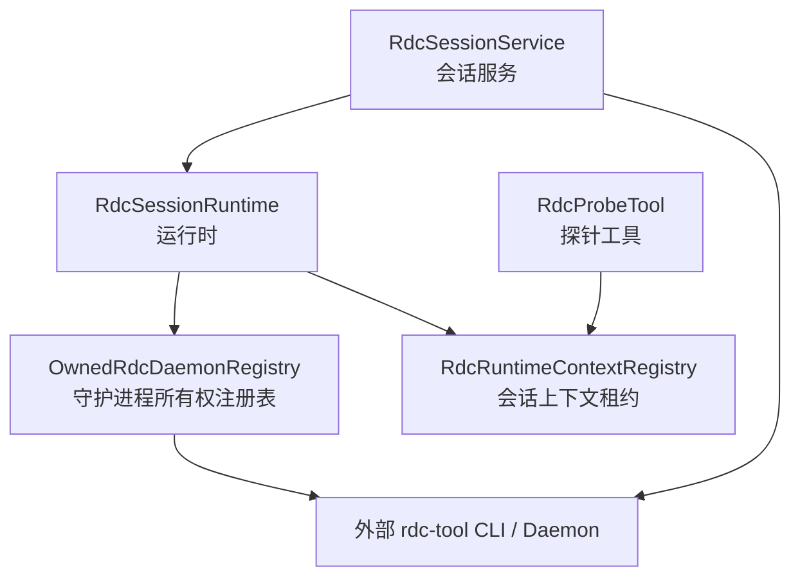
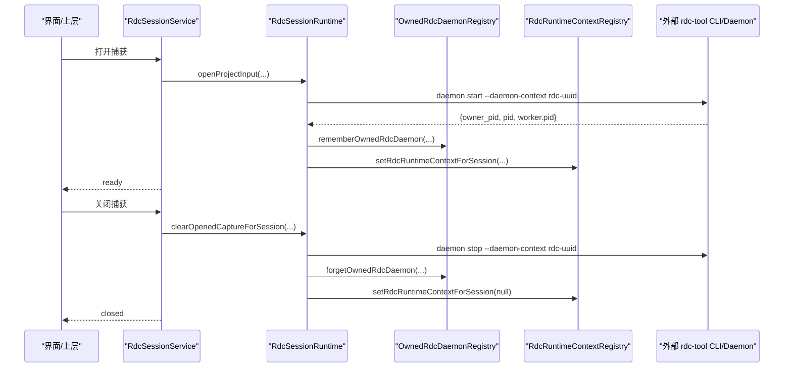
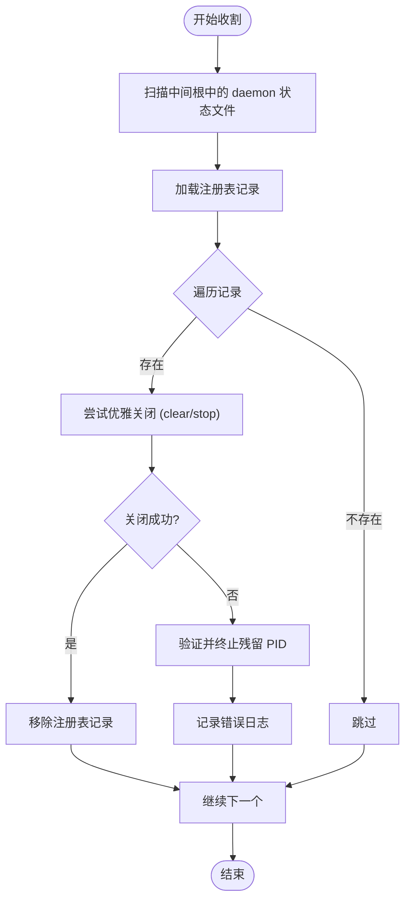
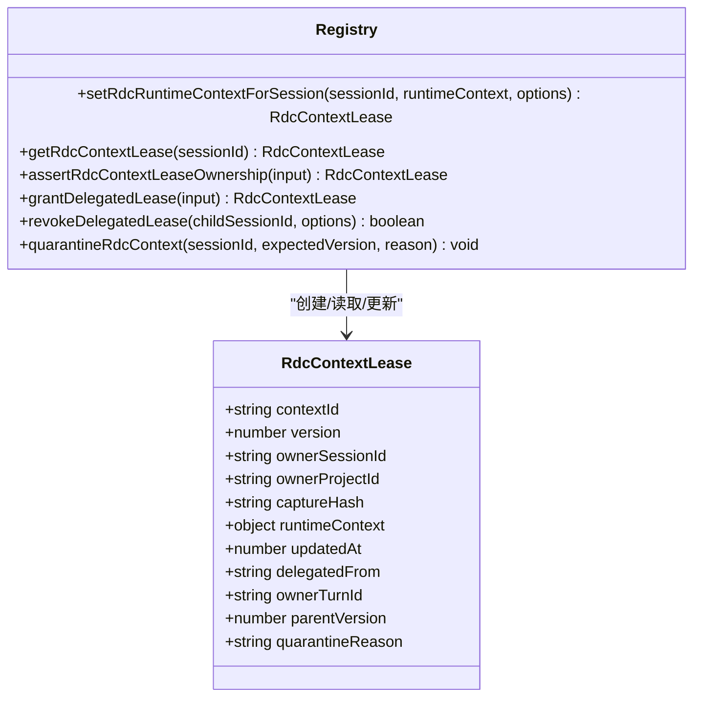
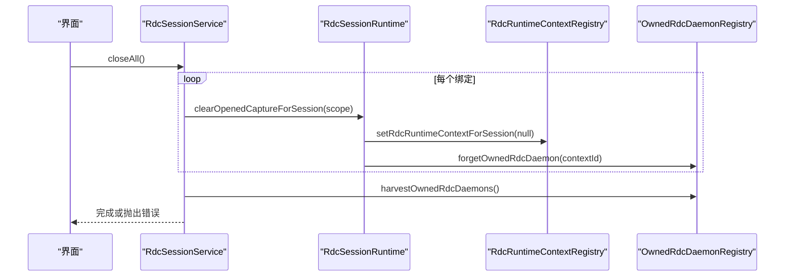
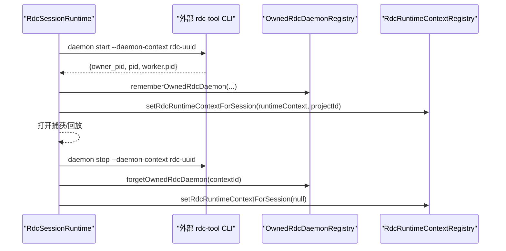
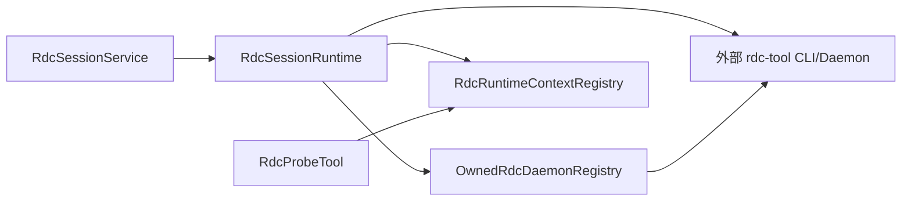

# RDC 守护进程所有权注册表

<cite>
**本文引用的文件**
- [OwnedRdcDaemonRegistry.ts](file://src/main/sessions/OwnedRdcDaemonRegistry.ts)
- [RdcRuntimeContextRegistry.ts](file://src/main/sessions/RdcRuntimeContextRegistry.ts)
- [RdcSessionService.ts](file://src/main/sessions/RdcSessionService.ts)
- [RdcSessionRuntime.ts](file://src/main/sessions/RdcSessionRuntime.ts)
- [RdcProbeTool.ts](file://src/main/workflow/debugger/RdcProbeTool.ts)
- [README.md](file://README.md)
- [package.json](file://package.json)
</cite>

## 目录
1. [简介](#简介)
2. [项目结构](#项目结构)
3. [核心组件](#核心组件)
4. [架构总览](#架构总览)
5. [详细组件分析](#详细组件分析)
6. [依赖关系分析](#依赖关系分析)
7. [性能与可靠性](#性能与可靠性)
8. [故障排查指南](#故障排查指南)
9. [结论](#结论)

## 简介
本仓库是面向 RenderDoc .rdc 捕获分析的 Electron 桌面应用（RDC-Agent）。其“RDC 守护进程所有权注册表”负责在应用生命周期内，记录并管理由应用启动的 RDC daemon 上下文的所有权、清理与回收，确保会话级资源安全、可审计、可恢复。该注册表与“会话级 RDC 上下文租约”配合，形成“进程级所有权 + 会话级使用权”的双重保障：进程级注册表保证外部进程资源不被泄漏；会话级租约保证同一时刻只有一个会话能操作特定上下文，并支持父会话向子会话的安全委派。

## 项目结构
- 主进程位于 src/main，包含会话服务、运行时、工具调用、设置、IPC 等模块。
- 所有权注册表位于 sessions 目录，围绕 OwnedRdcDaemonRegistry 与 RdcRuntimeContextRegistry 构建。
- 会话服务 RdcSessionService 编排打开/关闭捕获、回放观察、设备占用与交互锁。
- 运行时 RdcSessionRuntime 负责与外部 rdc-tool CLI 交互，启动/停止守护进程，维护上下文状态。
- 工作流探针 RdcProbeTool 在执行前校验租约所有权，防止越权访问。

图表来源
- [RdcSessionService.ts:85-160](file://src/main/sessions/RdcSessionService.ts#L85-L160)
- [RdcSessionRuntime.ts:85-200](file://src/main/sessions/RdcSessionRuntime.ts#L85-L200)
- [OwnedRdcDaemonRegistry.ts:65-136](file://src/main/sessions/OwnedRdcDaemonRegistry.ts#L65-L136)
- [RdcRuntimeContextRegistry.ts:61-154](file://src/main/sessions/RdcRuntimeContextRegistry.ts#L61-L154)
- [RdcProbeTool.ts:64-83](file://src/main/workflow/debugger/RdcProbeTool.ts#L64-L83)

章节来源
- [README.md:1-46](file://README.md#L1-L46)
- [package.json:1-78](file://package.json#L1-L78)

## 核心组件
- 守护进程所有权注册表（OwnedRdcDaemonRegistry）
  - 持久化应用拥有的 RDC daemon 上下文记录（contextId、命令路径、中间根、所有者 PID、daemon/worker PID、启动时间）。
  - 提供记住、遗忘、列举、收割（harvest）能力；收割时尝试优雅关闭或强制终止残留进程，并清理注册表。
  - 仅接受以 rdc-uuid 格式命名的应用自有上下文，拒绝非应用上下文。
- 会话上下文租约（RdcRuntimeContextRegistry）
  - 按会话维护 RDC 上下文租约，支持独立租约与从父会话派生的委派租约。
  - 提供设置、查询、断言所有权、委派、撤销、隔离（quarantine）等能力。
  - 通过版本号和哈希保护一致性，避免并发冲突与误用。
- 会话服务（RdcSessionService）
  - 编排打开/关闭捕获、回放观察、设备占用、交互锁与状态发布。
  - 在 closeAll 时触发守护进程收割，确保资源释放。
- 运行时（RdcSessionRuntime）
  - 启动/停止守护进程，绑定 contextId，记录所有权到注册表。
  - 与外部 rdc-tool CLI 交互，解析返回结果，维护上下文快照。
- 探针工具（RdcProbeTool）
  - 在执行前校验租约所有权与上下文匹配性，必要时打开租约或进入隔离恢复流程。

章节来源
- [OwnedRdcDaemonRegistry.ts:16-136](file://src/main/sessions/OwnedRdcDaemonRegistry.ts#L16-L136)
- [RdcRuntimeContextRegistry.ts:12-154](file://src/main/sessions/RdcRuntimeContextRegistry.ts#L12-L154)
- [RdcSessionService.ts:23-160](file://src/main/sessions/RdcSessionService.ts#L23-L160)
- [RdcSessionRuntime.ts:85-200](file://src/main/sessions/RdcSessionRuntime.ts#L85-L200)
- [RdcProbeTool.ts:64-83](file://src/main/workflow/debugger/RdcProbeTool.ts#L64-L83)

## 架构总览
所有权注册表与租约系统共同构成“进程级所有权 + 会话级使用权”的模型：
- 进程级：OwnedRdcDaemonRegistry 记录应用启动的 daemon 上下文，并在退出或关闭时进行收割清理。
- 会话级：RdcRuntimeContextRegistry 为每个会话维护上下文租约，支持委派给子会话，且具备隔离与版本控制。
- 编排层：RdcSessionService 协调打开/关闭、回放观察、设备占用与交互锁，确保一致性与安全性。
- 执行层：RdcSessionRuntime 与外部 rdc-tool CLI 交互，启动/停止守护进程，维护上下文快照。
- 校验层：RdcProbeTool 在执行前校验租约所有权，防止越权访问。

图表来源
- [RdcSessionService.ts:85-160](file://src/main/sessions/RdcSessionService.ts#L85-L160)
- [RdcSessionRuntime.ts:85-200](file://src/main/sessions/RdcSessionRuntime.ts#L85-L200)
- [OwnedRdcDaemonRegistry.ts:65-136](file://src/main/sessions/OwnedRdcDaemonRegistry.ts#L65-L136)
- [RdcRuntimeContextRegistry.ts:61-154](file://src/main/sessions/RdcRuntimeContextRegistry.ts#L61-L154)

## 详细组件分析

### 守护进程所有权注册表（OwnedRdcDaemonRegistry）
- 数据结构
  - 记录字段：contextId、command、intermediateRoot、ownerPid、daemonPid、workerPid、startedAt。
  - 存储格式：JSON 文档，含 schemaVersion 与 records 映射。
- 关键能力
  - isAppRdcContextId：仅接受 rdc-uuid 格式的上下文 ID。
  - rememberOwnedRdcDaemon：写入应用拥有的 daemon 上下文记录。
  - forgetOwnedRdcDaemon：删除已释放的上下文记录。
  - listOwnedRdcDaemons：列举当前所有拥有记录。
  - harvestOwnedRdcDaemons：发现中间根中的 daemon 状态文件，尝试优雅关闭或强制终止残留进程，并清理注册表。
- 错误处理
  - 非法上下文 ID 抛出 RDC_TOOL_OWNERSHIP_DENIED。
  - 文件损坏或版本不兼容抛出 RDC_TOOL_OWNERSHIP_CORRUPT / STORAGE_SCHEMA_UNSUPPORTED。
  - 关闭失败时记录日志并保留未确认的 PID 列表。

图表来源
- [OwnedRdcDaemonRegistry.ts:93-136](file://src/main/sessions/OwnedRdcDaemonRegistry.ts#L93-L136)
- [OwnedRdcDaemonRegistry.ts:138-203](file://src/main/sessions/OwnedRdcDaemonRegistry.ts#L138-L203)

章节来源
- [OwnedRdcDaemonRegistry.ts:41-136](file://src/main/sessions/OwnedRdcDaemonRegistry.ts#L41-L136)
- [OwnedRdcDaemonRegistry.ts:209-233](file://src/main/sessions/OwnedRdcDaemonRegistry.ts#L209-L233)

### 会话上下文租约（RdcRuntimeContextRegistry）
- 数据结构
  - 租约字段：contextId、version、ownerSessionId、ownerProjectId、captureHash、runtimeContext、updatedAt、delegatedFrom、ownerTurnId、parentVersion、quarantineReason。
- 关键能力
  - setRdcRuntimeContextForSession：设置或清除会话的上下文租约。
  - getRdcContextLease：获取指定会话的租约副本。
  - assertRdcContextLeaseOwnership：断言调用会话对上下文的拥有权（fail-closed）。
  - grantDelegatedLease：从父会话委派一个子会话的租约（限制：每父仅一个活跃子）。
  - revokeDelegatedLease：撤销子会话委派租约，必要时隔离父会话。
  - quarantineRdcContext：将租约置入隔离状态，阻止进一步执行或委派。
- 一致性保护
  - 版本号递增与 captureHash 计算，避免并发冲突与数据不一致。
  - 委派链不可传递（子不能再生成孙），防止权限扩散。

图表来源
- [RdcRuntimeContextRegistry.ts:12-26](file://src/main/sessions/RdcRuntimeContextRegistry.ts#L12-L26)
- [RdcRuntimeContextRegistry.ts:61-154](file://src/main/sessions/RdcRuntimeContextRegistry.ts#L61-L154)
- [RdcRuntimeContextRegistry.ts:164-242](file://src/main/sessions/RdcRuntimeContextRegistry.ts#L164-L242)

章节来源
- [RdcRuntimeContextRegistry.ts:12-154](file://src/main/sessions/RdcRuntimeContextRegistry.ts#L12-L154)
- [RdcRuntimeContextRegistry.ts:164-242](file://src/main/sessions/RdcRuntimeContextRegistry.ts#L164-L242)

### 会话服务（RdcSessionService）
- 职责
  - 管理 per-session 绑定、设备占用、交互锁与状态发布。
  - 编排打开/关闭捕获、回放观察、历史保存与预览清理。
  - 在 closeAll 时触发守护进程收割，确保资源释放。
- 关键流程
  - openProjectInput：校验输入、关闭旧绑定、打开新捕获、记录事件与观察。
  - clearOpenedCaptureForSession：串行关闭，发布状态，清理设备与预览。
  - observeAgentOperation：观察回放结果，保存历史与图片，发布代理观察。
  - closeAll：批量关闭并收割遗留守护进程。

图表来源
- [RdcSessionService.ts:203-210](file://src/main/sessions/RdcSessionService.ts#L203-L210)
- [RdcSessionService.ts:146-160](file://src/main/sessions/RdcSessionService.ts#L146-L160)
- [OwnedRdcDaemonRegistry.ts:93-136](file://src/main/sessions/OwnedRdcDaemonRegistry.ts#L93-L136)

章节来源
- [RdcSessionService.ts:23-160](file://src/main/sessions/RdcSessionService.ts#L23-L160)
- [RdcSessionService.ts:203-210](file://src/main/sessions/RdcSessionService.ts#L203-L210)

### 运行时（RdcSessionRuntime）
- 职责
  - 启动/停止守护进程，绑定 contextId，记录所有权。
  - 与外部 rdc-tool CLI 交互，解析返回结果，维护上下文快照。
  - 处理本地/远程回放打开流程，校验上下文与远端一致性。
- 关键流程
  - ensureOwnedDaemon：启动守护进程，校验 owner_pid，记录所有权。
  - openProjectInput：分配 contextId，打开捕获，提取 runtimeContext，应用租约。
  - clearOpenedCaptureForSession：停止守护进程，清理租约与预览。

图表来源
- [RdcSessionRuntime.ts:471-493](file://src/main/sessions/RdcSessionRuntime.ts#L471-L493)
- [RdcSessionRuntime.ts:85-200](file://src/main/sessions/RdcSessionRuntime.ts#L85-L200)

章节来源
- [RdcSessionRuntime.ts:85-200](file://src/main/sessions/RdcSessionRuntime.ts#L85-L200)
- [RdcSessionRuntime.ts:471-493](file://src/main/sessions/RdcSessionRuntime.ts#L471-L493)

### 探针工具（RdcProbeTool）
- 职责
  - 在执行前校验租约所有权与上下文匹配性。
  - 必要时打开租约或进入隔离恢复流程。
- 关键逻辑
  - 若存在委派或需要恢复，则拒绝执行或要求重新打开租约。
  - 校验 ownerSessionId、ownerProjectId 与 contextId 的一致性。

章节来源
- [RdcProbeTool.ts:64-83](file://src/main/workflow/debugger/RdcProbeTool.ts#L64-L83)

## 依赖关系分析
- 组件耦合
  - RdcSessionService 依赖 RdcSessionRuntime、RdcRuntimeContextRegistry、OwnedRdcDaemonRegistry。
  - RdcSessionRuntime 依赖 OwnedRdcDaemonRegistry、RdcRuntimeContextRegistry、外部 rdc-tool CLI。
  - RdcProbeTool 依赖 RdcRuntimeContextRegistry 进行所有权校验。
- 外部依赖
  - 外部 rdc-tool CLI/Daemon：提供守护进程管理与捕获回放能力。
  - 文件系统：用于注册表持久化与中间根状态扫描。
- 循环依赖
  - 无直接循环依赖；通过服务与运行时解耦。

图表来源
- [RdcSessionService.ts:85-160](file://src/main/sessions/RdcSessionService.ts#L85-L160)
- [RdcSessionRuntime.ts:85-200](file://src/main/sessions/RdcSessionRuntime.ts#L85-L200)
- [OwnedRdcDaemonRegistry.ts:93-136](file://src/main/sessions/OwnedRdcDaemonRegistry.ts#L93-L136)
- [RdcRuntimeContextRegistry.ts:61-154](file://src/main/sessions/RdcRuntimeContextRegistry.ts#L61-L154)
- [RdcProbeTool.ts:64-83](file://src/main/workflow/debugger/RdcProbeTool.ts#L64-L83)

章节来源
- [RdcSessionService.ts:85-160](file://src/main/sessions/RdcSessionService.ts#L85-L160)
- [RdcSessionRuntime.ts:85-200](file://src/main/sessions/RdcSessionRuntime.ts#L85-L200)
- [OwnedRdcDaemonRegistry.ts:93-136](file://src/main/sessions/OwnedRdcDaemonRegistry.ts#L93-L136)
- [RdcRuntimeContextRegistry.ts:61-154](file://src/main/sessions/RdcRuntimeContextRegistry.ts#L61-L154)
- [RdcProbeTool.ts:64-83](file://src/main/workflow/debugger/RdcProbeTool.ts#L64-L83)

## 性能与可靠性
- 性能
  - 注册表读写使用原子写入（临时文件 + rename），减少竞争条件。
  - 会话服务串行化生命周期操作，避免并发冲突。
  - 租约系统使用内存 Map，查询与更新为 O(1)。
- 可靠性
  - 守护进程收割在关闭时执行，确保资源释放。
  - 租约系统支持隔离模式，防止不确定状态下的执行。
  - 错误路径记录日志并保留未确认状态，便于后续恢复。

[本节为通用指导，无需具体文件引用]

## 故障排查指南
- 常见问题
  - 守护进程未正确关闭：检查收割日志与残留 PID 列表。
  - 租约所有权冲突：确认 sessionId、projectId 与 contextId 的一致性。
  - 委派租约异常：检查父会话是否处于隔离状态或版本不匹配。
- 诊断步骤
  - 查看注册表文件 owned-rdc-daemons.json 内容。
  - 检查中间根中的 daemon_state_*.json 文件。
  - 使用会话服务快照与租约查询接口定位问题。

章节来源
- [OwnedRdcDaemonRegistry.ts:93-136](file://src/main/sessions/OwnedRdcDaemonRegistry.ts#L93-L136)
- [RdcRuntimeContextRegistry.ts:134-154](file://src/main/sessions/RdcRuntimeContextRegistry.ts#L134-L154)
- [RdcSessionService.ts:203-210](file://src/main/sessions/RdcSessionService.ts#L203-L210)

## 结论
RDC 守护进程所有权注册表与会话上下文租约系统共同构建了安全、可靠、可恢复的资源管理机制。通过进程级所有权记录与会话级使用权控制，结合严格的校验与隔离策略，确保了 RDC 上下文在多会话、多任务场景下的正确性与稳定性。建议在生产环境中启用完整的日志记录与监控，以便及时发现与处理异常情况。

[本节为总结，无需具体文件引用]