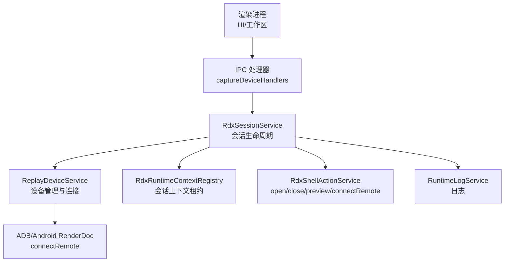
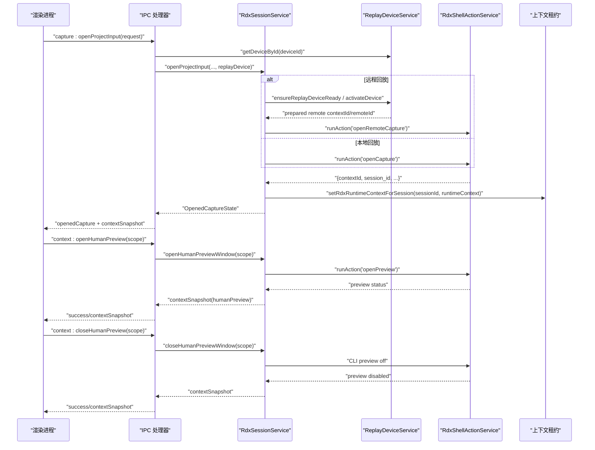
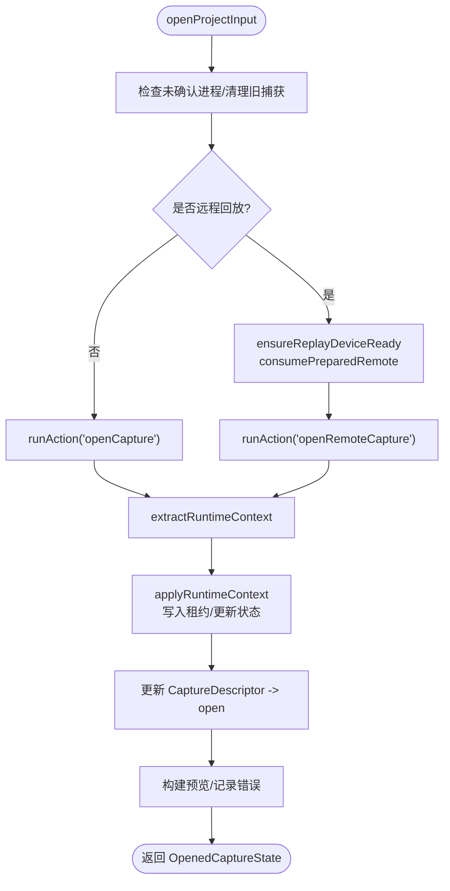
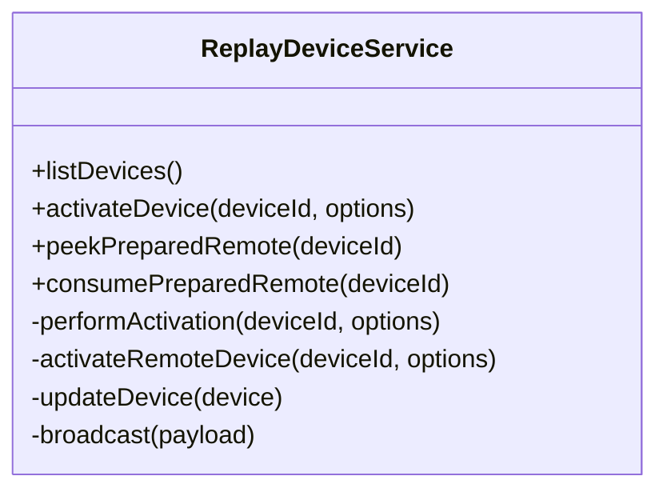
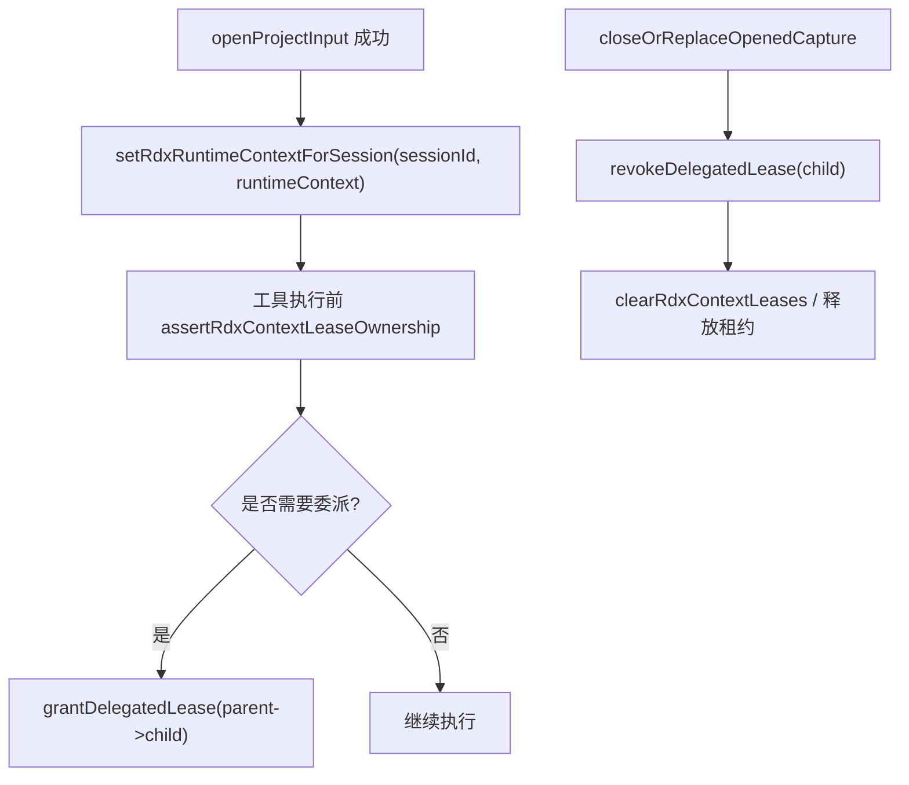
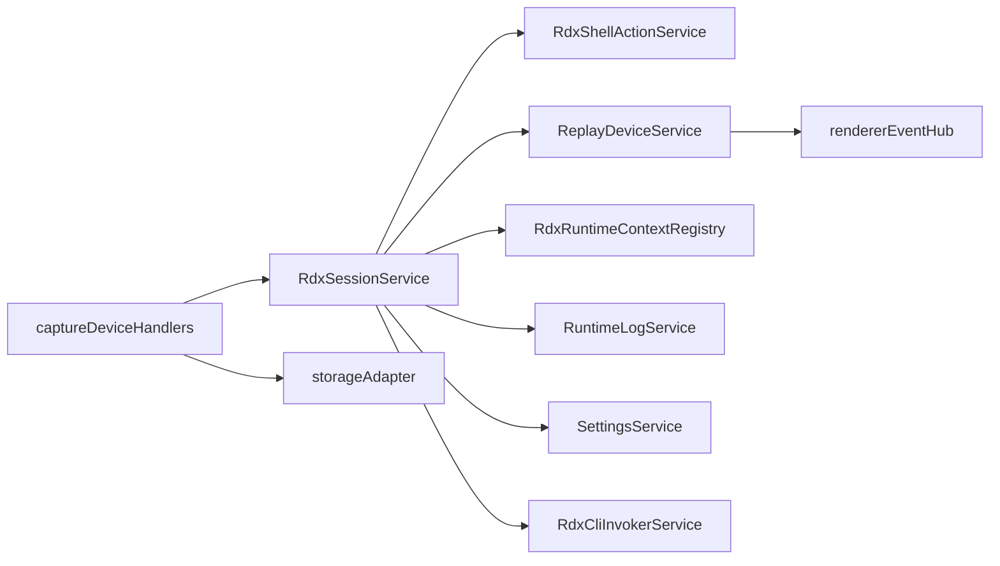

# 会话生命周期管理

<cite>
**本文引用的文件**
- [RdxSessionService.ts](file://src/main/sessions/RdxSessionService.ts)
- [ReplayDeviceService.ts](file://src/main/captures/ReplayDeviceService.ts)
- [captureDeviceHandlers.ts](file://src/main/ipc/captureDeviceHandlers.ts)
- [RdxRuntimeContextRegistry.ts](file://src/main/sessions/RdxRuntimeContextRegistry.ts)
- [RdxNativeLifecycle.test.ts](file://src/main/tools/RdxNativeLifecycle.test.ts)
- [RdxSessionService.test.ts](file://src/main/sessions/RdxSessionService.test.ts)
</cite>

## 目录
1. [简介](#简介)
2. [项目结构](#项目结构)
3. [核心组件](#核心组件)
4. [架构总览](#架构总览)
5. [详细组件分析](#详细组件分析)
6. [依赖关系分析](#依赖关系分析)
7. [性能考虑](#性能考虑)
8. [故障排查指南](#故障排查指南)
9. [结论](#结论)
10. [附录：API 参考与使用示例](#附录api-参考与使用示例)

## 简介
本文件系统性说明 RDC-Agent 主进程中的“会话生命周期管理”，围绕 RdxSessionService 的会话创建、激活、切换与销毁流程展开，覆盖 openProjectInput、closeOrReplaceOpenedCapture、switchActiveCapture 等关键方法。文档同时解释捕获文件（.rdc）打开过程（本地与远程回放设备）、会话状态转换机制（pending/open/error）、会话上下文与运行时环境配置、预览窗口管理等能力，并提供完整的 API 参考与使用示例，帮助正确管理会话生命周期。

## 项目结构
RDX 会话生命周期由以下模块协作完成：
- 会话服务：RdxSessionService 负责会话级状态、运行时上下文绑定、预览窗口、捕获描述符与活动捕获切换。
- 回放设备服务：ReplayDeviceService 负责设备发现、连接准备、远程设备激活与状态广播。
- IPC 层：captureDeviceHandlers 将渲染进程请求路由到 RdxSessionService 与 ReplayDeviceService，并广播状态变更。
- 上下文租约：RdxRuntimeContextRegistry 维护 per-session 的 RDX 上下文租约，支持父会话向子会话委派与隔离。

图表来源
- [captureDeviceHandlers.ts:91-161](file://src/main/ipc/captureDeviceHandlers.ts#L91-L161)
- [RdxSessionService.ts:69-212](file://src/main/sessions/RdxSessionService.ts#L69-L212)
- [ReplayDeviceService.ts:214-244](file://src/main/captures/ReplayDeviceService.ts#L214-L244)
- [RdxRuntimeContextRegistry.ts:61-101](file://src/main/sessions/RdxRuntimeContextRegistry.ts#L61-L101)

章节来源
- [captureDeviceHandlers.ts:91-161](file://src/main/ipc/captureDeviceHandlers.ts#L91-L161)
- [RdxSessionService.ts:69-212](file://src/main/sessions/RdxSessionService.ts#L69-L212)
- [ReplayDeviceService.ts:214-244](file://src/main/captures/ReplayDeviceService.ts#L214-L244)
- [RdxRuntimeContextRegistry.ts:61-101](file://src/main/sessions/RdxRuntimeContextRegistry.ts#L61-L101)

## 核心组件
- RdxSessionService：封装会话生命周期，管理捕获描述符、活动捕获、运行时上下文、人类预览窗口状态，以及本地/远程 .rdc 打开流程。
- ReplayDeviceService：管理本地与 Android 回放设备，提供设备列表、激活连接、预准备远程上下文、状态轮询与广播。
- RdxRuntimeContextRegistry：维护 per-session 的 RDX 上下文租约，支持委派、版本化、隔离与恢复保护。
- captureDeviceHandlers：暴露 IPC 接口，校验输入、调用服务、广播上下文与捕获状态变化。

章节来源
- [RdxSessionService.ts:53-781](file://src/main/sessions/RdxSessionService.ts#L53-L781)
- [ReplayDeviceService.ts:61-685](file://src/main/captures/ReplayDeviceService.ts#L61-L685)
- [RdxRuntimeContextRegistry.ts:1-268](file://src/main/sessions/RdxRuntimeContextRegistry.ts#L1-L268)
- [captureDeviceHandlers.ts:25-232](file://src/main/ipc/captureDeviceHandlers.ts#L25-L232)

## 架构总览
下图展示从渲染进程发起打开 .rdc 到会话激活、预览窗口打开与关闭的完整时序。

图表来源
- [captureDeviceHandlers.ts:91-161](file://src/main/ipc/captureDeviceHandlers.ts#L91-L161)
- [RdxSessionService.ts:69-212](file://src/main/sessions/RdxSessionService.ts#L69-L212)
- [RdxSessionService.ts:231-300](file://src/main/sessions/RdxSessionService.ts#L231-L300)
- [ReplayDeviceService.ts:214-244](file://src/main/captures/ReplayDeviceService.ts#L214-L244)

## 详细组件分析

### RdxSessionService 会话生命周期
- 会话创建（openProjectInput）
  - 前置检查：若存在未确认的原生进程退出，拒绝打开；先清理或替换已打开的捕获。
  - 设备准备：若是远程回放，确保设备就绪并获取 prepared remote（contextId/remoteId）。
  - 构建 CaptureDescriptor：初始状态为 pending，记录 ownerSessionId、backendHint（local/remote）。
  - 打开捕获：
    - 远程：调用 openRemoteCapture，注入运行时环境变量，解析返回数据得到 runtimeContext。
    - 本地：调用 openCapture，若诊断指示本地回放不支持，抛出特定错误。
  - 应用运行时上下文：写入 per-session 租约，更新 contextId、runtimeOwner、ownerLeaseId、remoteStatus、deviceLabel。
  - 更新捕获状态：将 CaptureDescriptor 状态改为 open，填充 sessionId/replaySessionId/contextId。
  - 构建预览：尝试从 action 结果中加载预览图，失败则记录 previewError 与 attempts。
  - 返回 OpenedCaptureState：包含 inputId、filePath、deviceId、deviceLabel、status、preview、runtimeContext 等。
- 会话替换/关闭（closeOrReplaceOpenedCapture）
  - 调用 teardownRuntime 执行 closeRuntime 动作，失败会保留所有权并抛错。
  - resetRuntimeState 清空 openedCapture、captures、activeCaptureId、runtimeContext、humanPreview 等。
  - 若之前有 ownerSessionId，解除其上下文租约；否则清除全局租约。
- 活动捕获切换（switchActiveCapture）
  - 仅允许切换到已存在的捕获且状态非 pending；成功后更新 activeCaptureId。
- 人类预览窗口
  - openHumanPreviewWindow：校验拥有者，设置 humanPreview 为 opening，调用 openPreview，根据返回设置 open/error/closed。
  - closeHumanPreviewWindow：通过 CLI 关闭预览，确认 enabled=false 后更新 humanPreview 为 closed。
- 运行时上下文与环境变量
  - buildRuntimeContextEnv：注入 RDX_CONTEXT_ID、RDX_RUNTIME_OWNER、RDX_OWNER_LEASE_ID、RDX_REPLAY_SESSION_ID、RDX_CAPTURE_FILE_ID。
  - extractRuntimeContext：从 action 结果提取 contextId、session_id、runtimeOwner、ownerLeaseId、captureFileId、backend、deviceId/deviceLabel、remoteId/remoteStatus。
- 快照与权限
  - snapshotContextForSession/snapshotOpenedCaptureForSession：仅当当前 openedCapture 属于指定 scope 时返回快照。
  - clearOpenedCaptureForSession：按拥有者校验后执行关闭。

图表来源
- [RdxSessionService.ts:69-212](file://src/main/sessions/RdxSessionService.ts#L69-L212)
- [RdxSessionService.ts:345-404](file://src/main/sessions/RdxSessionService.ts#L345-L404)

章节来源
- [RdxSessionService.ts:69-212](file://src/main/sessions/RdxSessionService.ts#L69-L212)
- [RdxSessionService.ts:214-229](file://src/main/sessions/RdxSessionService.ts#L214-L229)
- [RdxSessionService.ts:301-312](file://src/main/sessions/RdxSessionService.ts#L301-L312)
- [RdxSessionService.ts:231-300](file://src/main/sessions/RdxSessionService.ts#L231-L300)
- [RdxSessionService.ts:345-404](file://src/main/sessions/RdxSessionService.ts#L345-L404)
- [RdxSessionService.ts:503-543](file://src/main/sessions/RdxSessionService.ts#L503-L543)

### ReplayDeviceService 设备与远程连接
- 设备发现与轮询：startWatch/refreshDevices/runRefresh 周期性检测 ADB 设备，维护本地与 Android 设备列表，广播状态变化。
- 远程设备激活：activateDevice 调用 connectRemote 动作，建立远程上下文与 remoteId，缓存 preparedRemotes（含 contextId/remoteId/bootstrap），持久化 resume cache。
- 预准备远程：peekPreparedRemote/consumePrearedRemote 用于在 openProjectInput 阶段复用已连接的远程上下文，避免重复连接。
- 状态与错误：设备状态包括 online/offline/loading，失败时记录 activationPhase、activationErrorCode、activationErrorMessage，并通过日志与事件广播。

图表来源
- [ReplayDeviceService.ts:214-244](file://src/main/captures/ReplayDeviceService.ts#L214-L244)
- [ReplayDeviceService.ts:457-572](file://src/main/captures/ReplayDeviceService.ts#L457-L572)
- [ReplayDeviceService.ts:603-681](file://src/main/captures/ReplayDeviceService.ts#L603-L681)

章节来源
- [ReplayDeviceService.ts:82-157](file://src/main/captures/ReplayDeviceService.ts#L82-L157)
- [ReplayDeviceService.ts:214-244](file://src/main/captures/ReplayDeviceService.ts#L214-L244)
- [ReplayDeviceService.ts:457-572](file://src/main/captures/ReplayDeviceService.ts#L457-L572)
- [ReplayDeviceService.ts:603-681](file://src/main/captures/ReplayDeviceService.ts#L603-L681)

### 会话上下文与租约管理
- 租约写入：openProjectInput 成功后通过 setRdxRuntimeContextForSession 写入 per-session 租约，包含 contextId、runtimeOwner、ownerLeaseId、replaySessionId、captureFileId、backend、deviceId/deviceLabel、remoteId/remoteStatus。
- 租约验证：工具执行前需通过 assertRdxContextLeaseOwnership 校验调用方 session 拥有该上下文，防止跨会话误用。
- 委派与隔离：grantDelegatedLease 允许父会话向唯一子会话委派一次执行权；revokeDelegatedLease 撤销委派并在必要时 quarantine 父上下文。
- 清理：clearRdxContextLeases 清空所有租约；resetRuntimeState 在会话关闭时释放租约。

图表来源
- [RdxRuntimeContextRegistry.ts:61-101](file://src/main/sessions/RdxRuntimeContextRegistry.ts#L61-L101)
- [RdxRuntimeContextRegistry.ts:164-222](file://src/main/sessions/RdxRuntimeContextRegistry.ts#L164-L222)
- [RdxRuntimeContextRegistry.ts:224-256](file://src/main/sessions/RdxRuntimeContextRegistry.ts#L224-L256)
- [RdxSessionService.ts:376-391](file://src/main/sessions/RdxSessionService.ts#L376-L391)
- [RdxSessionService.ts:755-779](file://src/main/sessions/RdxSessionService.ts#L755-L779)

章节来源
- [RdxRuntimeContextRegistry.ts:61-101](file://src/main/sessions/RdxRuntimeContextRegistry.ts#L61-L101)
- [RdxRuntimeContextRegistry.ts:164-222](file://src/main/sessions/RdxRuntimeContextRegistry.ts#L164-L222)
- [RdxRuntimeContextRegistry.ts:224-256](file://src/main/sessions/RdxRuntimeContextRegistry.ts#L224-L256)
- [RdxSessionService.ts:376-391](file://src/main/sessions/RdxSessionService.ts#L376-L391)
- [RdxSessionService.ts:755-779](file://src/main/sessions/RdxSessionService.ts#L755-L779)

### 捕获文件（.rdc）打开流程
- 本地回放：
  - 调用 openCapture，传入 projectId/inputId/filePath/deviceInfo/backend=local。
  - 解析返回的 contextId/session_id/captureFileId 等，设置 backend=local。
  - 若诊断指示本地回放不支持，抛出 LOCAL_REPLAY_UNSUPPORTED。
- 远程回放（Android）：
  - ensureReplayDeviceReady 检查设备状态，必要时 activateDevice 调用 connectRemote。
  - consumePreparedRemote 获取已准备的 remoteId/contextId。
  - 调用 openRemoteCapture，后端标记为 remote，解析 remote_id/remote_status。
- 预览：
  - 从 action 结果中提取 previewImagePath/image_path，构造 OpenedCapturePreview。
  - 若图片不可读，记录 previewError 与 attempts。

章节来源
- [RdxSessionService.ts:69-212](file://src/main/sessions/RdxSessionService.ts#L69-L212)
- [RdxSessionService.ts:314-343](file://src/main/sessions/RdxSessionService.ts#L314-L343)
- [RdxSessionService.ts:406-438](file://src/main/sessions/RdxSessionService.ts#L406-L438)
- [ReplayDeviceService.ts:509-572](file://src/main/captures/ReplayDeviceService.ts#L509-L572)

### 预览窗口管理
- 打开：openHumanPreviewWindow 设置 humanPreview.status=opening，调用 openPreview，根据返回设置 open/error。
- 关闭：closeHumanPreviewWindow 通过 CLI 关闭预览，确认 enabled=false 后设置为 closed。
- 状态快照：snapshotContextForSession 包含 humanPreview 快照，供 UI 显示。

章节来源
- [RdxSessionService.ts:231-300](file://src/main/sessions/RdxSessionService.ts#L231-L300)
- [captureDeviceHandlers.ts:39-84](file://src/main/ipc/captureDeviceHandlers.ts#L39-L84)

## 依赖关系分析
- RdxSessionService 依赖：
  - rdxShellActionService：执行 openCapture/openRemoteCapture/openPreview/closeRuntime。
  - replayDeviceService：设备发现、激活、预准备远程上下文。
  - settingsService：读取 RDX CLI 配置。
  - rdxCliInvokerService：直接调用 CLI 关闭预览。
  - RuntimeLogService：记录上下文与设备状态变更。
  - RdxRuntimeContextRegistry：写入/查询/委派/清理上下文租约。
- IPC 层依赖：
  - storageAdapter：校验 session/project 与 project inputs。
  - rendererEventHub：设备状态变更广播。

图表来源
- [RdxSessionService.ts:1-35](file://src/main/sessions/RdxSessionService.ts#L1-L35)
- [captureDeviceHandlers.ts:1-10](file://src/main/ipc/captureDeviceHandlers.ts#L1-L10)
- [ReplayDeviceService.ts:1-10](file://src/main/captures/ReplayDeviceService.ts#L1-L10)

章节来源
- [RdxSessionService.ts:1-35](file://src/main/sessions/RdxSessionService.ts#L1-L35)
- [captureDeviceHandlers.ts:1-10](file://src/main/ipc/captureDeviceHandlers.ts#L1-L10)
- [ReplayDeviceService.ts:1-10](file://src/main/captures/ReplayDeviceService.ts#L1-L10)

## 性能考虑
- 设备轮询与去抖：ReplayDeviceService 使用自适应轮询间隔与防重入刷新，减少频繁 I/O。
- 远程连接缓存：preparedRemotes 缓存已验证的远程上下文，避免重复连接；TTL 控制过期。
- 预览图像加载：仅在需要时从路径加载并转换为 dataURL，避免不必要的内存占用。
- 租约版本化：RdxRuntimeContextRegistry 使用版本号与委派限制，降低并发冲突与误用风险。

[本节为通用性能建议，不直接分析具体文件]

## 故障排查指南
- 本地回放不支持：
  - 现象：openCapture 返回诊断指示不支持。
  - 处理：抛出 LOCAL_REPLAY_UNSUPPORTED，提示使用远程回放或其他方案。
- 远程设备连接失败：
  - 现象：activateDevice/connectRemote 失败，设备状态 offline 或 loading。
  - 处理：查看 lastError/activationErrorMessage，重试或重新选择设备。
- 预览无法打开：
  - 现象：openPreview 失败或 preview.enabled=false。
  - 处理：检查 humanPreview.lastError，确认 RDX CLI 可用与上下文有效。
- 租约冲突或委派问题：
  - 现象：clear/open 被拒绝，提示 RDX_LEASE_DUAL_OWNER。
  - 处理：先撤销委派或等待委派结束，再执行关闭/重新打开。
- 原生进程未确认退出：
  - 现象：hasUnconfirmedProcesses 返回 true，阻止操作。
  - 处理：等待原生进程退出确认后再继续。

章节来源
- [RdxSessionService.ts:159-171](file://src/main/sessions/RdxSessionService.ts#L159-L171)
- [RdxSessionService.ts:314-343](file://src/main/sessions/RdxSessionService.ts#L314-L343)
- [RdxSessionService.ts:231-300](file://src/main/sessions/RdxSessionService.ts#L231-L300)
- [RdxRuntimeContextRegistry.ts:164-222](file://src/main/sessions/RdxRuntimeContextRegistry.ts#L164-L222)
- [RdxSessionService.ts:710-753](file://src/main/sessions/RdxSessionService.ts#L710-L753)

## 结论
RdxSessionService 提供了健壮的会话生命周期管理能力，涵盖 .rdc 捕获文件的本地与远程打开、活动捕获切换、人类预览窗口管理、运行时上下文绑定与租约控制。配合 ReplayDeviceService 的设备管理与 RdxRuntimeContextRegistry 的租约机制，系统实现了安全的跨会话隔离与委派执行。通过 IPC 层统一暴露 API，渲染进程可安全地触发会话操作并接收状态广播。遵循本文档的流程与最佳实践，可有效避免资源泄漏、状态不一致与并发冲突问题。

[本节为总结性内容，不直接分析具体文件]

## 附录：API 参考与使用示例

### IPC API
- capture:openProjectInput
  - 作用：打开项目输入（.rdc）并激活会话。
  - 参数：projectId、sessionId、inputId、filePath、replayDeviceId。
  - 返回：{ success, openedCapture, contextSnapshot } 或 { success: false, error }。
- capture:list
  - 作用：列出当前会话拥有的捕获描述符。
- capture:getOpenedState
  - 作用：获取当前打开的捕获状态。
- capture:clearOpenedState
  - 作用：清理当前会话拥有的打开捕获。
- capture:select
  - 作用：切换活动捕获（仅允许 open 状态的捕获）。
- context:openHumanPreview / context:closeHumanPreview
  - 作用：打开/关闭人类预览窗口。
- device:list / device:refresh / device:activate
  - 作用：列出/刷新/激活回放设备。

章节来源
- [captureDeviceHandlers.ts:34-232](file://src/main/ipc/captureDeviceHandlers.ts#L34-L232)

### RdxSessionService 方法
- openProjectInput(request, options)
  - 作用：打开 .rdc 捕获，创建会话上下文，返回 OpenedCaptureState。
  - 注意：远程回放需确保设备就绪；本地回放不支持时会抛出特定错误。
- closeOrReplaceOpenedCapture(options)
  - 作用：关闭或替换当前打开的捕获，清理运行时上下文。
- switchActiveCapture(captureId)
  - 作用：切换活动捕获，仅允许 open 状态的捕获。
- openHumanPreviewWindow(scope) / closeHumanPreviewWindow(scope)
  - 作用：打开/关闭人类预览窗口，更新 humanPreview 状态。
- snapshotContextForSession(scope) / snapshotOpenedCaptureForSession(scope)
  - 作用：按会话拥有者返回上下文快照或打开捕获快照。
- clearOpenedCaptureForSession(scope, options)
  - 作用：清理当前会话拥有的打开捕获。

章节来源
- [RdxSessionService.ts:69-212](file://src/main/sessions/RdxSessionService.ts#L69-L212)
- [RdxSessionService.ts:214-229](file://src/main/sessions/RdxSessionService.ts#L214-L229)
- [RdxSessionService.ts:301-312](file://src/main/sessions/RdxSessionService.ts#L301-L312)
- [RdxSessionService.ts:231-300](file://src/main/sessions/RdxSessionService.ts#L231-L300)
- [RdxSessionService.ts:521-543](file://src/main/sessions/RdxSessionService.ts#L521-L543)

### 使用示例（基于测试）
- 打开本地 .rdc 并验证上下文：
  - 调用 openProjectInput，验证 returned replaySessionId 与租约 contextId。
  - 通过 native CLI 查询 context/status 与 preview/status。
  - 关闭预览并清理打开捕获，验证租约为空。
- 委派与恢复：
  - 授予子会话委派租约，验证父会话无法直接关闭/重新打开。
  - 撤销委派后，父会话可正常清理。

章节来源
- [RdxNativeLifecycle.test.ts:41-73](file://src/main/tools/RdxNativeLifecycle.test.ts#L41-L73)
- [RdxSessionService.test.ts:109-132](file://src/main/sessions/RdxSessionService.test.ts#L109-L132)