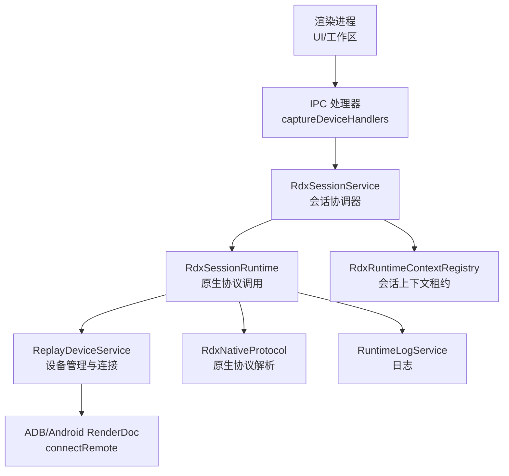
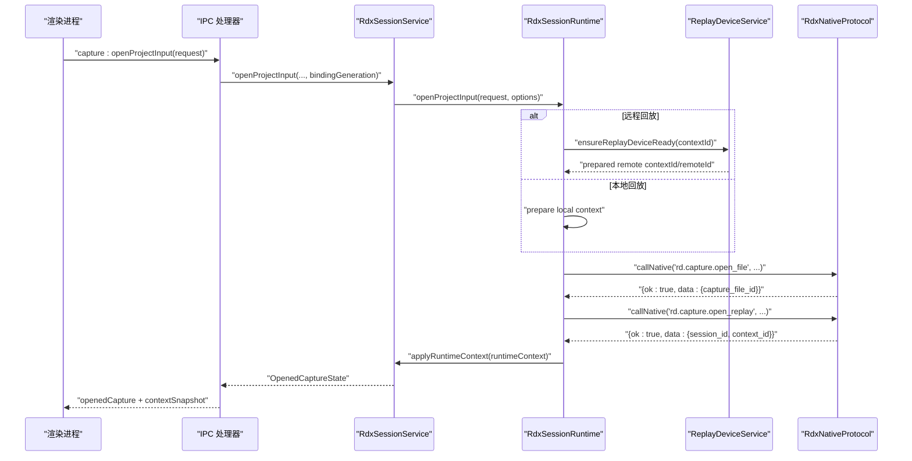
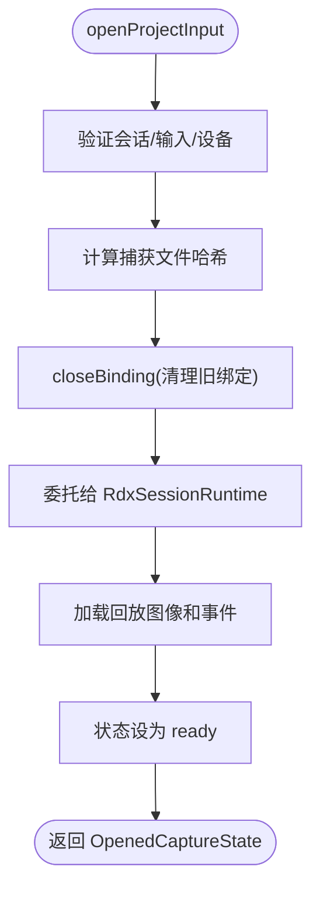
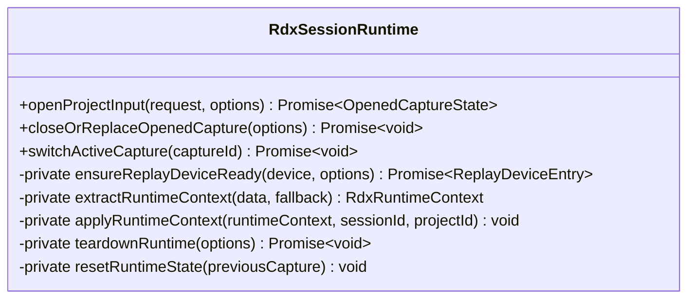
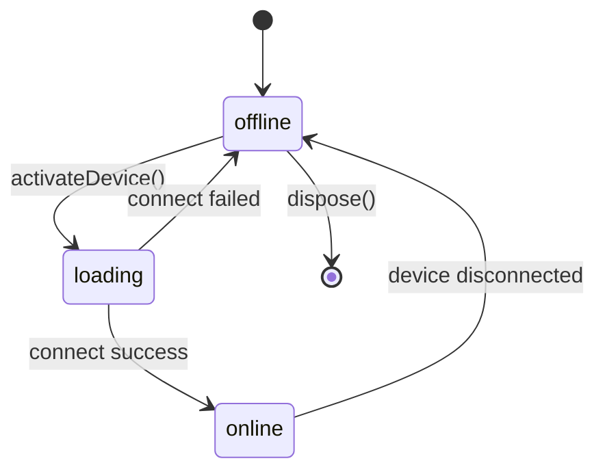
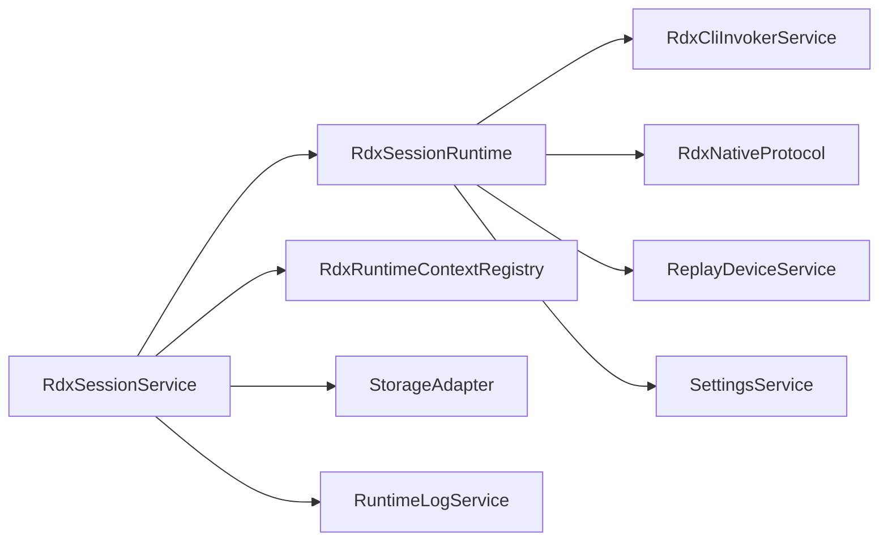

# 会话生命周期管理

<cite>
**本文引用的文件**
- [RdxSessionService.ts](file://src/main/sessions/RdxSessionService.ts)
- [RdxSessionRuntime.ts](file://src/main/sessions/RdxSessionRuntime.ts)
- [ReplayDeviceService.ts](file://src/main/captures/ReplayDeviceService.ts)
- [captureDeviceHandlers.ts](file://src/main/ipc/captureDeviceHandlers.ts)
- [RdxRuntimeContextRegistry.ts](file://src/main/sessions/RdxRuntimeContextRegistry.ts)
- [RdxNativeProtocol.ts](file://src/main/tools/RdxNativeProtocol.ts)
</cite>

## 更新摘要
**所做更改**
- 更新了会话管理架构，现在使用直接的原生协议调用而非shell动作
- 改进了设备激活流程和连接状态处理机制
- 移除了生命周期模板相关功能，简化了会话生命周期管理
- 增强了原生协议验证和错误处理机制

## 目录
1. [简介](#简介)
2. [项目结构](#项目结构)
3. [核心组件](#核心组件)
4. [架构总览](#架构总览)
5. [详细组件分析](#详细组件分析)
6. [依赖关系分析](#依赖关系分析)
7. [性能考虑](#性能考虑)
8. [故障排查指南](#故障排查指南)
9. [结论](#结论)
10. [附录：API 参考与使用示例](#附录api-参考与使用示例)

## 简介
本文件系统性说明 RDC-Agent 主进程中的"会话生命周期管理"，围绕 RdxSessionService 的会话创建、激活、切换与销毁流程展开。文档重点介绍了新的直接原生协议调用机制，替代了原有的shell动作方式，改进了设备激活流程和连接状态处理，同时移除了生命周期模板相关功能。覆盖 openProjectInput、closeOrReplaceOpenedCapture、switchActiveCapture 等关键方法，以及捕获文件（.rdc）打开过程、会话状态转换机制、会话上下文与运行时环境配置等功能。

## 项目结构
RDX 会话生命周期由以下模块协作完成：
- 会话服务：RdxSessionService 负责会话级状态管理、操作协调和状态广播
- 会话运行时：RdxSessionRuntime 封装具体的原生协议调用和会话生命周期管理
- 回放设备服务：ReplayDeviceService 负责设备发现、连接准备、远程设备激活与状态广播
- IPC 层：captureDeviceHandlers 将渲染进程请求路由到会话服务，并广播状态变更
- 上下文租约：RdxRuntimeContextRegistry 维护 per-session 的 RDX 上下文租约，支持委派与隔离



**图表来源**
- [captureDeviceHandlers.ts:26-34](file://src/main/ipc/captureDeviceHandlers.ts#L26-L34)
- [RdxSessionService.ts:22-33](file://src/main/sessions/RdxSessionService.ts#L22-L33)
- [RdxSessionRuntime.ts:68-81](file://src/main/sessions/RdxSessionRuntime.ts#L68-L81)
- [ReplayDeviceService.ts:62-78](file://src/main/captures/ReplayDeviceService.ts#L62-L78)

**章节来源**
- [captureDeviceHandlers.ts:26-34](file://src/main/ipc/captureDeviceHandlers.ts#L26-L34)
- [RdxSessionService.ts:22-33](file://src/main/sessions/RdxSessionService.ts#L22-L33)
- [RdxSessionRuntime.ts:68-81](file://src/main/sessions/RdxSessionRuntime.ts#L68-L81)
- [ReplayDeviceService.ts:62-78](file://src/main/captures/ReplayDeviceService.ts#L62-L78)

## 核心组件
- **RdxSessionService**：会话协调器，负责会话状态管理、操作序列化和状态广播，不再直接管理运行时细节
- **RdxSessionRuntime**：会话运行时，封装原生协议调用、设备连接管理和会话生命周期控制
- **ReplayDeviceService**：设备管理服务，提供设备发现、激活、预准备远程上下文等功能
- **RdxRuntimeContextRegistry**：上下文租约管理，维护会话级别的RDX上下文所有权和委派机制
- **RdxNativeProtocol**：原生协议解析器，验证和解析原生CLI调用的结果

**章节来源**
- [RdxSessionService.ts:22-33](file://src/main/sessions/RdxSessionService.ts#L22-L33)
- [RdxSessionRuntime.ts:68-81](file://src/main/sessions/RdxSessionRuntime.ts#L68-L81)
- [ReplayDeviceService.ts:62-78](file://src/main/captures/ReplayDeviceService.ts#L62-L78)
- [RdxRuntimeContextRegistry.ts:12-26](file://src/main/sessions/RdxRuntimeContextRegistry.ts#L12-L26)
- [RdxNativeProtocol.ts:3-42](file://src/main/tools/RdxNativeProtocol.ts#L3-L42)

## 架构总览
下图展示从渲染进程发起打开 .rdc 到会话激活的完整时序，体现了新的直接原生协议调用架构：



**图表来源**
- [captureDeviceHandlers.ts:68-138](file://src/main/ipc/captureDeviceHandlers.ts#L68-L138)
- [RdxSessionService.ts:83-132](file://src/main/sessions/RdxSessionService.ts#L83-L132)
- [RdxSessionRuntime.ts:82-198](file://src/main/sessions/RdxSessionRuntime.ts#L82-L198)
- [RdxNativeProtocol.ts:12-42](file://src/main/tools/RdxNativeProtocol.ts#L12-L42)

## 详细组件分析

### RdxSessionService 会话协调器
**更新** 会话服务现在专注于协调和状态管理，不再直接管理运行时细节

- **会话创建（openProjectInput）**
  - 前置检查：验证会话范围、输入ID和设备占用状态
  - 状态管理：设置阶段为 'validating'，记录 operationId 和 generation
  - 文件哈希：计算捕获文件哈希值，用于完整性验证
  - 绑定清理：调用 closeBinding 清理之前的绑定和设备占用
  - 运行时委托：将具体打开逻辑委托给 RdxSessionRuntime
  - 图像加载：成功后读取回放事件和观察数据
  - 状态更新：最终状态设为 'ready'，返回 OpenedCaptureState

- **会话关闭（clearOpenedCaptureForSession）**
  - 序列化执行：确保同一会话的操作串行化
  - 绑定清理：通过 closeBinding 释放设备和上下文资源
  - 状态重置：清空所有会话状态，增加 generation

- **活动捕获切换（switchActiveCapture）**
  - 仅允许切换到已存在的捕获且状态非 pending
  - 成功更新 activeCaptureId



**图表来源**
- [RdxSessionService.ts:83-132](file://src/main/sessions/RdxSessionService.ts#L83-L132)
- [RdxSessionService.ts:141-155](file://src/main/sessions/RdxSessionService.ts#L141-L155)
- [RdxSessionService.ts:203-208](file://src/main/sessions/RdxSessionService.ts#L203-L208)

**章节来源**
- [RdxSessionService.ts:83-132](file://src/main/sessions/RdxSessionService.ts#L83-L132)
- [RdxSessionService.ts:141-155](file://src/main/sessions/RdxSessionService.ts#L141-L155)
- [RdxSessionService.ts:203-208](file://src/main/sessions/RdxSessionService.ts#L203-L208)

### RdxSessionRuntime 原生协议调用
**更新** 运行时现在直接使用原生协议调用，移除了shell动作中间层

- **会话初始化（openProjectInput）**
  - CLI目录加载：动态加载RDX CLI工具目录
  - 上下文分配：为每个会话分配唯一的 contextId（格式：rdc-{uuid}）
  - 捕获描述符：创建 CaptureDescriptor，初始状态为 'pending'
  - 设备准备：根据设备类型决定本地或远程连接流程
  - 原生调用：直接调用 rd.capture.open_file 和 rd.capture.open_replay
  - 运行时上下文：提取并应用 runtimeContext，包含 session_id、context_id 等

- **设备连接管理（ensureReplayDeviceReady）**
  - 本地设备：直接返回本地设备
  - 远程设备：检查 preparedRemotes 缓存，必要时调用 activateDevice
  - 连接验证：验证设备状态为 'connected' 或 'online'

- **运行时上下文应用（applyRuntimeContext）**
  - 租约注册：通过 setRdxRuntimeContextForSession 注册会话租约
  - 状态同步：更新 contextId、runtimeOwner、ownerLeaseId、remoteStatus 等
  - 设备信息：设置 deviceLabel 和 remoteStatus

- **会话清理（teardownRuntime）**
  - 委派检查：防止在委派执行期间进行生命周期变更
  - 原生清理：调用 rd.session.clear_context 清理上下文
  - 守护进程停止：通过 daemon stop 命令停止原生进程
  - 状态重置：清空所有运行时状态



**图表来源**
- [RdxSessionRuntime.ts:82-198](file://src/main/sessions/RdxSessionRuntime.ts#L82-L198)
- [RdxSessionRuntime.ts:236-269](file://src/main/sessions/RdxSessionRuntime.ts#L236-L269)
- [RdxSessionRuntime.ts:302-317](file://src/main/sessions/RdxSessionRuntime.ts#L302-L317)
- [RdxSessionRuntime.ts:418-459](file://src/main/sessions/RdxSessionRuntime.ts#L418-L459)

**章节来源**
- [RdxSessionRuntime.ts:82-198](file://src/main/sessions/RdxSessionRuntime.ts#L82-L198)
- [RdxSessionRuntime.ts:236-269](file://src/main/sessions/RdxSessionRuntime.ts#L236-L269)
- [RdxSessionRuntime.ts:302-317](file://src/main/sessions/RdxSessionRuntime.ts#L302-L317)
- [RdxSessionRuntime.ts:418-459](file://src/main/sessions/RdxSessionRuntime.ts#L418-L459)

### ReplayDeviceService 设备与远程连接
**更新** 设备服务改进了连接状态处理和错误恢复机制

- **设备发现与轮询**
  - 自适应轮询：根据ADB可用性调整轮询间隔
  - 状态持久化：保留离线设备的临时状态和错误信息
  - 设备排序：本地设备优先，其他设备按标签排序

- **远程设备激活**
  - 超时控制：90秒超时，支持AbortSignal中断
  - 连接状态：loading -> online/offline，带详细的activationPhase
  - 预准备缓存：preparedRemotes缓存已验证的远程上下文，TTL为10分钟
  - 恢复缓存：device_resume.json持久化最近的设备信息

- **连接状态管理**
  - 状态广播：设备状态变化时广播到渲染进程
  - 错误处理：记录activationErrorCode和activationErrorMessage
  - 资源清理：失败时清理preparedRemotes和相关资源



**图表来源**
- [ReplayDeviceService.ts:215-230](file://src/main/captures/ReplayDeviceService.ts#L215-L230)
- [ReplayDeviceService.ts:458-509](file://src/main/captures/ReplayDeviceService.ts#L458-L509)
- [ReplayDeviceService.ts:511-569](file://src/main/captures/ReplayDeviceService.ts#L511-L569)

**章节来源**
- [ReplayDeviceService.ts:215-230](file://src/main/captures/ReplayDeviceService.ts#L215-L230)
- [ReplayDeviceService.ts:458-509](file://src/main/captures/ReplayDeviceService.ts#L458-L509)
- [ReplayDeviceService.ts:511-569](file://src/main/captures/ReplayDeviceService.ts#L511-L569)

### 会话上下文与租约管理
**更新** 上下文租约机制保持不变，但与新架构更好地集成

- **租约写入与验证**
  - 会话绑定：openProjectInput成功后通过setRdxRuntimeContextForSession注册
  - 所有权验证：工具执行前通过assertRdxContextLeaseOwnership校验
  - 委派机制：grantDelegatedLease允许父会话向子会话委派执行权

- **租约生命周期**
  - 版本控制：versionSeq确保租约版本一致性
  - 隔离保护：quarantineReason防止不确定的绑定继续执行
  - 清理机制：clearRdxContextLeases清空所有租约

**章节来源**
- [RdxRuntimeContextRegistry.ts:61-101](file://src/main/sessions/RdxRuntimeContextRegistry.ts#L61-L101)
- [RdxRuntimeContextRegistry.ts:134-154](file://src/main/sessions/RdxRuntimeContextRegistry.ts#L134-L154)
- [RdxRuntimeContextRegistry.ts:164-222](file://src/main/sessions/RdxRuntimeContextRegistry.ts#L164-L222)

### 捕获文件（.rdc）打开流程
**更新** 打开流程现在使用直接的原生协议调用

- **本地回放**
  - 直接调用：rd.capture.open_file → rd.capture.open_replay
  - 参数验证：验证capture_file_id和session_id
  - 后端标记：backend设置为'local'

- **远程回放（Android）**
  - 设备准备：ensureReplayDeviceReady获取preparedRemote
  - 双重验证：验证remote_id和context_id匹配
  - 后端标记：backend设置为'remote'，remoteStatus为'online'

- **预览处理**
  - 异步加载：从action结果中提取previewImagePath
  - 错误处理：记录previewError和attempts
  - 数据URL：转换为base64 dataURL供UI显示

**章节来源**
- [RdxSessionRuntime.ts:115-158](file://src/main/sessions/RdxSessionRuntime.ts#L115-L158)
- [RdxSessionRuntime.ts:271-300](file://src/main/sessions/RdxSessionRuntime.ts#L271-L300)
- [RdxSessionRuntime.ts:387-416](file://src/main/sessions/RdxSessionRuntime.ts#L387-L416)

### 预览窗口管理
**更新** 预览窗口管理保持简洁，主要通过原生协议控制

- **打开预览**：通过原生协议的preview_status命令查询状态
- **关闭预览**：通过CLI命令关闭预览窗口
- **状态同步**：humanPreview状态与原生预览窗口状态同步

**章节来源**
- [RdxSessionService.ts:231-300](file://src/main/sessions/RdxSessionService.ts#L231-L300)
- [captureDeviceHandlers.ts:39-84](file://src/main/ipc/captureDeviceHandlers.ts#L39-L84)

## 依赖关系分析
**更新** 依赖关系简化，移除了shell动作中间层

- **RdxSessionService 依赖**：
  - RdxSessionRuntime：委托具体的会话生命周期管理
  - ReplayDeviceService：设备发现和连接管理
  - RdxRuntimeContextRegistry：上下文租约管理
  - StorageAdapter：项目和会话数据访问
  - RuntimeLogService：日志记录

- **RdxSessionRuntime 依赖**：
  - RdxCliInvokerService：原生CLI调用
  - RdxNativeProtocol：协议解析和验证
  - ReplayDeviceService：设备连接管理
  - SettingsService：CLI配置获取



**图表来源**
- [RdxSessionService.ts:1-13](file://src/main/sessions/RdxSessionService.ts#L1-L13)
- [RdxSessionRuntime.ts:1-27](file://src/main/sessions/RdxSessionRuntime.ts#L1-L27)

**章节来源**
- [RdxSessionService.ts:1-13](file://src/main/sessions/RdxSessionService.ts#L1-L13)
- [RdxSessionRuntime.ts:1-27](file://src/main/sessions/RdxSessionRuntime.ts#L1-L27)

## 性能考虑
- **原生协议优化**：直接调用避免shell动作开销，减少中间层延迟
- **设备连接缓存**：preparedRemotes缓存已验证的远程上下文，避免重复连接
- **自适应轮询**：ReplayDeviceService根据ADB可用性动态调整轮询间隔
- **租约版本化**：RdxRuntimeContextRegistry使用版本号防止并发冲突
- **异步图像处理**：预览图像异步加载，不阻塞主流程

## 故障排查指南
**更新** 新增原生协议相关的故障排查

- **原生协议错误**
  - 现象：parseRdxNativeResult抛出RDX_CLI_PROTOCOL错误
  - 处理：检查native CLI输出格式，确保JSON结构和required字段

- **上下文不匹配**
  - 现象：RDX_CONTEXT_MISMATCH错误
  - 处理：确认contextId一致，检查是否使用了错误的daemon上下文

- **远程连接失败**
  - 现象：activateDevice超时或连接失败
  - 处理：检查ADB连接、设备序列号、网络连通性

- **委派冲突**
  - 现象：RDX_LEASE_DUAL_OWNER错误
  - 处理：先撤销委派或等待委派结束，再执行关闭/重新打开

- **进程未确认退出**
  - 现象：hasUnconfirmedProcesses返回true
  - 处理：等待原生进程退出确认后再继续操作

**章节来源**
- [RdxNativeProtocol.ts:12-42](file://src/main/tools/RdxNativeProtocol.ts#L12-L42)
- [RdxSessionRuntime.ts:165-173](file://src/main/sessions/RdxSessionRuntime.ts#L165-L173)
- [RdxSessionRuntime.ts:255-269](file://src/main/sessions/RdxSessionRuntime.ts#L255-L269)
- [RdxRuntimeContextRegistry.ts:164-222](file://src/main/sessions/RdxRuntimeContextRegistry.ts#L164-L222)

## 结论
新的会话生命周期管理架构通过直接原生协议调用替代了shell动作中间层，提供了更高效的会话管理能力。RdxSessionService专注于协调和状态管理，RdxSessionRuntime处理具体的原生协议调用和设备连接。这种分离设计提高了代码的可维护性和性能，同时保持了强大的会话隔离和委派机制。配合改进的设备激活流程和连接状态处理，系统能够更可靠地管理本地和远程回放设备的会话生命周期。

## 附录：API 参考与使用示例

### IPC API
**更新** IPC接口保持不变，但内部实现已优化

- **capture:openProjectInput**
  - 作用：打开项目输入（.rdc）并激活会话
  - 参数：projectId、sessionId、inputId、filePath、replayDeviceId、bindingGeneration
  - 返回：{ success, openedCapture, contextSnapshot } 或 { success: false, error }

- **capture:list / capture:getOpenedState / capture:clearOpenedState**
  - 作用：列出捕获、获取打开状态、清理打开状态

- **capture:select**
  - 作用：切换活动捕获

- **device:list / device:refresh / device:watch:*
  - 作用：设备管理相关操作

**章节来源**
- [captureDeviceHandlers.ts:68-204](file://src/main/ipc/captureDeviceHandlers.ts#L68-L204)

### RdxSessionService 方法
**更新** 方法签名保持不变，内部实现已优化

- **openProjectInput(request, options)**
  - 作用：打开 .rdc 捕获，创建会话上下文，返回 OpenedCaptureState
  - 注意：现在委托给RdxSessionRuntime处理具体逻辑

- **clearOpenedCaptureForSession(scope, options)**
  - 作用：清理当前会话拥有的打开捕获

- **switchActiveCapture(scope, captureId)**
  - 作用：切换活动捕获

**章节来源**
- [RdxSessionService.ts:83-132](file://src/main/sessions/RdxSessionService.ts#L83-L132)
- [RdxSessionService.ts:141-155](file://src/main/sessions/RdxSessionService.ts#L141-L155)
- [RdxSessionService.ts:203-208](file://src/main/sessions/RdxSessionService.ts#L203-L208)

### RdxSessionRuntime 方法
**新增** 运行时类提供具体的原生协议调用能力

- **openProjectInput(request, options)**
  - 作用：执行完整的会话打开流程，包括设备连接和原生协议调用
  - 返回值：OpenedCaptureState，包含会话信息和预览数据

- **closeOrReplaceOpenedCapture(options)**
  - 作用：清理会话资源，停止原生进程

- **switchActiveCapture(captureId)**
  - 作用：切换活动捕获

**章节来源**
- [RdxSessionRuntime.ts:82-198](file://src/main/sessions/RdxSessionRuntime.ts#L82-L198)
- [RdxSessionRuntime.ts:200-215](file://src/main/sessions/RdxSessionRuntime.ts#L200-L215)
- [RdxSessionRuntime.ts:223-234](file://src/main/sessions/RdxSessionRuntime.ts#L223-L234)

### 使用示例
**更新** 使用示例反映了新的架构

- **打开本地 .rdc 捕获**
  ```typescript
  const runtime = new RdxSessionRuntime();
  const request = {
    projectId: 'project-id',
    sessionId: 'session-id',
    inputId: 'input-id',
    filePath: '/path/to/capture.rdc',
    replayDevice: { id: 'local', type: 'local', label: 'Local', transport: 'local', status: 'online' }
  };
  const openedCapture = await runtime.openProjectInput(request);
  ```

- **设备连接和远程回放**
  ```typescript
  const deviceService = new ReplayDeviceService();
  const activatedDevice = await deviceService.activateDevice('android-device-id', {
    contextId: 'context-id',
    cli: settings.tooling.rdxCli
  });
  ```

**章节来源**
- [RdxSessionRuntime.test.ts:11-28](file://src/main/sessions/RdxSessionRuntime.test.ts#L11-L28)
- [RdxSessionRuntime.ts:82-198](file://src/main/sessions/RdxSessionRuntime.ts#L82-L198)