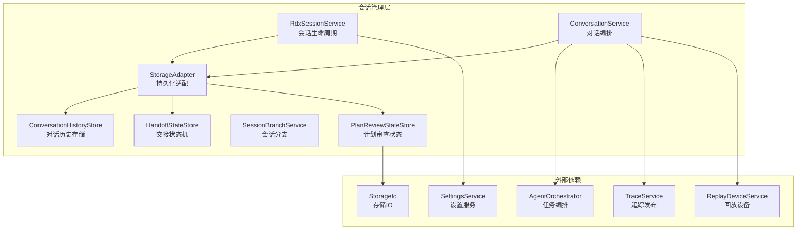
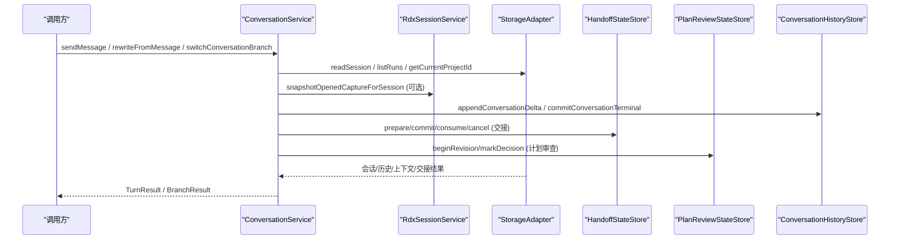
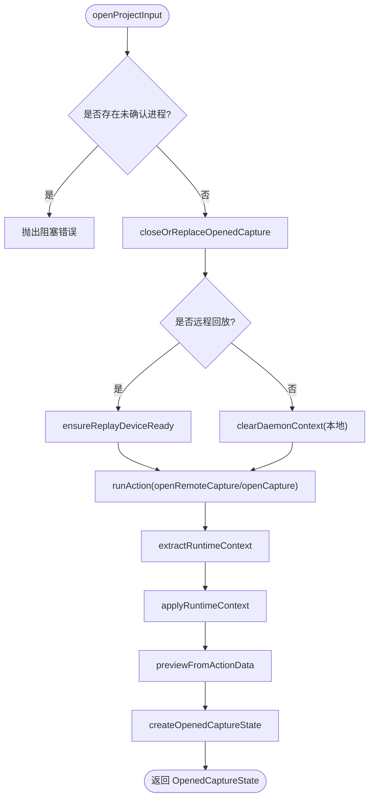
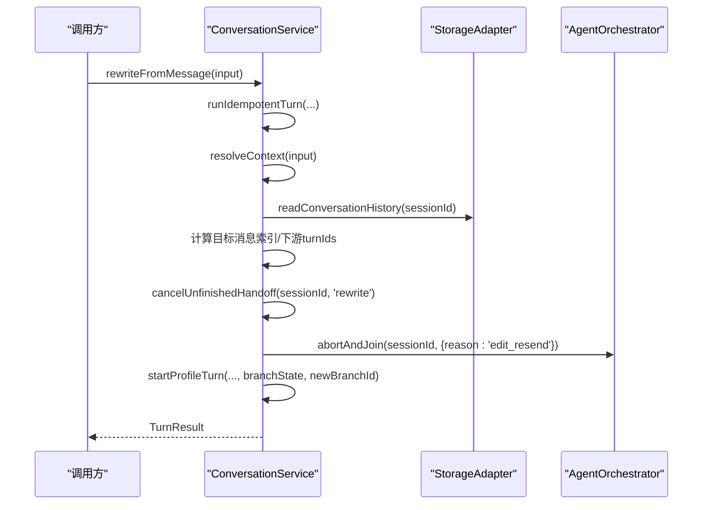
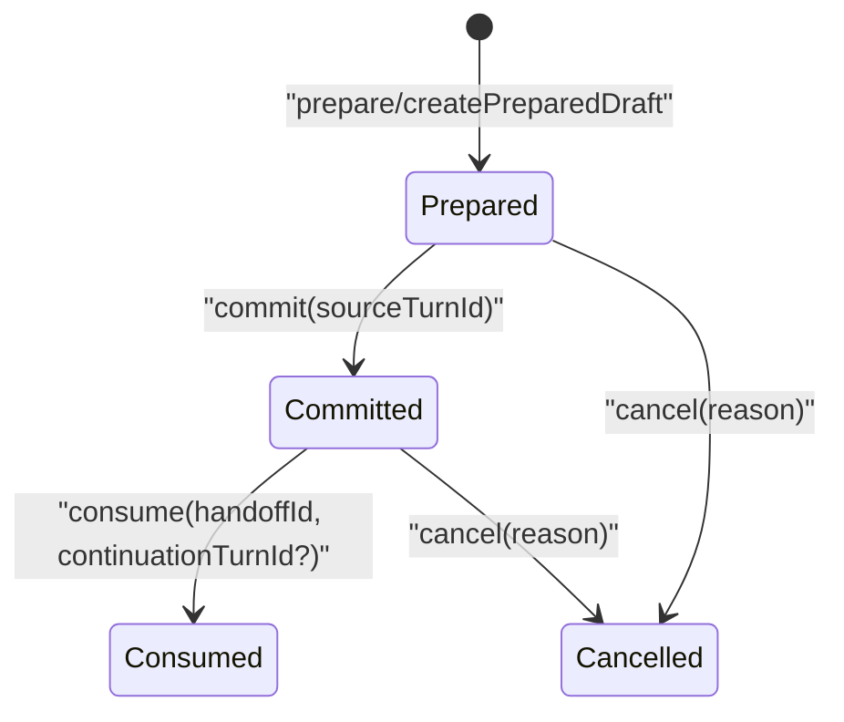
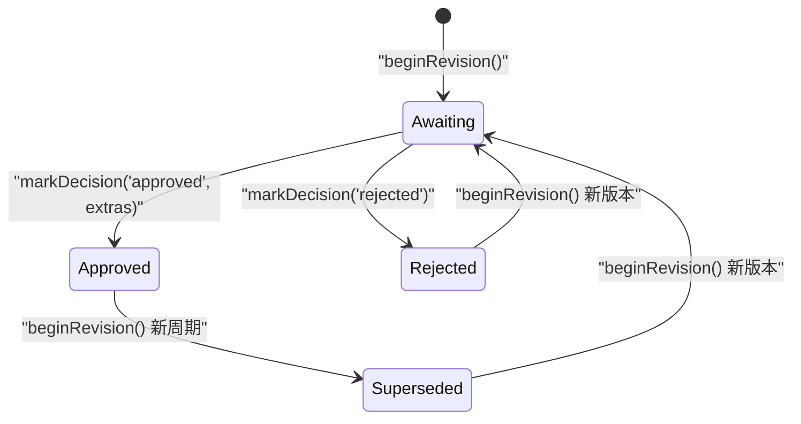
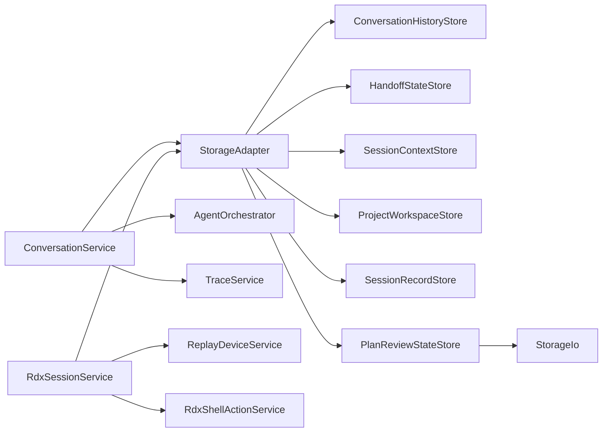

# 会话管理系统

<cite>
**本文引用的文件**
- [RdxSessionService.ts](file://src/main/sessions/RdxSessionService.ts)
- [ConversationService.ts](file://src/main/conversation/ConversationService.ts)
- [StorageAdapter.ts](file://src/main/sessions/StorageAdapter.ts)
- [HandoffStateStore.ts](file://src/main/sessions/HandoffStateStore.ts)
- [ConversationHistoryStore.ts](file://src/main/sessions/ConversationHistoryStore.ts)
- [storageSchema.ts](file://src/main/sessions/storageSchema.ts)
- [handoffStateSchema.ts](file://src/main/sessions/handoffStateSchema.ts)
- [SessionBranchService.ts](file://src/main/sessions/SessionBranchService.ts)
- [PlanReviewStateStore.ts](file://src/main/sessions/PlanReviewStateStore.ts)
- [planFilePersistence.ts](file://src/main/sessions/planFilePersistence.ts)
- [planReview.ts](file://src/shared/types/planReview.ts)
</cite>

## 更新摘要
**变更内容**
- 新增计划审查状态持久化机制，包括 PlanReviewStateStore 和相关文件持久化功能
- 增强会话管理系统以支持计划审查状态的完整生命周期管理
- 添加计划文件的安全写入和验证机制
- 集成计划审查状态与会话管理的现有架构

## 目录
1. [简介](#简介)
2. [项目结构](#项目结构)
3. [核心组件](#核心组件)
4. [架构总览](#架构总览)
5. [详细组件分析](#详细组件分析)
6. [依赖关系分析](#依赖关系分析)
7. [性能考量](#性能考量)
8. [故障排查指南](#故障排查指南)
9. [结论](#结论)
10. [附录：API 参考与使用示例](#附录api-参考与使用示例)

## 简介
本文件系统性地梳理并文档化 RDC-Agent 中的"会话管理"能力，重点覆盖以下方面：
- RdxSessionService：会话生命周期管理（打开/关闭捕获、切换活跃捕获、预览窗口、运行时上下文绑定）
- ConversationService：对话历史维护（发送消息、重写并重发、分支切换、取消进行中轮次、幂等性保证）
- StorageAdapter：数据持久化机制（项目/会话/运行记录、对话历史、附件、上下文、交接状态）
- HandoffStateStore：状态转移管理（准备、提交、消费、取消的有界链式交接流程）
- **新增** PlanReviewStateStore：计划审查状态持久化（等待、批准、拒绝、替代的状态机管理）

同时提供会话数据结构定义、存储格式、迁移策略、性能优化方案，以及完整的 API 参考和使用示例，帮助在应用中正确集成会话管理能力。

## 项目结构
会话管理相关代码主要分布在 main 层的 sessions 与 conversation 模块中，并通过 StorageAdapter 统一对外暴露持久化能力。关键组织方式如下：
- sessions：会话级服务与存储适配层，包含会话生命周期、分支、历史、上下文、交接状态、计划审查状态等
- conversation：对话编排与执行，负责消息路由、轮次控制、分支操作、追踪发布
- shared/types：跨进程共享的类型定义（会话、对话、分支、交接、计划审查等）

**图表来源**
- [RdxSessionService.ts:53-781](file://src/main/sessions/RdxSessionService.ts#L53-L781)
- [ConversationService.ts:78-896](file://src/main/conversation/ConversationService.ts#L78-L896)
- [StorageAdapter.ts:41-459](file://src/main/sessions/StorageAdapter.ts#L41-L459)
- [HandoffStateStore.ts:42-242](file://src/main/sessions/HandoffStateStore.ts#L42-L242)
- [ConversationHistoryStore.ts:33-796](file://src/main/sessions/ConversationHistoryStore.ts#L33-L796)
- [PlanReviewStateStore.ts:40-99](file://src/main/sessions/PlanReviewStateStore.ts#L40-L99)

## 核心组件
- RdxSessionService：负责打开/关闭捕获、切换活跃捕获、人类预览窗口、运行时上下文绑定与清理、远程/本地回放设备准备。
- ConversationService：负责会话内对话的发送、重写并重发、分支切换、取消进行中轮次、幂等请求去重、后台继续任务、追踪发布。
- StorageAdapter：统一封装项目/会话/运行记录的创建、读取、更新；对话历史的追加、压缩、恢复；附件导入与回滚；上下文日志；交接状态读写。
- HandoffStateStore：实现会话间或任务间的交接状态机，支持 prepared -> committed -> consumed/cancelled，带链深度限制与重启降级。
- ConversationHistoryStore：基于 JSONL 的对话历史存储，支持增量 delta、缓存重建、原子写入、转储恢复、附件清单管理。
- SessionBranchService：在当前会话位置创建新分支会话，复制历史消息，便于并行探索不同对话路径。
- **新增** PlanReviewStateStore：实现计划审查状态机，支持 awaiting -> approved/rejected/superseded，带版本控制和原子写入。

**章节来源**
- [RdxSessionService.ts:53-781](file://src/main/sessions/RdxSessionService.ts#L53-L781)
- [ConversationService.ts:78-896](file://src/main/conversation/ConversationService.ts#L78-L896)
- [StorageAdapter.ts:41-459](file://src/main/sessions/StorageAdapter.ts#L41-L459)
- [HandoffStateStore.ts:42-242](file://src/main/sessions/HandoffStateStore.ts#L42-L242)
- [ConversationHistoryStore.ts:33-796](file://src/main/sessions/ConversationHistoryStore.ts#L33-L796)
- [SessionBranchService.ts:12-45](file://src/main/sessions/SessionBranchService.ts#L12-L45)
- [PlanReviewStateStore.ts:40-99](file://src/main/sessions/PlanReviewStateStore.ts#L40-L99)

## 架构总览
会话管理的整体调用链路如下：
- 上层通过 ConversationService 发起对话请求，内部进行幂等校验、上下文解析、分支处理、轮次启动与终止。
- 会话生命周期由 RdxSessionService 管理，确保捕获/回放设备就绪、运行时上下文绑定与释放。
- 所有持久化操作通过 StorageAdapter 委托给具体 Store（历史、上下文、交接状态、计划审查状态等），保证一致性、原子性与可恢复性。
- 交接状态通过 HandoffStateStore 严格约束状态转移，避免并发冲突与非法状态。
- **新增** 计划审查状态通过 PlanReviewStateStore 管理计划的审批流程，确保状态一致性和数据完整性。

**图表来源**
- [ConversationService.ts:545-741](file://src/main/conversation/ConversationService.ts#L545-L741)
- [RdxSessionService.ts:69-229](file://src/main/sessions/RdxSessionService.ts#L69-L229)
- [StorageAdapter.ts:127-446](file://src/main/sessions/StorageAdapter.ts#L127-L446)
- [HandoffStateStore.ts:129-222](file://src/main/sessions/HandoffStateStore.ts#L129-L222)
- [PlanReviewStateStore.ts:54-87](file://src/main/sessions/PlanReviewStateStore.ts#L54-L87)
- [ConversationHistoryStore.ts:230-323](file://src/main/sessions/ConversationHistoryStore.ts#L230-L323)

## 详细组件分析

### RdxSessionService：会话生命周期管理
职责要点
- 打开捕获：支持本地与远程回放设备，准备设备、调用 Shell Action 打开捕获、提取运行时上下文、构建预览信息。
- 关闭/替换捕获：优雅关闭运行时上下文，清理租约与预览状态。
- 切换活跃捕获：在同一会话内切换当前活跃的捕获项。
- 人类预览窗口：打开/关闭预览窗口，处理错误与状态同步。
- 运行时上下文环境：为子进程传递 context_id、runtime_owner、owner_lease_id、replay_session_id 等环境变量。

关键流程（打开捕获）

**图表来源**
- [RdxSessionService.ts:69-229](file://src/main/sessions/RdxSessionService.ts#L69-L229)
- [RdxSessionService.ts:314-391](file://src/main/sessions/RdxSessionService.ts#L314-L391)
- [RdxSessionService.ts:406-479](file://src/main/sessions/RdxSessionService.ts#L406-L479)

**章节来源**
- [RdxSessionService.ts:69-229](file://src/main/sessions/RdxSessionService.ts#L69-L229)
- [RdxSessionService.ts:231-312](file://src/main/sessions/RdxSessionService.ts#L231-L312)
- [RdxSessionService.ts:345-391](file://src/main/sessions/RdxSessionService.ts#L345-L391)
- [RdxSessionService.ts:406-479](file://src/main/sessions/RdxSessionService.ts#L406-L479)
- [RdxSessionService.ts:503-541](file://src/main/sessions/RdxSessionService.ts#L503-L541)
- [RdxSessionService.ts:644-781](file://src/main/sessions/RdxSessionService.ts#L644-L781)

### ConversationService：对话历史维护与分支管理
职责要点
- 发送消息：幂等性保护、上下文解析、轮次启动、追踪发布。
- 重写并重发：定位目标用户消息，停止下游轮次，重建分支状态，重新发起轮次。
- 分支切换：中止活跃轮次，更新分支状态，刷新可见消息与追踪投影。
- 取消进行中轮次：支持按 requestId/turnId/sessionId 精准取消，清理后台继续任务。
- 后台继续：当会话空闲时自动恢复后台子代理任务。

关键流程（重写并重发）

**图表来源**
- [ConversationService.ts:571-702](file://src/main/conversation/ConversationService.ts#L571-L702)
- [ConversationService.ts:445-543](file://src/main/conversation/ConversationService.ts#L445-L543)

**章节来源**
- [ConversationService.ts:128-174](file://src/main/conversation/ConversationService.ts#L128-L174)
- [ConversationService.ts:176-231](file://src/main/conversation/ConversationService.ts#L176-L231)
- [ConversationService.ts:545-702](file://src/main/conversation/ConversationService.ts#L545-L702)
- [ConversationService.ts:704-753](file://src/main/conversation/ConversationService.ts#L704-L753)

### StorageAdapter：数据持久化机制
职责要点
- 项目与会话：创建、列出、更新、删除；当前项目/会话选择；案例与运行记录管理。
- 对话历史：追加消息、增量 delta、压缩、原子写入、缓存与重建、转储恢复。
- 附件管理：导入、分类、清单维护、回滚。
- 上下文日志：会话上下文条目追加与读取。
- 交接状态：读取/写入交接文档，触发 hydrate 监听。
- **新增** 计划审查状态：读取/写入计划审查状态文档，支持状态转换和版本控制。

关键特性
- 原子写入：使用临时文件 + rename 保证文件完整性。
- 增量更新：对频繁更新的 message 字段采用 delta 记录，减少 IO 压力。
- 缓存与重建：内存缓存会话历史，文件变更时失效并重建。
- 迁移兼容：通过 schemaVersion 与迁移函数兼容旧版本存储格式。

**章节来源**
- [StorageAdapter.ts:41-459](file://src/main/sessions/StorageAdapter.ts#L41-L459)
- [ConversationHistoryStore.ts:230-323](file://src/main/sessions/ConversationHistoryStore.ts#L230-L323)
- [ConversationHistoryStore.ts:325-390](file://src/main/sessions/ConversationHistoryStore.ts#L325-L390)
- [storageSchema.ts:16-99](file://src/main/sessions/storageSchema.ts#L16-L99)

### HandoffStateStore：状态转移管理
职责要点
- 状态机：prepared -> committed -> consumed/cancelled，禁止非法跳转。
- 链式交接：支持 chainRoot 与 depth，限制最大链深，防止无限嵌套。
- 重启降级：进程重启后，未在本进程创建的 prepared/committed 状态将被取消。
- 草稿预留：prepare 前可 createPreparedDraft 预留内存态，避免重复准备。

状态转移图

**图表来源**
- [HandoffStateStore.ts:129-222](file://src/main/sessions/HandoffStateStore.ts#L129-L222)
- [handoffStateSchema.ts:22-64](file://src/main/sessions/handoffStateSchema.ts#L22-L64)

**章节来源**
- [HandoffStateStore.ts:53-110](file://src/main/sessions/HandoffStateStore.ts#L53-L110)
- [HandoffStateStore.ts:129-222](file://src/main/sessions/HandoffStateStore.ts#L129-L222)
- [handoffStateSchema.ts:22-64](file://src/main/sessions/handoffStateSchema.ts#L22-L64)

### PlanReviewStateStore：计划审查状态持久化
职责要点
- 状态机：awaiting -> approved/rejected/superseded，禁止非法状态转换。
- 版本控制：每个计划有唯一的 planId 和递增的 revision，支持多轮审查。
- 原子写入：使用 writeJsonAtomic 确保状态文件的完整性。
- 安全验证：approved 状态必须包含完整的冻结计划绑定信息。
- 会话隔离：每个会话独立的 plan-state.json 文件存储。

状态转移图

**图表来源**
- [PlanReviewStateStore.ts:13-27](file://src/main/sessions/PlanReviewStateStore.ts#L13-L27)
- [PlanReviewStateStore.ts:54-87](file://src/main/sessions/PlanReviewStateStore.ts#L54-L87)
- [planReview.ts:3-48](file://src/shared/types/planReview.ts#L3-L48)

**章节来源**
- [PlanReviewStateStore.ts:40-99](file://src/main/sessions/PlanReviewStateStore.ts#L40-L99)
- [planReview.ts:1-113](file://src/shared/types/planReview.ts#L1-L113)

### 计划文件持久化
职责要点
- 安全路径验证：检查目标路径是否为绝对路径，拒绝符号链接。
- 原子写入：使用 writeUtf8AtomicFsync 确保文件写入的原子性。
- 完整性验证：写入后验证文件内容，失败时恢复原始文件。
- YAML frontmatter：支持计划元数据的结构化存储。

关键特性
- 路径安全检查：防止符号链接攻击和非法路径访问。
- 原子操作：确保文件写入要么完全成功，要么完全失败。
- 错误恢复：写入失败时自动恢复原始文件内容。
- 元数据支持：通过 YAML frontmatter 存储计划相关的元数据。

**章节来源**
- [planFilePersistence.ts:8-43](file://src/main/sessions/planFilePersistence.ts#L8-L43)

### 会话分支管理
- SessionBranchService：在当前会话位置创建新分支会话，复制源会话的历史消息，便于并行探索不同对话路径。
- ConversationService 分支切换：更新 activeBranchId 与 activeLeafBranchId，刷新可见消息与追踪投影。

**章节来源**
- [SessionBranchService.ts:12-45](file://src/main/sessions/SessionBranchService.ts#L12-L45)
- [ConversationService.ts:704-741](file://src/main/conversation/ConversationService.ts#L704-L741)

## 依赖关系分析
- ConversationService 依赖 StorageAdapter 获取会话/运行/历史/上下文数据，依赖 AgentOrchestrator 管理轮次与后台任务，依赖 TraceService 发布追踪。
- RdxSessionService 依赖 rdxShellActionService 与 rdxCliInvokerService 执行原生动作，依赖 replayDeviceService 管理回放设备，依赖 settingsService 获取 CLI 配置。
- StorageAdapter 组合多个 Store（ProjectWorkspaceStore、SessionRecordStore、ConversationHistoryStore、SessionContextStore、HandoffStateStore、PlanReviewStateStore），统一对外接口。
- HandoffStateStore 依赖 storageHost 提供的会话路径查找与 IO 能力，依赖 handoffExecution 的状态转移校验。
- **新增** PlanReviewStateStore 依赖 storageAdapter 的 IO 能力和会话路径查找，提供计划审查状态的持久化服务。

**图表来源**
- [ConversationService.ts:78-109](file://src/main/conversation/ConversationService.ts#L78-L109)
- [RdxSessionService.ts:1-35](file://src/main/sessions/RdxSessionService.ts#L1-L35)
- [StorageAdapter.ts:41-66](file://src/main/sessions/StorageAdapter.ts#L41-L66)
- [HandoffStateStore.ts:1-18](file://src/main/sessions/HandoffStateStore.ts#L1-L18)
- [PlanReviewStateStore.ts:1-12](file://src/main/sessions/PlanReviewStateStore.ts#L1-L12)

**章节来源**
- [ConversationService.ts:78-109](file://src/main/conversation/ConversationService.ts#L78-L109)
- [RdxSessionService.ts:1-35](file://src/main/sessions/RdxSessionService.ts#L1-L35)
- [StorageAdapter.ts:41-66](file://src/main/sessions/StorageAdapter.ts#L41-L66)
- [HandoffStateStore.ts:1-18](file://src/main/sessions/HandoffStateStore.ts#L1-L18)
- [PlanReviewStateStore.ts:1-12](file://src/main/sessions/PlanReviewStateStore.ts#L1-L12)

## 性能考量
- 对话历史增量更新：通过 delta 记录减少大对象写入频率，达到阈值后压缩历史，降低 IO 与内存占用。
- 历史缓存：会话历史在内存中缓存，文件 mtime/size 变化时失效重建，提升读取性能。
- 原子写入：使用临时文件 + rename 保证写入原子性，避免部分写入导致的数据损坏。
- 幂等请求：ConversationService 通过 requestId + fingerprint 去重，避免重复执行相同请求。
- 附件分阶段拷贝：在指纹计算阶段将附件复制到 staging 目录，避免原始文件被修改影响哈希一致性。
- 交接链深度限制：防止过深的交接链导致状态爆炸与性能退化。
- **新增** 计划审查状态缓存：PlanReviewStateStore 通过会话路径缓存状态文件位置，减少文件系统查询开销。
- **新增** 原子文件写入：计划文件和状态文件都使用原子写入，确保数据一致性。

## 故障排查指南
常见问题与定位方法
- 会话无法打开捕获：检查是否有未确认的原生进程退出，查看 openCapture/openRemoteCapture 的错误诊断。
- 预览不可用：检查 openPreview/closePreview 的结果与 lastError，确认 contextId、runtimeOwner、ownerLeaseId 是否正确。
- 对话重写失败：确认目标消息为用户消息且存在，下游 turn 已停止，分支状态已重建。
- 分支切换无效：确认分支状态存在且 fork/branch 有效，检查 activeBranchId 与 activeLeafBranchId 是否更新。
- 交接状态冲突：检查是否已有 prepared/committed 状态，确认链深度未超限，重启后未创建的状态会被取消。
- 历史不一致：检查 conversation.jsonl 的 delta 记录与缓存，必要时触发 compact 或重建。
- **新增** 计划审查状态异常：检查 plan-state.json 文件是否存在且格式正确，确认状态转换是否符合规则。
- **新增** 计划文件写入失败：检查目标路径权限，确认没有符号链接，查看原子写入的验证结果。

**章节来源**
- [RdxSessionService.ts:160-187](file://src/main/sessions/RdxSessionService.ts#L160-L187)
- [RdxSessionService.ts:231-300](file://src/main/sessions/RdxSessionService.ts#L231-L300)
- [ConversationService.ts:571-702](file://src/main/conversation/ConversationService.ts#L571-L702)
- [ConversationService.ts:704-741](file://src/main/conversation/ConversationService.ts#L704-L741)
- [HandoffStateStore.ts:142-154](file://src/main/sessions/HandoffStateStore.ts#L142-L154)
- [ConversationHistoryStore.ts:230-323](file://src/main/sessions/ConversationHistoryStore.ts#L230-L323)
- [PlanReviewStateStore.ts:74-87](file://src/main/sessions/PlanReviewStateStore.ts#L74-L87)
- [planFilePersistence.ts:8-25](file://src/main/sessions/planFilePersistence.ts#L8-L25)

## 结论
本会话管理系统以 RdxSessionService 管理会话生命周期，ConversationService 编排对话与分支，StorageAdapter 提供一致且健壮的持久化能力，HandoffStateStore 保障交接状态的正确转移。**新增的 PlanReviewStateStore 进一步增强了系统的计划审查能力，提供了完整的状态管理和文件持久化机制**。系统通过幂等性、原子写入、增量更新、缓存与迁移机制，实现了高可靠、高性能的会话管理能力。建议在应用中遵循其 API 约定，合理使用分支与交接，结合新的计划审查功能，以获得最佳体验与稳定性。

## 附录：API 参考与使用示例

### RdxSessionService 关键 API
- openProjectInput(request, options)：打开捕获，返回 OpenedCaptureState
- closeOrReplaceOpenedCapture(options)：关闭或替换当前捕获
- openHumanPreviewWindow(scope)、closeHumanPreviewWindow(scope)：打开/关闭人类预览窗口
- switchActiveCapture(captureId)：切换活跃捕获
- snapshotContextForSession(scope)、snapshotOpenedCaptureForSession(scope)：快照当前上下文与打开态
- clearOpenedCaptureForSession(scope, options)：清理打开态

使用示例（概念性步骤）
- 调用 openProjectInput 传入 projectId、inputId、filePath、sessionId 等参数
- 根据返回值判断预览加载是否成功，处理错误与重试
- 在需要时调用 switchActiveCapture 切换活跃捕获
- 完成工作后调用 closeOrReplaceOpenedCapture 清理资源

**章节来源**
- [RdxSessionService.ts:69-229](file://src/main/sessions/RdxSessionService.ts#L69-L229)
- [RdxSessionService.ts:231-312](file://src/main/sessions/RdxSessionService.ts#L231-L312)
- [RdxSessionService.ts:521-541](file://src/main/sessions/RdxSessionService.ts#L521-L541)

### ConversationService 关键 API
- getHistory(sessionId)：读取会话历史与分支状态
- clearHistory(sessionId)：清空历史并重置上下文
- undoLastTurn(sessionId)：撤销最后一轮用户消息及其后续
- cancelActiveTurn(request)：取消进行中轮次
- answerUserInput/request、answerToolApproval/request：回答交互与工具审批
- sendMessage(input)、rewriteFromMessage(input)：发送消息与重写并重发
- switchConversationBranch(input)：切换对话分支

使用示例（概念性步骤）
- 调用 sendMessage 发送用户消息，等待 TurnResult
- 如需编辑并重发，调用 rewriteFromMessage，指定 messageId 与新消息
- 如需切换分支，调用 switchConversationBranch，指定 sessionId、forkId、branchId
- 如需取消，调用 cancelActiveTurn，指定 requestId/turnId/sessionId

**章节来源**
- [ConversationService.ts:128-174](file://src/main/conversation/ConversationService.ts#L128-L174)
- [ConversationService.ts:176-231](file://src/main/conversation/ConversationService.ts#L176-L231)
- [ConversationService.ts:545-702](file://src/main/conversation/ConversationService.ts#L545-L702)
- [ConversationService.ts:704-741](file://src/main/conversation/ConversationService.ts#L704-L741)

### StorageAdapter 关键 API
- 项目与会话：listProjects、createProject、renameProject、removeProject、listSessions、createSession、updateSession、getCurrentProjectId、setCurrentProjectId、getCurrentSessionId、setCurrentSessionId
- 运行记录：createRun、readRun、updateRun、getLatestRun、listRuns
- 对话历史：readConversationHistory、appendConversationMessage、appendConversationDelta、writeConversationHistory、compactConversationHistory
- 附件：importSessionAttachments、rollbackImportedSessionAttachments、listSessionAttachments
- 上下文：writeSessionContextJournal、readSessionContextJournal、clearSessionContextState
- 交接状态：setHandoffHydrateListener、readSession（会触发 hydrate）

使用示例（概念性步骤）
- 创建项目与会话后，通过 appendConversationMessage 追加消息
- 高频更新时使用 appendConversationDelta，达到阈值自动压缩
- 导入附件后，可通过 rollbackImportedSessionAttachments 回滚
- 读取会话时会触发交接状态 hydrate，便于恢复或降级

**章节来源**
- [StorageAdapter.ts:91-446](file://src/main/sessions/StorageAdapter.ts#L91-L446)

### HandoffStateStore 关键 API
- readDocument(sessionId)、getActive(sessionId)：读取交接文档与活跃状态
- createPreparedDraft(sessionId, input)、prepare(sessionId, input)：准备草稿或直接准备
- abandonDraft(sessionId, handoffId)：放弃草稿
- commit(sessionId, sourceTurnId)：提交准备状态
- consume(sessionId, handoffId, continuationTurnId?)：消费提交状态
- cancel(sessionId, reason)：取消状态

使用示例（概念性步骤）
- 在会话间或任务间传递上下文时，先 prepare 或 createPreparedDraft
- 完成后 commit，再由接收方 consume 完成交接
- 若失败或用户中断，调用 cancel 并记录原因

**章节来源**
- [HandoffStateStore.ts:53-110](file://src/main/sessions/HandoffStateStore.ts#L53-L110)
- [HandoffStateStore.ts:129-222](file://src/main/sessions/HandoffStateStore.ts#L129-L222)

### PlanReviewStateStore 关键 API
- getStatePath(sessionId)：获取计划审查状态文件路径
- read(sessionId)：读取计划审查状态文档
- beginRevision(sessionId)：开始新的计划修订，返回 planId、revision、newCycle
- markDecision(sessionId, status, extras)：标记计划审查决策，支持 approved/rejected

使用示例（概念性步骤）
- 调用 beginRevision 开始新的计划审查周期，获取 planId 和 revision
- 在计划审查过程中，根据需要调用 markDecision 标记批准或拒绝
- 批准后会自动开启新的审查周期，生成新的 planId
- 通过 read 方法可以恢复之前的审查状态

**章节来源**
- [PlanReviewStateStore.ts:43-87](file://src/main/sessions/PlanReviewStateStore.ts#L43-L87)

### 计划文件持久化 API
- assertPlanWritePath(targetPath)：验证计划文件写入路径的安全性
- composeProjectPlan(markdown, fields)：组合带有 YAML frontmatter 的计划文档
- writePlanFile(targetPath, document, io)：原子写入计划文件，包含完整性验证

使用示例（概念性步骤）
- 使用 assertPlanWritePath 验证目标路径的安全性
- 通过 composeProjectPlan 创建包含元数据的计划文档
- 调用 writePlanFile 进行原子写入，确保文件完整性
- 如果写入失败，会自动恢复原始文件内容

**章节来源**
- [planFilePersistence.ts:8-43](file://src/main/sessions/planFilePersistence.ts#L8-L43)

### 数据存储格式与迁移策略
- 会话记录：SessionRecordSchema，包含 sessionId、projectId、title、goal、sessionPath、时间戳、turnControls、modelOverride、agentId 等
- 对话历史：conversation.jsonl，支持完整消息与 delta 记录，附带附件清单 attachments.json
- 分支状态：conversation-branches.json，记录 forks、activeBranchId、activeLeafBranchId
- 交接状态：handoff-state.json，包含 active 与 history，受 HandoffStateDocumentSchema 约束
- **新增** 计划审查状态：plan-state.json，包含 planId、revision、status、approvedHash、frozenUri、approvedHandoff、updatedAt
- **新增** 计划文件：Markdown 文件，包含 YAML frontmatter 元数据和计划内容
- 迁移：通过 parseStoredDocument 与 migrations 数组，按 schemaVersion 逐步迁移到最新版本

**章节来源**
- [storageSchema.ts:140-194](file://src/main/sessions/storageSchema.ts#L140-L194)
- [storageSchema.ts:196-236](file://src/main/sessions/storageSchema.ts#L196-L236)
- [storageSchema.ts:284-379](file://src/main/sessions/storageSchema.ts#L284-L379)
- [handoffStateSchema.ts:22-64](file://src/main/sessions/handoffStateSchema.ts#L22-L64)
- [planReview.ts:39-48](file://src/shared/types/planReview.ts#L39-L48)
- [planReview.ts:50-57](file://src/shared/types/planReview.ts#L50-L57)