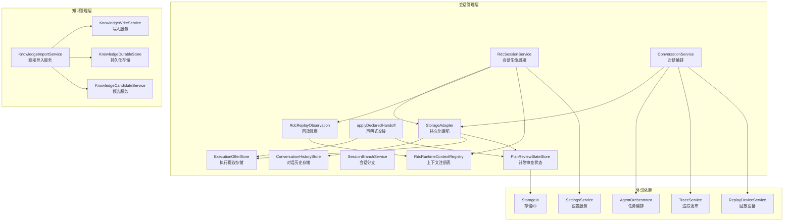
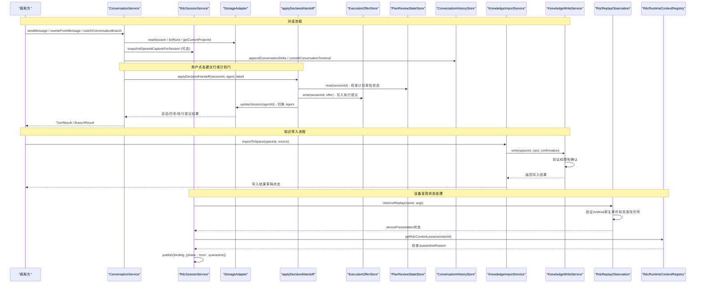
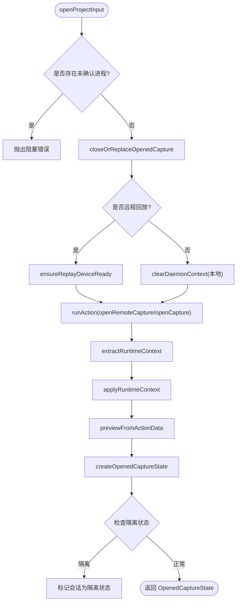
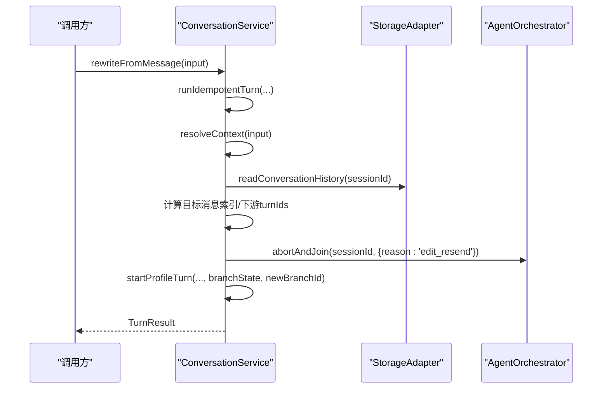
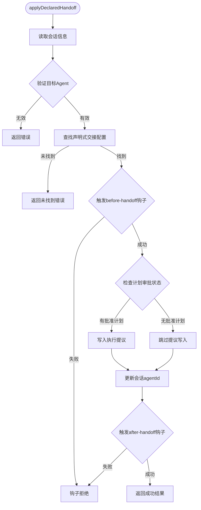
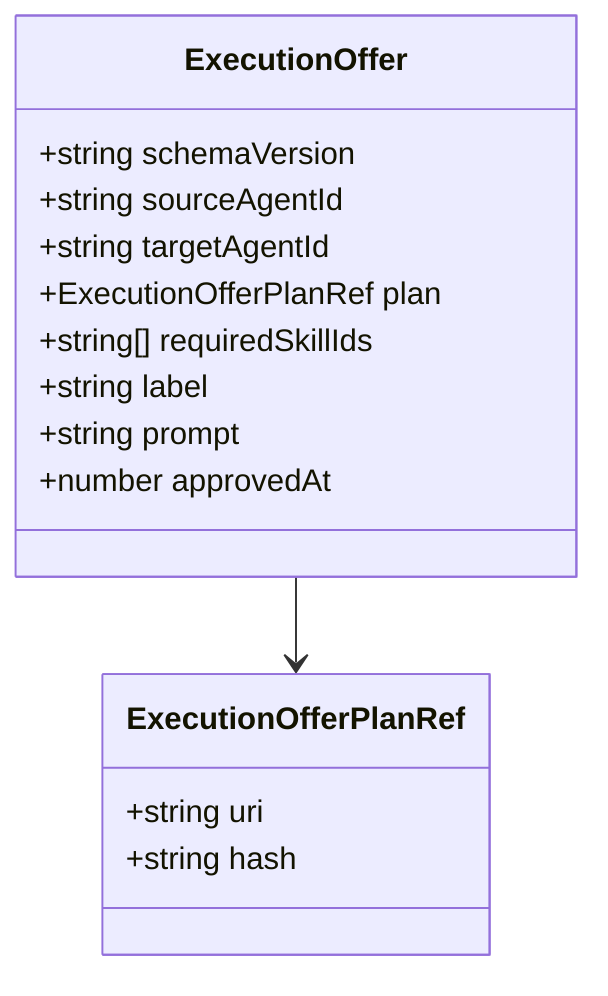
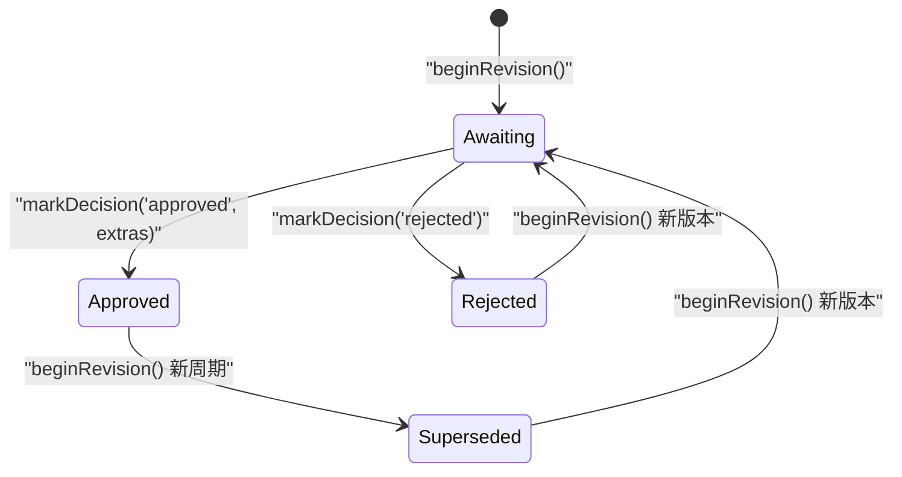
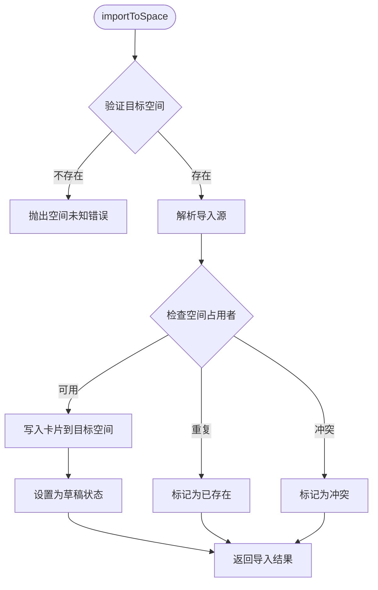
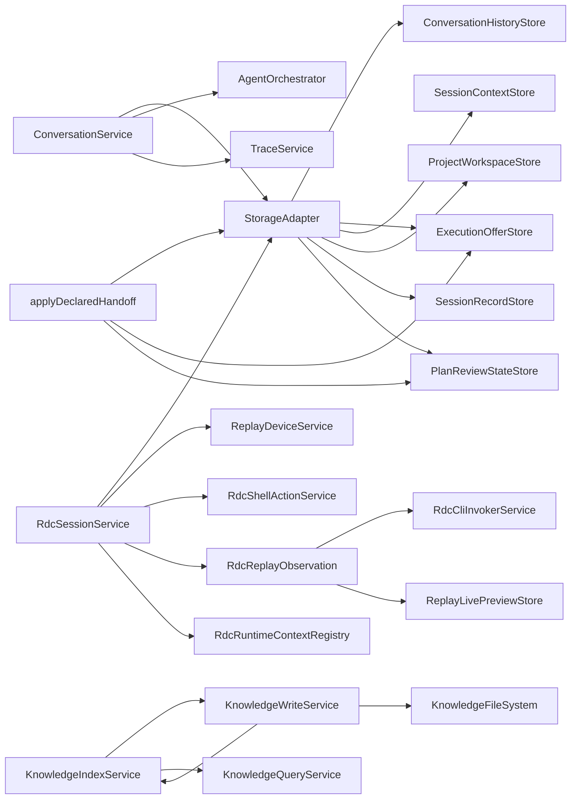

# 会话管理系统

<cite>
**本文引用的文件**
- [RdcSessionService.ts](file://src/main/sessions/RdcSessionService.ts)
- [ConversationService.ts](file://src/main/conversation/ConversationService.ts)
- [StorageAdapter.ts](file://src/main/sessions/StorageAdapter.ts)
- [applyDeclaredHandoff.ts](file://src/main/conversation/applyDeclaredHandoff.ts)
- [ExecutionOfferStore.ts](file://src/main/sessions/ExecutionOfferStore.ts)
- [executionOffer.ts](file://src/shared/types/executionOffer.ts)
- [handoffSkills.ts](file://src/main/sessions/handoffSkills.ts)
- [PlanReviewStateStore.ts](file://src/main/sessions/PlanReviewStateStore.ts)
- [ConversationHistoryStore.ts](file://src/main/sessions/ConversationHistoryStore.ts)
- [storageSchema.ts](file://src/main/sessions/storageSchema.ts)
- [SessionBranchService.ts](file://src/main/sessions/SessionBranchService.ts)
- [planFilePersistence.ts](file://src/main/sessions/planFilePersistence.ts)
- [planReview.ts](file://src/shared/types/planReview.ts)
- [KnowledgeImportService.ts](file://src/main/knowledge/KnowledgeImportService.ts)
- [KnowledgeWriteService.ts](file://src/main/knowledge/KnowledgeWriteService.ts)
- [knowledgeHandlers.ts](file://src/main/ipc/knowledgeHandlers.ts)
- [knowledge.ts](file://src/shared/types/knowledge.ts)
- [captureReplay.ts](file://src/shared/types/captureReplay.ts)
- [RdcReplayObservation.ts](file://src/main/sessions/RdcReplayObservation.ts)
- [RdcRuntimeContextRegistry.ts](file://src/main/sessions/RdcRuntimeContextRegistry.ts)
</cite>

## 更新摘要
**变更内容**
- **设备呈现状态增强**：改进了RdcSessionService的设备呈现状态处理，增强了devicePresentation字段的状态管理和验证
- **Android原生事件跟踪**：增强了对Android原生事件的跟踪，包括资源ID和序列号的验证
- **隔离支持机制**：添加了在检测到上下文问题时自动标记会话为隔离状态的功能，防止不安全操作
- **显示回执验证**：改进了对远程显示回执的验证逻辑，确保设备呈现的一致性和安全性

## 目录
1. [简介](#简介)
2. [项目结构](#项目结构)
3. [核心组件](#核心组件)
4. [架构总览](#架构总览)
5. [详细组件分析](#详细组件分析)
6. [依赖关系分析](#依赖关系分析)
7. [性能考量](#性能考量)
8. [故障排查指南](#故障排查指南)
9. [结论](#结论)
10. [附录：API 参考与使用示例](#附录api-参考与使用示例)

## 简介
本文件系统性地梳理并文档化 RDC-Agent 中的"会话管理"能力，重点覆盖以下方面：
- RdcSessionService：会话生命周期管理（打开/关闭捕获、切换活跃捕获、预览窗口、运行时上下文绑定）
- ConversationService：对话历史维护（发送消息、重写并重发、分支切换、取消进行中轮次、幂等性保证）
- StorageAdapter：数据持久化机制（项目/会话/运行记录、对话历史、附件、上下文、执行提议）
- **新架构** applyDeclaredHandoff：声明式交接处理，通过用户交互触发 Agent 切换
- **新架构** ExecutionOfferStore：执行提议存储，管理已批准的计划和 Skill 预载
- PlanReviewStateStore：计划审查状态持久化（等待、批准、拒绝、替代的状态机管理）
- **新架构** KnowledgeImportService：直接导入到目标空间的工作流程，移除了基于会话的两步流程
- **新增** 设备呈现状态管理：增强的Android设备显示状态跟踪和资源序列号管理
- **新增** 会话隔离机制：在检测到上下文问题时自动隔离会话，确保系统安全性

同时提供会话数据结构定义、存储格式、迁移策略、性能优化方案，以及完整的 API 参考和使用示例，帮助在应用中正确集成会话管理能力。

## 项目结构
会话管理相关代码主要分布在 main 层的 sessions 与 conversation 模块中，并通过 StorageAdapter 统一对外暴露持久化能力。关键组织方式如下：
- sessions：会话级服务与存储适配层，包含会话生命周期、分支、历史、上下文、执行提议、计划审查状态等
- conversation：对话编排与执行，负责消息路由、轮次控制、分支操作、追踪发布、声明式交接
- knowledge：知识管理系统，包含导入、写入、查询、索引等服务
- shared/types：跨进程共享的类型定义（会话、对话、分支、执行提议、计划审查、知识卡片等）

**图表来源**
- [RdcSessionService.ts:53-781](file://src/main/sessions/RdcSessionService.ts#L53-L781)
- [ConversationService.ts:78-896](file://src/main/conversation/ConversationService.ts#L78-L896)
- [StorageAdapter.ts:41-459](file://src/main/sessions/StorageAdapter.ts#L41-L459)
- [applyDeclaredHandoff.ts:38-94](file://src/main/conversation/applyDeclaredHandoff.ts#L38-L94)
- [ExecutionOfferStore.ts:42-81](file://src/main/sessions/ExecutionOfferStore.ts#L42-L81)
- [ConversationHistoryStore.ts:33-796](file://src/main/sessions/ConversationHistoryStore.ts#L33-L796)
- [PlanReviewStateStore.ts:40-99](file://src/main/sessions/PlanReviewStateStore.ts#L40-L99)
- [KnowledgeImportService.ts:151-329](file://src/main/knowledge/KnowledgeImportService.ts#L151-L329)
- [KnowledgeWriteService.ts:70-178](file://src/main/knowledge/KnowledgeWriteService.ts#L70-L178)
- [RdcReplayObservation.ts:36-108](file://src/main/sessions/RdcReplayObservation.ts#L36-L108)
- [RdcRuntimeContextRegistry.ts:12-26](file://src/main/sessions/RdcRuntimeContextRegistry.ts#L12-L26)

## 核心组件
- RdcSessionService：负责打开/关闭捕获、切换活跃捕获、人类预览窗口、运行时上下文绑定与清理、远程/本地回放设备准备。
- ConversationService：负责会话内对话的发送、重写并重发、分支切换、取消进行中轮次、幂等请求去重、后台继续任务、追踪发布。
- StorageAdapter：统一封装项目/会话/运行记录的创建、读取、更新；对话历史的追加、压缩、恢复；附件导入与回滚；上下文日志；执行提议读写。
- **新架构** applyDeclaredHandoff：处理用户点击建议行或计划门后的 Agent 切换逻辑，验证声明式交接配置，写入执行提议。
- **新架构** ExecutionOfferStore：存储和管理执行提议，包含源 Agent、目标 Agent、冻结计划引用、所需 Skill 列表等信息。
- ConversationHistoryStore：基于 JSONL 的对话历史存储，支持增量 delta、缓存重建、原子写入、转储恢复、附件清单管理。
- SessionBranchService：在当前会话位置创建新分支会话，复制历史消息，便于并行探索不同对话路径。
- PlanReviewStateStore：实现计划审查状态机，支持 awaiting -> approved/rejected/superseded，带版本控制和原子写入。
- **新架构** KnowledgeImportService：直接导入知识到目标空间，创建草稿状态，移除了基于会话的两步流程。
- **新架构** KnowledgeWriteService：安全地写入知识卡片，支持权限控制、确认机制和原子写入。
- **新增** RdcReplayObservation：增强设备呈现状态跟踪，支持Android原生事件和资源序列号验证。
- **新增** RdcRuntimeContextRegistry：提供会话隔离机制，在检测到上下文问题时自动标记会话为隔离状态。

**章节来源**
- [RdcSessionService.ts:53-781](file://src/main/sessions/RdcSessionService.ts#L53-L781)
- [ConversationService.ts:78-896](file://src/main/conversation/ConversationService.ts#L78-L896)
- [StorageAdapter.ts:41-459](file://src/main/sessions/StorageAdapter.ts#L41-L459)
- [applyDeclaredHandoff.ts:38-94](file://src/main/conversation/applyDeclaredHandoff.ts#L38-L94)
- [ExecutionOfferStore.ts:42-81](file://src/main/sessions/ExecutionOfferStore.ts#L42-L81)
- [ConversationHistoryStore.ts:33-796](file://src/main/sessions/ConversationHistoryStore.ts#L33-L796)
- [SessionBranchService.ts:12-45](file://src/main/sessions/SessionBranchService.ts#L12-L45)
- [PlanReviewStateStore.ts:40-99](file://src/main/sessions/PlanReviewStateStore.ts#L40-L99)
- [KnowledgeImportService.ts:151-329](file://src/main/knowledge/KnowledgeImportService.ts#L151-L329)
- [KnowledgeWriteService.ts:70-178](file://src/main/knowledge/KnowledgeWriteService.ts#L70-L178)
- [RdcReplayObservation.ts:36-108](file://src/main/sessions/RdcReplayObservation.ts#L36-L108)
- [RdcRuntimeContextRegistry.ts:12-26](file://src/main/sessions/RdcRuntimeContextRegistry.ts#L12-L26)

## 架构总览
新的会话管理架构采用声明式交接模型和直接导入模式，整体调用链路如下：
- 上层通过 ConversationService 发起对话请求，内部进行幂等校验、上下文解析、分支处理、轮次启动与终止。
- 会话生命周期由 RdcSessionService 管理，确保捕获/回放设备就绪、运行时上下文绑定与释放。
- 所有持久化操作通过 StorageAdapter 委托给具体 Store（历史、上下文、执行提议、计划审查状态等），保证一致性、原子性与可恢复性。
- **新架构** 用户交互触发 applyDeclaredHandoff，验证声明式交接配置后写入 ExecutionOfferStore，然后切换 Agent。
- **新架构** 知识导入通过 KnowledgeImportService 直接写入目标空间，创建草稿状态，移除了基于会话的两步流程。
- **新架构** 计划审查批准后，通过 writeExecutionOfferFromApproval 写入执行提议，确保 Skill 预载的安全性。
- **新增** 设备呈现状态通过 RdcReplayObservation 进行跟踪，支持Android原生事件和资源序列号验证。
- **新增** 会话隔离机制通过 RdcRuntimeContextRegistry 实现，在检测到上下文问题时自动隔离会话。

**图表来源**
- [ConversationService.ts:545-741](file://src/main/conversation/ConversationService.ts#L545-L741)
- [RdcSessionService.ts:69-229](file://src/main/sessions/RdcSessionService.ts#L69-L229)
- [StorageAdapter.ts:127-446](file://src/main/sessions/StorageAdapter.ts#L127-L446)
- [applyDeclaredHandoff.ts:38-94](file://src/main/conversation/applyDeclaredHandoff.ts#L38-L94)
- [ExecutionOfferStore.ts:53-67](file://src/main/sessions/ExecutionOfferStore.ts#L53-L67)
- [PlanReviewStateStore.ts:54-87](file://src/main/sessions/PlanReviewStateStore.ts#L54-L87)
- [ConversationHistoryStore.ts:230-323](file://src/main/sessions/ConversationHistoryStore.ts#L230-L323)
- [KnowledgeImportService.ts:167-186](file://src/main/knowledge/KnowledgeImportService.ts#L167-L186)
- [KnowledgeWriteService.ts:73-113](file://src/main/knowledge/KnowledgeWriteService.ts#L73-L113)
- [RdcReplayObservation.ts:36-108](file://src/main/sessions/RdcReplayObservation.ts#L36-L108)
- [RdcRuntimeContextRegistry.ts:262-267](file://src/main/sessions/RdcRuntimeContextRegistry.ts#L262-L267)

## 详细组件分析

### RdcSessionService：会话生命周期管理
职责要点
- 打开捕获：支持本地与远程回放设备，准备设备、调用 Shell Action 打开捕获、提取运行时上下文、构建预览信息。
- 关闭/替换捕获：优雅关闭运行时上下文，清理租约与预览状态。
- 切换活跃捕获：在同一会话内切换当前活跃的捕获项。
- 人类预览窗口：打开/关闭预览窗口，处理错误与状态同步。
- 运行时上下文环境：为子进程传递 context_id、runtime_owner、owner_lease_id、replay_session_id 等环境变量。
- **新增** 设备呈现状态管理：增强的devicePresentation字段状态跟踪，支持not_applicable、unsupported、unavailable、presented四种状态。
- **新增** 隔离支持：在检测到上下文问题时自动标记会话为隔离状态，防止不安全操作。

关键流程（打开捕获）

**图表来源**
- [RdcSessionService.ts:69-229](file://src/main/sessions/RdcSessionService.ts#L69-L229)
- [RdcSessionService.ts:314-391](file://src/main/sessions/RdcSessionService.ts#L314-L391)
- [RdcSessionService.ts:406-479](file://src/main/sessions/RdcSessionService.ts#L406-L479)

**章节来源**
- [RdcSessionService.ts:69-229](file://src/main/sessions/RdcSessionService.ts#L69-L229)
- [RdcSessionService.ts:231-312](file://src/main/sessions/RdcSessionService.ts#L231-L312)
- [RdcSessionService.ts:345-391](file://src/main/sessions/RdcSessionService.ts#L345-L391)
- [RdcSessionService.ts:406-479](file://src/main/sessions/RdcSessionService.ts#L406-L479)
- [RdcSessionService.ts:503-541](file://src/main/sessions/RdcSessionService.ts#L503-L541)
- [RdcSessionService.ts:644-781](file://src/main/sessions/RdcSessionService.ts#L644-L781)

### ConversationService：对话历史维护与分支管理
职责要点
- 发送消息：幂等性保护、上下文解析、轮次启动、追踪发布。
- 重写并重发：定位目标用户消息，停止下游轮次，重建分支状态，重新发起轮次。
- 分支切换：中止活跃轮次，更新分支状态，刷新可见消息与追踪投影。
- 取消进行中轮次：支持按 requestId/turnId/sessionId 精准取消，清理后台继续任务。
- 后台继续：当会话空闲时自动恢复后台子代理任务。

关键流程（重写并重发）

**图表来源**
- [ConversationService.ts:571-702](file://src/main/conversation/ConversationService.ts#L571-L702)
- [ConversationService.ts:445-543](file://src/main/conversation/ConversationService.ts#L445-L543)

**章节来源**
- [ConversationService.ts:128-174](file://src/main/conversation/ConversationService.ts#L128-L174)
- [ConversationService.ts:176-231](file://src/main/conversation/ConversationService.ts#L176-L231)
- [ConversationService.ts:545-702](file://src/main/conversation/ConversationService.ts#L545-L702)
- [ConversationService.ts:704-753](file://src/main/conversation/ConversationService.ts#L704-L753)

### StorageAdapter：数据持久化机制
职责要点
- 项目与会话：创建、列出、更新、删除；当前项目/会话选择；案例与运行记录管理。
- 对话历史：追加消息、增量 delta、压缩、原子写入、缓存与重建、转储恢复。
- 附件管理：导入、分类、清单维护、回滚。
- 上下文日志：会话上下文条目追加与读取。
- **新架构** 执行提议：读取/写入执行提议文档，支持状态转换和版本控制。
- **新架构** 旧交接状态清理：自动删除手动的 handoff-state.json 文件。

关键特性
- 原子写入：使用临时文件 + rename 保证文件完整性。
- 增量更新：对频繁更新的 message 字段采用 delta 记录，减少 IO 压力。
- 缓存与重建：内存缓存会话历史，文件变更时失效并重建。
- 迁移兼容：通过 schemaVersion 与迁移函数兼容旧版本存储格式。

**章节来源**
- [StorageAdapter.ts:41-459](file://src/main/sessions/StorageAdapter.ts#L41-L459)
- [ConversationHistoryStore.ts:230-323](file://src/main/sessions/ConversationHistoryStore.ts#L230-L323)
- [ConversationHistoryStore.ts:325-390](file://src/main/sessions/ConversationHistoryStore.ts#L325-L390)
- [storageSchema.ts:16-99](file://src/main/sessions/storageSchema.ts#L16-L99)

### applyDeclaredHandoff：声明式交接处理
职责要点
- 验证声明式交接配置：检查当前 Agent 和目标 Agent 是否启用了相应的交接配置。
- 计划审批检查：如果存在已批准的计划，将计划引用写入执行提议。
- 运行时钩子：触发 agent.before-handoff 和 agent.after-handoff 钩子。
- Agent 切换：更新会话的 agentId，完成交接过程。

关键流程

**图表来源**
- [applyDeclaredHandoff.ts:38-94](file://src/main/conversation/applyDeclaredHandoff.ts#L38-L94)

**章节来源**
- [applyDeclaredHandoff.ts:24-94](file://src/main/conversation/applyDeclaredHandoff.ts#L24-L94)

### ExecutionOfferStore：执行提议存储
职责要点
- 提议存储：持久化执行提议到 sessionPath/execution-offer.json 文件。
- 提议匹配：验证提议是否与当前 Agent 和计划哈希匹配。
- 旧状态清理：自动删除旧的 handoff-state.json 文件。
- 原子写入：使用 writeJsonAtomic 确保文件写入的原子性。

数据结构

**图表来源**
- [executionOffer.ts:8-17](file://src/shared/types/executionOffer.ts#L8-L17)
- [ExecutionOfferStore.ts:10-22](file://src/main/sessions/ExecutionOfferStore.ts#L10-L22)

**章节来源**
- [ExecutionOfferStore.ts:42-81](file://src/main/sessions/ExecutionOfferStore.ts#L42-L81)
- [executionOffer.ts:1-23](file://src/shared/types/executionOffer.ts#L1-L23)

### PlanReviewStateStore：计划审查状态持久化
职责要点
- 状态机：awaiting -> approved/rejected/superseded，禁止非法状态转换。
- 版本控制：每个计划有唯一的 planId 和递增的 revision，支持多轮审查。
- 原子写入：使用 writeJsonAtomic 确保状态文件的完整性。
- 安全验证：approved 状态必须包含完整的冻结计划绑定信息。
- 会话隔离：每个会话独立的 plan-state.json 文件存储。

状态转移图

**图表来源**
- [PlanReviewStateStore.ts:13-27](file://src/main/sessions/PlanReviewStateStore.ts#L13-L27)
- [PlanReviewStateStore.ts:54-87](file://src/main/sessions/PlanReviewStateStore.ts#L54-L87)
- [planReview.ts:3-48](file://src/shared/types/planReview.ts#L3-L48)

**章节来源**
- [PlanReviewStateStore.ts:40-99](file://src/main/sessions/PlanReviewStateStore.ts#L40-L99)
- [planReview.ts:1-113](file://src/shared/types/planReview.ts#L1-L113)

### KnowledgeImportService：直接导入到目标空间
职责要点
- **新架构** 直接导入：知识导入现在直接写入目标空间，不再创建候选或暂存草稿
- **新架构** 简化流程：移除了两步流程（导入到会话，然后审查/批准）
- 空间验证：验证目标空间是否存在且可写
- 冲突检测：检测与现有卡片的冲突，返回适当的状态
- 草稿状态：导入的卡片以草稿状态写入目标空间
- 迁移支持：支持从历史会话草稿迁移到目标空间

关键流程（导入到空间）

**图表来源**
- [KnowledgeImportService.ts:167-186](file://src/main/knowledge/KnowledgeImportService.ts#L167-L186)
- [KnowledgeImportService.ts:223-268](file://src/main/knowledge/KnowledgeImportService.ts#L223-L268)

**章节来源**
- [KnowledgeImportService.ts:151-329](file://src/main/knowledge/KnowledgeImportService.ts#L151-L329)

### KnowledgeWriteService：安全的知识写入
职责要点
- 权限控制：验证写入权限和用户确认
- 生命周期验证：确保卡片生命周期转换合法
- 原子写入：使用原子写入确保文件完整性
- 图像管理：处理关联图像的写入和清理
- 索引更新：写入后自动重建索引

关键特性
- 人类确认：需要显式的人类确认才能写入
- 令牌验证：支持审批令牌机制
- 固定状态保护：sourceStatus=fixed 的卡片不能变为 verified
- 案例完整性：case 类型卡片验证必需章节

**章节来源**
- [KnowledgeWriteService.ts:70-178](file://src/main/knowledge/KnowledgeWriteService.ts#L70-L178)

### RdcReplayObservation：设备呈现状态跟踪
职责要点
- **新增** Android原生事件跟踪：验证Android设备的显示回执，包括事件ID、纹理ID和序列号
- **新增** 资源序列号管理：跟踪资源的序列号变化，确保显示的一致性
- **新增** 设备状态验证：验证设备呈现状态（not_applicable、unsupported、unavailable、presented）
- **新增** 远程显示回执验证：确保远程设备的显示回执与本地预期一致

关键特性
- 严格验证：对Android原生事件的event_id、texture_id、sequence进行严格验证
- 身份匹配：验证远程显示回执与本地目标的identity匹配
- 错误处理：区分不同的错误类型，提供适当的重试策略
- 实时预览：支持实时帧预览和图像存储

**章节来源**
- [RdcReplayObservation.ts:36-108](file://src/main/sessions/RdcReplayObservation.ts#L36-L108)

### RdcRuntimeContextRegistry：会话隔离机制
职责要点
- **新增** 隔离支持：在检测到上下文问题时自动标记会话为隔离状态
- **新增** 上下文租约管理：管理会话的RDC上下文租约，支持父会话和子会话的委托
- **新增** 隔离状态检查：在操作前检查会话是否处于隔离状态
- **新增** 隔离原因记录：记录会话被隔离的具体原因，便于问题诊断

关键特性
- 自动隔离：当检测到响应丢失或其他上下文问题时自动隔离会话
- 安全限制：隔离的会话拒绝进一步执行或委托操作
- 状态恢复：支持在问题解决后解除隔离状态
- 版本控制：跟踪上下文租约的版本，确保一致性

**章节来源**
- [RdcRuntimeContextRegistry.ts:12-26](file://src/main/sessions/RdcRuntimeContextRegistry.ts#L12-L26)
- [RdcRuntimeContextRegistry.ts:262-267](file://src/main/sessions/RdcRuntimeContextRegistry.ts#L262-L267)

### 技能预载机制
职责要点
- 条件预载：仅在计划已批准且执行提议匹配时才预载所需的 Skill。
- 安全性验证：验证提议的目标 Agent、计划哈希和 URI 是否匹配。
- Skill 列表：从执行提议中提取 requiredSkillIds 并去重。

关键特性
- 严格匹配：只有当执行提议与批准的计划完全匹配时才预载 Skill。
- 空列表处理：如果没有批准计划或不匹配，返回空数组。
- 去重机制：使用 Set 确保 Skill ID 的唯一性。

**章节来源**
- [handoffSkills.ts:5-19](file://src/main/sessions/handoffSkills.ts#L5-L19)

### 会话分支管理
- SessionBranchService：在当前会话位置创建新分支会话，复制源会话的历史消息，便于并行探索不同对话路径。
- ConversationService 分支切换：更新 activeBranchId 与 activeLeafBranchId，刷新可见消息与追踪投影。

**章节来源**
- [SessionBranchService.ts:12-45](file://src/main/sessions/SessionBranchService.ts#L12-L45)
- [ConversationService.ts:704-741](file://src/main/conversation/ConversationService.ts#L704-L741)

## 依赖关系分析
- ConversationService 依赖 StorageAdapter 获取会话/运行/历史/上下文数据，依赖 AgentOrchestrator 管理轮次与后台任务，依赖 TraceService 发布追踪。
- RdcSessionService 依赖 rdcShellActionService 与 rdcCliInvokerService 执行原生动作，依赖 replayDeviceService 管理回放设备，依赖 settingsService 获取 CLI 配置。
- StorageAdapter 组合多个 Store（ProjectWorkspaceStore、SessionRecordStore、ConversationHistoryStore、SessionContextStore、ExecutionOfferStore、PlanReviewStateStore），统一对外接口。
- **新架构** applyDeclaredHandoff 依赖 StorageAdapter 的会话和操作能力，依赖 PlanReviewStateStore 的计划审批状态，依赖 ExecutionOfferStore 的执行提议存储。
- **新架构** KnowledgeImportService 依赖 KnowledgeWriteService 进行实际写入，依赖 KnowledgeQueryService 查询空间和卡片信息。
- **新架构** KnowledgeWriteService 依赖 KnowledgeIndexService 重建索引，依赖知识文件系统服务进行安全写入。
- **新增** RdcReplayObservation 依赖 RdcCliInvokerService 执行CLI命令，依赖 ReplayLivePreviewStore 存储实时预览。
- **新增** RdcRuntimeContextRegistry 提供会话隔离功能，被RdcSessionService和其他组件用于检查上下文状态。

**图表来源**
- [ConversationService.ts:78-109](file://src/main/conversation/ConversationService.ts#L78-L109)
- [RdcSessionService.ts:1-35](file://src/main/sessions/RdcSessionService.ts#L1-L35)
- [StorageAdapter.ts:41-66](file://src/main/sessions/StorageAdapter.ts#L41-L66)
- [applyDeclaredHandoff.ts:1-10](file://src/main/conversation/applyDeclaredHandoff.ts#L1-L10)
- [ExecutionOfferStore.ts:1-6](file://src/main/sessions/ExecutionOfferStore.ts#L1-L6)
- [PlanReviewStateStore.ts:1-12](file://src/main/sessions/PlanReviewStateStore.ts#L1-L12)
- [KnowledgeImportService.ts:151-162](file://src/main/knowledge/KnowledgeImportService.ts#L151-L162)
- [KnowledgeWriteService.ts:70-78](file://src/main/knowledge/KnowledgeWriteService.ts#L70-L78)
- [RdcReplayObservation.ts:1-11](file://src/main/sessions/RdcReplayObservation.ts#L1-L11)
- [RdcRuntimeContextRegistry.ts:1-26](file://src/main/sessions/RdcRuntimeContextRegistry.ts#L1-L26)

**章节来源**
- [ConversationService.ts:78-109](file://src/main/conversation/ConversationService.ts#L78-L109)
- [RdcSessionService.ts:1-35](file://src/main/sessions/RdcSessionService.ts#L1-L35)
- [StorageAdapter.ts:41-66](file://src/main/sessions/StorageAdapter.ts#L41-L66)
- [applyDeclaredHandoff.ts:1-10](file://src/main/conversation/applyDeclaredHandoff.ts#L1-L10)
- [ExecutionOfferStore.ts:1-6](file://src/main/sessions/ExecutionOfferStore.ts#L1-L6)
- [PlanReviewStateStore.ts:1-12](file://src/main/sessions/PlanReviewStateStore.ts#L1-L12)
- [KnowledgeImportService.ts:151-162](file://src/main/knowledge/KnowledgeImportService.ts#L151-L162)
- [KnowledgeWriteService.ts:70-78](file://src/main/knowledge/KnowledgeWriteService.ts#L70-L78)
- [RdcReplayObservation.ts:1-11](file://src/main/sessions/RdcReplayObservation.ts#L1-L11)
- [RdcRuntimeContextRegistry.ts:1-26](file://src/main/sessions/RdcRuntimeContextRegistry.ts#L1-L26)

## 性能考量
- 对话历史增量更新：通过 delta 记录减少大对象写入频率，达到阈值后压缩历史，降低 IO 与内存占用。
- 历史缓存：会话历史在内存中缓存，文件 mtime/size 变化时失效重建，提升读取性能。
- 原子写入：使用临时文件 + rename 保证写入原子性，避免部分写入导致的数据损坏。
- 幂等请求：ConversationService 通过 requestId + fingerprint 去重，避免重复执行相同请求。
- 附件分阶段拷贝：在指纹计算阶段将附件复制到 staging 目录，避免原始文件被修改影响哈希一致性。
- **新架构** 执行提议缓存：ExecutionOfferStore 通过会话路径缓存提议文件位置，减少文件系统查询开销。
- **新架构** 原子文件写入：执行提议和计划文件都使用原子写入，确保数据一致性。
- **新架构** 条件 Skill 预载：仅在计划批准且提议匹配时才预载 Skill，避免不必要的资源消耗。
- **新架构** 直接导入优化：知识导入直接写入目标空间，减少了中间步骤和文件操作。
- **新架构** 批量处理：导入过程中批量处理卡片写入，减少文件系统调用次数。
- **新增** 设备呈现状态缓存：RdcSessionService 缓存设备呈现状态，减少重复的状态查询。
- **新增** 隔离状态快速检查：RdcRuntimeContextRegistry 提供快速的隔离状态检查，避免不必要的上下文操作。
- **新增** Android事件优化：RdcReplayObservation 优化了Android原生事件的验证和处理，减少网络往返。

## 故障排查指南
常见问题与定位方法
- 会话无法打开捕获：检查是否有未确认的原生进程退出，查看 openCapture/openRemoteCapture 的错误诊断。
- 预览不可用：检查 openPreview/closePreview 的结果与 lastError，确认 contextId、runtimeOwner、ownerLeaseId 是否正确。
- 对话重写失败：确认目标消息为用户消息且存在，下游 turn 已停止，分支状态已重建。
- 分支切换无效：确认分支状态存在且 fork/branch 有效，检查 activeBranchId 与 activeLeafBranchId 是否更新。
- **新架构** 交接失败：检查声明式交接配置是否存在，确认目标 Agent 已启用，查看 before-handoff 钩子是否被拒绝。
- **新架构** 执行提议写入失败：检查会话路径是否存在，确认计划审批状态，查看 atomic 写入的验证结果。
- **新架构** Skill 预载失败：检查执行提议是否与批准的计划匹配，确认 requiredSkillIds 是否正确配置。
- **新架构** 知识导入失败：检查目标空间是否存在，确认写入权限，查看导入源的解析结果。
- **新架构** 知识写入失败：检查人类确认是否通过，确认权限令牌是否有效，查看生命周期验证结果。
- 历史不一致：检查 conversation.jsonl 的 delta 记录与缓存，必要时触发 compact 或重建。
- 计划审查状态异常：检查 plan-state.json 文件是否存在且格式正确，确认状态转换是否符合规则。
- **新增** 设备呈现状态异常：检查devicePresentation字段的status值，确认Android设备的显示回执是否有效。
- **新增** 会话隔离问题：检查RdcRuntimeContextRegistry中的quarantineReason，确认会话是否被正确隔离。
- **新增** Android事件验证失败：检查RdcReplayObservation中的事件ID、纹理ID和序列号验证结果。
- **新增** 远程显示回执不匹配：检查remote_display字段与本地target的identity是否一致。

**章节来源**
- [RdcSessionService.ts:160-187](file://src/main/sessions/RdcSessionService.ts#L160-L187)
- [RdcSessionService.ts:231-300](file://src/main/sessions/RdcSessionService.ts#L231-L300)
- [ConversationService.ts:571-702](file://src/main/conversation/ConversationService.ts#L571-L702)
- [ConversationService.ts:704-741](file://src/main/conversation/ConversationService.ts#L704-L741)
- [applyDeclaredHandoff.ts:38-94](file://src/main/conversation/applyDeclaredHandoff.ts#L38-L94)
- [ExecutionOfferStore.ts:53-67](file://src/main/sessions/ExecutionOfferStore.ts#L53-L67)
- [ConversationHistoryStore.ts:230-323](file://src/main/sessions/ConversationHistoryStore.ts#L230-L323)
- [PlanReviewStateStore.ts:74-87](file://src/main/sessions/PlanReviewStateStore.ts#L74-L87)
- [KnowledgeImportService.ts:167-186](file://src/main/knowledge/KnowledgeImportService.ts#L167-L186)
- [KnowledgeWriteService.ts:73-113](file://src/main/knowledge/KnowledgeWriteService.ts#L73-L113)
- [RdcReplayObservation.ts:64-74](file://src/main/sessions/RdcReplayObservation.ts#L64-L74)
- [RdcRuntimeContextRegistry.ts:262-267](file://src/main/sessions/RdcRuntimeContextRegistry.ts#L262-L267)

## 结论
新的会话管理系统采用了声明式交接模型和直接导入模式，通过 applyDeclaredHandoff 和 ExecutionOfferStore 实现了更安全、更可控的 Agent 切换机制。**重大架构调整** 移除了复杂的 durable state machine 和基于会话的知识导入工作流，简化了交接流程和知识导入流程，只保留用户驱动的交互模式和一步到位的直接导入模式。系统通过幂等性、原子写入、增量更新、缓存与迁移机制，实现了高可靠、高性能的会话管理能力。**新增的设备呈现状态管理和会话隔离机制** 进一步增强了系统的稳定性和安全性，特别是在处理Android设备和远程显示时提供了更强的保障。建议在应用中遵循其 API 约定，合理使用分支与交接，结合新的计划审查功能和直接导入模式，以获得最佳体验与稳定性。

## 附录：API 参考与使用示例

### RdcSessionService 关键 API
- openProjectInput(request, options)：打开捕获，返回 OpenedCaptureState
- closeOrReplaceOpenedCapture(options)：关闭或替换当前捕获
- openHumanPreviewWindow(scope)、closeHumanPreviewWindow(scope)：打开/关闭人类预览窗口
- switchActiveCapture(captureId)：切换活跃捕获
- snapshotContextForSession(scope)、snapshotOpenedCaptureForSession(scope)：快照当前上下文与打开态
- clearOpenedCaptureForSession(scope, options)：清理打开态
- **新增** observeAgentOperation(scope, operationId, toolCallId, frozenCli, alreadySerialized)：观察代理操作并记录设备呈现状态

使用示例（概念性步骤）
- 调用 openProjectInput 传入 projectId、inputId、filePath、sessionId 等参数
- 根据返回值判断预览加载是否成功，处理错误与重试
- 在需要时调用 switchActiveCapture 切换活跃捕获
- 完成工作后调用 closeOrReplaceOpenedCapture 清理资源
- 使用 observeAgentOperation 跟踪代理操作的设备呈现状态

**章节来源**
- [RdcSessionService.ts:69-229](file://src/main/sessions/RdcSessionService.ts#L69-L229)
- [RdcSessionService.ts:231-312](file://src/main/sessions/RdcSessionService.ts#L231-L312)
- [RdcSessionService.ts:521-541](file://src/main/sessions/RdcSessionService.ts#L521-L541)
- [RdcSessionService.ts:239-266](file://src/main/sessions/RdcSessionService.ts#L239-L266)

### ConversationService 关键 API
- getHistory(sessionId)：读取会话历史与分支状态
- clearHistory(sessionId)：清空历史并重置上下文
- undoLastTurn(sessionId)：撤销最后一轮用户消息及其后续
- cancelActiveTurn(request)：取消进行中轮次
- answerUserInput/request、answerToolApproval/request：回答交互与工具审批
- sendMessage(input)、rewriteFromMessage(input)：发送消息与重写并重发
- switchConversationBranch(input)：切换对话分支

使用示例（概念性步骤）
- 调用 sendMessage 发送用户消息，等待 TurnResult
- 如需编辑并重发，调用 rewriteFromMessage，指定 messageId 与新消息
- 如需切换分支，调用 switchConversationBranch，指定 sessionId、forkId、branchId
- 如需取消，调用 cancelActiveTurn，指定 requestId/turnId/sessionId

**章节来源**
- [ConversationService.ts:128-174](file://src/main/conversation/ConversationService.ts#L128-L174)
- [ConversationService.ts:176-231](file://src/main/conversation/ConversationService.ts#L176-L231)
- [ConversationService.ts:545-702](file://src/main/conversation/ConversationService.ts#L545-L702)
- [ConversationService.ts:704-741](file://src/main/conversation/ConversationService.ts#L704-L741)

### StorageAdapter 关键 API
- 项目与会话：listProjects、createProject、renameProject、removeProject、listSessions、createSession、updateSession、getCurrentProjectId、setCurrentProjectId、getCurrentSessionId、setCurrentSessionId
- 运行记录：createRun、readRun、updateRun、getLatestRun、listRuns
- 对话历史：readConversationHistory、appendConversationMessage、appendConversationDelta、writeConversationHistory、compactConversationHistory
- 附件：importSessionAttachments、rollbackImportedSessionAttachments、listSessionAttachments
- 上下文：writeSessionContextJournal、readSessionContextJournal、clearSessionContextState
- **新架构** 执行提议：executionOffers.read/write/clear

使用示例（概念性步骤）
- 创建项目与会话后，通过 appendConversationMessage 追加消息
- 高频更新时使用 appendConversationDelta，达到阈值自动压缩
- 导入附件后，可通过 rollbackImportedSessionAttachments 回滚
- 读取会话时会触发执行提议清理，移除旧的 handoff-state.json 文件

**章节来源**
- [StorageAdapter.ts:91-446](file://src/main/sessions/StorageAdapter.ts#L91-L446)

### applyDeclaredHandoff 关键 API
- applyDeclaredHandoff(input)：应用声明式交接，返回成功或错误结果
- writeExecutionOfferFromApproval(input)：从计划批准写入执行提议

使用示例（概念性步骤）
- 用户点击建议行或计划门后，调用 applyDeclaredHandoff 传入 sessionId、agent、label
- 函数会验证声明式交接配置，触发运行时钩子，写入执行提议并切换 Agent
- 如果计划已批准，会自动将计划引用写入执行提议

**章节来源**
- [applyDeclaredHandoff.ts:38-94](file://src/main/conversation/applyDeclaredHandoff.ts#L38-L94)
- [applyDeclaredHandoff.ts:96-121](file://src/main/conversation/applyDeclaredHandoff.ts#L96-L121)

### ExecutionOfferStore 关键 API
- read(sessionId)：读取执行提议
- write(sessionId, offer)：写入执行提议
- clear(sessionId)：清除执行提议
- discardRemovedHandoffState(sessionId)：删除旧的 handoff-state.json 文件

使用示例（概念性步骤）
- 在计划批准后，通过 write 方法写入执行提议
- 在会话读取时，自动调用 discardRemovedHandoffState 清理旧文件
- 通过 read 方法获取当前的执行提议，用于 Skill 预载决策

**章节来源**
- [ExecutionOfferStore.ts:53-81](file://src/main/sessions/ExecutionOfferStore.ts#L53-L81)

### PlanReviewStateStore 关键 API
- getStatePath(sessionId)：获取计划审查状态文件路径
- read(sessionId)：读取计划审查状态文档
- beginRevision(sessionId)：开始新的计划修订，返回 planId、revision、newCycle
- markDecision(sessionId, status, extras)：标记计划审查决策，支持 approved/rejected

使用示例（概念性步骤）
- 调用 beginRevision 开始新的计划审查周期，获取 planId 和 revision
- 在计划审查过程中，根据需要调用 markDecision 标记批准或拒绝
- 批准后会自动开启新的审查周期，生成新的 planId
- 通过 read 方法可以恢复之前的审查状态

**章节来源**
- [PlanReviewStateStore.ts:43-87](file://src/main/sessions/PlanReviewStateStore.ts#L43-L87)

### KnowledgeImportService 关键 API
- importToSpace(request)：直接导入知识到目标空间，返回导入结果
- migrateSessionDrafts(sessionId)：迁移历史会话草稿到目标空间

使用示例（概念性步骤）
- 调用 importToSpace 传入 spaceId、source 或 filePath
- 函数会解析导入源，检查冲突，直接写入目标空间
- 返回的结果包含每个项目的状态（draft、conflict、already-present）
- 对于历史会话，调用 migrateSessionDrafts 进行迁移

**章节来源**
- [KnowledgeImportService.ts:167-186](file://src/main/knowledge/KnowledgeImportService.ts#L167-L186)
- [KnowledgeImportService.ts:188-221](file://src/main/knowledge/KnowledgeImportService.ts#L188-L221)

### KnowledgeWriteService 关键 API
- write(input)：安全地写入知识卡片，返回写入结果
- promote(input)：提升卡片生命周期状态

使用示例（概念性步骤）
- 调用 write 传入 spaceId、card、permissionMode、confirmation
- 函数会验证权限、确认和生命周期，然后原子写入文件
- 对于 case 类型卡片，会验证必需章节的完整性
- 写入后自动重建索引

**章节来源**
- [KnowledgeWriteService.ts:73-113](file://src/main/knowledge/KnowledgeWriteService.ts#L73-L113)
- [KnowledgeWriteService.ts:133-160](file://src/main/knowledge/KnowledgeWriteService.ts#L133-L160)

### RdcReplayObservation 关键 API
- readReplayEvents(owner, frozenCli)：读取回放事件列表
- observeReplay(owner, args, frozenCli, live)：观察回放并返回设备呈现状态

使用示例（概念性步骤）
- 调用 readReplayEvents 获取可用的回放事件
- 调用 observeReplay 执行回放操作，返回包含devicePresentation的状态
- 检查返回的devicePresentation.status，确认设备呈现状态
- 处理可能的错误和警告信息

**章节来源**
- [RdcReplayObservation.ts:27-34](file://src/main/sessions/RdcReplayObservation.ts#L27-L34)
- [RdcReplayObservation.ts:36-108](file://src/main/sessions/RdcReplayObservation.ts#L36-L108)

### RdcRuntimeContextRegistry 关键 API
- setRdcRuntimeContextForSession(sessionId, runtimeContext, options)：设置会话的RDC上下文租约
- getRdcContextLease(sessionId)：获取会话的上下文租约
- assertRdcContextLeaseOwnership(input)：验证会话对上下文的拥有权
- grantDelegatedLease(input)：授予子会话委托租约
- revokeDelegatedLease(childSessionId, options)：撤销子会话的委托租约
- quarantineRdcContext(sessionId, expectedVersion, reason)：隔离会话上下文

使用示例（概念性步骤）
- 在会话打开捕获时调用 setRdcRuntimeContextForSession 设置上下文
- 在执行操作前调用 assertRdcContextLeaseOwnership 验证拥有权
- 在检测到上下文问题时调用 quarantineRdcContext 隔离会话
- 在问题解决后通过重新设置上下文解除隔离

**章节来源**
- [RdcRuntimeContextRegistry.ts:61-101](file://src/main/sessions/RdcRuntimeContextRegistry.ts#L61-L101)
- [RdcRuntimeContextRegistry.ts:103-111](file://src/main/sessions/RdcRuntimeContextRegistry.ts#L103-L111)
- [RdcRuntimeContextRegistry.ts:134-154](file://src/main/sessions/RdcRuntimeContextRegistry.ts#L134-L154)
- [RdcRuntimeContextRegistry.ts:164-222](file://src/main/sessions/RdcRuntimeContextRegistry.ts#L164-L222)
- [RdcRuntimeContextRegistry.ts:225-242](file://src/main/sessions/RdcRuntimeContextRegistry.ts#L225-L242)
- [RdcRuntimeContextRegistry.ts:262-267](file://src/main/sessions/RdcRuntimeContextRegistry.ts#L262-L267)

### IPC 接口
- knowledge:import：导入知识到指定空间
- knowledge:candidates：获取会话候选列表（用于迁移）
- knowledge:candidateCreate：创建会话候选（用于迁移）
- knowledge:write：直接写入知识卡片
- knowledge:issueApprovalToken：颁发审批令牌

使用示例（概念性步骤）
- 前端通过 IPC 调用 knowledge:import 进行知识导入
- 后端验证空间和处理导入逻辑
- 如果需要审批，先调用 knowledge:issueApprovalToken 获取令牌
- 使用令牌调用 knowledge:write 进行写入操作

**章节来源**
- [knowledgeHandlers.ts:295-330](file://src/main/ipc/knowledgeHandlers.ts#L295-L330)
- [knowledgeHandlers.ts:375-390](file://src/main/ipc/knowledgeHandlers.ts#L375-L390)

### 数据存储格式与迁移策略
- 会话记录：SessionRecordSchema，包含 sessionId、projectId、title、goal、sessionPath、时间戳、turnControls、modelOverride、agentId 等
- 对话历史：conversation.jsonl，支持完整消息与 delta 记录，附带附件清单 attachments.json
- 分支状态：conversation-branches.json，记录 forks、activeBranchId、activeLeafBranchId
- **新架构** 执行提议：execution-offer.json，包含 sourceAgentId、targetAgentId、plan 引用、requiredSkillIds、label、prompt、approvedAt
- **新架构** 旧交接状态：handoff-state.json 已被删除，不再使用
- **新增** 计划审查状态：plan-state.json，包含 planId、revision、status、approvedHash、frozenUri、updatedAt
- **新增** 计划文件：Markdown 文件，包含 YAML frontmatter 元数据和计划内容
- **新架构** 知识卡片：Markdown 文件，包含 YAML frontmatter 元数据和卡片内容
- **新架构** 知识索引：knowledge-index.json，包含所有卡片的索引信息
- **新增** 设备呈现状态：CaptureReplayState.devicePresentation，包含status、eventId、textureId、sequence、reason
- 迁移：通过 parseStoredDocument 与 migrations 数组，按 schemaVersion 逐步迁移到最新版本

**章节来源**
- [storageSchema.ts:140-194](file://src/main/sessions/storageSchema.ts#L140-L194)
- [storageSchema.ts:196-236](file://src/main/sessions/storageSchema.ts#L196-L236)
- [storageSchema.ts:284-379](file://src/main/sessions/storageSchema.ts#L284-L379)
- [executionOffer.ts:8-17](file://src/shared/types/executionOffer.ts#L8-L17)
- [planReview.ts:39-48](file://src/shared/types/planReview.ts#L39-L48)
- [planReview.ts:50-57](file://src/shared/types/planReview.ts#L50-L57)
- [knowledge.ts:271-296](file://src/shared/types/knowledge.ts#L271-296)
- [captureReplay.ts:16-27](file://src/shared/types/captureReplay.ts#L16-L27)