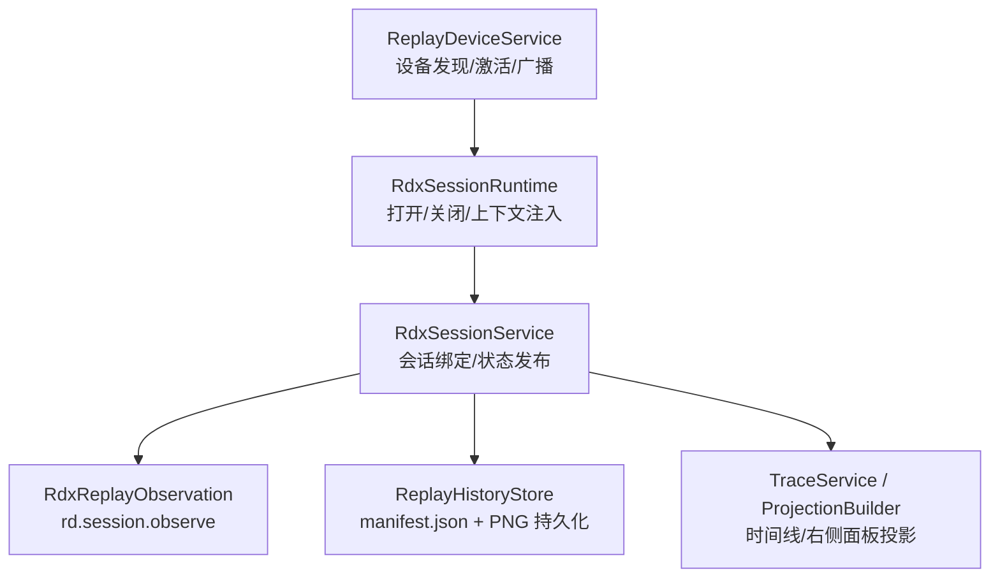
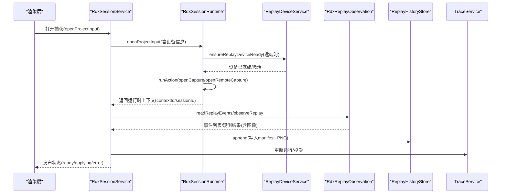
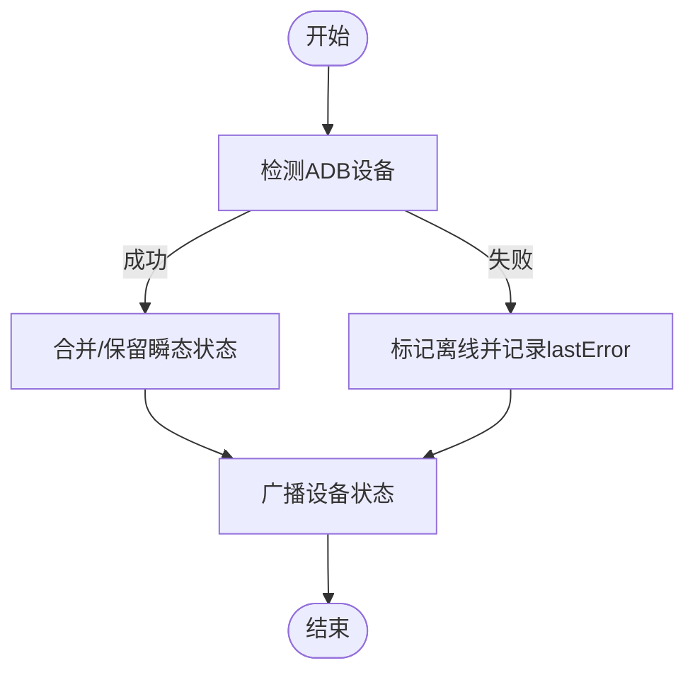
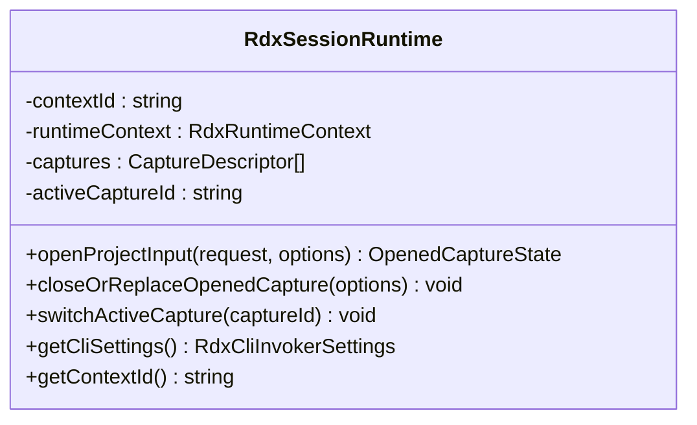
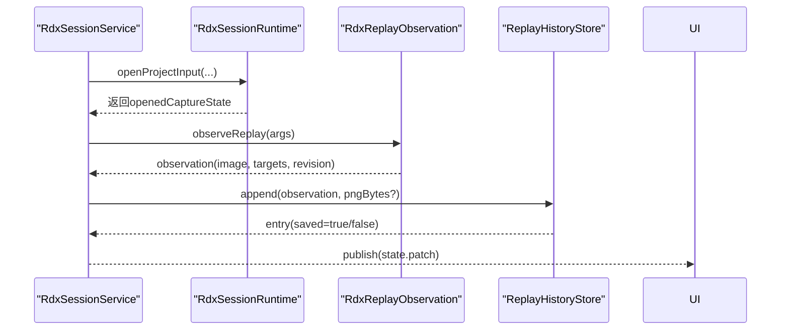
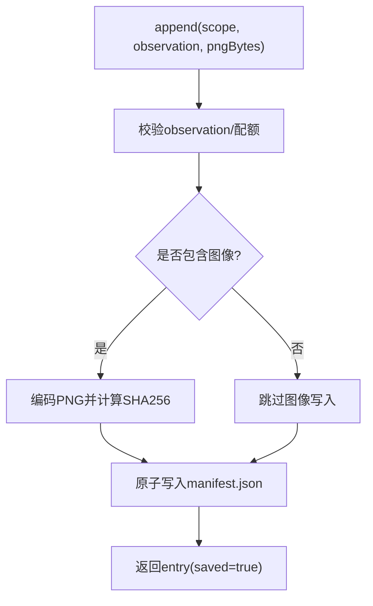
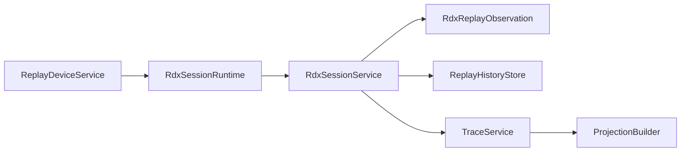

# 会话级回放系统

<cite>
**本文引用的文件**
- [README.md](file://README.md)
- [ReplayDeviceService.ts](file://src/main/captures/ReplayDeviceService.ts)
- [ReplayHistoryStore.ts](file://src/main/captures/replay/ReplayHistoryStore.ts)
- [replayStorageTypes.ts](file://src/main/captures/replay/replayStorageTypes.ts)
- [RdxSessionService.ts](file://src/main/sessions/RdxSessionService.ts)
- [RdxSessionRuntime.ts](file://src/main/sessions/RdxSessionRuntime.ts)
- [RdxReplayObservation.ts](file://src/main/sessions/RdxReplayObservation.ts)
- [TraceService.ts](file://src/main/agent-trace/TraceService.ts)
- [ProjectionBuilder.ts](file://src/main/agent-trace/ProjectionBuilder.ts)
</cite>

## 目录
1. [简介](#简介)
2. [项目结构](#项目结构)
3. [核心组件](#核心组件)
4. [架构总览](#架构总览)
5. [详细组件分析](#详细组件分析)
6. [依赖关系分析](#依赖关系分析)
7. [性能考虑](#性能考虑)
8. [故障排查指南](#故障排查指南)
9. [结论](#结论)
10. [附录](#附录)

## 简介
本文件面向“会话级回放系统”，聚焦 RDC-Agent 中围绕 RenderDoc 捕获（.rdc）的打开、设备连接、帧观察、历史回放与可审计投影等能力。系统以会话为边界，维护回放上下文、设备状态、事件流与持久化历史，并通过 IPC 向渲染层提供稳定状态投影，同时支持远程 Android 设备回放的激活与准备态管理。

## 项目结构
围绕回放的核心代码分布在以下模块：
- 设备与服务：captures/ReplayDeviceService.ts 负责本地与 Android 回放设备的发现、轮询、激活与状态广播。
- 会话服务：sessions/RdxSessionService.ts 维护每个会话的回放绑定、生命周期、事件应用与观察结果发布。
- 运行时：sessions/RdxSessionRuntime.ts 封装与外部 RDX CLI/Shell Action 的交互，处理本地/远端打开、关闭、上下文环境注入与错误诊断。
- 观察与事件：sessions/RdxReplayObservation.ts 通过 RDX CLI 调用 rd.session.observe 获取帧图像与元数据，并校验一致性。
- 历史存储：captures/replay/ReplayHistoryStore.ts 将回放观测写入按 session/capture 分区的 manifest.json，附带 PNG 图片与配额控制。
- 类型定义：captures/replay/replayStorageTypes.ts 定义历史条目、清单、选择项等数据结构。
- 追踪与投影：agent-trace/TraceService.ts 与 ProjectionBuilder.ts 将会话运行与工具执行转换为可审计的时间线与右侧面板投影。

**图示来源**
- [ReplayDeviceService.ts:61-686](file://src/main/captures/ReplayDeviceService.ts#L61-L686)
- [RdxSessionRuntime.ts:51-525](file://src/main/sessions/RdxSessionRuntime.ts#L51-L525)
- [RdxSessionService.ts:22-271](file://src/main/sessions/RdxSessionService.ts#L22-L271)
- [RdxReplayObservation.ts:12-88](file://src/main/sessions/RdxReplayObservation.ts#L12-L88)
- [ReplayHistoryStore.ts:12-265](file://src/main/captures/replay/ReplayHistoryStore.ts#L12-L265)
- [TraceService.ts:103-442](file://src/main/agent-trace/TraceService.ts#L103-L442)
- [ProjectionBuilder.ts:93-110](file://src/main/agent-trace/ProjectionBuilder.ts#L93-L110)

**章节来源**
- [README.md:1-90](file://README.md#L1-L90)

## 核心组件
- ReplayDeviceService：维护设备集合、轮询刷新、Android 设备激活、预准备远端上下文缓存、状态变更广播与恢复缓存。
- RdxSessionRuntime：封装 open/close 生命周期，注入 RDX 上下文环境变量，处理本地/远端打开差异与错误诊断。
- RdxSessionService：会话级编排，保证串行操作、互斥锁、设备占用、事件应用与观察结果的发布与持久化。
- RdxReplayObservation：调用 RDX CLI 的 observe/get_replay_events，严格校验返回结构与图像路径一致性。
- ReplayHistoryStore：按 session/capture 分区持久化 manifest.json 与 PNG，包含配额检查、原子写入、损坏恢复与清理。
- TraceService/ProjectionBuilder：聚合会话运行、对话与事件，构建时间线节点与右侧面板投影，供 UI 消费。

**章节来源**
- [ReplayDeviceService.ts:61-686](file://src/main/captures/ReplayDeviceService.ts#L61-L686)
- [RdxSessionRuntime.ts:51-525](file://src/main/sessions/RdxSessionRuntime.ts#L51-L525)
- [RdxSessionService.ts:22-271](file://src/main/sessions/RdxSessionService.ts#L22-L271)
- [RdxReplayObservation.ts:12-88](file://src/main/sessions/RdxReplayObservation.ts#L12-L88)
- [ReplayHistoryStore.ts:12-265](file://src/main/captures/replay/ReplayHistoryStore.ts#L12-L265)
- [TraceService.ts:103-442](file://src/main/agent-trace/TraceService.ts#L103-L442)
- [ProjectionBuilder.ts:93-110](file://src/main/agent-trace/ProjectionBuilder.ts#L93-L110)

## 架构总览
回放系统以“会话”为中心，串联设备、运行时、观察与存储，形成“打开→观察→应用→持久化→投影”的闭环。

**图示来源**
- [RdxSessionService.ts:83-131](file://src/main/sessions/RdxSessionService.ts#L83-L131)
- [RdxSessionRuntime.ts:65-211](file://src/main/sessions/RdxSessionRuntime.ts#L65-L211)
- [ReplayDeviceService.ts:214-278](file://src/main/captures/ReplayDeviceService.ts#L214-L278)
- [RdxReplayObservation.ts:21-88](file://src/main/sessions/RdxReplayObservation.ts#L21-L88)
- [ReplayHistoryStore.ts:47-87](file://src/main/captures/replay/ReplayHistoryStore.ts#L47-L87)
- [TraceService.ts:144-379](file://src/main/agent-trace/TraceService.ts#L144-L379)

## 详细组件分析

### ReplayDeviceService：设备发现、激活与状态广播
- 设备集合与轮询：维护本地与 Android 设备，周期性刷新，指数退避与手动刷新重置。
- 远端激活：通过 rdxShellActionService.runAction('connectRemote') 建立远端上下文，产出 remoteId/contextId，并缓存 PreparedRemoteSurface 用于后续快速打开。
- 状态广播：设备状态变化通过 rendererEventHub 与主窗口 webContents.send 推送，便于 UI 实时响应。
- 恢复缓存：持久化 lastDevice 到 workspace/common/config/device_resume.json，重启后装饰 bootstrap 信息。

**图示来源**
- [ReplayDeviceService.ts:354-444](file://src/main/captures/ReplayDeviceService.ts#L354-L444)
- [ReplayDeviceService.ts:604-681](file://src/main/captures/ReplayDeviceService.ts#L604-L681)

**章节来源**
- [ReplayDeviceService.ts:61-686](file://src/main/captures/ReplayDeviceService.ts#L61-L686)

### RdxSessionRuntime：会话运行时与上下文管理
- 打开流程：根据设备类型选择本地或远端 openCapture/openRemoteCapture，注入 RDX_CONTEXT_ID 等环境变量，解析返回的 runtimeContext。
- 远端准备：ensureReplayDeviceReady 复用/激活设备，必要时使用 preparedRemote 的 contextId/remoteId。
- 关闭流程：先调用 closeRuntime action，再尝试 daemon stop；若失败则保持所有权直至确认。
- 错误诊断：对本地不支持回放等场景进行诊断格式化，统一抛出可读错误。

**图示来源**
- [RdxSessionRuntime.ts:51-525](file://src/main/sessions/RdxSessionRuntime.ts#L51-L525)

**章节来源**
- [RdxSessionRuntime.ts:51-525](file://src/main/sessions/RdxSessionRuntime.ts#L51-L525)

### RdxSessionService：会话编排与状态发布
- 会话绑定：按 project/session 维度维护 binding，保证串行执行与互斥锁，避免并发冲突。
- 打开捕获：哈希输入文件、保存 selection、打开运行时、读取事件与最终输出、发布 ready。
- 事件应用：applyEventForSession/refreshFrameForSession 调用 observe，过滤过期请求，发布 applying/ready/error。
- 历史持久化：observeAgentOperation 将观测结果（含图像）追加至 ReplayHistoryStore，并在失败时发布 saveError。

**图示来源**
- [RdxSessionService.ts:83-131](file://src/main/sessions/RdxSessionService.ts#L83-L131)
- [RdxSessionService.ts:209-268](file://src/main/sessions/RdxSessionService.ts#L209-L268)
- [RdxReplayObservation.ts:29-88](file://src/main/sessions/RdxReplayObservation.ts#L29-L88)
- [ReplayHistoryStore.ts:47-87](file://src/main/captures/replay/ReplayHistoryStore.ts#L47-L87)

**章节来源**
- [RdxSessionService.ts:22-271](file://src/main/sessions/RdxSessionService.ts#L22-L271)

### ReplayHistoryStore：回放历史持久化
- 写入：append 校验 observation，可选编码 PNG，计算 imageSha256，原子写入 manifest.json 与图片，配额检查。
- 读取：list 分页读取 entries，readImage 校验 SHA256 一致性。
- 选择项：saveSelection/readSelection 管理当前选择的 inputId/captureSha256/deviceId。
- 恢复与清理：recover 清理未提交临时文件与孤立图片；clearCapture/clearSession 删除树并修剪空目录；reconcile* 与输入集对齐。

**图示来源**
- [ReplayHistoryStore.ts:47-87](file://src/main/captures/replay/ReplayHistoryStore.ts#L47-L87)
- [ReplayHistoryStore.ts:89-94](file://src/main/captures/replay/ReplayHistoryStore.ts#L89-L94)
- [ReplayHistoryStore.ts:118-145](file://src/main/captures/replay/ReplayHistoryStore.ts#L118-L145)
- [ReplayHistoryStore.ts:177-210](file://src/main/captures/replay/ReplayHistoryStore.ts#L177-L210)

**章节来源**
- [ReplayHistoryStore.ts:12-265](file://src/main/captures/replay/ReplayHistoryStore.ts#L12-L265)
- [replayStorageTypes.ts:1-53](file://src/main/captures/replay/replayStorageTypes.ts#L1-L53)

### RdxReplayObservation：观察与图像获取
- 调用方式：通过 rdxCliInvokerService.executeCLI('call', 'rd.session.observe'/'rd.session.get_replay_events') 与指定 daemon-context 通信。
- 校验：严格验证 event_id、revision、modification_state、display_parameters、target/targets、image_path 一致性。
- 图像：从临时目录读取 frame.png，限制最大边长，转为 dataURL 返回；若存在 image_error 则构造错误对象。

**章节来源**
- [RdxReplayObservation.ts:12-88](file://src/main/sessions/RdxReplayObservation.ts#L12-L88)

### TraceService 与 ProjectionBuilder：可审计投影
- TraceService：聚合会话运行、对话消息与动作事件，构建 AgentRun 与时间线节点，生成右侧面板投影。
- ProjectionBuilder：将 trace 节点映射为渲染器 key、标题、折叠策略与重要性，形成 TimelineProjection。

**章节来源**
- [TraceService.ts:103-442](file://src/main/agent-trace/TraceService.ts#L103-L442)
- [ProjectionBuilder.ts:22-110](file://src/main/agent-trace/ProjectionBuilder.ts#L22-L110)

## 依赖关系分析
- ReplayDeviceService 依赖：adb 可执行缓存、进程监督、IPC 事件中心、日志服务、解析与差异化比较工具。
- RdxSessionRuntime 依赖：设置服务、RDX CLI 调用、Shell Action 服务、会话上下文注册、设备服务。
- RdxSessionService 依赖：存储服务、历史存储、运行时、观察服务、操作协调器。
- ReplayHistoryStore 依赖：路径服务、安全写入、PNG 编解码、配额与树大小统计。
- TraceService 依赖：存储适配器、工作流状态、事件存储、投影构建器、右侧面板服务。

**图示来源**
- [ReplayDeviceService.ts:61-686](file://src/main/captures/ReplayDeviceService.ts#L61-L686)
- [RdxSessionRuntime.ts:51-525](file://src/main/sessions/RdxSessionRuntime.ts#L51-L525)
- [RdxSessionService.ts:22-271](file://src/main/sessions/RdxSessionService.ts#L22-L271)
- [RdxReplayObservation.ts:12-88](file://src/main/sessions/RdxReplayObservation.ts#L12-L88)
- [ReplayHistoryStore.ts:12-265](file://src/main/captures/replay/ReplayHistoryStore.ts#L12-L265)
- [TraceService.ts:103-442](file://src/main/agent-trace/TraceService.ts#L103-L442)
- [ProjectionBuilder.ts:93-110](file://src/main/agent-trace/ProjectionBuilder.ts#L93-L110)

**章节来源**
- [ReplayDeviceService.ts:61-686](file://src/main/captures/ReplayDeviceService.ts#L61-L686)
- [RdxSessionRuntime.ts:51-525](file://src/main/sessions/RdxSessionRuntime.ts#L51-L525)
- [RdxSessionService.ts:22-271](file://src/main/sessions/RdxSessionService.ts#L22-L271)
- [RdxReplayObservation.ts:12-88](file://src/main/sessions/RdxReplayObservation.ts#L12-L88)
- [ReplayHistoryStore.ts:12-265](file://src/main/captures/replay/ReplayHistoryStore.ts#L12-L265)
- [TraceService.ts:103-442](file://src/main/agent-trace/TraceService.ts#L103-L442)
- [ProjectionBuilder.ts:93-110](file://src/main/agent-trace/ProjectionBuilder.ts#L93-L110)

## 性能考虑
- 设备轮询：采用指数退避与最小间隔，减少频繁 adb 查询开销；手动刷新可重置退避。
- 图像尺寸：观察阶段对图像最大边进行缩放，降低内存与传输成本。
- 历史写入：使用原子写入与配额检查，避免大文件导致磁盘压力；按需编码 PNG 减少冗余。
- 并发控制：会话内串行执行与互斥锁，防止竞态导致的上下文不一致。

[本节为通用指导，不直接分析具体文件]

## 故障排查指南
- 设备不可用：检查 adb 可执行路径与服务器状态；查看设备 lastError 与 detailText；必要时触发 refreshDevices。
- 远端连接超时：activateDevice 有固定超时；关注 activationPhase 与 activationErrorMessage。
- 打开失败：RdxSessionRuntime 会格式化诊断信息；LOCAL_REPLAY_UNSUPPORTED 表示本地回放不受支持。
- 观察失败：RdxReplayObservation 会校验 metadata/image_path；错误码如 no_color_output/missing_target 决定重试策略。
- 历史写入失败：ReplayHistoryStore 在配额不足或写入异常时抛出错误；可通过 clearCapture/clearSession 释放空间。
- 上下文锁定：RdxSessionService 在 native 进程退出未确认或代理执行期间会阻止交互；需等待或停止相关会话。

**章节来源**
- [ReplayDeviceService.ts:457-507](file://src/main/captures/ReplayDeviceService.ts#L457-L507)
- [RdxSessionRuntime.ts:159-188](file://src/main/sessions/RdxSessionRuntime.ts#L159-L188)
- [RdxReplayObservation.ts:29-88](file://src/main/sessions/RdxReplayObservation.ts#L29-L88)
- [ReplayHistoryStore.ts:89-94](file://src/main/captures/replay/ReplayHistoryStore.ts#L89-L94)
- [RdxSessionService.ts:46-66](file://src/main/sessions/RdxSessionService.ts#L46-L66)

## 结论
会话级回放系统通过设备服务、会话服务、运行时与历史存储的协同，实现了稳定的 .rdc 打开、远端设备激活、帧观察与可审计的历史回放。其设计强调强校验、原子写入与资源配额，确保在复杂环境下仍能提供一致的状态投影与可靠的调试体验。

## 附录
- 关键类型参考：ReplayHistoryScope、ReplayObservation、ReplayManifest、ReplaySelection 等见 replayStorageTypes.ts。
- 典型调用路径：openProjectInput → observeReplay → append → publish state，详见各组件方法签名与注释。