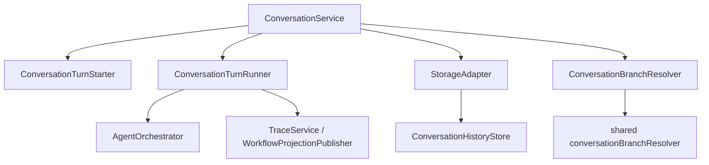
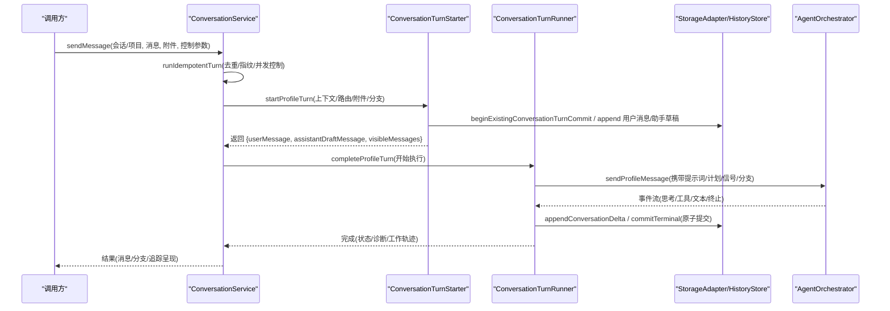
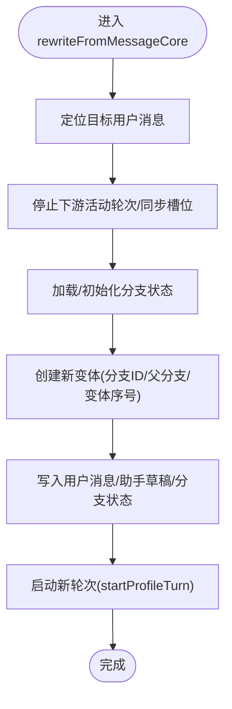
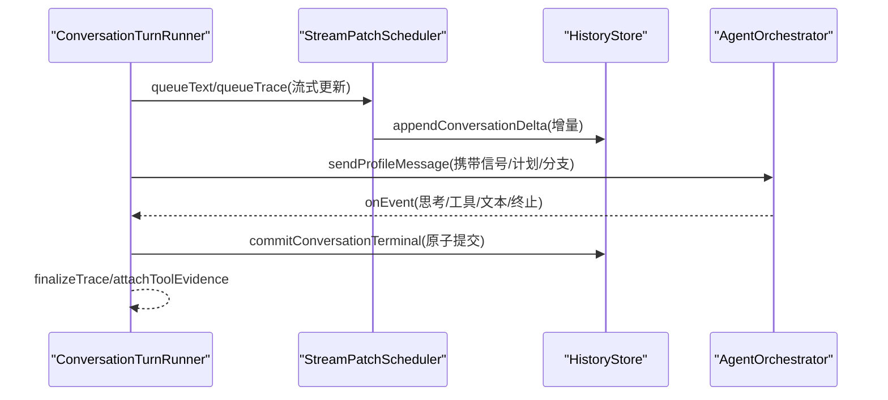
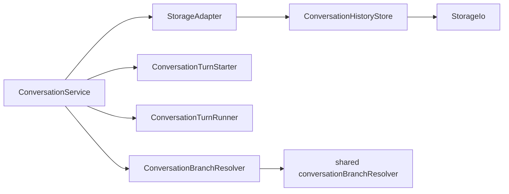

# 对话历史管理

<cite>
**本文引用的文件**
- [ConversationService.ts](file://src/main/conversation/ConversationService.ts)
- [ConversationTurnRunner.ts](file://src/main/conversation/ConversationTurnRunner.ts)
- [ConversationTurnStarter.ts](file://src/main/conversation/ConversationTurnStarter.ts)
- [ConversationBranchResolver.ts](file://src/main/conversation/ConversationBranchResolver.ts)
- [conversationBranchResolver.ts](file://src/shared/conversation/conversationBranchResolver.ts)
- [StorageAdapter.ts](file://src/main/sessions/StorageAdapter.ts)
- [ConversationHistoryStore.ts](file://src/main/sessions/ConversationHistoryStore.ts)
- [SessionBranchService.ts](file://src/main/sessions/SessionBranchService.ts)
- [conversationBranch.ts](file://src/shared/types/conversationBranch.ts)
- [conversation.ts](file://src/shared/types/conversation.ts)
</cite>

## 目录
1. [简介](#简介)
2. [项目结构](#项目结构)
3. [核心组件](#核心组件)
4. [架构总览](#架构总览)
5. [详细组件分析](#详细组件分析)
6. [依赖关系分析](#依赖关系分析)
7. [性能与大数据处理](#性能与大数据处理)
8. [故障排查指南](#故障排查指南)
9. [结论](#结论)
10. [附录：API 参考](#附录api-参考)

## 简介
本文件面向 RDC-Agent 主进程中的“对话历史管理”子系统，围绕 ConversationService 的对话消息存储、检索、更新机制，分支管理（创建、合并、切换、冲突解决），以及对话轮次（turn）的执行流程（用户输入处理、Agent 响应生成、工具调用集成）进行系统化说明。同时给出持久化策略、性能优化方案与大数据量处理机制，并提供完整的 API 参考，帮助实现自定义对话逻辑。

## 项目结构
对话历史管理由“服务层 + 运行器 + 启动器 + 存储层 + 分支解析”构成：
- 服务层：ConversationService 负责请求幂等、上下文解析、分支切换、历史读取/清理、后台续跑等编排。
- 运行器：completeProfileTurn 驱动 Agent 执行、流式输出、工作轨迹记录、终端提交。
- 启动器：startProfileTurn 负责预检、模型路由、附件规划、会话/轮次准备与落盘。
- 存储层：StorageAdapter 统一封装 Project/Session/Run/History/Context/Handoff 等存储；ConversationHistoryStore 提供 JSONL 追加、增量 delta、原子写入、压缩与恢复。
- 分支解析：conversationBranchResolver 提供可见消息路径计算、分支状态修复、导航能力。

图表来源
- [ConversationService.ts:78-109](file://src/main/conversation/ConversationService.ts#L78-L109)
- [ConversationTurnStarter.ts:68-105](file://src/main/conversation/ConversationTurnStarter.ts#L68-L105)
- [ConversationTurnRunner.ts:124-173](file://src/main/conversation/ConversationTurnRunner.ts#L124-L173)
- [StorageAdapter.ts:41-66](file://src/main/sessions/StorageAdapter.ts#L41-L66)
- [ConversationHistoryStore.ts:33-34](file://src/main/sessions/ConversationHistoryStore.ts#L33-L34)
- [ConversationBranchResolver.ts:1-16](file://src/main/conversation/ConversationBranchResolver.ts#L1-L16)
- [conversationBranchResolver.ts:1-25](file://src/shared/conversation/conversationBranchResolver.ts#L1-L25)

章节来源
- [ConversationService.ts:78-109](file://src/main/conversation/ConversationService.ts#L78-L109)
- [StorageAdapter.ts:41-66](file://src/main/sessions/StorageAdapter.ts#L41-L66)

## 核心组件
- ConversationService：对外暴露发送消息、重写消息、取消轮次、获取历史、切换分支等能力；内部维护活跃轮次、幂等缓存、后台续跑、交接操作。
- ConversationTurnStarter：完成 Agent/Provider 路由预检、模型选择、附件规划、会话/轮次准备、初始消息落盘与可见消息构建。
- ConversationTurnRunner：执行一轮对话，流式更新助手消息、收集工具调用与工作轨迹、最终提交并持久化。
- StorageAdapter/ConversationHistoryStore：以 JSONL 为基本载体，支持增量 delta、原子写入、压缩、崩溃恢复、附件清单管理。
- BranchResolver：基于 branchId/forkId/variantIndex 计算可见消息路径，修复不一致的分支状态，提供导航能力。

章节来源
- [ConversationService.ts:128-174](file://src/main/conversation/ConversationService.ts#L128-L174)
- [ConversationTurnStarter.ts:345-503](file://src/main/conversation/ConversationTurnStarter.ts#L345-L503)
- [ConversationTurnRunner.ts:174-236](file://src/main/conversation/ConversationTurnRunner.ts#L174-L236)
- [ConversationHistoryStore.ts:230-323](file://src/main/sessions/ConversationHistoryStore.ts#L230-L323)
- [conversationBranchResolver.ts:91-160](file://src/shared/conversation/conversationBranchResolver.ts#L91-L160)

## 架构总览
下图展示一次“发送消息”到“轮次完成”的关键交互：

图表来源
- [ConversationService.ts:545-569](file://src/main/conversation/ConversationService.ts#L545-L569)
- [ConversationTurnStarter.ts:345-503](file://src/main/conversation/ConversationTurnStarter.ts#L345-L503)
- [ConversationTurnRunner.ts:464-518](file://src/main/conversation/ConversationTurnRunner.ts#L464-L518)
- [ConversationHistoryStore.ts:168-228](file://src/main/sessions/ConversationHistoryStore.ts#L168-L228)

## 详细组件分析

### ConversationService：消息存储、检索、更新与分支切换
- 历史读取：getHistory 从存储读取全部消息，修复委托交互请求，并返回当前分支状态。
- 历史清空：clearHistory 停止活动轮次、清空历史与上下文、发布空追踪。
- 撤销最后一轮：undoLastTurn 定位最后一个用户消息，删除其 turnId 关联的消息与上下文条目。
- 取消活动轮次：cancelActiveTurn 支持按 requestId/sessionId/turnId 精准取消，处理 preparing/running 阶段，并清理后台任务。
- 幂等执行：runIdempotentTurn 通过 scopeKey/idempotencyKey/requestFingerprint 保证同一请求不重复执行，支持已持久化结果复用。
- 重写消息：rewriteFromMessageCore 在目标用户消息处分叉，停止下游活动轮次，重建分支状态并发起新变体。
- 分支切换：switchConversationBranch 中止活动轮次，同步槽位，更新 activeLeafBranchId，重新计算可见消息并发布追踪。

章节来源
- [ConversationService.ts:128-174](file://src/main/conversation/ConversationService.ts#L128-L174)
- [ConversationService.ts:176-231](file://src/main/conversation/ConversationService.ts#L176-L231)
- [ConversationService.ts:445-543](file://src/main/conversation/ConversationService.ts#L445-L543)
- [ConversationService.ts:571-702](file://src/main/conversation/ConversationService.ts#L571-L702)
- [ConversationService.ts:704-741](file://src/main/conversation/ConversationService.ts#L704-L741)

### 消息类型、格式与索引策略
- 消息类型：role 支持 user/assistant/system；status 支持 draft/streaming/complete/error/stopped。
- 关键字段：id、turnId、sessionId、projectId、runId、profileId、content、createdAt/updatedAt、workTrace、diagnostic、attachments、branchId/forkId/variantIndex、preparedContext。
- 索引策略：
  - 物理存储：conversation.jsonl 顺序追加，按 createdAt 排序；delta 记录用于增量更新。
  - 内存缓存：按 sessionId 缓存消息列表与原始记录数，避免重复重建。
  - 分支可见性：通过 branchId/forkId/variantIndex 计算可见路径，resolveVisibleConversationMessages 沿 active fork 递归拼接。
  - 附件清单：attachments.json 记录会话级附件元数据，支持导入/回滚。

章节来源
- [conversation.ts:219-247](file://src/shared/types/conversation.ts#L219-L247)
- [ConversationHistoryStore.ts:230-323](file://src/main/sessions/ConversationHistoryStore.ts#L230-L323)
- [conversationBranchResolver.ts:91-160](file://src/shared/conversation/conversationBranchResolver.ts#L91-L160)

### 分支管理：创建、合并、切换与冲突解决
- 分支数据结构：ConversationBranchState 包含 rootBranchId、activeLeafBranchId、forks；每个 fork 有 anchorMessageId、activeBranchId、branches 列表。
- 创建分支：rewriteFromMessageCore 在目标用户消息处创建新分支，设置 parentBranchId、variantIndex、anchorUserMessageId。
- 切换分支：switchConversationBranch 更新 activeBranchId 与 activeLeafBranchId，重新计算可见消息并发布追踪。
- 冲突与修复：repairConversationBranchState 根据消息重建缺失的 anchorUserMessageId/rootTurnId；findForkForVisibleUserMessage 确保仅在当前可见 fork 上导航。
- 会话级分支：SessionBranchService.createBranch 复制源会话消息到新会话，形成独立分支会话（不同于同会话内多分支）。

图表来源
- [ConversationService.ts:579-702](file://src/main/conversation/ConversationService.ts#L579-L702)
- [conversationBranchResolver.ts:31-64](file://src/shared/conversation/conversationBranchResolver.ts#L31-L64)
- [SessionBranchService.ts:19-36](file://src/main/sessions/SessionBranchService.ts#L19-L36)

章节来源
- [conversationBranch.ts:1-44](file://src/shared/types/conversationBranch.ts#L1-L44)
- [conversationBranchResolver.ts:31-64](file://src/shared/conversation/conversationBranchResolver.ts#L31-L64)
- [ConversationService.ts:579-702](file://src/main/conversation/ConversationService.ts#L579-L702)
- [SessionBranchService.ts:19-36](file://src/main/sessions/SessionBranchService.ts#L19-L36)

### 对话轮次（turn）执行流程：用户输入、Agent 响应、工具调用
- 启动阶段（startProfileTurn）：
  - 解析 Agent/Provider/Model 路由，校验配置快照一致性。
  - 规划附件（planAttachmentsForTurn），准备用户输入（materializeAgentUserInput）。
  - 准备提示词与轮次上下文（prepareTurnContext），创建用户消息与助手草稿消息，写入会话历史。
  - 若存在待移交（handoff），自动注入上下文并消费移交。
- 执行阶段（completeProfileRunner）：
  - 注册活动轮次，创建流式补丁调度器（ConversationStreamPatchScheduler）。
  - 调用 AgentOrchestrator.sendProfileMessage，接收事件流（思考、工具、文本、终止）。
  - 将流式内容、工作轨迹、工具证据逐步持久化并发布追踪。
  - 终止时提交终端上下文（commitConversationTerminal），更新运行状态，释放资源。
- 错误与中断：
  - 支持用户停止、超时、模型不可用、协议违规、任务限制等错误码。
  - 异常路径下仍会尽力持久化并通知 UI。

图表来源
- [ConversationTurnRunner.ts:174-236](file://src/main/conversation/ConversationTurnRunner.ts#L174-L236)
- [ConversationTurnRunner.ts:464-518](file://src/main/conversation/ConversationTurnRunner.ts#L464-L518)
- [ConversationHistoryStore.ts:168-228](file://src/main/sessions/ConversationHistoryStore.ts#L168-L228)

章节来源
- [ConversationTurnStarter.ts:68-105](file://src/main/conversation/ConversationTurnStarter.ts#L68-L105)
- [ConversationTurnStarter.ts:345-503](file://src/main/conversation/ConversationTurnStarter.ts#L345-L503)
- [ConversationTurnRunner.ts:124-173](file://src/main/conversation/ConversationTurnRunner.ts#L124-L173)
- [ConversationTurnRunner.ts:464-518](file://src/main/conversation/ConversationTurnRunner.ts#L464-L518)

### 持久化策略与事务性
- JSONL 追加：appendConversationMessage 追加完整消息或增量 delta；appendConversationDelta 仅追加差异字段。
- 原子写入：writeJsonlAtomic/writeJsonAtomic 保证文件写入原子性，避免损坏。
- 压缩：当增量数量达到阈值时触发 compactConversationHistory，将消息序列化为紧凑形式。
- 崩溃恢复：recoverSessionTurnCommit/recoverSessionTerminalCommit 检查未完成日志，决定回滚或前滚。
- 终端提交：commitConversationTerminal 使用 before/after 快照，确保历史、分支、上下文三者一致。

章节来源
- [ConversationHistoryStore.ts:230-323](file://src/main/sessions/ConversationHistoryStore.ts#L230-L323)
- [ConversationHistoryStore.ts:565-657](file://src/main/sessions/ConversationHistoryStore.ts#L565-L657)

### 性能优化与大数据量处理
- 内存缓存：按 sessionId 缓存消息列表与原始记录数，减少重建成本。
- 增量更新：delta 记录减少大对象序列化开销，仅在必要时全量压缩。
- 流式批处理：ConversationStreamPatchScheduler 聚合多次更新，降低 IO 频率。
- 附件处理：stageAttachmentInputs 将附件复制到临时目录，避免并发冲突；附件清单集中管理。
- 分支可见性：仅计算当前 active fork 路径，避免全树遍历。

章节来源
- [ConversationHistoryStore.ts:448-523](file://src/main/sessions/ConversationHistoryStore.ts#L448-L523)
- [ConversationHistoryStore.ts:317-323](file://src/main/sessions/ConversationHistoryStore.ts#L317-L323)
- [ConversationHistoryStore.ts:742-766](file://src/main/sessions/ConversationHistoryStore.ts#L742-L766)
- [conversationBranchResolver.ts:91-160](file://src/shared/conversation/conversationBranchResolver.ts#L91-L160)

## 依赖关系分析
- ConversationService 依赖：
  - StorageAdapter：读写会话、历史、分支、上下文、运行记录。
  - ConversationTurnStarter/Runner：启动与执行轮次。
  - BranchResolver：分支可见性与修复。
  - TraceService/WorkflowProjectionPublisher：追踪与投影发布。
- ConversationHistoryStore 依赖：
  - StorageIo：JSONL/JSON 原子读写。
  - SessionRecordStore/ProjectWorkspaceStore：会话与项目元数据。
- 分支解析依赖 shared 模块，保证主渲染端一致性。

图表来源
- [ConversationService.ts:78-109](file://src/main/conversation/ConversationService.ts#L78-L109)
- [StorageAdapter.ts:41-66](file://src/main/sessions/StorageAdapter.ts#L41-L66)
- [ConversationHistoryStore.ts:33-34](file://src/main/sessions/ConversationHistoryStore.ts#L33-L34)
- [ConversationBranchResolver.ts:1-16](file://src/main/conversation/ConversationBranchResolver.ts#L1-L16)
- [conversationBranchResolver.ts:1-25](file://src/shared/conversation/conversationBranchResolver.ts#L1-L25)

章节来源
- [ConversationService.ts:78-109](file://src/main/conversation/ConversationService.ts#L78-L109)
- [StorageAdapter.ts:41-66](file://src/main/sessions/StorageAdapter.ts#L41-L66)

## 性能与大数据处理
- 建议：
  - 合理设置压缩阈值，避免频繁压缩影响实时性。
  - 对超大会话启用定期压缩与归档策略。
  - 使用分支功能隔离长对话的不同探索路径，减少单分支长度。
  - 利用幂等键与指纹避免重复执行，降低负载。
  - 附件批量 stage 与清单管理，避免磁盘碎片。
- 监控：
  - 关注 pending delta 计数与压缩触发次数。
  - 追踪终端提交失败率与恢复成功率。
  - 观察分支切换时的可见消息计算耗时。

[本节为通用指导，无需具体文件引用]

## 故障排查指南
- 常见问题：
  - 请求冲突：REQUEST_ID_CONFLICT 表示 requestId 已被不同请求占用，检查客户端幂等键生成。
  - 模型不可用：MODEL_UNAVAILABLE/PROVIDER_UNAVAILABLE 检查路由与配置快照一致性。
  - 终端提交失败：CONVERSATION_LLM_REQUEST_FAILED 检查磁盘权限与原子写入。
  - 分支状态不一致：repairConversationBranchState 自动修复，若仍异常检查消息 branchId/forkId/variantIndex。
- 调试步骤：
  - 查看会话目录下的 turn-commit.json/terminal-commit.json 日志。
  - 检查 conversation.jsonl 是否完整，是否存在损坏记录。
  - 确认附件清单 attachments.json 与实际文件一致。
  - 使用 getHistory 与 switchConversationBranch 验证可见消息路径。

章节来源
- [ConversationService.ts:445-543](file://src/main/conversation/ConversationService.ts#L445-L543)
- [ConversationTurnRunner.ts:532-554](file://src/main/conversation/ConversationTurnRunner.ts#L532-L554)
- [ConversationHistoryStore.ts:565-657](file://src/main/sessions/ConversationHistoryStore.ts#L565-L657)

## 结论
ConversationService 通过幂等执行、分支管理与原子持久化，提供了稳健的对话历史管理能力。结合 ConversationTurnStarter/Runner 的完整生命周期与 ConversationHistoryStore 的高性能存储，系统能够支撑大规模对话场景。分支解析确保可见消息路径正确，配合追踪与投影发布，为上层 UI 提供一致视图。

[本节为总结，无需具体文件引用]

## 附录：API 参考
以下列出与对话历史管理相关的主要 API 及其职责（以方法名与关键参数为主，不包含代码片段）：

- ConversationService
  - sendMessage(input): 发送消息，返回轮次结果（含用户消息、助手草稿、可见消息、分支状态）。
  - rewriteFromMessage(input): 从指定用户消息重写并分叉，返回新变体的轮次结果。
  - cancelActiveTurn(request): 取消活动轮次，支持按 requestId/sessionId/turnId。
  - getHistory(sessionId): 读取会话历史与分支状态。
  - clearHistory(sessionId): 清空历史与上下文。
  - undoLastTurn(sessionId): 撤销最后一轮。
  - switchConversationBranch(input): 切换分支，返回可见消息与分支状态。

- ConversationTurnStarter
  - startProfileTurn(host, onComplete, context, profileId, agentId, message, attachments, preloadSkillIds, branchContext, turnControls, requestId, preparationController, configurationCommit, requestFingerprint, excludeTurnId, policyBudget): 准备并启动轮次，持久化初始消息与分支状态。

- ConversationTurnRunner
  - completeProfileTurn(host, input): 执行轮次，处理流式事件，提交终端上下文。

- StorageAdapter
  - readConversationHistory(sessionId): 读取历史。
  - appendConversationMessage(sessionId, message): 追加消息。
  - appendConversationDelta(sessionId, messageId, patch): 增量更新。
  - writeConversationHistory(sessionId, messages): 覆盖写入。
  - compactConversationHistory(sessionId): 压缩历史。
  - readConversationBranchState(sessionId)/writeConversationBranchState(sessionId, state): 读写分支状态。
  - commitConversationTerminal(sessionId, requestId, turnId, assistantMessage, contextEntry): 提交终端上下文。

- ConversationHistoryStore
  - beginExistingConversationTurnCommit(...)/commitExistingConversationTurn(...)/rollbackExistingConversationTurn(...): 轮次提交事务。
  - recoverSessionTurnCommit(sessionId)/recoverSessionTerminalCommit(sessionId): 崩溃恢复。
  - planAttachmentsForTurn(...)/copyAttachmentsForTurn(...)/stageAttachmentInputs(...): 附件规划与暂存。

- BranchResolver (shared)
  - createDefaultBranchState(sessionId): 创建默认分支状态。
  - resolveVisibleConversationMessages(allMessages, branchState): 计算可见消息路径。
  - repairConversationBranchState(allMessages, branchState): 修复分支状态。
  - findForkForMessage/findForkForVisibleUserMessage/getForkNavigator/shouldShowForkNavigatorForMessage: 分支导航辅助。

章节来源
- [ConversationService.ts:128-174](file://src/main/conversation/ConversationService.ts#L128-L174)
- [ConversationService.ts:545-741](file://src/main/conversation/ConversationService.ts#L545-L741)
- [ConversationTurnStarter.ts:68-105](file://src/main/conversation/ConversationTurnStarter.ts#L68-L105)
- [ConversationTurnStarter.ts:345-503](file://src/main/conversation/ConversationTurnStarter.ts#L345-L503)
- [ConversationTurnRunner.ts:124-173](file://src/main/conversation/ConversationTurnRunner.ts#L124-L173)
- [StorageAdapter.ts:369-406](file://src/main/sessions/StorageAdapter.ts#L369-L406)
- [ConversationHistoryStore.ts:36-121](file://src/main/sessions/ConversationHistoryStore.ts#L36-L121)
- [ConversationHistoryStore.ts:168-228](file://src/main/sessions/ConversationHistoryStore.ts#L168-L228)
- [ConversationHistoryStore.ts:565-657](file://src/main/sessions/ConversationHistoryStore.ts#L565-L657)
- [conversationBranchResolver.ts:18-29](file://src/shared/conversation/conversationBranchResolver.ts#L18-L29)
- [conversationBranchResolver.ts:91-160](file://src/shared/conversation/conversationBranchResolver.ts#L91-L160)
- [conversationBranchResolver.ts:162-230](file://src/shared/conversation/conversationBranchResolver.ts#L162-L230)