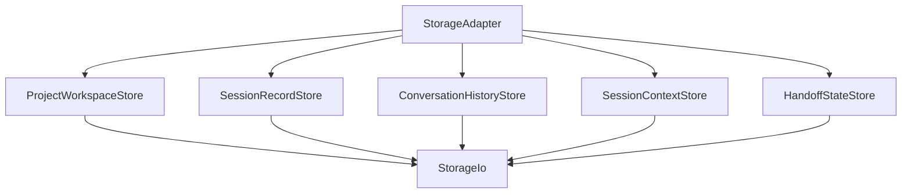
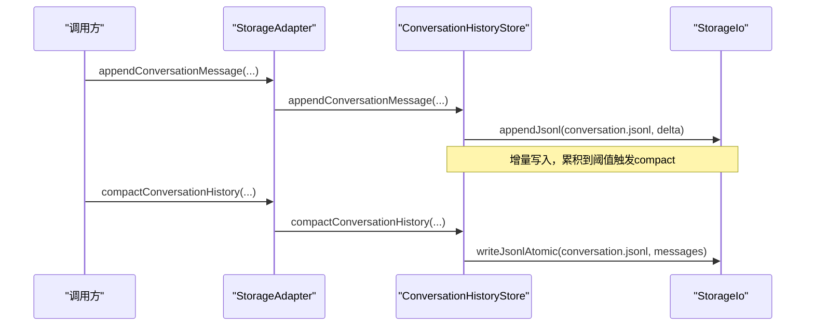
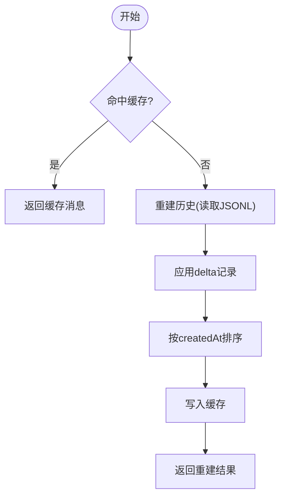
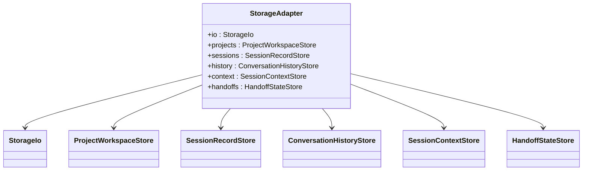

# 数据持久化

<cite>
**本文引用的文件**
- [StorageAdapter.ts](file://src/main/sessions/StorageAdapter.ts)
- [StorageIo.ts](file://src/main/sessions/StorageIo.ts)
- [storageSchema.ts](file://src/main/sessions/storageSchema.ts)
- [ProjectWorkspaceStore.ts](file://src/main/sessions/ProjectWorkspaceStore.ts)
- [SessionRecordStore.ts](file://src/main/sessions/SessionRecordStore.ts)
- [ConversationHistoryStore.ts](file://src/main/sessions/ConversationHistoryStore.ts)
- [SessionContextStore.ts](file://src/main/sessions/SessionContextStore.ts)
- [HandoffStateStore.ts](file://src/main/sessions/HandoffStateStore.ts)
- [storageTypes.ts](file://src/main/sessions/storageTypes.ts)
- [storageCommitTypes.ts](file://src/main/sessions/storageCommitTypes.ts)
</cite>

## 目录
1. [简介](#简介)
2. [项目结构](#项目结构)
3. [核心组件](#核心组件)
4. [架构总览](#架构总览)
5. [详细组件分析](#详细组件分析)
6. [依赖关系分析](#依赖关系分析)
7. [性能考虑](#性能考虑)
8. [故障排除指南](#故障排除指南)
9. [结论](#结论)
10. [附录：配置与调优](#附录：配置与调优)

## 简介
本文件面向 RDC-Agent 的“数据持久化”子系统，聚焦 StorageAdapter 及其协作的存储层设计。该层统一了文件系统、内存缓存与数据库式事务语义（通过日志与暂存区）的接口，提供会话、项目、运行记录、对话历史、上下文、附件与交接状态等数据的持久化能力。文档涵盖：
- 存储抽象层设计与统一接口
- 会话数据的序列化格式、版本迁移策略与数据完整性保证
- 性能优化方案（批量操作、增量同步、压缩存储）
- 错误处理、恢复机制与备份策略
- 配置选项、性能调优与故障排除
- 高效读写实践

## 项目结构
存储子系统位于 src/main/sessions，采用“适配器 + 专用 Store”的分层组织：
- StorageAdapter：对外暴露的统一入口，聚合各 Store 的能力，并维护进程内缓存与锁集合
- StorageIo：共享的文件系统 I/O 工具，提供原子写入、JSON/YAML 解析、损坏隔离与深合并
- 专用 Store：
  - ProjectWorkspaceStore：项目注册表、选择态、资源布局与输入扫描
  - SessionRecordStore：会话、运行记录、附件清单、动作链
  - ConversationHistoryStore：对话历史、分支状态、增量补丁、提交日志
  - SessionContextStore：会话上下文日志、使用量快照、Shell 工作目录
  - HandoffStateStore：跨 Agent 交接状态机与生命周期
- 类型与迁移：
  - storageTypes.ts：运行时类型定义
  - storageSchema.ts：Zod 模式、迁移管线、当前版本常量
  - storageCommitTypes.ts：提交日志与增量记录的结构

图表来源
- [StorageAdapter.ts:41-66](file://src/main/sessions/StorageAdapter.ts#L41-L66)
- [ProjectWorkspaceStore.ts:12-33](file://src/main/sessions/ProjectWorkspaceStore.ts#L12-L33)
- [SessionRecordStore.ts:40-41](file://src/main/sessions/SessionRecordStore.ts#L40-L41)
- [ConversationHistoryStore.ts:33-34](file://src/main/sessions/ConversationHistoryStore.ts#L33-L34)
- [SessionContextStore.ts:14-15](file://src/main/sessions/SessionContextStore.ts#L14-L15)
- [HandoffStateStore.ts:42-51](file://src/main/sessions/HandoffStateStore.ts#L42-L51)

章节来源
- [StorageAdapter.ts:41-66](file://src/main/sessions/StorageAdapter.ts#L41-L66)
- [storageTypes.ts:1-30](file://src/main/sessions/storageTypes.ts#L1-L30)

## 核心组件
- StorageAdapter：统一入口，封装路径初始化、项目/会话/运行/对话/上下文/交接等操作的委派；维护 turn/terminal 提交会话集与对话历史缓存
- StorageIo：原子写（临时文件+rename）、可选 fsync、JSON/YAML 读取校验、损坏文件隔离（.corrupt）、深合并
- 各 Store：按领域职责拆分，复用 StorageIo 与 schema 迁移，确保一致性

章节来源
- [StorageAdapter.ts:41-447](file://src/main/sessions/StorageAdapter.ts#L41-L447)
- [StorageIo.ts:20-335](file://src/main/sessions/StorageIo.ts#L20-L335)

## 架构总览
存储层以“原子写入 + 提交日志 + 暂存区”为核心，实现强一致性与可恢复性：
- 原子写入：所有 JSON/JSONL/二进制均通过临时文件 + rename 落盘，失败时回滚或保留 .bak/.tmp
- 提交日志：对话转轮/终端提交使用 prepared -> committing -> committed 三阶段日志，崩溃后可恢复
- 暂存区：新建会话或转轮前在 staging 目录准备数据，成功后原子重命名为最终路径
- 版本迁移：读取时根据 schemaVersion 执行迁移管线，未知或更高版本拒绝加载
- 损坏隔离：解析失败将原文件移动到 .corrupt 时间戳命名，避免污染主数据

图表来源
- [ConversationHistoryStore.ts:242-323](file://src/main/sessions/ConversationHistoryStore.ts#L242-L323)
- [StorageIo.ts:295-304](file://src/main/sessions/StorageIo.ts#L295-L304)

章节来源
- [ConversationHistoryStore.ts:230-323](file://src/main/sessions/ConversationHistoryStore.ts#L230-L323)
- [StorageIo.ts:172-304](file://src/main/sessions/StorageIo.ts#L172-L304)

## 详细组件分析

### StorageAdapter：统一存储接口
- 职责：
  - 管理 workspace 路径、项目/会话/运行/对话/上下文/交接等子域
  - 维护进程内状态：turn/terminal 提交会话集、对话历史缓存、增量计数
  - 暴露高层 API：创建/更新/删除项目与会话、导入附件、追加消息、压缩历史、读取/更新运行记录等
- 关键特性：
  - 会话读取时自动 hydrate 交接状态并通知资源解析器
  - 统一的 path 访问方法，屏蔽底层存储细节

章节来源
- [StorageAdapter.ts:41-447](file://src/main/sessions/StorageAdapter.ts#L41-L447)

### StorageIo：原子 I/O 与解析
- 原子写入：
  - writeUtf8Atomic/writeBytesAtomic：先写临时文件，再 rename 为目标；Windows 下使用 .bak.tmp 安全交换
  - 可选 fsync 保障持久化
- 解析与校验：
  - readJson/readYaml：支持 Zod 或迁移管线；不支持的版本直接抛错
  - 解析失败：尝试从 .bak 恢复；否则隔离为 .corrupt.<timestamp>
- 辅助：
  - deepMerge：安全深合并，过滤危险键
  - ensureDir：确保目录存在

章节来源
- [StorageIo.ts:20-335](file://src/main/sessions/StorageIo.ts#L20-L335)

### 项目与工作空间：ProjectWorkspaceStore
- 功能：
  - 初始化 workspace、注册表与选择态
  - 项目 CRUD、输入扫描（限制深度与条目数，周期性 yield）
  - 元数据持久化与 slug 唯一性
- 并发与一致性：
  - 注册表读写加目录级文件锁，避免竞态
- 路径：
  - 通过 appPathService 计算运行时路径，保持多实例隔离

章节来源
- [ProjectWorkspaceStore.ts:25-33](file://src/main/sessions/ProjectWorkspaceStore.ts#L25-L33)
- [ProjectWorkspaceStore.ts:41-82](file://src/main/sessions/ProjectWorkspaceStore.ts#L41-L82)
- [ProjectWorkspaceStore.ts:216-300](file://src/main/sessions/ProjectWorkspaceStore.ts#L216-L300)
- [ProjectWorkspaceStore.ts:444-490](file://src/main/sessions/ProjectWorkspaceStore.ts#L444-L490)

### 会话与运行：SessionRecordStore
- 会话：
  - 创建会话目录结构（attachments/timeline/runs），初始化 conversation.jsonl、action_chain.jsonl、attachments.json
  - 支持 staged session 的 allocate/begin/commit/rollback
- 运行记录：
  - createRun/updateRun 使用 V3 持久化结构，限制可更新字段，合并 runtime 信息
  - listRuns/getLatestRun 基于 runs 目录枚举与摘要转换
- 附件与事件：
  - 获取附件目录与清单路径
  - 追加/读取 action_chain.jsonl（JSONL 流式）

章节来源
- [SessionRecordStore.ts:111-149](file://src/main/sessions/SessionRecordStore.ts#L111-L149)
- [SessionRecordStore.ts:151-266](file://src/main/sessions/SessionRecordStore.ts#L151-L266)
- [SessionRecordStore.ts:401-476](file://src/main/sessions/SessionRecordStore.ts#L401-L476)
- [SessionRecordStore.ts:573-583](file://src/main/sessions/SessionRecordStore.ts#L573-L583)

### 对话历史：ConversationHistoryStore
- 增量写入：
  - appendConversationMessage：若消息已存在则生成 delta 记录；达到阈值后触发 compact
  - appendConversationDelta：显式增量更新
- 压缩：
  - compactConversationHistory：将历史重建为完整消息列表并原子写回
- 提交日志：
  - beginExistingConversationTurnCommit/commitExistingConversationTurn/rollbackExistingConversationTurn
  - commitConversationTerminal：带 before/after 快照的三阶段提交
- 恢复：
  - recoverConversationTurnCommits：启动时遍历会话，对未完成提交进行回滚或前滚
- 缓存：
  - 进程内缓存会话消息，按 mtime/size 失效；避免重复读取

图表来源
- [ConversationHistoryStore.ts:230-240](file://src/main/sessions/ConversationHistoryStore.ts#L230-L240)
- [ConversationHistoryStore.ts:402-446](file://src/main/sessions/ConversationHistoryStore.ts#L402-L446)
- [ConversationHistoryStore.ts:448-491](file://src/main/sessions/ConversationHistoryStore.ts#L448-L491)

章节来源
- [ConversationHistoryStore.ts:36-121](file://src/main/sessions/ConversationHistoryStore.ts#L36-L121)
- [ConversationHistoryStore.ts:230-323](file://src/main/sessions/ConversationHistoryStore.ts#L230-L323)
- [ConversationHistoryStore.ts:565-657](file://src/main/sessions/ConversationHistoryStore.ts#L565-L657)

### 上下文与使用量：SessionContextStore
- 会话使用量快照：
  - 读/写 usage.json，支持多版本迁移（v0/v1/v2）
- Shell 状态：
  - 读/写 shell-state.json（cwd）
- 上下文日志：
  - 追加/读取 session-context.jsonl（JSONL）

章节来源
- [SessionContextStore.ts:17-93](file://src/main/sessions/SessionContextStore.ts#L17-L93)

### 交接状态：HandoffStateStore
- 状态机：prepared -> committed -> consumed/cancelled
- 生命周期：
  - prepare/createPreparedDraft：内存预留与持久化
  - commit/consume/cancel：状态转换与历史记录追加
  - hydrate：重启时识别活跃状态，非本进程创建的 prepared/committed 降级为 cancelled
- 并发保护：
  - liveHandoffIds 与 draftReservations 防止冲突

章节来源
- [HandoffStateStore.ts:105-240](file://src/main/sessions/HandoffStateStore.ts#L105-L240)

### 序列化格式与版本迁移
- 项目注册表：schemaVersion '1'，迁移管线 PROJECT_REGISTRY_MIGRATIONS
- 会话记录：SessionRecordSchema
- 对话提交日志：CONVERSATION_TURN_COMMIT_MIGRATIONS / CONVERSATION_TERMINAL_COMMIT_MIGRATIONS
- 附件清单：支持旧版裸数组与新版 { schemaVersion, attachments } 的兼容解析
- 会话使用量：SESSION_USAGE_MIGRATIONS（v0->v1->v2），CURRENT_USAGE_SCHEMA_VERSION='2'
- Shell 状态：SESSION_SHELL_STATE_MIGRATIONS，CURRENT_SHELL_STATE_SCHEMA_VERSION='1'
- 运行记录：V3 持久化结构（由 runV3/runRecordSchema 导出）

章节来源
- [storageSchema.ts:16-99](file://src/main/sessions/storageSchema.ts#L16-L99)
- [storageSchema.ts:126-133](file://src/main/sessions/storageSchema.ts#L126-L133)
- [storageSchema.ts:140-194](file://src/main/sessions/storageSchema.ts#L140-L194)
- [storageSchema.ts:196-236](file://src/main/sessions/storageSchema.ts#L196-L236)
- [storageSchema.ts:284-379](file://src/main/sessions/storageSchema.ts#L284-L379)
- [storageSchema.ts:381-408](file://src/main/sessions/storageSchema.ts#L381-L408)
- [storageTypes.ts:13-23](file://src/main/sessions/storageTypes.ts#L13-L23)

### 数据完整性与一致性
- 原子写入：所有 JSON/JSONL/二进制均通过临时文件 + rename，失败时清理或保留 .bak/.tmp
- 损坏隔离：解析失败将原文件移动至 .corrupt.<timestamp>，并抛出明确错误
- 提交日志：对话转轮/终端提交使用三阶段日志，崩溃后启动时恢复
- 暂存区：会话/附件在 staging 目录准备，成功后原子重命名
- 校验：Zod safeParse 与迁移管线，拒绝未知或更高版本
- 并发：注册表目录级文件锁；会话侧通道清理（任务/LLM调用/trace）

章节来源
- [StorageIo.ts:27-71](file://src/main/sessions/StorageIo.ts#L27-L71)
- [StorageIo.ts:155-170](file://src/main/sessions/StorageIo.ts#L155-L170)
- [StorageIo.ts:172-234](file://src/main/sessions/StorageIo.ts#L172-L234)
- [ConversationHistoryStore.ts:565-657](file://src/main/sessions/ConversationHistoryStore.ts#L565-L657)
- [SessionRecordStore.ts:72-100](file://src/main/sessions/SessionRecordStore.ts#L72-L100)
- [ProjectWorkspaceStore.ts:268-273](file://src/main/sessions/ProjectWorkspaceStore.ts#L268-L273)

## 依赖关系分析
- StorageAdapter 依赖各 Store，各 Store 依赖 StorageIo 与 schema 迁移
- 路径与运行时信息来自 AppPathService
- 类型定义来自 @shared/types/session 等共享模块
- 测试与契约：
  - streamingIo.test 验证增量写入与压缩行为
  - storageSchema.test 验证迁移与解析

图表来源
- [StorageAdapter.ts:41-66](file://src/main/sessions/StorageAdapter.ts#L41-L66)

章节来源
- [StorageAdapter.ts:41-66](file://src/main/sessions/StorageAdapter.ts#L41-L66)

## 性能考虑
- 增量写入与压缩：
  - 对话历史采用 JSONL 追加 delta，达到阈值后 compact 合并为完整消息，减少后续读取成本
- 进程内缓存：
  - 会话消息缓存按 mtime/size 失效，避免重复磁盘读取
- 批量与限流：
  - 项目输入扫描限制最大深度与条目数，周期性 setImmediate 让出事件循环
- 原子写与 fsync：
  - 关键路径可使用 fsync 选项确保落盘；默认原子写已足够
- 附件分类与去重：
  - 附件计划阶段避免文件名冲突，提升写入效率

章节来源
- [ConversationHistoryStore.ts:242-323](file://src/main/sessions/ConversationHistoryStore.ts#L242-L323)
- [ConversationHistoryStore.ts:448-491](file://src/main/sessions/ConversationHistoryStore.ts#L448-L491)
- [ProjectWorkspaceStore.ts:440-490](file://src/main/sessions/ProjectWorkspaceStore.ts#L440-L490)
- [StorageIo.ts:172-234](file://src/main/sessions/StorageIo.ts#L172-L234)

## 故障排除指南
- 常见错误与定位：
  - STORAGE_CORRUPT：JSON/YAML 解析失败，检查对应文件的 .corrupt 备份
  - STORAGE_SCHEMA_UNSUPPORTED：数据版本高于当前支持，需升级或迁移
  - 会话/运行未找到：检查 sessionId/runId 是否有效，确认 sessionsRoot 与 runs 目录结构
  - 提交日志残留：启动时会话恢复流程会处理 pending 提交
- 恢复步骤：
  - 损坏文件：查看 .corrupt 备份，必要时手动修复或移除
  - 提交日志：重启后自动恢复；如需强制回滚，调用相应 recover 方法
  - 暂存区：异常时 staging 目录会被清理
- 调试建议：
  - 启用 fsync 写入关键路径
  - 关注 conversation.jsonl 中的 delta 记录数量，必要时主动 compact
  - 检查项目注册表锁文件是否存在异常

章节来源
- [StorageIo.ts:27-71](file://src/main/sessions/StorageIo.ts#L27-L71)
- [StorageIo.ts:155-170](file://src/main/sessions/StorageIo.ts#L155-L170)
- [ConversationHistoryStore.ts:565-657](file://src/main/sessions/ConversationHistoryStore.ts#L565-L657)
- [SessionRecordStore.ts:72-100](file://src/main/sessions/SessionRecordStore.ts#L72-L100)

## 结论
StorageAdapter 通过统一的存储抽象层，将文件系统、内存缓存与事务语义整合为一套可靠、可恢复且高性能的持久化方案。借助原子写入、提交日志、暂存区与严格的 schema 迁移，系统在崩溃与并发场景下仍能保持一致性与可用性。配合增量写入、压缩与缓存，显著降低了高频写入与读取的开销。

## 附录：配置与调优
- 配置要点：
  - 路径：workspace、projectsRoot、globalKnowledge 由 AppPathService 管理，无需手动配置
  - 选择态：selection.json 维护当前项目与会话
  - 注册表：registry.json 维护项目清单，受目录级文件锁保护
- 性能调优：
  - 对话历史：合理设置 compact 阈值（代码中为固定阈值），在高写入场景下主动 compact
  - 输入扫描：控制最大深度与条目数，避免长时间阻塞事件循环
  - 原子写：对关键路径开启 fsync 选项
- 备份策略：
  - 利用 .bak 与 .corrupt 文件进行手工恢复
  - 定期备份 sessionsRoot、projectsRoot 与全局 knowledge 目录
- 高效读写实践：
  - 使用 appendConversationMessage 与 appendConversationDelta 进行增量写入
  - 使用 compactConversationHistory 定期合并历史
  - 使用 staged session 与 attachment staging 提高提交可靠性
  - 使用 readSessionUsage/writeSessionUsage 维护使用量快照

章节来源
- [ProjectWorkspaceStore.ts:216-320](file://src/main/sessions/ProjectWorkspaceStore.ts#L216-L320)
- [ConversationHistoryStore.ts:242-323](file://src/main/sessions/ConversationHistoryStore.ts#L242-L323)
- [SessionContextStore.ts:23-67](file://src/main/sessions/SessionContextStore.ts#L23-L67)
- [StorageIo.ts:172-234](file://src/main/sessions/StorageIo.ts#L172-L234)