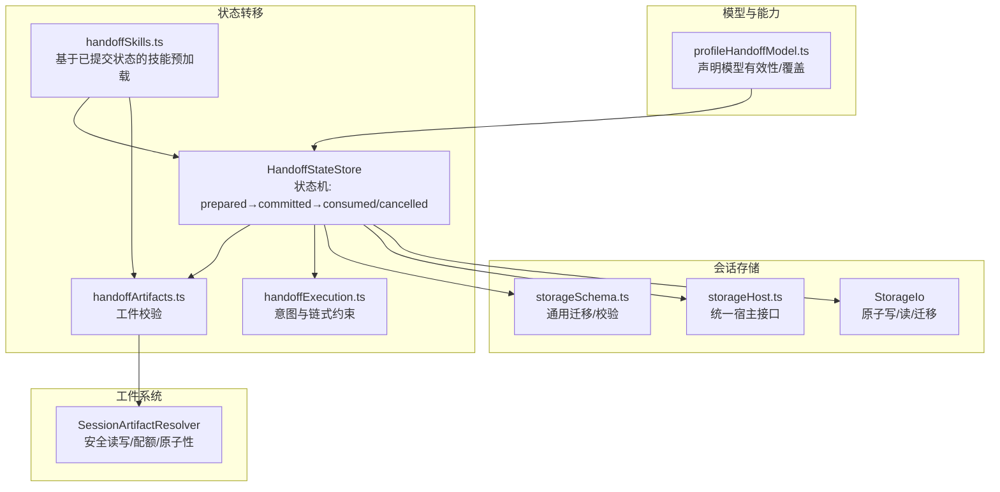
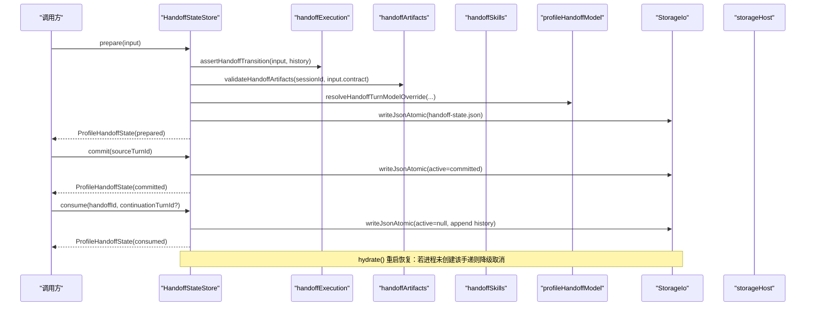
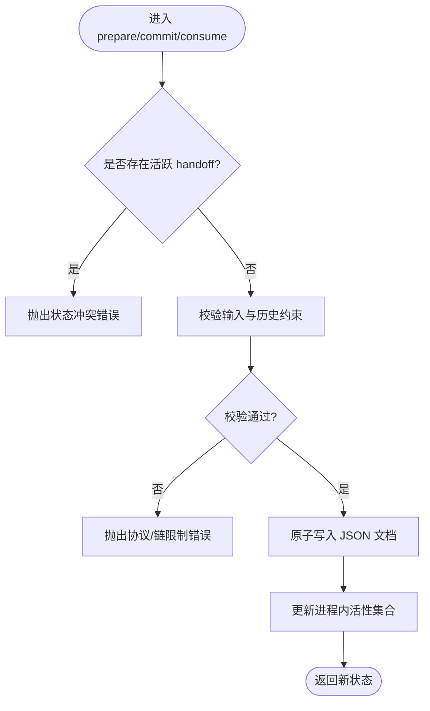
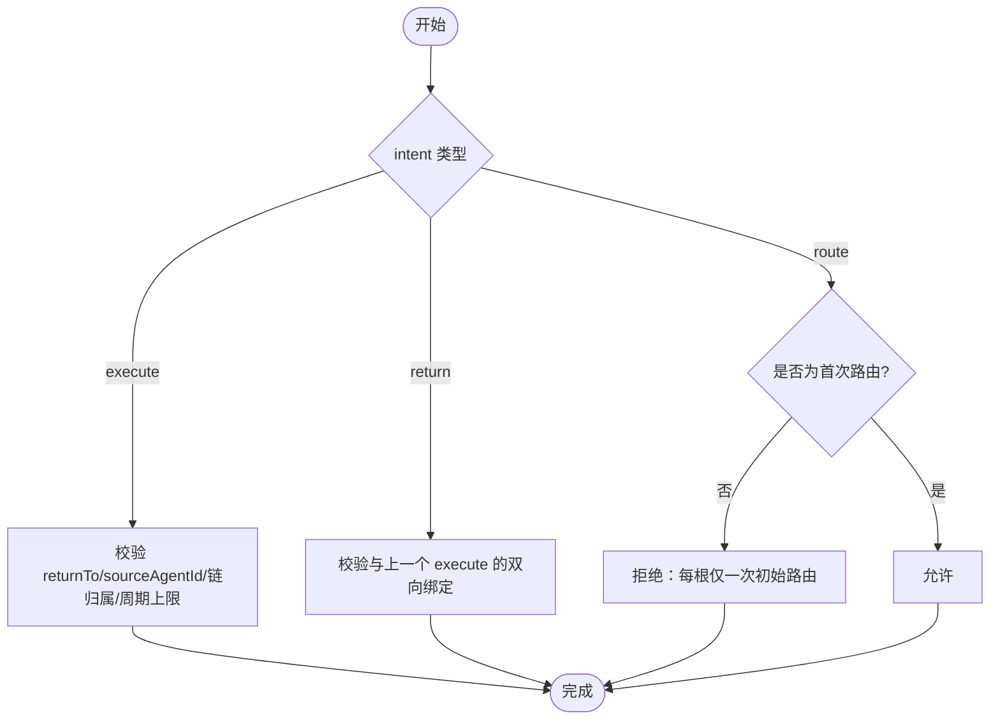
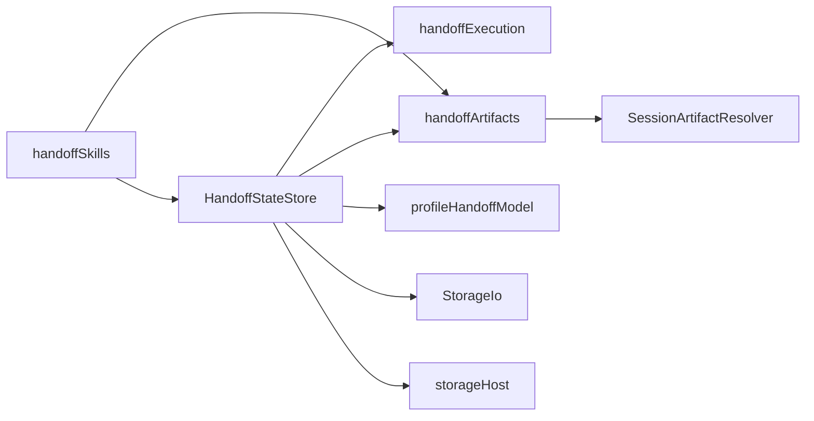

# 状态转移管理

<cite>
**本文引用的文件**
- [HandoffStateStore.ts](file://src/main/sessions/HandoffStateStore.ts)
- [handoffStateSchema.ts](file://src/main/sessions/handoffStateSchema.ts)
- [handoffExecution.ts](file://src/main/sessions/handoffExecution.ts)
- [handoffArtifacts.ts](file://src/main/sessions/handoffArtifacts.ts)
- [handoffSkills.ts](file://src/main/sessions/handoffSkills.ts)
- [profileHandoffModel.ts](file://src/main/sessions/profileHandoffModel.ts)
- [storageHost.ts](file://src/main/sessions/storageHost.ts)
- [StorageIo.ts](file://src/main/sessions/StorageIo.ts)
- [SessionArtifactResolver.ts](file://src/main/sessions/SessionArtifactResolver.ts)
- [storageSchema.ts](file://src/main/sessions/storageSchema.ts)
</cite>

## 目录
1. [简介](#简介)
2. [项目结构](#项目结构)
3. [核心组件](#核心组件)
4. [架构总览](#架构总览)
5. [详细组件分析](#详细组件分析)
6. [依赖关系分析](#依赖关系分析)
7. [性能考虑](#性能考虑)
8. [故障排查指南](#故障排查指南)
9. [结论](#结论)
10. [附录：API 参考与使用示例](#附录api-参考与使用示例)

## 简介
本文件聚焦于“状态转移管理”，围绕 HandoffStateStore 的状态管理机制，系统阐述会话间状态传递、上下文保持与一致性保证；详细说明 handoff 协议（请求、响应、错误恢复）；文档化状态序列化/反序列化机制（数据结构、版本兼容、数据校验）；并给出性能优化、并发控制与资源管理策略。最后提供 API 参考与使用示例，帮助实现安全的会话状态共享与协作。

## 项目结构
与状态转移相关的代码主要位于 sessions 子模块中，采用“存储层 + 领域逻辑 + 类型/模式”的分层组织：
- 存储与持久化：StorageIo、storageHost、storageSchema
- 领域状态机：HandoffStateStore（prepared → committed → consumed/cancelled）
- 协议与约束：handoffExecution（意图路由/执行/返回的合法性）、handoffArtifacts（工件校验）、handoffSkills（技能预加载）
- 模型与能力：profileHandoffModel（声明模型有效性、会话级模型覆盖）
- 工件访问：SessionArtifactResolver（安全读取/写入、配额、原子性）

图表来源
- [HandoffStateStore.ts:42-241](file://src/main/sessions/HandoffStateStore.ts#L42-L241)
- [storageHost.ts:9-25](file://src/main/sessions/storageHost.ts#L9-L25)
- [storageSchema.ts:9-99](file://src/main/sessions/storageSchema.ts#L9-L99)
- [handoffExecution.ts:5-33](file://src/main/sessions/handoffExecution.ts#L5-L33)
- [handoffArtifacts.ts:4-14](file://src/main/sessions/handoffArtifacts.ts#L4-L14)
- [handoffSkills.ts:4-11](file://src/main/sessions/handoffSkills.ts#L4-L11)
- [profileHandoffModel.ts:8-51](file://src/main/sessions/profileHandoffModel.ts#L8-L51)
- [SessionArtifactResolver.ts:285-739](file://src/main/sessions/SessionArtifactResolver.ts#L285-L739)

章节来源
- [HandoffStateStore.ts:42-241](file://src/main/sessions/HandoffStateStore.ts#L42-L241)
- [storageHost.ts:9-25](file://src/main/sessions/storageHost.ts#L9-L25)
- [storageSchema.ts:9-99](file://src/main/sessions/storageSchema.ts#L9-L99)

## 核心组件
- HandoffStateStore：维护会话内 handoff 的内存态与持久化态，提供 prepare/commit/consume/cancel/hydrate 等能力，确保生命周期一致性与链式调用限制。
- handoffExecution：对 handoff contract 进行语义校验（route/execute/return），防止非法循环与越权。
- handoffArtifacts：校验 handoff 所需的计划或工件引用，确保存在且类型正确。
- handoffSkills：在已提交 handoff 到特定接收方时，预加载所需技能 ID。
- profileHandoffModel：校验声明模型与覆盖模型是否可执行，保障 handoff 目标模型能力。
- StorageIo/storageHost/storageSchema：提供原子写、JSON/JSONL 读写、迁移与校验，保证持久化一致性与容错。
- SessionArtifactResolver：安全地解析/读取/写入会话工件，包含路径逃逸防护、MIME 白名单、配额与原子性。

章节来源
- [HandoffStateStore.ts:42-241](file://src/main/sessions/HandoffStateStore.ts#L42-L241)
- [handoffExecution.ts:5-33](file://src/main/sessions/handoffExecution.ts#L5-L33)
- [handoffArtifacts.ts:4-14](file://src/main/sessions/handoffArtifacts.ts#L4-L14)
- [handoffSkills.ts:4-11](file://src/main/sessions/handoffSkills.ts#L4-L11)
- [profileHandoffModel.ts:8-51](file://src/main/sessions/profileHandoffModel.ts#L8-L51)
- [StorageIo.ts:20-335](file://src/main/sessions/StorageIo.ts#L20-L335)
- [storageSchema.ts:9-99](file://src/main/sessions/storageSchema.ts#L9-L99)
- [SessionArtifactResolver.ts:285-739](file://src/main/sessions/SessionArtifactResolver.ts#L285-L739)

## 架构总览
下图展示了 handoff 从准备到消费的关键流程，以及各组件之间的交互。

图表来源
- [HandoffStateStore.ts:116-207](file://src/main/sessions/HandoffStateStore.ts#L116-L207)
- [handoffExecution.ts:5-33](file://src/main/sessions/handoffExecution.ts#L5-L33)
- [handoffArtifacts.ts:4-14](file://src/main/sessions/handoffArtifacts.ts#L4-L14)
- [profileHandoffModel.ts:15-51](file://src/main/sessions/profileHandoffModel.ts#L15-L51)
- [StorageIo.ts:295-297](file://src/main/sessions/StorageIo.ts#L295-L297)
- [storageHost.ts:9-25](file://src/main/sessions/storageHost.ts#L9-L25)

## 详细组件分析

### HandoffStateStore：状态机与一致性
- 生命周期：prepared → committed → consumed 或 cancelled。历史以追加方式记录 consumed/cancelled 条目，active 仅保留当前活跃项。
- 链式与深度：通过 chainRoot 与 depth 追踪 handoff 链，限制最大深度，避免无限递归。
- 进程内活性：liveHandoffIds 跟踪进程内创建的 handoffId，用于重启恢复时的降级处理。
- 草稿与预留：draftReservations 防止同一会话重复草稿冲突。
- 持久化：writeDocument 将 active 与 history 原子写入 handoff-state.json，并通过 schema 校验。

图表来源
- [HandoffStateStore.ts:129-207](file://src/main/sessions/HandoffStateStore.ts#L129-L207)
- [HandoffStateStore.ts:224-240](file://src/main/sessions/HandoffStateStore.ts#L224-L240)

章节来源
- [HandoffStateStore.ts:42-241](file://src/main/sessions/HandoffStateStore.ts#L42-L241)

### handoffExecution：意图与链式约束
- route：每个 root 仅允许一次初始路由。
- execute：要求 returnTo 与实际分发者一致，禁止自调度，需先返回再进入下一个执行周期，且受执行周期上限限制。
- return：必须匹配当前执行绑定及其实际分发者，确保双向对称。

图表来源
- [handoffExecution.ts:5-33](file://src/main/sessions/handoffExecution.ts#L5-L33)

章节来源
- [handoffExecution.ts:5-33](file://src/main/sessions/handoffExecution.ts#L5-L33)

### handoffArtifacts：工件校验
- 根据 intent 选择需要校验的工件引用（execute 的计划或 return 的工件）。
- 通过 sessionArtifactResolver.read 校验存在性与哈希，并对 execute 的计划强制为 Markdown 文本。

章节来源
- [handoffArtifacts.ts:4-14](file://src/main/sessions/handoffArtifacts.ts#L4-L14)
- [SessionArtifactResolver.ts:379-469](file://src/main/sessions/SessionArtifactResolver.ts#L379-L469)

### handoffSkills：技能预加载
- 仅在 handoff 已提交给目标 agent 时，才基于 contract 提取 requiredSkillIds 并去重，供后续加载。

章节来源
- [handoffSkills.ts:4-11](file://src/main/sessions/handoffSkills.ts#L4-L11)

### profileHandoffModel：模型能力与覆盖
- 校验 declaredModel 或 session modelOverride 是否为可执行的 Agent 模型。
- 失败时抛出模型无效错误，阻止不合规的 handoff 继续。

章节来源
- [profileHandoffModel.ts:8-51](file://src/main/sessions/profileHandoffModel.ts#L8-L51)

### 存储与持久化：StorageIo / storageSchema
- 原子写：writeUtf8Atomic/writeJsonAtomic 使用临时文件 + rename 实现跨平台原子替换，支持 Windows 安全回退备份。
- 读取与迁移：readJson/readYaml 支持 schema 迁移与运行时校验，遇到损坏文件自动隔离并尝试恢复。
- 版本控制：CURRENT_STORE_SCHEMA_VERSION 与 parseStoredDocument 确保向后兼容与未知版本拒绝。

章节来源
- [StorageIo.ts:27-93](file://src/main/sessions/StorageIo.ts#L27-L93)
- [StorageIo.ts:172-297](file://src/main/sessions/StorageIo.ts#L172-L297)
- [storageSchema.ts:9-99](file://src/main/sessions/storageSchema.ts#L9-L99)

### 工件系统：SessionArtifactResolver
- 安全解析：严格限制路径在会话工件根目录下，拒绝符号链接与硬链接逃逸。
- MIME 白名单：拒绝 SVG/可执行/RDC 等危险类型，支持图片魔数检测。
- 配额与原子性：写入前预留配额，成功后提交，失败回滚；写入使用临时文件 + 原子重命名。
- 分页读取：支持 offset/limit/column 分页，返回 next 游标。

章节来源
- [SessionArtifactResolver.ts:285-739](file://src/main/sessions/SessionArtifactResolver.ts#L285-L739)

## 依赖关系分析
- HandoffStateStore 依赖 storageHost 提供的 io 与会话定位能力，依赖 handoffExecution 做协议校验，依赖 handoffArtifacts 做工件校验，依赖 profileHandoffModel 做模型能力校验。
- handoffSkills 依赖 storageAdapter.handoffs.getActive 获取已提交 handoff，再结合 handoffArtifacts 提取技能。
- StorageIo 提供统一的原子读写与迁移能力，被多个 store 复用。
- SessionArtifactResolver 独立于 handoff 状态机，但被 handoffArtifacts 用于工件验证。

图表来源
- [HandoffStateStore.ts:42-241](file://src/main/sessions/HandoffStateStore.ts#L42-L241)
- [handoffExecution.ts:5-33](file://src/main/sessions/handoffExecution.ts#L5-L33)
- [handoffArtifacts.ts:4-14](file://src/main/sessions/handoffArtifacts.ts#L4-L14)
- [handoffSkills.ts:4-11](file://src/main/sessions/handoffSkills.ts#L4-L11)
- [profileHandoffModel.ts:8-51](file://src/main/sessions/profileHandoffModel.ts#L8-L51)
- [StorageIo.ts:20-335](file://src/main/sessions/StorageIo.ts#L20-L335)
- [storageHost.ts:9-25](file://src/main/sessions/storageHost.ts#L9-L25)
- [SessionArtifactResolver.ts:285-739](file://src/main/sessions/SessionArtifactResolver.ts#L285-L739)

## 性能考虑
- 原子写入与最小锁：所有持久化操作通过临时文件 + 原子重命名，减少竞争窗口，提升并发安全性。
- 历史追加：consumed/cancelled 以追加形式写入，避免频繁重写大文档。
- 进程内缓存：liveHandoffIds/draftReservations 减少重复计算与磁盘访问。
- 工件配额与限流：SessionArtifactResolver 限制文件大小、图像大小与工具输出数量，防止资源耗尽。
- 迁移与校验：读取时按需迁移与校验，避免不必要的开销；未知高版本直接拒绝，避免隐式兼容成本。

[本节为通用指导，不直接分析具体文件]

## 故障排查指南
- 状态冲突：当会话已有未完成 handoff 或历史中存在另一个活跃 handoff 时，prepare/commit/consume 会抛出状态冲突错误。检查 getActive 与历史中的 lifecycle。
- 协议违规：handoffExecution 会拒绝非法的 route/execute/return 组合，如非首次路由、执行周期超限、return 绑定不匹配等。核对 contract 与 chainRoot/history。
- 模型无效：profileHandoffModel 校验失败会抛出模型无效错误，确认 declaredModel 或 session modelOverride 指向可执行模型。
- 工件缺失或类型不符：handoffArtifacts 校验失败时，检查 plan 是否为 Markdown，或 return 工件是否存在且哈希匹配。
- 存储损坏：StorageIo 在解析失败时会隔离损坏文件并尝试恢复，查看 .corrupt.* 文件与日志定位问题。

章节来源
- [HandoffStateStore.ts:142-207](file://src/main/sessions/HandoffStateStore.ts#L142-L207)
- [handoffExecution.ts:5-33](file://src/main/sessions/handoffExecution.ts#L5-L33)
- [profileHandoffModel.ts:15-51](file://src/main/sessions/profileHandoffModel.ts#L15-L51)
- [handoffArtifacts.ts:4-14](file://src/main/sessions/handoffArtifacts.ts#L4-L14)
- [StorageIo.ts:27-93](file://src/main/sessions/StorageIo.ts#L27-L93)

## 结论
HandoffStateStore 通过严格的有限状态机、链式约束与原子持久化，实现了会话间状态的安全转移与一致性保证。配合 handoffExecution、handoffArtifacts、profileHandoffModel 与 StorageIo/SessionArtifactResolver，系统在协议、工件、模型与存储层面提供了完备的保护与恢复能力。建议在生产环境中充分利用其幂等与原子特性，并结合配额与限流策略，确保高并发下的稳定性与性能。

[本节为总结性内容，不直接分析具体文件]

## 附录：API 参考与使用示例

### HandoffStateStore 关键方法
- createPreparedDraft(sessionId, input)：内存草稿，预留会话，不持久化。
- abandonDraft(sessionId, handoffId)：放弃草稿。
- prepare(sessionId, input)：校验并持久化为 prepared。
- commit(sessionId, sourceTurnId)：将 prepared 转为 committed。
- consume(sessionId, handoffId, continuationTurnId?)：消费 committed，记录历史并清空 active。
- cancel(sessionId, reason)：取消活跃 handoff，记录历史。
- hydrate(sessionId)：进程重启恢复，若未创建则降级取消。
- computeNextChain(sessionId, sourceAgentId, currentTurnId?)：计算下一链的 chainRoot 与 depth。
- readDocument(sessionId)：读取并校验 handoff 文档。
- getActive(sessionId)：获取活跃 handoff（仅生命周期有效）。

章节来源
- [HandoffStateStore.ts:116-207](file://src/main/sessions/HandoffStateStore.ts#L116-L207)
- [HandoffStateStore.ts:53-75](file://src/main/sessions/HandoffStateStore.ts#L53-L75)
- [HandoffStateStore.ts:82-110](file://src/main/sessions/HandoffStateStore.ts#L82-L110)

### 状态序列化和反序列化
- 文档结构：schemaVersion 固定为当前版本，active 可为 null，history 为可选数组。
- 字段校验：ProfileHandoffState 使用 Zod 严格校验生命周期、时间戳、ID、合同、任务执行/结果等。
- 迁移：HANDOFF_STATE_MIGRATIONS 注册当前版本，parseStoredDocument 负责迁移与校验。

章节来源
- [handoffStateSchema.ts:6-76](file://src/main/sessions/handoffStateSchema.ts#L6-L76)
- [storageSchema.ts:50-99](file://src/main/sessions/storageSchema.ts#L50-L99)

### 使用示例（步骤说明）
- 准备阶段：
  - 调用 createPreparedDraft 或 prepare，传入 sourceTurnId、toAgentId、contract、prompt、label、declaredModel、send、chainRoot、depth。
  - 内部会执行协议校验、工件校验与模型能力校验，然后原子写入 handoff-state.json。
- 提交阶段：
  - 调用 commit，传入 sourceTurnId，将 active 转为 committed。
- 消费阶段：
  - 调用 consume，传入 handoffId 与可选 continuationTurnId，将 active 置空并将 consumed 写入 history。
- 取消阶段：
  - 调用 cancel，传入原因（如 user_stop、rewrite、branch、manual_switch、session_close、restart_degrade、invalid_model、depth_exceeded、superseded）。
- 重启恢复：
  - 调用 hydrate，若进程未创建该 handoff，则降级取消。

章节来源
- [HandoffStateStore.ts:116-207](file://src/main/sessions/HandoffStateStore.ts#L116-L207)
- [handoffExecution.ts:5-33](file://src/main/sessions/handoffExecution.ts#L5-L33)
- [handoffArtifacts.ts:4-14](file://src/main/sessions/handoffArtifacts.ts#L4-L14)
- [profileHandoffModel.ts:15-51](file://src/main/sessions/profileHandoffModel.ts#L15-L51)

### 并发控制与资源管理
- 进程内并发：liveHandoffIds 与 draftReservations 防止重复草稿与并发冲突。
- 持久化并发：StorageIo 的原子写避免竞态条件，支持 Windows 安全回退。
- 资源配额：SessionArtifactResolver 限制文件大小、图像大小、工具输出数量，并在写入前后进行配额预留与提交/回滚。

章节来源
- [HandoffStateStore.ts:42-79](file://src/main/sessions/HandoffStateStore.ts#L42-L79)
- [StorageIo.ts:172-297](file://src/main/sessions/StorageIo.ts#L172-L297)
- [SessionArtifactResolver.ts:471-559](file://src/main/sessions/SessionArtifactResolver.ts#L471-L559)