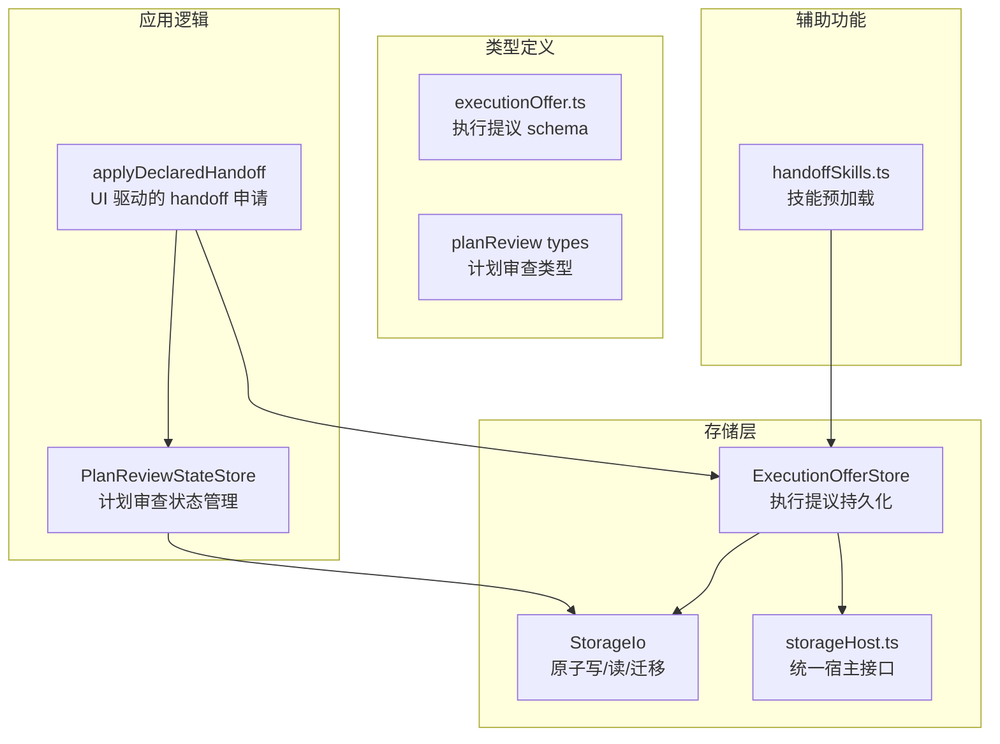
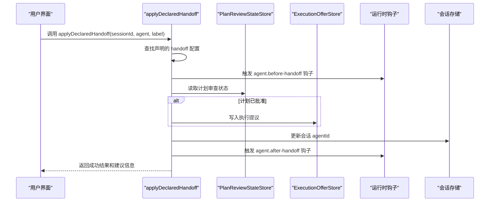
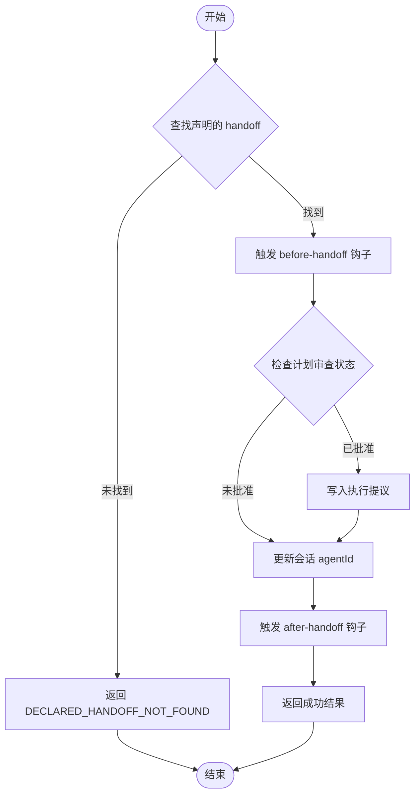
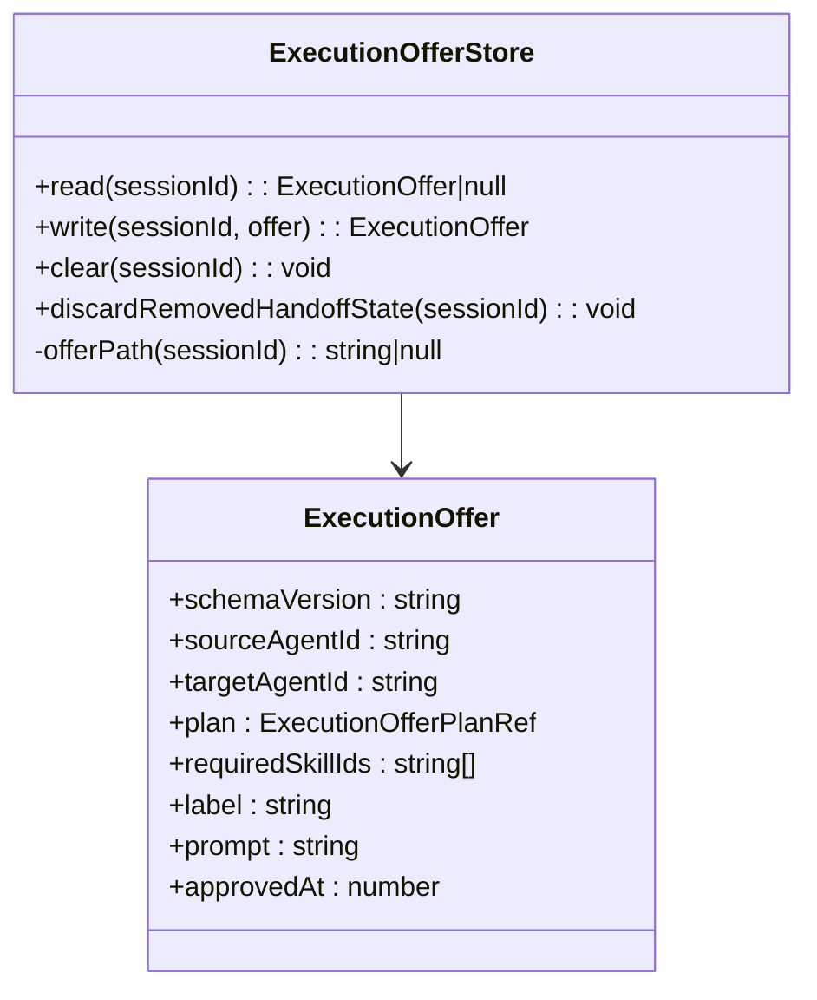
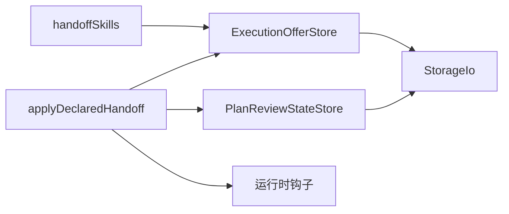

# 状态转移管理

<cite>
**本文引用的文件**
- [applyDeclaredHandoff.ts](file://src/main/conversation/applyDeclaredHandoff.ts)
- [ExecutionOfferStore.ts](file://src/main/sessions/ExecutionOfferStore.ts)
- [PlanReviewStateStore.ts](file://src/main/sessions/PlanReviewStateStore.ts)
- [executionOffer.ts](file://src/shared/types/executionOffer.ts)
- [StorageIo.ts](file://src/main/sessions/StorageIo.ts)
- [storageHost.ts](file://src/main/sessions/storageHost.ts)
- [handoffSkills.ts](file://src/main/sessions/handoffSkills.ts)
</cite>

## 更新摘要
**所做更改**
- 完全移除了持久的 handoff 状态机系统（HandoffStateStore、ConversationHandoffOps、handoffExecution、handoffArtifacts、profileHandoffModel）
- 采用简化的声明式延续模型，使用 applyDeclaredHandoff 和 ExecutionOfferStore 替代复杂的状态机
- 更新了状态生命周期：从 prepared→committed→consumed 改为基于 UI 驱动的 handoff 方法
- 重构了架构设计，强调计划审查和执行提议的分离关注点
- 更新了所有相关组件的依赖关系和使用示例

## 目录
1. [简介](#简介)
2. [项目结构](#项目结构)
3. [核心组件](#核心组件)
4. [架构总览](#架构总览)
5. [详细组件分析](#详细组件分析)
6. [依赖关系分析](#依赖关系分析)
7. [性能考虑](#性能考虑)
8. [故障排查指南](#故障排查指南)
9. [结论](#结论)
10. [附录：API 参考与使用示例](#附录api-参考与使用示例)

## 简介
本文件聚焦于新的"状态转移管理"实现，围绕简化的声明式延续模型，系统阐述会话间状态传递、上下文保持与一致性保证；详细说明 handoff 协议（UI 驱动的申请、响应处理、错误恢复流程）；文档化执行提议的序列化和反序列化机制（数据结构定义、版本兼容性和数据验证规则）。包含执行提议的性能优化、并发控制和资源管理策略。提供新的 API 参考和使用示例，展示如何实现安全的会话状态共享和协作。

**更新** 整个持久的 handoff 状态机系统已被移除，现在采用更简洁的声明式延续模型，通过 UI 交互驱动 handoff 过程，而非复杂的内部状态机。

## 项目结构
新的实现主要位于 conversation 和 sessions 子模块中，采用"应用逻辑 + 存储层 + 类型定义"的分层组织：
- 应用逻辑：applyDeclaredHandoff（UI 驱动的 handoff 申请）、PlanReviewStateStore（计划审查状态）
- 存储层：ExecutionOfferStore（执行提议持久化）、StorageIo（原子读写）
- 类型定义：executionOffer（执行提议 schema）、planReview（计划审查类型）
- 辅助功能：handoffSkills（技能预加载）、storageHost（统一宿主接口）



**图表来源**
- [applyDeclaredHandoff.ts:38-94](file://src/main/conversation/applyDeclaredHandoff.ts#L38-L94)
- [ExecutionOfferStore.ts:42-81](file://src/main/sessions/ExecutionOfferStore.ts#L42-L81)
- [PlanReviewStateStore.ts:40-103](file://src/main/sessions/PlanReviewStateStore.ts#L40-L103)
- [executionOffer.ts:1-23](file://src/shared/types/executionOffer.ts#L1-L23)

**章节来源**
- [applyDeclaredHandoff.ts:38-94](file://src/main/conversation/applyDeclaredHandoff.ts#L38-L94)
- [ExecutionOfferStore.ts:42-81](file://src/main/sessions/ExecutionOfferStore.ts#L42-L81)
- [PlanReviewStateStore.ts:40-103](file://src/main/sessions/PlanReviewStateStore.ts#L40-L103)

## 核心组件
- **applyDeclaredHandoff**：UI 驱动的 handoff 申请入口，验证声明的 handoff 配置，触发运行时钩子，更新会话并写入执行提议
- **ExecutionOfferStore**：管理执行提议的持久化，支持读取、写入、清除操作，以及旧版 handoff-state.json 文件的清理
- **PlanReviewStateStore**：管理计划审查状态，支持开始修订、标记决策（批准/拒绝），并与执行提议联动
- **executionOffer**：定义执行提议的数据结构，包含源代理、目标代理、计划引用、所需技能等信息
- **StorageIo**：提供原子读写能力，确保数据一致性和崩溃恢复
- **handoffSkills**：基于已批准的执行提议预加载所需技能 ID

**章节来源**
- [applyDeclaredHandoff.ts:38-94](file://src/main/conversation/applyDeclaredHandoff.ts#L38-L94)
- [ExecutionOfferStore.ts:42-81](file://src/main/sessions/ExecutionOfferStore.ts#L42-L81)
- [PlanReviewStateStore.ts:40-103](file://src/main/sessions/PlanReviewStateStore.ts#L40-L103)
- [executionOffer.ts:1-23](file://src/shared/types/executionOffer.ts#L1-L23)

## 架构总览
下图展示了新的 UI 驱动的 handoff 流程，从用户界面触发到执行提议持久化的完整过程。



**图表来源**
- [applyDeclaredHandoff.ts:38-94](file://src/main/conversation/applyDeclaredHandoff.ts#L38-L94)
- [PlanReviewStateStore.ts:49-91](file://src/main/sessions/PlanReviewStateStore.ts#L49-L91)
- [ExecutionOfferStore.ts:53-67](file://src/main/sessions/ExecutionOfferStore.ts#L53-L67)

## 详细组件分析

### applyDeclaredHandoff：UI 驱动的 handoff 申请
新的 handoff 机制完全由 UI 驱动，不再维护复杂的内部状态机。主要流程包括：
- 查找声明的 handoff 配置：根据 sourceAgentId、targetAgentId 和 label 匹配配置的 handoff
- 触发运行时钩子：在 handoff 前后分别触发 before-handoff 和 after-handoff 钩子
- 检查计划审查状态：如果计划已批准，则写入执行提议
- 更新会话：将当前会话的 agentId 切换到目标代理
- 返回建议信息：包含 label、agent、prompt 和 send 标志



**图表来源**
- [applyDeclaredHandoff.ts:24-94](file://src/main/conversation/applyDeclaredHandoff.ts#L24-L94)

**章节来源**
- [applyDeclaredHandoff.ts:24-94](file://src/main/conversation/applyDeclaredHandoff.ts#L24-L94)

### ExecutionOfferStore：执行提议持久化
负责执行提议的创建、读取、更新和删除操作：
- **read**：读取会话的执行提议，返回 null 表示无有效提议
- **write**：写入执行提议，使用 Zod schema 验证后原子持久化
- **clear**：删除指定会话的执行提议文件
- **discardRemovedHandoffState**：清理旧版的 handoff-state.json 文件
- **executionOfferMatches**：验证执行提议是否匹配特定的目标代理和计划



**图表来源**
- [ExecutionOfferStore.ts:42-81](file://src/main/sessions/ExecutionOfferStore.ts#L42-L81)
- [executionOffer.ts:8-17](file://src/shared/types/executionOffer.ts#L8-L17)

**章节来源**
- [ExecutionOfferStore.ts:42-81](file://src/main/sessions/ExecutionOfferStore.ts#L42-L81)
- [executionOffer.ts:8-17](file://src/shared/types/executionOffer.ts#L8-L17)

### PlanReviewStateStore：计划审查状态管理
管理计划审查的生命周期，支持与执行提议的联动：
- **beginRevision**：开始新的计划修订，重置状态为 awaiting
- **markDecision**：标记计划审查决策（approved/rejected），附带冻结的计划信息
- **read**：读取当前的计划审查状态

关键特性：
- 批准状态需要完整的冻结计划绑定（hash 和 URI）
- 拒绝时会清空相关的执行提议
- 支持多轮修订，每轮都有独立的 planId 和 revision

**章节来源**
- [PlanReviewStateStore.ts:40-103](file://src/main/sessions/PlanReviewStateStore.ts#L40-L103)

### 存储与持久化：StorageIo / storageSchema
继承原有的原子写入和迁移能力：
- **原子写**：使用临时文件 + rename 实现跨平台原子替换
- **读取与迁移**：支持 schema 迁移与运行时校验
- **版本控制**：CURRENT_STORE_SCHEMA_VERSION 确保向后兼容

**章节来源**
- [StorageIo.ts:27-93](file://src/main/sessions/StorageIo.ts#L27-L93)
- [StorageIo.ts:172-297](file://src/main/sessions/StorageIo.ts#L172-L297)

### 技能预加载：handoffSkills
基于已批准的执行提议预加载所需技能：
- 使用 executionOfferMatches 验证提议的有效性
- 提取 requiredSkillIds 并去重
- 为后续的技能加载做准备

**章节来源**
- [handoffSkills.ts:3-11](file://src/main/sessions/handoffSkills.ts#L3-L11)

## 依赖关系分析
新的实现简化了依赖关系，主要组件间的依赖如下：
- **applyDeclaredHandoff** 依赖 StorageAdapter、PlanReviewStateStore、运行时钩子系统
- **ExecutionOfferStore** 依赖 StorageIo 进行原子持久化
- **PlanReviewStateStore** 依赖 StorageIo 和 StorageAdapter
- **handoffSkills** 依赖 ExecutionOfferStore 获取已批准的提议



**图表来源**
- [applyDeclaredHandoff.ts:6-9](file://src/main/conversation/applyDeclaredHandoff.ts#L6-L9)
- [ExecutionOfferStore.ts:4-5](file://src/main/sessions/ExecutionOfferStore.ts#L4-L5)
- [PlanReviewStateStore.ts:9-11](file://src/main/sessions/PlanReviewStateStore.ts#L9-L11)
- [handoffSkills.ts:3](file://src/main/sessions/handoffSkills.ts#L3)

## 性能考虑
新实现的性能优化重点：
- **简化状态管理**：移除了复杂的内部状态机，减少内存占用和状态同步开销
- **原子操作**：继续使用 StorageIo 的原子写入，确保数据一致性
- **按需加载**：只在计划批准后写入执行提议，避免不必要的持久化
- **增量更新**：执行提议支持覆盖写入，避免重复创建
- **清理机制**：自动清理旧版的 handoff-state.json 文件，释放存储空间

## 故障排查指南
新系统的故障排查要点：
- **声明未找到**：检查 handoff 配置是否正确声明，agent 和 label 是否匹配
- **计划审查失败**：确认计划审查状态是否为 approved，冻结的计划和哈希是否正确
- **执行提议写入失败**：检查存储权限和磁盘空间，查看 StorageIo 的错误日志
- **钩子被拒绝**：检查 agent.before-handoff 和 agent.after-handoff 钩子的返回值
- **技能加载失败**：验证 requiredSkillIds 是否有效，技能是否已正确安装

**章节来源**
- [applyDeclaredHandoff.ts:40-53](file://src/main/conversation/applyDeclaredHandoff.ts#L40-L53)
- [PlanReviewStateStore.ts:74-91](file://src/main/sessions/PlanReviewStateStore.ts#L74-L91)
- [ExecutionOfferStore.ts:59-67](file://src/main/sessions/ExecutionOfferStore.ts#L59-L67)

## 结论
新的状态转移管理系统通过移除复杂的持久化状态机，采用了更简洁的 UI 驱动模式。这种设计减少了系统复杂性，提高了可维护性，同时保持了必要的安全性和一致性保证。通过执行提议和计划审查的分离，系统能够更灵活地处理不同的 handoff 场景，提供更好的用户体验。

## 附录：API 参考与使用示例

### applyDeclaredHandoff：主要 API
**函数签名**：`applyDeclaredHandoff(input: ApplyDeclaredHandoffInput): Promise<ApplyDeclaredHandoffResult>`

**输入参数**：
- `sessionId`: 会话标识符
- `agent`: 目标代理 ID
- `label`: handoff 标签

**返回值**：
- `success`: 操作是否成功
- `error`: 错误信息（失败时）
- `session`: 更新后的会话信息
- `suggestion`: handoff 建议信息

**使用示例**：
```typescript
const result = await applyDeclaredHandoff({
  sessionId: 'sess_123',
  agent: 'general',
  label: 'Execute with General'
});

if (result.success) {
  console.log('Handoff successful:', result.session);
} else {
  console.error('Handoff failed:', result.error);
}
```

**章节来源**
- [applyDeclaredHandoff.ts:11-22](file://src/main/conversation/applyDeclaredHandoff.ts#L11-L22)
- [applyDeclaredHandoff.ts:38-94](file://src/main/conversation/applyDeclaredHandoff.ts#L38-L94)

### ExecutionOfferStore：存储 API
**主要方法**：
- `read(sessionId)`: 读取执行提议
- `write(sessionId, offer)`: 写入执行提议
- `clear(sessionId)`: 清除执行提议
- `discardRemovedHandoffState(sessionId)`: 清理旧版文件

**使用示例**：
```typescript
// 写入执行提议
store.write(sessionId, {
  schemaVersion: EXECUTION_OFFER_SCHEMA,
  sourceAgentId: 'debugger',
  targetAgentId: 'general',
  plan: { uri: 'session://plans/plan-frozen.md', hash: 'abc123...' },
  requiredSkillIds: ['renderdoc-execution'],
  label: 'Execute with General',
  prompt: 'Execute the frozen plan.',
  approvedAt: Date.now()
});

// 读取执行提议
const offer = store.read(sessionId);
if (offer) {
  console.log('Target agent:', offer.targetAgentId);
}
```

**章节来源**
- [ExecutionOfferStore.ts:53-74](file://src/main/sessions/ExecutionOfferStore.ts#L53-L74)

### PlanReviewStateStore：计划审查 API
**主要方法**：
- `beginRevision(sessionId)`: 开始新的计划修订
- `markDecision(sessionId, status, extras)`: 标记计划审查决策
- `read(sessionId)`: 读取计划审查状态

**使用示例**：
```typescript
// 开始新的计划修订
const revision = planReviewStateStore.beginRevision(sessionId);
console.log('New revision:', revision.planId, revision.revision);

// 批准计划
planReviewStateStore.markDecision(sessionId, 'approved', {
  approvedHash: 'abc123...',
  frozenUri: 'session://plans/plan-frozen.md'
});

// 拒绝计划
planReviewStateStore.markDecision(sessionId, 'rejected');
```

**章节来源**
- [PlanReviewStateStore.ts:54-91](file://src/main/sessions/PlanReviewStateStore.ts#L54-L91)

### 数据结构和验证
**ExecutionOffer 结构**：
```typescript
interface ExecutionOffer {
  schemaVersion: '1';
  sourceAgentId: string;
  targetAgentId: string;
  plan: { uri: string; hash: string };
  requiredSkillIds: string[];
  label: string;
  prompt: string;
  approvedAt: number;
}
```

**验证规则**：
- schemaVersion 必须为 '1'
- 所有字符串字段不能为空
- plan.uri 和 plan.hash 必须存在且非空
- requiredSkillIds 必须是字符串数组
- approvedAt 必须是时间戳

**章节来源**
- [executionOffer.ts:8-17](file://src/shared/types/executionOffer.ts#L8-L17)
- [ExecutionOfferStore.ts:10-22](file://src/main/sessions/ExecutionOfferStore.ts#L10-L22)

### 错误处理和恢复
**常见错误**：
- `DECLARED_HANDOFF_NOT_FOUND`: 未找到声明的 handoff 配置
- `EXECUTION_OFFER_SESSION_MISSING`: 会话路径缺失
- `PLAN_REVIEW_STATE_MISSING`: 计划审查状态缺失
- `HOOK_DENIED`: 运行时钩子被拒绝

**恢复策略**：
- 原子写入确保数据一致性
- 自动清理旧版文件
- 钩子失败时回滚会话更新
- 计划拒绝时自动清理执行提议

**章节来源**
- [applyDeclaredHandoff.ts:40-83](file://src/main/conversation/applyDeclaredHandoff.ts#L40-L83)
- [ExecutionOfferStore.ts:59-74](file://src/main/sessions/ExecutionOfferStore.ts#L59-L74)
- [PlanReviewStateStore.ts:74-91](file://src/main/sessions/PlanReviewStateStore.ts#L74-L91)