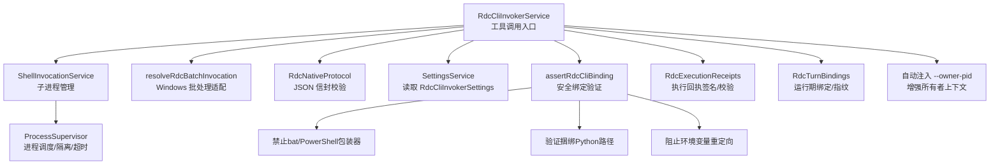
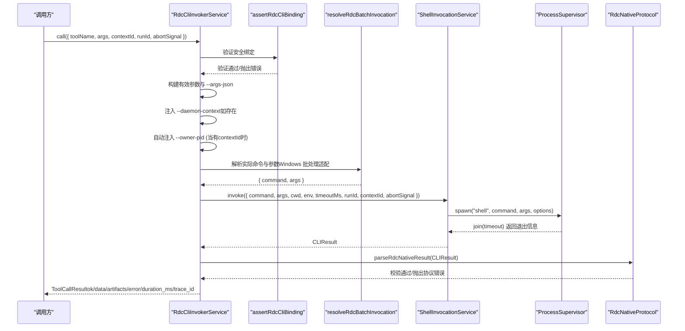
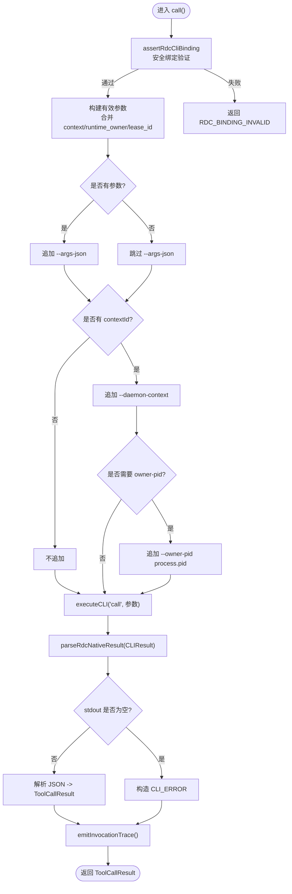
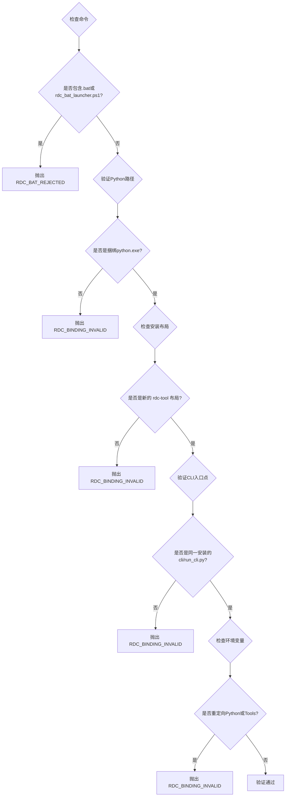
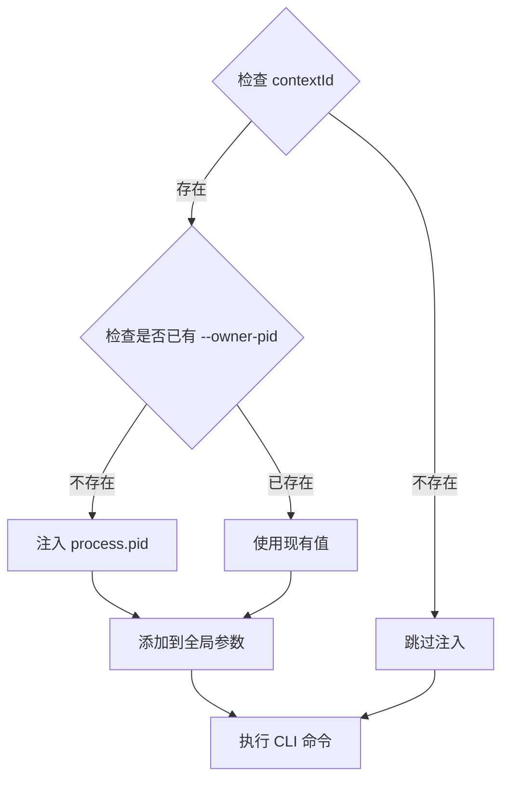
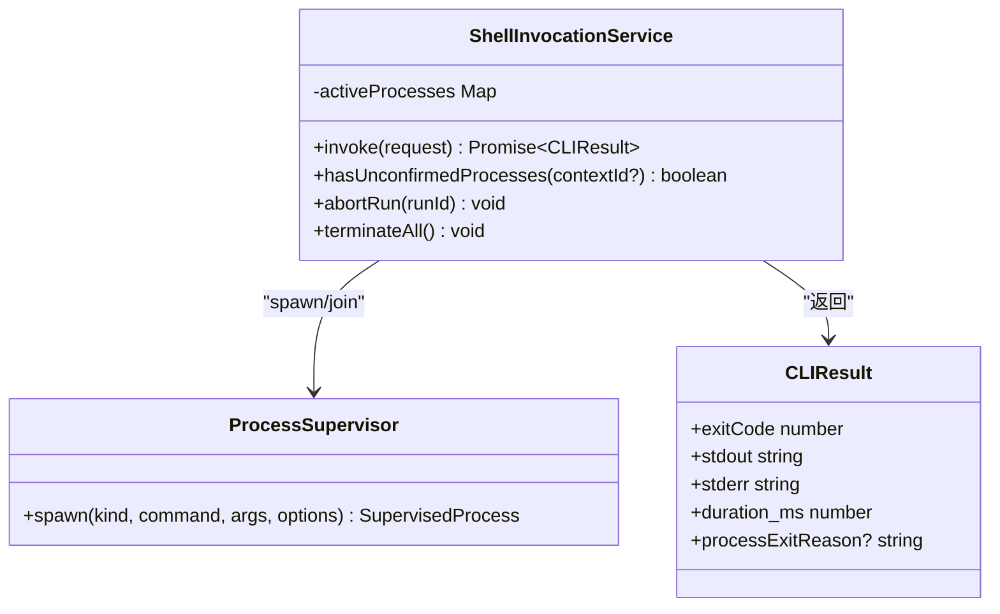
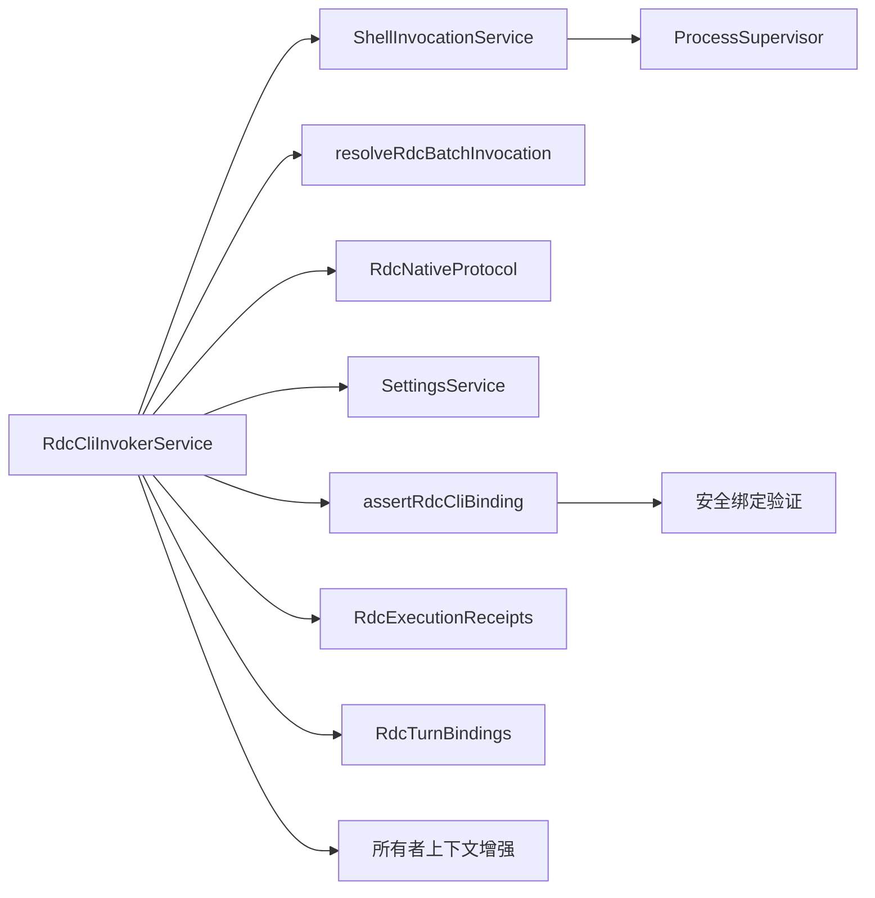

# RDC CLI 调用器

<cite>
**本文引用的文件**
- [RdcCliInvokerService.ts](file://src/main/tools/RdcCliInvokerService.ts)
- [rdcCliBinding.ts](file://src/shared/utils/rdcCliBinding.ts)
- [ShellInvocationService.ts](file://src/main/tools/ShellInvocationService.ts)
- [resolveRdcBatchInvocation.ts](file://src/main/tools/resolveRdcBatchInvocation.ts)
- [RdcNativeProtocol.ts](file://src/main/tools/RdcNativeProtocol.ts)
- [withRdcHostRuntimeEnv.ts](file://src/main/tools/withRdcHostRuntimeEnv.ts)
- [settings.ts](file://src/shared/types/settings.ts)
- [RdcExecutionReceipts.ts](file://src/main/tools/RdcExecutionReceipts.ts)
- [RdcTurnBindings.ts](file://src/main/tools/RdcTurnBindings.ts)
- [RdcCliInvokerService.test.ts](file://src/main/tools/RdcCliInvokerService.test.ts)
</cite>

## 更新摘要
**所做更改**
- 完成 RDX 到 RDC 品牌重命名：将 RdxCliInvokerService 重命名为 RdcCliInvokerService，更新所有相关类名、方法名和引用
- 更新 CLI 调用从 rdx 到 rdc：修改命令解析、环境变量和工具引用
- 更新环境变量：将 RDX_INTERMEDIATE_ROOT 改为 RDC_TOOL_INTERMEDIATE_ROOT
- 增强安全绑定验证：更新断言逻辑以检查新的 RDC 安装布局，阻止旧的 rdx-tools 路径
- 更新错误消息和诊断信息：反映新的 RDC 品牌和配置要求

## 目录
1. [简介](#简介)
2. [项目结构](#项目结构)
3. [核心组件](#核心组件)
4. [架构总览](#架构总览)
5. [详细组件分析](#详细组件分析)
6. [依赖关系分析](#依赖关系分析)
7. [性能与可靠性](#性能与可靠性)
8. [故障排查指南](#故障排查指南)
9. [结论](#结论)
10. [附录：API 参考](#附录api-参考)

## 简介
本文件面向需要集成或扩展 RDC CLI 能力的开发者，系统性说明 RdcCliInvokerService 的设计与实现。内容覆盖 CLI 命令执行、参数构建与规范化、结果解析与错误处理、工具目录加载、运行时元数据管理、可用性检查与配置验证、命令行参数规范化、上下文传递、超时控制与进程管理等关键特性，并提供完整的 API 参考与最佳实践建议。

**最新更新**：已完成 RDX 到 RDC 品牌重命名，RdcCliInvokerService 现在实现了增强的安全绑定验证机制，通过严格的结构性验证确保只允许使用捆绑的Python解释器和CLI入口点，防止通过环境变量重定向或bat/PowerShell包装器进行安全绕过。同时自动注入 `--owner-pid` 标志增强所有者上下文。

## 项目结构
围绕 RDC CLI 调用器的核心代码主要位于 src/main/tools 目录，配合共享类型定义与设置类型，形成"服务层 + 协议层 + 进程管理层 + 安全验证层"的分层结构：
- 服务层：RdcCliInvokerService 提供高层工具调用能力（call、executeCLI、loadCatalog、getRuntimeSummary 等）。
- 协议层：RdcNativeProtocol 负责校验并解析 RDC CLI 的 JSON 信封格式。
- 进程管理层：ShellInvocationService 封装子进程生命周期、超时、中止、孤儿进程处理等。
- 安全验证层：assertRdcCliBinding 提供严格的结构验证，确保绑定安全性。
- 平台适配：resolveRdcBatchInvocation 在 Windows 上通过 PowerShell 启动 rdc.bat。
- 类型与配置：shared/types/settings.ts 定义工具、结果、摘要与调用器配置。
- 审计与绑定：RdcExecutionReceipts 用于生成签名化的执行回执；RdcTurnBindings 用于将 CLI 配置与动作绑定到单次运行上下文。

**图表来源**
- [RdcCliInvokerService.ts:22-367](file://src/main/tools/RdcCliInvokerService.ts#L22-L367)
- [rdcCliBinding.ts:17-49](file://src/shared/utils/rdcCliBinding.ts#L17-L49)
- [ShellInvocationService.ts:29-127](file://src/main/tools/ShellInvocationService.ts#L29-L127)
- [resolveRdcBatchInvocation.ts:1-7](file://src/main/tools/resolveRdcBatchInvocation.ts#L1-L7)
- [RdcNativeProtocol.ts:1-43](file://src/main/tools/RdcNativeProtocol.ts#L1-L43)
- [RdcExecutionReceipts.ts:38-71](file://src/main/tools/RdcExecutionReceipts.ts#L38-L71)
- [RdcTurnBindings.ts:1-36](file://src/main/tools/RdcTurnBindings.ts#L1-L36)

**章节来源**
- [RdcCliInvokerService.ts:22-367](file://src/main/tools/RdcCliInvokerService.ts#L22-L367)
- [rdcCliBinding.ts:1-49](file://src/shared/utils/rdcCliBinding.ts#L1-L49)
- [settings.ts:290-297](file://src/shared/types/settings.ts#L290-L297)

## 核心组件
- RdcCliInvokerService：对外暴露 call、executeCLI、loadCatalog、getRuntimeSummary、isAvailable、abortRun、terminateAll 等方法；内部完成参数构建、上下文注入、超时控制、结果解析与追踪事件发射。**新增**：自动检测并注入 `--owner-pid` 标志以增强所有者上下文，并通过 assertRdcCliBinding 进行安全绑定验证。
- ShellInvocationService：统一子进程启动、等待、超时、中止、孤儿进程检测与清理；返回标准化的 CLIResult。
- resolveRdcBatchInvocation：在 Windows 平台上将 rdc.bat 调用转换为 powershell.exe -File rdc_bat_launcher.ps1 的形式，并透传非交互标志。
- RdcNativeProtocol：严格校验 RDC CLI 的 JSON 输出信封（ok、result_kind、data、context_id），并在不匹配时抛出协议错误。
- RdcExecutionReceipts：为成功执行的 RDC 操作生成带签名的执行回执，支持读写与完整性校验。
- RdcTurnBindings：将 CLI 配置、动作配置与租约身份冻结并绑定到当前运行计划，避免敏感信息序列化泄露。
- **新增**：assertRdcCliBinding：提供严格的结构验证，确保只允许使用捆绑的Python解释器和CLI入口点，防止安全绕过。

**章节来源**
- [RdcCliInvokerService.ts:22-367](file://src/main/tools/RdcCliInvokerService.ts#L22-L367)
- [rdcCliBinding.ts:17-49](file://src/shared/utils/rdcCliBinding.ts#L17-L49)
- [ShellInvocationService.ts:29-127](file://src/main/tools/ShellInvocationService.ts#L29-L127)
- [resolveRdcBatchInvocation.ts:1-7](file://src/main/tools/resolveRdcBatchInvocation.ts#L1-L7)
- [RdcNativeProtocol.ts:1-43](file://src/main/tools/RdcNativeProtocol.ts#L1-L43)
- [RdcExecutionReceipts.ts:38-71](file://src/main/tools/RdcExecutionReceipts.ts#L38-L71)
- [RdcTurnBindings.ts:1-36](file://src/main/tools/RdcTurnBindings.ts#L1-L36)

## 架构总览
RdcCliInvokerService 作为工具系统对外的统一入口，屏蔽了底层进程管理与协议细节。典型调用流程如下：

**图表来源**
- [RdcCliInvokerService.ts:251-358](file://src/main/tools/RdcCliInvokerService.ts#L251-L358)
- [rdcCliBinding.ts:17-49](file://src/shared/utils/rdcCliBinding.ts#L17-L49)
- [resolveRdcBatchInvocation.ts:1-7](file://src/main/tools/resolveRdcBatchInvocation.ts#L1-L7)
- [ShellInvocationService.ts:32-105](file://src/main/tools/ShellInvocationService.ts#L32-L105)
- [RdcNativeProtocol.ts:12-43](file://src/main/tools/RdcNativeProtocol.ts#L12-L43)

## 详细组件分析

### RdcCliInvokerService：工具调用与编排
- 功能要点
  - 可用性检查：基于设置项判断是否启用、命令是否存在、工作目录是否可用。**新增**：通过 assertRdcCliBinding 进行安全绑定验证。
  - 工具目录加载：从 catalogPath 加载工具清单，缓存并按路径变更刷新；未配置时返回空目录。
  - 运行时摘要：统计命名空间工具数量，报告 CLI 可用性与不可用原因。
  - 参数构建与规范化：将 --context-id 标准化为 --daemon-context；分离全局参数与命令参数；拼接 settings.argsPrefix。**新增**：自动检测并注入 `--owner-pid` 标志。
  - 上下文传递：自动注入 context_id、runtime_owner、owner_lease_id 到 --args-json；必要时追加 --daemon-context。**新增**：当使用上下文 ID 时自动注入 `--owner-pid process.pid` 以增强所有者上下文。
  - 超时与中止：继承设置中的 timeoutMs，支持外部 AbortSignal 中断。
  - 结果解析：先进行协议校验，再解析 stdout JSON，映射为 ToolCallResult；失败路径包含 CLI_ERROR、EXECUTION_ERROR 等。
  - 追踪事件：每次调用都会生成 ToolTraceEntry 并通过监听器广播。
  - 进程管理：提供 abortRun、terminateAll 以终止指定或全部子进程。

**图表来源**
- [RdcCliInvokerService.ts:133-169](file://src/main/tools/RdcCliInvokerService.ts#L133-L169)
- [RdcCliInvokerService.ts:251-358](file://src/main/tools/RdcCliInvokerService.ts#L251-L358)
- [rdcCliBinding.ts:17-49](file://src/shared/utils/rdcCliBinding.ts#L17-L49)

**章节来源**
- [RdcCliInvokerService.ts:22-367](file://src/main/tools/RdcCliInvokerService.ts#L22-L367)

### 安全绑定验证机制
**新增功能**：RdcCliInvokerService 现在实现了严格的安全绑定验证机制，通过 assertRdcCliBinding 函数确保只允许使用捆绑的Python解释器和CLI入口点。

- 禁止bat/PowerShell包装器：拒绝任何 .bat 文件或 rdc_bat_launcher.ps1 作为命令或参数前缀
- 验证捆绑Python路径：要求命令必须是绝对路径且指向 binaries/windows/x64/python/python.exe
- 验证CLI入口点：要求 argsPrefix[0] 必须是同一安装目录下的 cli/run_cli.py
- 阻止环境变量重定向：禁止设置 PYTHONHOME、PYTHONPATH 或 RDX_* 环境变量来重定向Python或工具安装
- 路径规范化：在Windows平台上正确处理路径分隔符和相对路径
- **新增**：阻止旧的 rdx-tools 安装布局，要求使用新的 rdc-tool 安装

**图表来源**
- [rdcCliBinding.ts:17-49](file://src/shared/utils/rdcCliBinding.ts#L17-L49)

**章节来源**
- [rdcCliBinding.ts:1-49](file://src/shared/utils/rdcCliBinding.ts#L1-L49)

### 所有者上下文增强机制
**新增功能**：RdcCliInvokerService 现在实现了智能的所有者上下文增强机制，当检测到上下文 ID 时自动注入 `--owner-pid` 标志。

- 自动检测逻辑：在 `buildCommandArgs` 方法中检测是否存在 `--daemon-context` 或 `--owner-pid` 参数
- 进程标识符注入：当存在上下文 ID 且未显式指定 `--owner-pid` 时，自动注入当前进程 PID (`process.pid`)
- 参数优先级：显式指定的 `--owner-pid` 参数优先于自动注入的值
- 上下文隔离：确保每个上下文都有正确的进程所有权标识，防止跨上下文干扰

**图表来源**
- [RdcCliInvokerService.ts:133-169](file://src/main/tools/RdcCliInvokerService.ts#L133-L169)

**章节来源**
- [RdcCliInvokerService.ts:133-169](file://src/main/tools/RdcCliInvokerService.ts#L133-L169)

### ShellInvocationService：子进程生命周期管理
- 功能要点
  - 统一入口 invoke：接收命令、参数、工作目录、环境变量、超时、runId、contextId、AbortSignal。
  - 平台适配：Windows 下 .bat/.cmd 使用 shell=true 启动；跨平台隔离进程组。
  - 结果归一化：spawn_failed、timeout、unconfirmed_orphan 等情形分别返回特定 exitCode 与 stderr。
  - 资源清理：finally 中移除活跃进程记录；孤儿进程延迟清理。
  - 批量中止：abortRun 按 runId 中止；terminateAll 终止所有活跃进程。

**图表来源**
- [ShellInvocationService.ts:29-127](file://src/main/tools/ShellInvocationService.ts#L29-L127)

**章节来源**
- [ShellInvocationService.ts:1-127](file://src/main/tools/ShellInvocationService.ts#L1-L127)

### resolveRdcBatchInvocation：Windows 批处理桥接
- 功能要点
  - 仅在 Windows 且命令为 rdc.bat 时生效。
  - 若存在 scripts/rdc_bat_launcher.ps1，则通过 powershell.exe -File 启动，并透传 -NonInteractive（当传入 --non-interactive）。
  - 其他情况直接透传原始命令与参数。

**章节来源**
- [resolveRdcBatchInvocation.ts:1-7](file://src/main/tools/resolveRdcBatchInvocation.ts#L1-L7)

### RdcNativeProtocol：协议校验与信封解析
- 功能要点
  - 要求 exitCode=0 且 stdout 为合法 JSON 对象。
  - 强制 ok:true、result_kind 字符串、data 对象。
  - 可选校验 response context_id 与期望值一致，防止跨上下文响应错配。
  - 不匹配时抛出明确错误码（如 RDC_CLI_PROTOCOL、RDC_CONTEXT_MISMATCH）。

**章节来源**
- [RdcNativeProtocol.ts:1-43](file://src/main/tools/RdcNativeProtocol.ts#L1-L43)

### RdcExecutionReceipts：执行回执与完整性保护
- 功能要点
  - 生成带 HMAC 签名的执行回执，写入会话工件存储。
  - 读取时校验签名、schemaVersion、sessionId、exitCode、resultHash、argsFingerprint。
  - 密钥由 SecretStorageService 管理，避免泄露到工具结果或 IPC。

**章节来源**
- [RdcExecutionReceipts.ts:1-71](file://src/main/tools/RdcExecutionReceipts.ts#L1-L71)

### RdcTurnBindings：运行期绑定与防泄漏
- 功能要点
  - 冻结 CLI 配置、动作配置与租约身份，确保不会序列化到 Prompt/IPC/Trace。
  - 提供绑定与查询接口，以及基于配置的指纹计算。

**章节来源**
- [RdcTurnBindings.ts:1-36](file://src/main/tools/RdcTurnBindings.ts#L1-L36)

## 依赖关系分析
- 低耦合高内聚：RdcCliInvokerService 仅依赖抽象的服务与协议，便于替换与测试。
- 进程隔离：通过 ShellInvocationService 与 ProcessSupervisor 解耦具体进程管理。
- 平台兼容：resolveRdcBatchInvocation 屏蔽 Windows 批处理的差异。
- 类型安全：ToolCallRequest/ToolCallResult/CLIResult/ToolCatalog 等类型集中定义，保证上下游一致性。
- **新增**：安全验证：assertRdcCliBinding 提供独立的安全验证层，确保绑定安全性。

**图表来源**
- [RdcCliInvokerService.ts:22-367](file://src/main/tools/RdcCliInvokerService.ts#L22-L367)
- [rdcCliBinding.ts:1-49](file://src/shared/utils/rdcCliBinding.ts#L1-L49)
- [ShellInvocationService.ts:1-127](file://src/main/tools/ShellInvocationService.ts#L1-L127)
- [resolveRdcBatchInvocation.ts:1-7](file://src/main/tools/resolveRdcBatchInvocation.ts#L1-L7)
- [RdcNativeProtocol.ts:1-43](file://src/main/tools/RdcNativeProtocol.ts#L1-L43)
- [RdcExecutionReceipts.ts:1-71](file://src/main/tools/RdcExecutionReceipts.ts#L1-L71)
- [RdcTurnBindings.ts:1-36](file://src/main/tools/RdcTurnBindings.ts#L1-L36)

**章节来源**
- [RdcCliInvokerService.ts:22-367](file://src/main/tools/RdcCliInvokerService.ts#L22-L367)

## 性能与可靠性
- 超时控制：默认继承设置中的 timeoutMs；ShellInvocationService 在超时后返回固定 exitCode 与提示消息。
- 进程隔离：非 Windows 平台隔离进程组，降低信号传播风险。
- 孤儿进程：unconfirmed_orphan 场景标记并隔离，避免僵尸进程影响。
- 结果校验：协议层严格校验 JSON 信封，减少下游误判。
- 可观测性：每次调用均产生 ToolTraceEntry，便于追踪与审计。
- 并发与取消：支持 AbortSignal 中断；上层可结合并发策略限制工具调用。
- **新增**：所有者上下文增强提高了进程所有权管理的准确性，减少了跨上下文干扰的风险。
- **新增**：安全绑定验证在早期阶段阻止潜在的安全攻击，提高整体系统安全性。

## 故障排查指南
- 常见错误与定位
  - 未配置或禁用：getAvailabilityFailure 会返回不可用原因；executeCLI 直接返回 exitCode=2 与提示信息。
  - 命令不存在：Windows 路径或含分隔符的命令需存在；否则返回不可用原因。
  - 协议错误：parseRdcNativeResult 抛出 RDC_CLI_PROTOCOL/RDC_CONTEXT_MISMATCH，需检查 RDC CLI 输出是否符合信封规范。
  - 超时：ShellInvocationService 返回 exitCode=124，stderr 包含超时信息。
  - 孤儿进程：processExitReason='unconfirmed_orphan'，需关注进程终止确认逻辑。
  - **新增**：所有者上下文问题：如果 RDC CLI 无法正确识别进程所有权，检查是否正确注入了 `--owner-pid` 标志。
  - **新增**：安全绑定验证失败：如果出现 RDC_BAT_REJECTED 或 RDC_BINDING_INVALID 错误，检查配置是否符合安全要求。
  - **新增**：旧的安装布局：如果出现 "retired installation layout" 错误，需要从旧的 rdx-tools 迁移到新的 rdc-tool 安装。
- 调试建议
  - 开启 trace 监听：onInvocationTrace 收集每次调用的入参与结果。
  - 检查 Settings：确认 enabled、command、workingDirectory、env、timeoutMs 等字段。
  - 验证 Windows 批处理：确认 rdc_bat_launcher.ps1 存在并可执行。
  - 查看子进程日志：CLIResult.stderr/stdout 保留完整输出。
  - **新增**：验证所有者上下文：检查调用参数中是否包含正确的 `--owner-pid` 标志，特别是在使用上下文 ID 时。
  - **新增**：验证安全绑定：确保 command 指向捆绑的 python.exe，argsPrefix[0] 指向同一安装的 cli/run_cli.py，且没有设置危险的环境变量。
  - **新增**：环境变量检查：确保使用 RDC_TOOL_INTERMEDIATE_ROOT 而不是旧的 RDX_INTERMEDIATE_ROOT。

**章节来源**
- [RdcCliInvokerService.ts:52-72](file://src/main/tools/RdcCliInvokerService.ts#L52-L72)
- [RdcCliInvokerService.ts:171-224](file://src/main/tools/RdcCliInvokerService.ts#L171-L224)
- [rdcCliBinding.ts:17-49](file://src/shared/utils/rdcCliBinding.ts#L17-L49)
- [RdcNativeProtocol.ts:12-43](file://src/main/tools/RdcNativeProtocol.ts#L12-L43)
- [ShellInvocationService.ts:67-97](file://src/main/tools/ShellInvocationService.ts#L67-L97)

## 结论
RdcCliInvokerService 提供了稳定、可观测、可配置的 RDC CLI 调用能力，通过严格的协议校验、完善的进程管理与清晰的错误分类，使上层工具系统能够可靠地集成外部 RDC 工具。**新增的安全绑定验证机制**进一步提升了系统的安全性，确保只允许使用捆绑的Python解释器和CLI入口点，防止通过环境变量重定向或bat/PowerShell包装器进行安全绕过。**新增的所有者上下文增强功能**进一步提升了进程所有权管理的准确性，确保在多上下文环境中正确识别和管理进程关系。结合 RdcExecutionReceipts 与 RdcTurnBindings，可在保障安全与完整性的前提下，实现端到端的执行审计与上下文绑定。

## 附录：API 参考

### 类与方法
- RdcCliInvokerService
  - constructor(shell?: ShellInvocationService)
  - getSettings(): RdcCliInvokerSettings
  - createRuntimeMetadata(settings?, catalog?): ToolRuntimeMetadata
  - getAvailabilityFailure(settings?): string | undefined
  - isAvailable(): boolean
  - getRuntimeMetadata(): ToolRuntimeMetadata
  - loadCatalog(): Promise<ToolCatalog>
  - getRuntimeSummary(): Promise<ToolRuntimeSummary>
  - normalizeCliArgs(args: string[]): string[]
  - buildCommandArgs(settings, command, args): string[]
  - executeCLI(command, args?, options?): Promise<CLIResult>
  - onInvocationTrace(listener): () => void
  - emitInvocationTrace(request, result): void
  - call(request: ToolCallRequest): Promise<ToolCallResult>
  - abortRun(runId: string): void
  - terminateAll(): void

- ShellInvocationService
  - invoke(request: ShellInvocationRequest): Promise<CLIResult>
  - hasUnconfirmedProcesses(contextId?: string): boolean
  - abortRun(runId: string): void
  - terminateAll(): void

- resolveRdcBatchInvocation
  - resolveRdcBatchInvocation(command, args): { command: string; args: string[] }

- RdcNativeProtocol
  - parseRdcNativeResult(result: CLIResult, expectedContext?: string, expectedKind?: string): RdcNativeEnvelope

- RdcExecutionReceipts
  - prepare(): void
  - write(receipt: RdcExecutionReceipt, signal?: AbortSignal): InvestigationContentRef
  - read(sessionId: string, ref: InvestigationContentRef): RdcExecutionReceipt

- RdcTurnBindings
  - freezeRdcTurnBinding(cli, actions, identity?): RdcTurnBinding
  - rdcBindingFingerprint(binding): string
  - bindRdcTurn(plan, binding): void
  - getRdcTurnBinding(plan): RdcTurnBinding | undefined

- **新增**：assertRdcCliBinding
  - assertRdcCliBinding(settings: RdcCliInvokerSettings): void

**章节来源**
- [RdcCliInvokerService.ts:22-367](file://src/main/tools/RdcCliInvokerService.ts#L22-L367)
- [rdcCliBinding.ts:17-49](file://src/shared/utils/rdcCliBinding.ts#L17-L49)
- [ShellInvocationService.ts:29-127](file://src/main/tools/ShellInvocationService.ts#L29-L127)
- [resolveRdcBatchInvocation.ts:1-7](file://src/main/tools/resolveRdcBatchInvocation.ts#L1-L7)
- [RdcNativeProtocol.ts:1-43](file://src/main/tools/RdcNativeProtocol.ts#L1-L43)
- [RdcExecutionReceipts.ts:38-71](file://src/main/tools/RdcExecutionReceipts.ts#L38-L71)
- [RdcTurnBindings.ts:1-36](file://src/main/tools/RdcTurnBindings.ts#L1-L36)

### 类型参考
- ToolCallRequest：包含 toolName、args、turnId、contextId、runtimeOwner、ownerLeaseId、captureRef、runId、abortSignal。
- ToolCallResult：包含 ok、data、error、artifacts、duration_ms、trace_id。
- CLIResult：包含 processExitReason、exitCode、stdout、stderr、duration_ms。
- ToolCatalog/ToolRuntimeMetadata/ToolRuntimeSummary：描述工具目录、运行时元数据与摘要。
- RdcCliInvokerSettings：来自 settings 类型，包含 enabled、command、argsPrefix、workingDirectory、env、timeoutMs 等。

**章节来源**
- [settings.ts:290-297](file://src/shared/types/settings.ts#L290-L297)

### 使用示例（路径引用）
- 调用外部 RDC CLI 工具并处理 JSON 输出：
  - [RdcCliInvokerService.ts:251-358](file://src/main/tools/RdcCliInvokerService.ts#L251-L358)
- 构建并规范化命令行参数：
  - [RdcCliInvokerService.ts:133-169](file://src/main/tools/RdcCliInvokerService.ts#L133-L169)
- **新增**：自动注入所有者进程标识符：
  - [RdcCliInvokerService.ts:133-169](file://src/main/tools/RdcCliInvokerService.ts#L133-L169)
- **新增**：安全绑定验证：
  - [rdcCliBinding.ts:17-49](file://src/shared/utils/rdcCliBinding.ts#L17-L49)
- 解析 RDC CLI 协议信封：
  - [RdcNativeProtocol.ts:12-43](file://src/main/tools/RdcNativeProtocol.ts#L12-L43)
- 子进程超时与异常处理：
  - [ShellInvocationService.ts:67-97](file://src/main/tools/ShellInvocationService.ts#L67-L97)
- Windows 批处理桥接：
  - [resolveRdcBatchInvocation.ts:1-7](file://src/main/tools/resolveRdcBatchInvocation.ts#L1-L7)
- 执行回执签名与校验：
  - [RdcExecutionReceipts.ts:44-68](file://src/main/tools/RdcExecutionReceipts.ts#L44-L68)
- 运行期绑定与指纹：
  - [RdcTurnBindings.ts:17-33](file://src/main/tools/RdcTurnBindings.ts#L17-L33)

**章节来源**
- [RdcCliInvokerService.ts:133-358](file://src/main/tools/RdcCliInvokerService.ts#L133-L358)
- [rdcCliBinding.ts:17-49](file://src/shared/utils/rdcCliBinding.ts#L17-L49)
- [RdcNativeProtocol.ts:12-43](file://src/main/tools/RdcNativeProtocol.ts#L12-L43)
- [ShellInvocationService.ts:67-97](file://src/main/tools/ShellInvocationService.ts#L67-L97)
- [resolveRdcBatchInvocation.ts:1-7](file://src/main/tools/resolveRdcBatchInvocation.ts#L1-L7)
- [RdcExecutionReceipts.ts:44-68](file://src/main/tools/RdcExecutionReceipts.ts#L44-L68)
- [RdcTurnBindings.ts:17-33](file://src/main/tools/RdcTurnBindings.ts#L17-L33)

### 集成最佳实践
- 始终通过 call() 发起工具调用，避免绕过参数构建与上下文注入。
- 合理设置 timeoutMs，并结合 AbortSignal 实现任务级取消。
- 使用 onInvocationTrace 订阅调用轨迹，便于审计与问题定位。
- 在 Windows 环境下确保 rdc_bat_launcher.ps1 存在且可执行。
- 使用 RdcExecutionReceipts 保存关键操作的执行回执，保障可追溯性。
- 使用 RdcTurnBindings 将 CLI 配置与动作绑定到运行上下文，避免敏感信息外泄。
- **新增**：利用自动注入的 `--owner-pid` 功能，无需手动管理进程所有权标识，系统会在检测到上下文 ID 时自动处理。
- **新增**：确保配置符合安全绑定要求：使用捆绑的 python.exe 和 cli/run_cli.py，避免设置危险的环境变量。
- **新增**：从旧的 rdx-tools 迁移到新的 rdc-tool 安装，更新环境变量为 RDC_TOOL_INTERMEDIATE_ROOT。

### 测试与断言参考
- 行为验证：getRuntimeSummary 不包含不推荐字段；上下文作用域的参数与上下文 ID 正确传递。
- **新增**：所有者上下文增强测试：验证 `--owner-pid` 标志在上下文 ID 存在时自动注入。
- **新增**：安全绑定验证测试：验证 bat/PowerShell 包装器被拒绝，环境变量重定向被阻止。
- **新增**：安装布局验证测试：验证旧的 rdx-tools 布局被拒绝，要求使用新的 rdc-tool 布局。
- 参考用例：
  - [RdcCliInvokerService.test.ts:25-42](file://src/main/tools/RdcCliInvokerService.test.ts#L25-L42)
  - [RdcCliInvokerService.test.ts:140-147](file://src/main/tools/RdcCliInvokerService.test.ts#L140-L147)
  - [RdcCliInvokerService.test.ts:149-158](file://src/main/tools/RdcCliInvokerService.test.ts#L149-L158)

**章节来源**
- [RdcCliInvokerService.test.ts:1-170](file://src/main/tools/RdcCliInvokerService.test.ts#L1-L170)