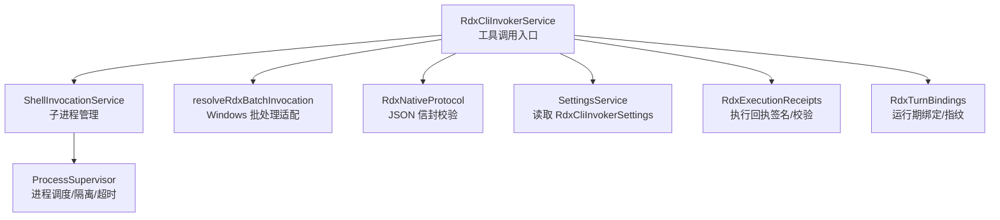
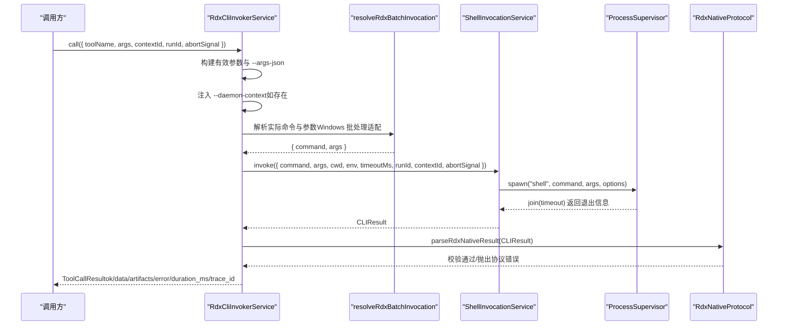
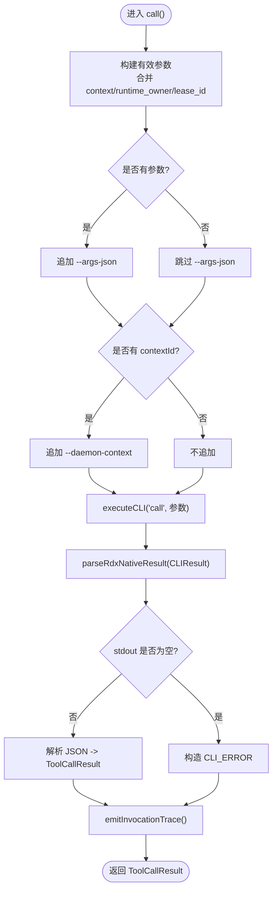
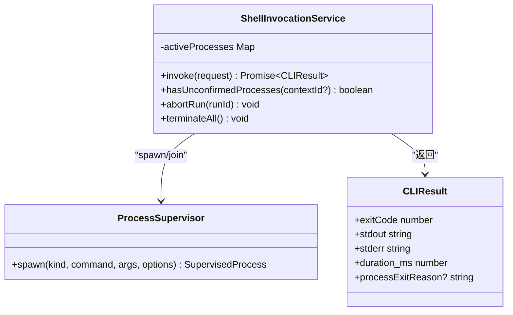
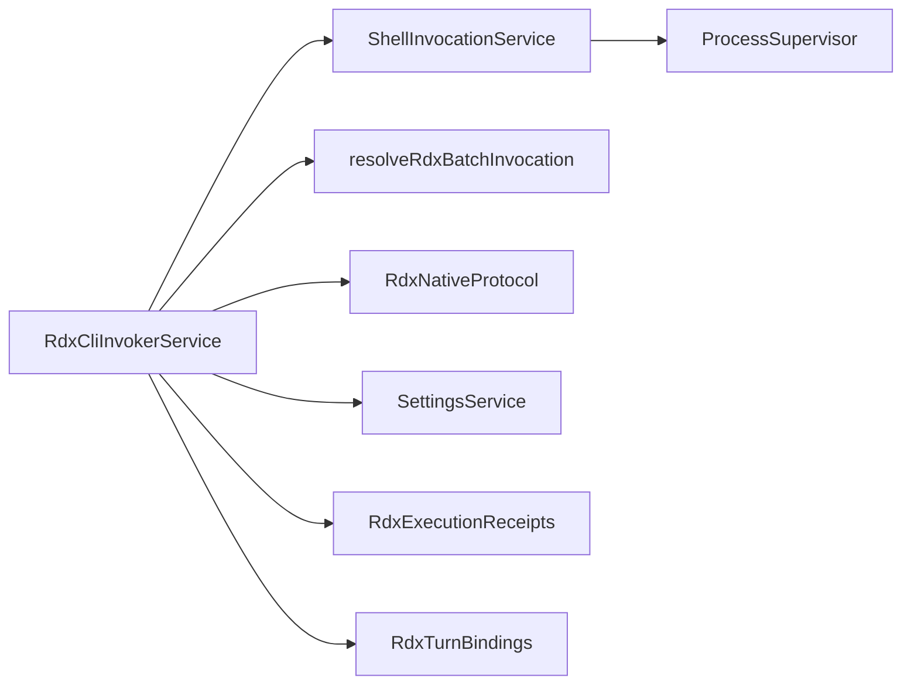

# RDX CLI 调用器

<cite>
**本文引用的文件**
- [RdxCliInvokerService.ts](file://src/main/tools/RdxCliInvokerService.ts)
- [ShellInvocationService.ts](file://src/main/tools/ShellInvocationService.ts)
- [resolveRdxBatchInvocation.ts](file://src/main/tools/resolveRdxBatchInvocation.ts)
- [RdxNativeProtocol.ts](file://src/main/tools/RdxNativeProtocol.ts)
- [tool.ts](file://src/shared/types/tool.ts)
- [settings.ts](file://src/shared/types/settings.ts)
- [RdxExecutionReceipts.ts](file://src/main/tools/RdxExecutionReceipts.ts)
- [RdxTurnBindings.ts](file://src/main/tools/RdxTurnBindings.ts)
- [RdxCliInvokerService.test.ts](file://src/main/tools/RdxCliInvokerService.test.ts)
</cite>

## 目录
1. [简介](#简介)
2. [项目结构](#项目结构)
3. [核心组件](#核心组件)
4. [架构总览](#架构总览)
5. [详细组件分析](#详细组件分析)
6. [依赖关系分析](#依赖关系分析)
7. [性能与可靠性](#性能与可靠性)
8. [故障排查指南](#故障排查指南)
9. [结论](#结论)
10. [附录：API 参考](#附录api-参考)

## 简介
本文件面向需要集成或扩展 RDX CLI 能力的开发者，系统性说明 RdxCliInvokerService 的设计与实现。内容覆盖 CLI 命令执行、参数构建与规范化、结果解析与错误处理、工具目录加载、运行时元数据管理、可用性检查与配置验证、命令行参数规范化、上下文传递、超时控制与进程管理等关键特性，并提供完整的 API 参考与最佳实践建议。

## 项目结构
围绕 RDX CLI 调用器的核心代码主要位于 src/main/tools 目录，配合共享类型定义与设置类型，形成“服务层 + 协议层 + 进程管理层”的分层结构：
- 服务层：RdxCliInvokerService 提供高层工具调用能力（call、executeCLI、loadCatalog、getRuntimeSummary 等）。
- 协议层：RdxNativeProtocol 负责校验并解析 RDX CLI 的 JSON 信封格式。
- 进程管理层：ShellInvocationService 封装子进程生命周期、超时、中止、孤儿进程处理等。
- 平台适配：resolveRdxBatchInvocation 在 Windows 上通过 PowerShell 启动 rdx.bat。
- 类型与配置：shared/types/tool.ts 与 shared/types/settings.ts 定义工具、结果、摘要与调用器配置。
- 审计与绑定：RdxExecutionReceipts 用于生成签名化的执行回执；RdxTurnBindings 用于将 CLI 配置与动作绑定到单次运行上下文。

**图表来源**
- [RdxCliInvokerService.ts:42-367](file://src/main/tools/RdxCliInvokerService.ts#L42-L367)
- [ShellInvocationService.ts:29-127](file://src/main/tools/ShellInvocationService.ts#L29-L127)
- [resolveRdxBatchInvocation.ts:4-21](file://src/main/tools/resolveRdxBatchInvocation.ts#L4-L21)
- [RdxNativeProtocol.ts:1-35](file://src/main/tools/RdxNativeProtocol.ts#L1-L35)
- [RdxExecutionReceipts.ts:38-71](file://src/main/tools/RdxExecutionReceipts.ts#L38-L71)
- [RdxTurnBindings.ts:1-36](file://src/main/tools/RdxTurnBindings.ts#L1-L36)

**章节来源**
- [RdxCliInvokerService.ts:1-367](file://src/main/tools/RdxCliInvokerService.ts#L1-L367)
- [tool.ts:52-142](file://src/shared/types/tool.ts#L52-L142)
- [settings.ts:1-200](file://src/shared/types/settings.ts#L1-L200)

## 核心组件
- RdxCliInvokerService：对外暴露 call、executeCLI、loadCatalog、getRuntimeSummary、isAvailable、abortRun、terminateAll 等方法；内部完成参数构建、上下文注入、超时控制、结果解析与追踪事件发射。
- ShellInvocationService：统一子进程启动、等待、超时、中止、孤儿进程检测与清理；返回标准化的 CLIResult。
- resolveRdxBatchInvocation：在 Windows 平台上将 rdx.bat 调用转换为 powershell.exe -File rdx_bat_launcher.ps1 的形式，并透传非交互标志。
- RdxNativeProtocol：严格校验 RDX CLI 的 JSON 输出信封（ok、result_kind、data、context_id），并在不匹配时抛出协议错误。
- RdxExecutionReceipts：为成功执行的 RDX 操作生成带签名的执行回执，支持读写与完整性校验。
- RdxTurnBindings：将 CLI 配置、动作配置与租约身份冻结并绑定到当前运行计划，避免敏感信息序列化泄露。

**章节来源**
- [RdxCliInvokerService.ts:42-367](file://src/main/tools/RdxCliInvokerService.ts#L42-L367)
- [ShellInvocationService.ts:29-127](file://src/main/tools/ShellInvocationService.ts#L29-L127)
- [resolveRdxBatchInvocation.ts:4-21](file://src/main/tools/resolveRdxBatchInvocation.ts#L4-L21)
- [RdxNativeProtocol.ts:1-35](file://src/main/tools/RdxNativeProtocol.ts#L1-L35)
- [RdxExecutionReceipts.ts:38-71](file://src/main/tools/RdxExecutionReceipts.ts#L38-L71)
- [RdxTurnBindings.ts:1-36](file://src/main/tools/RdxTurnBindings.ts#L1-L36)

## 架构总览
RdxCliInvokerService 作为工具系统对外的统一入口，屏蔽了底层进程管理与协议细节。典型调用流程如下：

**图表来源**
- [RdxCliInvokerService.ts:248-355](file://src/main/tools/RdxCliInvokerService.ts#L248-L355)
- [resolveRdxBatchInvocation.ts:4-21](file://src/main/tools/resolveRdxBatchInvocation.ts#L4-L21)
- [ShellInvocationService.ts:32-105](file://src/main/tools/ShellInvocationService.ts#L32-L105)
- [RdxNativeProtocol.ts:12-34](file://src/main/tools/RdxNativeProtocol.ts#L12-L34)

## 详细组件分析

### RdxCliInvokerService：工具调用与编排
- 功能要点
  - 可用性检查：基于设置项判断是否启用、命令是否存在、工作目录是否可用。
  - 工具目录加载：从 catalogPath 加载工具清单，缓存并按路径变更刷新；未配置时返回空目录。
  - 运行时摘要：统计命名空间工具数量，报告 CLI 可用性与不可用原因。
  - 参数构建与规范化：将 --context-id 标准化为 --daemon-context；分离全局参数与命令参数；拼接 settings.argsPrefix。
  - 上下文传递：自动注入 context_id、runtime_owner、owner_lease_id 到 --args-json；必要时追加 --daemon-context。
  - 超时与中止：继承设置中的 timeoutMs，支持外部 AbortSignal 中断。
  - 结果解析：先进行协议校验，再解析 stdout JSON，映射为 ToolCallResult；失败路径包含 CLI_ERROR、EXECUTION_ERROR 等。
  - 追踪事件：每次调用都会生成 ToolTraceEntry 并通过监听器广播。
  - 进程管理：提供 abortRun、terminateAll 以终止指定或全部子进程。

**图表来源**
- [RdxCliInvokerService.ts:143-176](file://src/main/tools/RdxCliInvokerService.ts#L143-L176)
- [RdxCliInvokerService.ts:248-355](file://src/main/tools/RdxCliInvokerService.ts#L248-L355)

**章节来源**
- [RdxCliInvokerService.ts:42-367](file://src/main/tools/RdxCliInvokerService.ts#L42-L367)

### ShellInvocationService：子进程生命周期管理
- 功能要点
  - 统一入口 invoke：接收命令、参数、工作目录、环境变量、超时、runId、contextId、AbortSignal。
  - 平台适配：Windows 下 .bat/.cmd 使用 shell=true 启动；跨平台隔离进程组。
  - 结果归一化：spawn_failed、timeout、unconfirmed_orphan 等情形分别返回特定 exitCode 与 stderr。
  - 资源清理：finally 中移除活跃进程记录；孤儿进程延迟清理。
  - 批量中止：abortRun 按 runId 中止；terminateAll 终止所有活跃进程。

**图表来源**
- [ShellInvocationService.ts:29-127](file://src/main/tools/ShellInvocationService.ts#L29-L127)

**章节来源**
- [ShellInvocationService.ts:1-127](file://src/main/tools/ShellInvocationService.ts#L1-L127)

### resolveRdxBatchInvocation：Windows 批处理桥接
- 功能要点
  - 仅在 Windows 且命令为 rdx.bat 时生效。
  - 若存在 scripts/rdx_bat_launcher.ps1，则通过 powershell.exe -File 启动，并透传 -NonInteractive（当传入 --non-interactive）。
  - 其他情况直接透传原始命令与参数。

**章节来源**
- [resolveRdxBatchInvocation.ts:1-21](file://src/main/tools/resolveRdxBatchInvocation.ts#L1-L21)

### RdxNativeProtocol：协议校验与信封解析
- 功能要点
  - 要求 exitCode=0 且 stdout 为合法 JSON 对象。
  - 强制 ok:true、result_kind 字符串、data 对象。
  - 可选校验 response context_id 与期望值一致，防止跨上下文响应错配。
  - 不匹配时抛出明确错误码（如 RDX_CLI_PROTOCOL、RDX_CONTEXT_MISMATCH）。

**章节来源**
- [RdxNativeProtocol.ts:1-35](file://src/main/tools/RdxNativeProtocol.ts#L1-L35)

### RdxExecutionReceipts：执行回执与完整性保护
- 功能要点
  - 生成带 HMAC 签名的执行回执，写入会话工件存储。
  - 读取时校验签名、schemaVersion、sessionId、exitCode、resultHash、argsFingerprint。
  - 密钥由 SecretStorageService 管理，避免泄露到工具结果或 IPC。

**章节来源**
- [RdxExecutionReceipts.ts:1-71](file://src/main/tools/RdxExecutionReceipts.ts#L1-L71)

### RdxTurnBindings：运行期绑定与防泄漏
- 功能要点
  - 冻结 CLI 配置、动作配置与租约身份，确保不会序列化到 Prompt/IPC/Trace。
  - 提供绑定与查询接口，以及基于配置的指纹计算。

**章节来源**
- [RdxTurnBindings.ts:1-36](file://src/main/tools/RdxTurnBindings.ts#L1-L36)

## 依赖关系分析
- 低耦合高内聚：RdxCliInvokerService 仅依赖抽象的服务与协议，便于替换与测试。
- 进程隔离：通过 ShellInvocationService 与 ProcessSupervisor 解耦具体进程管理。
- 平台兼容：resolveRdxBatchInvocation 屏蔽 Windows 批处理的差异。
- 类型安全：ToolCallRequest/ToolCallResult/CLIResult/ToolCatalog 等类型集中定义，保证上下游一致性。

**图表来源**
- [RdxCliInvokerService.ts:1-367](file://src/main/tools/RdxCliInvokerService.ts#L1-L367)
- [ShellInvocationService.ts:1-127](file://src/main/tools/ShellInvocationService.ts#L1-L127)
- [resolveRdxBatchInvocation.ts:1-21](file://src/main/tools/resolveRdxBatchInvocation.ts#L1-L21)
- [RdxNativeProtocol.ts:1-35](file://src/main/tools/RdxNativeProtocol.ts#L1-L35)
- [RdxExecutionReceipts.ts:1-71](file://src/main/tools/RdxExecutionReceipts.ts#L1-L71)
- [RdxTurnBindings.ts:1-36](file://src/main/tools/RdxTurnBindings.ts#L1-L36)

**章节来源**
- [RdxCliInvokerService.ts:1-367](file://src/main/tools/RdxCliInvokerService.ts#L1-L367)
- [tool.ts:52-142](file://src/shared/types/tool.ts#L52-L142)

## 性能与可靠性
- 超时控制：默认继承设置中的 timeoutMs；ShellInvocationService 在超时后返回固定 exitCode 与提示消息。
- 进程隔离：非 Windows 平台隔离进程组，降低信号传播风险。
- 孤儿进程：unconfirmed_orphan 场景标记并隔离，避免僵尸进程影响。
- 结果校验：协议层严格校验 JSON 信封，减少下游误判。
- 可观测性：每次调用均产生 ToolTraceEntry，便于追踪与审计。
- 并发与取消：支持 AbortSignal 中断；上层可结合并发策略限制工具调用。

[本节为通用指导，不直接分析具体文件]

## 故障排查指南
- 常见错误与定位
  - 未配置或禁用：getAvailabilityFailure 会返回不可用原因；executeCLI 直接返回 exitCode=2 与提示信息。
  - 命令不存在：Windows 路径或含分隔符的命令需存在；否则返回不可用原因。
  - 协议错误：parseRdxNativeResult 抛出 RDX_CLI_PROTOCOL/RDX_CONTEXT_MISMATCH，需检查 RDX CLI 输出是否符合信封规范。
  - 超时：ShellInvocationService 返回 exitCode=124，stderr 包含超时信息。
  - 孤儿进程：processExitReason='unconfirmed_orphan'，需关注进程终止确认逻辑。
- 调试建议
  - 开启 trace 监听：onInvocationTrace 收集每次调用的入参与结果。
  - 检查 Settings：确认 enabled、command、workingDirectory、env、timeoutMs、catalogPath 等字段。
  - 验证 Windows 批处理：确认 rdx_bat_launcher.ps1 存在并可执行。
  - 查看子进程日志：CLIResult.stderr/stdout 保留完整输出。

**章节来源**
- [RdxCliInvokerService.ts:70-86](file://src/main/tools/RdxCliInvokerService.ts#L70-L86)
- [RdxCliInvokerService.ts:178-221](file://src/main/tools/RdxCliInvokerService.ts#L178-L221)
- [RdxNativeProtocol.ts:12-34](file://src/main/tools/RdxNativeProtocol.ts#L12-L34)
- [ShellInvocationService.ts:67-97](file://src/main/tools/ShellInvocationService.ts#L67-L97)

## 结论
RdxCliInvokerService 提供了稳定、可观测、可配置的 RDX CLI 调用能力，通过严格的协议校验、完善的进程管理与清晰的错误分类，使上层工具系统能够可靠地集成外部 RDX 工具。结合 RdxExecutionReceipts 与 RdxTurnBindings，可在保障安全与完整性的前提下，实现端到端的执行审计与上下文绑定。

[本节为总结性内容，不直接分析具体文件]

## 附录：API 参考

### 类与方法
- RdxCliInvokerService
  - constructor(shell?: ShellInvocationService)
  - getSettings(): RdxCliInvokerSettings
  - createRuntimeMetadata(settings?, catalog?): ToolRuntimeMetadata
  - getAvailabilityFailure(settings?): string | undefined
  - isAvailable(): boolean
  - getRuntimeMetadata(): ToolRuntimeMetadata
  - loadCatalog(): Promise<ToolCatalog>
  - getRuntimeSummary(): Promise<ToolRuntimeSummary>
  - normalizeCliArgs(args: string[]): string[]
  - buildCommandArgs(settings, command, args): string[]
  - executeCLI(command, args?, options?): Promise<CLIResult>
  - onInvocationTrace(listener): () => void
  - emitInvocationTrace(request, result): void
  - call(request: ToolCallRequest): Promise<ToolCallResult>
  - abortRun(runId: string): void
  - terminateAll(): void

- ShellInvocationService
  - invoke(request: ShellInvocationRequest): Promise<CLIResult>
  - hasUnconfirmedProcesses(contextId?: string): boolean
  - abortRun(runId: string): void
  - terminateAll(): void

- resolveRdxBatchInvocation
  - resolveRdxBatchInvocation(command, args): { command: string; args: string[] }

- RdxNativeProtocol
  - parseRdxNativeResult(result: CLIResult, expectedContext?: string): RdxNativeEnvelope

- RdxExecutionReceipts
  - prepare(): void
  - write(receipt: RdxExecutionReceipt, signal?: AbortSignal): InvestigationContentRef
  - read(sessionId: string, ref: InvestigationContentRef): RdxExecutionReceipt

- RdxTurnBindings
  - freezeRdxTurnBinding(cli, actions, identity?): RdxTurnBinding
  - rdxBindingFingerprint(binding): string
  - bindRdxTurn(plan, binding): void
  - getRdxTurnBinding(plan): RdxTurnBinding | undefined

**章节来源**
- [RdxCliInvokerService.ts:42-367](file://src/main/tools/RdxCliInvokerService.ts#L42-L367)
- [ShellInvocationService.ts:29-127](file://src/main/tools/ShellInvocationService.ts#L29-L127)
- [resolveRdxBatchInvocation.ts:4-21](file://src/main/tools/resolveRdxBatchInvocation.ts#L4-L21)
- [RdxNativeProtocol.ts:1-35](file://src/main/tools/RdxNativeProtocol.ts#L1-L35)
- [RdxExecutionReceipts.ts:38-71](file://src/main/tools/RdxExecutionReceipts.ts#L38-L71)
- [RdxTurnBindings.ts:1-36](file://src/main/tools/RdxTurnBindings.ts#L1-L36)

### 类型参考
- ToolCallRequest：包含 toolName、args、turnId、contextId、runtimeOwner、ownerLeaseId、captureRef、runId、abortSignal。
- ToolCallResult：包含 ok、data、error、artifacts、duration_ms、trace_id。
- CLIResult：包含 processExitReason、exitCode、stdout、stderr、duration_ms。
- ToolCatalog/ToolRuntimeMetadata/ToolRuntimeSummary：描述工具目录、运行时元数据与摘要。
- RdxCliInvokerSettings：来自 settings 类型，包含 enabled、command、argsPrefix、workingDirectory、env、timeoutMs、catalogPath、jsonMode 等。

**章节来源**
- [tool.ts:52-142](file://src/shared/types/tool.ts#L52-L142)
- [settings.ts:1-200](file://src/shared/types/settings.ts#L1-L200)

### 使用示例（路径引用）
- 调用外部 RDX CLI 工具并处理 JSON 输出：
  - [RdxCliInvokerService.ts:248-355](file://src/main/tools/RdxCliInvokerService.ts#L248-L355)
- 构建并规范化命令行参数：
  - [RdxCliInvokerService.ts:143-176](file://src/main/tools/RdxCliInvokerService.ts#L143-L176)
- 解析 RDX CLI 协议信封：
  - [RdxNativeProtocol.ts:12-34](file://src/main/tools/RdxNativeProtocol.ts#L12-L34)
- 子进程超时与异常处理：
  - [ShellInvocationService.ts:67-97](file://src/main/tools/ShellInvocationService.ts#L67-L97)
- Windows 批处理桥接：
  - [resolveRdxBatchInvocation.ts:4-21](file://src/main/tools/resolveRdxBatchInvocation.ts#L4-L21)
- 执行回执签名与校验：
  - [RdxExecutionReceipts.ts:44-68](file://src/main/tools/RdxExecutionReceipts.ts#L44-L68)
- 运行期绑定与指纹：
  - [RdxTurnBindings.ts:17-33](file://src/main/tools/RdxTurnBindings.ts#L17-L33)

**章节来源**
- [RdxCliInvokerService.ts:143-355](file://src/main/tools/RdxCliInvokerService.ts#L143-L355)
- [RdxNativeProtocol.ts:12-34](file://src/main/tools/RdxNativeProtocol.ts#L12-L34)
- [ShellInvocationService.ts:67-97](file://src/main/tools/ShellInvocationService.ts#L67-L97)
- [resolveRdxBatchInvocation.ts:4-21](file://src/main/tools/resolveRdxBatchInvocation.ts#L4-L21)
- [RdxExecutionReceipts.ts:44-68](file://src/main/tools/RdxExecutionReceipts.ts#L44-L68)
- [RdxTurnBindings.ts:17-33](file://src/main/tools/RdxTurnBindings.ts#L17-L33)

### 集成最佳实践
- 始终通过 call() 发起工具调用，避免绕过参数构建与上下文注入。
- 合理设置 timeoutMs，并结合 AbortSignal 实现任务级取消。
- 使用 onInvocationTrace 订阅调用轨迹，便于审计与问题定位。
- 在 Windows 环境下确保 rdx_bat_launcher.ps1 存在且可执行。
- 使用 RdxExecutionReceipts 保存关键操作的执行回执，保障可追溯性。
- 使用 RdxTurnBindings 将 CLI 配置与动作绑定到运行上下文，避免敏感信息外泄。

[本节为通用指导，不直接分析具体文件]

### 测试与断言参考
- 行为验证：getRuntimeSummary 不包含不推荐字段；上下文作用域的参数与上下文 ID 正确传递。
- 参考用例：
  - [RdxCliInvokerService.test.ts:24-47](file://src/main/tools/RdxCliInvokerService.test.ts#L24-L47)

**章节来源**
- [RdxCliInvokerService.test.ts:1-48](file://src/main/tools/RdxCliInvokerService.test.ts#L1-L48)