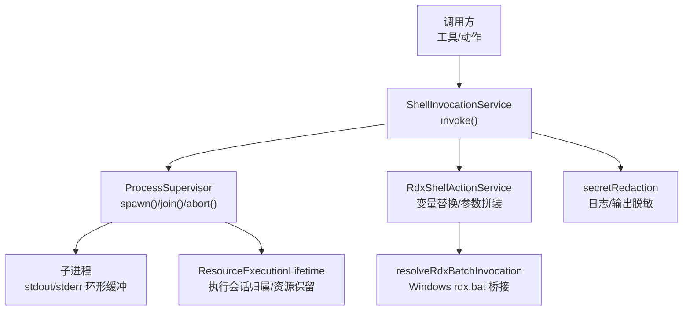
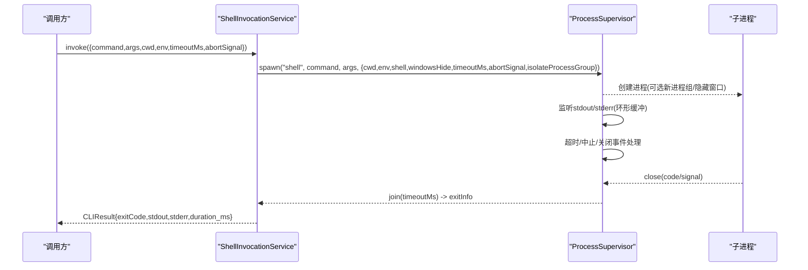
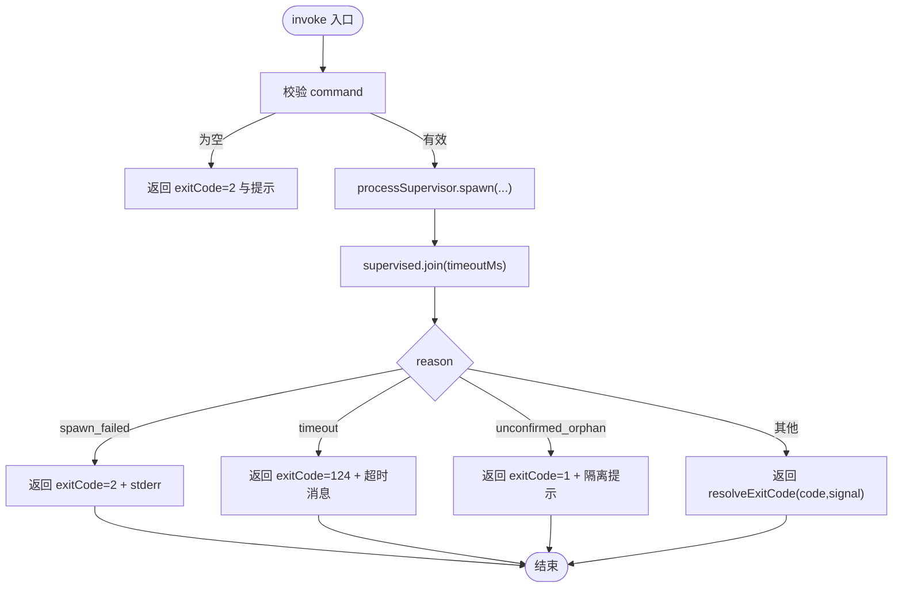
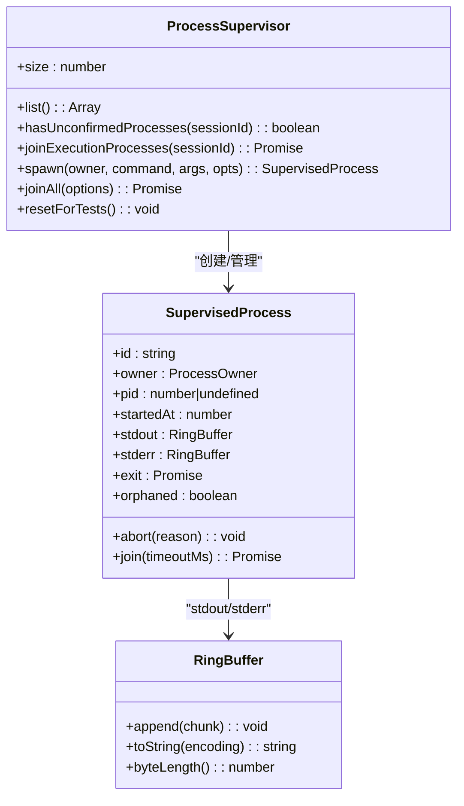
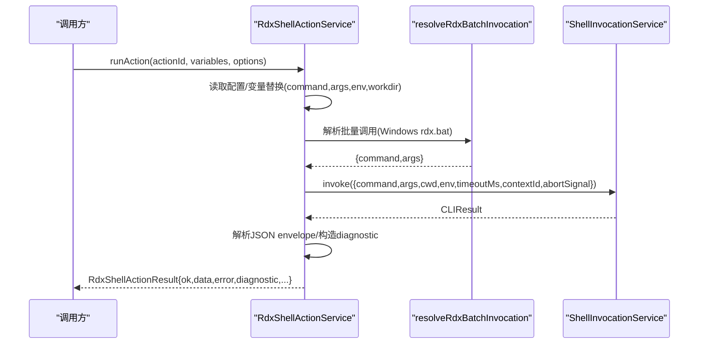
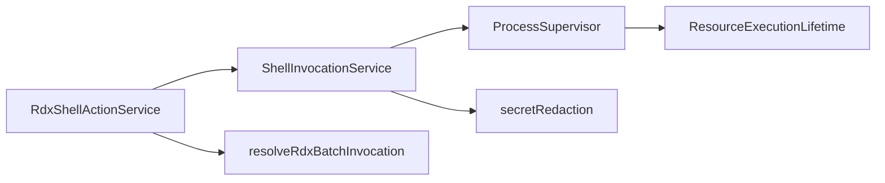

# Shell 执行服务

<cite>
**本文引用的文件**
- [ShellInvocationService.ts](file://src/main/tools/ShellInvocationService.ts)
- [ProcessSupervisor.ts](file://src/main/runtime/ProcessSupervisor.ts)
- [RdxShellActionService.ts](file://src/main/tools/RdxShellActionService.ts)
- [resolveRdxBatchInvocation.ts](file://src/main/tools/resolveRdxBatchInvocation.ts)
- [ResourceExecutionLifetime.ts](file://src/main/runtime/ResourceExecutionLifetime.ts)
- [secretRedaction.ts](file://src/main/runtime/secretRedaction.ts)
</cite>

## 目录
1. [简介](#简介)
2. [项目结构](#项目结构)
3. [核心组件](#核心组件)
4. [架构总览](#架构总览)
5. [详细组件分析](#详细组件分析)
6. [依赖关系分析](#依赖关系分析)
7. [性能考量](#性能考量)
8. [故障排查指南](#故障排查指南)
9. [结论](#结论)
10. [附录：安全配置与最佳实践](#附录：安全配置与最佳实践)

## 简介
本文件面向 RDC-Agent 的 Shell 执行服务，聚焦于 ShellInvocationService 的 shell 环境管理、进程生命周期控制与安全沙箱机制。文档将系统说明命令执行流程、环境变量注入、工作目录设置、超时处理与进程终止；并覆盖进程监控、资源限制、并发控制与错误恢复等高级特性。同时提供安全配置指南，帮助在受控环境中安全地执行外部命令、处理敏感信息以及监控进程状态。

## 项目结构
围绕 Shell 执行的关键代码主要分布在以下模块：
- 工具层：ShellInvocationService（统一入口）、RdxShellActionService（RDX 动作编排）、resolveRdxBatchInvocation（Windows rdx.bat 启动桥接）
- 运行时层：ProcessSupervisor（进程注册表、树杀、环形缓冲、超时/中止/孤儿检测）、ResourceExecutionLifetime（资源生命周期与执行上下文归属）
- 安全层：secretRedaction（日志与输出中的敏感信息脱敏）

图示来源
- [ShellInvocationService.ts:29-126](file://src/main/tools/ShellInvocationService.ts#L29-L126)
- [ProcessSupervisor.ts:140-425](file://src/main/runtime/ProcessSupervisor.ts#L140-L425)
- [RdxShellActionService.ts:154-278](file://src/main/tools/RdxShellActionService.ts#L154-L278)
- [resolveRdxBatchInvocation.ts:4-21](file://src/main/tools/resolveRdxBatchInvocation.ts#L4-L21)
- [ResourceExecutionLifetime.ts:1-21](file://src/main/runtime/ResourceExecutionLifetime.ts#L1-L21)
- [secretRedaction.ts:1-103](file://src/main/runtime/secretRedaction.ts#L1-L103)

章节来源
- [ShellInvocationService.ts:29-126](file://src/main/tools/ShellInvocationService.ts#L29-L126)
- [ProcessSupervisor.ts:140-425](file://src/main/runtime/ProcessSupervisor.ts#L140-L425)
- [RdxShellActionService.ts:154-278](file://src/main/tools/RdxShellActionService.ts#L154-L278)
- [resolveRdxBatchInvocation.ts:4-21](file://src/main/tools/resolveRdxBatchInvocation.ts#L4-L21)
- [ResourceExecutionLifetime.ts:1-21](file://src/main/runtime/ResourceExecutionLifetime.ts#L1-L21)
- [secretRedaction.ts:1-103](file://src/main/runtime/secretRedaction.ts#L1-L103)

## 核心组件
- ShellInvocationService：对外暴露 invoke(request)，负责命令校验、shell 选择、环境变量合并、工作目录设置、超时与中止信号透传、结果归一化、活跃进程跟踪与清理。
- ProcessSupervisor：统一的子进程注册与生命周期管理，提供 spawn/join/abort、树级终止、超时强制终止、孤儿进程检测、环形缓冲输出、执行会话归属与资源保留。
- RdxShellActionService：读取配置、变量替换、参数与环境拼装，委托 ShellInvocationService 执行，并对 stdout JSON 进行解析与诊断格式化。
- resolveRdxBatchInvocation：在 Windows 上对 rdx.bat 调用进行 PowerShell 桥接，确保非交互模式与执行策略。
- ResourceExecutionLifetime：通过 AsyncLocalStorage 维护执行上下文与资源保留，保证未确认退出的进程资源不被提前释放。
- secretRedaction：递归脱敏日志与输出中的密钥、令牌、大对象等敏感内容。

章节来源
- [ShellInvocationService.ts:29-126](file://src/main/tools/ShellInvocationService.ts#L29-L126)
- [ProcessSupervisor.ts:140-425](file://src/main/runtime/ProcessSupervisor.ts#L140-L425)
- [RdxShellActionService.ts:154-278](file://src/main/tools/RdxShellActionService.ts#L154-L278)
- [resolveRdxBatchInvocation.ts:4-21](file://src/main/tools/resolveRdxBatchInvocation.ts#L4-L21)
- [ResourceExecutionLifetime.ts:1-21](file://src/main/runtime/ResourceExecutionLifetime.ts#L1-L21)
- [secretRedaction.ts:1-103](file://src/main/runtime/secretRedaction.ts#L1-L103)

## 架构总览
Shell 执行服务采用“上层工具/动作 → 统一 Shell 服务 → 进程监督器”的分层设计。上层只关心命令、参数、环境与超时；底层负责跨平台进程隔离、树杀、超时与孤儿检测。所有输出经环形缓冲限制内存占用，并在日志中做敏感信息脱敏。

图示来源
- [ShellInvocationService.ts:32-105](file://src/main/tools/ShellInvocationService.ts#L32-L105)
- [ProcessSupervisor.ts:167-394](file://src/main/runtime/ProcessSupervisor.ts#L167-L394)

## 详细组件分析

### ShellInvocationService：命令执行与结果归一化
- 命令校验：空命令直接返回特定退出码与提示。
- Shell 选择：在 Windows 上针对 .bat/.cmd 自动启用 shell。
- 环境与会话：合并 process.env 与请求 env，固定 PYTHONIOENCODING=utf-8；记录 runId/contextId 用于后续中断与审计。
- 进程创建：调用 ProcessSupervisor.spawn，传入 cwd、env、shell、windowsHide、timeoutMs、abortSignal、isolateProcessGroup（非 Windows 使用进程组隔离）。
- 结果处理：根据 reason 区分 spawn_failed、timeout、unconfirmed_orphan 或正常退出；统一转换为 CLIResult。
- 活跃进程管理：维护 Map<procId, supervised>，支持 abortRun/terminateAll 与 hasUnconfirmedProcesses 查询。

图示来源
- [ShellInvocationService.ts:32-105](file://src/main/tools/ShellInvocationService.ts#L32-L105)

章节来源
- [ShellInvocationService.ts:7-27](file://src/main/tools/ShellInvocationService.ts#L7-L27)
- [ShellInvocationService.ts:29-126](file://src/main/tools/ShellInvocationService.ts#L29-L126)

### ProcessSupervisor：进程生命周期与资源保护
- 进程注册表：以 id 为键登记 entry，包含 supervised、child、定时器、中止处理器、执行会话归属等。
- 树级终止：POSIX 使用 -pid 发送 SIGTERM/SIGKILL；Windows 使用 taskkill /T /F。
- 超时与中止：支持 timeoutMs 与 AbortSignal；超时触发 abort('timeout')，并观察是否成功退出，否则标记 orphaned。
- 孤儿检测：若强制终止后未在宽限期内观察到 child.close，则返回 unconfirmed_orphan 并保留资源直到真正退出。
- 输出缓冲：stdout/stderr 使用 RingBuffer 限制最大字节数，避免内存膨胀。
- 生命周期：shuttingDown 标志阻止新 spawn；joinAll 统一中止并等待退出；resetForTests 便于测试重置。

图示来源
- [ProcessSupervisor.ts:18-72](file://src/main/runtime/ProcessSupervisor.ts#L18-L72)
- [ProcessSupervisor.ts:77-102](file://src/main/runtime/ProcessSupervisor.ts#L77-L102)
- [ProcessSupervisor.ts:140-425](file://src/main/runtime/ProcessSupervisor.ts#L140-L425)

章节来源
- [ProcessSupervisor.ts:18-72](file://src/main/runtime/ProcessSupervisor.ts#L18-L72)
- [ProcessSupervisor.ts:77-102](file://src/main/runtime/ProcessSupervisor.ts#L77-L102)
- [ProcessSupervisor.ts:119-138](file://src/main/runtime/ProcessSupervisor.ts#L119-L138)
- [ProcessSupervisor.ts:140-425](file://src/main/runtime/ProcessSupervisor.ts#L140-L425)

### RdxShellActionService：动作编排与结果解析
- 配置读取：从 settingsService 获取 action 配置，未配置时返回结构化错误与修复提示。
- 变量替换：workspaceRoot、logsPath、projectsPath、knowledgePath 等内置变量，支持 {{key}} 模板替换。
- 参数与环境：对 command、args、env、workingDirectory 进行变量替换；合并 options.env。
- 批量调用：resolveRdxBatchInvocation 处理 Windows rdx.bat 的 PowerShell 桥接。
- 结果解析：要求 stdout 为规范 JSON envelope，解析 data、ok、error/diagnostic；失败时生成诊断信息。
- 日志记录：记录 action 执行摘要、命令、参数、退出码、输出与诊断。

图示来源
- [RdxShellActionService.ts:154-278](file://src/main/tools/RdxShellActionService.ts#L154-L278)
- [resolveRdxBatchInvocation.ts:4-21](file://src/main/tools/resolveRdxBatchInvocation.ts#L4-L21)
- [ShellInvocationService.ts:32-105](file://src/main/tools/ShellInvocationService.ts#L32-L105)

章节来源
- [RdxShellActionService.ts:8-152](file://src/main/tools/RdxShellActionService.ts#L8-L152)
- [RdxShellActionService.ts:154-278](file://src/main/tools/RdxShellActionService.ts#L154-L278)
- [resolveRdxBatchInvocation.ts:4-21](file://src/main/tools/resolveRdxBatchInvocation.ts#L4-L21)

### 环境变量注入与工作目录设置
- 环境变量：默认继承 process.env，叠加请求 env，并固定 PYTHONIOENCODING=utf-8，确保 Python 子程序输出编码一致。
- 工作目录：支持通过 request.cwd 指定；RdxShellActionService 支持 workingDirectory 变量替换。
- 安全建议：避免向子进程传递不必要的敏感环境变量；如需传递，应在上游进行最小化白名单过滤与脱敏。

章节来源
- [ShellInvocationService.ts:44-57](file://src/main/tools/ShellInvocationService.ts#L44-L57)
- [RdxShellActionService.ts:187-213](file://src/main/tools/RdxShellActionService.ts#L187-L213)

### 超时处理与进程终止
- 超时：ProcessSupervisor 在 spawn 时设置 timeoutMs；到达时限触发 abort('timeout')，并尝试优雅终止，随后强制 SIGKILL。
- 中止：支持 AbortSignal；调用 abort('abort') 立即发起终止流程。
- 孤儿检测：若强制终止后未在宽限期内观察到 close，则标记 orphaned，并返回 unconfirmed_orphan；资源保留至真正退出。
- 结果映射：ShellInvocationService 将 reason 映射为明确的 exitCode 与提示信息。

章节来源
- [ProcessSupervisor.ts:270-343](file://src/main/runtime/ProcessSupervisor.ts#L270-L343)
- [ProcessSupervisor.ts:376-391](file://src/main/runtime/ProcessSupervisor.ts#L376-L391)
- [ShellInvocationService.ts:67-91](file://src/main/tools/ShellInvocationService.ts#L67-L91)

### 进程监控、资源限制与并发控制
- 进程监控：ProcessSupervisor 提供 list()、hasUnconfirmedProcesses()、joinExecutionProcesses()；ShellInvocationService 提供 hasUnconfirmedProcesses(contextId?)、abortRun(runId)、terminateAll()。
- 资源限制：stdout/stderr 使用 RingBuffer 限制最大字节数（默认 256 KiB），防止无限增长；可通过 ringBufferBytes 调整。
- 并发控制：每个 invoke 独立进程；活跃进程通过 Map 追踪；terminateAll 可一次性中止全部进程；joinAll 在关闭阶段统一回收。
- 执行会话归属：ResourceExecutionLifetime 提供 withProcessExecutionOwner/currentProcessExecutionOwner，用于关联执行上下文。

章节来源
- [ProcessSupervisor.ts:140-165](file://src/main/runtime/ProcessSupervisor.ts#L140-L165)
- [ProcessSupervisor.ts:396-421](file://src/main/runtime/ProcessSupervisor.ts#L396-L421)
- [ShellInvocationService.ts:107-123](file://src/main/tools/ShellInvocationService.ts#L107-L123)
- [ResourceExecutionLifetime.ts:16-21](file://src/main/runtime/ResourceExecutionLifetime.ts#L16-L21)

### 错误恢复与诊断
- 标准化退出码：resolveExitCode 将 signal 转换为 128+signalNumber，缺失时回退到 1。
- 结构化诊断：RdxShellActionService 将错误解析为 diagnostic（message/classification/fixHint/failedStep/renderdocStatus），便于前端展示与定位。
- 孤儿恢复：unconfirmed_orphan 场景下，资源保留直至 child.close 被观测到，避免资源泄漏与重复使用。

章节来源
- [ShellInvocationService.ts:18-27](file://src/main/tools/ShellInvocationService.ts#L18-L27)
- [RdxShellActionService.ts:109-152](file://src/main/tools/RdxShellActionService.ts#L109-L152)
- [ProcessSupervisor.ts:312-343](file://src/main/runtime/ProcessSupervisor.ts#L312-L343)

## 依赖关系分析
- ShellInvocationService 依赖 ProcessSupervisor 完成进程生命周期管理。
- RdxShellActionService 依赖 SettingsService、AppPathService、ShellInvocationService 与 resolveRdxBatchInvocation。
- ProcessSupervisor 依赖 ResourceExecutionLifetime 进行执行上下文与资源保留。
- secretRedaction 在日志与输出路径中被复用，确保敏感信息不泄露。

图示来源
- [ShellInvocationService.ts:29-126](file://src/main/tools/ShellInvocationService.ts#L29-L126)
- [ProcessSupervisor.ts:140-425](file://src/main/runtime/ProcessSupervisor.ts#L140-L425)
- [RdxShellActionService.ts:154-278](file://src/main/tools/RdxShellActionService.ts#L154-L278)
- [resolveRdxBatchInvocation.ts:4-21](file://src/main/tools/resolveRdxBatchInvocation.ts#L4-L21)
- [ResourceExecutionLifetime.ts:1-21](file://src/main/runtime/ResourceExecutionLifetime.ts#L1-L21)
- [secretRedaction.ts:1-103](file://src/main/runtime/secretRedaction.ts#L1-L103)

章节来源
- [ShellInvocationService.ts:29-126](file://src/main/tools/ShellInvocationService.ts#L29-L126)
- [ProcessSupervisor.ts:140-425](file://src/main/runtime/ProcessSupervisor.ts#L140-L425)
- [RdxShellActionService.ts:154-278](file://src/main/tools/RdxShellActionService.ts#L154-L278)
- [resolveRdxBatchInvocation.ts:4-21](file://src/main/tools/resolveRdxBatchInvocation.ts#L4-L21)
- [ResourceExecutionLifetime.ts:1-21](file://src/main/runtime/ResourceExecutionLifetime.ts#L1-L21)
- [secretRedaction.ts:1-103](file://src/main/runtime/secretRedaction.ts#L1-L103)

## 性能考量
- 输出缓冲：RingBuffer 限制 stdout/stderr 最大字节数，避免内存暴涨；可根据任务规模调整 ringBufferBytes。
- 超时与中止：合理设置 timeoutMs 与使用 AbortSignal，避免长时间阻塞；超时后尽快强制终止，减少资源占用。
- 进程组隔离：非 Windows 平台使用进程组隔离，提高终止效率与安全性。
- 日志脱敏：secretRedaction 递归处理，注意在高吞吐场景下的 CPU 开销，必要时对超大对象进行采样或截断。

[本节为通用指导，不直接分析具体文件]

## 故障排查指南
- 命令为空：检查传入 command 是否为空字符串或仅空白字符。
- spawn 失败：关注 stderr 与 error.message；常见原因包括命令不存在、权限不足、路径错误。
- 超时：确认 timeoutMs 是否过小；查看是否设置了 AbortSignal；检查子进程是否卡死。
- 孤儿进程：若出现 unconfirmed_orphan，需检查操作系统进程树是否被正确清理；必要时提升 kill 优先级或增加宽限期。
- 输出过大：增大 ringBufferBytes 或在上游限制输出；避免打印大量调试信息。
- 敏感信息泄露：确保日志与输出经过 secretRedaction；避免在 env/command/args 中明文携带密钥。

章节来源
- [ShellInvocationService.ts:32-105](file://src/main/tools/ShellInvocationService.ts#L32-L105)
- [ProcessSupervisor.ts:270-343](file://src/main/runtime/ProcessSupervisor.ts#L270-L343)
- [secretRedaction.ts:22-103](file://src/main/runtime/secretRedaction.ts#L22-L103)

## 结论
Shell 执行服务通过 ShellInvocationService 与 ProcessSupervisor 的组合，提供了跨平台的命令执行、进程生命周期管理、超时与中止、孤儿检测与资源保护能力。RdxShellActionService 在此基础上实现了动作编排与结构化诊断。配合 secretRedaction 与资源限制，可在安全可控的环境中执行外部命令。建议在配置与调用侧遵循最小权限原则，严格限制环境变量与工作目录，并合理设置超时与缓冲大小。

[本节为总结性内容，不直接分析具体文件]

## 附录：安全配置与最佳实践
- 命令与参数白名单：仅允许预定义的可执行命令与参数集合，拒绝任意拼接。
- 环境变量最小化：仅注入必要的环境变量；对敏感键进行白名单过滤与脱敏。
- 工作目录限制：限定在受限目录内执行，避免访问系统关键路径。
- 超时与中止：始终设置合理的 timeoutMs；在用户取消或会话结束时及时调用 abort。
- 输出与日志脱敏：对所有 stdout/stderr 与日志进行 secretRedaction；避免记录完整令牌或密钥。
- 进程隔离：非 Windows 平台保持 isolateProcessGroup=true；Windows 使用 windowsHide=true 与 taskkill /T /F。
- 监控与审计：定期调用 list()/hasUnconfirmedProcesses()；记录执行摘要与诊断信息，便于回溯。
- 资源限制：根据任务需求调整 ringBufferBytes；避免无界输出导致 OOM。
- 错误恢复：对 unconfirmed_orphan 场景进行重试或告警；确保资源最终释放。

[本节为通用指导，不直接分析具体文件]