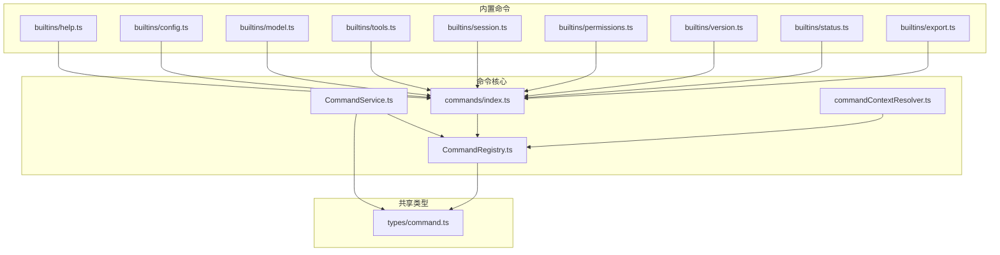
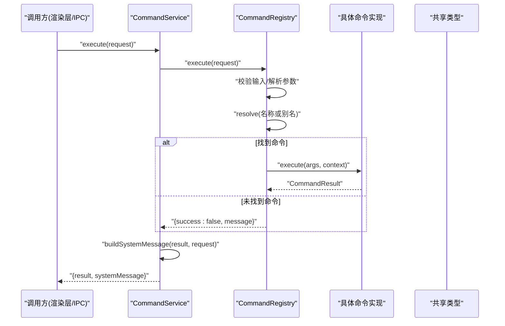
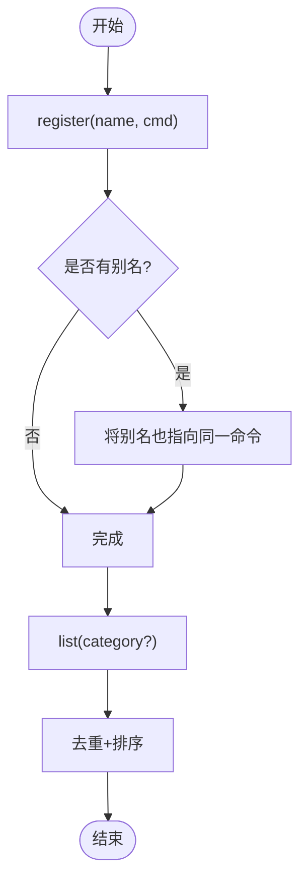
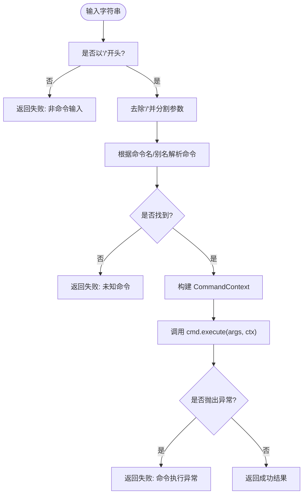
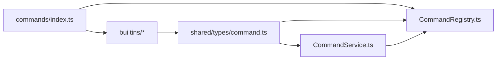

# 命令注册中心

<cite>
**本文引用的文件**
- [CommandRegistry.ts](file://src/main/commands/CommandRegistry.ts)
- [CommandService.ts](file://src/main/commands/CommandService.ts)
- [index.ts](file://src/main/commands/index.ts)
- [commandContextResolver.ts](file://src/main/commands/commandContextResolver.ts)
- [command.ts](file://src/shared/types/command.ts)
- [help.ts](file://src/main/commands/builtins/help.ts)
- [config.ts](file://src/main/commands/builtins/config.ts)
- [model.ts](file://src/main/commands/builtins/model.ts)
- [tools.ts](file://src/main/commands/builtins/tools.ts)
- [session.ts](file://src/main/commands/builtins/session.ts)
- [permissions.ts](file://src/main/commands/builtins/permissions.ts)
- [version.ts](file://src/main/commands/builtins/version.ts)
- [status.ts](file://src/main/commands/builtins/status.ts)
- [export.ts](file://src/main/commands/builtins/export.ts)
</cite>

## 目录
1. [简介](#简介)
2. [项目结构](#项目结构)
3. [核心组件](#核心组件)
4. [架构总览](#架构总览)
5. [详细组件分析](#详细组件分析)
6. [依赖关系分析](#依赖关系分析)
7. [性能考量](#性能考量)
8. [故障排查指南](#故障排查指南)
9. [结论](#结论)
10. [附录：命令开发指南](#附录命令开发指南)

## 简介
本文件围绕“命令注册中心”展开，系统性说明 CommandRegistry 的命令发现、注册与执行机制；解析内置命令的实现模式、参数解析、上下文绑定与权限控制；并覆盖命令生命周期管理、依赖注入、错误处理与调试支持。文末提供自定义命令开发指南，包括命令间通信与集成到应用工作流的最佳实践。

## 项目结构
命令系统位于主进程侧，采用“注册表 + 服务桥接 + 内置命令集合”的分层组织：
- 共享类型定义在 shared/types/command.ts，统一描述命令上下文、结果、UI 动作与请求/响应契约。
- 命令注册中心 CommandRegistry 负责命令的注册、别名映射、列表查询与执行路由。
- 命令服务 CommandService 封装执行流程，将结果转换为对话消息（system message）以便渲染层展示。
- 内置命令集中在 commands/builtins 下，按功能划分（系统、导航、调试、工作流等）。
- index.ts 暴露全局单例注册表，并在首次获取时自动注册所有内置命令。
- commandContextResolver 用于从外部服务构造命令上下文。

图表来源
- [CommandRegistry.ts:1-116](file://src/main/commands/CommandRegistry.ts#L1-L116)
- [CommandService.ts:1-74](file://src/main/commands/CommandService.ts#L1-L74)
- [index.ts:1-69](file://src/main/commands/index.ts#L1-L69)
- [commandContextResolver.ts:1-26](file://src/main/commands/commandContextResolver.ts#L1-L26)
- [command.ts:1-90](file://src/shared/types/command.ts#L1-L90)
- [help.ts:1-49](file://src/main/commands/builtins/help.ts#L1-L49)
- [config.ts:1-20](file://src/main/commands/builtins/config.ts#L1-L20)
- [model.ts:1-31](file://src/main/commands/builtins/model.ts#L1-L31)
- [tools.ts:1-27](file://src/main/commands/builtins/tools.ts#L1-L27)
- [session.ts:1-29](file://src/main/commands/builtins/session.ts#L1-L29)
- [permissions.ts:1-33](file://src/main/commands/builtins/permissions.ts#L1-L33)
- [version.ts:1-29](file://src/main/commands/builtins/version.ts#L1-L29)
- [status.ts:1-32](file://src/main/commands/builtins/status.ts#L1-L32)
- [export.ts:1-22](file://src/main/commands/builtins/export.ts#L1-L22)

章节来源
- [CommandRegistry.ts:1-116](file://src/main/commands/CommandRegistry.ts#L1-L116)
- [CommandService.ts:1-74](file://src/main/commands/CommandService.ts#L1-L74)
- [index.ts:1-69](file://src/main/commands/index.ts#L1-L69)
- [commandContextResolver.ts:1-26](file://src/main/commands/commandContextResolver.ts#L1-L26)
- [command.ts:1-90](file://src/shared/types/command.ts#L1-L90)

## 核心组件
- 命令注册中心 CommandRegistry
  - 维护命令映射（名称→定义），支持别名注册与注销。
  - 提供命令列表查询（可按类别过滤）、命令解析与执行。
  - 执行入口统一校验输入格式、解析参数、构建上下文、调用命令实现并捕获异常。
- 命令服务 CommandService
  - 封装 Registry.execute，将结果包装为 system message，附带 workTrace 信息，便于 UI 展示与追踪。
  - 协调后续会话消息投递与状态更新（由上层消费）。
- 共享类型与上下文
  - CommandContext：携带会话、项目、工作区、Agent、模式、模型、主题等运行时上下文。
  - CommandResult：包含 success、message、data、systemMessage、uiAction、invalidateStores 等。
  - CommandUiAction：结构化 UI 动作（如打开设置、切换模型/主题/权限、导出会话、撤销/清理会话、运行技能等）。
  - CommandDefinition：命令元数据与 execute 函数签名。
  - CommandExecuteRequest / CommandListResult：IPC 请求与列表响应契约。

章节来源
- [CommandRegistry.ts:18-114](file://src/main/commands/CommandRegistry.ts#L18-L114)
- [CommandService.ts:17-72](file://src/main/commands/CommandService.ts#L17-L72)
- [command.ts:5-90](file://src/shared/types/command.ts#L5-L90)

## 架构总览
命令系统以“注册表为中心”，通过服务层对外暴露执行能力；内置命令按需扩展，遵循统一的定义与返回协议。

图表来源
- [CommandService.ts:20-72](file://src/main/commands/CommandService.ts#L20-L72)
- [CommandRegistry.ts:73-114](file://src/main/commands/CommandRegistry.ts#L73-L114)
- [command.ts:56-78](file://src/shared/types/command.ts#L56-L78)

## 详细组件分析

### 命令注册与发现
- 注册与别名
  - register 将命令主名与别名同时写入映射表，同名覆盖策略保证最后注册者胜出。
  - unregister 会同步删除主名与对应别名条目，避免残留引用。
- 查找与列举
  - resolve 支持主名与别名直接查找。
  - list 去重并按名称排序，支持按 category 过滤，供 UI 自动补全使用。
- 生命周期
  - 通过 index.ts 的全局 getRegistry 单例，首次创建后自动注册全部内置命令，确保启动即可用。

图表来源
- [CommandRegistry.ts:21-71](file://src/main/commands/CommandRegistry.ts#L21-L71)
- [index.ts:31-68](file://src/main/commands/index.ts#L31-L68)

章节来源
- [CommandRegistry.ts:21-71](file://src/main/commands/CommandRegistry.ts#L21-L71)
- [index.ts:31-68](file://src/main/commands/index.ts#L31-L68)

### 命令执行与参数解析
- 输入校验
  - 必须以“/”开头，否则返回失败提示。
- 参数拆分
  - 去除前导“/”后按空白分割，首段为命令名，其余为参数数组。
- 上下文构建
  - 将请求中的 sessionId、projectId、workspaceRoot、agentId、currentMode、currentModelId、currentTheme 透传至命令。
- 执行与异常
  - 调用命令 execute(args, context)，捕获异常并转为失败结果，附带错误消息。

图表来源
- [CommandRegistry.ts:73-114](file://src/main/commands/CommandRegistry.ts#L73-L114)
- [command.ts:72-78](file://src/shared/types/command.ts#L72-L78)

章节来源
- [CommandRegistry.ts:73-114](file://src/main/commands/CommandRegistry.ts#L73-L114)

### 内置命令实现模式
- 帮助命令 help
  - 列出所有命令或查看指定命令详情；支持别名 h/?。
- 配置命令 config
  - 打开设置或跳转特定配置项；通过 uiAction 触发界面行为。
- 模型命令 model
  - 显示当前模型或切换到指定模型；支持“default”跟随 Agent 配置。
- 工具命令 tools
  - 列出可用工具或查看工具详情；基于内置工具标识集合。
- 会话命令 session
  - 支持 list/new/rename/resume 等操作；读取/写入会话上下文。
- 权限命令 permissions
  - 查看或切换权限模式；对非法模式进行校验。
- 版本命令 version
  - 输出应用版本、Electron/Node/Chrome 环境信息。
- 状态命令 status
  - 汇总系统诊断信息（会话、项目、工作区、Agent、平台等）。
- 导出命令 export
  - 将当前会话导出为 Markdown 或 JSON；通过 uiAction 驱动导出流程。

章节来源
- [help.ts:7-47](file://src/main/commands/builtins/help.ts#L7-L47)
- [config.ts:6-18](file://src/main/commands/builtins/config.ts#L6-L18)
- [model.ts:3-29](file://src/main/commands/builtins/model.ts#L3-L29)
- [tools.ts:7-25](file://src/main/commands/builtins/tools.ts#L7-L25)
- [session.ts:6-27](file://src/main/commands/builtins/session.ts#L6-L27)
- [permissions.ts:5-31](file://src/main/commands/builtins/permissions.ts#L5-L31)
- [version.ts:15-27](file://src/main/commands/builtins/version.ts#L15-L27)
- [status.ts:6-29](file://src/main/commands/builtins/status.ts#L6-L29)
- [export.ts:3-19](file://src/main/commands/builtins/export.ts#L3-L19)

### 上下文绑定与权限控制
- 上下文绑定
  - CommandContext 由调用方传入，包含会话、项目、工作区、Agent、模式、模型、主题等关键信息。
  - commandContextResolver 提供便捷构造方法，便于在主进程侧组装上下文。
- 权限控制
  - 权限命令支持多种模式（默认、自动审查、完全访问、自定义），并对非法模式进行拒绝。
  - 命令可通过 uiAction 触发权限相关界面操作（如 switch-permissions）。

章节来源
- [command.ts:5-21](file://src/shared/types/command.ts#L5-L21)
- [commandContextResolver.ts:7-25](file://src/main/commands/commandContextResolver.ts#L7-L25)
- [permissions.ts:12-31](file://src/main/commands/builtins/permissions.ts#L12-L31)

### 命令服务与消息转换
- CommandService 将命令执行结果转换为 system message，包含：
  - 唯一 ID、轮次 ID、会话/项目 ID、角色、内容、状态、时间戳。
  - workTrace 块记录命令标题、状态、摘要与工具调用（为空时保留占位）。
- 该消息可直接插入对话流，便于用户理解命令执行过程与结果。

章节来源
- [CommandService.ts:20-72](file://src/main/commands/CommandService.ts#L20-L72)

## 依赖关系分析
- 模块内聚性
  - CommandRegistry 仅依赖共享类型，职责单一，内聚度高。
  - CommandService 依赖 Registry 与共享类型，承担适配与消息构造职责。
- 外部耦合
  - 内置命令可能依赖 Electron 或业务服务（如版本命令访问 app.getVersion），但通过命令接口隔离。
- 循环依赖
  - 通过 index.ts 集中注册，避免命令与注册表之间的循环导入。

图表来源
- [CommandRegistry.ts:10-16](file://src/main/commands/CommandRegistry.ts#L10-L16)
- [CommandService.ts:10-15](file://src/main/commands/CommandService.ts#L10-L15)
- [index.ts:6-27](file://src/main/commands/index.ts#L6-L27)
- [command.ts:56-90](file://src/shared/types/command.ts#L56-L90)

章节来源
- [CommandRegistry.ts:10-16](file://src/main/commands/CommandRegistry.ts#L10-L16)
- [CommandService.ts:10-15](file://src/main/commands/CommandService.ts#L10-L15)
- [index.ts:6-27](file://src/main/commands/index.ts#L6-L27)
- [command.ts:56-90](file://src/shared/types/command.ts#L56-L90)

## 性能考量
- 注册与查找
  - 使用 Map 存储命令，注册/查找/注销均为 O(1) 平均复杂度。
  - 列表查询需遍历并去重，建议按需缓存或分页展示。
- 执行路径
  - 参数解析为简单字符串分割，开销极低。
  - 异常捕获避免崩溃，但频繁抛错会影响性能，建议在命令内部做前置校验。
- 消息构造
  - system message 构造涉及随机 ID 与 JSON 序列化，注意在高并发场景下的成本。

[本节为通用性能讨论，不直接分析具体文件]

## 故障排查指南
- 输入不以“/”开头
  - 现象：执行失败，提示非命令输入。
  - 处理：检查调用方拼装逻辑，确保以“/”开头。
- 未知命令
  - 现象：提示未知命令，建议使用 /help 查看可用命令。
  - 处理：确认命令已正确注册且名称/别名无误。
- 命令执行异常
  - 现象：返回失败并附带错误消息。
  - 处理：定位命令实现中的异常点，增加前置校验与日志。
- 权限模式非法
  - 现象：权限命令拒绝非法模式。
  - 处理：仅允许 default/auto-review/full-access/custom。
- 无活动会话导出失败
  - 现象：导出命令提示无活动会话。
  - 处理：先创建或切换到有效会话后再导出。

章节来源
- [CommandRegistry.ts:73-114](file://src/main/commands/CommandRegistry.ts#L73-L114)
- [permissions.ts:19-25](file://src/main/commands/builtins/permissions.ts#L19-L25)
- [export.ts:9-19](file://src/main/commands/builtins/export.ts#L9-L19)

## 结论
命令注册中心以简洁清晰的注册表为核心，配合服务层的消息转换，实现了命令的统一发现、注册与执行。内置命令覆盖了系统、导航、调试与工作流常见场景，并通过结构化 UI 动作与 workTrace 提升可观测性与用户体验。通过共享类型约束与上下文传递，命令具备良好的可扩展性与可测试性。

[本节为总结性内容，不直接分析具体文件]

## 附录：命令开发指南

### 如何创建自定义命令
- 定义命令
  - 在 commands/builtins 下新建文件，导出符合 CommandDefinition 的对象，包含 id、name、description、category、aliases（可选）与 execute。
- 注册命令
  - 在 index.ts 的 registerBuiltins 中引入并加入数组，使全局单例在首次获取时自动注册。
- 参数解析
  - args 为字符串数组，由注册中心按空白分割得到；在命令内部自行解析语义（如子命令、键值对等）。
- 上下文使用
  - 通过 context 获取会话、项目、工作区、Agent、模式、模型、主题等信息，避免硬编码。
- 返回结果
  - 使用 CommandResult 的 success、message、data、systemMessage、uiAction、invalidateStores 表达结果与副作用。
- 示例参考
  - 参考 help、config、model、tools、session、permissions、version、status、export 等内置命令的实现模式。

章节来源
- [command.ts:56-78](file://src/shared/types/command.ts#L56-L78)
- [index.ts:41-68](file://src/main/commands/index.ts#L41-L68)
- [help.ts:7-47](file://src/main/commands/builtins/help.ts#L7-L47)
- [config.ts:6-18](file://src/main/commands/builtins/config.ts#L6-L18)
- [model.ts:3-29](file://src/main/commands/builtins/model.ts#L3-L29)
- [tools.ts:7-25](file://src/main/commands/builtins/tools.ts#L7-L25)
- [session.ts:6-27](file://src/main/commands/builtins/session.ts#L6-L27)
- [permissions.ts:5-31](file://src/main/commands/builtins/permissions.ts#L5-L31)
- [version.ts:15-27](file://src/main/commands/builtins/version.ts#L15-L27)
- [status.ts:6-29](file://src/main/commands/builtins/status.ts#L6-L29)
- [export.ts:3-19](file://src/main/commands/builtins/export.ts#L3-L19)

### 命令间通信与协作
- 通过 uiAction 协同界面
  - 例如 open-settings、switch-model、switch-theme、switch-permissions、export-session、undo-session、clear-session、run-skill 等。
- 通过 invalidateStores 通知缓存失效
  - 当命令影响会话、项目、设置或对话状态时，返回 invalidateStores 以触发上层刷新。
- 通过 systemMessage 与 workTrace 提供可观测性
  - 命令可将关键信息写入 systemMessage，并在 workTrace 中记录步骤与摘要，便于审计与排障。

章节来源
- [command.ts:23-54](file://src/shared/types/command.ts#L23-L54)
- [CommandService.ts:34-72](file://src/main/commands/CommandService.ts#L34-L72)

### 集成到应用工作流的最佳实践
- 明确分类与命名
  - 合理选择 category（workflow/navigation/system/debug/edit/session），保持 name 与 id 一致且具可读性。
- 前置校验与友好提示
  - 在命令内部尽早校验参数与上下文，返回明确的 success=false 与 message。
- 最小副作用原则
  - 优先通过 uiAction 与 invalidateStores 表达副作用，避免在命令中直接修改全局状态。
- 可测试性
  - 将复杂逻辑下沉到纯函数，命令仅负责参数解析与调度，便于单元测试。
- 可观测性
  - 利用 systemMessage 与 workTrace 记录关键路径，结合 status/version 等命令进行诊断。

[本节为通用最佳实践，不直接分析具体文件]