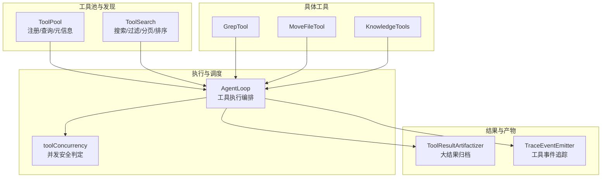
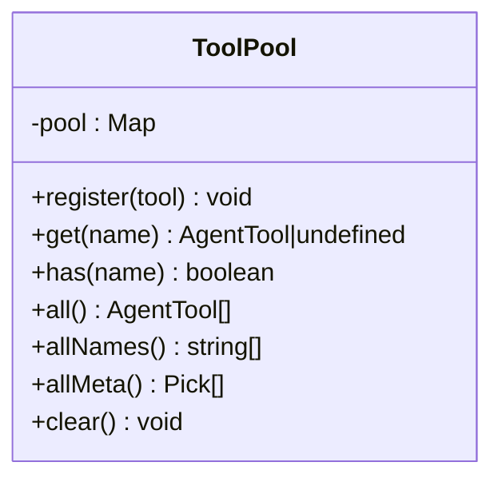
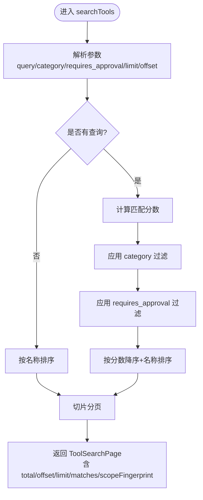
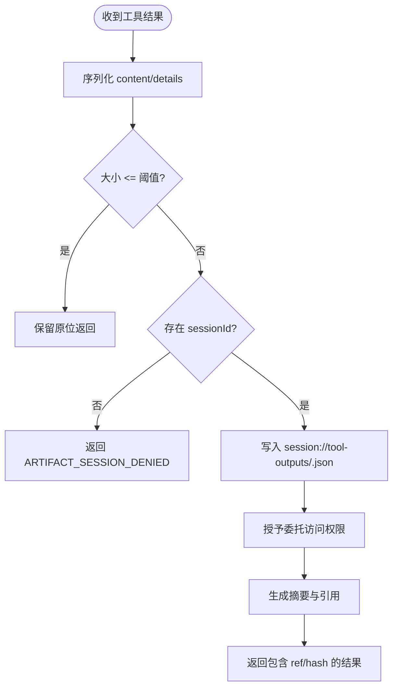
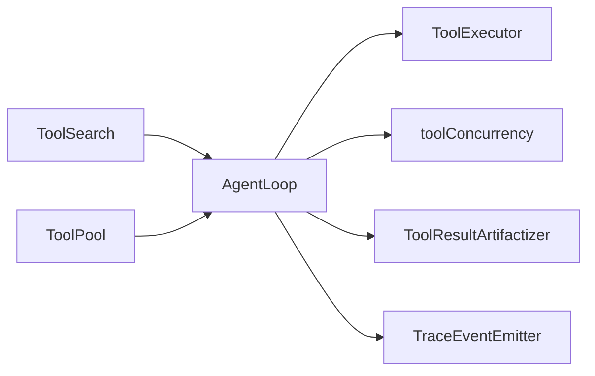

# 工具池管理

<cite>
**本文引用的文件**
- [ToolPool.ts](file://src/main/agent-runtime/tools/ToolPool.ts)
- [ToolSearch.ts](file://src/main/agent-runtime/tools/ToolSearch.ts)
- [AgentLoop.ts](file://src/main/agent-runtime/agent/AgentLoop.ts)
- [toolConcurrency.ts](file://src/main/agent-runtime/agent/toolConcurrency.ts)
- [ToolResultArtifactizer.ts](file://src/main/agent-runtime/tools/ToolResultArtifactizer.ts)
- [GrepTool.ts](file://src/main/agent-runtime/tools/primitives/GrepTool.ts)
- [MoveFileTool.ts](file://src/main/agent-runtime/tools/primitives/MoveFileTool.ts)
- [KnowledgeTools.ts](file://src/main/knowledge/KnowledgeTools.ts)
- [EffectiveRuntimePlan.test.ts](file://src/main/agent-runtime/EffectiveRuntimePlan.test.ts)
- [check-tool-system.mjs](file://scripts/check-tool-system.mjs)
- [TraceEventEmitter.ts](file://src/main/agent-trace/TraceEventEmitter.ts)
- [core.ts](file://src/shared/renderer-api/core.ts)
</cite>

## 目录
1. [简介](#简介)
2. [项目结构](#项目结构)
3. [核心组件](#核心组件)
4. [架构总览](#架构总览)
5. [详细组件分析](#详细组件分析)
6. [依赖关系分析](#依赖关系分析)
7. [性能考虑](#性能考虑)
8. [故障排查指南](#故障排查指南)
9. [结论](#结论)
10. [附录：集成与最佳实践](#附录：集成与最佳实践)

## 简介
本文件面向 RDC-Agent 的工具子系统，系统性说明 ToolPool 的工具发现、注册、缓存与调度机制，覆盖工具生命周期管理、并发控制、结果缓存（大结果归档）与性能优化。同时提供工具搜索、过滤、排序与分组能力说明，并给出自定义工具集成、性能优化、依赖与版本管理的最佳实践。

## 项目结构
围绕工具池的关键代码分布在 agent-runtime 的 tools、agent、knowledge 以及 workflow/debugger 相关装配与策略文件中；渲染侧通过 API 暴露工具目录与运行时摘要；追踪层对工具执行事件进行标准化记录。



图表来源
- [ToolPool.ts:1-38](file://src/main/agent-runtime/tools/ToolPool.ts#L1-L38)
- [ToolSearch.ts:1-186](file://src/main/agent-runtime/tools/ToolSearch.ts#L1-L186)
- [AgentLoop.ts:115-846](file://src/main/agent-runtime/agent/AgentLoop.ts#L115-L846)
- [toolConcurrency.ts:1-55](file://src/main/agent-runtime/agent/toolConcurrency.ts#L1-L55)
- [ToolResultArtifactizer.ts:1-137](file://src/main/agent-runtime/tools/ToolResultArtifactizer.ts#L1-L137)
- [TraceEventEmitter.ts:93-125](file://src/main/agent-trace/TraceEventEmitter.ts#L93-L125)

章节来源
- [ToolPool.ts:1-38](file://src/main/agent-runtime/tools/ToolPool.ts#L1-L38)
- [ToolSearch.ts:1-186](file://src/main/agent-runtime/tools/ToolSearch.ts#L1-L186)
- [AgentLoop.ts:115-846](file://src/main/agent-runtime/agent/AgentLoop.ts#L115-L846)
- [toolConcurrency.ts:1-55](file://src/main/agent-runtime/agent/toolConcurrency.ts#L1-L55)
- [ToolResultArtifactizer.ts:1-137](file://src/main/agent-runtime/tools/ToolResultArtifactizer.ts#L1-L137)
- [TraceEventEmitter.ts:93-125](file://src/main/agent-trace/TraceEventEmitter.ts#L93-L125)

## 核心组件
- ToolPool：工具实例缓存池，避免重复创建有状态工具，提供注册、获取、枚举与清理能力。
- ToolSearch：基于名称、描述、类别、审批要求的搜索与分页，返回权威性的“有效工具集”范围指纹。
- AgentLoop：工具调用的统一入口，负责执行生命周期、并发分组、预算预留与错误处理。
- toolConcurrency：声明式并发安全判定，强制关键工具串行执行。
- ToolResultArtifactizer：对超大工具结果进行分片归档与引用替换，保障消息体积可控且可回溯。
- 具体工具：如 GrepTool、MoveFileTool、KnowledgeTools 等，体现统一的 execute 接口与上下文使用。

章节来源
- [ToolPool.ts:1-38](file://src/main/agent-runtime/tools/ToolPool.ts#L1-L38)
- [ToolSearch.ts:1-186](file://src/main/agent-runtime/tools/ToolSearch.ts#L1-L186)
- [AgentLoop.ts:115-846](file://src/main/agent-runtime/agent/AgentLoop.ts#L115-L846)
- [toolConcurrency.ts:1-55](file://src/main/agent-runtime/agent/toolConcurrency.ts#L1-L55)
- [ToolResultArtifactizer.ts:1-137](file://src/main/agent-runtime/tools/ToolResultArtifactizer.ts#L1-L137)
- [GrepTool.ts:69-95](file://src/main/agent-runtime/tools/primitives/GrepTool.ts#L69-L95)
- [MoveFileTool.ts:34-51](file://src/main/agent-runtime/tools/primitives/MoveFileTool.ts#L34-L51)
- [KnowledgeTools.ts:156-198](file://src/main/knowledge/KnowledgeTools.ts#L156-L198)

## 架构总览
工具从“注册/发现”到“执行/归档/追踪”的完整链路如下：

```mermaid
sequenceDiagram
participant UI as "渲染端"
participant API as "工具API"
participant LOOP as "AgentLoop"
participant POOL as "ToolPool"
participant EXEC as "工具执行器"
participant ART as "结果归档"
participant TRACE as "追踪发射器"
UI->>API : 获取工具目录/运行时摘要
API-->>UI : 目录/摘要
LOOP->>POOL : 获取可用工具集合
LOOP->>EXEC : 按并发分组执行工具调用
EXEC-->>LOOP : 增量更新/最终结果
LOOP->>ART : 超阈值结果归档为 session : //tool-outputs
LOOP->>TRACE : 记录工具开始/结束/观察事件
TRACE-->>UI : 可视化追踪
```

图表来源
- [core.ts:128-144](file://src/shared/renderer-api/core.ts#L128-L144)
- [AgentLoop.ts:758-824](file://src/main/agent-runtime/agent/AgentLoop.ts#L758-L824)
- [ToolResultArtifactizer.ts:68-137](file://src/main/agent-runtime/tools/ToolResultArtifactizer.ts#L68-L137)
- [TraceEventEmitter.ts:93-125](file://src/main/agent-trace/TraceEventEmitter.ts#L93-L125)

## 详细组件分析

### ToolPool：工具实例缓存池
- 职责：以 name 为键缓存 AgentTool 实例，支持 has/get/all/allNames/allMeta/clear。
- 设计要点：
  - 避免重复构造有状态工具（数据库连接、HTTP 客户端等）。
  - allMeta 仅暴露必要元信息，便于目录构建与权限展示。
- 复杂度：注册/查找 O(1)，枚举 O(n)。



图表来源
- [ToolPool.ts:1-38](file://src/main/agent-runtime/tools/ToolPool.ts#L1-L38)

章节来源
- [ToolPool.ts:1-38](file://src/main/agent-runtime/tools/ToolPool.ts#L1-L38)

### ToolSearch：工具搜索、过滤、排序与分页
- 能力：
  - 关键词搜索：按名称精确匹配加分、包含次之、描述再次之。
  - 分类过滤：category 精确匹配。
  - 审批过滤：requires_approval 布尔过滤。
  - 分页：limit/offset 限制与偏移，默认上限保护。
  - 排序：有查询时按分数降序+名称排序；无查询时按名称排序。
  - 权威性：返回 effective tool set 的 scopeFingerprint，用于判断当前轮次的工具集是否变化。
- 输出：结构化页面与可读文本格式，便于 LLM 理解与人类阅读。



图表来源
- [ToolSearch.ts:52-103](file://src/main/agent-runtime/tools/ToolSearch.ts#L52-L103)

章节来源
- [ToolSearch.ts:1-186](file://src/main/agent-runtime/tools/ToolSearch.ts#L1-L186)

### 工具执行与调度：AgentLoop 与并发控制
- 执行流程：
  - 发送 tool_execution_start 事件。
  - 调用 ToolExecutor.execute，支持中止信号与增量回调。
  - 捕获异常并转换为失败结果。
  - 发送 tool_execution_end 事件，附带耗时。
- 并发分组：
  - 通过 isConcurrencySafe 将工具分组，同组内可并行。
  - reserveDispatchBudget 原子预留共享预算，失败则整组不启动。
  - 未实现 isConcurrencySafe 默认视为不安全（串行）。
- 强制串行工具：
  - 内置 ALWAYS_SERIAL_TOOL_NAMES 列表（shell、写文件类、任务类等）。
  - 所有 mcp__ 前缀工具强制串行。
  - 工具 spec 中 isConcurrencySafe 显式声明才允许并发。

```mermaid
sequenceDiagram
participant LOOP as "AgentLoop"
participant CONC as "并发判定"
participant EXEC as "工具执行器"
participant BUD as "预算预留"
LOOP->>CONC : isToolCallConcurrencySafe(toolCall)
alt 安全
LOOP->>BUD : reserveDispatchBudget(group)
alt 预算充足
LOOP->>EXEC : execute(toolCall) 并行/串行
EXEC-->>LOOP : 增量/结果
else 预算不足
LOOP-->>LOOP : 标记为 TOOL_GROUP_NOT_STARTED
end
else 不安全
LOOP->>EXEC : 串行执行
EXEC-->>LOOP : 结果
end
```

图表来源
- [AgentLoop.ts:758-824](file://src/main/agent-runtime/agent/AgentLoop.ts#L758-L824)
- [toolConcurrency.ts:1-55](file://src/main/agent-runtime/agent/toolConcurrency.ts#L1-L55)

章节来源
- [AgentLoop.ts:115-846](file://src/main/agent-runtime/agent/AgentLoop.ts#L115-L846)
- [toolConcurrency.ts:1-55](file://src/main/agent-runtime/agent/toolConcurrency.ts#L1-L55)

### 结果缓存与归档：ToolResultArtifactizer
- 触发条件：序列化后超过阈值（默认常量）即归档。
- 归档位置：session://tool-outputs/{toolCallId}.json，带 owner/session 隔离与哈希校验。
- 内容压缩：以 chunks 形式写入，读取时可分页拼接；成功路径禁止静默截断。
- 降级策略：写入失败或无会话时 fail-closed，返回明确错误码。
- 特殊豁免：artifact_read 本身已分页，不再二次包装。



图表来源
- [ToolResultArtifactizer.ts:68-137](file://src/main/agent-runtime/tools/ToolResultArtifactizer.ts#L68-L137)

章节来源
- [ToolResultArtifactizer.ts:1-137](file://src/main/agent-runtime/tools/ToolResultArtifactizer.ts#L1-L137)

### 典型工具实现要点
- GrepTool：
  - 支持文件或目录扫描，限制最大匹配数与输出字节数，防止过大响应。
  - 使用工作区根路径与安全路径解析，结合信号中断。
- MoveFileTool：
  - 目标不存在检查，拒绝覆盖；递归创建目录；大小上限校验。
- KnowledgeTools：
  - 知识检索工具，限定命中数量与字段投影，标注只读与并发安全。

章节来源
- [GrepTool.ts:69-95](file://src/main/agent-runtime/tools/primitives/GrepTool.ts#L69-L95)
- [MoveFileTool.ts:34-51](file://src/main/agent-runtime/tools/primitives/MoveFileTool.ts#L34-L51)
- [KnowledgeTools.ts:156-198](file://src/main/knowledge/KnowledgeTools.ts#L156-L198)

### 工具发现与生效范围
- 工具搜索必须作用于“有效工具集”，该集合由 allowlist 与运行时策略裁剪。
- 在准备阶段冻结 skillIntersection，并在执行期消费该冻结集合，避免中途再收窄。
- 脚本校验确保 tool_search 闭包对 availableTools 做 allowlist 与策略过滤。

章节来源
- [EffectiveRuntimePlan.test.ts:217-248](file://src/main/agent-runtime/EffectiveRuntimePlan.test.ts#L217-L248)
- [check-tool-system.mjs:235-291](file://scripts/check-tool-system.mjs#L235-L291)

## 依赖关系分析
- 耦合点：
  - AgentLoop 依赖 ToolExecutor 抽象，解耦具体工具实现。
  - ToolSearch 依赖工具元信息（name/description/spec/parameters），与 ToolPool/allMeta 配合构建目录。
  - ToolResultArtifactizer 依赖会话产物解析器与委托访问授权。
  - 追踪层依赖工具清单与结果归一化器，形成一致的事件模型。
- 外部依赖：
  - 文件系统、加密哈希、会话存储等基础设施。
  - 渲染侧通过 createToolApi 暴露 getCatalog/getRuntimeSummary。



图表来源
- [AgentLoop.ts:115-846](file://src/main/agent-runtime/agent/AgentLoop.ts#L115-L846)
- [ToolSearch.ts:1-186](file://src/main/agent-runtime/tools/ToolSearch.ts#L1-L186)
- [ToolPool.ts:1-38](file://src/main/agent-runtime/tools/ToolPool.ts#L1-L38)
- [ToolResultArtifactizer.ts:1-137](file://src/main/agent-runtime/tools/ToolResultArtifactizer.ts#L1-L137)
- [TraceEventEmitter.ts:93-125](file://src/main/agent-trace/TraceEventEmitter.ts#L93-L125)

章节来源
- [AgentLoop.ts:115-846](file://src/main/agent-runtime/agent/AgentLoop.ts#L115-L846)
- [ToolSearch.ts:1-186](file://src/main/agent-runtime/tools/ToolSearch.ts#L1-L186)
- [ToolPool.ts:1-38](file://src/main/agent-runtime/tools/ToolPool.ts#L1-L38)
- [ToolResultArtifactizer.ts:1-137](file://src/main/agent-runtime/tools/ToolResultArtifactizer.ts#L1-L137)
- [TraceEventEmitter.ts:93-125](file://src/main/agent-trace/TraceEventEmitter.ts#L93-L125)

## 性能考虑
- 并发控制：
  - 显式声明 isConcurrencySafe 的工具可并行，减少端到端延迟。
  - 强制串行工具列表与 mcp__ 前缀工具避免资源竞争。
  - 预算预留防止过度并发导致系统过载。
- I/O 与内存：
  - 大结果归档降低消息体大小，避免阻塞主线程与网络传输。
  - 工具内部限制输出大小（如 grep 的最大匹配与字节限制）。
- 搜索与索引：
  - ToolSearch 采用轻量评分与本地排序，适合中等规模工具集。
  - 分页与限幅避免一次性返回过多元数据。
- 追踪与诊断：
  - 工具执行起止事件与耗时统计，便于定位瓶颈。

[本节为通用性能指导，不直接分析具体文件]

## 故障排查指南
- 工具不可用：
  - 现象：执行时报“工具不可用（未配置执行器）”。
  - 排查：确认 ToolExecutor 已注入，工具名在有效工具集中。
- 并发被拒绝：
  - 现象：TOOL_GROUP_NOT_STARTED 或 POLICY_LIMIT_EXCEEDED。
  - 排查：检查 reserveDispatchBudget 返回值与工具并发安全声明。
- 结果过大：
  - 现象：返回包含 ref/hash 的归档结果。
  - 排查：确认会话 ID 存在，查看 session://tool-outputs 下产物。
- 搜索无结果：
  - 现象：NO_MATCH_IN_EFFECTIVE_TOOL_SET。
  - 排查：关注 scopeFingerprint 是否变化；放宽 category/approval 过滤；使用空查询列出全部。
- 追踪缺失：
  - 现象：右侧栏无工具节点。
  - 排查：确认 TraceEventEmitter 正常记录 tool.completed/failed。

章节来源
- [AgentLoop.ts:758-824](file://src/main/agent-runtime/agent/AgentLoop.ts#L758-L824)
- [ToolResultArtifactizer.ts:68-137](file://src/main/agent-runtime/tools/ToolResultArtifactizer.ts#L68-L137)
- [ToolSearch.ts:105-186](file://src/main/agent-runtime/tools/ToolSearch.ts#L105-L186)
- [TraceEventEmitter.ts:93-125](file://src/main/agent-trace/TraceEventEmitter.ts#L93-L125)

## 结论
RDC-Agent 的工具子系统通过 ToolPool 实现实例级缓存，ToolSearch 提供强大的发现与筛选能力，AgentLoop 统一编排执行与并发控制，ToolResultArtifactizer 保障大结果的可控与可追溯。结合强制串行策略与预算预留，系统在功能性与稳定性之间取得平衡。通过明确的接口与契约，开发者可以便捷地扩展工具生态，同时获得一致的追踪与诊断体验。

[本节为总结性内容，不直接分析具体文件]

## 附录：集成与最佳实践

### 如何集成自定义工具
- 实现 AgentTool 接口：
  - 提供 name、description、parameters、spec（建议声明 isReadOnly/isDestructive/isConcurrencySafe/sideEffect/category/requiresApproval）。
  - 实现 execute(id, params, signal, onUpdate, context)，遵循上下文与信号约定。
- 注册与发现：
  - 将工具实例注册到 ToolPool，或通过 RuntimeToolAssembly 装配到可用工具集。
  - 确保工具名在 allowlist 与运行时策略范围内，以便 tool_search 可见。
- 并发与串行：
  - 若工具具备幂等与无副作用，可在 spec 中标记 isConcurrencySafe=true。
  - 涉及写操作、MCP 工具或任务创建等，保持默认串行。
- 结果处理：
  - 控制输出大小，必要时利用 ToolResultArtifactizer 自动归档。
  - 对 artifact_read 等特殊工具避免二次包装。

章节来源
- [ToolPool.ts:1-38](file://src/main/agent-runtime/tools/ToolPool.ts#L1-L38)
- [ToolSearch.ts:158-186](file://src/main/agent-runtime/tools/ToolSearch.ts#L158-L186)
- [toolConcurrency.ts:1-55](file://src/main/agent-runtime/agent/toolConcurrency.ts#L1-L55)
- [ToolResultArtifactizer.ts:68-137](file://src/main/agent-runtime/tools/ToolResultArtifactizer.ts#L68-L137)
- [check-tool-system.mjs:235-291](file://scripts/check-tool-system.mjs#L235-L291)

### 性能优化建议
- 合理声明并发安全，最大化并行度。
- 限制 I/O 与输出大小，避免阻塞与超限。
- 使用分页与限幅，减少单次负载。
- 借助工具搜索的 scopeFingerprint 判断工具集变化，避免重复刷新。

[本节为通用优化建议，不直接分析具体文件]

### 依赖与版本管理
- 工具依赖应通过上下文注入，避免全局状态。
- 对外部服务（如 MCP）建立池化与租约，保证每轮执行的确定性。
- 通过 EffectiveRuntimePlan 与 allowlist 锁定可用工具集合，提升可重现性。

章节来源
- [orchestratorTypes.ts:148-163](file://src/main/workflow/debugger/orchestratorTypes.ts#L148-L163)
- [EffectiveRuntimePlan.test.ts:217-248](file://src/main/agent-runtime/EffectiveRuntimePlan.test.ts#L217-L248)