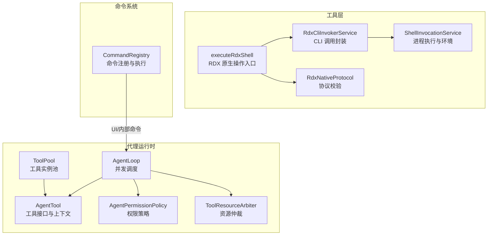
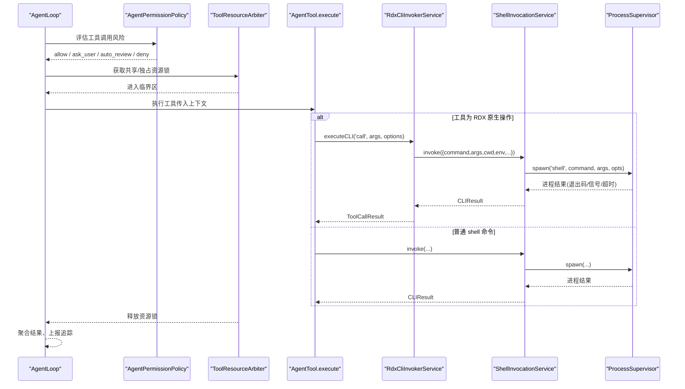
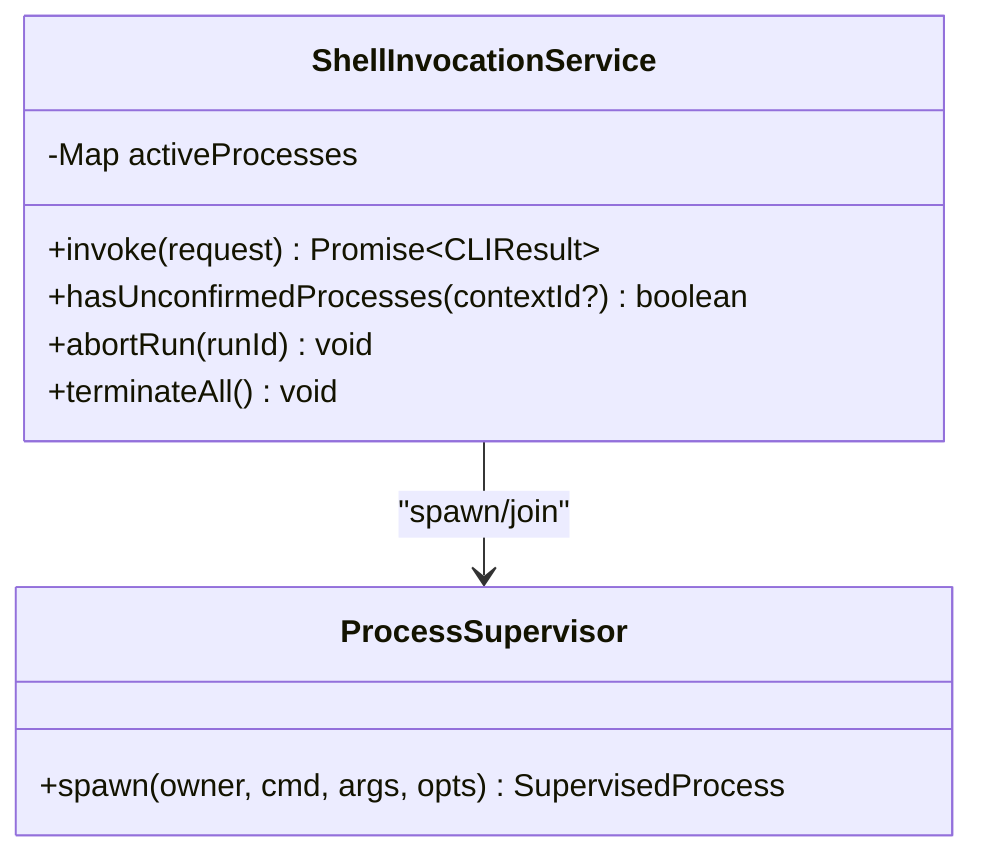
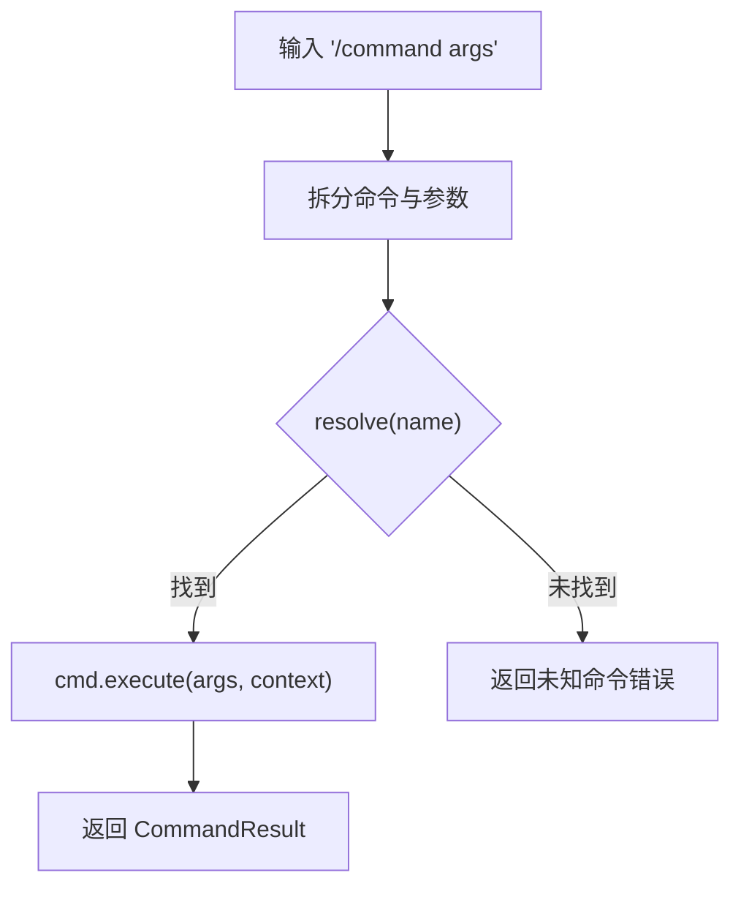
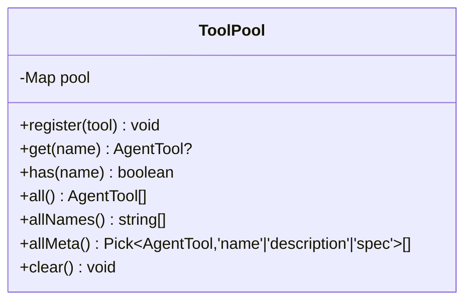
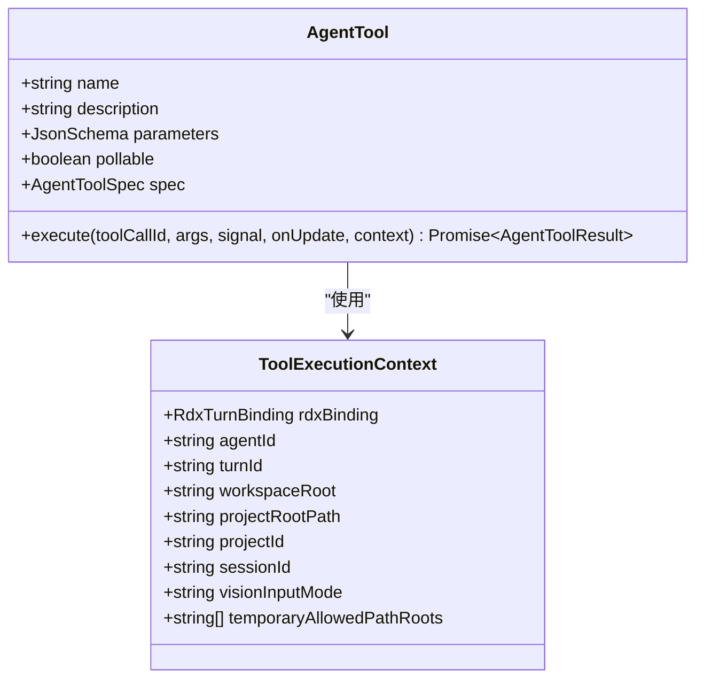
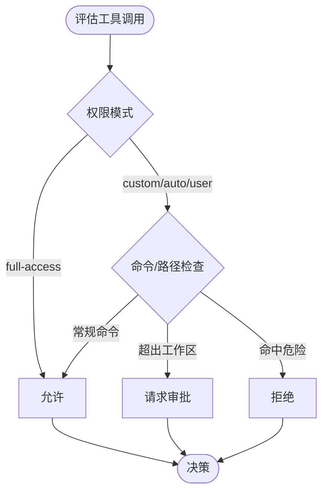
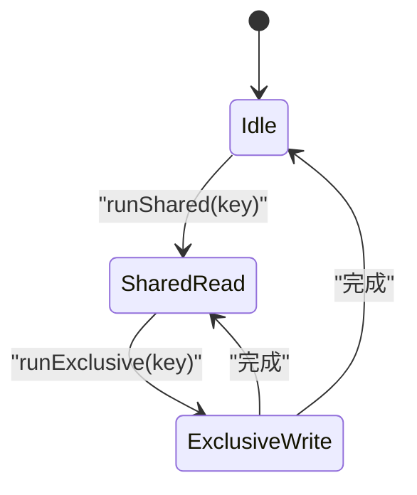
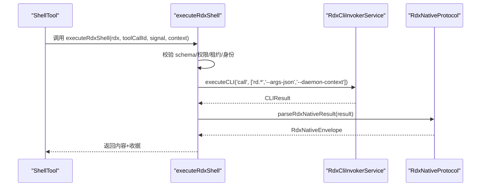
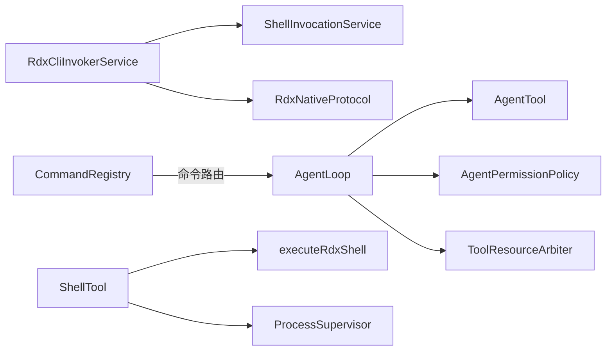

# 工具系统

<cite>
**本文引用的文件**
- [RdxCliInvokerService.ts](file://src/main/tools/RdxCliInvokerService.ts)
- [ShellInvocationService.ts](file://src/main/tools/ShellInvocationService.ts)
- [CommandRegistry.ts](file://src/main/commands/CommandRegistry.ts)
- [ToolPool.ts](file://src/main/agent-runtime/tools/ToolPool.ts)
- [AgentTool.ts](file://src/main/agent-runtime/agent/AgentTool.ts)
- [executeRdxShell.ts](file://src/main/tools/executeRdxShell.ts)
- [RdxNativeProtocol.ts](file://src/main/tools/RdxNativeProtocol.ts)
- [ShellTool.ts](file://src/main/agent-runtime/tools/primitives/ShellTool.ts)
- [AgentPermissionPolicy.ts](file://src/main/agent-runtime/permissions/AgentPermissionPolicy.ts)
- [ToolResourceArbiter.ts](file://src/main/workflow/debugger/ToolResourceArbiter.ts)
- [AgentLoop.ts](file://src/main/agent-runtime/agent/AgentLoop.ts)
</cite>

## 目录
1. [简介](#简介)
2. [项目结构](#项目结构)
3. [核心组件](#核心组件)
4. [架构总览](#架构总览)
5. [详细组件分析](#详细组件分析)
6. [依赖关系分析](#依赖关系分析)
7. [性能考量](#性能考量)
8. [故障排查指南](#故障排查指南)
9. [结论](#结论)
10. [附录：工具开发与最佳实践](#附录工具开发与最佳实践)

## 简介
本文件系统性地梳理 RDC-Agent 的工具子系统，重点解释以下能力与机制：
- RdxCliInvokerService 的 CLI 调用机制：如何组装参数、调用外部 rdx CLI、解析协议并上报追踪。
- ShellInvocationService 的 shell 执行环境：进程生命周期管理、超时、孤儿进程隔离、结果归一化。
- CommandRegistry 的命令注册与管理：命令发现、别名、路由与执行。
- ToolPool 的工具池管理：工具实例缓存、元信息导出、清理策略。
- 工具注册、权限控制、并发执行、结果缓存等关键特性。
- 工具接口规范、安全沙箱、错误处理与性能优化建议。
- 自定义工具开发指南与扩展现有功能的实践路径。

## 项目结构
围绕“工具系统”的关键代码分布在 main 层的 tools、agent-runtime、commands、runtime 等模块中：
- tools：封装对 rdx CLI 的调用（RdxCliInvokerService）、shell 执行（ShellInvocationService）、原生协议校验（RdxNativeProtocol）以及 RDX Shell 入口（executeRdxShell）。
- agent-runtime：定义 AgentTool 接口、工具池（ToolPool）、权限策略（AgentPermissionPolicy）、资源仲裁（ToolResourceArbiter）和工具调度（AgentLoop）。
- commands：提供通用命令注册与执行中心（CommandRegistry），用于 UI 或内部命令体系。
- runtime：进程与 shell 解析、环境变量注入、工作目录管理等基础设施。

**图表来源**
- [RdxCliInvokerService.ts:42-221](file://src/main/tools/RdxCliInvokerService.ts#L42-L221)
- [ShellInvocationService.ts:29-127](file://src/main/tools/ShellInvocationService.ts#L29-L127)
- [executeRdxShell.ts:16-71](file://src/main/tools/executeRdxShell.ts#L16-L71)
- [RdxNativeProtocol.ts:1-35](file://src/main/tools/RdxNativeProtocol.ts#L1-L35)
- [AgentTool.ts:1-81](file://src/main/agent-runtime/agent/AgentTool.ts#L1-L81)
- [ToolPool.ts:1-38](file://src/main/agent-runtime/tools/ToolPool.ts#L1-L38)
- [AgentPermissionPolicy.ts:323-480](file://src/main/agent-runtime/permissions/AgentPermissionPolicy.ts#L323-L480)
- [ToolResourceArbiter.ts:1-26](file://src/main/workflow/debugger/ToolResourceArbiter.ts#L1-L26)
- [AgentLoop.ts:758-825](file://src/main/agent-runtime/agent/AgentLoop.ts#L758-L825)
- [CommandRegistry.ts:18-116](file://src/main/commands/CommandRegistry.ts#L18-L116)

**章节来源**
- [RdxCliInvokerService.ts:42-221](file://src/main/tools/RdxCliInvokerService.ts#L42-L221)
- [ShellInvocationService.ts:29-127](file://src/main/tools/ShellInvocationService.ts#L29-L127)
- [CommandRegistry.ts:18-116](file://src/main/commands/CommandRegistry.ts#L18-L116)
- [ToolPool.ts:1-38](file://src/main/agent-runtime/tools/ToolPool.ts#L1-L38)

## 核心组件
- RdxCliInvokerService：负责加载工具目录（catalog）、构建命令行参数、调用 ShellInvocationService 执行 rdx CLI，并将输出解析为统一的 ToolCallResult，同时发出追踪事件。
- ShellInvocationService：统一进程启动、超时、信号、孤儿进程检测、退出码归一化；维护活跃进程映射，支持按 runId 中止与全局终止。
- CommandRegistry：集中管理命令定义、别名、列表与执行；将用户输入解析为命令名与参数，路由到具体实现。
- ToolPool：以 name 为键缓存 AgentTool 实例，避免重复创建有状态工具；提供 all/allMeta 等查询能力。
- AgentTool：定义工具的统一接口（name、parameters、execute）与执行上下文（workspaceRoot、projectRootPath、sessionId 等），以及 spec 描述（只读/可并发/破坏性/副作用类型/类别/是否需要审批）。
- executeRdxShell：RDX 原生操作的强约束入口，校验会话租约、身份绑定、重放会话一致性，并在实验模式下生成签名收据。
- RdxNativeProtocol：严格校验 rdx CLI 返回的 JSON 信封（ok/result_kind/data/context_id），确保响应归属正确的 daemon context。
- AgentPermissionPolicy：基于模式（full-access/custom/auto-review/user）与规则集（白名单/黑名单/危险命令/读写根）判定是否允许、需审批或拒绝。
- ToolResourceArbiter：在同一 session/project 范围内串行化不安全工具效果，防止并发写冲突。
- AgentLoop：工具调度的编排器，支持分组并发、预算预留、失败聚合与流式更新。

**章节来源**
- [RdxCliInvokerService.ts:42-367](file://src/main/tools/RdxCliInvokerService.ts#L42-L367)
- [ShellInvocationService.ts:29-127](file://src/main/tools/ShellInvocationService.ts#L29-L127)
- [CommandRegistry.ts:18-116](file://src/main/commands/CommandRegistry.ts#L18-L116)
- [ToolPool.ts:1-38](file://src/main/agent-runtime/tools/ToolPool.ts#L1-L38)
- [AgentTool.ts:1-81](file://src/main/agent-runtime/agent/AgentTool.ts#L1-L81)
- [executeRdxShell.ts:16-71](file://src/main/tools/executeRdxShell.ts#L16-L71)
- [RdxNativeProtocol.ts:1-35](file://src/main/tools/RdxNativeProtocol.ts#L1-L35)
- [AgentPermissionPolicy.ts:323-480](file://src/main/agent-runtime/permissions/AgentPermissionPolicy.ts#L323-L480)
- [ToolResourceArbiter.ts:1-26](file://src/main/workflow/debugger/ToolResourceArbiter.ts#L1-L26)
- [AgentLoop.ts:758-825](file://src/main/agent-runtime/agent/AgentLoop.ts#L758-L825)

## 架构总览
下图展示了从 Agent 发起工具调用到最终执行的完整链路，包括权限检查、资源仲裁、CLI/shell 执行与结果回传。

**图表来源**
- [AgentLoop.ts:758-825](file://src/main/agent-runtime/agent/AgentLoop.ts#L758-L825)
- [AgentPermissionPolicy.ts:323-480](file://src/main/agent-runtime/permissions/AgentPermissionPolicy.ts#L323-L480)
- [ToolResourceArbiter.ts:1-26](file://src/main/workflow/debugger/ToolResourceArbiter.ts#L1-L26)
- [RdxCliInvokerService.ts:178-221](file://src/main/tools/RdxCliInvokerService.ts#L178-L221)
- [ShellInvocationService.ts:32-105](file://src/main/tools/ShellInvocationService.ts#L32-L105)

## 详细组件分析

### RdxCliInvokerService：CLI 调用机制
- 配置与可用性：从设置读取 rdxCli 配置（enabled/command/workingDirectory/env/timeoutMs/catalogPath），并提供 isAvailable/getRuntimeSummary 暴露运行态。
- 目录加载：loadCatalog 支持从 catalogPath 加载工具清单，未配置时返回空目录；缓存已加载目录以避免重复 IO。
- 参数构建：normalizeCliArgs 将 --context-id 转换为 --daemon-context；buildCommandArgs 合并 settings.argsPrefix、全局参数、命令名与命令参数。
- 执行流程：executeCLI 通过 resolveRdxBatchInvocation 解析实际命令与参数，再委托 ShellInvocationService.invoke 执行；支持 timeout/cwd/env/runId/contextId/abortSignal。
- 结果解析：call 方法构造 call 子命令，附加 --args-json 与 --daemon-context，调用 executeCLI 后使用 parseRdxNativeResult 校验协议，再将 stdout JSON 转为 ToolCallResult；异常路径统一包装为错误结果并触发追踪。
- 追踪：onInvocationTrace 订阅 ToolTraceEntry，包含 turnId/toolName/args/result/timestamp/contextId/runtimeOwner/ownerLeaseId 等。

**图表来源**
- [RdxCliInvokerService.ts:49-116](file://src/main/tools/RdxCliInvokerService.ts#L49-L116)
- [RdxCliInvokerService.ts:143-221](file://src/main/tools/RdxCliInvokerService.ts#L143-L221)
- [RdxCliInvokerService.ts:248-355](file://src/main/tools/RdxCliInvokerService.ts#L248-L355)
- [RdxNativeProtocol.ts:12-34](file://src/main/tools/RdxNativeProtocol.ts#L12-L34)

**章节来源**
- [RdxCliInvokerService.ts:42-367](file://src/main/tools/RdxCliInvokerService.ts#L42-L367)
- [RdxNativeProtocol.ts:1-35](file://src/main/tools/RdxNativeProtocol.ts#L1-L35)

### ShellInvocationService：shell 执行环境
- 进程启动：使用 processSupervisor.spawn('shell', ...) 启动子进程，Windows 下 .bat/.cmd 自动启用 shell；注入 PYTHONIOENCODING=utf-8；非 Windows 平台隔离进程组。
- 超时与取消：支持 timeoutMs 与 AbortSignal；超时返回 exitCode=124 并附带 stderr 提示。
- 结果归一化：resolveExitCode 根据 code/signal 计算退出码；spawn_failed/unconfirmed_orphan 等 reason 分别处理。
- 进程跟踪：activeProcesses 记录当前活跃进程，支持 abortRun(runId) 与 terminateAll()；finally 块清理孤儿进程条目。

**图表来源**
- [ShellInvocationService.ts:29-127](file://src/main/tools/ShellInvocationService.ts#L29-L127)

**章节来源**
- [ShellInvocationService.ts:29-127](file://src/main/tools/ShellInvocationService.ts#L29-L127)

### CommandRegistry：命令注册与管理
- 注册与别名：register 支持主名称与多个别名；unregister 同步删除别名映射。
- 查找与列举：resolve 支持别名；list 去重并按名称排序，可按 category 过滤。
- 执行：execute 解析 "/command args"，路由到对应命令；捕获异常并返回失败消息。

**图表来源**
- [CommandRegistry.ts:18-116](file://src/main/commands/CommandRegistry.ts#L18-L116)

**章节来源**
- [CommandRegistry.ts:18-116](file://src/main/commands/CommandRegistry.ts#L18-L116)

### ToolPool：工具池管理
- 功能：以 name 为键缓存 AgentTool 实例；提供 get/has/all/allNames/allMeta/clear。
- 用途：避免重复创建有状态工具（如数据库连接、API 客户端），减少初始化开销。

**图表来源**
- [ToolPool.ts:1-38](file://src/main/agent-runtime/tools/ToolPool.ts#L1-L38)

**章节来源**
- [ToolPool.ts:1-38](file://src/main/agent-runtime/tools/ToolPool.ts#L1-L38)

### 工具接口规范与上下文
- AgentTool：定义 name/description/parameters/pollable/spec/permissionHint 与 execute 方法；execute 接收 toolCallId、args、AbortSignal、onUpdate 回调与 ToolExecutionContext。
- ToolExecutionContext：包含 rdxBinding（主进程私有绑定）、agentId/turnId/workspaceRoot/projectRootPath/project/sessionId/visionInputMode/temporaryAllowedPathRoots 等。
- spec：描述工具行为属性（isReadOnly/isConcurrencySafe/isDestructive/sideEffect/category/requiresApproval），供调度与权限系统使用。

**图表来源**
- [AgentTool.ts:1-81](file://src/main/agent-runtime/agent/AgentTool.ts#L1-L81)

**章节来源**
- [AgentTool.ts:1-81](file://src/main/agent-runtime/agent/AgentTool.ts#L1-L81)

### 权限控制与安全沙箱
- 策略分类：AgentPermissionPolicyService.evaluate 综合模式（full-access/custom/auto-review/user）、工具名、命令内容、路径范围、知识读取根等，返回 allow/ask_user/auto_review/deny 决策。
- 危险命令：内置危险命令正则匹配与硬拒绝（matchShellHardDeny），即使 full-access 也不放行。
- 路径限制：read/write 工具目标路径需在 workspaceRoot 或配置的 readable/writable roots 内；否则请求审批或拒绝。
- 网络工具：web_fetch/web_search 在非 custom 模式下需要审批。
- 沙箱边界：策略仅做风险评估与路由，真正的安全边界由 OS 权限、Electron 沙箱、IPC 校验保障。

**图表来源**
- [AgentPermissionPolicy.ts:323-480](file://src/main/agent-runtime/permissions/AgentPermissionPolicy.ts#L323-L480)

**章节来源**
- [AgentPermissionPolicy.ts:323-480](file://src/main/agent-runtime/permissions/AgentPermissionPolicy.ts#L323-L480)

### 并发执行与资源仲裁
- 并发调度：AgentLoop 将工具调用分组，标记 isConcurrencySafe 的工具可并行执行；支持 reserveDispatchBudget 进行预算预留与限制。
- 资源仲裁：ToolResourceArbiter 在同一 session/project 范围内串行化不安全工具效果，防止并发写冲突；runShared/runExclusive 保证读写互斥。
- 会话级串行：ShellTool 对同一 sessionId 的 shell 调用加锁，避免并发修改工作目录或 RDX 会话状态。

**图表来源**
- [ToolResourceArbiter.ts:1-26](file://src/main/workflow/debugger/ToolResourceArbiter.ts#L1-L26)
- [ShellTool.ts:44-52](file://src/main/agent-runtime/tools/primitives/ShellTool.ts#L44-L52)
- [AgentLoop.ts:805-825](file://src/main/agent-runtime/agent/AgentLoop.ts#L805-L825)

**章节来源**
- [ToolResourceArbiter.ts:1-26](file://src/main/workflow/debugger/ToolResourceArbiter.ts#L1-L26)
- [ShellTool.ts:44-52](file://src/main/agent-runtime/tools/primitives/ShellTool.ts#L44-L52)
- [AgentLoop.ts:805-825](file://src/main/agent-runtime/agent/AgentLoop.ts#L805-L825)

### RDX 原生操作：executeRdxShell 与协议校验
- 输入校验：RdxShellInputSchema 限定 operation 必须为 rd.shader/perf/event/pipeline/resource/export 之一，args 为对象，experimentId 可选。
- 权限与租约：仅 general agent 且具备冻结绑定的会话可执行；校验 identity/version/contextId/ownerSessionId 与租约一致。
- 参数注入：自动注入 session_id 与 --daemon-context，禁止覆盖敏感字段（session_id/context_id/daemon_context/owner_session_id）。
- 收据与验证：若提供 experimentId，则准备并写入执行收据；执行后再次校验租约版本与 contextId 未变化；结果经 parseRdxNativeResult 校验。
- 异常恢复：任何异常都会 quarantineRdxContext，提示通过捕获生命周期进行恢复。

**图表来源**
- [executeRdxShell.ts:16-71](file://src/main/tools/executeRdxShell.ts#L16-L71)
- [RdxNativeProtocol.ts:12-34](file://src/main/tools/RdxNativeProtocol.ts#L12-L34)
- [RdxCliInvokerService.ts:178-221](file://src/main/tools/RdxCliInvokerService.ts#L178-L221)

**章节来源**
- [executeRdxShell.ts:16-71](file://src/main/tools/executeRdxShell.ts#L16-L71)
- [RdxNativeProtocol.ts:1-35](file://src/main/tools/RdxNativeProtocol.ts#L1-L35)

## 依赖关系分析
- RdxCliInvokerService 依赖 ShellInvocationService 与 SettingsService，并通过 RdxNativeProtocol 校验协议。
- ShellInvocationService 依赖 ProcessSupervisor 与 os/path 标准库。
- AgentLoop 依赖 AgentTool、AgentPermissionPolicy、ToolResourceArbiter 与工具执行器。
- ShellTool 依赖 ShellResolver、processSupervisor、storageAdapter 与 executeRdxShell。
- CommandRegistry 独立于工具系统，但可与上层 UI/命令体系集成。

**图表来源**
- [RdxCliInvokerService.ts:42-221](file://src/main/tools/RdxCliInvokerService.ts#L42-L221)
- [ShellInvocationService.ts:29-127](file://src/main/tools/ShellInvocationService.ts#L29-L127)
- [AgentLoop.ts:758-825](file://src/main/agent-runtime/agent/AgentLoop.ts#L758-L825)
- [ShellTool.ts:83-138](file://src/main/agent-runtime/tools/primitives/ShellTool.ts#L83-L138)
- [CommandRegistry.ts:18-116](file://src/main/commands/CommandRegistry.ts#L18-L116)

**章节来源**
- [RdxCliInvokerService.ts:42-221](file://src/main/tools/RdxCliInvokerService.ts#L42-L221)
- [ShellInvocationService.ts:29-127](file://src/main/tools/ShellInvocationService.ts#L29-L127)
- [AgentLoop.ts:758-825](file://src/main/agent-runtime/agent/AgentLoop.ts#L758-L825)
- [ShellTool.ts:83-138](file://src/main/agent-runtime/tools/primitives/ShellTool.ts#L83-L138)
- [CommandRegistry.ts:18-116](file://src/main/commands/CommandRegistry.ts#L18-L116)

## 性能考量
- 目录缓存：RdxCliInvokerService.loadCatalog 缓存已加载的 catalog，避免重复 IO。
- 进程复用与隔离：ShellInvocationService 使用 processSupervisor 管理进程生命周期，支持超时与隔离，减少资源泄漏。
- 输出截断：ShellTool 对 stdout/stderr 进行环形缓冲与截断，防止大输出阻塞内存。
- 并发分组：AgentLoop 将安全工具分组并行执行，提升吞吐；对破坏性工具串行化，避免竞争。
- 资源仲裁：ToolResourceArbiter 在 session/project 范围内串行化写操作，降低冲突与重试成本。
- 超时与取消：所有长耗时操作均支持 timeoutMs 与 AbortSignal，及时释放资源。

[本节为通用性能指导，不直接分析具体文件]

## 故障排查指南
- CLI 不可用：检查 RdxCliInvokerService.getAvailabilityFailure 返回的原因（未启用/命令未配置/命令不存在）。
- 协议错误：RdxNativeProtocol.parseRdxNativeResult 抛出协议错误（exitCode!=0、非 JSON、缺少 result_kind/data、context_id 不匹配）。
- 进程问题：ShellInvocationService 返回 spawn_failed/timeout/unconfirmed_orphan；检查进程是否存在、超时是否合理、孤儿进程是否被清理。
- 权限拒绝：AgentPermissionPolicy 返回 deny/ask_user/auto_review；查看命令是否命中危险模式、路径是否在工作区外、是否属于网络工具。
- 租约失效：executeRdxShell 在执行前后校验租约版本与 contextId；若变化，需重新 prepareTurn。
- 并发冲突：ToolResourceArbiter 串行化写操作；若出现竞态，确认是否正确使用 runExclusive。

**章节来源**
- [RdxCliInvokerService.ts:70-86](file://src/main/tools/RdxCliInvokerService.ts#L70-L86)
- [RdxNativeProtocol.ts:12-34](file://src/main/tools/RdxNativeProtocol.ts#L12-L34)
- [ShellInvocationService.ts:67-105](file://src/main/tools/ShellInvocationService.ts#L67-L105)
- [AgentPermissionPolicy.ts:353-480](file://src/main/agent-runtime/permissions/AgentPermissionPolicy.ts#L353-L480)
- [executeRdxShell.ts:21-33](file://src/main/tools/executeRdxShell.ts#L21-L33)
- [ToolResourceArbiter.ts:19-26](file://src/main/workflow/debugger/ToolResourceArbiter.ts#L19-L26)

## 结论
该工具系统通过分层设计实现了安全的 CLI/shell 执行、严格的权限控制、可控的并发与资源仲裁、以及稳定的进程管理与协议校验。RdxCliInvokerService 与 ShellInvocationService 提供了可靠的底层执行能力；AgentTool 与 ToolPool 定义了清晰的工具接口与实例管理；AgentPermissionPolicy 与 ToolResourceArbiter 构建了安全与一致性保障；AgentLoop 则负责高效调度与错误聚合。整体架构兼顾了可扩展性与安全性，适合构建复杂的自动化与诊断工具链。

[本节为总结性内容，不直接分析具体文件]

## 附录：工具开发与最佳实践
- 定义工具：实现 AgentTool 接口，明确 name/description/parameters/spec/permissionHint；spec 应准确描述只读/可并发/破坏性/副作用类型/类别/是否需要审批。
- 上下文使用：通过 ToolExecutionContext 获取 workspaceRoot/projectRootPath/sessionId 等，确保路径与工作区一致，避免跨域访问。
- 权限合规：遵循 AgentPermissionPolicy 的规则，避免危险命令与越权路径；必要时提供合理的 description 与参数说明以降低审批难度。
- 并发与资源：对于可并发工具声明 isConcurrencySafe=true；对写操作使用 ToolResourceArbiter.runExclusive 保护；对会话级操作使用 ShellTool 的会话锁。
- 超时与取消：所有长耗时操作支持 AbortSignal；合理设置 timeoutMs，避免长时间占用资源。
- 结果与追踪：返回标准化的 AgentToolResult；对 CLI 调用使用 RdxCliInvokerService 并订阅 onInvocationTrace 以便审计。
- 自定义扩展：通过 ToolPool.register 注册新工具；如需命令形式，可在 CommandRegistry.register 添加命令定义；如需 RDX 原生操作，封装 executeRdxShell 并遵守协议。

[本节为通用指导，不直接分析具体文件]