# 工具系统

<cite>
**本文引用的文件**
- [RdcCliInvokerService.ts](file://src/main/tools/RdcCliInvokerService.ts)
- [ShellInvocationService.ts](file://src/main/tools/ShellInvocationService.ts)
- [CommandRegistry.ts](file://src/main/commands/CommandRegistry.ts)
- [ToolPool.ts](file://src/main/agent-runtime/tools/ToolPool.ts)
- [AgentTool.ts](file://src/main/agent-runtime/agent/AgentTool.ts)
- [executeRdcShell.ts](file://src/main/tools/executeRdcShell.ts)
- [RdcNativeProtocol.ts](file://src/main/tools/RdcNativeProtocol.ts)
- [ShellTool.ts](file://src/main/agent-runtime/tools/primitives/ShellTool.ts)
- [AgentPermissionPolicy.ts](file://src/main/agent-runtime/permissions/AgentPermissionPolicy.ts)
- [ToolResourceArbiter.ts](file://src/main/workflow/debugger/ToolResourceArbiter.ts)
- [AgentLoop.ts](file://src/main/agent-runtime/agent/AgentLoop.ts)
- [RdcOperationCatalog.ts](file://src/main/tools/RdcOperationCatalog.ts)
- [RdcValidatedEvidence.ts](file://src/main/tools/RdcValidatedEvidence.ts)
- [RdcOperationPolicy.ts](file://src/main/tools/RdcOperationPolicy.ts)
- [RdcTurnBindings.ts](file://src/main/tools/RdcTurnBindings.ts)
- [applyDeclaredHandoff.ts](file://src/main/conversation/applyDeclaredHandoff.ts)
- [ReadFileTool.ts](file://src/main/agent-runtime/tools/primitives/ReadFileTool.ts)
- [WriteFileTool.ts](file://src/main/agent-runtime/tools/primitives/WriteFileTool.ts)
- [EditFileTool.ts](file://src/main/agent-runtime/tools/primitives/EditFileTool.ts)
- [fileReadAccess.ts](file://src/main/agent-runtime/tools/primitives/fileReadAccess.ts)
</cite>

## 更新摘要
**变更内容**
- **新增 read-before-write 强制执行机制**：在文件编辑和写入操作前必须成功读取目标文件，防止未经确认的修改
- **增强文件操作安全性**：通过 successfulFileReads 集合跟踪会话级别的读取记录，确保编辑操作的合法性
- **完善错误处理**：新增 READ_BEFORE_EDIT_REQUIRED 错误类型，明确指示需要先执行读取操作
- **跨轮次支持**：成功的读取记录在同一会话的不同轮次间保持有效，但不在会话重启后保留

## 目录
1. [简介](#简介)
2. [项目结构](#项目结构)
3. [核心组件](#核心组件)
4. [架构总览](#架构总览)
5. [详细组件分析](#详细组件分析)
6. [依赖关系分析](#依赖关系分析)
7. [性能考量](#性能考量)
8. [故障排查指南](#故障排查指南)
9. [结论](#结论)
10. [附录：工具开发与最佳实践](#附录工具开发与最佳实践)

## 简介
本文件系统性地梳理 RDC-Agent 的工具子系统，重点解释以下能力与机制：
- RdcCliInvokerService 的 CLI 调用机制：如何组装参数、调用外部 rdc CLI、解析协议并上报追踪。
- ShellInvocationService 的 shell 执行环境：进程生命周期管理、超时、孤儿进程隔离、结果归一化。
- CommandRegistry 的命令注册与管理：命令发现、别名、路由与执行。
- ToolPool 的工具池管理：工具实例缓存、元信息导出、清理策略。
- **新增** read-before-write 强制执行机制：确保编辑和写入操作前先有成功的读取操作记录，提升文件操作安全性。
- **已移除** agent_handoff 工具的执行能力：交接功能已完全转为 UI 驱动，不再作为可执行工具存在。
- **新增** 操作目录系统：基于 RdcOperationCatalog 的严格契约管理和能力驱动执行模型。
- **新增** 执行证据验证：通过 RdcValidatedEvidence 验证测量、干预和回滚操作的执行证明。
- 工具注册、权限控制、并发执行、结果缓存等关键特性。
- 工具接口规范、安全沙箱、错误处理与性能优化建议。
- 自定义工具开发指南与扩展现有功能的实践路径。

## 项目结构
围绕"工具系统"的关键代码分布在 main 层的 tools、agent-runtime、commands、runtime 等模块中：
- tools：封装对 rdc CLI 的调用（RdcCliInvokerService）、shell 执行（ShellInvocationService）、原生协议校验（RdcNativeProtocol）以及 RDC Shell 入口（executeRdcShell）。
- agent-runtime：定义 AgentTool 接口、工具池（ToolPool）、权限策略（AgentPermissionPolicy）、资源仲裁（ToolResourceArbiter）和工具调度（AgentLoop）。
- commands：提供通用命令注册与执行中心（CommandRegistry），用于 UI 或内部命令体系。
- runtime：进程与 shell 解析、环境变量注入、工作目录管理等基础设施。
- conversation：处理会话级别的交接逻辑（applyDeclaredHandoff），替代原有的 agent_handoff 工具。
- **新增** 文件访问控制：通过 fileReadAccess.ts 实现 read-before-write 机制，确保文件操作的安全性。
- **已移除** agent-handoff 相关的工具实现、状态存储和控制器。
- **新增** 操作目录：RdcOperationCatalog 提供操作定义验证、指纹计算和应用操作约束。
- **新增** 证据验证：RdcValidatedEvidence 验证执行结果的可信性和完整性。

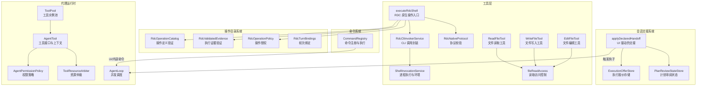
```mermaid
graph TB
subgraph "工具层"
A["RdcCliInvokerService<br/>CLI 调用封装"]
B["ShellInvocationService<br/>进程执行与环境"]
C["executeRdcShell<br/>RDC 原生操作入口"]
D["RdcNativeProtocol<br/>协议校验"]
E["ReadFileTool<br/>文件读取工具"]
F["WriteFileTool<br/>文件写入工具"]
G["EditFileTool<br/>文件编辑工具"]
H["fileReadAccess<br/>读取访问控制"]
end
subgraph "代理运行时"
I["AgentTool<br/>工具接口与上下文"]
J["ToolPool<br/>工具实例池"]
K["AgentPermissionPolicy<br/>权限策略"]
L["ToolResourceArbiter<br/>资源仲裁"]
M["AgentLoop<br/>并发调度"]
end
subgraph "操作目录系统"
N["RdcOperationCatalog<br/>操作定义验证"]
O["RdcValidatedEvidence<br/>执行证据验证"]
P["RdcOperationPolicy<br/>操作授权"]
Q["RdcTurnBindings<br/>轮次绑定"]
end
subgraph "会话交接系统"
R["applyDeclaredHandoff<br/>UI 驱动的交接"]
S["ExecutionOfferStore<br/>执行报价存储"]
T["PlanReviewStateStore<br/>计划审阅状态"]
end
subgraph "命令系统"
U["CommandRegistry<br/>命令注册与执行"]
end
A --> B
C --> A
C --> D
C --> N
C --> O
C --> P
E --> H
F --> H
G --> H
I --> K
I --> L
J --> I
U --> |"UI/内部命令"| M
R --> S
R --> T
R --> |"触发钩子"| M
```

**图表来源**
- [RdcCliInvokerService.ts:42-221](file://src/main/tools/RdcCliInvokerService.ts#L42-L221)
- [ShellInvocationService.ts:29-127](file://src/main/tools/ShellInvocationService.ts#L29-L127)
- [executeRdcShell.ts:16-71](file://src/main/tools/executeRdcShell.ts#L16-L71)
- [ReadFileTool.ts:60-101](file://src/main/agent-runtime/tools/primitives/ReadFileTool.ts#L60-L101)
- [WriteFileTool.ts:50-95](file://src/main/agent-runtime/tools/primitives/WriteFileTool.ts#L50-L95)
- [EditFileTool.ts:56-115](file://src/main/agent-runtime/tools/primitives/EditFileTool.ts#L56-L115)
- [fileReadAccess.ts:9-17](file://src/main/agent-runtime/tools/primitives/fileReadAccess.ts#L9-L17)
- [applyDeclaredHandoff.ts:38-94](file://src/main/conversation/applyDeclaredHandoff.ts#L38-L94)
- [RdcOperationCatalog.ts:20-61](file://src/main/tools/RdcOperationCatalog.ts#L20-L61)
- [RdcValidatedEvidence.ts:21-86](file://src/main/tools/RdcValidatedEvidence.ts#L21-L86)
- [RdcOperationPolicy.ts:49-104](file://src/main/tools/RdcOperationPolicy.ts#L49-L104)
- [RdcTurnBindings.ts:20-38](file://src/main/tools/tools/RdcTurnBindings.ts#L20-L38)

**章节来源**
- [RdcCliInvokerService.ts:42-221](file://src/main/tools/RdcCliInvokerService.ts#L42-L221)
- [ShellInvocationService.ts:29-127](file://src/main/tools/ShellInvocationService.ts#L29-L127)
- [CommandRegistry.ts:18-116](file://src/main/commands/CommandRegistry.ts#L18-L116)
- [ToolPool.ts:1-38](file://src/main/agent-runtime/tools/ToolPool.ts#L1-L38)
- [ReadFileTool.ts:60-101](file://src/main/agent-runtime/tools/primitives/ReadFileTool.ts#L60-L101)
- [WriteFileTool.ts:50-95](file://src/main/agent-runtime/tools/primitives/WriteFileTool.ts#L50-L95)
- [EditFileTool.ts:56-115](file://src/main/agent-runtime/tools/primitives/EditFileTool.ts#L56-L115)
- [fileReadAccess.ts:9-17](file://src/main/agent-runtime/tools/primitives/fileReadAccess.ts#L9-L17)
- [applyDeclaredHandoff.ts:38-94](file://src/main/conversation/applyDeclaredHandoff.ts#L38-L94)
- [RdcOperationCatalog.ts:20-61](file://src/main/tools/RdcOperationCatalog.ts#L20-L61)
- [RdcValidatedEvidence.ts:21-86](file://src/main/tools/RdcValidatedEvidence.ts#L21-L86)

## 核心组件
- RdcCliInvokerService：负责加载工具目录（catalog）、构建命令行参数、调用 ShellInvocationService 执行 rdc CLI，并将输出解析为统一的 ToolCallResult，同时发出追踪事件。
- ShellInvocationService：统一进程启动、超时、信号、孤儿进程检测、退出码归一化；维护活跃进程映射，支持按 runId 中止与全局终止。
- CommandRegistry：集中管理命令定义、别名、列表与执行；将用户输入解析为命令名与参数，路由到具体实现。
- ToolPool：以 name 为键缓存 AgentTool 实例，避免重复创建有状态工具；提供 all/allMeta 等查询能力。
- AgentTool：定义工具的统一接口（name、parameters、execute）与执行上下文（workspaceRoot、projectRootPath、sessionId 等），以及 spec 描述（只读/可并发/破坏性/副作用类型/类别/是否需要审批）。
- executeRdcShell：RDC 原生操作的强约束入口，校验会话租约、身份绑定、重放会话一致性，并在实验模式下生成签名收据。
- RdcNativeProtocol：严格校验 rdc CLI 返回的 JSON 信封（ok/result_kind/data/context_id），确保响应归属正确的 daemon context。
- **新增** ReadFileTool：实现安全的文件读取功能，支持行偏移和限制，成功后记录到 successfulFileReads 集合。
- **新增** WriteFileTool：实现文件写入功能，在执行前检查是否已成功读取目标文件，强制执行 read-before-write 机制。
- **新增** EditFileTool：实现基于搜索替换的文件编辑功能，要求先成功读取目标文件才能进行编辑。
- **新增** fileReadAccess：提供 recordSuccessfulFileRead 和 requireSuccessfulFileRead 函数，管理文件读取访问控制。
- **已移除** agent_handoff 工具：不再支持通过工具调用执行交接，交接功能已完全移至 UI 层。
- **新增** applyDeclaredHandoff：处理 UI 触发的会话交接，验证声明属于当前或刚批准的 profile，触发 before-handoff/after-handoff 钩子，写入 execution offer 并持久化 session.agentId。
- **新增** RdcOperationCatalog：提供操作定义的严格验证、指纹计算和应用操作约束，确保操作契约的一致性。
- **新增** RdcValidatedEvidence：验证执行结果的真实性，支持测量（event_durations/counters/image/frame_timing）、干预和回滚三种证据类型。
- **新增** RdcOperationPolicy：基于冻结的操作定义进行细粒度授权，验证作用域、影响、前置条件和路径访问。
- **新增** RdcTurnBindings：管理轮次级别的 RDC 绑定，包括 CLI 配置、操作定义和会话租约身份。
- AgentPermissionPolicy：基于模式（full-access/custom/auto-review/user）与规则集（白名单/黑名单/危险命令/读写根）判定是否允许、需审批或拒绝。
- ToolResourceArbiter：在同一 session/project 范围内串行化不安全工具效果，防止并发写冲突。
- AgentLoop：工具调度的编排器，支持分组并发、预算预留、失败聚合与流式更新。

**章节来源**
- [RdcCliInvokerService.ts:42-367](file://src/main/tools/RdcCliInvokerService.ts#L42-L367)
- [ShellInvocationService.ts:29-127](file://src/main/tools/ShellInvocationService.ts#L29-L127)
- [CommandRegistry.ts:18-116](file://src/main/commands/CommandRegistry.ts#L18-L116)
- [ToolPool.ts:1-38](file://src/main/agent-runtime/tools/ToolPool.ts#L1-L38)
- [AgentTool.ts:19-35](file://src/main/agent-runtime/agent/AgentTool.ts#L19-L35)
- [executeRdcShell.ts:16-71](file://src/main/tools/executeRdcShell.ts#L16-L71)
- [RdcNativeProtocol.ts:1-35](file://src/main/tools/RdcNativeProtocol.ts#L1-L35)
- [ReadFileTool.ts:60-101](file://src/main/agent-runtime/tools/primitives/ReadFileTool.ts#L60-L101)
- [WriteFileTool.ts:50-95](file://src/main/agent-runtime/tools/primitives/WriteFileTool.ts#L50-L95)
- [EditFileTool.ts:56-115](file://src/main/agent-runtime/tools/primitives/EditFileTool.ts#L56-L115)
- [fileReadAccess.ts:9-17](file://src/main/agent-runtime/tools/primitives/fileReadAccess.ts#L9-L17)
- [applyDeclaredHandoff.ts:38-94](file://src/main/conversation/applyDeclaredHandoff.ts#L38-L94)
- [RdcOperationCatalog.ts:20-61](file://src/main/tools/RdcOperationCatalog.ts#L20-L61)
- [RdcValidatedEvidence.ts:21-86](file://src/main/tools/RdcValidatedEvidence.ts#L21-L86)
- [RdcOperationPolicy.ts:49-104](file://src/main/tools/RdcOperationPolicy.ts#L49-L104)
- [RdcTurnBindings.ts:20-38](file://src/main/tools/RdcTurnBindings.ts#L20-L38)
- [AgentPermissionPolicy.ts:323-480](file://src/main/agent-runtime/permissions/AgentPermissionPolicy.ts#L323-L480)
- [ToolResourceArbiter.ts:1-26](file://src/main/workflow/debugger/ToolResourceArbiter.ts#L1-L26)
- [AgentLoop.ts:758-825](file://src/main/agent-runtime/agent/AgentLoop.ts#L758-L825)

## 架构总览
下图展示了从 Agent 发起工具调用到最终执行的完整链路，包括权限检查、资源仲裁、CLI/shell 执行与结果回传，以及新的 UI 驱动交接流程和新增的操作目录验证和证据验证流程。特别强调了 read-before-write 机制在文件操作中的应用。

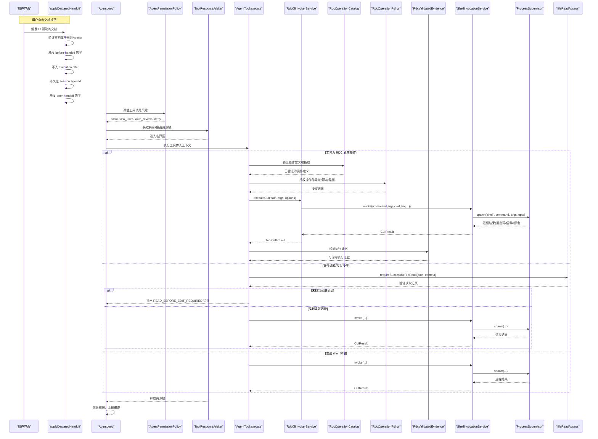
```mermaid
sequenceDiagram
participant UI as "用户界面"
participant Handoff as "applyDeclaredHandoff"
participant Agent as "AgentLoop"
participant Perm as "AgentPermissionPolicy"
participant Res as "ToolResourceArbiter"
participant Tool as "AgentTool.execute"
participant Cli as "RdcCliInvokerService"
participant Cat as "RdcOperationCatalog"
participant Pol as "RdcOperationPolicy"
participant Ev as "RdcValidatedEvidence"
participant Shell as "ShellInvocationService"
participant Proc as "ProcessSupervisor"
participant FileAccess as "fileReadAccess"
Note over UI,Handoff : 用户点击交接按钮
UI->>Handoff : 触发 UI 驱动的交接
Handoff->>Handoff : 验证声明属于当前/profile
Handoff->>Handoff : 触发 before-handoff 钩子
Handoff->>Handoff : 写入 execution offer
Handoff->>Handoff : 持久化 session.agentId
Handoff->>Handoff : 触发 after-handoff 钩子
Agent->>Perm : 评估工具调用风险
Perm-->>Agent : allow / ask_user / auto_review / deny
Agent->>Res : 获取共享/独占资源锁
Res-->>Agent : 进入临界区
Agent->>Tool : 执行工具传入上下文
alt 工具为 RDC 原生操作
Tool->>Cat : 验证操作定义和指纹
Cat-->>Tool : 已验证的操作定义
Tool->>Pol : 授权操作作用域/影响/路径
Pol-->>Tool : 授权结果
Tool->>Cli : executeCLI('call', args, options)
Cli->>Shell : invoke({command,args,cwd,env,...})
Shell->>Proc : spawn('shell', command, args, opts)
Proc-->>Shell : 进程结果(退出码/信号/超时)
Shell-->>Cli : CLIResult
Cli-->>Tool : ToolCallResult
Tool->>Ev : 验证执行证据
Ev-->>Tool : 可信的执行证据
else 文件编辑/写入操作
Tool->>FileAccess : requireSuccessfulFileRead(path, context)
FileAccess-->>Tool : 验证读取记录
alt 未找到读取记录
Tool-->>Agent : 抛出 READ_BEFORE_EDIT_REQUIRED 错误
else 找到读取记录
Tool->>Shell : invoke(...)
Shell->>Proc : spawn(...)
Proc-->>Shell : 进程结果
Shell-->>Tool : CLIResult
end
else 普通 shell 命令
Tool->>Shell : invoke(...)
Shell->>Proc : spawn(...)
Proc-->>Shell : 进程结果
Shell-->>Tool : CLIResult
end
Res-->>Agent : 释放资源锁
Agent-->>Agent : 聚合结果、上报追踪
```

**图表来源**
- [applyDeclaredHandoff.ts:38-94](file://src/main/conversation/applyDeclaredHandoff.ts#L38-L94)
- [AgentLoop.ts:758-825](file://src/main/agent-runtime/agent/AgentLoop.ts#L758-L825)
- [AgentPermissionPolicy.ts:323-480](file://src/main/agent-runtime/permissions/AgentPermissionPolicy.ts#L323-L480)
- [ToolResourceArbiter.ts:1-26](file://src/main/workflow/debugger/ToolResourceArbiter.ts#L1-L26)
- [RdcCliInvokerService.ts:178-221](file://src/main/tools/RdcCliInvokerService.ts#L178-L221)
- [RdcOperationCatalog.ts:20-61](file://src/main/tools/RdcOperationCatalog.ts#L20-L61)
- [RdcOperationPolicy.ts:49-104](file://src/main/tools/RdcOperationPolicy.ts#L49-L104)
- [RdcValidatedEvidence.ts:21-86](file://src/main/tools/RdcValidatedEvidence.ts#L21-L86)
- [ShellInvocationService.ts:32-105](file://src/main/tools/ShellInvocationService.ts#L32-L105)
- [fileReadAccess.ts:13-17](file://src/main/agent-runtime/tools/primitives/fileReadAccess.ts#L13-L17)

## 详细组件分析

### RdcCliInvokerService：CLI 调用机制
- 配置与可用性：从设置读取 rdcCli 配置（enabled/command/workingDirectory/env/timeoutMs/catalogPath），并提供 isAvailable/getRuntimeSummary 暴露运行态。
- 目录加载：loadCatalog 支持从 catalogPath 加载工具清单，未配置时返回空目录；缓存已加载目录以避免重复 IO。
- 参数构建：normalizeCliArgs 将 --context-id 转换为 --daemon-context；buildCommandArgs 合并 settings.argsPrefix、全局参数、命令名与命令参数。
- 执行流程：executeCLI 通过 resolveRdcBatchInvocation 解析实际命令与参数，再委托 ShellInvocationService.invoke 执行；支持 timeout/cwd/env/runId/contextId/abortSignal。
- 结果解析：call 方法构造 call 子命令，附加 --args-json 与 --daemon-context，调用 executeCLI 后使用 parseRdcNativeResult 校验协议，再将 stdout JSON 转为 ToolCallResult；异常路径统一包装为错误结果并触发追踪。
- 追踪：onInvocationTrace 订阅 ToolTraceEntry，包含 turnId/toolName/args/result/timestamp/contextId/runtimeOwner/ownerLeaseId 等。

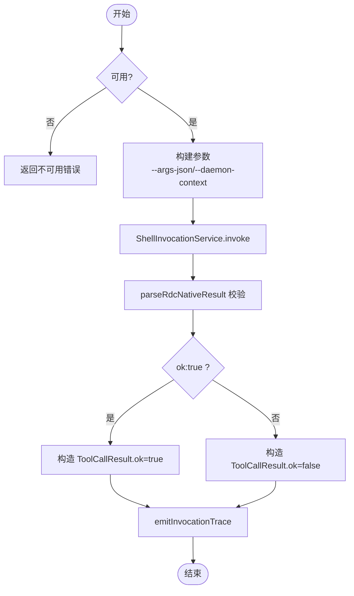
```mermaid
flowchart TD
Start(["开始"]) --> CheckAvail{"可用?"}
CheckAvail --> |否| ReturnErr["返回不可用错误"]
CheckAvail --> |是| BuildArgs["构建参数<br/>--args-json/--daemon-context"]
BuildArgs --> Invoke["ShellInvocationService.invoke"]
Invoke --> Parse["parseRdcNativeResult 校验"]
Parse --> Ok{"ok:true ?"}
Ok --> |是| ToResult["构造 ToolCallResult.ok=true"]
Ok --> |否| ToError["构造 ToolCallResult.ok=false"]
ToResult --> Trace["emitInvocationTrace"]
ToError --> Trace
Trace --> End(["结束"])
```

**图表来源**
- [RdcCliInvokerService.ts:49-116](file://src/main/tools/RdcCliInvokerService.ts#L49-L116)
- [RdcCliInvokerService.ts:143-221](file://src/main/tools/RdcCliInvokerService.ts#L143-L221)
- [RdcCliInvokerService.ts:248-355](file://src/main/tools/RdcCliInvokerService.ts#L248-L355)
- [RdcNativeProtocol.ts:12-34](file://src/main/tools/RdcNativeProtocol.ts#L12-L34)

**章节来源**
- [RdcCliInvokerService.ts:42-367](file://src/main/tools/RdcCliInvokerService.ts#L42-L367)
- [RdcNativeProtocol.ts:1-35](file://src/main/tools/RdcNativeProtocol.ts#L1-L35)

### ShellInvocationService：shell 执行环境
- 进程启动：使用 processSupervisor.spawn('shell', ...) 启动子进程，Windows 下 .bat/.cmd 自动启用 shell；注入 PYTHONIOENCODING=utf-8；非 Windows 平台隔离进程组。
- 超时与取消：支持 timeoutMs 与 AbortSignal；超时返回 exitCode=124 并附带 stderr 提示。
- 结果归一化：resolveExitCode 根据 code/signal 计算退出码；spawn_failed/unconfirmed_orphan 等 reason 分别处理。
- 进程跟踪：activeProcesses 记录当前活跃进程，支持 abortRun(runId) 与 terminateAll()；finally 块清理孤儿进程条目。

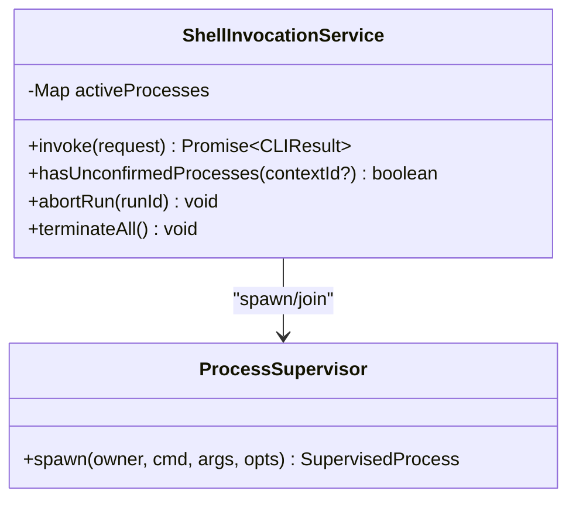
```mermaid
classDiagram
class ShellInvocationService {
-Map activeProcesses
+invoke(request) Promise~CLIResult~
+hasUnconfirmedProcesses(contextId?) boolean
+abortRun(runId) void
+terminateAll() void
}
class ProcessSupervisor {
+spawn(owner, cmd, args, opts) SupervisedProcess
}
ShellInvocationService --> ProcessSupervisor : "spawn/join"
```

**图表来源**
- [ShellInvocationService.ts:29-127](file://src/main/tools/ShellInvocationService.ts#L29-L127)

**章节来源**
- [ShellInvocationService.ts:29-127](file://src/main/tools/ShellInvocationService.ts#L29-L127)

### CommandRegistry：命令注册与管理
- 注册与别名：register 支持主名称与多个别名；unregister 同步删除别名映射。
- 查找与列举：resolve 支持别名；list 去重并按名称排序，可按 category 过滤。
- 执行：execute 解析 "/command args"，路由到对应命令；捕获异常并返回失败消息。

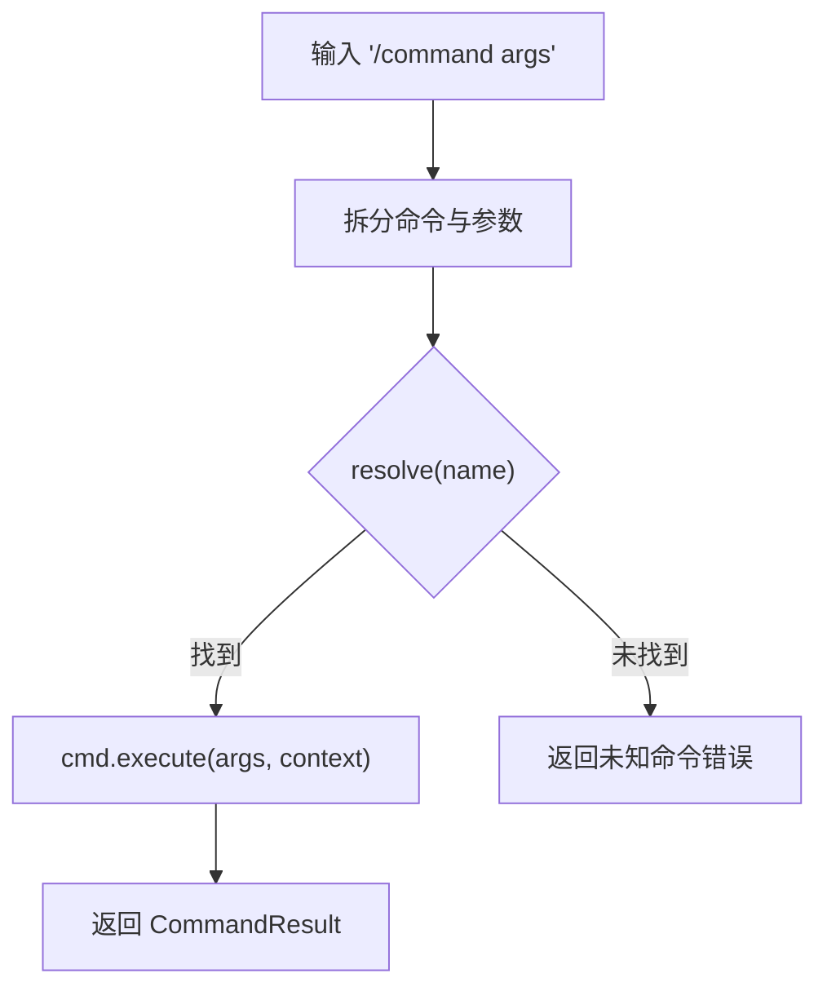
```mermaid
flowchart TD
Input["输入 '/command args'"] --> Split["拆分命令与参数"]
Split --> Resolve{"resolve(name)"}
Resolve --> |找到| Exec["cmd.execute(args, context)"]
Resolve --> |未找到| Fail["返回未知命令错误"]
Exec --> Result["返回 CommandResult"]
```

**图表来源**
- [CommandRegistry.ts:18-116](file://src/main/commands/CommandRegistry.ts#L18-L116)

**章节来源**
- [CommandRegistry.ts:18-116](file://src/main/commands/CommandRegistry.ts#L18-L116)

### ToolPool：工具池管理
- 功能：以 name 为键缓存 AgentTool 实例；提供 get/has/all/allNames/allMeta/clear。
- 用途：避免重复创建有状态工具（如数据库连接、API 客户端），减少初始化开销。

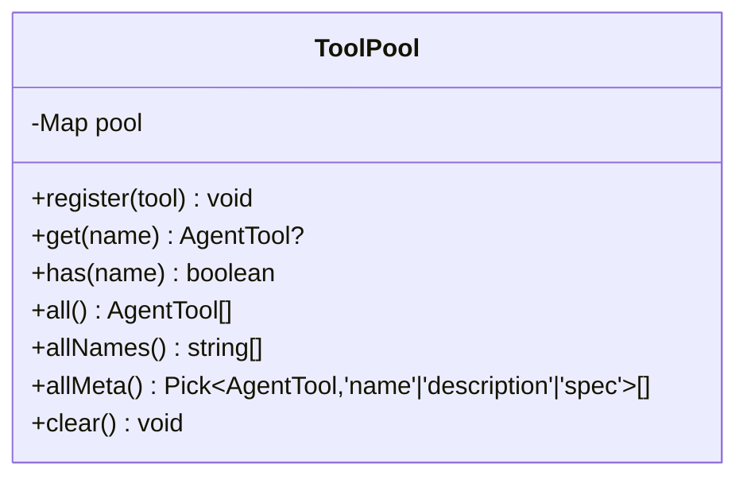
```mermaid
classDiagram
class ToolPool {
-Map pool
+register(tool) void
+get(name) AgentTool?
+has(name) boolean
+all() AgentTool[]
+allNames() string[]
+allMeta() Pick~AgentTool,'name'|'description'|'spec'~[]
+clear() void
}
```

**图表来源**
- [ToolPool.ts:1-38](file://src/main/agent-runtime/tools/ToolPool.ts#L1-L38)

**章节来源**
- [ToolPool.ts:1-38](file://src/main/agent-runtime/tools/ToolPool.ts#L1-L38)

### 文件操作安全机制：read-before-write 强制执行
- **新增** successfulFileReads 集合：在 ToolExecutionContext 中维护成功的文件读取记录，使用真实路径作为键值。
- **新增** recordSuccessfulFileRead：记录成功的文件读取操作，将绝对路径转换为真实路径并添加到集合中。
- **新增** requireSuccessfulFileRead：在执行编辑或覆盖操作前验证是否存在对应的读取记录，否则抛出 READ_BEFORE_EDIT_REQUIRED 错误。
- **平台兼容性**：在 Windows 平台上将路径转换为小写以确保大小写不敏感的路径匹配。
- **会话范围**：读取记录在同一会话内跨轮次有效，但不会在会话重启后保留。
- **安全防护**：即使文件已被读取，仍会拒绝符号链接、硬链接和目录路径的写入操作。

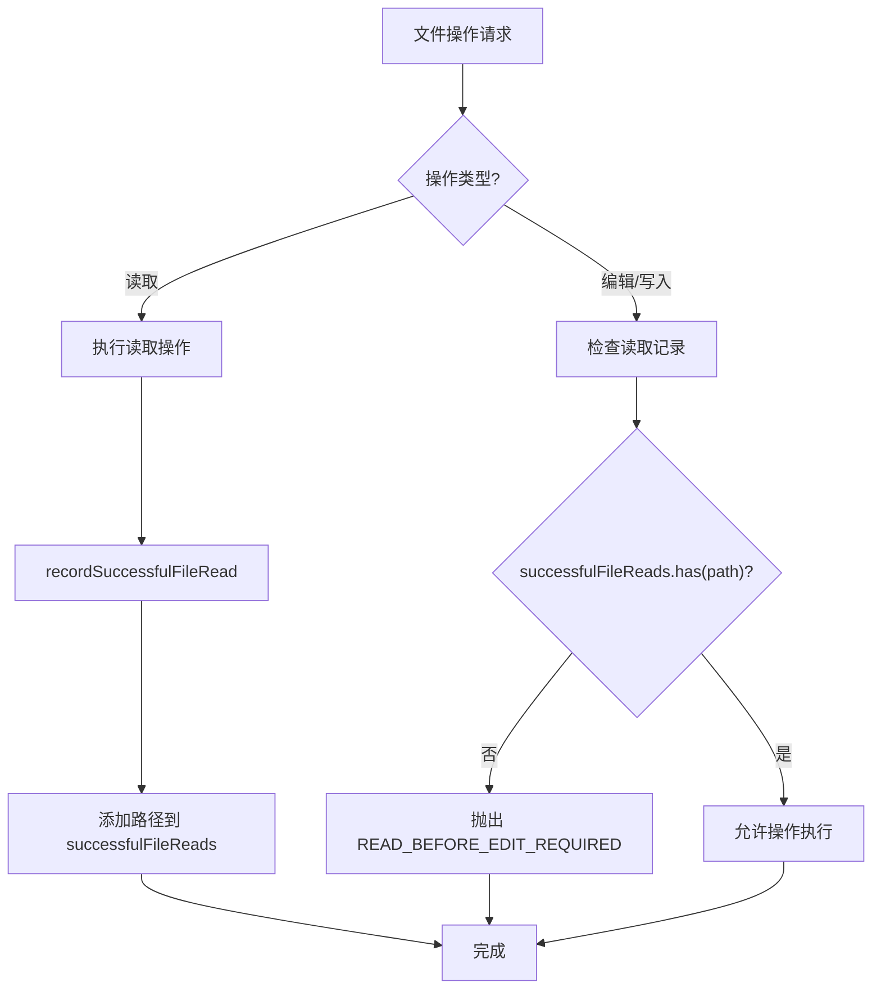
```mermaid
flowchart TD
Start["文件操作请求"] --> Type{"操作类型?"}
Type --> |读取| ReadOp["执行读取操作"]
Type --> |编辑/写入| WriteOp["检查读取记录"]
ReadOp --> Record["recordSuccessfulFileRead"]
Record --> Success["添加路径到 successfulFileReads"]
WriteOp --> Check{"successfulFileReads.has(path)?"}
Check --> |否| Error["抛出 READ_BEFORE_EDIT_REQUIRED"]
Check --> |是| Allow["允许操作执行"]
Success --> End["完成"]
Error --> End
Allow --> End
```

**图表来源**
- [ReadFileTool.ts:90-90](file://src/main/agent-runtime/tools/primitives/ReadFileTool.ts#L90-L90)
- [WriteFileTool.ts:75-75](file://src/main/agent-runtime/tools/primitives/WriteFileTool.ts#L75-L75)
- [EditFileTool.ts:71-71](file://src/main/agent-runtime/tools/primitives/EditFileTool.ts#L71-L71)
- [fileReadAccess.ts:9-17](file://src/main/agent-runtime/tools/primitives/fileReadAccess.ts#L9-L17)

**章节来源**
- [ReadFileTool.ts:60-101](file://src/main/agent-runtime/tools/primitives/ReadFileTool.ts#L60-L101)
- [WriteFileTool.ts:50-95](file://src/main/agent-runtime/tools/primitives/WriteFileTool.ts#L50-L95)
- [EditFileTool.ts:56-115](file://src/main/agent-runtime/tools/primitives/EditFileTool.ts#L56-L115)
- [fileReadAccess.ts:9-17](file://src/main/agent-runtime/tools/primitives/fileReadAccess.ts#L9-L17)

### 会话交接系统：applyDeclaredHandoff
- **已更新** 交接机制已从工具调用改为 UI 驱动：用户点击建议行或计划门后，直接调用 applyDeclaredHandoff 函数。
- 声明验证：findDeclaredHandoff 验证交接声明属于当前或刚批准的 profile，确保 label 和 agent 匹配。
- 钩子触发：在交接前后分别触发 agent.before-handoff 和 agent.after-handoff 钩子，允许扩展点介入。
- Execution Offer：如果计划已批准，写入 execution offer，包含 source/target agent、冻结计划 URI/hash、requiredSkillIds 等信息。
- 会话持久化：更新 session.agentId 为目标 agent，完成交接后的会话状态切换。
- 建议返回：返回包含 label、agent、prompt、send 字段的建议信息，供 UI 预填和自动发送使用。

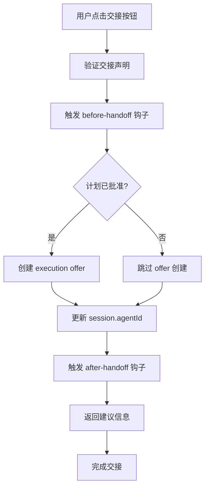
```mermaid
flowchart TD
UserClick["用户点击交接按钮"] --> Validate["验证交接声明"]
Validate --> HookBefore["触发 before-handoff 钩子"]
HookBefore --> WriteOffer{"计划已批准?"}
WriteOffer --> |是| CreateOffer["创建 execution offer"]
WriteOffer --> |否| SkipOffer["跳过 offer 创建"]
CreateOffer --> UpdateSession["更新 session.agentId"]
SkipOffer --> UpdateSession
UpdateSession --> HookAfter["触发 after-handoff 钩子"]
HookAfter --> ReturnSuggestion["返回建议信息"]
ReturnSuggestion --> End["完成交接"]
```

**图表来源**
- [applyDeclaredHandoff.ts:38-94](file://src/main/conversation/applyDeclaredHandoff.ts#L38-L94)

**章节来源**
- [applyDeclaredHandoff.ts:38-94](file://src/main/conversation/applyDeclaredHandoff.ts#L38-L94)

### 操作目录系统：RdcOperationCatalog
- 操作定义验证：validateDefinitions 严格校验操作数组的完整性，包括名称格式、作用域、影响类型、证据类型、输入 schema 和路径输入。
- 指纹计算：operationFingerprint 使用 SHA-256 对规范化后的操作定义计算指纹，确保操作契约的完整性。
- 应用操作约束：RDC_TOOL_APPLICATION_OPERATIONS 定义了应用程序拥有的固定集成点，包括 capture.open_file、remote.connect、session.* 等操作。**已移除** agent_handoff 相关操作。
- 深度冻结：deepFreeze 递归冻结操作定义对象，防止运行时修改。
- 应用操作验证：validateApplicationOperations 确保应用操作与预期契约完全匹配。

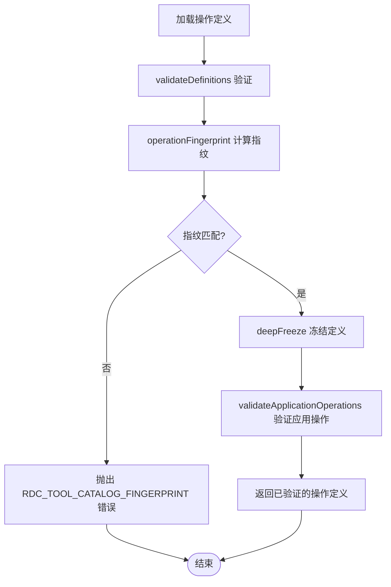
```mermaid
flowchart TD
Load["加载操作定义"] --> Validate["validateDefinitions 验证"]
Validate --> Fingerprint["operationFingerprint 计算指纹"]
Fingerprint --> Match{"指纹匹配?"}
Match --> |是| Freeze["deepFreeze 冻结定义"]
Match --> |否| Error["抛出 RDC_TOOL_CATALOG_FINGERPRINT 错误"]
Freeze --> AppOps["validateApplicationOperations 验证应用操作"]
AppOps --> Success["返回已验证的操作定义"]
Error --> End(["结束"])
Success --> End
```

**图表来源**
- [RdcOperationCatalog.ts:20-61](file://src/main/tools/RdcOperationCatalog.ts#L20-L61)

**章节来源**
- [RdcOperationCatalog.ts:20-61](file://src/main/tools/RdcOperationCatalog.ts#L20-L61)

### 执行证据验证：RdcValidatedEvidence
- 证据类型支持：
  - measurement：测量证据，包括 event_durations（事件持续时间）、counters（性能计数器）、image（图像文件）、frame_timing（帧时间）
  - intervention：干预证据，记录替换操作的应用状态
  - rollback：回滚证据，验证替换操作的恢复状态
- 测量验证：严格验证测量数据的完整性，包括采样条件、范围、数值有效性和文件格式。
- 干预验证：确保干预操作的状态为 applied，并记录 replacement_id 与上下文绑定。
- 回滚验证：验证回滚操作对应真实的干预，并确认已完全恢复。
- 条件指纹：为每种测量生成条件指纹，确保测量结果的可复现性和可比性。

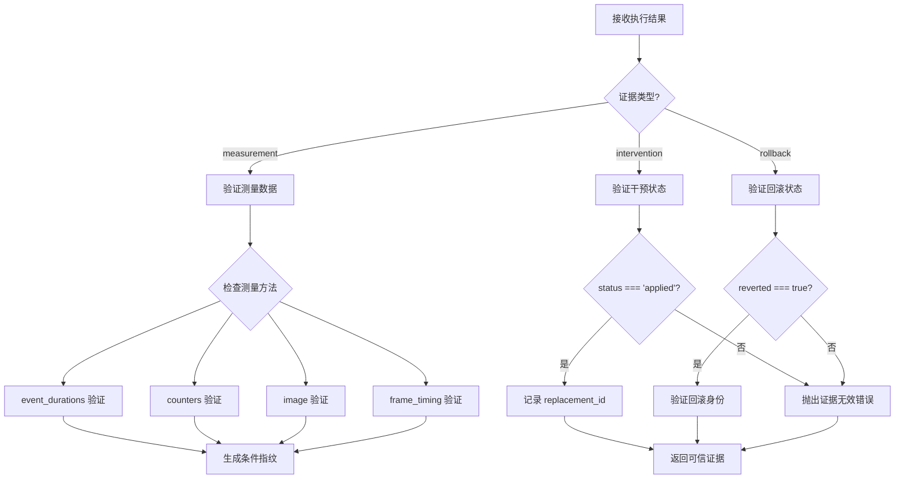
```mermaid
flowchart TD
Start["接收执行结果"] --> Type{"证据类型?"}
Type --> |measurement| Measure["验证测量数据"]
Type --> |intervention| Intervene["验证干预状态"]
Type --> |rollback| Rollback["验证回滚状态"]
Measure --> CheckMethods{"检查测量方法"}
CheckMethods --> EventDurations["event_durations 验证"]
CheckMethods --> Counters["counters 验证"]
CheckMethods --> Image["image 验证"]
CheckMethods --> FrameTiming["frame_timing 验证"]
Intervene --> CheckApplied{"status === 'applied'?"}
Rollback --> CheckReverted{"reverted === true?"}
EventDurations --> Valid["生成条件指纹"]
Counters --> Valid
Image --> Valid
FrameTiming --> Valid
CheckApplied --> |是| Record["记录 replacement_id"]
CheckApplied --> |否| Invalid["抛出证据无效错误"]
CheckReverted --> |是| VerifyIdentity["验证回滚身份"]
CheckReverted --> |否| Invalid
Record --> End["返回可信证据"]
VerifyIdentity --> End
Invalid --> End
```

**图表来源**
- [RdcValidatedEvidence.ts:21-86](file://src/main/tools/RdcValidatedEvidence.ts#L21-L86)

**章节来源**
- [RdcValidatedEvidence.ts:21-86](file://src/main/tools/RdcValidatedEvidence.ts#L21-L86)

### 操作授权：RdcOperationPolicy
- 作用域验证：限制操作只能在 global、context、replay、capture 四种作用域内执行。
- 影响类型白名单：仅允许 replay_position、artifact_write、context_metadata、shader_debug、shader_replacement 等有限的影响类型。
- 前置条件检查：验证操作的前置条件，如 session_id、capture_file_id 等必需参数。
- 身份保护：禁止覆盖 session_id、context_id、daemon_context 等敏感身份字段。
- 路径验证：对 VFS 路径和文件系统路径进行严格验证，防止路径穿越和越界访问。
- 编译器标志限制：仅允许特定的编译器优化标志，防止滥用编译选项。
- 源码预算限制：限制 shader 源码大小和 include 深度，防止资源耗尽攻击。

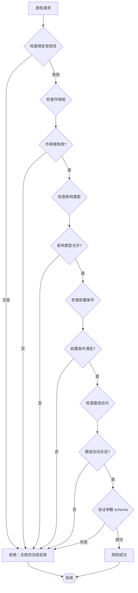
```mermaid
flowchart TD
Start["授权请求"] --> CheckBinding{"检查绑定有效性"}
CheckBinding --> |有效| CheckScope{"检查作用域"}
CheckBinding --> |无效| Deny["拒绝：无效的冻结目录"]
CheckScope --> ScopeValid{"作用域有效?"}
ScopeValid --> |是| CheckEffects{"检查影响类型"}
ScopeValid --> |否| Deny
CheckEffects --> EffectsValid{"影响类型允许?"}
EffectsValid --> |是| CheckPrereqs{"检查前置条件"}
EffectsValid --> |否| Deny
CheckPrereqs --> PrereqsValid{"前置条件满足?"}
PrereqsValid --> |是| CheckPaths{"检查路径访问"}
PrereqsValid --> |否| Deny
CheckPaths --> PathsValid{"路径访问合法?"}
PathsValid --> |是| ArgsValid{"验证参数 schema"}
PathsValid --> |否| Deny
ArgsValid --> |成功| Allow["授权成功"]
ArgsValid --> |失败| Deny
Deny --> End(["拒绝"])
Allow --> End
```

**图表来源**
- [RdcOperationPolicy.ts:49-104](file://src/main/tools/RdcOperationPolicy.ts#L49-L104)

**章节来源**
- [RdcOperationPolicy.ts:49-104](file://src/main/tools/RdcOperationPolicy.ts#L49-L104)

### 轮次绑定：RdcTurnBindings
- 绑定创建：freezeRdcTurnBinding 创建冻结的轮次绑定，包含 CLI 配置、操作定义和会话租约身份。
- 指纹计算：definitionsFingerprint 基于操作定义计算指纹，确保绑定的一致性。
- 身份管理：RdcLeaseIdentity 管理上下文 ID、版本、拥有者会话 ID 和运行时上下文。
- 绑定存储：使用 WeakMap 存储绑定，避免内存泄漏并确保绑定与计划对象的关联。
- 绑定访问：bindRdcTurn 和 getRdcTurnBinding 提供绑定的设置和获取接口。

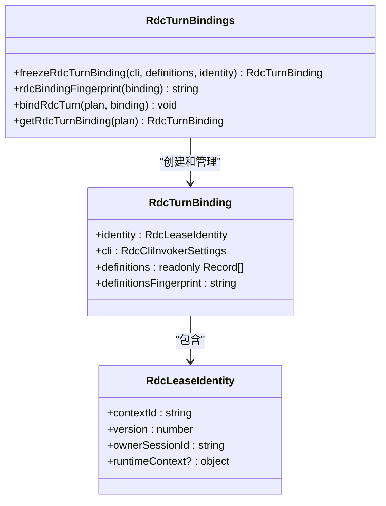
```mermaid
classDiagram
class RdcTurnBinding {
+identity : RdcLeaseIdentity
+cli : RdcCliInvokerSettings
+definitions : readonly Record[]
+definitionsFingerprint : string
}
class RdcLeaseIdentity {
+contextId : string
+version : number
+ownerSessionId : string
+runtimeContext? : object
}
class RdcTurnBindings {
+freezeRdcTurnBinding(cli, definitions, identity) RdcTurnBinding
+rdcBindingFingerprint(binding) string
+bindRdcTurn(plan, binding) void
+getRdcTurnBinding(plan) RdcTurnBinding
}
RdcTurnBindings --> RdcTurnBinding : "创建和管理"
RdcTurnBinding --> RdcLeaseIdentity : "包含"
```

**图表来源**
- [RdcTurnBindings.ts:20-38](file://src/main/tools/RdcTurnBindings.ts#L20-L38)

**章节来源**
- [RdcTurnBindings.ts:20-38](file://src/main/tools/RdcTurnBindings.ts#L20-L38)

### 工具接口规范与上下文
- AgentTool：定义 name/description/parameters/pollable/spec/permissionHint 与 execute 方法；execute 接收 toolCallId、args、AbortSignal、onUpdate 回调与 ToolExecutionContext。
- ToolExecutionContext：包含 rdcBinding（主进程私有绑定）、agentId/turnId/workspaceRoot/projectRootPath/project/sessionId/visionInputMode/temporaryAllowedPathRoots 等，**新增** successfulFileReads 集合用于跟踪文件读取记录。
- spec：描述工具行为属性（isReadOnly/isConcurrencySafe/isDestructive/sideEffect/category/requiresApproval），供调度与权限系统使用。

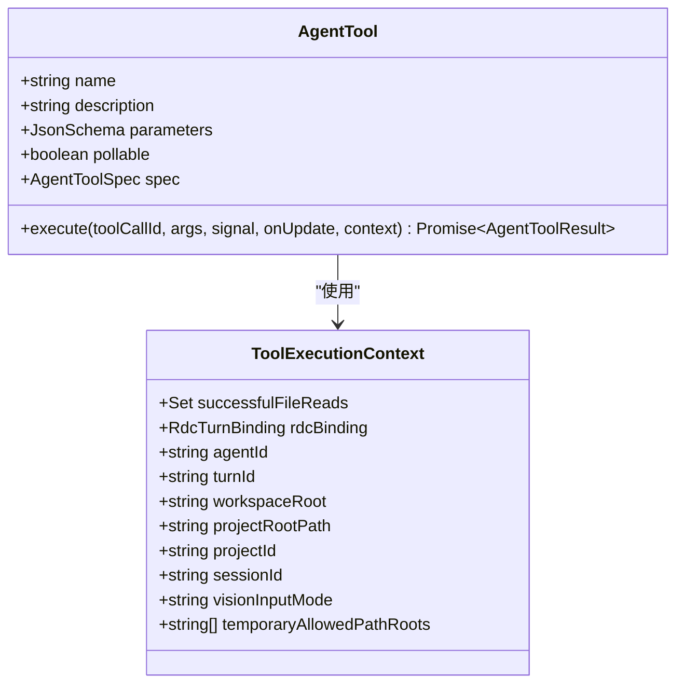
```mermaid
classDiagram
class AgentTool {
+string name
+string description
+JsonSchema parameters
+boolean pollable
+AgentToolSpec spec
+execute(toolCallId, args, signal, onUpdate, context) Promise~AgentToolResult~
}
class ToolExecutionContext {
+Set successfulFileReads
+RdcTurnBinding rdcBinding
+string agentId
+string turnId
+string workspaceRoot
+string projectRootPath
+string projectId
+string sessionId
+string visionInputMode
+string[] temporaryAllowedPathRoots
}
AgentTool --> ToolExecutionContext : "使用"
```

**图表来源**
- [AgentTool.ts:19-35](file://src/main/agent-runtime/agent/AgentTool.ts#L19-L35)
- [AgentTool.ts:54-73](file://src/main/agent-runtime/agent/AgentTool.ts#L54-L73)

**章节来源**
- [AgentTool.ts:19-35](file://src/main/agent-runtime/agent/AgentTool.ts#L19-L35)
- [AgentTool.ts:54-73](file://src/main/agent-runtime/agent/AgentTool.ts#L54-L73)

### 权限控制与安全沙箱
- 策略分类：AgentPermissionPolicyService.evaluate 综合模式（full-access/custom/auto-review/user）、工具名、命令内容、路径范围、知识读取根等，返回 allow/ask_user/auto_review/deny 决策。
- 危险命令：内置危险命令正则匹配与硬拒绝（matchShellHardDeny），即使 full-access 也不放行。
- 路径限制：read/write 工具目标路径需在 workspaceRoot 或配置的 readable/writable roots 内；否则请求审批或拒绝。
- 网络工具：web_fetch/web_search 在非 custom 模式下需要审批。
- **已更新** 令牌拒绝：handoff/agent/agent_handoff token 被明确拒绝，不再静默映射到 subagent。
- 沙箱边界：策略仅做风险评估与路由，真正的安全边界由 OS 权限、Electron 沙箱、IPC 校验保障。

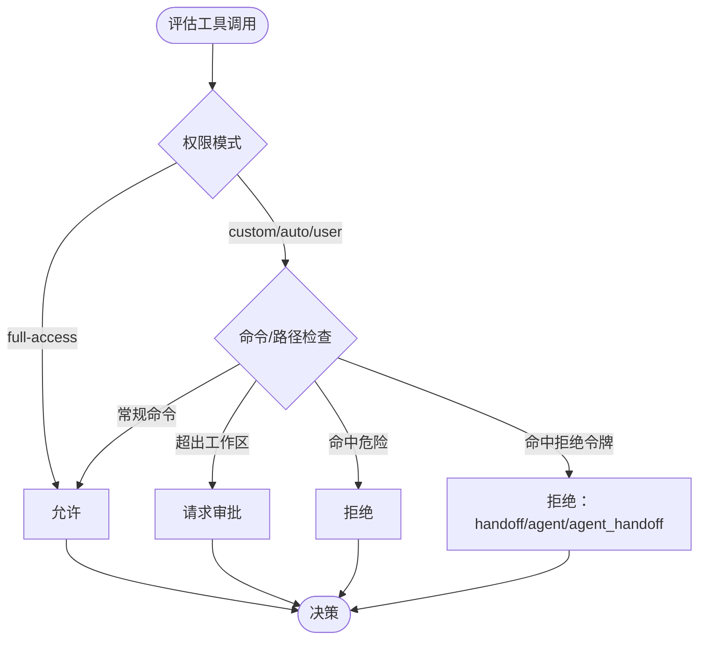
```mermaid
flowchart TD
Start(["评估工具调用"]) --> Mode{"权限模式"}
Mode --> |full-access| Allow["允许"]
Mode --> |custom/auto/user| CheckCmd{"命令/路径检查"}
CheckCmd --> |命中危险| Deny["拒绝"]
CheckCmd --> |命中拒绝令牌| DenyToken["拒绝：handoff/agent/agent_handoff"]
CheckCmd --> |超出工作区| Request["请求审批"]
CheckCmd --> |常规命令| Allow
Allow --> End(["决策"])
Request --> End
Deny --> End
DenyToken --> End
```

**图表来源**
- [AgentPermissionPolicy.ts:323-480](file://src/main/agent-runtime/permissions/AgentPermissionPolicy.ts#L323-L480)

**章节来源**
- [AgentPermissionPolicy.ts:323-480](file://src/main/agent-runtime/permissions/AgentPermissionPolicy.ts#L323-L480)

### 并发执行与资源仲裁
- 并发调度：AgentLoop 将工具调用分组，标记 isConcurrencySafe 的工具可并行执行；支持 reserveDispatchBudget 进行预算预留与限制。
- 资源仲裁：ToolResourceArbiter 在同一 session/project 范围内串行化不安全工具效果，防止并发写冲突；runShared/runExclusive 保证读写互斥。
- 会话级串行：ShellTool 对同一 sessionId 的 shell 调用加锁，避免并发修改工作目录或 RDC 会话状态。

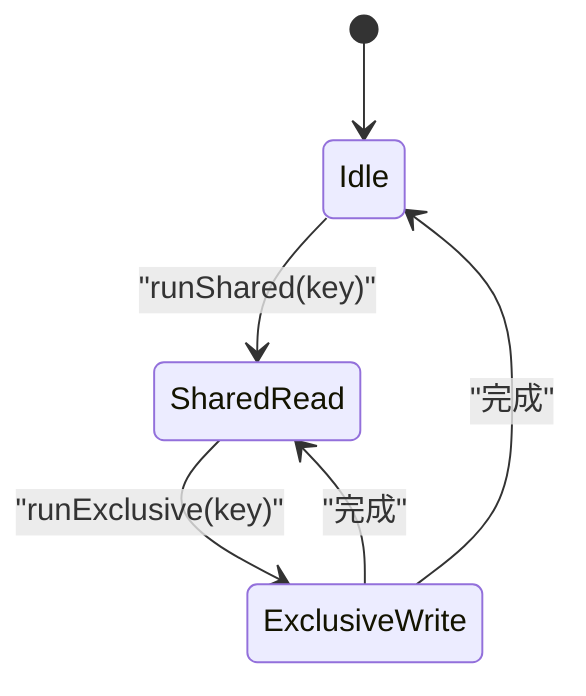
```mermaid
stateDiagram-v2
[*] --> Idle
Idle --> SharedRead : "runShared(key)"
SharedRead --> ExclusiveWrite : "runExclusive(key)"
ExclusiveWrite --> SharedRead : "完成"
ExclusiveWrite --> Idle : "完成"
```

**图表来源**
- [ToolResourceArbiter.ts:1-26](file://src/main/workflow/debugger/ToolResourceArbiter.ts#L1-L26)
- [ShellTool.ts:44-52](file://src/main/agent-runtime/tools/primitives/ShellTool.ts#L44-L52)
- [AgentLoop.ts:805-825](file://src/main/agent-runtime/agent/AgentLoop.ts#L805-L825)

**章节来源**
- [ToolResourceArbiter.ts:1-26](file://src/main/workflow/debugger/ToolResourceArbiter.ts#L1-L26)
- [ShellTool.ts:44-52](file://src/main/agent-runtime/tools/primitives/ShellTool.ts#L44-L52)
- [AgentLoop.ts:805-825](file://src/main/agent-runtime/agent/AgentLoop.ts#L805-L825)

### RDC 原生操作：executeRdcShell 与协议校验
- 输入校验：RdcShellInputSchema 限定 operation 必须为 rd.shader/perf/event/pipeline/resource/export 之一，args 为对象，experimentId 可选。
- 权限与租约：仅 general agent 且具备冻结绑定的会话可执行；校验 identity/version/contextId/ownerSessionId 与租约一致。
- 参数注入：自动注入 session_id 与 --daemon-context，禁止覆盖敏感字段（session_id/context_id/daemon_context/owner_session_id）。
- 收据与验证：若提供 experimentId，则准备并写入执行收据；执行后再次校验租约版本与 contextId 未变化；结果经 parseRdcNativeResult 校验。
- 异常恢复：任何异常都会 quarantineRdcContext，提示通过捕获生命周期进行恢复。

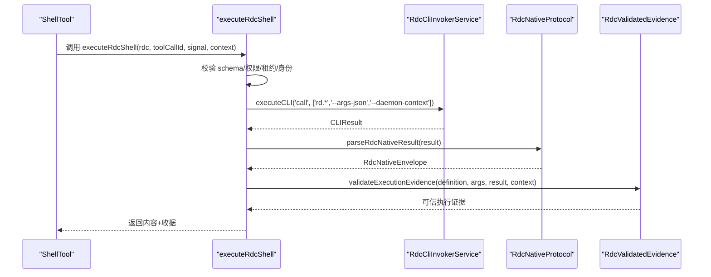
```mermaid
sequenceDiagram
participant ST as "ShellTool"
participant ER as "executeRdcShell"
participant RI as "RdcCliInvokerService"
participant RP as "RdcNativeProtocol"
participant EV as "RdcValidatedEvidence"
ST->>ER : 调用 executeRdcShell(rdc, toolCallId, signal, context)
ER->>ER : 校验 schema/权限/租约/身份
ER->>RI : executeCLI('call', ['rd.*','--args-json','--daemon-context'])
RI-->>ER : CLIResult
ER->>RP : parseRdcNativeResult(result)
RP-->>ER : RdcNativeEnvelope
ER->>EV : validateExecutionEvidence(definition, args, result, context)
EV-->>ER : 可信执行证据
ER-->>ST : 返回内容+收据
```

**图表来源**
- [executeRdcShell.ts:16-71](file://src/main/tools/executeRdcShell.ts#L16-L71)
- [RdcNativeProtocol.ts:12-34](file://src/main/tools/RdcNativeProtocol.ts#L12-L34)
- [RdcCliInvokerService.ts:178-221](file://src/main/tools/RdcCliInvokerService.ts#L178-L221)
- [RdcValidatedEvidence.ts:21-86](file://src/main/tools/RdcValidatedEvidence.ts#L21-L86)

**章节来源**
- [executeRdcShell.ts:16-71](file://src/main/tools/executeRdcShell.ts#L16-L71)
- [RdcNativeProtocol.ts:1-35](file://src/main/tools/RdcNativeProtocol.ts#L1-L35)

## 依赖关系分析
- RdcCliInvokerService 依赖 ShellInvocationService 与 SettingsService，并通过 RdcNativeProtocol 校验协议。
- ShellInvocationService 依赖 ProcessSupervisor 与 os/path 标准库。
- AgentLoop 依赖 AgentTool、AgentPermissionPolicy、ToolResourceArbiter 与工具执行器。
- ShellTool 依赖 ShellResolver、processSupervisor、storageAdapter 与 executeRdcShell。
- CommandRegistry 独立于工具系统，但可与上层 UI/命令体系集成。
- **新增** ReadFileTool 依赖 fileReadAccess 用于记录成功的文件读取。
- **新增** WriteFileTool 和 EditFileTool 依赖 fileReadAccess 用于验证读取记录。
- **已移除** agent_handoff 工具的相关依赖：不再依赖 HandoffStateStore、HandoffController 等组件。
- **新增** applyDeclaredHandoff 依赖 storageAdapter、planReviewStateStore 和 runtime hooks。
- **新增** executeRdcShell 依赖 RdcOperationCatalog、RdcOperationPolicy、RdcValidatedEvidence 和 RdcTurnBindings。
- **新增** RdcOperationPolicy 依赖 RdcOperationCatalog 和操作定义验证。
- **新增** RdcValidatedEvidence 依赖 RdcOperationCatalog 的规范化函数。

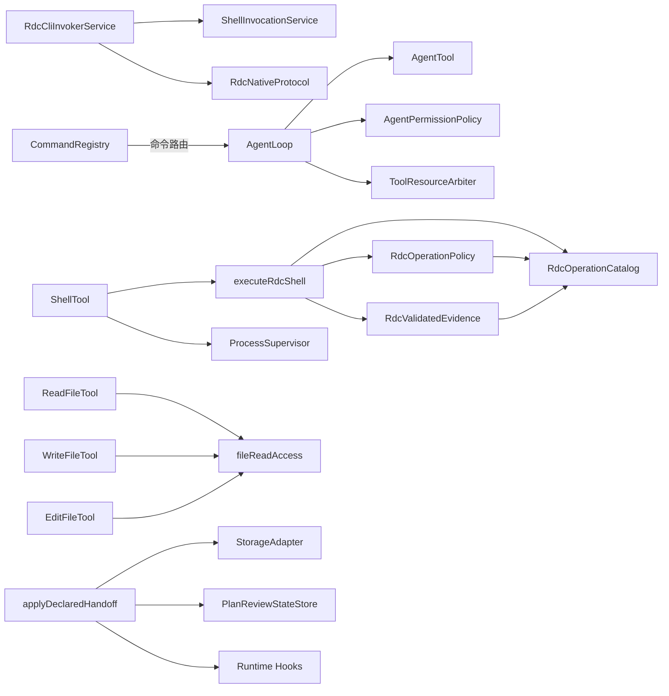
```mermaid
graph LR
RL["RdcCliInvokerService"] --> SI["ShellInvocationService"]
RL --> RP["RdcNativeProtocol"]
AL["AgentLoop"] --> AT["AgentTool"]
AL --> AP["AgentPermissionPolicy"]
AL --> TR["ToolResourceArbiter"]
ST["ShellTool"] --> ER["executeRdcShell"]
ST --> PS["ProcessSupervisor"]
CR["CommandRegistry"] --> |"命令路由"| AL
RF["ReadFileTool"] --> FRA["fileReadAccess"]
WF["WriteFileTool"] --> FRA
EF["EditFileTool"] --> FRA
ADH["applyDeclaredHandoff"] --> SA["StorageAdapter"]
ADH --> PRSS["PlanReviewStateStore"]
ADH --> RH["Runtime Hooks"]
ER --> RC["RdcOperationCatalog"]
ER --> OP["RdcOperationPolicy"]
ER --> EV["RdcValidatedEvidence"]
OP --> RC
EV --> RC
```

**图表来源**
- [RdcCliInvokerService.ts:42-221](file://src/main/tools/RdcCliInvokerService.ts#L42-L221)
- [ShellInvocationService.ts:29-127](file://src/main/tools/ShellInvocationService.ts#L29-L127)
- [AgentLoop.ts:758-825](file://src/main/agent-runtime/agent/AgentLoop.ts#L758-L825)
- [ShellTool.ts:83-138](file://src/main/agent-runtime/tools/primitives/ShellTool.ts#L83-L138)
- [CommandRegistry.ts:18-116](file://src/main/commands/CommandRegistry.ts#L18-L116)
- [ReadFileTool.ts:9-9](file://src/main/agent-runtime/tools/primitives/ReadFileTool.ts#L9-L9)
- [WriteFileTool.ts:10-10](file://src/main/agent-runtime/tools/primitives/WriteFileTool.ts#L10-L10)
- [EditFileTool.ts:10-10](file://src/main/agent-runtime/tools/primitives/EditFileTool.ts#L10-L10)
- [applyDeclaredHandoff.ts:38-94](file://src/main/conversation/applyDeclaredHandoff.ts#L38-L94)
- [executeRdcShell.ts:1-15](file://src/main/tools/executeRdcShell.ts#L1-L15)
- [RdcOperationPolicy.ts:1-104](file://src/main/tools/RdcOperationPolicy.ts#L1-L104)
- [RdcValidatedEvidence.ts:1-86](file://src/main/tools/RdcValidatedEvidence.ts#L1-L86)

**章节来源**
- [RdcCliInvokerService.ts:42-221](file://src/main/tools/RdcCliInvokerService.ts#L42-L221)
- [ShellInvocationService.ts:29-127](file://src/main/tools/ShellInvocationService.ts#L29-L127)
- [AgentLoop.ts:758-825](file://src/main/agent-runtime/agent/AgentLoop.ts#L758-L825)
- [ShellTool.ts:83-138](file://src/main/agent-runtime/tools/primitives/ShellTool.ts#L83-L138)
- [CommandRegistry.ts:18-116](file://src/main/commands/CommandRegistry.ts#L18-L116)
- [ReadFileTool.ts:9-9](file://src/main/agent-runtime/tools/primitives/ReadFileTool.ts#L9-L9)
- [WriteFileTool.ts:10-10](file://src/main/agent-runtime/tools/primitives/WriteFileTool.ts#L10-L10)
- [EditFileTool.ts:10-10](file://src/main/agent-runtime/tools/primitives/EditFileTool.ts#L10-L10)
- [applyDeclaredHandoff.ts:38-94](file://src/main/conversation/applyDeclaredHandoff.ts#L38-L94)
- [executeRdcShell.ts:1-15](file://src/main/tools/executeRdcShell.ts#L1-L15)
- [RdcOperationPolicy.ts:1-104](file://src/main/tools/RdcOperationPolicy.ts#L1-L104)
- [RdcValidatedEvidence.ts:1-86](file://src/main/tools/RdcValidatedEvidence.ts#L1-L86)

## 性能考量
- 目录缓存：RdcCliInvokerService.loadCatalog 缓存已加载的 catalog，避免重复 IO。
- 进程复用与隔离：ShellInvocationService 使用 processSupervisor 管理进程生命周期，支持超时与隔离，减少资源泄漏。
- 输出截断：ShellTool 对 stdout/stderr 进行环形缓冲与截断，防止大输出阻塞内存。
- 并发分组：AgentLoop 将安全工具分组并行执行，提升吞吐；对破坏性工具串行化，避免竞争。
- 资源仲裁：ToolResourceArbiter 在 session/project 范围内串行化写操作，降低冲突与重试成本。
- 超时与取消：所有长耗时操作均支持 timeoutMs 与 AbortSignal，及时释放资源。
- **新增** 读取记录缓存：successfulFileReads 集合提供 O(1) 复杂度的读取记录查找，避免重复文件访问。
- **新增** 路径规范化：使用 realpathSync 确保路径比较的准确性，避免符号链接导致的安全问题。
- **已移除** agent_handoff 工具的性能开销：不再需要维护复杂的交接状态机和 durable 存储。
- **新增** 操作定义缓存：RdcOperationCatalog 的深度冻结和指纹验证减少重复验证开销。
- **新增** 证据验证优化：RdcValidatedEvidence 的条件指纹计算避免重复哈希计算。
- **新增** UI 驱动交接的性能优势：避免了工具调用的序列化开销，直接通过 UI 事件触发。

## 故障排查指南
- CLI 不可用：检查 RdcCliInvokerService.getAvailabilityFailure 返回的原因（未启用/命令未配置/命令不存在）。
- 协议错误：RdcNativeProtocol.parseRdcNativeResult 抛出协议错误（exitCode!=0、非 JSON、缺少 result_kind/data、context_id 不匹配）。
- 进程问题：ShellInvocationService 返回 spawn_failed/timeout/unconfirmed_orphan；检查进程是否存在、超时是否合理、孤儿进程是否被清理。
- 权限拒绝：AgentPermissionPolicy 返回 deny/ask_user/auto_review/deny；查看命令是否命中危险模式、路径是否在工作区外、是否属于网络工具。
- 租约失效：executeRdcShell 在执行前后校验租约版本与 contextId；若变化，需重新 prepareTurn。
- 并发冲突：ToolResourceArbiter 串行化写操作；若出现竞态，确认是否正确使用 runExclusive。
- **新增** 读取记录缺失：write_file 和 edit_file 抛出 READ_BEFORE_EDIT_REQUIRED 错误；确保先执行 read_file 操作。
- **新增** 路径解析问题：successfulFileReads 使用真实路径作为键值，符号链接路径可能无法匹配。
- **已移除** agent_handoff 工具错误：不再出现 agent_handoff 工具未找到或执行失败的错误。
- **新增** 交接声明错误：applyDeclaredHandoff 可能返回 DECLARED_HANDOFF_NOT_FOUND、CONVERSATION_AGENT_UNAVAILABLE 等错误；检查声明是否正确配置。
- **新增** 操作目录错误：RdcOperationCatalog.validateDefinitions 抛出 RDC_TOOL_UPGRADE_REQUIRED 或 RDC_TOOL_CATALOG_FINGERPRINT 错误；检查 CLI 版本兼容性。
- **新增** 证据验证失败：RdcValidatedEvidence 抛出 RDC_TOOL_EVIDENCE_INVALID 错误；检查测量数据格式、干预状态或回滚身份。
- **新增** 授权失败：RdcOperationPolicy 抛出 RDC_TOOL_EXECUTION_DENIED 错误；检查操作作用域、影响类型或路径访问权限。

**章节来源**
- [RdcCliInvokerService.ts:70-86](file://src/main/tools/RdcCliInvokerService.ts#L70-L86)
- [RdcNativeProtocol.ts:12-34](file://src/main/tools/RdcNativeProtocol.ts#L12-L34)
- [ShellInvocationService.ts:67-105](file://src/main/tools/ShellInvocationService.ts#L67-L105)
- [AgentPermissionPolicy.ts:353-480](file://src/main/agent-runtime/permissions/AgentPermissionPolicy.ts#L353-L480)
- [executeRdcShell.ts:21-33](file://src/main/tools/executeRdcShell.ts#L21-L33)
- [ToolResourceArbiter.ts:19-26](file://src/main/workflow/debugger/ToolResourceArbiter.ts#L19-L26)
- [fileReadAccess.ts:13-17](file://src/main/agent-runtime/tools/primitives/fileReadAccess.ts#L13-L17)
- [WriteFileTool.ts:75-75](file://src/main/agent-runtime/tools/primitives/WriteFileTool.ts#L75-L75)
- [EditFileTool.ts:71-71](file://src/main/agent-runtime/tools/primitives/EditFileTool.ts#L71-L71)
- [applyDeclaredHandoff.ts:38-94](file://src/main/conversation/applyDeclaredHandoff.ts#L38-L94)
- [RdcOperationCatalog.ts:20-36](file://src/main/tools/RdcOperationCatalog.ts#L20-L36)
- [RdcValidatedEvidence.ts:15-86](file://src/main/tools/RdcValidatedEvidence.ts#L15-L86)
- [RdcOperationPolicy.ts:11-104](file://src/main/tools/RdcOperationPolicy.ts#L11-L104)

## 结论
该工具系统通过分层设计实现了安全的 CLI/shell 执行、严格的权限控制、可控的并发与资源仲裁、以及稳定的进程管理与协议校验。RdcCliInvokerService 与 ShellInvocationService 提供了可靠的底层执行能力；AgentTool 与 ToolPool 定义了清晰的工具接口与实例管理；AgentPermissionPolicy 与 ToolResourceArbiter 构建了安全与一致性保障；AgentLoop 则负责高效调度与错误聚合。

**重大更新**：新增了 read-before-write 强制执行机制，显著提升了文件操作的安全性。通过在 ToolExecutionContext 中维护 successfulFileReads 集合，系统能够跟踪每个会话中的文件读取记录，确保编辑和写入操作前先有成功的读取操作。这一机制有效防止了未经确认的文件修改，提高了系统的可靠性和安全性。

移除了 agent_handoff 工具的执行能力，将交接功能完全转为 UI 驱动。新的 applyDeclaredHandoff 机制通过用户界面交互触发会话交接，简化了交接流程并移除了复杂的状态机。新增的操作目录系统和能力驱动执行模型显著增强了系统的可靠性和安全性。RdcOperationCatalog 提供了严格的契约验证和指纹校验，确保操作定义的一致性和完整性。RdcValidatedEvidence 验证系统支持测量、干预和回滚三种执行证据类型，为实验性操作提供了可信的执行证明。RdcOperationPolicy 基于冻结的操作定义进行细粒度授权，防止未经授权的访问和修改。这些改进使得工具系统能够更好地支持复杂的自动化任务和诊断场景，同时保持高度的安全性和可靠性。

整体架构兼顾了可扩展性与安全性，适合构建复杂的自动化与诊断工具链。

## 附录：工具开发与最佳实践
- 定义工具：实现 AgentTool 接口，明确 name/description/parameters/spec/permissionHint；spec 应准确描述只读/可并发/破坏性/副作用类型/类别/是否需要审批。
- 上下文使用：通过 ToolExecutionContext 获取 workspaceRoot/projectRootPath/sessionId 等，确保路径与工作区一致，避免跨域访问。**新增** successfulFileReads 集合用于跟踪文件读取记录。
- 权限合规：遵循 AgentPermissionPolicy 的规则，避免危险命令与越权路径；必要时提供合理的 description 与参数说明以降低审批难度。
- 并发与资源：对于可并发工具声明 isConcurrencySafe=true；对写操作使用 ToolResourceArbiter.runExclusive 保护；对会话级操作使用 ShellTool 的会话锁。
- 超时与取消：所有长耗时操作支持 AbortSignal；合理设置 timeoutMs，避免长时间占用资源。
- 结果与追踪：返回标准化的 AgentToolResult；对 CLI 调用使用 RdcCliInvokerService 并订阅 onInvocationTrace 以便审计。
- 自定义扩展：通过 ToolPool.register 注册新工具；如需命令形式，可在 CommandRegistry.register 添加命令定义；如需 RDC 原生操作，封装 executeRdcShell 并遵守协议。
- **新增** 文件操作安全：实现文件编辑或写入功能时，必须调用 requireSuccessfulFileRead 验证读取记录；读取成功后调用 recordSuccessfulFileRead 记录读取操作。
- **新增** 读取记录管理：successfulFileReads 集合在同一会话内跨轮次有效，但不会在会话重启后保留；使用真实路径作为键值确保路径匹配的准确性。
- **已移除** agent_handoff 工具开发：不再需要实现 agent_handoff 工具，交接功能已通过 UI 驱动方式实现。
- **新增** UI 驱动交接开发：如需自定义交接流程，实现 applyDeclaredHandoff 的扩展点，正确配置 handoffs 声明和 requiredSkillIds。
- **新增** 操作目录开发：使用 RdcOperationCatalog 验证操作定义，确保符合契约规范；利用指纹机制保证操作定义的一致性。
- **新增** 证据验证：为实验性操作实现适当的证据验证，支持测量、干预或回滚类型；确保测量数据的真实性和完整性。
- **新增** 授权策略：遵循 RdcOperationPolicy 的作用域和影响类型限制；正确配置前置条件和路径访问权限。
- **新增** 轮次绑定：使用 RdcTurnBindings 管理轮次级别的绑定，确保 CLI 配置和操作定义的冻结一致性。
- **最佳实践** 交接设计：在 agent manifest 中正确声明 handoffs，确保 label、agent、prompt 与实际业务逻辑一致；使用 send:true 表示自动发送，showContinueOn 控制显示行为。
- **最佳实践** 文件操作：在进行文件编辑前，先执行读取操作获取文件内容；使用精确的搜索替换文本，避免误改；处理符号链接和硬链接时的安全风险。

[本节为通用指导，不直接分析具体文件]