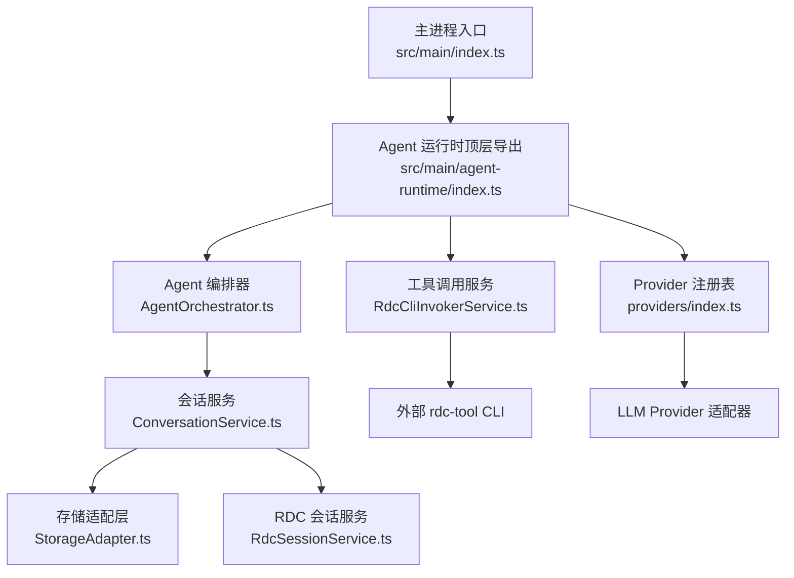
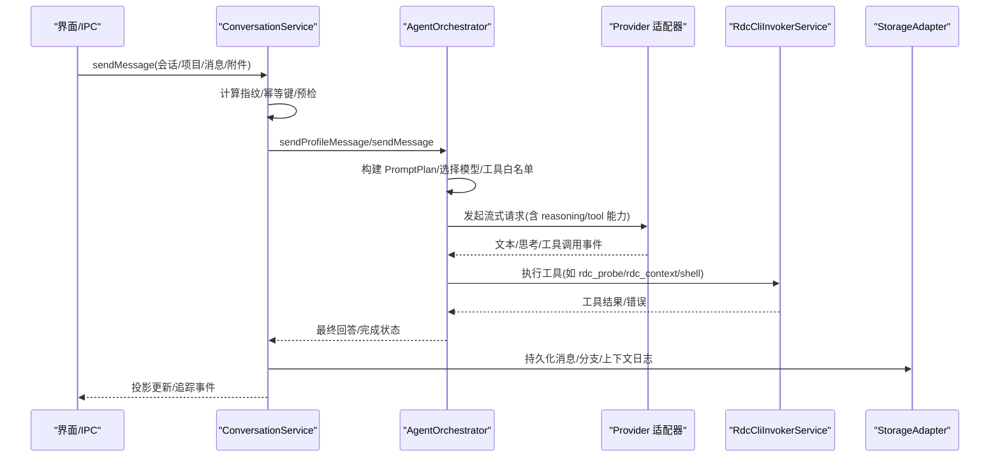
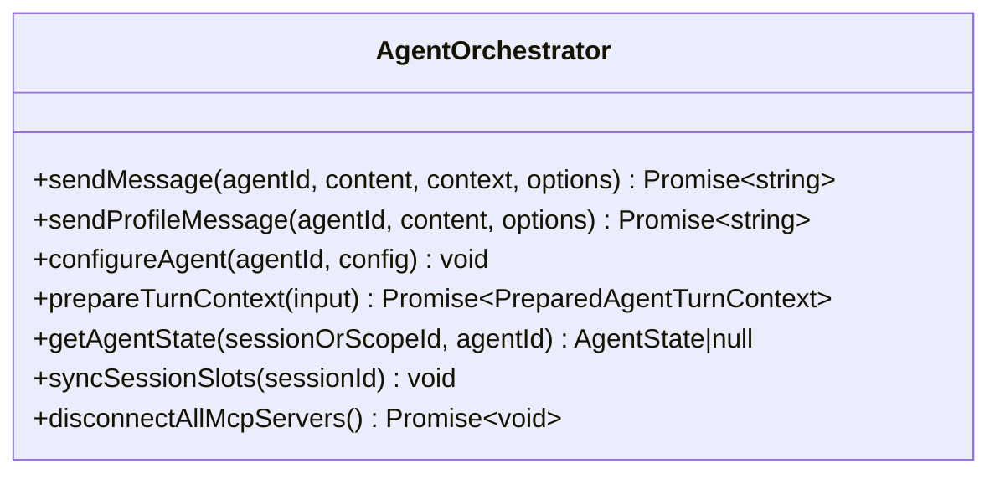
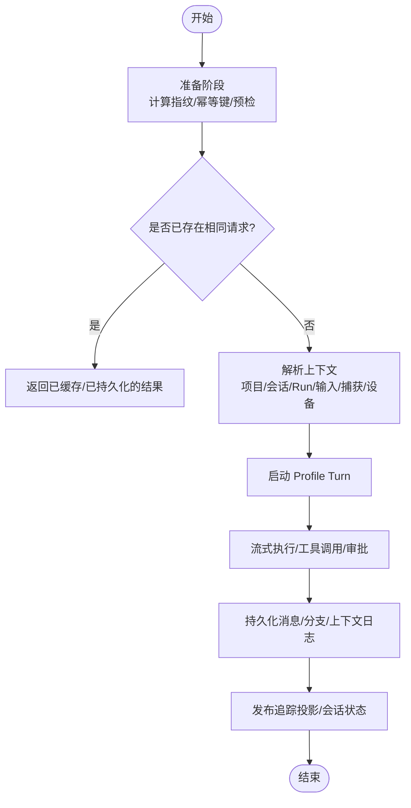
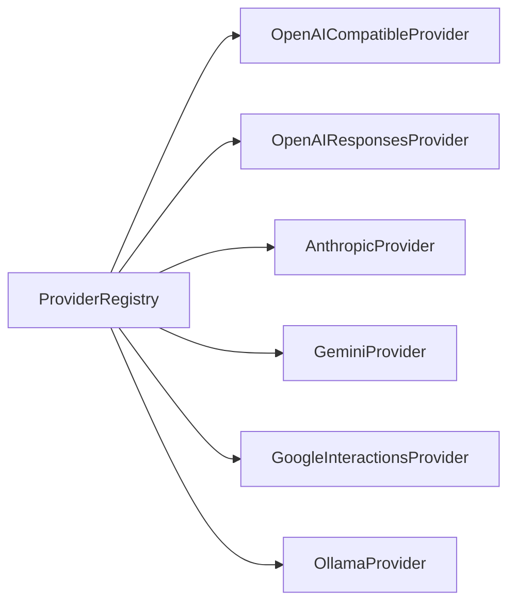
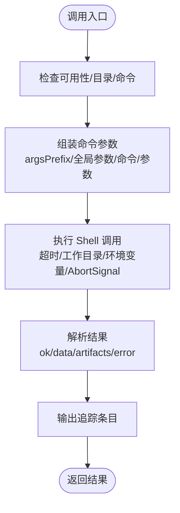
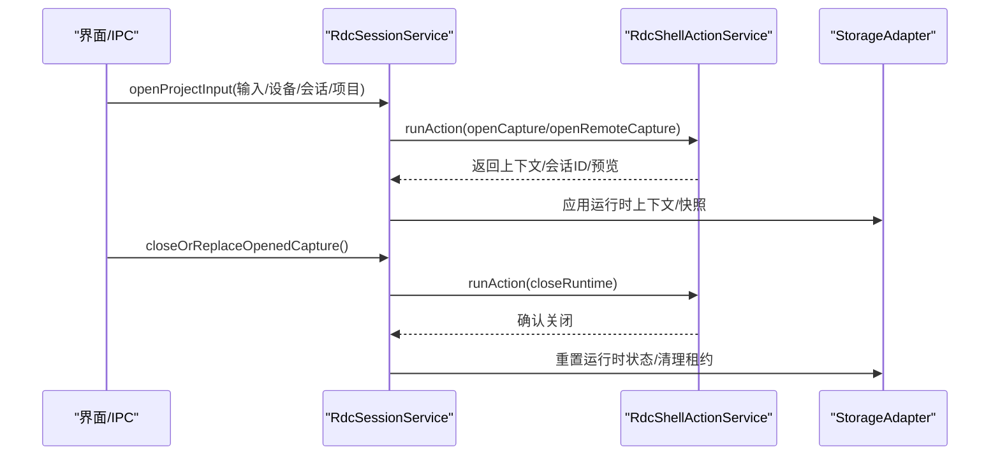
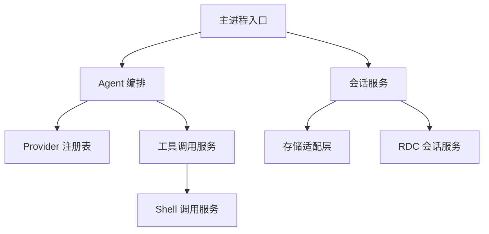

# 核心模块

<cite>
**本文引用的文件**
- [src/main/index.ts](file://src/main/index.ts)
- [src/main/agent-runtime/index.ts](file://src/main/agent-runtime/index.ts)
- [src/main/workflow/debugger/AgentOrchestrator.ts](file://src/main/workflow/debugger/AgentOrchestrator.ts)
- [src/main/conversation/ConversationService.ts](file://src/main/conversation/ConversationService.ts)
- [src/main/sessions/RdcSessionService.ts](file://src/main/sessions/RdcSessionService.ts)
- [src/main/sessions\StorageAdapter.ts](file://src/main/sessions/StorageAdapter.ts)
- [src/main/tools/RdcCliInvokerService.ts](file://src/main/tools/RdcCliInvokerService.ts)
- [src/main/agent-runtime/providers/index.ts](file://src/main/agent-runtime/providers/index.ts)
- [docs/architecture/agent-runtime-kernel.md](file://docs/architecture/agent-runtime-kernel.md)
</cite>

## 目录
1. [简介](#简介)
2. [项目结构](#项目结构)
3. [核心组件](#核心组件)
4. [架构总览](#架构总览)
5. [详细组件分析](#详细组件分析)
6. [依赖关系分析](#依赖关系分析)
7. [性能考量](#性能考量)
8. [故障排查指南](#故障排查指南)
9. [结论](#结论)
10. [附录](#附录)

## 简介
本文件面向 RDC-Agent 的核心模块，聚焦 Agent 编排系统、会话管理系统、Provider 系统与工具系统四大关键组件。文档从接口定义、配置选项、使用示例与最佳实践出发，解释各模块的职责边界、数据流与协作方式，并通过时序图与流程图帮助读者理解在应用中如何集成与使用这些模块。

## 项目结构
RDC-Agent 采用分层组织：主进程入口负责应用生命周期与安全策略；Agent 运行时提供统一的顶层导出；工作流层编排对话与任务；会话层管理持久化与上下文；工具层封装外部 rdc-tool CLI 调用；Provider 层抽象多种 LLM 适配器。

图表来源
- [src/main/index.ts:1-120](file://src/main/index.ts#L1-L120)
- [src/main/agent-runtime/index.ts:1-14](file://src/main/agent-runtime/index.ts#L1-L14)
- [src/main/workflow/debugger/AgentOrchestrator.ts:1-145](file://src/main/workflow/debugger/AgentOrchestrator.ts#L1-L145)
- [src/main/agent-runtime/providers/index.ts:1-40](file://src/main/agent-runtime/providers/index.ts#L1-L40)
- [src/main/tools/RdcCliInvokerService.ts:1-120](file://src/main/tools/RdcCliInvokerService.ts#L1-L120)
- [src/main/conversation/ConversationService.ts:1-120](file://src/main/conversation/ConversationService.ts#L1-L120)
- [src/main/sessions/StorageAdapter.ts:1-90](file://src/main/sessions/StorageAdapter.ts#L1-L90)
- [src/main/sessions/RdcSessionService.ts:1-70](file://src/main/sessions/RdcSessionService.ts#L1-L70)

章节来源
- [src/main/index.ts:1-120](file://src/main/index.ts#L1-L120)
- [src/main/agent-runtime/index.ts:1-14](file://src/main/agent-runtime/index.ts#L1-L14)

## 核心组件
- Agent 编排系统：统一协调 Turn 准备、工具装配、执行器、子代理与提示计划，对外暴露发送消息、配置 Agent、准备上下文等能力。
- 会话管理系统：维护会话历史、分支状态、后台续跑、去重与幂等控制，并桥接存储与追踪投影。
- Provider 系统：注册与管理多种 LLM 适配器，按路由与请求计划选择模型与协议，规范化事件流。
- 工具系统：封装 rdc-tool CLI 的目录加载、命令组装、执行与结果解析，提供可用性检查与运行元信息。

章节来源
- [src/main/workflow/debugger/AgentOrchestrator.ts:75-145](file://src/main/workflow/debugger/AgentOrchestrator.ts#L75-L145)
- [src/main/conversation/ConversationService.ts:78-120](file://src/main/conversation/ConversationService.ts#L78-L120)
- [src/main/agent-runtime/providers/index.ts:21-40](file://src/main/agent-runtime/providers/index.ts#L21-L40)
- [src/main/tools/RdcCliInvokerService.ts:42-120](file://src/main/tools/RdcCliInvokerService.ts#L42-L120)

## 架构总览
下图展示一次用户消息从会话服务到 Agent 编排、再到 Provider 与工具的完整调用链，以及回流的追踪与投影更新。

图表来源
- [src/main/conversation/ConversationService.ts:545-569](file://src/main/conversation/ConversationService.ts#L545-L569)
- [src/main/workflow/debugger/AgentOrchestrator.ts:195-366](file://src/main/workflow/debugger/AgentOrchestrator.ts#L195-L366)
- [src/main/agent-runtime/providers/index.ts:21-40](file://src/main/agent-runtime/providers/index.ts#L21-L40)
- [src/main/tools/RdcCliInvokerService.ts:178-221](file://src/main/tools/RdcCliInvokerService.ts#L178-L221)
- [src/main/sessions/StorageAdapter.ts:369-387](file://src/main/sessions/StorageAdapter.ts#L369-L387)

## 详细组件分析

### Agent 编排系统（AgentOrchestrator）
- 职责边界：编排 Turn 准备、工具装配、执行器、子代理与提示计划；不直接处理权限审批与 Provider 内部协议细节。
- 关键能力：
  - 发送消息与配置 Agent：对外暴露 sendMessage、sendProfileMessage、configureAgent、prepareTurnContext。
  - 资源与凭据：冻结 Provider 运行时凭据、释放租约、刷新配置。
  - 状态与记忆：同步会话槽位、清理临时状态、提供内存读写 UI 接口。
  - MCP 连接：查询状态、断开所有服务器。
- 数据流要点：
  - 构建 PromptPlan，结合工具白名单、上下文窗口、温度与推理级别。
  - 通过 TurnPreparationService 与 ProfileTurnPreparation 准备初始消息与运行时环境。
  - 将请求交给 AgentTurnRunner 执行，并在完成后记录助手消息与状态变更。

图表来源
- [src/main/workflow/debugger/AgentOrchestrator.ts:75-145](file://src/main/workflow/debugger/AgentOrchestrator.ts#L75-L145)
- [src/main/workflow/debugger/AgentOrchestrator.ts:195-366](file://src/main/workflow/debugger/AgentOrchestrator.ts#L195-L366)
- [src/main/workflow/debugger/AgentOrchestrator.ts:384-634](file://src/main/workflow/debugger/AgentOrchestrator.ts#L384-L634)

章节来源
- [src/main/workflow/debugger/AgentOrchestrator.ts:75-145](file://src/main/workflow/debugger/AgentOrchestrator.ts#L75-L145)
- [src/main/workflow/debugger/AgentOrchestrator.ts:195-366](file://src/main/workflow/debugger/AgentOrchestrator.ts#L195-L366)
- [src/main/workflow/debugger/AgentOrchestrator.ts:384-634](file://src/main/workflow/debugger/AgentOrchestrator.ts#L384-L634)

### 会话管理系统（ConversationService）
- 职责边界：会话级幂等发送、分支切换、后台续跑、取消活跃 Turn、答案交互（用户输入/工具审批）、持久化与投影发布。
- 关键能力：
  - 发送与重写：sendMessage、rewriteFromMessage、switchConversationBranch。
  - 取消与中止：cancelActiveTurn、abortAllTurns。
  - 上下文解析：resolveContext 聚合项目、会话、当前 Run、输入、打开的捕获与回放设备。
  - 背景续跑：基于后台子代理事件恢复会话空闲后继续执行。
- 幂等与一致性：
  - 基于 requestId 与内容指纹进行幂等控制，避免重复提交。
  - 分支状态修复与可见消息解析保证视图一致性。

图表来源
- [src/main/conversation/ConversationService.ts:445-543](file://src/main/conversation/ConversationService.ts#L445-L543)
- [src/main/conversation/ConversationService.ts:545-569](file://src/main/conversation/ConversationService.ts#L545-L569)
- [src/main/conversation/ConversationService.ts:704-741](file://src/main/conversation/ConversationService.ts#L704-L741)
- [src/main/conversation/ConversationService.ts:755-780](file://src/main/conversation/ConversationService.ts#L755-L780)

章节来源
- [src/main/conversation/ConversationService.ts:78-120](file://src/main/conversation/ConversationService.ts#L78-L120)
- [src/main/conversation/ConversationService.ts:445-543](file://src/main/conversation/ConversationService.ts#L445-L543)
- [src/main/conversation/ConversationService.ts:545-569](file://src/main/conversation/ConversationService.ts#L545-L569)
- [src/main/conversation/ConversationService.ts:704-741](file://src/main/conversation/ConversationService.ts#L704-L741)
- [src/main/conversation/ConversationService.ts:755-780](file://src/main/conversation/ConversationService.ts#L755-L780)

### Provider 系统（Providers）
- 职责边界：实现不同 LLM 协议的适配器，负责格式化请求、流式响应与事件归一化；不参与产品模式、审批或最终运行状态决策。
- 内置提供者：OpenAI 兼容、OpenAI Responses、Anthropic、Gemini、Google Interactions、Ollama。
- 注册机制：通过 ProviderRegistry 注册并提供默认配置；凭据与基础 URL 在流时注入。
- 事件规范：将 provider 私有协议归一化为 tool.requested、thinking、text、usage 等标准事件，确保 Work Process 渲染一致。

图表来源
- [src/main/agent-runtime/providers/index.ts:21-40](file://src/main/agent-runtime/providers/index.ts#L21-L40)

章节来源
- [src/main/agent-runtime/providers/index.ts:1-40](file://src/main/agent-runtime/providers/index.ts#L1-L40)
- [docs/architecture/agent-runtime-kernel.md:42-55](file://docs/architecture/agent-runtime-kernel.md#L42-L55)

### 工具系统（RdcCliInvokerService）
- 职责边界：加载 rdc-tool CLI 目录、组装命令参数、执行调用、解析结果与错误，提供可用性与运行元信息。
- 关键能力：
  - loadCatalog/getRuntimeSummary：读取并缓存目录，统计命名空间工具数量。
  - executeCLI/call：根据设置与环境变量组装命令，支持超时、工作目录、环境变量、AbortSignal 与批处理。
  - 结果解析：标准化 ok/data/artifacts/error/duration_ms/trace_id，并输出追踪条目。
- 最佳实践：
  - 始终检查 isAvailable 与 getRuntimeSummary，避免未配置或不可用时的无效调用。
  - 使用 AbortSignal 与 timeoutMs 控制长耗时操作。
  - 通过 onInvocationTrace 订阅工具调用追踪，便于诊断与审计。

图表来源
- [src/main/tools/RdcCliInvokerService.ts:84-141](file://src/main/tools/RdcCliInvokerService.ts#L84-L141)
- [src/main/tools/RdcCliInvokerService.ts:178-221](file://src/main/tools/RdcCliInvokerService.ts#L178-L221)
- [src/main/tools/RdcCliInvokerService.ts:248-355](file://src/main/tools/RdcCliInvokerService.ts#L248-L355)

章节来源
- [src/main/tools/RdcCliInvokerService.ts:42-120](file://src/main/tools/RdcCliInvokerService.ts#L42-L120)
- [src/main/tools/RdcCliInvokerService.ts:178-221](file://src/main/tools/RdcCliInvokerService.ts#L178-L221)
- [src/main/tools/RdcCliInvokerService.ts:248-355](file://src/main/tools/RdcCliInvokerService.ts#L248-L355)

### 会话与 RDC 运行时（RdcSessionService 与 StorageAdapter）
- RdcSessionService：管理 RDC 运行时上下文、捕获打开/关闭、预览窗口、远程回放设备激活与状态、环境注入与生命周期清理。
- StorageAdapter：统一管理项目、会话、运行记录与知识，提供会话历史读写、分支状态、上下文日志、附件导入与动作事件追加。

图表来源
- [src/main/sessions/RdcSessionService.ts:69-212](file://src/main/sessions/RdcSessionService.ts#L69-L212)
- [src/main/sessions/RdcSessionService.ts:214-229](file://src/main/sessions/RdcSessionService.ts#L214-L229)
- [src/main/sessions/RdcSessionService.ts:710-753](file://src/main/sessions/RdcSessionService.ts#L710-L753)
- [src/main/sessions/StorageAdapter.ts:205-213](file://src/main/sessions/StorageAdapter.ts#L205-L213)

章节来源
- [src/main/sessions/RdcSessionService.ts:69-212](file://src/main/sessions/RdcSessionService.ts#L69-L212)
- [src/main/sessions/RdcSessionService.ts:214-229](file://src/main/sessions/RdcSessionService.ts#L214-L229)
- [src/main/sessions/RdcSessionService.ts:710-753](file://src/main/sessions/RdcSessionService.ts#L710-L753)
- [src/main/sessions/StorageAdapter.ts:205-213](file://src/main/sessions/StorageAdapter.ts#L205-L213)

## 依赖关系分析
- 主进程入口依赖会话服务、Agent 编排、流程协调器、进程监督与浏览器桥接，负责安全策略、窗口创建与生命周期。
- Agent 编排依赖 Provider 注册表、工具装配、Token 计数、Prompt 计划与 Turn 执行器。
- 会话服务依赖存储适配层、追踪服务、RDC 会话服务与后台续跑。
- 工具系统依赖 Shell 调用服务与 rdc-tool CLI 目录/设置。

图表来源
- [src/main/index.ts:12-36](file://src/main/index.ts#L12-L36)
- [src/main/workflow/debugger/AgentOrchestrator.ts:75-145](file://src/main/workflow/debugger/AgentOrchestrator.ts#L75-L145)
- [src/main/conversation/ConversationService.ts:32-66](file://src/main/conversation/ConversationService.ts#L32-L66)
- [src/main/tools/RdcCliInvokerService.ts:1-18](file://src/main/tools/RdcCliInvokerService.ts#L1-L18)

章节来源
- [src/main/index.ts:12-36](file://src/main/index.ts#L12-L36)
- [src/main/workflow/debugger/AgentOrchestrator.ts:75-145](file://src/main/workflow/debugger/AgentOrchestrator.ts#L75-L145)
- [src/main/conversation/ConversationService.ts:32-66](file://src/main/conversation/ConversationService.ts#L32-L66)
- [src/main/tools/RdcCliInvokerService.ts:1-18](file://src/main/tools/RdcCliInvokerService.ts#L1-L18)

## 性能考量
- 幂等与去重：会话服务基于 requestId 与内容指纹避免重复提交，减少不必要的 Provider 调用与存储写入。
- 流式处理：Provider 适配器以流式事件推进，降低首字节延迟；工具执行与审批事件在运行时归一化，避免 UI 阻塞。
- 上下文压缩：PromptPlan 与 RequestPlan 控制上下文窗口与压缩阈值，防止超长上下文导致请求失败或成本飙升。
- 工具延迟激活：core 工具常驻，extended 与 MCP 工具默认延迟激活，仅在搜索命中时激活，减少 prompt 体积与缓存失效。
- 并发与取消：通过 AbortController 与 AbortSignal 支持取消与超时，避免长时间占用资源。

[本节为通用指导，无需特定文件引用]

## 故障排查指南
- 会话忙碌或冲突：当同一会话已有活跃 Turn 或 requestId 指纹不一致时，会抛出会话忙或请求 ID 冲突错误；检查 activeTurns 与指纹计算逻辑。
- Provider 流协议违规：若事件顺序或 ref 使用不当，可能触发协议违规；关注 AssistantStreamBuilder 与事件槽的生命周期。
- 工具不可用或未激活：RdcCliInvokerService 返回不可用原因或未激活错误；检查设置中的命令、目录与权限。
- RDC 运行时关闭失败：closeRuntime 未确认时会保留租约；需重试或强制清理，并查看诊断信息。

章节来源
- [src/main/conversation/ConversationService.ts:445-543](file://src/main/conversation/ConversationService.ts#L445-L543)
- [src/main/tools/RdcCliInvokerService.ts:70-86](file://src/main/tools/RdcCliInvokerService.ts#L70-L86)
- [src/main/sessions/RdcSessionService.ts:710-753](file://src/main/sessions/RdcSessionService.ts#L710-L753)

## 结论
RDC-Agent 的核心模块围绕 Agent 编排、会话管理、Provider 与工具系统展开，形成清晰的职责边界与稳定的数据流。通过幂等与会话分支、流式事件与工具延迟激活、凭据租约与上下文压缩等机制，系统在可审计性、可扩展性与性能之间取得平衡。实际集成时，建议优先使用会话服务的高层接口，配合 Provider 注册与工具调用服务，遵循幂等与取消最佳实践，以获得稳定可靠的体验。

[本节为总结，无需特定文件引用]

## 附录
- 使用示例路径（仅路径，不含代码）：
  - 发送消息：参考 [src/main/conversation/ConversationService.ts:545-569](file://src/main/conversation/ConversationService.ts#L545-L569)
  - 配置 Agent：参考 [src/main/workflow/debugger/AgentOrchestrator.ts:155-167](file://src/main/workflow/debugger/AgentOrchestrator.ts#L155-L167)
  - 准备 Turn 上下文：参考 [src/main/workflow/debugger/AgentOrchestrator.ts:380-382](file://src/main/workflow/debugger/AgentOrchestrator.ts#L380-L382)
  - 注册 Provider：参考 [src/main/agent-runtime/providers/index.ts:21-40](file://src/main/agent-runtime/providers/index.ts#L21-L40)
  - 调用 rdc-tool CLI：参考 [src/main/tools/RdcCliInvokerService.ts:178-221](file://src/main/tools/RdcCliInvokerService.ts#L178-L221)
  - 打开/关闭捕获：参考 [src/main/sessions/RdcSessionService.ts:69-212](file://src/main/sessions/RdcSessionService.ts#L69-L212) 与 [src/main/sessions/RdcSessionService.ts:214-229](file://src/main/sessions/RdcSessionService.ts#L214-L229)

[本节为附录，无需特定文件引用]